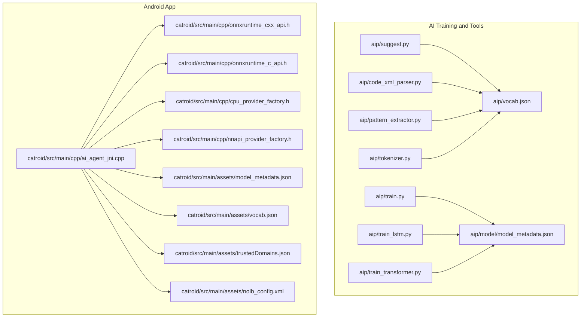
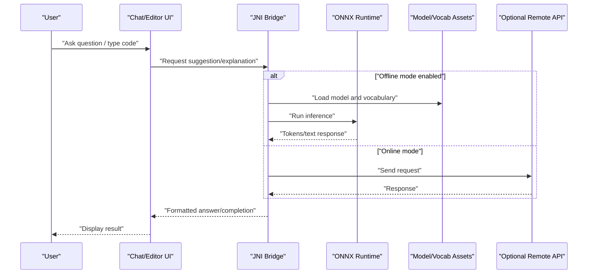
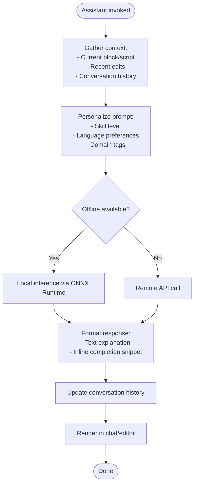
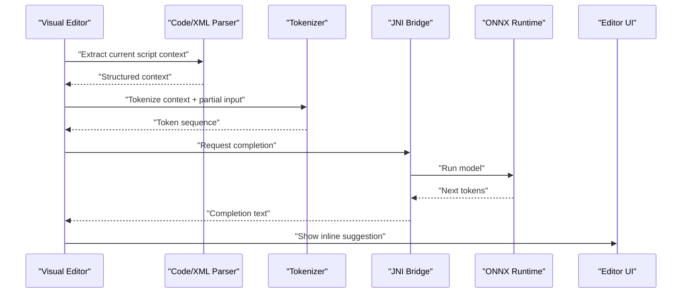
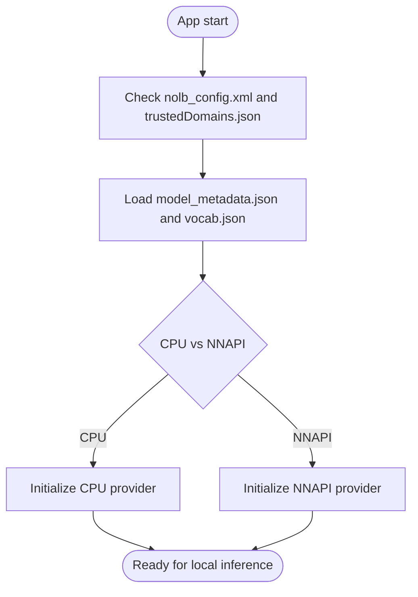
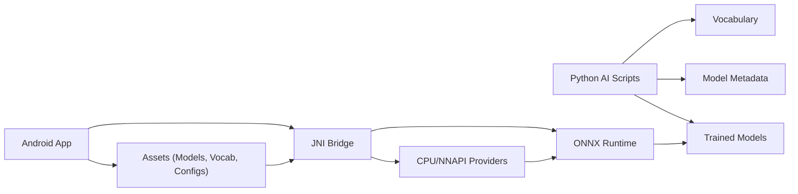

# AI Assistance Features

<cite>
**Referenced Files in This Document**
- [README.md](file://README.md)
- [task.md](file://task.md)
- [AGENTS.md](file://AGENTS.md)
- [suggest.py](file://aip/suggest.py)
- [train.py](file://aip/train.py)
- [train_lstm.py](file://aip/train_lstm.py)
- [train_transformer.py](file://aip/train_transformer.py)
- [code_xml_parser.py](file://aip/code_xml_parser.py)
- [pattern_extractor.py](file://aip/pattern_extractor.py)
- [tokenizer.py](file://aip/tokenizer.py)
- [model_metadata.json](file://aip/model/model_metadata.json)
- [vocab.json](file://aip/vocab.json)
- [ai_agent_jni.cpp](file://catroid/src/main/cpp/ai_agent_jni.cpp)
- [cpu_provider_factory.h](file://catroid/src/main/cpp/cpu_provider_factory.h)
- [nnapi_provider_factory.h](file://catroid/src/main/cpp/nnapi_provider_factory.h)
- [onnxruntime_c_api.h](file://catroid/src/main/cpp/onnxruntime_c_api.h)
- [onnxruntime_cxx_api.h](file://catroid/src/main/cpp/onnxruntime_cxx_api.h)
- [onnxruntime_lite_custom_op.h](file://catroid/src/main/cpp/onnxruntime_lite_custom_op.h)
- [onnxruntime_run_options_config_keys.h](file://catroid/src/main/cpp/onnxruntime_run_options_config_keys.h)
- [onnxruntime_session_options_config_keys.h](file://catroid/src/main/cpp/onnxruntime_session_options_config_keys.h)
- [onnxruntime_float16.h](file://catroid/src/main/cpp/onnxruntime_float16.h)
- [model_metadata.json](file://catroid/src/main/assets/model_metadata.json)
- [vocab.json](file://catroid/src/main/assets/vocab.json)
- [trustedDomains.json](file://catroid/src/main/assets/trustedDomains.json)
- [nolb_config.xml](file://catroid/src/main/assets/nolb_config.xml)
- [build.gradle](file://catroid/build.gradle)
- [gradle.properties](file://gradle.properties)
- [settings.gradle](file://settings.gradle)
</cite>

## Table of Contents
1. [Introduction](#introduction)
2. [Project Structure](#project-structure)
3. [Core Components](#core-components)
4. [Architecture Overview](#architecture-overview)
5. [Detailed Component Analysis](#detailed-component-analysis)
6. [Dependency Analysis](#dependency-analysis)
7. [Performance Considerations](#performance-considerations)
8. [Troubleshooting Guide](#troubleshooting-guide)
9. [Conclusion](#conclusion)
10. [Appendices](#appendices)

## Introduction
This document explains the AI assistance features integrated into NewCatroid’s user interface, focusing on a chat-based assistant that provides real-time help, code suggestions, and troubleshooting guidance. It covers conversation flow, context preservation, personalization by skill level, integration with the visual programming editor (inline completion and error detection), customization options, domain-specific knowledge bases, privacy considerations, offline modes, and performance optimization for responsive interactions.

## Project Structure
The AI assistance capability spans training scripts, model assets, and Android runtime components:
- Training and inference utilities under aip/
- Native ONNX Runtime bindings and JNI bridge under catroid/src/main/cpp/
- Model and vocabulary assets under catroid/src/main/assets/
- Build configuration files at the project root and module level

**Diagram sources**
- [suggest.py](file://aip/suggest.py)
- [train.py](file://aip/train.py)
- [train_lstm.py](file://aip/train_lstm.py)
- [train_transformer.py](file://aip/train_transformer.py)
- [code_xml_parser.py](file://aip/code_xml_parser.py)
- [pattern_extractor.py](file://aip/pattern_extractor.py)
- [tokenizer.py](file://aip/tokenizer.py)
- [vocab.json](file://aip/vocab.json)
- [model_metadata.json](file://aip/model/model_metadata.json)
- [ai_agent_jni.cpp](file://catroid/src/main/cpp/ai_agent_jni.cpp)
- [onnxruntime_cxx_api.h](file://catroid/src/main/cpp/onnxruntime_cxx_api.h)
- [onnxruntime_c_api.h](file://catroid/src/main/cpp/onnxruntime_c_api.h)
- [cpu_provider_factory.h](file://catroid/src/main/cpp/cpu_provider_factory.h)
- [nnapi_provider_factory.h](file://catroid/src/main/cpp/nnapi_provider_factory.h)
- [model_metadata.json](file://catroid/src/main/assets/model_metadata.json)
- [vocab.json](file://catroid/src/main/assets/vocab.json)
- [trustedDomains.json](file://catroid/src/main/assets/trustedDomains.json)
- [nolb_config.xml](file://catroid/src/main/assets/nolb_config.xml)

**Section sources**
- [README.md](file://README.md)
- [task.md](file://task.md)
- [AGENTS.md](file://AGENTS.md)

## Core Components
- AI training and suggestion pipeline (Python):
  - Suggestion generation and training entry points
  - XML parsing for Catroid code structures
  - Pattern extraction and tokenization utilities
  - Vocabulary and model metadata management
- Android runtime integration:
  - JNI bridge to native ONNX Runtime
  - CPU and NNAPI provider factories
  - Asset loading for models and vocabularies
  - Network trust and local-only configuration

Key responsibilities:
- Convert project code and patterns into tokens and embeddings
- Train or load models for next-token prediction and explanation generation
- Serve suggestions and explanations via a chat UI
- Provide inline completions and error diagnostics in the editor
- Preserve conversation context and adapt to user skill level

**Section sources**
- [suggest.py](file://aip/suggest.py)
- [train.py](file://aip/train.py)
- [train_lstm.py](file://aip/train_lstm.py)
- [train_transformer.py](file://aip/train_transformer.py)
- [code_xml_parser.py](file://aip/code_xml_parser.py)
- [pattern_extractor.py](file://aip/pattern_extractor.py)
- [tokenizer.py](file://aip/tokenizer.py)
- [vocab.json](file://aip/vocab.json)
- [model_metadata.json](file://aip/model/model_metadata.json)
- [ai_agent_jni.cpp](file://catroid/src/main/cpp/ai_agent_jni.cpp)
- [onnxruntime_cxx_api.h](file://catroid/src/main/cpp/onnxruntime_cxx_api.h)
- [onnxruntime_c_api.h](file://catroid/src/main/cpp/onnxruntime_c_api.h)
- [cpu_provider_factory.h](file://catroid/src/main/cpp/cpu_provider_factory.h)
- [nnapi_provider_factory.h](file://catroid/src/main/cpp/nnapi_provider_factory.h)
- [model_metadata.json](file://catroid/src/main/assets/model_metadata.json)
- [vocab.json](file://catroid/src/main/assets/vocab.json)
- [trustedDomains.json](file://catroid/src/main/assets/trustedDomains.json)
- [nolb_config.xml](file://catroid/src/main/assets/nolb_config.xml)

## Architecture Overview
The system comprises three layers:
- Data and training layer (Python): parses Catroid projects, extracts patterns, builds vocabularies, trains models, and produces artifacts.
- Runtime layer (Android + JNI + ONNX Runtime): loads models and vocabularies, executes inference locally, and exposes APIs to the app.
- UI layer (Chat and Editor): presents conversational assistance, inline completions, and contextual diagnostics.

**Diagram sources**
- [ai_agent_jni.cpp](file://catroid/src/main/cpp/ai_agent_jni.cpp)
- [onnxruntime_cxx_api.h](file://catroid/src/main/cpp/onnxruntime_cxx_api.h)
- [onnxruntime_c_api.h](file://catroid/src/main/cpp/onnxruntime_c_api.h)
- [model_metadata.json](file://catroid/src/main/assets/model_metadata.json)
- [vocab.json](file://catroid/src/main/assets/vocab.json)
- [trustedDomains.json](file://catroid/src/main/assets/trustedDomains.json)
- [nolb_config.xml](file://catroid/src/main/assets/nolb_config.xml)

## Detailed Component Analysis

### Chat-Based Assistant Flow
The assistant maintains a conversation history and adapts responses based on the current editor context and user profile.

[No sources needed since this diagram shows conceptual workflow, not actual code structure]

### Integration with Visual Programming Editor
Inline completion and error detection are provided by combining AST-like analysis of Catroid blocks with model-generated completions.

**Diagram sources**
- [code_xml_parser.py](file://aip/code_xml_parser.py)
- [tokenizer.py](file://aip/tokenizer.py)
- [ai_agent_jni.cpp](file://catroid/src/main/cpp/ai_agent_jni.cpp)
- [onnxruntime_cxx_api.h](file://catroid/src/main/cpp/onnxruntime_cxx_api.h)
- [onnxruntime_c_api.h](file://catroid/src/main/cpp/onnxruntime_c_api.h)

### Offline Assistance Mode
When offline mode is enabled, the app uses local assets and providers to run inference without network access.

**Diagram sources**
- [nolb_config.xml](file://catroid/src/main/assets/nolb_config.xml)
- [trustedDomains.json](file://catroid/src/main/assets/trustedDomains.json)
- [model_metadata.json](file://catroid/src/main/assets/model_metadata.json)
- [vocab.json](file://catroid/src/main/assets/vocab.json)
- [cpu_provider_factory.h](file://catroid/src/main/cpp/cpu_provider_factory.h)
- [nnapi_provider_factory.h](file://catroid/src/main/cpp/nnapi_provider_factory.h)

### Customizing AI Behavior
Customization points include:
- Prompt templates and personalization rules (skill level, language, domain)
- Domain-specific knowledge bases (curated examples, best practices)
- Model selection and parameters (temperature, top-k, max tokens)
- Provider selection (CPU/NNAPI) and quantization settings

Implementation anchors:
- Training and suggestion scripts for building tailored models
- Vocab and metadata for consistent tokenization and model discovery
- JNI bridge and ONNX Runtime options for runtime behavior

**Section sources**
- [suggest.py](file://aip/suggest.py)
- [train.py](file://aip/train.py)
- [train_lstm.py](file://aip/train_lstm.py)
- [train_transformer.py](file://aip/train_transformer.py)
- [vocab.json](file://aip/vocab.json)
- [model_metadata.json](file://aip/model/model_metadata.json)
- [ai_agent_jni.cpp](file://catroid/src/main/cpp/ai_agent_jni.cpp)
- [onnxruntime_run_options_config_keys.h](file://catroid/src/main/cpp/onnxruntime_run_options_config_keys.h)
- [onnxruntime_session_options_config_keys.h](file://catroid/src/main/cpp/onnxruntime_session_options_config_keys.h)

### Extending Assistance Capabilities
To extend capabilities:
- Add new parsers or extractors for additional project types
- Introduce custom tokenizers or vocab expansions
- Incorporate external knowledge bases into prompts or fine-tuning data
- Implement new providers or optimize existing ones

Relevant modules:
- Code parsing and pattern extraction
- Tokenization and vocabulary management
- Training pipelines for LSTM/Transformer variants
- JNI bridge for new inference paths

**Section sources**
- [code_xml_parser.py](file://aip/code_xml_parser.py)
- [pattern_extractor.py](file://aip/pattern_extractor.py)
- [tokenizer.py](file://aip/tokenizer.py)
- [vocab.json](file://aip/vocab.json)
- [train_lstm.py](file://aip/train_lstm.py)
- [train_transformer.py](file://aip/train_transformer.py)
- [ai_agent_jni.cpp](file://catroid/src/main/cpp/ai_agent_jni.cpp)

## Dependency Analysis
High-level dependencies across components:

**Diagram sources**
- [suggest.py](file://aip/suggest.py)
- [train.py](file://aip/train.py)
- [train_lstm.py](file://aip/train_lstm.py)
- [train_transformer.py](file://aip/train_transformer.py)
- [vocab.json](file://aip/vocab.json)
- [model_metadata.json](file://aip/model/model_metadata.json)
- [ai_agent_jni.cpp](file://catroid/src/main/cpp/ai_agent_jni.cpp)
- [onnxruntime_cxx_api.h](file://catroid/src/main/cpp/onnxruntime_cxx_api.h)
- [onnxruntime_c_api.h](file://catroid/src/main/cpp/onnxruntime_c_api.h)
- [cpu_provider_factory.h](file://catroid/src/main/cpp/cpu_provider_factory.h)
- [nnapi_provider_factory.h](file://catroid/src/main/cpp/nnapi_provider_factory.h)
- [model_metadata.json](file://catroid/src/main/assets/model_metadata.json)
- [vocab.json](file://catroid/src/main/assets/vocab.json)

Build and configuration dependencies:
- Gradle build orchestration and properties
- Module settings and platform targets

**Section sources**
- [build.gradle](file://catroid/build.gradle)
- [gradle.properties](file://gradle.properties)
- [settings.gradle](file://settings.gradle)

## Performance Considerations
- Prefer local inference when possible to reduce latency and preserve privacy
- Use NNAPI where supported for hardware acceleration; fall back to CPU otherwise
- Quantize models and use float16 support to reduce memory footprint and improve speed
- Cache frequent completions and reuse tokenizer outputs
- Limit context window size and prune irrelevant history to keep prompts concise
- Stream responses incrementally for perceived responsiveness
- Tune ONNX Runtime session and run options for device-specific performance

[No sources needed since this section provides general guidance]

## Troubleshooting Guide
Common issues and resolutions:
- Model not found or mismatched version: verify asset paths and metadata consistency
- Inference failures due to unsupported operators: check custom ops and ONNX Runtime compatibility
- Provider initialization errors: ensure correct CPU/NNAPI availability and permissions
- Network-related problems in online mode: validate trusted domains and connectivity
- High memory usage: reduce model size, enable quantization, or lower context length

Operational checkpoints:
- Confirm assets exist and are readable
- Validate provider selection logic
- Inspect ONNX Runtime logs for operator or shape mismatches
- Review configuration flags for offline mode and domain restrictions

**Section sources**
- [model_metadata.json](file://catroid/src/main/assets/model_metadata.json)
- [vocab.json](file://catroid/src/main/assets/vocab.json)
- [ai_agent_jni.cpp](file://catroid/src/main/cpp/ai_agent_jni.cpp)
- [onnxruntime_cxx_api.h](file://catroid/src/main/cpp/onnxruntime_cxx_api.h)
- [onnxruntime_c_api.h](file://catroid/src/main/cpp/onnxruntime_c_api.h)
- [cpu_provider_factory.h](file://catroid/src/main/cpp/cpu_provider_factory.h)
- [nnapi_provider_factory.h](file://catroid/src/main/cpp/nnapi_provider_factory.h)
- [trustedDomains.json](file://catroid/src/main/assets/trustedDomains.json)
- [nolb_config.xml](file://catroid/src/main/assets/nolb_config.xml)

## Conclusion
NewCatroid’s AI assistance integrates a robust training pipeline with an efficient Android runtime using ONNX Runtime. The chat-based assistant delivers contextual help, inline completions, and diagnostics while supporting offline operation and privacy-preserving design. By leveraging customizable prompts, domain knowledge bases, and optimized inference, developers can tailor the assistant to diverse educational and creative workflows.

## Appendices

### Privacy and Safety
- Offline-first design minimizes data exposure
- Trusted domains restrict remote calls
- Local-only configurations enforce privacy boundaries

**Section sources**
- [trustedDomains.json](file://catroid/src/main/assets/trustedDomains.json)
- [nolb_config.xml](file://catroid/src/main/assets/nolb_config.xml)

### Practical Examples
- Customize skill-level personalization by adjusting prompt templates and context filters
- Extend domain knowledge by adding curated examples to training data and updating vocabularies
- Enable NNAPI acceleration by selecting the appropriate provider factory and verifying device support

**Section sources**
- [suggest.py](file://aip/suggest.py)
- [train.py](file://aip/train.py)
- [train_transformer.py](file://aip/train_transformer.py)
- [vocab.json](file://aip/vocab.json)
- [model_metadata.json](file://aip/model/model_metadata.json)
- [ai_agent_jni.cpp](file://catroid/src/main/cpp/ai_agent_jni.cpp)
- [nnapi_provider_factory.h](file://catroid/src/main/cpp/nnapi_provider_factory.h)