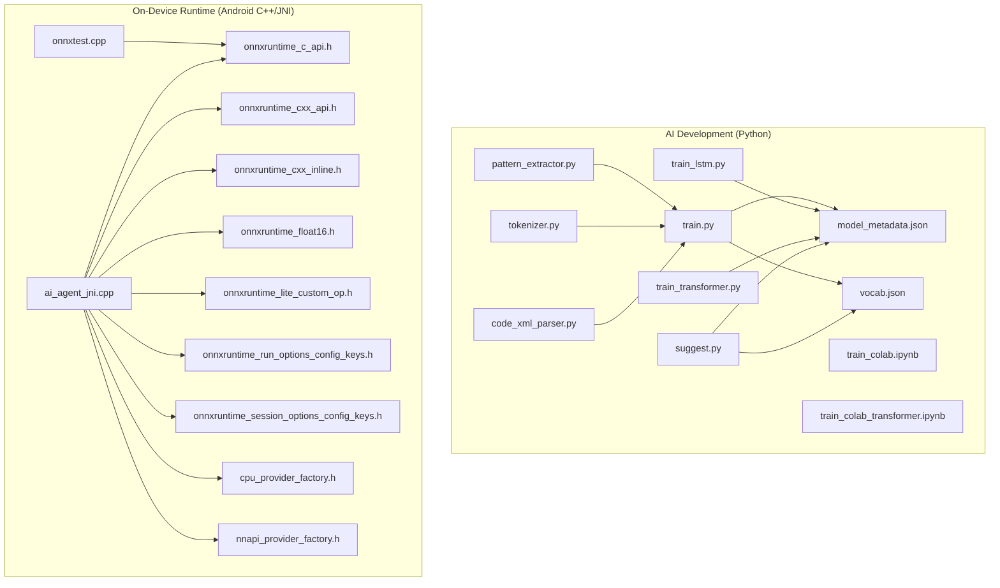
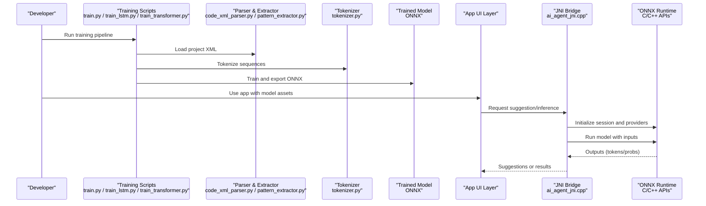
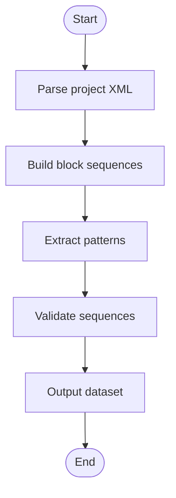
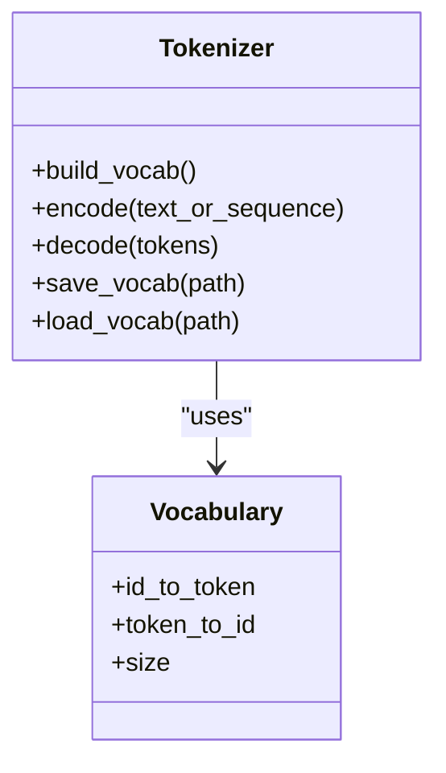
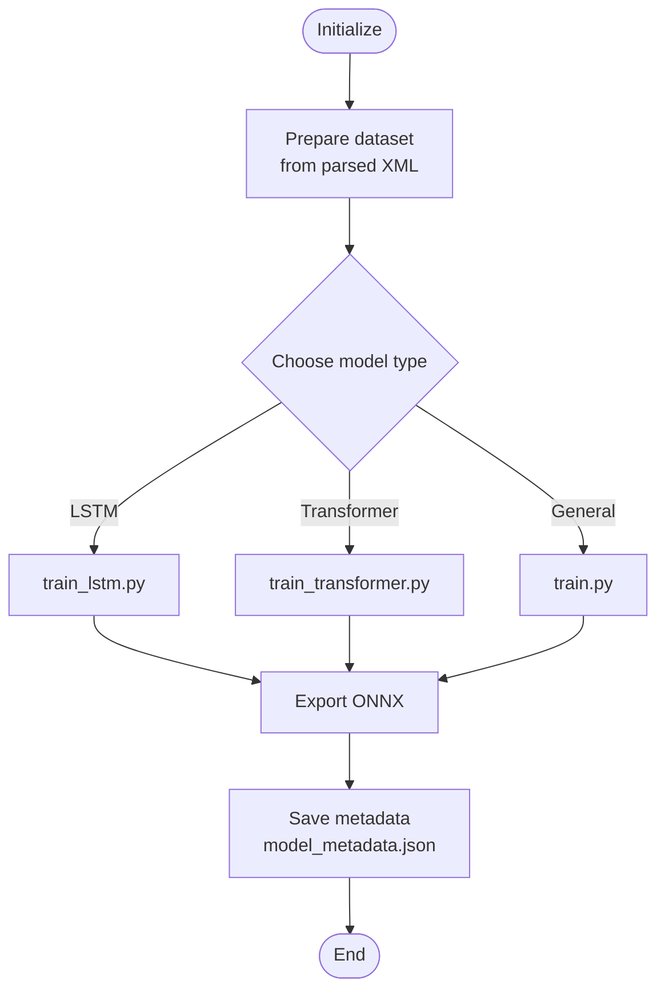
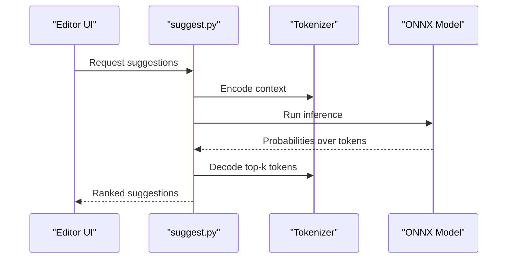
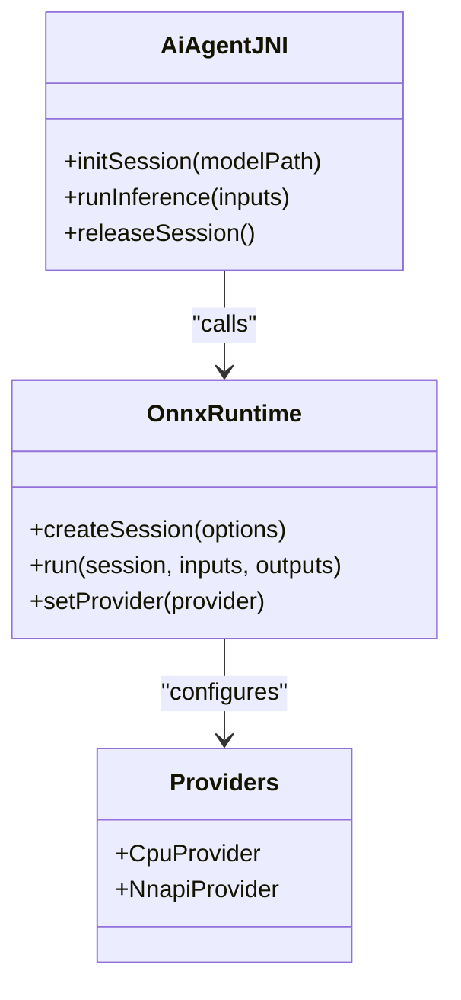
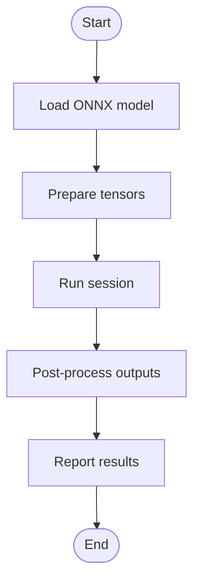
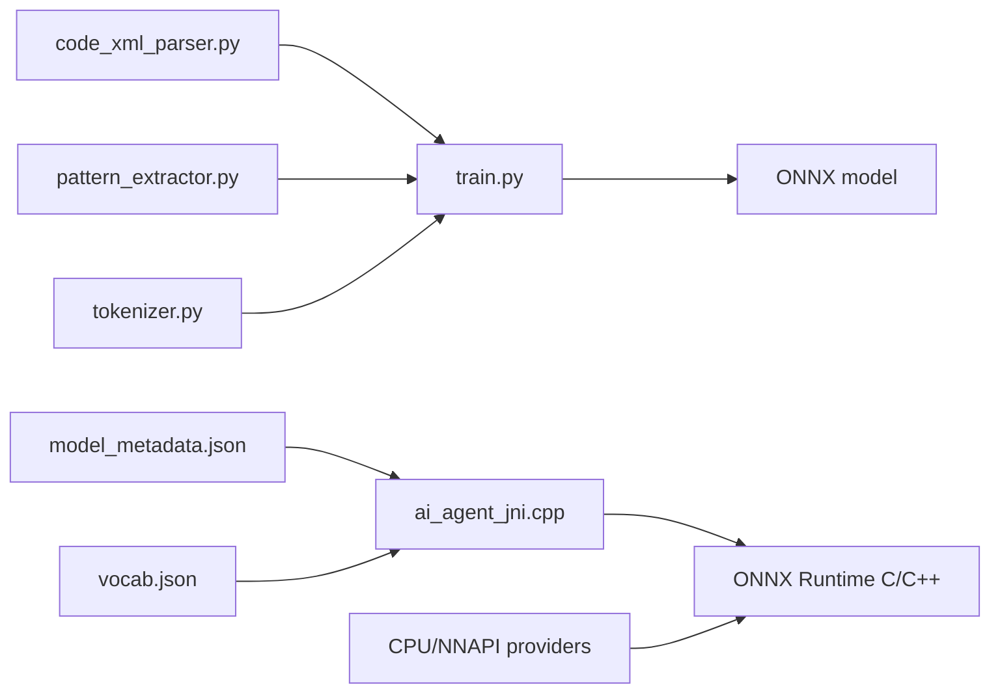

# AI and Machine Learning

<cite>
**Referenced Files in This Document**
- [aip/README_COLAB.txt](file://aip/README_COLAB.txt)
- [aip/code_xml_parser.py](file://aip/code_xml_parser.py)
- [aip/pattern_extractor.py](file://aip/pattern_extractor.py)
- [aip/tokenizer.py](file://aip/tokenizer.py)
- [aip/suggest.py](file://aip/suggest.py)
- [aip/train.py](file://aip/train.py)
- [aip/train_lstm.py](file://aip/train_lstm.py)
- [aip/train_transformer.py](file://aip/train_transformer.py)
- [aip/train_colab.ipynb](file://aip/train_colab.ipynb)
- [aip/train_colab_transformer.ipynb](file://aip/train_colab_transformer.ipynb)
- [aip/model/model_metadata.json](file://aip/model/model_metadata.json)
- [aip/model/vocab.json](file://aip/model/vocab.json)
- [catroid/src/main/assets/model_metadata.json](file://catroid/src/main/assets/model_metadata.json)
- [catroid/src/main/assets/vocab.json](file://catroid/src/main/assets/vocab.json)
- [catroid/src/main/cpp/onnxruntime_c_api.h](file://catroid/src/main/cpp/onnxruntime_c_api.h)
- [catroid/src/main/cpp/onnxruntime_cxx_api.h](file://catroid/src/main/cpp/onnxruntime_cxx_api.h)
- [catroid/src/main/cpp/onnxruntime_cxx_inline.h](file://catroid/src/main/cpp/onnxruntime_cxx_inline.h)
- [catroid/src/main/cpp/onnxruntime_float16.h](file://catroid/src/main/cpp/onnxruntime_float16.h)
- [catroid/src/main/cpp/onnxruntime_lite_custom_op.h](file://catroid/src/main/cpp/onnxruntime_lite_custom_op.h)
- [catroid/src/main/cpp/onnxruntime_run_options_config_keys.h](file://catroid/src/main/cpp/onnxruntime_run_options_config_keys.h)
- [catroid/src/main/cpp/onnxruntime_session_options_config_keys.h](file://catroid/src/main/cpp/onnxruntime_session_options_config_keys.h)
- [catroid/src/main/cpp/cpu_provider_factory.h](file://catroid/src/main/cpp/cpu_provider_factory.h)
- [catroid/src/main/cpp/nnapi_provider_factory.h](file://catroid/src/main/cpp/nnapi_provider_factory.h)
- [catroid/src/main/cpp/ai_agent_jni.cpp](file://catroid/src/main/cpp/ai_agent_jni.cpp)
- [catroid/src/main/cpp/onnxtest.cpp](file://catroid/src/main/cpp/onnxtest.cpp)
</cite>

## Table of Contents
1. [Introduction](#introduction)
2. [Project Structure](#project-structure)
3. [Core Components](#core-components)
4. [Architecture Overview](#architecture-overview)
5. [Detailed Component Analysis](#detailed-component-analysis)
6. [Dependency Analysis](#dependency-analysis)
7. [Performance Considerations](#performance-considerations)
8. [Troubleshooting Guide](#troubleshooting-guide)
9. [Conclusion](#conclusion)
10. [Appendices](#appendices)

## Introduction
This document explains NewCatroid’s AI and machine learning capabilities, focusing on:
- Code suggestion system using pattern recognition and context-aware algorithms
- Natural language processing for text-to-block conversion
- Intelligent assistance features
- ONNX runtime integration for executing pre-trained models
- Model training pipelines and inference optimization
- AI-powered code completion, error detection, and learning analytics
- Practical examples for custom AI features, training new models, and integrating third-party ML services
- Privacy considerations, offline model deployment, and performance optimization for on-device execution

The repository includes a Python-based AI pipeline under the aip directory and an Android runtime with ONNX Runtime C/C++ headers and JNI bindings to execute models on-device.

## Project Structure
NewCatroid organizes AI-related functionality across two main areas:
- Training and development tools (Python): scripts and notebooks for tokenization, pattern extraction, model training, and suggestions
- On-device runtime (Android C++/JNI): ONNX Runtime headers and JNI glue to load and run models at runtime

**Diagram sources**
- [aip/pattern_extractor.py](file://aip/pattern_extractor.py)
- [aip/tokenizer.py](file://aip/tokenizer.py)
- [aip/code_xml_parser.py](file://aip/code_xml_parser.py)
- [aip/train.py](file://aip/train.py)
- [aip/train_lstm.py](file://aip/train_lstm.py)
- [aip/train_transformer.py](file://aip/train_transformer.py)
- [aip/suggest.py](file://aip/suggest.py)
- [aip/train_colab.ipynb](file://aip/train_colab.ipynb)
- [aip/train_colab_transformer.ipynb](file://aip/train_colab_transformer.ipynb)
- [aip/model/model_metadata.json](file://aip/model/model_metadata.json)
- [aip/model/vocab.json](file://aip/model/vocab.json)
- [catroid/src/main/cpp/ai_agent_jni.cpp](file://catroid/src/main/cpp/ai_agent_jni.cpp)
- [catroid/src/main/cpp/onnxruntime_c_api.h](file://catroid/src/main/cpp/onnxruntime_c_api.h)
- [catroid/src/main/cpp/onnxruntime_cxx_api.h](file://catroid/src/main/cpp/onnxruntime_cxx_api.h)
- [catroid/src/main/cpp/onnxruntime_cxx_inline.h](file://catroid/src/main/cpp/onnxruntime_cxx_inline.h)
- [catroid/src/main/cpp/onnxruntime_float16.h](file://catroid/src/main/cpp/onnxruntime_float16.h)
- [catroid/src/main/cpp/onnxruntime_lite_custom_op.h](file://catroid/src/main/cpp/onnxruntime_lite_custom_op.h)
- [catroid/src/main/cpp/onnxruntime_run_options_config_keys.h](file://catroid/src/main/cpp/onnxruntime_run_options_config_keys.h)
- [catroid/src/main/cpp/onnxruntime_session_options_config_keys.h](file://catroid/src/main/cpp/onnxruntime_session_options_config_keys.h)
- [catroid/src/main/cpp/cpu_provider_factory.h](file://catroid/src/main/cpp/cpu_provider_factory.h)
- [catroid/src/main/cpp/nnapi_provider_factory.h](file://catroid/src/main/cpp/nnapi_provider_factory.h)
- [catroid/src/main/cpp/onnxtest.cpp](file://catroid/src/main/cpp/onnxtest.cpp)

**Section sources**
- [aip/README_COLAB.txt](file://aip/README_COLAB.txt)
- [aip/model/model_metadata.json](file://aip/model/model_metadata.json)
- [aip/model/vocab.json](file://aip/model/vocab.json)
- [catroid/src/main/assets/model_metadata.json](file://catroid/src/main/assets/model_metadata.json)
- [catroid/src/main/assets/vocab.json](file://catroid/src/main/assets/vocab.json)

## Core Components
- Pattern extraction and parsing
  - XML code parser to convert Catroid project structures into sequences suitable for modeling
  - Pattern extractor to identify recurring block sequences and structural motifs
- Tokenization and vocabulary management
  - Tokenizer to map blocks and attributes to tokens
  - Vocabulary files used by both training and inference
- Training pipelines
  - General training entry point
  - LSTM-based sequence model training
  - Transformer-based sequence model training
  - Colab notebooks for reproducible training workflows
- Suggestion engine
  - Context-aware code suggestion based on trained models and current editing context
- On-device inference
  - JNI bridge to call ONNX Runtime from Java/Kotlin UI layers
  - CPU and NNAPI provider factories for optimized execution paths
  - Example test harness for ONNX execution

Key responsibilities:
- Data preparation and feature engineering (parsing, tokenization)
- Model training and export to ONNX format
- Runtime loading and execution of ONNX models
- Integration points between UI and native inference

**Section sources**
- [aip/code_xml_parser.py](file://aip/code_xml_parser.py)
- [aip/pattern_extractor.py](file://aip/pattern_extractor.py)
- [aip/tokenizer.py](file://aip/tokenizer.py)
- [aip/train.py](file://aip/train.py)
- [aip/train_lstm.py](file://aip/train_lstm.py)
- [aip/train_transformer.py](file://aip/train_transformer.py)
- [aip/suggest.py](file://aip/suggest.py)
- [catroid/src/main/cpp/ai_agent_jni.cpp](file://catroid/src/main/cpp/ai_agent_jni.cpp)
- [catroid/src/main/cpp/cpu_provider_factory.h](file://catroid/src/main/cpp/cpu_provider_factory.h)
- [catroid/src/main/cpp/nnapi_provider_factory.h](file://catroid/src/main/cpp/nnapi_provider_factory.h)

## Architecture Overview
High-level flow from data to on-device inference:

**Diagram sources**
- [aip/train.py](file://aip/train.py)
- [aip/train_lstm.py](file://aip/train_lstm.py)
- [aip/train_transformer.py](file://aip/train_transformer.py)
- [aip/code_xml_parser.py](file://aip/code_xml_parser.py)
- [aip/pattern_extractor.py](file://aip/pattern_extractor.py)
- [aip/tokenizer.py](file://aip/tokenizer.py)
- [catroid/src/main/cpp/ai_agent_jni.cpp](file://catroid/src/main/cpp/ai_agent_jni.cpp)
- [catroid/src/main/cpp/onnxruntime_c_api.h](file://catroid/src/main/cpp/onnxruntime_c_api.h)
- [catroid/src/main/cpp/onnxruntime_cxx_api.h](file://catroid/src/main/cpp/onnxruntime_cxx_api.h)

## Detailed Component Analysis

### Code Parsing and Pattern Extraction
Responsibilities:
- Convert Catroid project XML into structured sequences
- Identify patterns and recurring block combinations
- Prepare datasets for training

**Diagram sources**
- [aip/code_xml_parser.py](file://aip/code_xml_parser.py)
- [aip/pattern_extractor.py](file://aip/pattern_extractor.py)

**Section sources**
- [aip/code_xml_parser.py](file://aip/code_xml_parser.py)
- [aip/pattern_extractor.py](file://aip/pattern_extractor.py)

### Tokenization and Vocabulary Management
Responsibilities:
- Map blocks and attributes to integer tokens
- Maintain vocabulary files for consistent encoding/decoding
- Provide utilities for serialization/deserialization

**Diagram sources**
- [aip/tokenizer.py](file://aip/tokenizer.py)
- [aip/model/vocab.json](file://aip/model/vocab.json)
- [catroid/src/main/assets/vocab.json](file://catroid/src/main/assets/vocab.json)

**Section sources**
- [aip/tokenizer.py](file://aip/tokenizer.py)
- [aip/model/vocab.json](file://aip/model/vocab.json)
- [catroid/src/main/assets/vocab.json](file://catroid/src/main/assets/vocab.json)

### Training Pipelines
Components:
- General training entry point
- LSTM-based sequence model training
- Transformer-based sequence model training
- Colab notebooks for cloud-based training

**Diagram sources**
- [aip/train.py](file://aip/train.py)
- [aip/train_lstm.py](file://aip/train_lstm.py)
- [aip/train_transformer.py](file://aip/train_transformer.py)
- [aip/train_colab.ipynb](file://aip/train_colab.ipynb)
- [aip/train_colab_transformer.ipynb](file://aip/train_colab_transformer.ipynb)
- [aip/model/model_metadata.json](file://aip/model/model_metadata.json)

**Section sources**
- [aip/train.py](file://aip/train.py)
- [aip/train_lstm.py](file://aip/train_lstm.py)
- [aip/train_transformer.py](file://aip/train_transformer.py)
- [aip/train_colab.ipynb](file://aip/train_colab.ipynb)
- [aip/train_colab_transformer.ipynb](file://aip/train_colab_transformer.ipynb)
- [aip/model/model_metadata.json](file://aip/model/model_metadata.json)

### Suggestion Engine
Responsibilities:
- Generate next-token or next-block suggestions
- Incorporate context from current editor state
- Rank candidates using model probabilities

**Diagram sources**
- [aip/suggest.py](file://aip/suggest.py)
- [aip/tokenizer.py](file://aip/tokenizer.py)
- [aip/model/model_metadata.json](file://aip/model/model_metadata.json)

**Section sources**
- [aip/suggest.py](file://aip/suggest.py)
- [aip/tokenizer.py](file://aip/tokenizer.py)
- [aip/model/model_metadata.json](file://aip/model/model_metadata.json)

### On-Device Inference via ONNX Runtime
Responsibilities:
- JNI bridge to initialize ONNX sessions
- Configure providers (CPU, NNAPI)
- Execute models with prepared inputs
- Return outputs to Java/Kotlin layers

**Diagram sources**
- [catroid/src/main/cpp/ai_agent_jni.cpp](file://catroid/src/main/cpp/ai_agent_jni.cpp)
- [catroid/src/main/cpp/onnxruntime_c_api.h](file://catroid/src/main/cpp/onnxruntime_c_api.h)
- [catroid/src/main/cpp/onnxruntime_cxx_api.h](file://catroid/src/main/cpp/onnxruntime_cxx_api.h)
- [catroid/src/main/cpp/onnxruntime_cxx_inline.h](file://catroid/src/main/cpp/onnxruntime_cxx_inline.h)
- [catroid/src/main/cpp/onnxruntime_float16.h](file://catroid/src/main/cpp/onnxruntime_float16.h)
- [catroid/src/main/cpp/onnxruntime_lite_custom_op.h](file://catroid/src/main/cpp/onnxruntime_lite_custom_op.h)
- [catroid/src/main/cpp/onnxruntime_run_options_config_keys.h](file://catroid/src/main/cpp/onnxruntime_run_options_config_keys.h)
- [catroid/src/main/cpp/onnxruntime_session_options_config_keys.h](file://catroid/src/main/cpp/onnxruntime_session_options_config_keys.h)
- [catroid/src/main/cpp/cpu_provider_factory.h](file://catroid/src/main/cpp/cpu_provider_factory.h)
- [catroid/src/main/cpp/nnapi_provider_factory.h](file://catroid/src/main/cpp/nnapi_provider_factory.h)

**Section sources**
- [catroid/src/main/cpp/ai_agent_jni.cpp](file://catroid/src/main/cpp/ai_agent_jni.cpp)
- [catroid/src/main/cpp/onnxruntime_c_api.h](file://catroid/src/main/cpp/onnxruntime_c_api.h)
- [catroid/src/main/cpp/onnxruntime_cxx_api.h](file://catroid/src/main/cpp/onnxruntime_cxx_api.h)
- [catroid/src/main/cpp/onnxruntime_cxx_inline.h](file://catroid/src/main/cpp/onnxruntime_cxx_inline.h)
- [catroid/src/main/cpp/onnxruntime_float16.h](file://catroid/src/main/cpp/onnxruntime_float16.h)
- [catroid/src/main/cpp/onnxruntime_lite_custom_op.h](file://catroid/src/main/cpp/onnxruntime_lite_custom_op.h)
- [catroid/src/main/cpp/onnxruntime_run_options_config_keys.h](file://catroid/src/main/cpp/onnxruntime_run_options_config_keys.h)
- [catroid/src/main/cpp/onnxruntime_session_options_config_keys.h](file://catroid/src/main/cpp/onnxruntime_session_options_config_keys.h)
- [catroid/src/main/cpp/cpu_provider_factory.h](file://catroid/src/main/cpp/cpu_provider_factory.h)
- [catroid/src/main/cpp/nnapi_provider_factory.h](file://catroid/src/main/cpp/nnapi_provider_factory.h)

### Example Test Harness
Purpose:
- Validate ONNX execution path
- Demonstrate input/output handling

**Diagram sources**
- [catroid/src/main/cpp/onnxtest.cpp](file://catroid/src/main/cpp/onnxtest.cpp)
- [catroid/src/main/cpp/onnxruntime_c_api.h](file://catroid/src/main/cpp/onnxruntime_c_api.h)

**Section sources**
- [catroid/src/main/cpp/onnxtest.cpp](file://catroid/src/main/cpp/onnxtest.cpp)

## Dependency Analysis
Relationships among components:
- Training scripts depend on parsers, extractors, and tokenizers
- Trained models are exported alongside metadata and vocabularies
- On-device runtime depends on ONNX Runtime headers and provider factories
- JNI layer bridges UI requests to native inference

**Diagram sources**
- [aip/code_xml_parser.py](file://aip/code_xml_parser.py)
- [aip/pattern_extractor.py](file://aip/pattern_extractor.py)
- [aip/tokenizer.py](file://aip/tokenizer.py)
- [aip/train.py](file://aip/train.py)
- [aip/model/model_metadata.json](file://aip/model/model_metadata.json)
- [aip/model/vocab.json](file://aip/model/vocab.json)
- [catroid/src/main/cpp/ai_agent_jni.cpp](file://catroid/src/main/cpp/ai_agent_jni.cpp)
- [catroid/src/main/cpp/onnxruntime_c_api.h](file://catroid/src/main/cpp/onnxruntime_c_api.h)
- [catroid/src/main/cpp/cpu_provider_factory.h](file://catroid/src/main/cpp/cpu_provider_factory.h)
- [catroid/src/main/cpp/nnapi_provider_factory.h](file://catroid/src/main/cpp/nnapi_provider_factory.h)

**Section sources**
- [aip/train.py](file://aip/train.py)
- [aip/model/model_metadata.json](file://aip/model/model_metadata.json)
- [aip/model/vocab.json](file://aip/model/vocab.json)
- [catroid/src/main/cpp/ai_agent_jni.cpp](file://catroid/src/main/cpp/ai_agent_jni.cpp)

## Performance Considerations
- Provider selection
  - Prefer NNAPI when available for hardware acceleration; fall back to CPU otherwise
- Model size and precision
  - Quantized or float16 models can reduce memory footprint and improve speed
- Session initialization
  - Cache initialized sessions to avoid repeated setup overhead
- Input batching
  - Batch multiple inference requests where possible to amortize overhead
- Memory management
  - Release sessions promptly and reuse buffers
- I/O optimization
  - Store models and vocabularies in assets for fast access

[No sources needed since this section provides general guidance]

## Troubleshooting Guide
Common issues and resolutions:
- Model not found or mismatched metadata
  - Ensure model_metadata.json aligns with the deployed model version and architecture
- Vocabulary mismatch
  - Verify that vocab.json is synchronized between training and runtime
- Provider initialization failures
  - Check device support for NNAPI; fallback to CPU if unavailable
- JNI linkage errors
  - Confirm native libraries are built for the target ABI and linked against ONNX Runtime
- Incorrect tensor shapes
  - Validate input dimensions match model expectations; use the example test harness to verify

**Section sources**
- [aip/model/model_metadata.json](file://aip/model/model_metadata.json)
- [catroid/src/main/assets/model_metadata.json](file://catroid/src/main/assets/model_metadata.json)
- [catroid/src/main/assets/vocab.json](file://catroid/src/main/assets/vocab.json)
- [catroid/src/main/cpp/ai_agent_jni.cpp](file://catroid/src/main/cpp/ai_agent_jni.cpp)
- [catroid/src/main/cpp/onnxruntime_c_api.h](file://catroid/src/main/cpp/onnxruntime_c_api.h)

## Conclusion
NewCatroid’s AI stack combines a robust Python training pipeline with an efficient on-device inference layer powered by ONNX Runtime. The system supports pattern-based code suggestions, transformer/LSTM sequence modeling, and practical deployment strategies for privacy-preserving, offline-first experiences. By following the provided structure and best practices, developers can extend capabilities, integrate new models, and optimize performance for diverse devices.

[No sources needed since this section summarizes without analyzing specific files]

## Appendices

### Practical Examples and How-To Guides
- Implementing custom AI features
  - Extend the tokenizer to include domain-specific tokens
  - Add new parsers to capture additional project elements
  - Integrate third-party ML services via network calls in the UI layer, with caching and fallbacks
- Training new models
  - Use the Colab notebooks for reproducible experiments
  - Export models to ONNX and update metadata and vocabularies
  - Validate with the example test harness before deployment
- Integrating third-party ML services
  - Wrap service calls behind a unified interface
  - Cache responses locally and handle connectivity gracefully
  - Respect user privacy and consent settings

[No sources needed since this section provides general guidance]