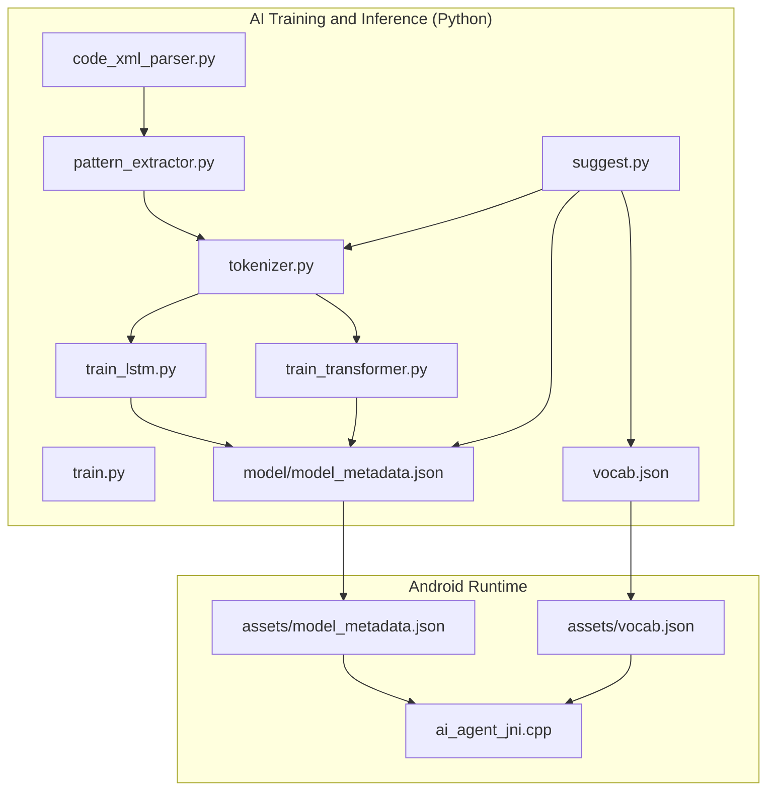
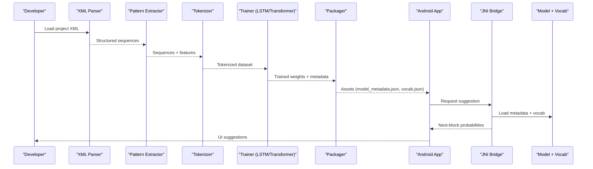
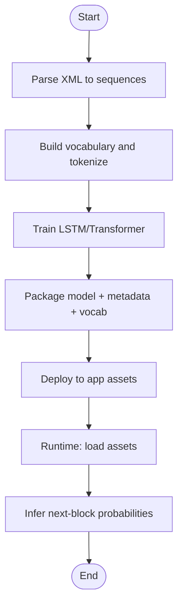
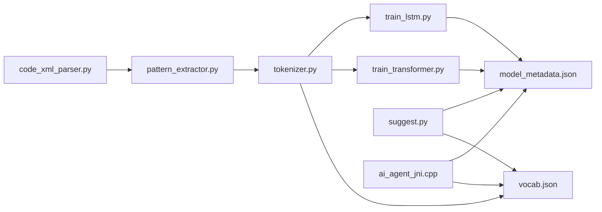

# Code Suggestion System

<cite>
**Referenced Files in This Document**
- [README_COLAB.txt](file://aip/README_COLAB.txt)
- [code_xml_parser.py](file://aip/code_xml_parser.py)
- [pattern_extractor.py](file://aip/pattern_extractor.py)
- [tokenizer.py](file://aip/tokenizer.py)
- [train.py](file://aip/train.py)
- [train_lstm.py](file://aip/train_lstm.py)
- [train_transformer.py](file://aip/train_transformer.py)
- [suggest.py](file://aip/suggest.py)
- [model_metadata.json](file://aip/model/model_metadata.json)
- [vocab.json](file://aip/vocab.json)
- [ai_agent_jni.cpp](file://catroid/src/main/cpp/ai_agent_jni.cpp)
- [model_metadata.json](file://catroid/src/main/assets/model_metadata.json)
- [vocab.json](file://catroid/src/main/assets/vocab.json)
</cite>

## Table of Contents
1. [Introduction](#introduction)
2. [Project Structure](#project-structure)
3. [Core Components](#core-components)
4. [Architecture Overview](#architecture-overview)
5. [Detailed Component Analysis](#detailed-component-analysis)
6. [Dependency Analysis](#dependency-analysis)
7. [Performance Considerations](#performance-considerations)
8. [Troubleshooting Guide](#troubleshooting-guide)
9. [Conclusion](#conclusion)
10. [Appendices](#appendices)

## Introduction
This document explains NewCatroid’s code suggestion system, focusing on how existing Catroid block programs are analyzed to produce intelligent suggestions. It covers:
- Pattern recognition algorithms that extract recurring sequences from project XML
- A context-aware suggestion engine that considers program state and block relationships
- Vocabulary management for tokenization and natural language processing
- Practical guidance for implementing custom patterns, training domain-specific models, and optimizing accuracy
- Performance considerations for real-time suggestions and memory management for large codebases

The system is implemented as a Python-based training and inference pipeline with Android-side integration via JNI.

## Project Structure
The code suggestion system spans two main areas:
- AI training and inference scripts under the aip directory
- Android runtime assets and JNI bridge for model loading and inference

**Diagram sources**
- [code_xml_parser.py](file://aip/code_xml_parser.py)
- [pattern_extractor.py](file://aip/pattern_extractor.py)
- [tokenizer.py](file://aip/tokenizer.py)
- [train_lstm.py](file://aip/train_lstm.py)
- [train_transformer.py](file://aip/train_transformer.py)
- [train.py](file://aip/train.py)
- [suggest.py](file://aip/suggest.py)
- [model_metadata.json](file://aip/model/model_metadata.json)
- [vocab.json](file://aip/vocab.json)
- [model_metadata.json](file://catroid/src/main/assets/model_metadata.json)
- [vocab.json](file://catroid/src/main/assets/vocab.json)
- [ai_agent_jni.cpp](file://catroid/src/main/cpp/ai_agent_jni.cpp)

**Section sources**
- [README_COLAB.txt](file://aip/README_COLAB.txt)

## Core Components
- XML Parser: Converts Catroid project XML into structured sequences suitable for pattern mining.
- Pattern Extractor: Identifies frequent or meaningful block sequences and relationships.
- Tokenizer: Builds and manages vocabulary mappings used by both training and inference.
- Trainers: LSTM and Transformer training pipelines; core training utilities.
- Suggestion Engine: Loads trained models and vocabulary to generate next-block predictions at runtime.
- Android Integration: JNI layer loads models and vocabulary from app assets and performs inference.

Key responsibilities:
- Data ingestion and normalization
- Sequence modeling and prediction
- Vocabulary lifecycle and caching
- Model packaging and deployment

**Section sources**
- [code_xml_parser.py](file://aip/code_xml_parser.py)
- [pattern_extractor.py](file://aip/pattern_extractor.py)
- [tokenizer.py](file://aip/tokenizer.py)
- [train_lstm.py](file://aip/train_lstm.py)
- [train_transformer.py](file://aip/train_transformer.py)
- [train.py](file://aip/train.py)
- [suggest.py](file://aip/suggest.py)
- [ai_agent_jni.cpp](file://catroid/src/main/cpp/ai_agent_jni.cpp)

## Architecture Overview
High-level flow from data to suggestions:
- Parse project XML into sequences
- Build vocabulary and tokenize sequences
- Train sequence models (LSTM/Transformer)
- Package metadata and vocabulary for deployment
- At runtime, load assets and run inference to suggest next blocks

**Diagram sources**
- [code_xml_parser.py](file://aip/code_xml_parser.py)
- [pattern_extractor.py](file://aip/pattern_extractor.py)
- [tokenizer.py](file://aip/tokenizer.py)
- [train_lstm.py](file://aip/train_lstm.py)
- [train_transformer.py](file://aip/train_transformer.py)
- [model_metadata.json](file://aip/model/model_metadata.json)
- [vocab.json](file://aip/vocab.json)
- [ai_agent_jni.cpp](file://catroid/src/main/cpp/ai_agent_jni.cpp)

## Detailed Component Analysis

### XML Parser
Purpose:
- Read Catroid project XML
- Normalize structure into ordered sequences of blocks and parameters
- Provide consistent input for downstream pattern extraction

Design notes:
- Focuses on deterministic traversal of event-triggered scripts and block hierarchies
- Emits canonical representations to improve reproducibility across projects

**Section sources**
- [code_xml_parser.py](file://aip/code_xml_parser.py)

### Pattern Extractor
Purpose:
- Identify frequent or semantically meaningful block sequences
- Capture relationships between blocks (e.g., control-flow, variable usage)
- Produce training-ready sequences and optional features

Design notes:
- Uses sliding windows and frequency thresholds to prune noise
- Can be extended with domain-specific heuristics for better recall

**Section sources**
- [pattern_extractor.py](file://aip/pattern_extractor.py)

### Tokenizer and Vocabulary Management
Purpose:
- Map tokens to integer IDs and back
- Maintain vocabulary consistency across training and inference
- Support special tokens (padding, unknown, start/end)

Design notes:
- Vocabulary file is persisted and shared with Android assets
- Supports incremental updates when adding new block types or parameters

**Section sources**
- [tokenizer.py](file://aip/tokenizer.py)
- [vocab.json](file://aip/vocab.json)

### Training Pipelines (LSTM and Transformer)
Purpose:
- Learn predictive distributions over next tokens/blocks given context
- Optimize hyperparameters and validate performance
- Export artifacts consumed by the suggestion engine

Design notes:
- Shared tokenizer interface ensures compatibility between models
- Metadata captures architecture details, vocab size, and versioning

**Section sources**
- [train_lstm.py](file://aip/train_lstm.py)
- [train_transformer.py](file://aip/train_transformer.py)
- [train.py](file://aip/train.py)
- [model_metadata.json](file://aip/model/model_metadata.json)

### Suggestion Engine
Purpose:
- Load model and vocabulary
- Accept current program context
- Return ranked next-block candidates

Design notes:
- Context window length and temperature can be tuned for responsiveness vs. creativity
- Integrates with Android via JNI for low-latency inference

**Section sources**
- [suggest.py](file://aip/suggest.py)
- [model_metadata.json](file://aip/model/model_metadata.json)
- [vocab.json](file://aip/vocab.json)

### Android Integration (JNI)
Purpose:
- Load model metadata and vocabulary from app assets
- Perform inference on device
- Expose a stable C++ API to Java/Kotlin layers

Design notes:
- Assets include model metadata and vocabulary JSON files
- JNI bridges model loading, tokenization, and decoding steps

**Section sources**
- [ai_agent_jni.cpp](file://catroid/src/main/cpp/ai_agent_jni.cpp)
- [model_metadata.json](file://catroid/src/main/assets/model_metadata.json)
- [vocab.json](file://catroid/src/main/assets/vocab.json)

### Conceptual Overview
The suggestion system follows a classic ML pipeline:
- Data preparation (parsing and tokenizing)
- Model training (sequence modeling)
- Packaging and deployment (assets)
- Runtime inference (JNI-backed)

[No sources needed since this diagram shows conceptual workflow, not actual code structure]

## Dependency Analysis
Internal dependencies:
- Parser feeds Extractor
- Extractor feeds Tokenizer
- Tokenizer feeds Trainers
- Trainers produce artifacts consumed by Suggestion Engine
- Suggestion Engine depends on Tokenizer and Metadata/Vocabulary
- Android JNI depends on packaged assets

External dependencies:
- Python ML libraries (as implied by training scripts)
- ONNX/C++ runtime components referenced by JNI headers

**Diagram sources**
- [code_xml_parser.py](file://aip/code_xml_parser.py)
- [pattern_extractor.py](file://aip/pattern_extractor.py)
- [tokenizer.py](file://aip/tokenizer.py)
- [train_lstm.py](file://aip/train_lstm.py)
- [train_transformer.py](file://aip/train_transformer.py)
- [model_metadata.json](file://aip/model/model_metadata.json)
- [vocab.json](file://aip/vocab.json)
- [suggest.py](file://aip/suggest.py)
- [ai_agent_jni.cpp](file://catroid/src/main/cpp/ai_agent_jni.cpp)

**Section sources**
- [README_COLAB.txt](file://aip/README_COLAB.txt)

## Performance Considerations
- Real-time latency
  - Use an appropriate context window to balance accuracy and speed
  - Prefer quantized or optimized models where supported by the runtime
  - Cache tokenized contexts and reuse embeddings when possible
- Memory management
  - Keep vocabulary compact; remove rare tokens during preprocessing
  - Stream or chunk large datasets during training to avoid OOM
  - On-device, unload unused models and release buffers after inference
- Throughput
  - Batch inference only if it does not degrade interactivity
  - Precompute static parts of context (e.g., stage variables) when safe
- Accuracy tuning
  - Adjust temperature and top-k/top-p sampling for desired creativity
  - Retrain periodically with updated project corpora
  - Validate using held-out projects to prevent overfitting

[No sources needed since this section provides general guidance]

## Troubleshooting Guide
Common issues and remedies:
- Mismatched vocabulary sizes
  - Ensure training and runtime use the same vocab.json and metadata
  - Rebuild assets after any vocabulary changes
- Incorrect model metadata
  - Verify architecture fields match the trained model
  - Confirm version tags align with asset deployment
- JNI loading failures
  - Check that assets exist and paths are correct
  - Validate that the native library matches the target ABI
- Poor suggestion quality
  - Increase corpus diversity and size
  - Tune context window length and sampling parameters
  - Add domain-specific patterns to the extractor

**Section sources**
- [model_metadata.json](file://aip/model/model_metadata.json)
- [vocab.json](file://aip/vocab.json)
- [ai_agent_jni.cpp](file://catroid/src/main/cpp/ai_agent_jni.cpp)

## Conclusion
NewCatroid’s code suggestion system combines robust data parsing, flexible pattern extraction, and modern sequence modeling to deliver contextual block completions. By maintaining strict vocabulary and metadata contracts between training and runtime, and by leveraging JNI for efficient on-device inference, the system achieves practical performance for interactive development. Extending the pattern extractor and retraining with domain corpora enables tailored suggestions for specialized programming tasks.

[No sources needed since this section summarizes without analyzing specific files]

## Appendices

### Implementing Custom Suggestion Patterns
- Extend the pattern extractor to recognize domain-specific sequences
- Introduce new tokens and update the vocabulary consistently
- Retrain models and redeploy assets

**Section sources**
- [pattern_extractor.py](file://aip/pattern_extractor.py)
- [tokenizer.py](file://aip/tokenizer.py)
- [train_lstm.py](file://aip/train_lstm.py)
- [train_transformer.py](file://aip/train_transformer.py)

### Training New Models for Specific Domains
- Curate representative project XMLs for the target domain
- Run training scripts with tuned hyperparameters
- Validate on unseen projects and iterate

**Section sources**
- [train.py](file://aip/train.py)
- [train_lstm.py](file://aip/train_lstm.py)
- [train_transformer.py](file://aip/train_transformer.py)
- [README_COLAB.txt](file://aip/README_COLAB.txt)

### Optimizing Suggestion Accuracy
- Enrich context with program state (variables, sprites, events)
- Apply post-processing filters based on block compatibility rules
- Use ensemble strategies combining multiple models

**Section sources**
- [suggest.py](file://aip/suggest.py)
- [model_metadata.json](file://aip/model/model_metadata.json)