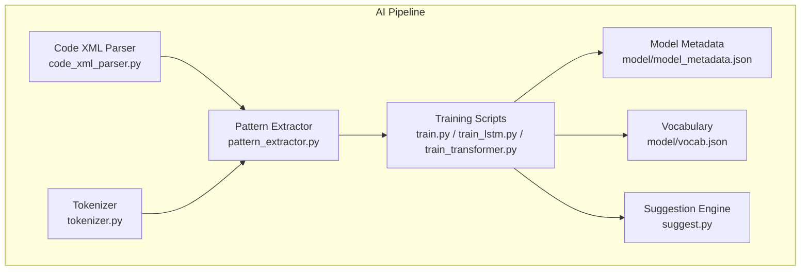
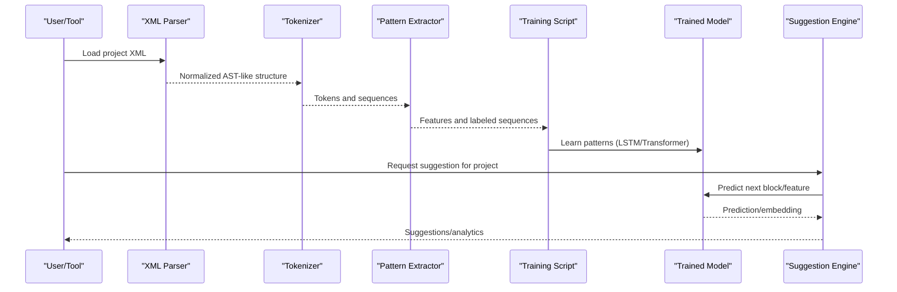
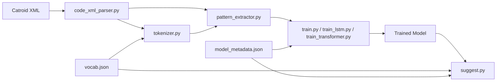

# Code Pattern Recognition and Feature Extraction

<cite>
**Referenced Files in This Document**
- [pattern_extractor.py](file://aip/pattern_extractor.py)
- [code_xml_parser.py](file://aip/code_xml_parser.py)
- [tokenizer.py](file://aip/tokenizer.py)
- [train.py](file://aip/train.py)
- [train_lstm.py](file://aip/train_lstm.py)
- [train_transformer.py](file://aip/train_transformer.py)
- [suggest.py](file://aip/suggest.py)
- [model_metadata.json](file://aip/model/model_metadata.json)
- [vocab.json](file://aip/model/vocab.json)
</cite>

## Table of Contents
1. [Introduction](#introduction)
2. [Project Structure](#project-structure)
3. [Core Components](#core-components)
4. [Architecture Overview](#architecture-overview)
5. [Detailed Component Analysis](#detailed-component-analysis)
6. [Dependency Analysis](#dependency-analysis)
7. [Performance Considerations](#performance-considerations)
8. [Troubleshooting Guide](#troubleshooting-guide)
9. [Conclusion](#conclusion)
10. [Appendices](#appendices)

## Introduction
This document explains the pattern extraction algorithms used to identify common programming constructs and code structures in Catroid projects. It focuses on how the system parses project XML, tokenizes and normalizes code representations, extracts structural features (loops, conditionals, function calls, data manipulation), and integrates with training pipelines for educational analytics and debugging support. The goal is to provide a clear understanding of the pipeline from raw project files to structured features suitable for machine learning and analysis.

## Project Structure
The pattern recognition and feature extraction logic resides primarily under the aip directory. Key responsibilities:
- Parsing Catroid project XML into an internal representation
- Tokenizing and normalizing sequences for modeling
- Extracting structural patterns and features
- Training models and generating suggestions based on learned patterns
- Managing model metadata and vocabulary

**Diagram sources**
- [code_xml_parser.py](file://aip/code_xml_parser.py)
- [tokenizer.py](file://aip/tokenizer.py)
- [pattern_extractor.py](file://aip/pattern_extractor.py)
- [train.py](file://aip/train.py)
- [train_lstm.py](file://aip/train_lstm.py)
- [train_transformer.py](file://aip/train_transformer.py)
- [suggest.py](file://aip/suggest.py)
- [model_metadata.json](file://aip/model/model_metadata.json)
- [vocab.json](file://aip/model/vocab.json)

**Section sources**
- [code_xml_parser.py](file://aip/code_xml_parser.py)
- [tokenizer.py](file://aip/tokenizer.py)
- [pattern_extractor.py](file://aip/pattern_extractor.py)
- [train.py](file://aip/train.py)
- [train_lstm.py](file://aip/train_lstm.py)
- [train_transformer.py](file://aip/train_transformer.py)
- [suggest.py](file://aip/suggest.py)
- [model_metadata.json](file://aip/model/model_metadata.json)
- [vocab.json](file://aip/model/vocab.json)

## Core Components
- Code XML Parser: Converts Catroid project XML into a normalized structure that exposes blocks, events, variables, lists, and scripts.
- Tokenizer: Produces stable tokens from parsed elements, enabling consistent sequence modeling across projects.
- Pattern Extractor: Identifies recurring structural patterns such as loops, conditionals, function calls, and data manipulations; aggregates features for downstream tasks.
- Training Scripts: Provide multiple backends (LSTM, Transformer) to learn from extracted patterns and generate predictions or embeddings.
- Suggestion Engine: Uses trained models to propose next steps or improvements based on current project context.
- Model Artifacts: Store vocabulary and metadata required for inference and reproducibility.

**Section sources**
- [code_xml_parser.py](file://aip/code_xml_parser.py)
- [tokenizer.py](file://aip/tokenizer.py)
- [pattern_extractor.py](file://aip/pattern_extractor.py)
- [train.py](file://aip/train.py)
- [train_lstm.py](file://aip/train_lstm.py)
- [train_transformer.py](file://aip/train_transformer.py)
- [suggest.py](file://aip/suggest.py)
- [model_metadata.json](file://aip/model/model_metadata.json)
- [vocab.json](file://aip/model/vocab.json)

## Architecture Overview
The pipeline transforms raw Catroid project XML into structured features and then trains models to capture common programming patterns. The architecture emphasizes modularity: parsing, tokenization, feature extraction, and modeling are separated to allow independent evolution and testing.

**Diagram sources**
- [code_xml_parser.py](file://aip/code_xml_parser.py)
- [tokenizer.py](file://aip/tokenizer.py)
- [pattern_extractor.py](file://aip/pattern_extractor.py)
- [train.py](file://aip/train.py)
- [train_lstm.py](file://aip/train_lstm.py)
- [train_transformer.py](file://aip/train_transformer.py)
- [suggest.py](file://aip/suggest.py)

## Detailed Component Analysis

### Code XML Parser
Purpose:
- Parse Catroid project XML into a programmatic representation exposing scripts, events, blocks, variables, lists, and stage properties.
- Normalize heterogeneous XML structures into a consistent schema for downstream processing.

Key responsibilities:
- Traverse XML nodes representing scripts and blocks
- Map block types to canonical identifiers
- Resolve variable/list references and scope contexts
- Build adjacency relationships between blocks within scripts

Feature engineering implications:
- Provides a clean graph of blocks and control flow
- Enables counting and categorization of constructs (loops, conditionals, calls)
- Supports traversal for depth and nesting metrics

Integration points:
- Outputs structures consumed by tokenizer and pattern extractor
- May be configured via environment or command-line arguments depending on usage

**Section sources**
- [code_xml_parser.py](file://aip/code_xml_parser.py)

### Tokenizer
Purpose:
- Convert parsed structures into stable token sequences suitable for sequence modeling.
- Ensure vocabulary consistency across datasets and runs.

Key responsibilities:
- Map block types and parameters to tokens
- Handle special tokens (padding, unknown)
- Preserve ordering and locality information
- Optionally produce multi-level tokens (block type + parameter categories)

Complexity considerations:
- Linear time over number of blocks
- Vocabulary size impacts memory and inference speed

Integration points:
- Consumed by pattern extractor for sequence-based features
- Used by training scripts to build input tensors

**Section sources**
- [tokenizer.py](file://aip/tokenizer.py)
- [vocab.json](file://aip/model/vocab.json)

### Pattern Extractor
Purpose:
- Identify and quantify common programming constructs and data manipulation patterns.
- Produce features for analytics and training.

Patterns recognized:
- Loops: repeat, forever, until, while-style constructs
- Conditionals: if/else branches and nested conditions
- Function calls: custom procedures and built-in actions
- Data manipulation: variable assignments, list operations, math transformations

Structural analysis methods:
- Depth-first traversal of script graphs to detect control-flow constructs
- Counters and ratios (e.g., loop-to-condition density)
- Nesting metrics and branching factors
- Co-occurrence of block categories (e.g., movement + sound)

Configuration options:
- Enable/disable specific pattern detectors
- Thresholds for significance filtering
- Output granularity (per-script vs. per-project)

Performance optimizations:
- Early pruning of irrelevant branches
- Incremental aggregation to avoid recomputation
- Batch processing across projects

Integration points:
- Feeds labeled sequences and aggregated features to training scripts
- Exposes APIs for analytics dashboards and debugging tools

**Section sources**
- [pattern_extractor.py](file://aip/pattern_extractor.py)

### Training Scripts
Purpose:
- Learn predictive models from extracted patterns and sequences.
- Support multiple backends for different use cases.

Backends:
- LSTM: Effective for sequential dependencies and moderate-length contexts
- Transformer: Captures long-range dependencies and parallelizable training

Key responsibilities:
- Load tokenized sequences and labels
- Configure model hyperparameters
- Optimize loss functions appropriate for prediction tasks
- Persist model artifacts and metadata

Integration points:
- Consumes outputs from pattern extractor and tokenizer
- Produces models used by suggestion engine and analytics

**Section sources**
- [train.py](file://aip/train.py)
- [train_lstm.py](file://aip/train_lstm.py)
- [train_transformer.py](file://aip/train_transformer.py)
- [model_metadata.json](file://aip/model/model_metadata.json)
- [vocab.json](file://aip/model/vocab.json)

### Suggestion Engine
Purpose:
- Generate contextual suggestions based on current project state and learned patterns.
- Support educational guidance and debugging assistance.

Workflow:
- Encode current project context using tokenizer and parser
- Query trained model for likely next blocks or improvements
- Rank suggestions by confidence and educational relevance
- Return actionable recommendations

Integration points:
- Depends on trained models and vocabulary
- Can be invoked interactively or in batch mode

**Section sources**
- [suggest.py](file://aip/suggest.py)
- [model_metadata.json](file://aip/model/model_metadata.json)
- [vocab.json](file://aip/model/vocab.json)

## Dependency Analysis
The components exhibit a layered dependency structure:
- Parser depends only on XML input format
- Tokenizer depends on parser output and vocabulary
- Pattern extractor depends on parser and tokenizer outputs
- Training scripts depend on extractor and tokenizer outputs
- Suggestion engine depends on trained models and vocabulary

**Diagram sources**
- [code_xml_parser.py](file://aip/code_xml_parser.py)
- [tokenizer.py](file://aip/tokenizer.py)
- [pattern_extractor.py](file://aip/pattern_extractor.py)
- [train.py](file://aip/train.py)
- [train_lstm.py](file://aip/train_lstm.py)
- [train_transformer.py](file://aip/train_transformer.py)
- [suggest.py](file://aip/suggest.py)
- [model_metadata.json](file://aip/model/model_metadata.json)
- [vocab.json](file://aip/model/vocab.json)

**Section sources**
- [code_xml_parser.py](file://aip/code_xml_parser.py)
- [tokenizer.py](file://aip/tokenizer.py)
- [pattern_extractor.py](file://aip/pattern_extractor.py)
- [train.py](file://aip/train.py)
- [train_lstm.py](file://aip/train_lstm.py)
- [train_transformer.py](file://aip/train_transformer.py)
- [suggest.py](file://aip/suggest.py)
- [model_metadata.json](file://aip/model/model_metadata.json)
- [vocab.json](file://aip/model/vocab.json)

## Performance Considerations
- Tokenization efficiency: Use fixed vocabularies and precomputed mappings to minimize overhead.
- Pattern extraction scalability: Prefer streaming traversal and incremental aggregation to handle large projects.
- Model selection: Choose LSTM for shorter sequences and limited resources; choose Transformer for richer context when compute permits.
- Batch processing: Process multiple projects concurrently where possible to amortize I/O costs.
- Memory management: Limit sequence lengths and prune rare tokens to reduce model size and inference latency.

[No sources needed since this section provides general guidance]

## Troubleshooting Guide
Common issues and resolutions:
- Missing vocabulary entries: Ensure vocab.json is synchronized with tokenizer updates and retrained models.
- Inconsistent XML schemas: Validate parser compatibility with project versions and update normalization rules accordingly.
- Poor suggestion quality: Review training data diversity and label accuracy; consider adjusting thresholds in pattern extractor.
- Slow inference: Reduce sequence length, quantize models, or switch to LSTM for faster runtime.

Operational checks:
- Verify model metadata matches trained artifacts
- Confirm tokenizer configuration aligns with deployed vocabulary
- Log intermediate features to diagnose extraction anomalies

**Section sources**
- [tokenizer.py](file://aip/tokenizer.py)
- [pattern_extractor.py](file://aip/pattern_extractor.py)
- [suggest.py](file://aip/suggest.py)
- [model_metadata.json](file://aip/model/model_metadata.json)
- [vocab.json](file://aip/model/vocab.json)

## Conclusion
The pattern recognition and feature extraction system provides a modular pipeline for analyzing Catroid projects. By separating parsing, tokenization, feature extraction, and modeling, it supports flexible experimentation and deployment. The approach enables educational analytics, debugging support, and automated suggestions grounded in learned programming patterns.

[No sources needed since this section summarizes without analyzing specific files]

## Appendices

### Configuration Options for Custom Patterns
- Pattern enablement flags: Toggle detection of specific constructs (loops, conditionals, calls).
- Significance thresholds: Filter low-frequency patterns to reduce noise.
- Output modes: Per-script vs. per-project aggregation.
- Sequence length limits: Control maximum token sequences for modeling.

[No sources needed since this section provides general guidance]

### Educational Analytics Examples
- Loop usage frequency and nesting depth distribution
- Conditional complexity metrics
- Procedure call graphs and reuse patterns
- Data manipulation intensity (variables/lists/math operations)

[No sources needed since this section provides general guidance]

### Debugging Support Features
- Highlight problematic constructs (deeply nested loops, excessive branching)
- Suggest refactoring opportunities based on learned best practices
- Provide step-by-step guidance for common errors detected in structure

[No sources needed since this section provides general guidance]