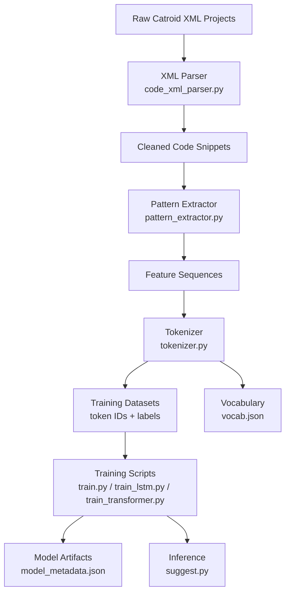
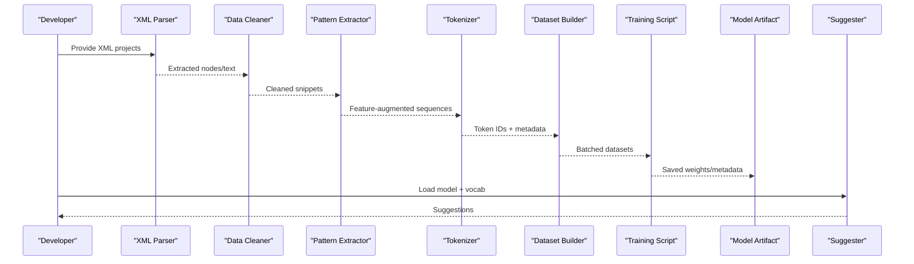
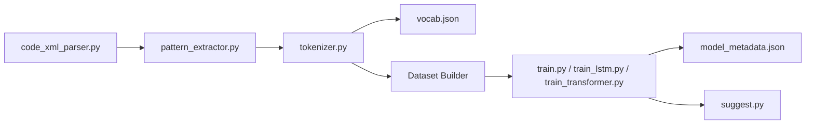

# Data Preprocessing and Tokenization

<cite>
**Referenced Files in This Document**
- [code_xml_parser.py](file://aip/code_xml_parser.py)
- [tokenizer.py](file://aip/tokenizer.py)
- [pattern_extractor.py](file://aip/pattern_extractor.py)
- [train.py](file://aip/train.py)
- [train_lstm.py](file://aip/train_lstm.py)
- [train_transformer.py](file://aip/train_transformer.py)
- [vocab.json](file://aip/model/vocab.json)
- [model_metadata.json](file://aip/model/model_metadata.json)
- [suggest.py](file://aip/suggest.py)
</cite>

## Table of Contents
1. [Introduction](#introduction)
2. [Project Structure](#project-structure)
3. [Core Components](#core-components)
4. [Architecture Overview](#architecture-overview)
5. [Detailed Component Analysis](#detailed-component-analysis)
6. [Dependency Analysis](#dependency-analysis)
7. [Performance Considerations](#performance-considerations)
8. [Troubleshooting Guide](#troubleshooting-guide)
9. [Conclusion](#conclusion)

## Introduction

This document explains the data preprocessing and tokenization pipeline used by NewCatroid's model training system. It covers how raw code data is parsed from XML format, cleaned, and transformed into training-ready datasets; how the tokenizer builds vocabulary, encodes sequences, and handles special tokens; and how pattern extraction algorithms identify common programming constructs. It also provides guidance on configuration, custom tokenizer development, dataset validation, memory optimization, and parallel processing strategies.

## Project Structure

The AI/ML pipeline resides under the aip directory and includes scripts for parsing, tokenization, pattern extraction, training, and inference. Key artifacts include a prebuilt vocabulary and model metadata.

[No sources needed since this diagram shows conceptual workflow, not actual code structure]

## Core Components

- XML Parser: Reads Catroid project XML files, extracts relevant blocks and code segments, normalizes content, and produces clean text or structured representations suitable for downstream processing.
- Pattern Extractor: Identifies recurring programming constructs (e.g., loops, conditionals, event handlers), block compositions, and control-flow patterns to enrich features or guide tokenization.
- Tokenizer: Builds and manages a vocabulary, converts text or structured tokens into integer sequences, and applies special tokens for sequence boundaries and unknowns.
- Training Pipeline: Consumes tokenized sequences and optional labels to train LSTM or Transformer models, using the shared vocabulary and metadata.
- Inference: Loads trained model and vocabulary to generate suggestions from user input.

**Section sources**
- [code_xml_parser.py](file://aip/code_xml_parser.py)
- [pattern_extractor.py](file://aip/pattern_extractor.py)
- [tokenizer.py](file://aip/tokenizer.py)
- [train.py](file://aip/train.py)
- [train_lstm.py](file://aip/train_lstm.py)
- [train_transformer.py](file://aip/train_transformer.py)
- [suggest.py](file://aip/suggest.py)
- [vocab.json](file://aip/model/vocab.json)
- [model_metadata.json](file://aip/model/model_metadata.json)

## Architecture Overview

End-to-end flow from raw XML to model-ready datasets and inference:

[No sources needed since this diagram shows conceptual workflow, not actual code structure]

## Detailed Component Analysis

### XML Parsing and Cleaning

Responsibilities:
- Parse XML documents representing Catroid projects.
- Traverse block trees to extract meaningful code segments.
- Normalize whitespace, remove non-code elements, and handle encoding.
- Output cleaned strings or structured records for further processing.

Key considerations:
- Robustness against malformed XML.
- Handling large projects efficiently via streaming or chunking.
- Preserving semantic relationships between blocks when possible.

Typical outputs:
- Plain text lines or block-level tokens.
- Optional metadata like block types, parameters, and hierarchy.

**Section sources**
- [code_xml_parser.py](file://aip/code_xml_parser.py)

### Pattern Extraction

Responsibilities:
- Identify common programming constructs such as loops, conditionals, events, and variable assignments.
- Detect repeated block compositions and control-flow structures.
- Generate feature flags or enriched tokens to improve model learning.

Approaches:
- Rule-based matching over block types and attributes.
- Graph traversal to capture parent-child relationships.
- Aggregation of frequent substructures across the corpus.

Outputs:
- Augmented sequences with pattern markers.
- Frequency counts for rare vs. common constructs.

**Section sources**
- [pattern_extractor.py](file://aip/pattern_extractor.py)

### Tokenizer Implementation

Responsibilities:
- Build vocabulary from training corpus.
- Encode sequences into integer IDs.
- Handle special tokens (e.g., start/end-of-sequence, padding, unknown).
- Decode token IDs back to human-readable tokens for debugging.

Design aspects:
- Vocabulary persistence to disk (JSON).
- Deterministic mapping between tokens and IDs.
- Configurable maximum sequence length and truncation/padding behavior.
- Support for incremental updates if retraining is required.

Special tokens:
- Start-of-sequence, end-of-sequence, padding, unknown.
- Optional domain-specific tokens for block categories or patterns.

**Section sources**
- [tokenizer.py](file://aip/tokenizer.py)
- [vocab.json](file://aip/model/vocab.json)

### Dataset Preparation and Validation

Responsibilities:
- Convert tokenized sequences into model-ready batches.
- Apply consistent lengths via padding/truncation.
- Split into train/validation/test sets.
- Validate dataset integrity (no missing tokens, balanced classes if applicable).

Validation checks:
- Ensure all tokens exist in vocabulary.
- Verify label alignment where applicable.
- Check distribution of sequence lengths and class frequencies.

**Section sources**
- [train.py](file://aip/train.py)
- [train_lstm.py](file://aip/train_lstm.py)
- [train_transformer.py](file://aip/train_transformer.py)

### Training Pipelines

Responsibilities:
- Load datasets and vocabulary.
- Configure model hyperparameters.
- Train LSTM or Transformer variants.
- Save model artifacts and metadata.

Artifacts:
- Trained weights.
- Model metadata including architecture details, vocabulary path, and training config.

**Section sources**
- [train.py](file://aip/train.py)
- [train_lstm.py](file://aip/train_lstm.py)
- [train_transformer.py](file://aip/train_transformer.py)
- [model_metadata.json](file://aip/model/model_metadata.json)

### Inference and Suggestions

Responsibilities:
- Load trained model and vocabulary.
- Tokenize user input consistently with training-time settings.
- Generate next-token predictions or completions.
- Post-process outputs to produce readable suggestions.

**Section sources**
- [suggest.py](file://aip/suggest.py)

## Dependency Analysis

High-level dependencies among core modules:

[No sources needed since this diagram shows conceptual workflow, not actual code structure]

## Performance Considerations

Memory optimization techniques:
- Stream XML parsing to avoid loading entire projects into memory.
- Use generators for tokenization to process chunks rather than full corpora.
- Employ fixed-length batching with efficient padding strategies.
- Cache vocabulary lookups and reuse token maps across processes.
- Utilize memory-mapped arrays for large token ID matrices.

Parallel processing strategies:
- Parallelize XML parsing across multiple cores using multiprocessing.
- Distribute pattern extraction tasks across workers.
- Shard tokenization jobs and merge results deterministically.
- Use asynchronous I/O for reading/writing large datasets.

Scaling tips:
- Precompute and persist intermediate artifacts (cleaned snippets, extracted patterns).
- Monitor GPU memory usage during training and adjust batch sizes accordingly.
- Use mixed precision if supported by the training backend.

[No sources needed since this section provides general guidance]

## Troubleshooting Guide

Common issues and resolutions:
- Vocabulary mismatch: Ensure tokenizer uses the same vocabulary file used during training.
- Sequence length errors: Confirm consistent max_length and padding strategy across preprocessing and training.
- Missing tokens: Validate that all tokens in the dataset exist in the vocabulary; consider adding an unknown token fallback.
- Out-of-memory during training: Reduce batch size, enable gradient checkpointing, or use smaller models.
- Slow preprocessing: Enable parallel processing and stream-based parsing.

Diagnostic steps:
- Inspect sample tokenized sequences to verify correctness.
- Log vocabulary size and coverage statistics.
- Compare distributions of sequence lengths before and after filtering.

**Section sources**
- [tokenizer.py](file://aip/tokenizer.py)
- [train.py](file://aip/train.py)
- [train_lstm.py](file://aip/train_lstm.py)
- [train_transformer.py](file://aip/train_transformer.py)

## Conclusion

NewCatroid’s preprocessing and tokenization pipeline transforms raw Catroid XML projects into robust training datasets through careful parsing, cleaning, pattern extraction, and tokenization. The modular design supports both LSTM and Transformer training, while offering practical strategies for memory efficiency and parallelism. Consistent handling of vocabulary and special tokens ensures reliable inference and suggestion generation.