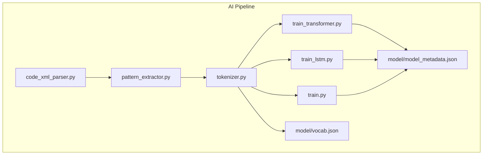
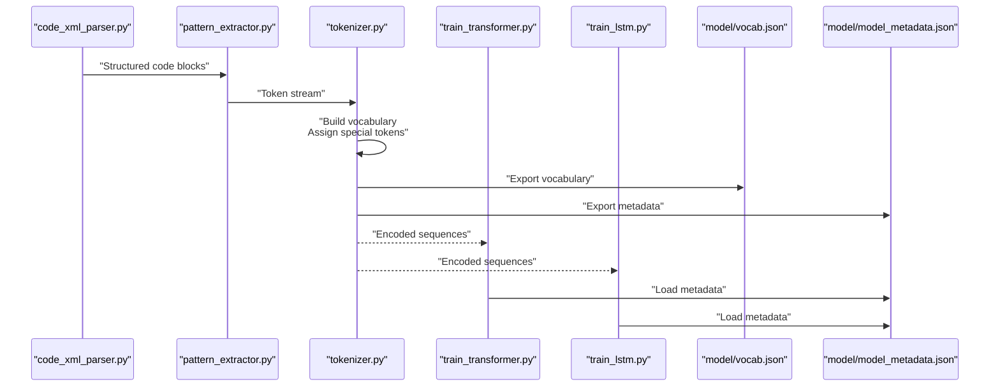
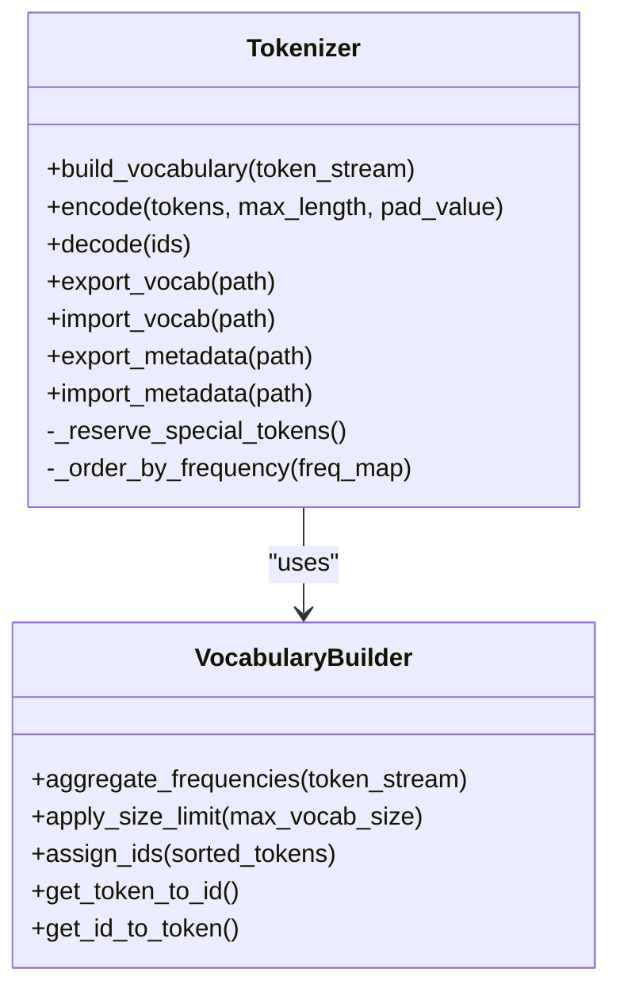
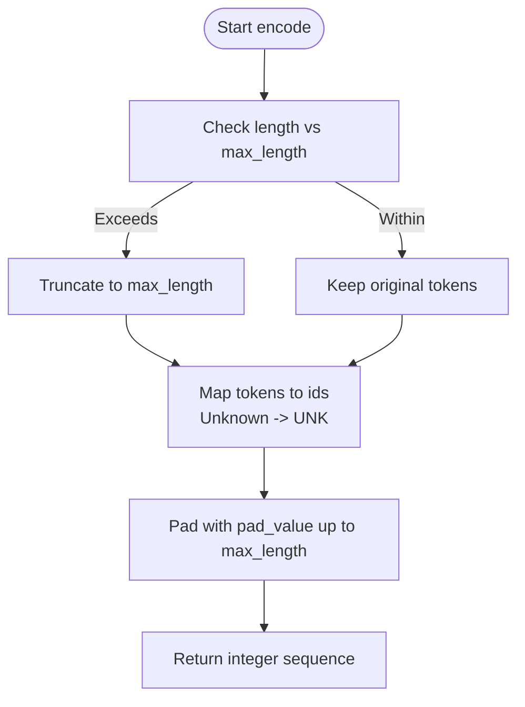
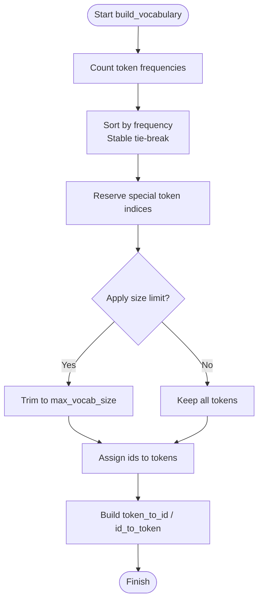
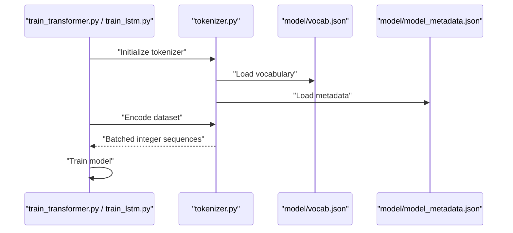
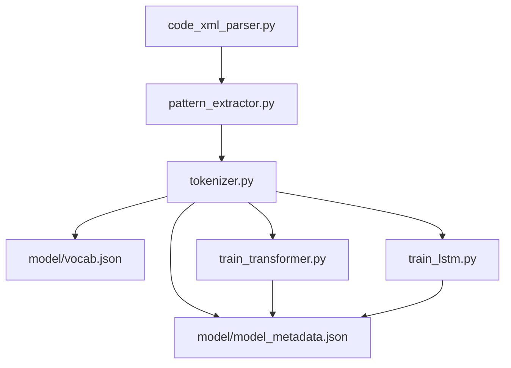

# Tokenizer Implementation and Vocabulary Management

<cite>
**Referenced Files in This Document**
- [tokenizer.py](file://aip/tokenizer.py)
- [train.py](file://aip/train.py)
- [train_transformer.py](file://aip/train_transformer.py)
- [train_lstm.py](file://aip/train_lstm.py)
- [pattern_extractor.py](file://aip/pattern_extractor.py)
- [code_xml_parser.py](file://aip/code_xml_parser.py)
- [vocab.json](file://aip/model/vocab.json)
- [model_metadata.json](file://aip/model/model_metadata.json)
</cite>

## Table of Contents
1. [Introduction](#introduction)
2. [Project Structure](#project-structure)
3. [Core Components](#core-components)
4. [Architecture Overview](#architecture-overview)
5. [Detailed Component Analysis](#detailed-component-analysis)
6. [Dependency Analysis](#dependency-analysis)
7. [Performance Considerations](#performance-considerations)
8. [Troubleshooting Guide](#troubleshooting-guide)
9. [Conclusion](#conclusion)
10. [Appendices](#appendices)

## Introduction
This document explains the tokenizer system that converts parsed code into numerical sequences for model training. It covers vocabulary building (word frequency analysis, special tokens, size optimization), sequence encoding (padding strategies, maximum length handling), custom tokenizer development for new programming constructs, vocabulary export/import, and memory-efficient processing techniques. It also provides guidance on configuring tokenizers for different block types and handling edge cases in code generation.

## Project Structure
The tokenizer-related logic is primarily implemented under the aip directory:
- Tokenization and vocabulary utilities are defined in a single module.
- Training scripts consume tokenized data and manage model-specific configuration.
- Code parsing and pattern extraction provide structured inputs to the tokenizer.
- Model assets include the exported vocabulary and metadata.

**Diagram sources**
- [code_xml_parser.py](file://aip/code_xml_parser.py)
- [pattern_extractor.py](file://aip/pattern_extractor.py)
- [tokenizer.py](file://aip/tokenizer.py)
- [train_transformer.py](file://aip/train_transformer.py)
- [train_lstm.py](file://aip/train_lstm.py)
- [train.py](file://aip/train.py)
- [vocab.json](file://aip/model/vocab.json)
- [model_metadata.json](file://aip/model/model_metadata.json)

**Section sources**
- [tokenizer.py](file://aip/tokenizer.py)
- [train.py](file://aip/train.py)
- [train_transformer.py](file://aip/train_transformer.py)
- [train_lstm.py](file://aip/train_lstm.py)
- [pattern_extractor.py](file://aip/pattern_extractor.py)
- [code_xml_parser.py](file://aip/code_xml_parser.py)
- [vocab.json](file://aip/model/vocab.json)
- [model_metadata.json](file://aip/model/model_metadata.json)

## Core Components
- Tokenizer class encapsulates vocabulary management, encoding/decoding, padding, and max-length handling.
- Vocabulary builder aggregates word frequencies from parsed code structures and emits a stable token-to-id mapping.
- Special tokens are reserved for start-of-sequence, end-of-sequence, unknown, and padding.
- Sequence encoder transforms token lists into fixed-length integer arrays with configurable padding and truncation.
- Export/import utilities serialize/deserialize vocabularies and metadata for reproducibility.

Key responsibilities:
- Frequency counting over tokens derived from parsed blocks and attributes.
- Deterministic ordering of tokens by frequency with tie-breaking rules.
- Allocation of reserved indices for special tokens.
- Encoding sequences with consistent padding/truncation policies.
- Persisting vocabulary and metadata to JSON for downstream training.

**Section sources**
- [tokenizer.py](file://aip/tokenizer.py)
- [vocab.json](file://aip/model/vocab.json)
- [model_metadata.json](file://aip/model/model_metadata.json)

## Architecture Overview
The pipeline integrates parsing, pattern extraction, tokenization, and training:
- The XML parser extracts structured representations of code blocks.
- Pattern extractor normalizes and enumerates tokens suitable for vocabulary building.
- Tokenizer builds vocabulary, encodes sequences, and manages special tokens.
- Training scripts load vocabularies and feed encoded sequences into models.

**Diagram sources**
- [code_xml_parser.py](file://aip/code_xml_parser.py)
- [pattern_extractor.py](file://aip/pattern_extractor.py)
- [tokenizer.py](file://aip/tokenizer.py)
- [train_transformer.py](file://aip/train_transformer.py)
- [train_lstm.py](file://aip/train_lstm.py)
- [vocab.json](file://aip/model/vocab.json)
- [model_metadata.json](file://aip/model/model_metadata.json)

## Detailed Component Analysis

### Tokenizer Class and Vocabulary Builder
The tokenizer implements:
- Vocabulary construction via frequency aggregation over tokens produced by the pattern extractor.
- Reserved indices for special tokens (e.g., start, end, unknown, padding).
- Deterministic ordering based on frequency counts and stable tie-breaking.
- Encoding functions that convert token lists to integer sequences with padding/truncation.
- Decoding functions that map integers back to tokens.
- Export/import methods to persist and reload vocabulary and metadata.

**Diagram sources**
- [tokenizer.py](file://aip/tokenizer.py)

**Section sources**
- [tokenizer.py](file://aip/tokenizer.py)

### Sequence Encoding and Padding Strategy
Encoding workflow:
- Input token list is truncated to max_length if longer.
- Remaining positions are filled with a configured pad value.
- Unknown tokens are mapped to an unknown index.
- Output is a fixed-length integer array ready for batching.

**Diagram sources**
- [tokenizer.py](file://aip/tokenizer.py)

**Section sources**
- [tokenizer.py](file://aip/tokenizer.py)

### Vocabulary Building Process
Frequency analysis and size optimization:
- Tokens are aggregated across all parsed samples.
- Ordering uses descending frequency with deterministic tie-breaking.
- Size limits can be applied to cap vocabulary growth.
- Special tokens are allocated first to ensure stable indices.

**Diagram sources**
- [tokenizer.py](file://aip/tokenizer.py)

**Section sources**
- [tokenizer.py](file://aip/tokenizer.py)

### Custom Tokenizer Development for New Programming Constructs
To extend tokenization for new constructs:
- Update the pattern extractor to enumerate new tokens from parsed structures.
- Ensure new tokens are included in frequency aggregation.
- Validate that special token indices remain unchanged after updates.
- Re-export vocabulary and metadata before retraining.

Best practices:
- Maintain deterministic ordering to avoid non-reproducible vocabularies.
- Use explicit separators or delimiters for complex constructs to improve model learning.
- Monitor vocabulary size growth and apply limits when necessary.

**Section sources**
- [pattern_extractor.py](file://aip/pattern_extractor.py)
- [tokenizer.py](file://aip/tokenizer.py)

### Vocabulary Export/Import and Metadata
Vocabulary and metadata are persisted as JSON files:
- Vocabulary file contains token-to-id mappings and special token definitions.
- Metadata file includes configuration such as max_length, pad_value, and model parameters.
- Import/export functions ensure compatibility between training and inference.

Operational notes:
- Always pair vocabulary and metadata exports to maintain consistency.
- Version control vocabulary artifacts to track changes across training runs.
- Validate imported files before use to prevent runtime errors.

**Section sources**
- [vocab.json](file://aip/model/vocab.json)
- [model_metadata.json](file://aip/model/model_metadata.json)
- [tokenizer.py](file://aip/tokenizer.py)

### Integration with Training Scripts
Training scripts consume tokenized sequences and rely on vocabulary/metadata:
- Transformer and LSTM trainers load vocabulary and metadata at startup.
- They configure batch sizes, max lengths, and other hyperparameters.
- Encoded sequences are fed into model pipelines for training.

**Diagram sources**
- [train_transformer.py](file://aip/train_transformer.py)
- [train_lstm.py](file://aip/train_lstm.py)
- [tokenizer.py](file://aip/tokenizer.py)
- [vocab.json](file://aip/model/vocab.json)
- [model_metadata.json](file://aip/model/model_metadata.json)

**Section sources**
- [train_transformer.py](file://aip/train_transformer.py)
- [train_lstm.py](file://aip/train_lstm.py)
- [train.py](file://aip/train.py)
- [tokenizer.py](file://aip/tokenizer.py)
- [vocab.json](file://aip/model/vocab.json)
- [model_metadata.json](file://aip/model/model_metadata.json)

## Dependency Analysis
The following diagram shows how components depend on each other during tokenization and training:

**Diagram sources**
- [code_xml_parser.py](file://aip/code_xml_parser.py)
- [pattern_extractor.py](file://aip/pattern_extractor.py)
- [tokenizer.py](file://aip/tokenizer.py)
- [vocab.json](file://aip/model/vocab.json)
- [model_metadata.json](file://aip/model/model_metadata.json)
- [train_transformer.py](file://aip/train_transformer.py)
- [train_lstm.py](file://aip/train_lstm.py)

**Section sources**
- [tokenizer.py](file://aip/tokenizer.py)
- [train.py](file://aip/train.py)
- [train_transformer.py](file://aip/train_transformer.py)
- [train_lstm.py](file://aip/train_lstm.py)
- [pattern_extractor.py](file://aip/pattern_extractor.py)
- [code_xml_parser.py](file://aip/code_xml_parser.py)
- [vocab.json](file://aip/model/vocab.json)
- [model_metadata.json](file://aip/model/model_metadata.json)

## Performance Considerations
- Memory-efficient processing:
  - Stream token streams instead of loading entire datasets into memory.
  - Use generators for frequency counting to reduce peak memory usage.
  - Batch encoding operations to leverage vectorized operations where possible.
- Vocabulary size optimization:
  - Apply size limits to cap vocabulary growth and reduce model complexity.
  - Monitor rare tokens and consider merging or dropping them to improve generalization.
- I/O efficiency:
  - Serialize vocabulary and metadata once per run; reuse across multiple training jobs.
  - Avoid redundant reads by caching loaded vocabularies in memory.

[No sources needed since this section provides general guidance]

## Troubleshooting Guide
Common issues and resolutions:
- Mismatched vocabulary and metadata:
  - Ensure both files are exported together and versioned consistently.
  - Validate imports before training to catch schema mismatches early.
- Unexpected unknown tokens:
  - Verify that the pattern extractor enumerates all expected constructs.
  - Increase vocabulary size or adjust frequency thresholds if too many tokens are unknown.
- Padding/truncation errors:
  - Confirm max_length settings align with model expectations.
  - Check pad_value consistency across encoding and model input layers.
- Non-deterministic vocabularies:
  - Ensure stable tie-breaking in frequency sorting to reproduce results.

**Section sources**
- [tokenizer.py](file://aip/tokenizer.py)
- [vocab.json](file://aip/model/vocab.json)
- [model_metadata.json](file://aip/model/model_metadata.json)

## Conclusion
The tokenizer system provides a robust foundation for converting parsed code into numerical sequences suitable for model training. By carefully managing vocabulary construction, special tokens, and encoding strategies, it ensures reproducible and efficient training workflows. Extending tokenization for new constructs requires coordinated updates to the pattern extractor and careful validation of vocabulary stability. Proper export/import practices and performance optimizations further enhance reliability and scalability.

[No sources needed since this section summarizes without analyzing specific files]

## Appendices

### Configuration Examples for Different Block Types
- Configure max_length and pad_value per block type to balance context retention and memory usage.
- Adjust vocabulary size limits based on domain-specific construct diversity.
- Use separate vocabularies for specialized domains if necessary, ensuring consistent special token allocation.

[No sources needed since this section provides general guidance]

### Handling Edge Cases in Code Generation
- Empty sequences:
  - Encode empty inputs as sequences of pad values with appropriate length.
- Highly nested constructs:
  - Ensure pattern extractor captures hierarchical structure to preserve semantics.
- Rare or dynamic identifiers:
  - Map to unknown tokens and consider adding heuristics to normalize common patterns.

[No sources needed since this section provides general guidance]