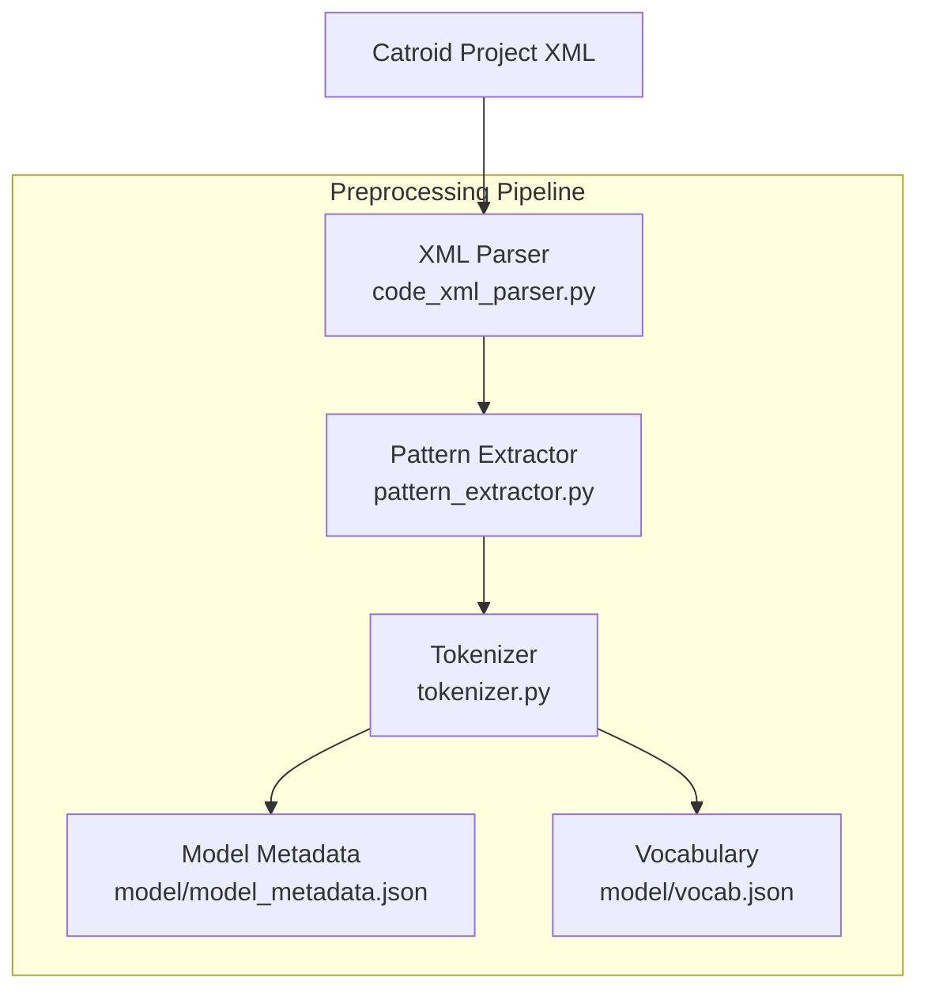
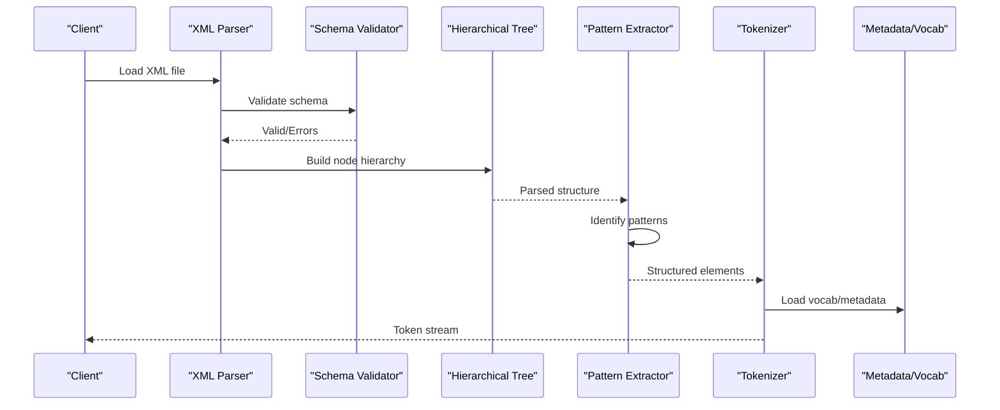
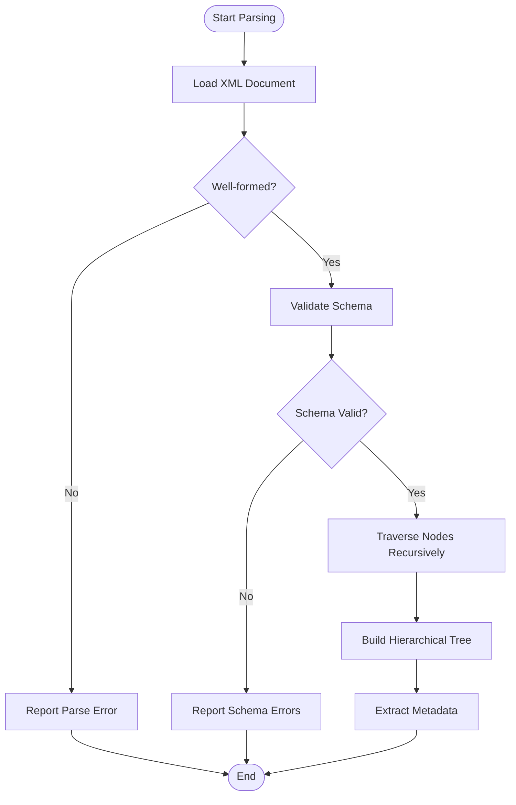
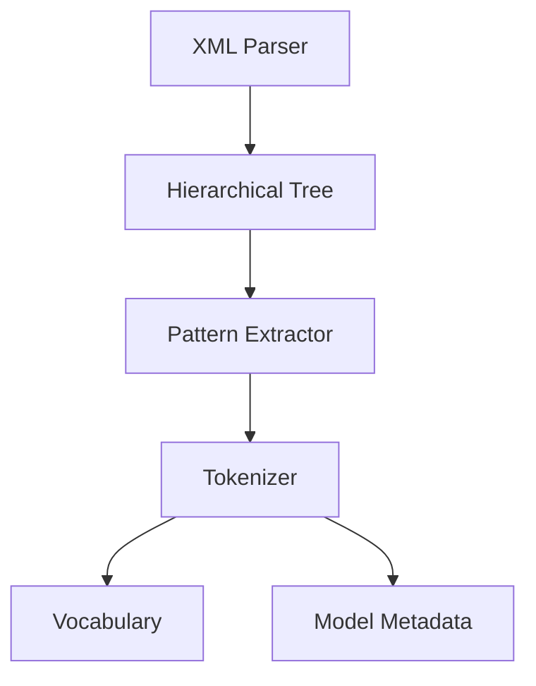

# XML Code Parsing and Structure Extraction

<cite>
**Referenced Files in This Document**
- [code_xml_parser.py](file://aip/code_xml_parser.py)
- [pattern_extractor.py](file://aip/pattern_extractor.py)
- [tokenizer.py](file://aip/tokenizer.py)
- [model_metadata.json](file://aip/model/model_metadata.json)
- [vocab.json](file://aip/model/vocab.json)
- [invalid_project.xml](file://catroid/src/androidTest/assets/invalid_project.xml)
</cite>

## Table of Contents
1. [Introduction](#introduction)
2. [Project Structure](#project-structure)
3. [Core Components](#core-components)
4. [Architecture Overview](#architecture-overview)
5. [Detailed Component Analysis](#detailed-component-analysis)
6. [Dependency Analysis](#dependency-analysis)
7. [Performance Considerations](#performance-considerations)
8. [Troubleshooting Guide](#troubleshooting-guide)
9. [Conclusion](#conclusion)

## Introduction
This document explains the XML code parsing system used in NewCatroid’s data preprocessing pipeline for Catroid project files. It focuses on how XML-based projects are parsed to extract programming blocks, variables, events, and code structure; how schema validation is performed; how element extraction algorithms work; and how a hierarchical tree is constructed from the parsed content. It also covers error handling for malformed XML, performance optimization strategies for large projects, and extensibility points for custom parsers.

## Project Structure
The relevant components for XML parsing and preprocessing are located under the aip directory and include:
- A Python-based XML parser that reads Catroid project XML and builds an internal representation.
- A pattern extractor that identifies reusable structures within the parsed program.
- A tokenizer that converts extracted elements into token sequences suitable for downstream models.
- Model metadata and vocabulary definitions used by the preprocessing pipeline.

**Diagram sources**
- [code_xml_parser.py](file://aip/code_xml_parser.py)
- [pattern_extractor.py](file://aip/pattern_extractor.py)
- [tokenizer.py](file://aip/tokenizer.py)
- [model_metadata.json](file://aip/model/model_metadata.json)
- [vocab.json](file://aip/model/vocab.json)

**Section sources**
- [code_xml_parser.py](file://aip/code_xml_parser.py)
- [pattern_extractor.py](file://aip/pattern_extractor.py)
- [tokenizer.py](file://aip/tokenizer.py)
- [model_metadata.json](file://aip/model/model_metadata.json)
- [vocab.json](file://aip/model/vocab.json)

## Core Components
- XML Parser: Reads Catroid project XML, validates structure, extracts nodes (blocks, variables, events), and constructs a hierarchical tree representing the program.
- Pattern Extractor: Analyzes the parsed tree to identify recurring patterns such as loops, conditionals, and event-driven structures.
- Tokenizer: Converts structured elements into token streams using a vocabulary and model metadata for consistent encoding.
- Metadata and Vocabulary: Provide configuration for tokenization and model compatibility.

Key responsibilities:
- Schema validation: Ensures required elements and attributes exist before extraction.
- Element extraction: Navigates the XML tree to collect blocks, parameters, and nested structures.
- Tree construction: Builds parent-child relationships among nodes to reflect program hierarchy.
- Error handling: Detects malformed XML and reports actionable errors.
- Performance: Optimizes traversal and memory usage for large projects.

**Section sources**
- [code_xml_parser.py](file://aip/code_xml_parser.py)
- [pattern_extractor.py](file://aip/pattern_extractor.py)
- [tokenizer.py](file://aip/tokenizer.py)
- [model_metadata.json](file://aip/model/model_metadata.json)
- [vocab.json](file://aip/model/vocab.json)

## Architecture Overview
The preprocessing pipeline follows a sequential flow:
1. Input XML is loaded and validated against expected schema constraints.
2. The parser traverses the XML to build a hierarchical tree of program elements.
3. The pattern extractor analyzes the tree to detect structural patterns.
4. The tokenizer converts elements into tokens using vocabulary and metadata.
5. Outputs are consumed by downstream training or inference modules.

**Diagram sources**
- [code_xml_parser.py](file://aip/code_xml_parser.py)
- [pattern_extractor.py](file://aip/pattern_extractor.py)
- [tokenizer.py](file://aip/tokenizer.py)
- [model_metadata.json](file://aip/model/model_metadata.json)
- [vocab.json](file://aip/model/vocab.json)

## Detailed Component Analysis

### XML Parser
Responsibilities:
- Parse XML input and validate against schema rules.
- Extract programming blocks, variables, events, and nested structures.
- Construct a hierarchical tree with parent-child relationships.
- Handle malformed XML gracefully with detailed error reporting.

Processing logic:
- Load XML document and check well-formedness.
- Validate presence of required root and child elements.
- Traverse nodes recursively to build the tree.
- Map XML attributes to typed fields in the internal representation.
- Aggregate metadata such as block types, parameter names, and event triggers.

Error handling:
- Catches parse exceptions and schema violations.
- Produces structured error messages indicating line numbers and missing elements.
- Supports partial recovery when possible (e.g., skipping invalid nodes).

Performance considerations:
- Uses streaming or incremental parsing where applicable to reduce memory footprint.
- Avoids deep copies of large strings; references original text segments.
- Preallocates lists for known structures to minimize reallocation overhead.

Extensibility:
- Provides hooks for registering custom block handlers.
- Allows pluggable validators for domain-specific constraints.

**Diagram sources**
- [code_xml_parser.py](file://aip/code_xml_parser.py)

**Section sources**
- [code_xml_parser.py](file://aip/code_xml_parser.py)

### Pattern Extractor
Responsibilities:
- Analyze the hierarchical tree to identify common patterns like loops, conditionals, and event chains.
- Produce annotated structures that highlight control flow and dependencies.

Algorithm highlights:
- Depth-first traversal to detect nested control structures.
- Heuristics based on block types and attribute values.
- Aggregation of related nodes into pattern groups.

Output:
- Pattern annotations attached to tree nodes.
- Summaries of detected structures for downstream processing.

**Section sources**
- [pattern_extractor.py](file://aip/pattern_extractor.py)

### Tokenizer
Responsibilities:
- Convert structured elements into token sequences.
- Use vocabulary and model metadata to ensure consistent encoding.

Process:
- Normalize element names and attributes.
- Map to token IDs via vocabulary lookup.
- Preserve order and nesting information in token streams.

Integration:
- Consumes outputs from the pattern extractor.
- Emits token sequences compatible with model inputs.

**Section sources**
- [tokenizer.py](file://aip/tokenizer.py)
- [model_metadata.json](file://aip/model/model_metadata.json)
- [vocab.json](file://aip/model/vocab.json)

### Example: Parsing Different Block Types
- Event blocks: Identified by trigger attributes; mapped to event nodes with associated action children.
- Control blocks: Recognized by loop/conditional markers; nested children represent body statements.
- Variable blocks: Extracted by variable name and scope attributes; linked to assignment or read operations.
- Nested structures: Handled by recursive traversal; parent-child links preserve indentation semantics.

These examples illustrate how the parser maps XML elements to internal nodes and how the pattern extractor annotates them for further processing.

[No sources needed since this section provides conceptual examples without analyzing specific files]

## Dependency Analysis
The preprocessing pipeline has clear dependencies:
- The parser depends on XML libraries and schema validation utilities.
- The pattern extractor depends on the parser’s output tree.
- The tokenizer depends on vocabulary and metadata files.

**Diagram sources**
- [code_xml_parser.py](file://aip/code_xml_parser.py)
- [pattern_extractor.py](file://aip/pattern_extractor.py)
- [tokenizer.py](file://aip/tokenizer.py)
- [model_metadata.json](file://aip/model/model_metadata.json)
- [vocab.json](file://aip/model/vocab.json)

**Section sources**
- [code_xml_parser.py](file://aip/code_xml_parser.py)
- [pattern_extractor.py](file://aip/pattern_extractor.py)
- [tokenizer.py](file://aip/tokenizer.py)
- [model_metadata.json](file://aip/model/model_metadata.json)
- [vocab.json](file://aip/model/vocab.json)

## Performance Considerations
- Memory efficiency: Prefer streaming XML parsing for large files; avoid loading entire documents into memory when unnecessary.
- Traversal optimization: Cache frequently accessed attributes; use iterative approaches for deep trees to prevent stack overflows.
- Tokenization speed: Preload vocabulary and metadata; batch token generation where possible.
- I/O throughput: Use buffered readers/writers; compress intermediate artifacts if storage is constrained.
- Parallelism: If applicable, parallelize independent branches of the tree during pattern extraction.

[No sources needed since this section provides general guidance]

## Troubleshooting Guide
Common issues and resolutions:
- Malformed XML: Check for unclosed tags, invalid characters, or incorrect namespaces. The parser should report precise locations and suggestions.
- Schema violations: Ensure required elements and attributes are present; consult schema documentation for expected structure.
- Missing vocabulary entries: Verify that all block types and identifiers are included in the vocabulary file.
- Large project slowdowns: Enable streaming mode; reduce verbosity in logging; consider chunking the project for analysis.

Validation example:
- An intentionally invalid project XML can be used to verify error reporting behavior and ensure robust handling.

**Section sources**
- [invalid_project.xml](file://catroid/src/androidTest/assets/invalid_project.xml)

## Conclusion
The XML code parsing system in NewCatroid’s preprocessing pipeline provides a robust foundation for extracting and structuring Catroid project contents. By combining schema validation, hierarchical tree construction, pattern extraction, and tokenization, it enables reliable analysis and modeling of visual programs. With careful attention to error handling and performance, the system scales to large projects and supports extensibility through custom parsers and validators.