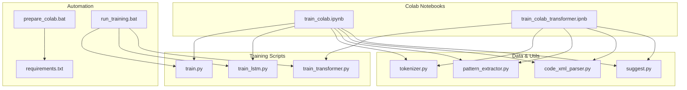
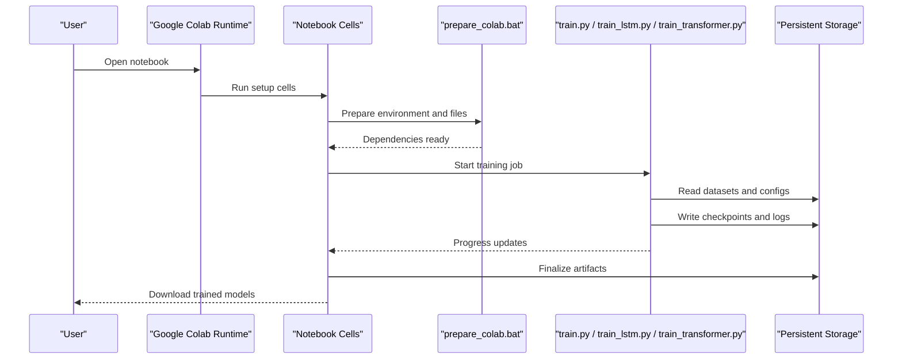
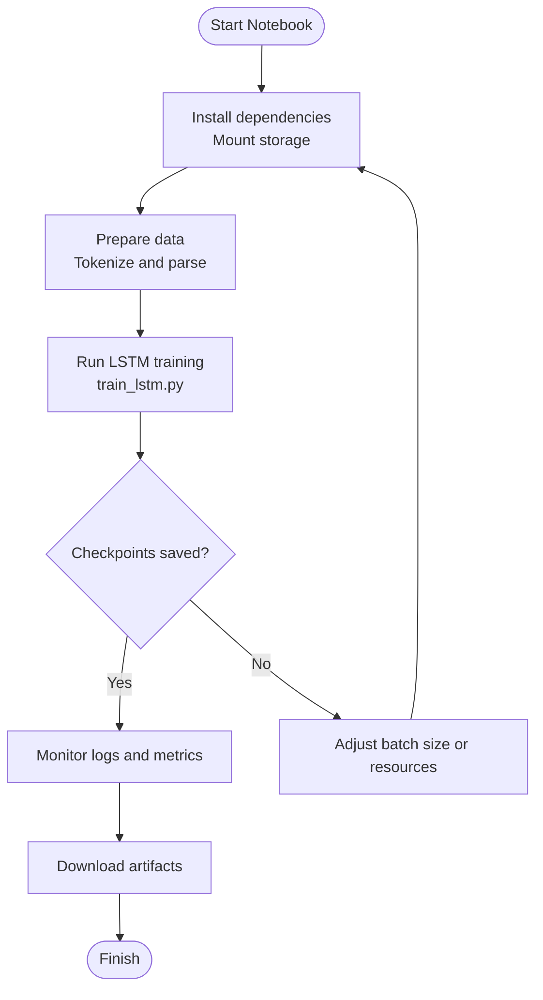
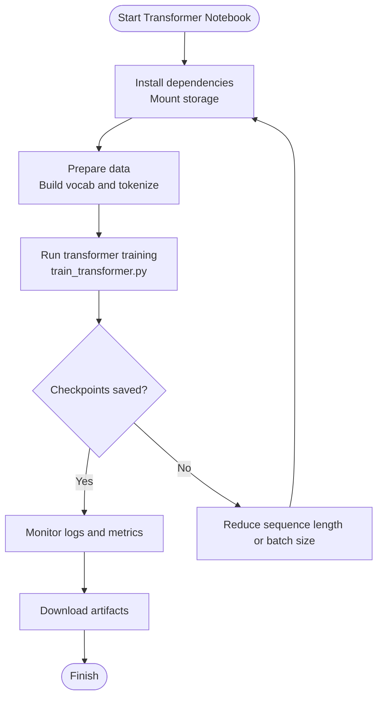
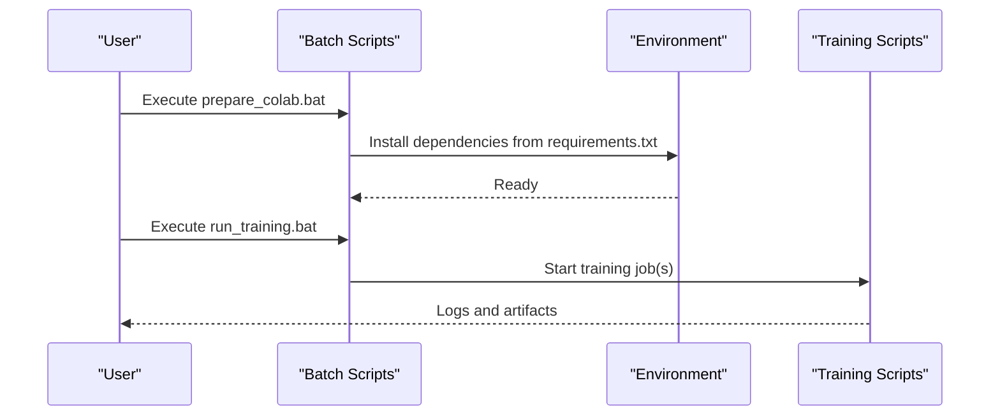
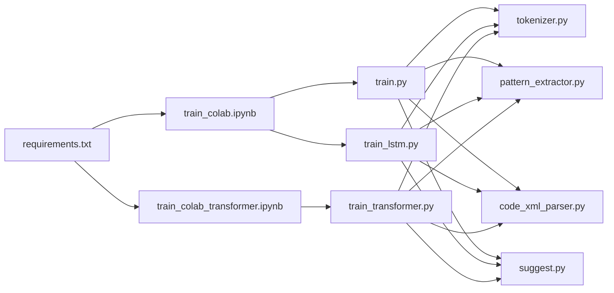

# Google Colab Integration

<cite>
**Referenced Files in This Document**
- [README_COLAB.txt](file://aip/README_COLAB.txt)
- [train_colab.ipynb](file://aip/train_colab.ipynb)
- [train_colab_transformer.ipynb](file://aip/train_colab_transformer.ipynb)
- [requirements.txt](file://aip/requirements.txt)
- [prepare_colab.bat](file://aip/prepare_colab.bat)
- [run_training.bat](file://aip/run_training.bat)
- [train.py](file://aip/train.py)
- [train_lstm.py](file://aip/train_lstm.py)
- [train_transformer.py](file://aip/train_transformer.py)
- [tokenizer.py](file://aip/tokenizer.py)
- [pattern_extractor.py](file://aip/pattern_extractor.py)
- [code_xml_parser.py](file://aip/code_xml_parser.py)
- [suggest.py](file://ip/suggest.py)
</cite>

## Table of Contents
1. [Introduction](#introduction)
2. [Project Structure](#project-structure)
3. [Core Components](#core-components)
4. [Architecture Overview](#architecture-overview)
5. [Detailed Component Analysis](#detailed-component-analysis)
6. [Dependency Analysis](#dependency-analysis)
7. [Performance Considerations](#performance-considerations)
8. [Troubleshooting Guide](#troubleshooting-guide)
9. [Conclusion](#conclusion)
10. [Appendices](#appendices)

## Introduction
This document explains how NewCatroid integrates with Google Colab for model training. It covers the notebook structure, automatic setup procedures, and cloud resource utilization. It also details differences between standard and transformer-specific notebooks, GPU configuration, memory management, session handling, step-by-step instructions to run training jobs, monitoring progress, downloading models, troubleshooting common issues, and best practices for efficient cloud training.

## Project Structure
The Colab integration is centered around the aip directory, which contains:
- Two Jupyter notebooks for Colab: one for standard training and one for transformer training
- Python scripts implementing data preparation, tokenization, and training logic
- Batch helpers to prepare and launch training workflows
- Requirements file listing dependencies used by the notebooks and scripts

**Diagram sources**
- [train_colab.ipynb](file://aip/train_colab.ipynb)
- [train_colab_transformer.ipynb](file://aip/train_colab_transformer.ipynb)
- [train.py](file://aip/train.py)
- [train_lstm.py](file://aip/train_lstm.py)
- [train_transformer.py](file://aip/train_transformer.py)
- [tokenizer.py](file://aip/tokenizer.py)
- [pattern_extractor.py](file://aip/pattern_extractor.py)
- [code_xml_parser.py](file://aip/code_xml_parser.py)
- [suggest.py](file://ip/suggest.py)
- [requirements.txt](file://aip/requirements.txt)
- [prepare_colab.bat](file://aip/prepare_colab.bat)
- [run_training.bat](file://aip/run_training.bat)

**Section sources**
- [README_COLAB.txt](file://aip/README_COLAB.txt)
- [train_colab.ipynb](file://aip/train_colab.ipynb)
- [train_colab_transformer.ipynb](file://aip/train_colab_transformer.ipynb)
- [requirements.txt](file://aip/requirements.txt)
- [prepare_colab.bat](file://aip/prepare_colab.bat)
- [run_training.bat](file://aip/run_training.bat)

## Core Components
- Standard Colab Notebook (train_colab.ipynb): Orchestrates environment setup, dataset preparation, tokenization, and training using LSTM-based or other non-transformer models. It typically invokes train.py and train_lstm.py.
- Transformer Colab Notebook (train_colab_transformer.ipynb): Similar orchestration but targets transformer-based training via train_transformer.py. It may include additional steps such as building vocabularies and configuring attention-related parameters.
- Training Scripts:
  - train.py: General training entry point and utilities.
  - train_lstm.py: LSTM-specific training pipeline.
  - train_transformer.py: Transformer-specific training pipeline.
- Data and Utilities:
  - tokenizer.py: Tokenization routines used by both pipelines.
  - pattern_extractor.py: Extracts patterns from source code.
  - code_xml_parser.py: Parses XML-based project structures.
  - suggest.py: Suggestion or inference helper used after training.
- Automation Helpers:
  - requirements.txt: Lists Python dependencies installed during setup.
  - prepare_colab.bat: Prepares the environment and files for Colab execution.
  - run_training.bat: Launches training jobs locally or within automated environments.

**Section sources**
- [train_colab.ipynb](file://aip/train_colab.ipynb)
- [train_colab_transformer.ipynb](file://aip/train_colab_transformer.ipynb)
- [train.py](file://aip/train.py)
- [train_lstm.py](file://aip/train_lstm.py)
- [train_transformer.py](file://aip/train_transformer.py)
- [tokenizer.py](file://aip/tokenizer.py)
- [pattern_extractor.py](file://aip/pattern_extractor.py)
- [code_xml_parser.py](file://aip/code_xml_parser.py)
- [suggest.py](file://ip/suggest.py)
- [requirements.txt](file://aip/requirements.txt)
- [prepare_colab.bat](file://aip/prepare_colab.bat)
- [run_training.bat](file://aip/run_training.bat)

## Architecture Overview
The Colab workflow follows a clear sequence:
1. Environment Setup: Install dependencies and mount persistent storage.
2. Data Preparation: Parse XML projects, extract patterns, build tokenizers/vocabularies.
3. Model Training: Execute the appropriate training script based on notebook selection.
4. Monitoring: Observe logs and metrics output by the training process.
5. Artifact Management: Save checkpoints and final models; download them to local storage.

**Diagram sources**
- [train_colab.ipynb](file://aip/train_colab.ipynb)
- [train_colab_transformer.ipynb](file://aip/train_colab_transformer.ipynb)
- [prepare_colab.bat](file://aip/prepare_colab.bat)
- [train.py](file://aip/train.py)
- [train_lstm.py](file://aip/train_lstm.py)
- [train_transformer.py](file://aip/train_transformer.py)

## Detailed Component Analysis

### Standard Colab Notebook (train_colab.ipynb)
- Purpose: End-to-end training for non-transformer models (e.g., LSTM).
- Typical flow:
  - Install dependencies from requirements.txt.
  - Mount Google Drive or Colab filesystem for persistence.
  - Prepare data using tokenizer.py, pattern_extractor.py, and code_xml_parser.py.
  - Invoke train.py and/or train_lstm.py to execute training.
  - Monitor logs and save checkpoints.
  - Provide instructions to download outputs.

**Diagram sources**
- [train_colab.ipynb](file://aip/train_colab.ipynb)
- [train_lstm.py](file://aip/train_lstm.py)
- [tokenizer.py](file://aip/tokenizer.py)
- [pattern_extractor.py](file://aip/pattern_extractor.py)
- [code_xml_parser.py](file://aip/code_xml_parser.py)

**Section sources**
- [train_colab.ipynb](file://aip/train_colab.ipynb)
- [train_lstm.py](file://aip/train_lstm.py)
- [tokenizer.py](file://aip/tokenizer.py)
- [pattern_extractor.py](file://aip/pattern_extractor.py)
- [code_xml_parser.py](file://aip/code_xml_parser.py)

### Transformer-Specific Colab Notebook (train_colab_transformer.ipynb)
- Purpose: End-to-end training for transformer-based models.
- Differences from standard notebook:
  - Uses train_transformer.py instead of LSTM-focused scripts.
  - May include additional preprocessing steps for token sequences and vocabulary building.
  - Often requires more GPU memory and longer runtime due to attention computations.
- Typical flow mirrors the standard notebook but adapts to transformer-specific parameters and data formats.

**Diagram sources**
- [train_colab_transformer.ipynb](file://aip/train_colab_transformer.ipynb)
- [train_transformer.py](file://aip/train_transformer.py)
- [tokenizer.py](file://aip/tokenizer.py)
- [pattern_extractor.py](file://aip/pattern_extractor.py)
- [code_xml_parser.py](file://aip/code_xml_parser.py)

**Section sources**
- [train_colab_transformer.ipynb](file://aip/train_colab_transformer.ipynb)
- [train_transformer.py](file://aip/train_transformer.py)
- [tokenizer.py](file://aip/tokenizer.py)
- [pattern_extractor.py](file://aip/pattern_extractor.py)
- [code_xml_parser.py](file://aip/code_xml_parser.py)

### Automation Helpers (prepare_colab.bat and run_training.bat)
- prepare_colab.bat: Automates dependency installation and file preparation for Colab execution. It ensures that all required packages listed in requirements.txt are available before training begins.
- run_training.bat: Launches training jobs by invoking the relevant training scripts. Useful for local automation or CI-like scenarios.

**Diagram sources**
- [prepare_colab.bat](file://aip/prepare_colab.bat)
- [run_training.bat](file://aip/run_training.bat)
- [requirements.txt](file://aip/requirements.txt)
- [train.py](file://aip/train.py)
- [train_lstm.py](file://aip/train_lstm.py)
- [train_transformer.py](file://aip/train_transformer.py)

**Section sources**
- [prepare_colab.bat](file://aip/prepare_colab.bat)
- [run_training.bat](file://aip/run_training.bat)
- [requirements.txt](file://aip/requirements.txt)

## Dependency Analysis
The Colab notebooks depend on a set of Python modules and external libraries defined in requirements.txt. The training scripts import utility modules for tokenization, parsing, and suggestion generation.

**Diagram sources**
- [requirements.txt](file://aip/requirements.txt)
- [train_colab.ipynb](file://aip/train_colab.ipynb)
- [train_colab_transformer.ipynb](file://aip/train_colab_transformer.ipynb)
- [train.py](file://aip/train.py)
- [train_lstm.py](file://aip/train_lstm.py)
- [train_transformer.py](file://aip/train_transformer.py)
- [tokenizer.py](file://aip/tokenizer.py)
- [pattern_extractor.py](file://aip/pattern_extractor.py)
- [code_xml_parser.py](file://aip/code_xml_parser.py)
- [suggest.py](file://ip/suggest.py)

**Section sources**
- [requirements.txt](file://aip/requirements.txt)
- [train_colab.ipynb](file://aip/train_colab.ipynb)
- [train_colab_transformer.ipynb](file://aip/train_colab_transformer.ipynb)
- [train.py](file://aip/train.py)
- [train_lstm.py](file://aip/train_lstm.py)
- [train_transformer.py](file://aip/train_transformer.py)
- [tokenizer.py](file://aip/tokenizer.py)
- [pattern_extractor.py](file://aip/pattern_extractor.py)
- [code_xml_parser.py](file://aip/code_xml_parser.py)
- [suggest.py](file://ip/suggest.py)

## Performance Considerations
- GPU Configuration:
  - Use Colab’s GPU runtime when available. Ensure the notebook selects GPU devices if needed by the training scripts.
  - For transformer models, prefer higher-tier GPUs to accommodate larger batch sizes and sequence lengths.
- Memory Management:
  - Reduce batch size or sequence length if encountering out-of-memory errors.
  - Clear intermediate variables and free memory between major steps.
- Session Handling:
  - Be aware of Colab session timeouts. Periodically save checkpoints to persistent storage.
  - Reconnect promptly if the runtime disconnects; resume training from the latest checkpoint.
- I/O Optimization:
  - Store large datasets and artifacts on mounted persistent storage to avoid re-downloading.
  - Stream data where possible to reduce memory pressure.

[No sources needed since this section provides general guidance]

## Troubleshooting Guide
Common issues and resolutions:
- Dependency Installation Failures:
  - Verify network access and retry installation.
  - Pin versions in requirements.txt if conflicts occur.
- Out-of-Memory Errors:
  - Lower batch size, sequence length, or model complexity.
  - Close unused notebooks and processes to free RAM.
- Timeout or Disconnection:
  - Save frequent checkpoints to persistent storage.
  - Resume training from the last checkpoint upon reconnection.
- Data Parsing Issues:
  - Validate XML inputs and ensure correct paths.
  - Inspect tokenizer outputs for unexpected tokens or empty sequences.
- Downloading Artifacts:
  - Confirm that artifacts are written to the expected directories.
  - Use Colab’s file browser or direct links to download models.

**Section sources**
- [train_colab.ipynb](file://aip/train_colab.ipynb)
- [train_colab_transformer.ipynb](file://aip/train_colab_transformer.ipynb)
- [prepare_colab.bat](file://aip/prepare_colab.bat)
- [run_training.bat](file://aip/run_training.bat)
- [requirements.txt](file://aip/requirements.txt)

## Conclusion
NewCatroid’s Colab integration streamlines model training by providing two focused notebooks: one for standard models and another for transformers. Both leverage shared utilities for data processing and tokenization, while automation scripts simplify environment setup and job launching. By following the recommended performance and troubleshooting practices, users can efficiently utilize Colab’s cloud resources to train and retrieve models.

[No sources needed since this section summarizes without analyzing specific files]

## Appendices

### Step-by-Step Guide: Running Training Jobs
- Open the appropriate notebook in Colab:
  - Standard training: train_colab.ipynb
  - Transformer training: train_colab_transformer.ipynb
- Run setup cells to install dependencies and mount persistent storage.
- Prepare data by executing cells that parse XML, extract patterns, and build tokenizers.
- Start training by running the designated training cell, which invokes the corresponding training script.
- Monitor logs and metrics printed by the training process.
- Once complete, download the trained models and artifacts from the specified directories.

**Section sources**
- [train_colab.ipynb](file://aip/train_colab.ipynb)
- [train_colab_transformer.ipynb](file://aip/train_colab_transformer.ipynb)
- [train.py](file://aip/train.py)
- [train_lstm.py](file://aip/train_lstm.py)
- [train_transformer.py](file://aip/train_transformer.py)

### Best Practices for Efficient Cloud Training
- Use persistent storage for datasets and checkpoints.
- Keep requirements pinned to avoid version drift.
- Implement periodic checkpointing and logging.
- Tune hyperparameters incrementally to balance speed and accuracy.
- Prefer smaller validation sets during experimentation.

[No sources needed since this section provides general guidance]