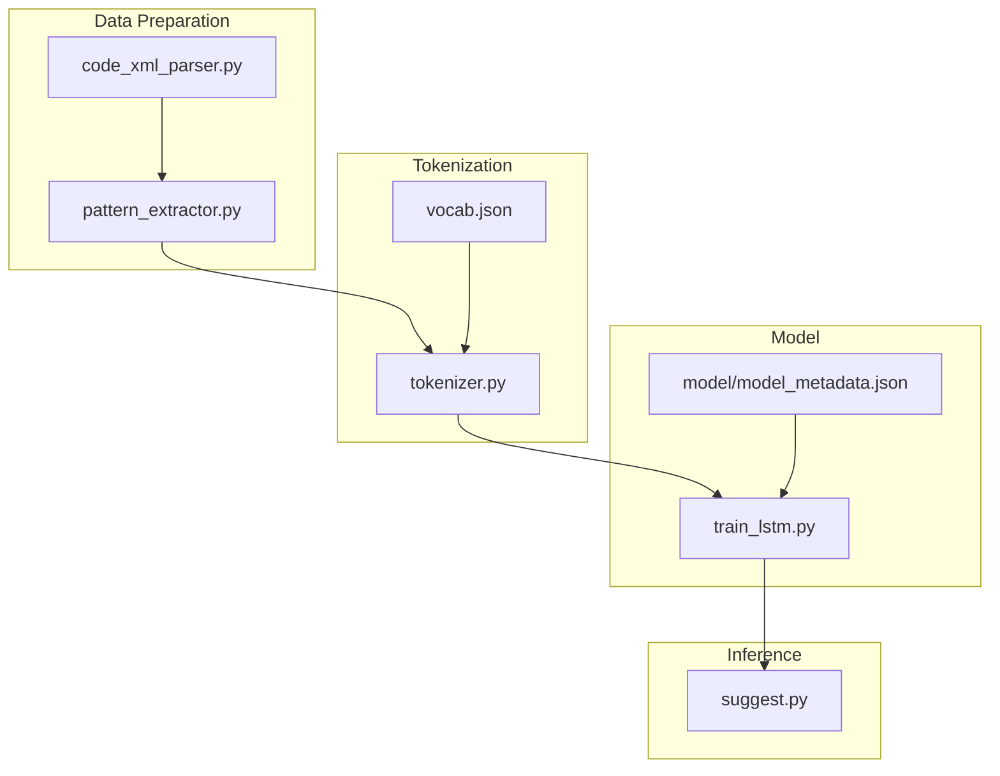
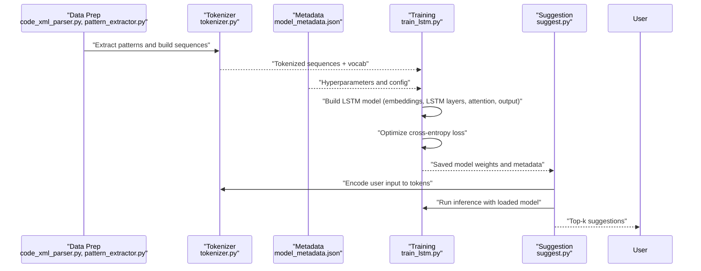
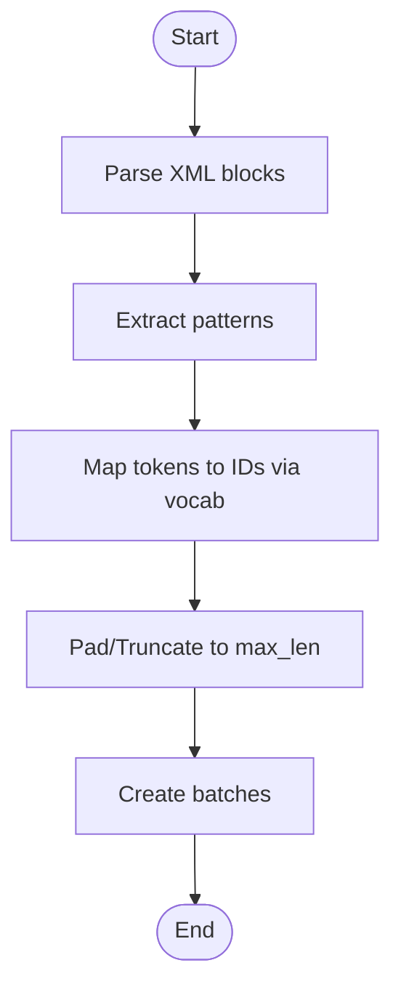
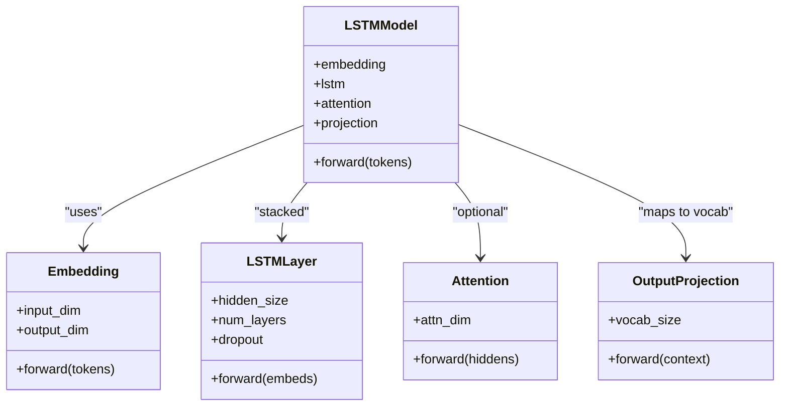
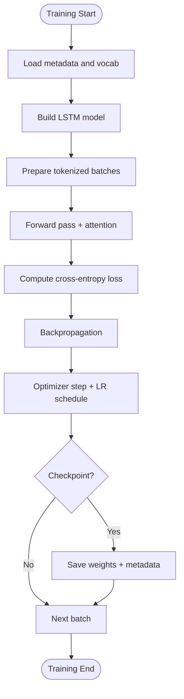
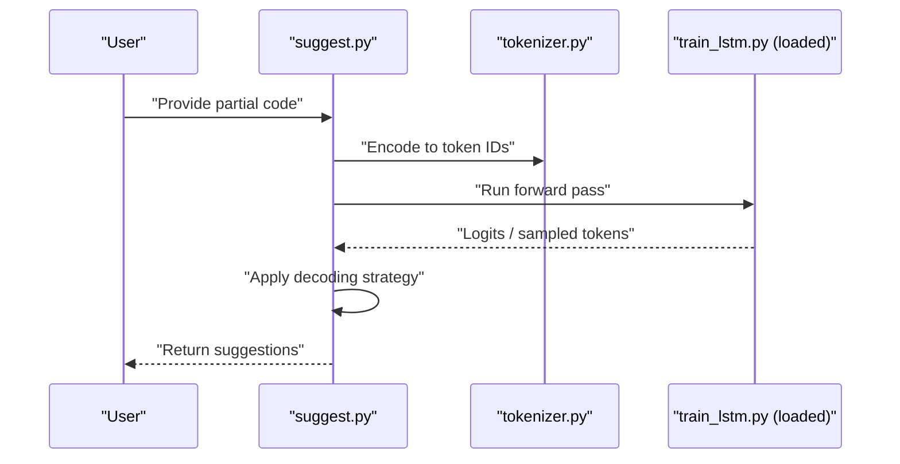
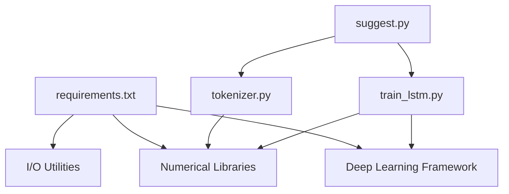

# LSTM Model Architecture

<cite>
**Referenced Files in This Document**
- [train_lstm.py](file://aip/train_lstm.py)
- [tokenizer.py](file://aip/tokenizer.py)
- [suggest.py](file://aip/suggest.py)
- [model_metadata.json](file://aip/model/model_metadata.json)
- [vocab.json](file://aip/vocab.json)
- [code_xml_parser.py](file://aip/code_xml_parser.py)
- [pattern_extractor.py](file://aip/pattern_extractor.py)
- [requirements.txt](file://aip/requirements.txt)
</cite>

## Table of Contents
1. [Introduction](#introduction)
2. [Project Structure](#project-structure)
3. [Core Components](#core-components)
4. [Architecture Overview](#architecture-overview)
5. [Detailed Component Analysis](#detailed-component-analysis)
6. [Dependency Analysis](#dependency-analysis)
7. [Performance Considerations](#performance-considerations)
8. [Troubleshooting Guide](#troubleshooting-guide)
9. [Conclusion](#conclusion)
10. [Appendices](#appendices)

## Introduction
This document explains the Long Short-Term Memory (LSTM) model architecture used for code pattern recognition and context-aware suggestions in NewCatroid. It covers network topology, sequence modeling via tokenization, attention mechanisms, training methodology, hyperparameters, memory requirements, performance characteristics, and practical usage patterns for configuration, training, and inference.

## Project Structure
The LSTM-related components are primarily located under the aip directory:
- Training pipeline and model definition: train_lstm.py
- Tokenization utilities: tokenizer.py
- Inference and suggestion service: suggest.py
- Data preparation helpers: code_xml_parser.py, pattern_extractor.py
- Model metadata and vocabulary: model/model_metadata.json, vocab.json
- Python dependencies: requirements.txt

**Diagram sources**
- [code_xml_parser.py](file://aip/code_xml_parser.py)
- [pattern_extractor.py](file://aip/pattern_extractor.py)
- [tokenizer.py](file://aip/tokenizer.py)
- [vocab.json](file://aip/vocab.json)
- [model_metadata.json](file://aip/model/model_metadata.json)
- [train_lstm.py](file://aip/train_lstm.py)
- [suggest.py](file://aip/suggest.py)

**Section sources**
- [train_lstm.py](file://aip/train_lstm.py)
- [tokenizer.py](file://aip/tokenizer.py)
- [suggest.py](file://aip/suggest.py)
- [model_metadata.json](file://aip/model/model_metadata.json)
- [vocab.json](file://aip/vocab.json)
- [code_xml_parser.py](file://aip/code_xml_parser.py)
- [pattern_extractor.py](file://aip/pattern_extractor.py)
- [requirements.txt](file://aip/requirements.txt)

## Core Components
- Sequence tokenization: Converts programming blocks into token sequences using a fixed vocabulary.
- LSTM model: Encodes token sequences with an embedding layer, one or more LSTM layers, optional attention, and an output projection to predict next tokens.
- Training loop: Optimizes a cross-entropy loss over predicted next-token distributions with configurable optimizer and learning rate schedule.
- Inference: Generates suggestions by sampling or greedy decoding conditioned on the current token sequence.

Key responsibilities:
- Tokenizer maps block elements to integer IDs and handles padding/truncation.
- Metadata file stores model configuration (embedding size, hidden sizes, number of layers, dropout, etc.).
- Training script builds the model from metadata, prepares batches, and runs optimization steps.
- Suggestion script loads the trained model and vocabulary to produce contextual completions.

**Section sources**
- [train_lstm.py](file://aip/train_lstm.py)
- [tokenizer.py](file://aip/tokenizer.py)
- [model_metadata.json](file://aip/model/model_metadata.json)
- [suggest.py](file://aip/suggest.py)

## Architecture Overview
The LSTM-based sequence model follows a standard encoder-decoder style where the encoder is an LSTM that processes token embeddings and optionally applies attention to refine context before predicting the next token.

**Diagram sources**
- [code_xml_parser.py](file://aip/code_xml_parser.py)
- [pattern_extractor.py](file://aip/pattern_extractor.py)
- [tokenizer.py](file://aip/tokenizer.py)
- [model_metadata.json](file://aip/model/model_metadata.json)
- [train_lstm.py](file://aip/train_lstm.py)
- [suggest.py](file://aip/suggest.py)

## Detailed Component Analysis

### Tokenization Pipeline
- Vocabulary management: A static vocabulary file defines token-to-ID mappings and special tokens (e.g., padding, unknown).
- Block parsing: Programming blocks are parsed from XML structures and converted into ordered token sequences.
- Sequence construction: Sequences are padded or truncated to a maximum length; batched inputs are prepared for training and inference.

**Diagram sources**
- [code_xml_parser.py](file://aip/code_xml_parser.py)
- [pattern_extractor.py](file://aip/pattern_extractor.py)
- [tokenizer.py](file://aip/tokenizer.py)
- [vocab.json](file://aip/vocab.json)

**Section sources**
- [tokenizer.py](file://aip/tokenizer.py)
- [vocab.json](file://aip/vocab.json)
- [code_xml_parser.py](file://aip/code_xml_parser.py)
- [pattern_extractor.py](file://aip/pattern_extractor.py)

### LSTM Model Topology
- Input embedding layer: Maps token IDs to dense vectors.
- LSTM cells: One or more stacked LSTM layers with specified hidden dimensions and dropout.
- Attention mechanism: Optional attention over LSTM outputs to weight relevant time steps for prediction.
- Output projection: Linear layer mapping final hidden states to logits over the vocabulary; softmax applied during inference.

**Diagram sources**
- [train_lstm.py](file://aip/train_lstm.py)
- [model_metadata.json](file://aip/model/model_metadata.json)

**Section sources**
- [train_lstm.py](file://aip/train_lstm.py)
- [model_metadata.json](file://aip/model/model_metadata.json)

### Training Methodology
- Loss function: Cross-entropy loss between predicted next-token distributions and ground-truth tokens.
- Optimization: Configurable optimizer (e.g., Adam) with learning rate scheduling and gradient clipping.
- Batch processing: Padded sequences are masked to ignore padding positions when computing loss.
- Checkpointing: Periodic saving of model weights and metadata for resuming training and deployment.

**Diagram sources**
- [train_lstm.py](file://aip/train_lstm.py)
- [model_metadata.json](file://aip/model/model_metadata.json)

**Section sources**
- [train_lstm.py](file://aip/train_lstm.py)
- [model_metadata.json](file://aip/model/model_metadata.json)

### Inference and Suggestions
- Context encoding: Current token sequence is encoded through the same embedding and LSTM layers.
- Decoding strategies: Greedy selection or top-k sampling to generate next tokens iteratively.
- Attention usage: If enabled, attention weights highlight influential past tokens for better suggestions.
- Post-processing: Filter out special tokens and map IDs back to human-readable block names.

**Diagram sources**
- [suggest.py](file://aip/suggest.py)
- [tokenizer.py](file://aip/tokenizer.py)
- [train_lstm.py](file://aip/train_lstm.py)

**Section sources**
- [suggest.py](file://aip/suggest.py)
- [tokenizer.py](file://aip/tokenizer.py)
- [train_lstm.py](file://aip/train_lstm.py)

## Dependency Analysis
External dependencies include deep learning frameworks and utility libraries required for data processing, model building, and training. The dependency list is defined in the project’s requirements file.

**Diagram sources**
- [requirements.txt](file://aip/requirements.txt)
- [tokenizer.py](file://aip/tokenizer.py)
- [train_lstm.py](file://aip/train_lstm.py)
- [suggest.py](file://aip/suggest.py)

**Section sources**
- [requirements.txt](file://aip/requirements.txt)

## Performance Considerations
- Sequence length: Longer sequences increase memory and compute costs; consider truncation policies.
- Hidden dimensionality: Larger hidden sizes improve expressiveness but raise memory usage and training time.
- Number of layers: Stacking more LSTM layers increases capacity at the cost of slower training and inference.
- Attention overhead: Attention adds computation proportional to sequence length; beneficial for long-range dependencies.
- Batch size: Larger batches improve throughput but require more GPU memory; tune based on hardware constraints.
- Precision: Mixed precision can reduce memory footprint and speed up training if supported by the framework.

[No sources needed since this section provides general guidance]

## Troubleshooting Guide
Common issues and resolutions:
- Vocabulary mismatch: Ensure the same vocab.json used during training is available at inference time.
- Padding errors: Verify that sequences are consistently padded/truncated to the configured max length.
- Out-of-memory: Reduce batch size, hidden size, or sequence length; enable mixed precision if available.
- Slow training: Use larger batch sizes, optimize dataloader workers, and ensure efficient I/O.
- Poor suggestions: Increase model capacity (hidden size/layers), add attention, or expand training data diversity.

**Section sources**
- [tokenizer.py](file://aip/tokenizer.py)
- [train_lstm.py](file://aip/train_lstm.py)
- [suggest.py](file://aip/suggest.py)

## Conclusion
The LSTM architecture in NewCatroid provides a robust foundation for code pattern recognition and context-aware suggestions. By combining structured tokenization, configurable LSTM layers, optional attention, and a clear training/inference pipeline, it supports scalable development of intelligent coding assistance features. Proper tuning of hyperparameters and careful resource management are key to achieving desired performance.

[No sources needed since this section summarizes without analyzing specific files]

## Appendices

### Hyperparameter Specifications
Typical hyperparameters are stored in the model metadata file and may include:
- Embedding dimension
- LSTM hidden size
- Number of LSTM layers
- Dropout rates
- Maximum sequence length
- Vocabulary size
- Attention settings (enabled/disabled, attention dimension)
- Training options (optimizer type, learning rate, batch size, epochs)

**Section sources**
- [model_metadata.json](file://aip/model/model_metadata.json)

### Practical Examples

#### Configuration Example
- Define embedding size, hidden size, number of layers, and attention flags in the metadata file.
- Set vocabulary and max sequence length consistent across training and inference.

**Section sources**
- [model_metadata.json](file://aip/model/model_metadata.json)
- [vocab.json](file://aip/vocab.json)

#### Training Procedure
- Prepare tokenized sequences from XML blocks using the parser and extractor.
- Build the LSTM model from metadata and run the training loop with cross-entropy loss.
- Save checkpoints periodically for later evaluation and deployment.

**Section sources**
- [code_xml_parser.py](file://aip/code_xml_parser.py)
- [pattern_extractor.py](file://aip/pattern_extractor.py)
- [tokenizer.py](file://aip/tokenizer.py)
- [train_lstm.py](file://aip/train_lstm.py)

#### Inference Patterns
- Encode user input into token IDs using the tokenizer.
- Run the loaded model to obtain logits or sample next tokens.
- Apply decoding strategies (greedy or top-k) and map results back to block names.

**Section sources**
- [tokenizer.py](file://aip/tokenizer.py)
- [suggest.py](file://aip/suggest.py)
- [train_lstm.py](file://aip/train_lstm.py)