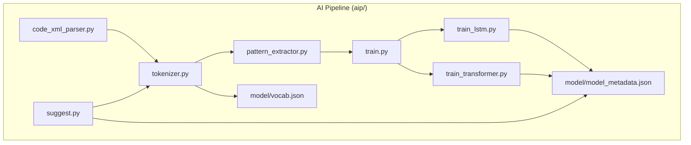
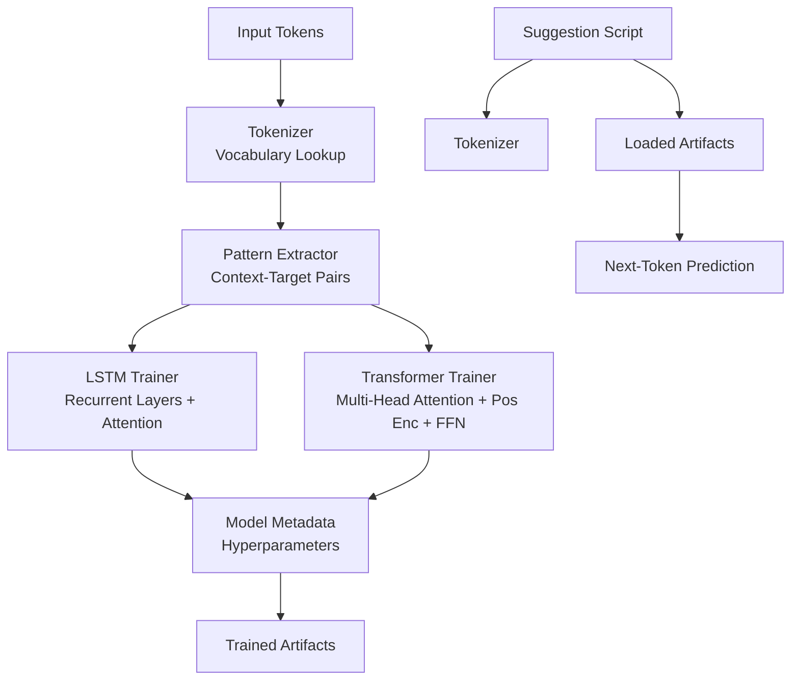
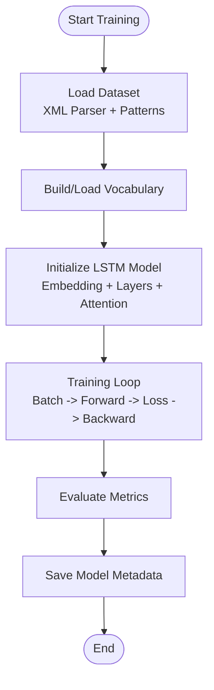
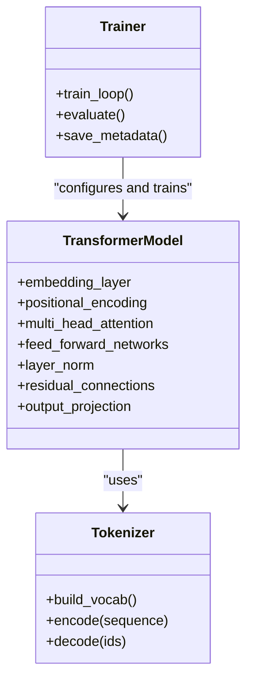
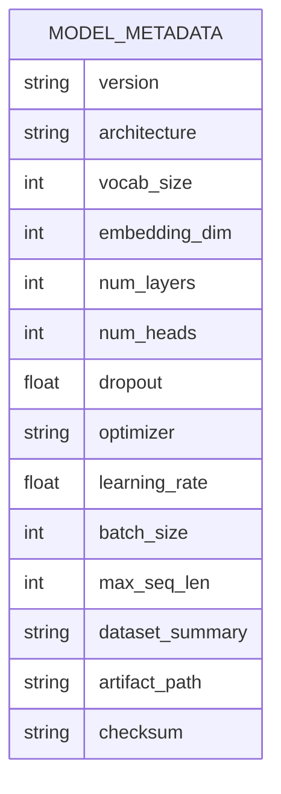
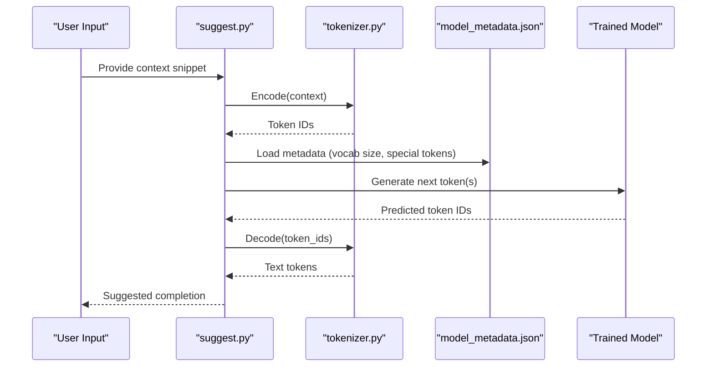
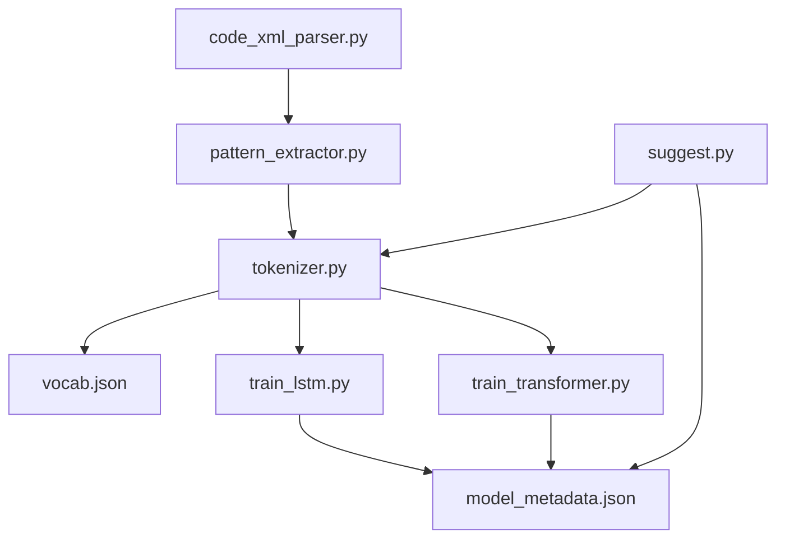

# Model Architectures and Implementations

<cite>
**Referenced Files in This Document**
- [train.py](file://aip/train.py)
- [train_lstm.py](file://aip/train_lstm.py)
- [train_transformer.py](file://aip/train_transformer.py)
- [model_metadata.json](file://aip/model/model_metadata.json)
- [vocab.json](file://aip/model/vocab.json)
- [tokenizer.py](file://aip/tokenizer.py)
- [pattern_extractor.py](file://aip/pattern_extractor.py)
- [code_xml_parser.py](file://aip/code_xml_parser.py)
- [suggest.py](file://aip/suggest.py)
</cite>

## Table of Contents
1. [Introduction](#introduction)
2. [Project Structure](#project-structure)
3. [Core Components](#core-components)
4. [Architecture Overview](#architecture-overview)
5. [Detailed Component Analysis](#detailed-component-analysis)
6. [Dependency Analysis](#dependency-analysis)
7. [Performance Considerations](#performance-considerations)
8. [Troubleshooting Guide](#troubleshooting-guide)
9. [Conclusion](#conclusion)
10. [Appendices](#appendices)

## Introduction
This document explains the model architectures supported by NewCatroid’s training pipeline, focusing on LSTM and Transformer models used for code suggestion. It covers network topology, attention mechanisms, sequence modeling approaches, metadata schema, configuration files, and hyperparameters. It also provides comparative analysis and guidance for selecting appropriate architectures for different coding tasks.

## Project Structure
The AI-related components are primarily located under aip/. The key elements include:
- Training scripts for LSTM and Transformer models
- Tokenization and pattern extraction utilities
- Code XML parsing for dataset preparation
- Model metadata and vocabulary definitions
- Suggestion inference entry point

**Diagram sources**
- [train.py](file://aip/train.py)
- [train_lstm.py](file://aip/train_lstm.py)
- [train_transformer.py](file://aip/train_transformer.py)
- [tokenizer.py](file://aip/tokenizer.py)
- [pattern_extractor.py](file://aip/pattern_extractor.py)
- [code_xml_parser.py](file://aip/code_xml_parser.py)
- [model_metadata.json](file://aip/model/model_metadata.json)
- [vocab.json](file://aip/model/vocab.json)
- [suggest.py](file://aip/suggest.py)

**Section sources**
- [train.py](file://aip/train.py)
- [train_lstm.py](file://aip/train_lstm.py)
- [train_transformer.py](file://aip/train_transformer.py)
- [tokenizer.py](file://aip/tokenizer.py)
- [pattern_extractor.py](file://aip/pattern_extractor.py)
- [code_xml_parser.py](file://aip/code_xml_parser.py)
- [model_metadata.json](file://aip/model/model_metadata.json)
- [vocab.json](file://aip/model/vocab.json)
- [suggest.py](file://aip/suggest.py)

## Core Components
- Data ingestion and preprocessing:
  - XML parser extracts structured code snippets from Catroid projects.
  - Tokenizer builds and manages the vocabulary and converts sequences to token IDs.
  - Pattern extractor prepares training samples with context-target pairs.
- Training:
  - Unified training driver orchestrates dataset loading, batching, and training loops.
  - LSTM trainer configures recurrent layers, attention, and optimization settings.
  - Transformer trainer configures encoder/decoder or decoder-only stacks, multi-head attention, positional encoding, and feed-forward networks.
- Artifacts:
  - Vocabulary file stores token-to-ID mappings.
  - Model metadata captures architecture details, hyperparameters, and versioning.
- Inference:
  - Suggestion script loads trained artifacts and generates next-token predictions conditioned on context.

**Section sources**
- [code_xml_parser.py](file://aip/code_xml_parser.py)
- [tokenizer.py](file://aip/tokenizer.py)
- [pattern_extractor.py](file://aip/pattern_extractor.py)
- [train.py](file://aip/train.py)
- [train_lstm.py](file://aip/train_lstm.py)
- [train_transformer.py](file://aip/train_transformer.py)
- [model_metadata.json](file://aip/model/model_metadata.json)
- [vocab.json](file://aip/model/vocab.json)
- [suggest.py](file://aip/suggest.py)

## Architecture Overview
NewCatroid supports two primary model families for code suggestion:
- LSTM-based sequence model:
  - Uses recurrent layers to process token sequences step-by-step.
  - Can incorporate attention over previous hidden states to focus on relevant context.
  - Suitable for shorter contexts and lower computational budgets.
- Transformer-based sequence model:
  - Uses self-attention to capture long-range dependencies efficiently.
  - Includes positional encoding to preserve order information.
  - Multi-head attention allows parallel processing of multiple representation subspaces.
  - Feed-forward networks follow each attention layer for non-linear transformations.

**Diagram sources**
- [tokenizer.py](file://aip/tokenizer.py)
- [pattern_extractor.py](file://aip/pattern_extractor.py)
- [train_lstm.py](file://aip/train_lstm.py)
- [train_transformer.py](file://aip/train_transformer.py)
- [model_metadata.json](file://aip/model/model_metadata.json)
- [suggest.py](file://aip/suggest.py)

## Detailed Component Analysis

### LSTM Model Implementation
- Network topology:
  - Embedding layer maps tokens to dense vectors.
  - One or more LSTM layers process sequences sequentially.
  - Optional attention mechanism aggregates context-aware representations.
  - Output projection maps hidden states to vocabulary logits for next-token prediction.
- Sequence modeling approach:
  - Autoregressive generation predicts one token at a time conditioned on prior tokens.
  - Context windows can be enforced via pattern extraction to limit input length.
- Hyperparameters typically include:
  - Hidden dimensionality, number of layers, dropout rates, attention type, optimizer settings, learning rate schedule, batch size, and sequence length.

**Diagram sources**
- [code_xml_parser.py](file://aip/code_xml_parser.py)
- [pattern_extractor.py](file://aip/pattern_extractor.py)
- [tokenizer.py](file://aip/tokenizer.py)
- [train_lstm.py](file://aip/train_lstm.py)
- [model_metadata.json](file://aip/model/model_metadata.json)

**Section sources**
- [train_lstm.py](file://aip/train_lstm.py)
- [tokenizer.py](file://aip/tokenizer.py)
- [pattern_extractor.py](file://aip/pattern_extractor.py)
- [model_metadata.json](file://aip/model/model_metadata.json)

### Transformer Model Implementation
- Network topology:
  - Embedding layer followed by positional encoding to inject sequence order.
  - Stacked transformer blocks with multi-head self-attention and feed-forward networks.
  - Layer normalization and residual connections stabilize training.
  - Output projection maps final hidden states to vocabulary logits.
- Attention mechanisms:
  - Multi-head attention computes attention across multiple subspaces in parallel.
  - Positional encoding ensures tokens retain their relative positions.
- Sequence modeling approach:
  - Decoder-only or encoder-decoder depending on task; for code suggestion, decoder-only autoregressive generation is common.
- Hyperparameters typically include:
  - Number of heads, layers, embedding dimension, dropout, activation functions, optimizer settings, learning rate schedule, batch size, and maximum sequence length.

**Diagram sources**
- [train_transformer.py](file://aip/train_transformer.py)
- [tokenizer.py](file://aip/tokenizer.py)
- [model_metadata.json](file://aip/model/model_metadata.json)

**Section sources**
- [train_transformer.py](file://aip/train_transformer.py)
- [tokenizer.py](file://aip/tokenizer.py)
- [model_metadata.json](file://aip/model/model_metadata.json)

### Model Metadata Schema
The metadata file documents model identity, architecture, and training configuration. Typical fields include:
- Version and build identifiers
- Architecture type (e.g., LSTM, Transformer)
- Hyperparameters (dimensions, layers, heads, dropout, optimizer settings)
- Vocabulary size and special tokens
- Training dataset summary and preprocessing steps
- Artifact paths and checksums

**Diagram sources**
- [model_metadata.json](file://aip/model/model_metadata.json)

**Section sources**
- [model_metadata.json](file://aip/model/model_metadata.json)

### Vocabulary and Tokenization
- Vocabulary management:
  - Stores token-to-ID mappings and handles special tokens.
  - Supports building from corpus or loading prebuilt vocabulary.
- Encoding/decoding:
  - Converts text sequences to token IDs for model input.
  - Converts predicted token IDs back to human-readable tokens.

**Diagram sources**
- [suggest.py](file://aip/suggest.py)
- [tokenizer.py](file://aip/tokenizer.py)
- [model_metadata.json](file://aip/model/model_metadata.json)

**Section sources**
- [tokenizer.py](file://aip/tokenizer.py)
- [vocab.json](file://aip/model/vocab.json)
- [suggest.py](file://aip/suggest.py)
- [model_metadata.json](file://aip/model/model_metadata.json)

## Dependency Analysis
The training pipeline depends on data preprocessing, tokenization, and configuration artifacts. The following diagram shows core dependencies:

**Diagram sources**
- [code_xml_parser.py](file://aip/code_xml_parser.py)
- [pattern_extractor.py](file://aip/pattern_extractor.py)
- [tokenizer.py](file://aip/tokenizer.py)
- [vocab.json](file://aip/model/vocab.json)
- [train_lstm.py](file://aip/train_lstm.py)
- [train_transformer.py](file://aip/train_transformer.py)
- [model_metadata.json](file://aip/model/model_metadata.json)
- [suggest.py](file://aip/suggest.py)

**Section sources**
- [train.py](file://aip/train.py)
- [train_lstm.py](file://aip/train_lstm.py)
- [train_transformer.py](file://aip/train_transformer.py)
- [tokenizer.py](file://aip/tokenizer.py)
- [pattern_extractor.py](file://aip/pattern_extractor.py)
- [code_xml_parser.py](file://aip/code_xml_parser.py)
- [model_metadata.json](file://aip/model/model_metadata.json)
- [vocab.json](file://aip/model/vocab.json)
- [suggest.py](file://aip/suggest.py)

## Performance Considerations
- LSTM:
  - Lower memory footprint and faster setup; suitable for short contexts and constrained environments.
  - May struggle with very long-range dependencies due to sequential processing.
- Transformer:
  - Higher computational cost and memory usage; excels at capturing long-range dependencies.
  - Parallelizable attention improves throughput on capable hardware.
- Hardware requirements:
  - GPU acceleration recommended for Transformer training; CPU feasible for small-scale experiments.
- Optimization tips:
  - Tune batch size and sequence length based on available memory.
  - Use gradient clipping and learning rate scheduling to stabilize training.
  - Employ mixed precision if supported by your environment.

[No sources needed since this section provides general guidance]

## Troubleshooting Guide
Common issues and resolutions:
- Vocabulary mismatch:
  - Ensure the tokenizer’s vocabulary matches the model metadata’s expected size and special tokens.
- Shape errors during training:
  - Verify sequence lengths and padding strategies align with model expectations.
- Out-of-memory errors:
  - Reduce batch size or sequence length; consider using smaller models or fewer layers.
- Slow training:
  - Enable GPU if available; adjust dataloader workers and prefetching.
- Poor suggestion quality:
  - Increase context window; fine-tune attention or add more layers; review dataset quality.

**Section sources**
- [train.py](file://aip/train.py)
- [train_lstm.py](file://aip/train_lstm.py)
- [train_transformer.py](file://aip/train_transformer.py)
- [tokenizer.py](file://aip/tokenizer.py)
- [model_metadata.json](file://aip/model/model_metadata.json)

## Conclusion
NewCatroid’s training pipeline supports both LSTM and Transformer architectures for code suggestion. LSTM models offer efficiency and simplicity, while Transformers provide superior modeling capacity for complex, long-range dependencies. Selecting an architecture depends on task complexity, available resources, and latency constraints. Proper configuration of metadata, vocabulary, and hyperparameters is essential for reproducible and high-quality results.

[No sources needed since this section summarizes without analyzing specific files]

## Appendices

### Configuration and Hyperparameter Selection Guidance
- For short, local completions:
  - Prefer LSTM with moderate hidden dimensions and limited layers.
- For broader contextual suggestions:
  - Prefer Transformer with sufficient heads and layers; tune dropout and learning rate carefully.
- Customization options:
  - Adjust embedding sizes, number of layers, attention heads, and sequence lengths.
  - Modify optimizer and scheduler settings to fit dataset characteristics.
  - Update metadata to reflect changes and ensure compatibility with inference.

**Section sources**
- [train_lstm.py](file://aip/train_lstm.py)
- [train_transformer.py](file://aip/train_transformer.py)
- [model_metadata.json](file://aip/model/model_metadata.json)