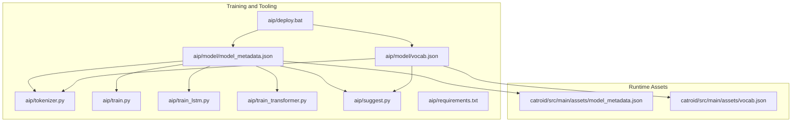
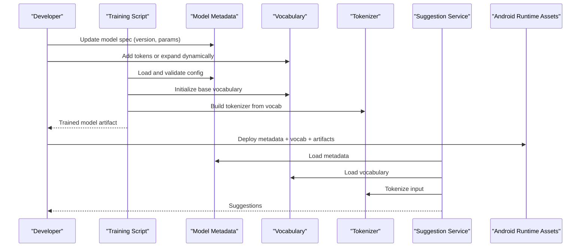
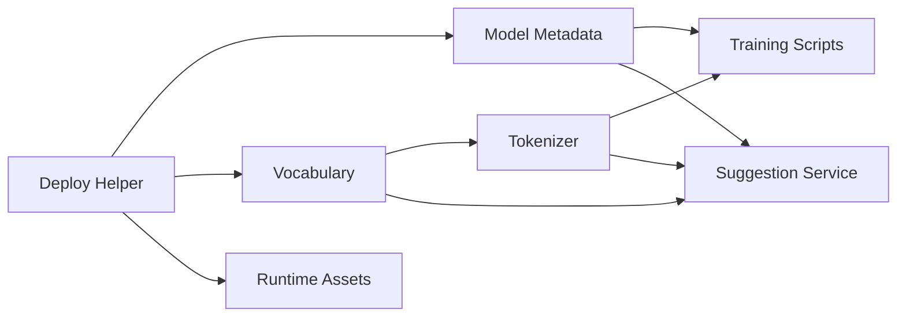

# Model Metadata and Configuration

<cite>
**Referenced Files in This Document**
- [model_metadata.json](file://aip/model/model_metadata.json)
- [vocab.json](file://aip/model/vocab.json)
- [tokenizer.py](file://aip/tokenizer.py)
- [train.py](file://aip/train.py)
- [train_lstm.py](file://aip/train_lstm.py)
- [train_transformer.py](file://aip/train_transformer.py)
- [suggest.py](file://aip/suggest.py)
- [deploy.bat](file://aip/deploy.bat)
- [requirements.txt](file://aip/requirements.txt)
- [model_metadata.json](file://catroid/src/main/assets/model_metadata.json)
- [vocab.json](file://catroid/src/main/assets/vocab.json)
</cite>

## Table of Contents
1. [Introduction](#introduction)
2. [Project Structure](#project-structure)
3. [Core Components](#core-components)
4. [Architecture Overview](#architecture-overview)
5. [Detailed Component Analysis](#detailed-component-analysis)
6. [Dependency Analysis](#dependency-analysis)
7. [Performance Considerations](#performance-considerations)
8. [Troubleshooting Guide](#troubleshooting-guide)
9. [Conclusion](#conclusion)
10. [Appendices](#appendices)

## Introduction
This document describes the model metadata schema and configuration system used across NewCatroid’s AI components. It focuses on:
- The JSON-based model specification and versioning
- Architecture type definitions and parameter validation rules
- Vocabulary management for code tokenization, including custom token types and dynamic expansion
- Model registry and deployment configuration files
- Runtime environment specifications
- Examples of complete configurations, migration procedures between versions, and best practices for consistency across development and production environments

The goal is to provide a clear, actionable guide for maintaining model metadata and ensuring compatibility between training, serving, and runtime environments.

## Project Structure
NewCatroid includes AI-related assets and scripts under two primary locations:
- Training and tooling: aip/ (Python scripts, notebooks, and model artifacts)
- Runtime assets: catroid/src/main/assets/ (bundled model metadata and vocabulary for Android runtime)

Key files relevant to this documentation:
- aip/model/model_metadata.json: canonical model metadata schema and examples
- aip/model/vocab.json: base vocabulary for tokenization
- catroid/src/main/assets/model_metadata.json: runtime copy of model metadata
- catroid/src/main/assets/vocab.json: runtime copy of vocabulary
- aip/tokenizer.py: tokenizer implementation using vocab.json
- aip/train*.py: training entry points that consume model metadata
- aip/suggest.py: inference suggestion service consuming metadata and vocabulary
- aip/deploy.bat: deployment helper script
- aip/requirements.txt: Python dependencies for training and tooling

**Diagram sources**
- [model_metadata.json](file://aip/model/model_metadata.json)
- [vocab.json](file://aip/model/vocab.json)
- [tokenizer.py](file://aip/tokenizer.py)
- [train.py](file://aip/train.py)
- [train_lstm.py](file://aip/train_lstm.py)
- [train_transformer.py](file://aip/train_transformer.py)
- [suggest.py](file://aip/suggest.py)
- [deploy.bat](file://aip/deploy.bat)
- [requirements.txt](file://aip/requirements.txt)
- [model_metadata.json](file://catroid/src/main/assets/model_metadata.json)
- [vocab.json](file://catroid/src/main/assets/vocab.json)

**Section sources**
- [model_metadata.json](file://aip/model/model_metadata.json)
- [vocab.json](file://aip/model/vocab.json)
- [tokenizer.py](file://aip/tokenizer.py)
- [train.py](file://aip/train.py)
- [train_lstm.py](file://aip/train_lstm.py)
- [train_transformer.py](file://aip/train_transformer.py)
- [suggest.py](file://aip/suggest.py)
- [deploy.bat](file://aip/deploy.bat)
- [requirements.txt](file://aip/requirements.txt)
- [model_metadata.json](file://catroid/src/main/assets/model_metadata.json)
- [vocab.json](file://catroid/src/main/assets/vocab.json)

## Core Components
- Model metadata schema: Defines architecture types, parameters, versioning, and compatibility constraints. Used by training scripts and runtime to ensure consistent behavior.
- Vocabulary management: Centralized token set with support for custom programming constructs and dynamic expansion at runtime or during training.
- Training entry points: Consume metadata to configure models (LSTM, Transformer), validate parameters, and initialize tokenizers.
- Inference service: Loads metadata and vocabulary to tokenize input and generate suggestions.
- Deployment helpers: Scripts to package and deploy model artifacts and metadata into runtime assets.

**Section sources**
- [model_metadata.json](file://aip/model/model_metadata.json)
- [vocab.json](file://aip/model/vocab.json)
- [tokenizer.py](file://aip/tokenizer.py)
- [train.py](file://aip/train.py)
- [train_lstm.py](file://aip/train_lstm.py)
- [train_transformer.py](file://aip/train_transformer.py)
- [suggest.py](file://aip/suggest.py)
- [deploy.bat](file://aip/deploy.bat)

## Architecture Overview
The system follows a clear separation between training-time and runtime concerns, unified by shared JSON configuration files.

**Diagram sources**
- [model_metadata.json](file://aip/model/model_metadata.json)
- [vocab.json](file://aip/model/vocab.json)
- [tokenizer.py](file://aip/tokenizer.py)
- [train.py](file://aip/train.py)
- [train_lstm.py](file://aip/train_lstm.py)
- [train_transformer.py](file://aip/train_transformer.py)
- [suggest.py](file://aip/suggest.py)
- [deploy.bat](file://aip/deploy.bat)
- [model_metadata.json](file://catroid/src/main/assets/model_metadata.json)
- [vocab.json](file://catroid/src/main/assets/vocab.json)

## Detailed Component Analysis

### Model Metadata Schema
The model metadata file defines:
- Versioning: Major/minor patch fields and compatibility matrices
- Architecture types: Enumerated values such as LSTM and Transformer
- Parameters: Architecture-specific hyperparameters with validation rules (ranges, required fields)
- Artifacts: Paths or identifiers for trained weights and related resources
- Environment: Constraints like minimum runtime versions or dependency requirements

Validation rules typically include:
- Required fields per architecture type
- Numeric bounds for hyperparameters
- Consistency checks between architecture and parameters
- Version compatibility checks against runtime expectations

Best practices:
- Keep major versions immutable; use minor/patch for additive changes
- Document breaking changes explicitly in version notes
- Maintain backward-compatible defaults where possible

**Section sources**
- [model_metadata.json](file://aip/model/model_metadata.json)
- [model_metadata.json](file://catroid/src/main/assets/model_metadata.json)

### Vocabulary Management System
The vocabulary system provides:
- Base token set defined in vocab.json
- Custom token types for programming constructs (e.g., keywords, block names, operators)
- Dynamic expansion mechanisms to add domain-specific tokens without rebuilding the entire vocabulary
- Deterministic ordering and stable IDs for reproducibility

Operational considerations:
- Ensure token uniqueness and avoid ambiguous mappings
- Use reserved namespaces for custom tokens
- Validate vocabulary integrity before training or runtime load
- Pin vocabulary versions alongside model metadata to guarantee compatibility

**Section sources**
- [vocab.json](file://aip/model/vocab.json)
- [vocab.json](file://catroid/src/main/assets/vocab.json)
- [tokenizer.py](file://aip/tokenizer.py)

### Tokenizer Implementation
The tokenizer consumes the vocabulary and supports:
- Loading base tokens and custom extensions
- Encoding/decoding sequences consistently with model expectations
- Handling unknown tokens via fallback strategies (e.g., UNK token)
- Integrating with both LSTM and Transformer pipelines

Design patterns:
- Factory-like initialization based on metadata
- Configurable maximum sequence length and padding behavior
- Deterministic hashing for token IDs

**Section sources**
- [tokenizer.py](file://aip/tokenizer.py)
- [vocab.json](file://aip/model/vocab.json)

### Training Entry Points
Training scripts consume model metadata to:
- Validate configuration and enforce parameter constraints
- Initialize tokenizers and data pipelines
- Configure architecture-specific settings (layers, attention heads, hidden sizes)
- Log and record provenance information tied to metadata version

Common flows:
- Parse metadata and resolve architecture type
- Apply default overrides when safe
- Fail fast on invalid or incompatible configurations

**Section sources**
- [train.py](file://aip/train.py)
- [train_lstm.py](file://aip/train_lstm.py)
- [train_transformer.py](file://aip/train_transformer.py)
- [model_metadata.json](file://aip/model/model_metadata.json)

### Inference Suggestion Service
The suggestion service:
- Loads metadata and vocabulary at startup
- Initializes the tokenizer and model loader
- Accepts user input, tokenizes it, and returns predictions
- Enforces runtime constraints declared in metadata (e.g., minimum supported versions)

Error handling:
- Graceful degradation when tokens are missing
- Clear error messages for incompatible metadata versions
- Logging for diagnostics and auditability

**Section sources**
- [suggest.py](file://aip/suggest.py)
- [model_metadata.json](file://aip/model/model_metadata.json)
- [vocab.json](file://aip/model/vocab.json)

### Deployment Configuration
Deployment helpers package:
- Model artifacts
- Metadata and vocabulary files
- Runtime asset copies into the Android app bundle

Process highlights:
- Validate metadata and vocabulary before packaging
- Copy files to catroid/src/main/assets/
- Ensure version alignment between training and runtime assets

**Section sources**
- [deploy.bat](file://aip/deploy.bat)
- [model_metadata.json](file://catroid/src/main/assets/model_metadata.json)
- [vocab.json](file://catroid/src/main/assets/vocab.json)

### Runtime Environment Specifications
Runtime environment is specified through:
- Dependency declarations in requirements.txt for training/tooling
- Metadata-enforced constraints for runtime compatibility
- Asset bundling strategy ensuring deterministic loading

Recommendations:
- Pin dependency versions in CI/CD
- Separate dev/test dependencies from production runtime needs
- Document platform-specific constraints (e.g., Android API levels)

**Section sources**
- [requirements.txt](file://aip/requirements.txt)
- [model_metadata.json](file://aip/model/model_metadata.json)

## Dependency Analysis
The following diagram shows key dependencies among core components:

**Diagram sources**
- [model_metadata.json](file://aip/model/model_metadata.json)
- [vocab.json](file://aip/model/vocab.json)
- [tokenizer.py](file://aip/tokenizer.py)
- [train.py](file://aip/train.py)
- [train_lstm.py](file://aip/train_lstm.py)
- [train_transformer.py](file://aip/train_transformer.py)
- [suggest.py](file://aip/suggest.py)
- [deploy.bat](file://aip/deploy.bat)
- [model_metadata.json](file://catroid/src/main/assets/model_metadata.json)
- [vocab.json](file://catroid/src/main/assets/vocab.json)

**Section sources**
- [model_metadata.json](file://aip/model/model_metadata.json)
- [vocab.json](file://aip/model/vocab.json)
- [tokenizer.py](file://aip/tokenizer.py)
- [train.py](file://aip/train.py)
- [train_lstm.py](file://aip/train_lstm.py)
- [train_transformer.py](file://aip/train_transformer.py)
- [suggest.py](file://aip/suggest.py)
- [deploy.bat](file://aip/deploy.bat)

## Performance Considerations
- Tokenizer efficiency: Precompute token mappings and cache lookups to reduce overhead during training and inference.
- Sequence length limits: Tune maximum lengths to balance memory usage and context quality.
- Batch processing: Use batching in training to improve throughput while respecting GPU/CPU constraints.
- Artifact size: Compress model weights and split large vocabularies if necessary to fit runtime constraints.
- Version pinning: Avoid frequent metadata updates in production to minimize rebuilds and revalidation costs.

[No sources needed since this section provides general guidance]

## Troubleshooting Guide
Common issues and resolutions:
- Metadata validation failures: Check required fields, parameter ranges, and architecture compatibility.
- Vocabulary mismatch errors: Ensure vocab.json versions align with metadata and tokenizer initialization.
- Unknown token warnings: Expand vocabulary or adjust tokenizer fallback policies.
- Deployment inconsistencies: Verify that runtime assets match training-time metadata and vocabulary.

Diagnostic steps:
- Re-run metadata validation prior to training and deployment
- Compare checksums of deployed assets against source-of-truth files
- Inspect logs from training and suggestion services for version mismatches

**Section sources**
- [model_metadata.json](file://aip/model/model_metadata.json)
- [vocab.json](file://aip/model/vocab.json)
- [tokenizer.py](file://aip/tokenizer.py)
- [suggest.py](file://aip/suggest.py)
- [deploy.bat](file://aip/deploy.bat)

## Conclusion
A robust model metadata and configuration system ensures consistency across training, deployment, and runtime. By centralizing architecture definitions, parameter validation, and vocabulary management, NewCatroid maintains reliable behavior across diverse environments. Adhering to versioning best practices, validating configurations early, and synchronizing assets during deployment will help prevent incompatibilities and streamline maintenance.

[No sources needed since this section summarizes without analyzing specific files]

## Appendices

### Example: Complete Model Configuration
- Define architecture type and parameters in model metadata
- Include versioning and compatibility matrix entries
- Reference artifact paths and runtime constraints
- Align vocabulary version and custom token additions

**Section sources**
- [model_metadata.json](file://aip/model/model_metadata.json)
- [vocab.json](file://aip/model/vocab.json)

### Migration Procedures Between Versions
- Increment version according to semantic versioning
- Document breaking changes and deprecations
- Provide migration scripts or notes for parameter updates
- Validate compatibility matrices and update runtime constraints
- Repackage and redeploy updated assets

**Section sources**
- [model_metadata.json](file://aip/model/model_metadata.json)
- [deploy.bat](file://aip/deploy.bat)

### Best Practices for Metadata Consistency
- Treat metadata as code: review, test, and version control changes
- Automate validation in CI/CD pipelines
- Pin vocabulary and dependency versions
- Keep runtime assets synchronized with training artifacts
- Maintain clear changelogs and compatibility notes

**Section sources**
- [model_metadata.json](file://aip/model/model_metadata.json)
- [requirements.txt](file://aip/requirements.txt)
- [deploy.bat](file://aip/deploy.bat)