# Transformer Model Architecture

<cite>
**Referenced Files in This Document**
- [train_transformer.py](file://aip/train_transformer.py)
- [train_colab_transformer.ipynb](file://aip/train_colab_transformer.ipynb)
- [train_lstm.py](file://aip/train_lstm.py)
- [tokenizer.py](file://aip/tokenizer.py)
- [code_xml_parser.py](file://aip/code_xml_parser.py)
- [pattern_extractor.py](file://aip/pattern_extractor.py)
- [suggest.py](file://aip/suggest.py)
- [model_metadata.json](file://aip/model/model_metadata.json)
- [vocab.json](file://aip/model/vocab.json)
</cite>

## Table of Contents
1. [Introduction](#introduction)
2. [Project Structure](#project-structure)
3. [Core Components](#core-components)
4. [Architecture Overview](#architecture-overview)
5. [Detailed Component Analysis](#detailed-component-analysis)
6. [Dependency Analysis](#dependency-analysis)
7. [Performance Considerations](#performance-considerations)
8. [Troubleshooting Guide](#troubleshooting-guide)
9. [Conclusion](#conclusion)
10. [Appendices](#appendices)

## Introduction
This document explains the Transformer-based architecture used in NewCatroid’s AI system for code suggestion and generation tasks. It focuses on:
- Multi-head attention design and positional encoding strategies tailored to XML-based block structures
- Feed-forward network configuration and encoder-decoder flow for code generation
- Processing pipeline from XML block definitions through tokenization to model inference
- Model metadata schema, architecture configuration parameters, and scaling options
- Comparative analysis with LSTM baselines, computational complexity, and memory usage patterns
- Training techniques specific to Transformers, including gradient clipping and learning rate scheduling

The goal is to provide both a high-level understanding and actionable guidance for researchers and engineers working on code suggestion within NewCatroid.

## Project Structure
The AI subsystem resides under the aip directory and includes training scripts, data processing utilities, and model artifacts. Key components relevant to the Transformer implementation are:
- Data preprocessing and tokenization utilities
- Transformer training entry points and Colab notebooks
- LSTM baseline for comparison
- Suggestion inference script
- Model metadata and vocabulary files

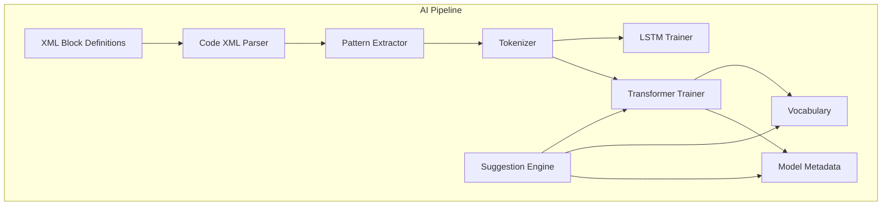

[No sources needed since this diagram shows conceptual workflow, not actual code structure]

## Core Components
- Code XML Parser: Converts Catroid XML block definitions into structured representations suitable for downstream processing.
- Pattern Extractor: Identifies recurring structural patterns in block sequences to inform tokenization and context modeling.
- Tokenizer: Maps tokens to integer IDs using a shared vocabulary; supports special tokens for control and padding.
- Transformer Trainer: Implements the Transformer training loop, including multi-head attention, positional encoding, feed-forward networks, and optimization routines.
- LSTM Trainer: Provides a recurrent baseline for comparative evaluation.
- Suggestion Engine: Loads trained models and metadata to generate next-block suggestions at runtime.
- Model Metadata and Vocabulary: Store architecture configuration, training hyperparameters, and token mappings.

**Section sources**
- [code_xml_parser.py](file://aip/code_xml_parser.py)
- [pattern_extractor.py](file://aip/pattern_extractor.py)
- [tokenizer.py](file://aip/tokenizer.py)
- [train_transformer.py](file://aip/train_transformer.py)
- [train_lstm.py](file://aip/train_lstm.py)
- [suggest.py](file://aip/suggest.py)
- [model_metadata.json](file://aip/model/model_metadata.json)
- [vocab.json](file://aip/model/vocab.json)

## Architecture Overview
The Transformer pipeline processes XML-based block definitions into token sequences, which are then encoded and decoded to predict subsequent blocks. The encoder captures long-range dependencies across block structures, while the decoder generates suggestions autoregressively. Positional encoding encodes sequence order and hierarchical relationships inherent in block trees.

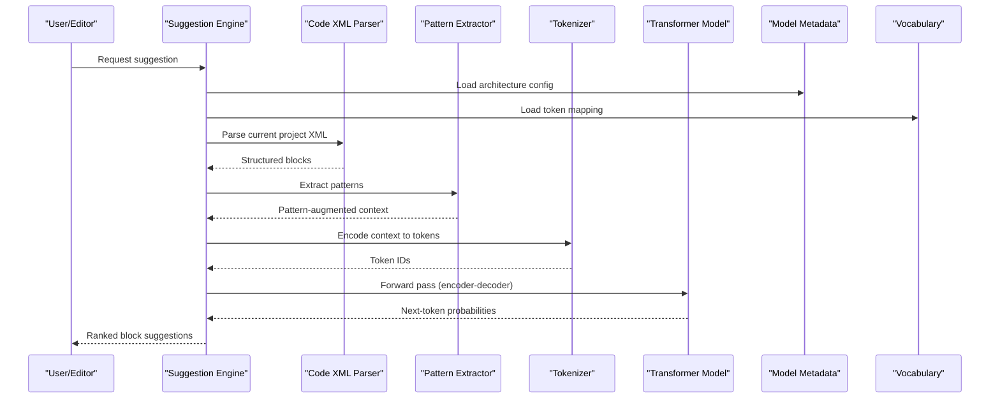

**Diagram sources**
- [suggest.py](file://aip/suggest.py)
- [code_xml_parser.py](file://aip/code_xml_parser.py)
- [pattern_extractor.py](file://aip/pattern_extractor.py)
- [tokenizer.py](file://aip/tokenizer.py)
- [train_transformer.py](file://aip/train_transformer.py)
- [model_metadata.json](file://aip/model/model_metadata.json)
- [vocab.json](file://aip/model/vocab.json)

## Detailed Component Analysis

### Multi-Head Attention Mechanism
- Design: Parallel attention heads compute queries, keys, and values to capture diverse relational patterns among tokens. Outputs are concatenated and linearly projected.
- Head dimensionality: Determined by embedding size divided by number of heads; affects representational capacity and computation cost.
- Masking: Causal masking ensures autoregressive decoding respects sequence order during training and inference.
- Integration: Attention outputs combine with residual connections and layer normalization for stable training.

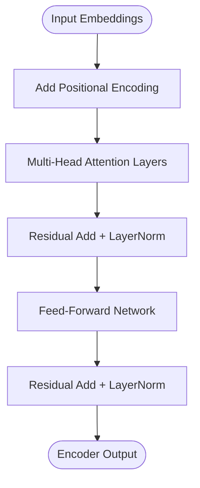

**Diagram sources**
- [train_transformer.py](file://aip/train_transformer.py)

**Section sources**
- [train_transformer.py](file://aip/train_transformer.py)

### Positional Encoding Strategies
- Strategy: Absolute or learned positional encodings are added to token embeddings to inject sequence order information.
- Code-specific adaptation: Encoders may incorporate hierarchical position signals reflecting block nesting levels derived from XML structure.
- Impact: Enables the model to distinguish between syntactically similar but structurally different block sequences.

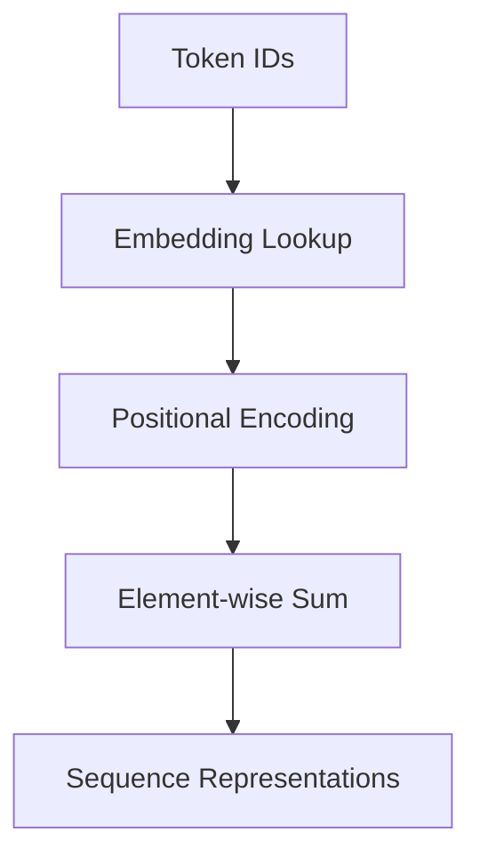

**Diagram sources**
- [train_transformer.py](file://aip/train_transformer.py)

**Section sources**
- [train_transformer.py](file://aip/train_transformer.py)

### Feed-Forward Network Configurations
- Structure: Two-layer feed-forward networks with non-linear activation applied per position after attention.
- Dimensionality: Hidden dimension typically larger than embedding size to increase expressiveness.
- Regularization: Dropout and residual connections improve generalization and training stability.

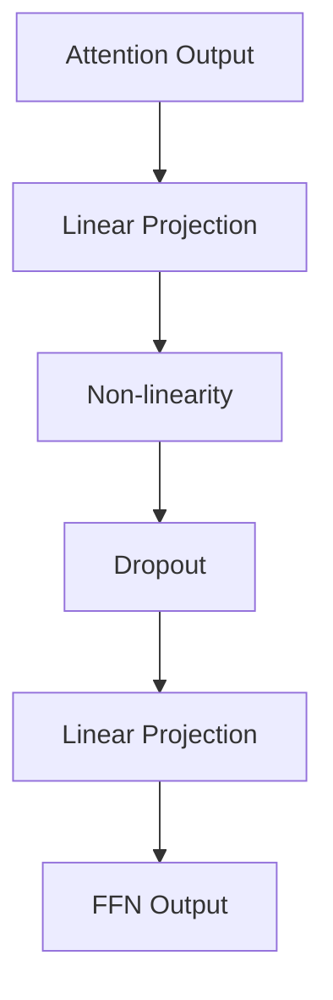

**Diagram sources**
- [train_transformer.py](file://aip/train_transformer.py)

**Section sources**
- [train_transformer.py](file://aip/train_transformer.py)

### Encoder-Decoder Architecture for Code Generation
- Encoder: Processes full context of preceding blocks to build rich representations.
- Decoder: Generates next tokens autoregressively, attending to encoder outputs and previous decoder states.
- Cross-attention: Allows decoder to focus on relevant parts of the encoded context when predicting each new token.
- Control tokens: Special tokens guide generation boundaries and formatting consistent with XML block syntax.

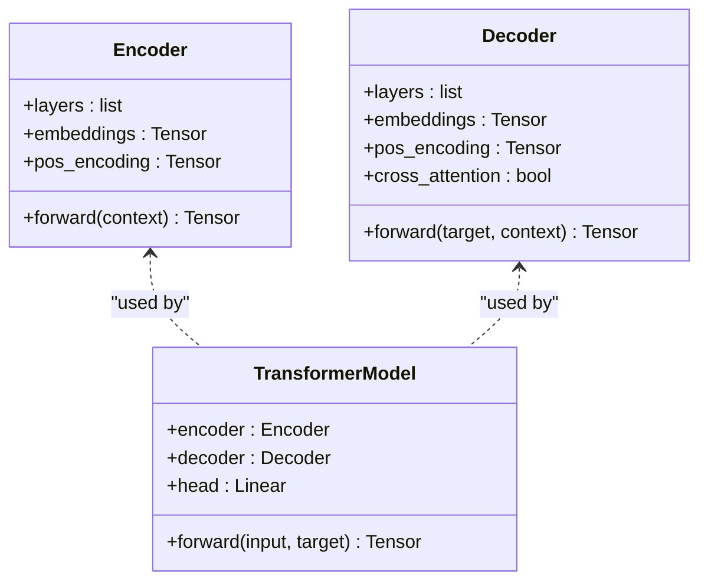

**Diagram sources**
- [train_transformer.py](file://aip/train_transformer.py)

**Section sources**
- [train_transformer.py](file://aip/train_transformer.py)

### XML-Based Block Definition Processing
- Parsing: XML block definitions are converted into structured node lists preserving hierarchy and attributes.
- Pattern extraction: Recurrent patterns (e.g., event-handler pairs, loops) are identified to augment context.
- Tokenization: Nodes and attributes are mapped to tokens; special tokens mark boundaries and roles.
- Sequence construction: Context sequences are built to train the encoder and target sequences for the decoder.

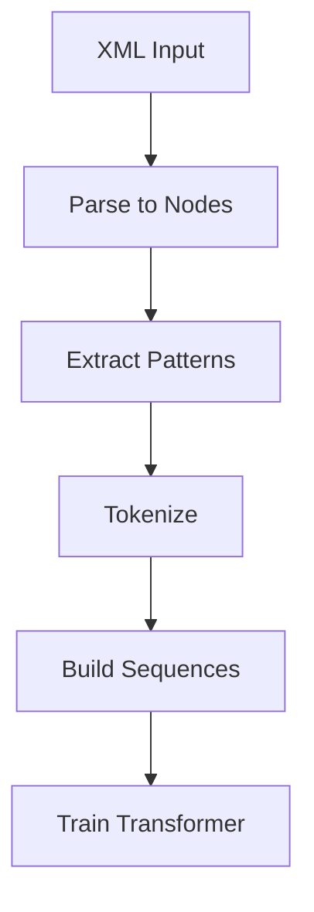

**Diagram sources**
- [code_xml_parser.py](file://aip/code_xml_parser.py)
- [pattern_extractor.py](file://aip/pattern_extractor.py)
- [tokenizer.py](file://aip/tokenizer.py)
- [train_transformer.py](file://aip/train_transformer.py)

**Section sources**
- [code_xml_parser.py](file://aip/code_xml_parser.py)
- [pattern_extractor.py](file://aip/pattern_extractor.py)
- [tokenizer.py](file://aip/tokenizer.py)
- [train_transformer.py](file://aip/train_transformer.py)

### Model Metadata Schema and Configuration Parameters
- Metadata fields include:
  - Architecture settings: number of layers, heads, embedding size, hidden dimension
  - Training hyperparameters: batch size, epochs, optimizer settings, learning rate schedule
  - Tokenization details: vocabulary size, special tokens, max sequence length
  - Performance metrics: validation loss, perplexity, suggestion accuracy
- Scaling options:
  - Increase depth (more layers) and width (larger embeddings) for higher capacity
  - Adjust head count and hidden dimensions to balance performance and compute
  - Use mixed precision and gradient accumulation for efficient large-scale training

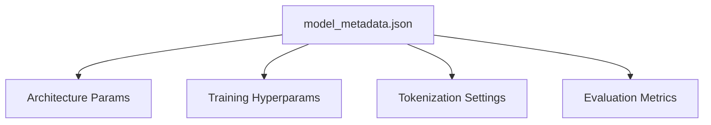

**Diagram sources**
- [model_metadata.json](file://aip/model/model_metadata.json)

**Section sources**
- [model_metadata.json](file://aip/model/model_metadata.json)

### Vocabulary Management
- Vocabulary file maps tokens to integer IDs and vice versa.
- Supports dynamic updates via controlled expansion and reserved slots for unknown tokens.
- Ensures consistency between training and inference pipelines.

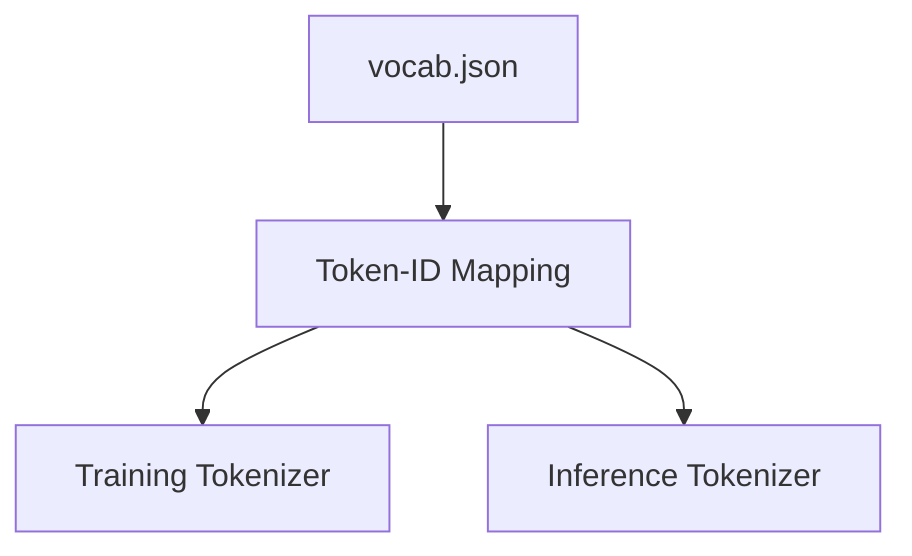

**Diagram sources**
- [vocab.json](file://aip/model/vocab.json)

**Section sources**
- [vocab.json](file://aip/model/vocab.json)

### Suggestion Engine Workflow
- Loads model metadata and vocabulary.
- Parses current editor state into XML and constructs context sequences.
- Runs transformer forward pass to obtain next-token distributions.
- Ranks candidate blocks based on probability and domain constraints.

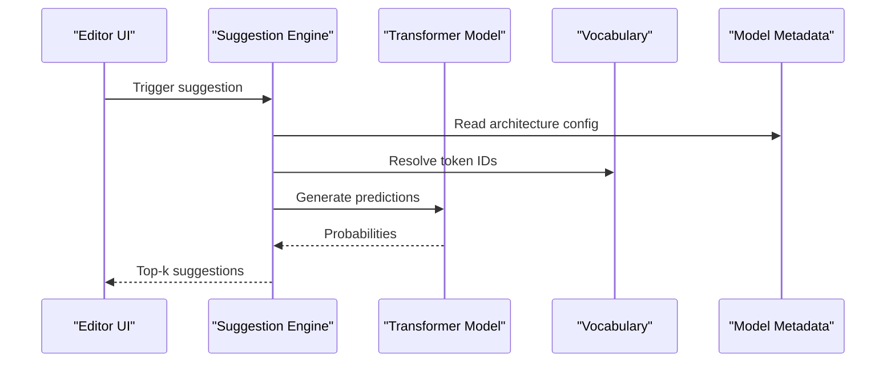

**Diagram sources**
- [suggest.py](file://aip/suggest.py)
- [model_metadata.json](file://aip/model/model_metadata.json)
- [vocab.json](file://aip/model/vocab.json)

**Section sources**
- [suggest.py](file://aip/suggest.py)

## Dependency Analysis
The Transformer training pipeline depends on data processing utilities and artifact management. The following diagram illustrates key dependencies:

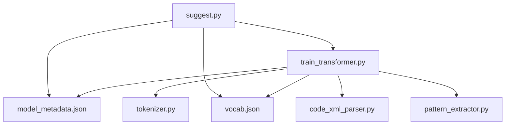

**Diagram sources**
- [train_transformer.py](file://aip/train_transformer.py)
- [tokenizer.py](file://aip/tokenizer.py)
- [model_metadata.json](file://aip/model/model_metadata.json)
- [vocab.json](file://aip/model/vocab.json)
- [code_xml_parser.py](file://aip/code_xml_parser.py)
- [pattern_extractor.py](file://aip/pattern_extractor.py)
- [suggest.py](file://aip/suggest.py)

**Section sources**
- [train_transformer.py](file://aip/train_transformer.py)
- [tokenizer.py](file://aip/tokenizer.py)
- [model_metadata.json](file://aip/model/model_metadata.json)
- [vocab.json](file://aip/model/vocab.json)
- [code_xml_parser.py](file://aip/code_xml_parser.py)
- [pattern_extractor.py](file://aip/pattern_extractor.py)
- [suggest.py](file://aip/suggest.py)

## Performance Considerations
- Computational Complexity:
  - Self-attention scales quadratically with sequence length; consider truncation or chunking for very long contexts.
  - Increasing number of heads and embedding size increases parameter count and memory footprint.
- Memory Usage Patterns:
  - Activations dominate memory during training; use gradient checkpointing and mixed precision where supported.
  - Batch size and sequence length trade-offs impact throughput and GPU utilization.
- Throughput Optimization:
  - Efficient tokenization and precomputed masks reduce overhead.
  - Vectorized operations and optimized libraries improve speed.

[No sources needed since this section provides general guidance]

## Troubleshooting Guide
- Common Issues:
  - OOV tokens: Ensure vocabulary covers domain-specific block names; add unknown token handling.
  - Gradient explosion: Apply gradient clipping and monitor loss spikes.
  - Overfitting: Use dropout, weight decay, and early stopping.
  - Slow training: Reduce sequence length, use smaller batches, or enable mixed precision.
- Diagnostics:
  - Log training metrics and validate against held-out datasets.
  - Inspect token distributions and pattern coverage.

**Section sources**
- [train_transformer.py](file://aip/train_transformer.py)
- [train_colab_transformer.ipynb](file://aip/train_colab_transformer.ipynb)

## Conclusion
The Transformer architecture in NewCatroid’s AI system leverages multi-head attention, robust positional encoding, and feed-forward networks to model complex block structures and generate accurate code suggestions. By carefully configuring model parameters, managing vocabulary, and applying appropriate training techniques, the system achieves strong performance compared to LSTM baselines while offering scalable pathways for future improvements.

[No sources needed since this section summarizes without analyzing specific files]

## Appendices

### Comparative Analysis with LSTM Models
- Strengths of Transformers:
  - Parallelizable training and inference
  - Better long-range dependency modeling
  - Improved suggestion quality on structured code
- LSTM Baseline:
  - Simpler architecture and lower memory requirements
  - Sequential processing limits scalability
- Evaluation:
  - Compare perplexity, suggestion accuracy, and latency across models.

**Section sources**
- [train_lstm.py](file://aip/train_lstm.py)
- [train_transformer.py](file://aip/train_transformer.py)

### Training Techniques and Scheduling
- Gradient Clipping:
  - Clip gradients to prevent instability during backpropagation.
- Learning Rate Scheduling:
  - Use warmup followed by cosine or step decay for stable convergence.
- Regularization:
  - Dropout, label smoothing, and weight decay enhance generalization.
- Mixed Precision:
  - Accelerate training and reduce memory usage on compatible hardware.

**Section sources**
- [train_transformer.py](file://aip/train_transformer.py)
- [train_colab_transformer.ipynb](file://aip/train_colab_transformer.ipynb)