# Model Training Pipeline

<cite>
**Referenced Files in This Document**
- [train.py](file://aip/train.py)
- [train_lstm.py](file://aip/train_lstm.py)
- [train_transformer.py](file://aip/train_transformer.py)
- [tokenizer.py](file://aip/tokenizer.py)
- [pattern_extractor.py](file://aip/pattern_extractor.py)
- [code_xml_parser.py](file://aip/code_xml_parser.py)
- [suggest.py](file://aip/suggest.py)
- [requirements.txt](file://aip/requirements.txt)
- [README_COLAB.txt](file://aip/README_COLAB.txt)
- [train_colab.ipynb](file://aip/train_colab.ipynb)
- [train_colab_transformer.ipynb](file://aip/train_colab_transformer.ipynb)
- [run_training.bat](file://aip/run_training.bat)
- [prepare_colab.bat](file://aip/prepare_colab.bat)
- [deploy.bat](file://aip/deploy.bat)
- [model_metadata.json](file://aip/model/model_metadata.json)
- [vocab.json](file://aip/vocab.json)
</cite>

## Table of Contents
1. [Introduction](#introduction)
2. [Project Structure](#project-structure)
3. [Core Components](#core-components)
4. [Architecture Overview](#architecture-overview)
5. [Detailed Component Analysis](#detailed-component-analysis)
6. [Dependency Analysis](#dependency-analysis)
7. [Performance Considerations](#performance-considerations)
8. [Troubleshooting Guide](#troubleshooting-guide)
9. [Conclusion](#conclusion)
10. [Appendices](#appendices)

## Introduction
This document explains the model training pipeline for NewCatroid, focusing on LSTM and Transformer architectures. It covers data preprocessing, tokenization, vocabulary building, training configuration, hyperparameter tuning, evaluation metrics, and deployment preparation. Step-by-step guides are provided for Google Colab notebooks, local training environments, and distributed training setups. The document also addresses model versioning, metadata management, and examples for retraining on domain-specific datasets and fine-tuning pre-trained models.

## Project Structure
The training pipeline is implemented under the aip directory with clear separation between data processing, model training, inference, and deployment utilities. Key artifacts include:
- Data extraction and parsing utilities for XML-based code samples
- Tokenizer and vocabulary management
- Training scripts for LSTM and Transformer models
- Inference helper for suggestions
- Colab notebooks for interactive training
- Batch helpers for local execution and deployment packaging

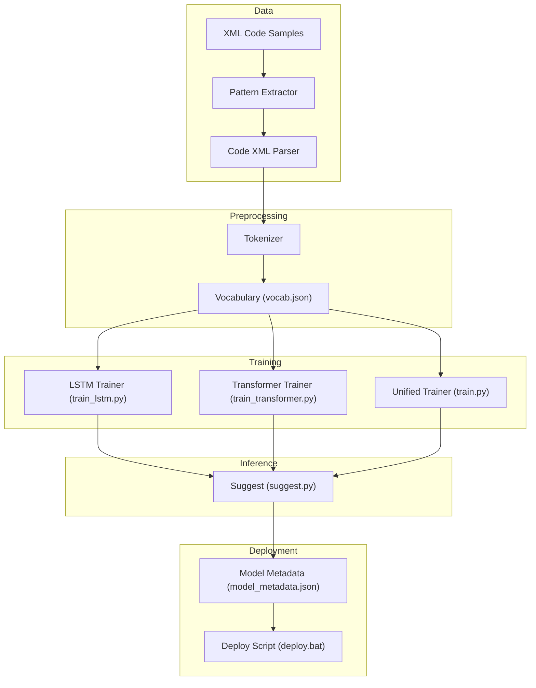

**Diagram sources**
- [pattern_extractor.py:1-200](file://aip/pattern_extractor.py#L1-L200)
- [code_xml_parser.py:1-200](file://aip/code_xml_parser.py#L1-L200)
- [tokenizer.py:1-200](file://aip/tokenizer.py#L1-L200)
- [train_lstm.py:1-200](file://aip/train_lstm.py#L1-L200)
- [train_transformer.py:1-200](file://aip/train_transformer.py#L1-L200)
- [train.py:1-200](file://aip/train.py#L1-L200)
- [suggest.py:1-200](file://aip/suggest.py#L1-L200)
- [model_metadata.json:1-200](file://aip/model/model_metadata.json#L1-L200)
- [vocab.json:1-200](file://aip/vocab.json#L1-L200)
- [deploy.bat:1-200](file://aip/deploy.bat#L1-L200)

**Section sources**
- [pattern_extractor.py:1-200](file://aip/pattern_extractor.py#L1-L200)
- [code_xml_parser.py:1-200](file://aip/code_xml_parser.py#L1-L200)
- [tokenizer.py:1-200](file://aip/tokenizer.py#L1-L200)
- [train_lstm.py:1-200](file://aip/train_lstm.py#L1-L200)
- [train_transformer.py:1-200](file://aip/train_transformer.py#L1-L200)
- [train.py:1-200](file://aip/train.py#L1-L200)
- [suggest.py:1-200](file://aip/suggest.py#L1-L200)
- [model_metadata.json:1-200](file://aip/model/model_metadata.json#L1-L200)
- [vocab.json:1-200](file://aip/vocab.json#L1-L200)
- [deploy.bat:1-200](file://aip/deploy.bat#L1-L200)

## Core Components
- Data extraction and parsing:
  - Pattern extractor identifies reusable patterns from source files.
  - Code XML parser reads structured XML inputs to produce normalized sequences.
- Tokenization and vocabulary:
  - Tokenizer converts raw text into token IDs using a shared vocabulary file.
  - Vocabulary is persisted as JSON for reproducibility and consistent inference.
- Training modules:
  - LSTM trainer implements sequence modeling with recurrent layers.
  - Transformer trainer implements attention-based sequence modeling.
  - Unified trainer provides common orchestration and logging across architectures.
- Inference:
  - Suggest module loads trained models and vocabulary to generate predictions.
- Deployment:
  - Model metadata captures versioning and artifact references.
  - Deploy script packages artifacts for distribution.

**Section sources**
- [pattern_extractor.py:1-200](file://aip/pattern_extractor.py#L1-L200)
- [code_xml_parser.py:1-200](file://aip/code_xml_parser.py#L1-L200)
- [tokenizer.py:1-200](file://aip/tokenizer.py#L1-L200)
- [train_lstm.py:1-200](file://aip/train_lstm.py#L1-L200)
- [train_transformer.py:1-200](file://aip/train_transformer.py#L1-L200)
- [train.py:1-200](file://aip/train.py#L1-L200)
- [suggest.py:1-200](file://aip/suggest.py#L1-L200)
- [model_metadata.json:1-200](file://aip/model/model_metadata.json#L1-L200)
- [deploy.bat:1-200](file://aip/deploy.bat#L1-L200)

## Architecture Overview
The training pipeline follows a modular architecture:
- Input data flows through pattern extraction and XML parsing to produce clean sequences.
- Tokenization maps tokens to IDs using a stable vocabulary.
- Training scripts consume tokenized sequences and train either LSTM or Transformer models.
- Inference uses the trained model and vocabulary to suggest completions.
- Deployment bundles model artifacts and metadata for integration.

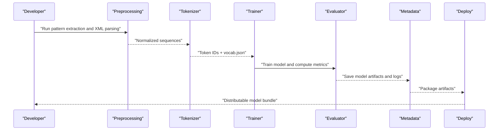

**Diagram sources**
- [pattern_extractor.py:1-200](file://aip/pattern_extractor.py#L1-L200)
- [code_xml_parser.py:1-200](file://aip/code_xml_parser.py#L1-L200)
- [tokenizer.py:1-200](file://aip/tokenizer.py#L1-L200)
- [train_lstm.py:1-200](file://aip/train_lstm.py#L1-L200)
- [train_transformer.py:1-200](file://aip/train_transformer.py#L1-L200)
- [train.py:1-200](file://aip/train.py#L1-L200)
- [model_metadata.json:1-200](file://aip/model/model_metadata.json#L1-L200)
- [deploy.bat:1-200](file://aip/deploy.bat#L1-L200)

## Detailed Component Analysis

### Data Preprocessing and Parsing
- Pattern extraction:
  - Scans input files to identify recurring structures and constructs.
  - Outputs intermediate representations suitable for parsing.
- XML parsing:
  - Reads XML documents representing code blocks.
  - Normalizes structure into linear sequences for training.
- Output:
  - Cleaned sequences ready for tokenization.

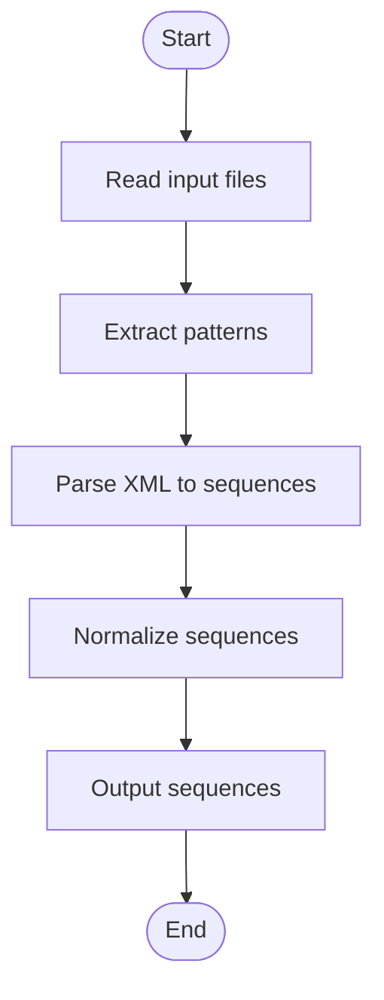

**Diagram sources**
- [pattern_extractor.py:1-200](file://aip/pattern_extractor.py#L1-L200)
- [code_xml_parser.py:1-200](file://aip/code_xml_parser.py#L1-L200)

**Section sources**
- [pattern_extractor.py:1-200](file://aip/pattern_extractor.py#L1-L200)
- [code_xml_parser.py:1-200](file://aip/code_xml_parser.py#L1-L200)

### Tokenization and Vocabulary Building
- Tokenizer:
  - Converts text to token IDs based on vocabulary.
  - Supports padding/truncation parameters for batching.
- Vocabulary:
  - Stored as JSON mapping tokens to integer IDs.
  - Ensures consistency between training and inference.
- Process:
  - Build or load vocabulary.
  - Apply tokenization to sequences.
  - Persist vocabulary for reuse.

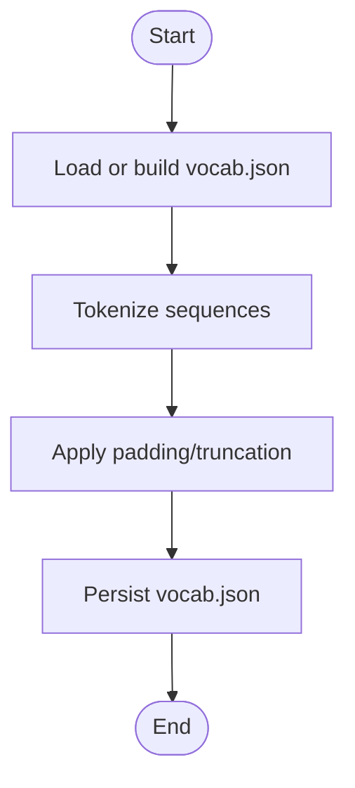

**Diagram sources**
- [tokenizer.py:1-200](file://aip/tokenizer.py#L1-L200)
- [vocab.json:1-200](file://aip/vocab.json#L1-L200)

**Section sources**
- [tokenizer.py:1-200](file://aip/tokenizer.py#L1-L200)
- [vocab.json:1-200](file://aip/vocab.json#L1-L200)

### LSTM Training Workflow
- Inputs:
  - Tokenized sequences and vocabulary.
- Model:
  - Recurrent layers configured via hyperparameters.
- Training loop:
  - Iterates over batches, computes loss, updates weights.
- Evaluation:
  - Computes metrics such as perplexity or accuracy.
- Artifacts:
  - Saves model weights and training logs.

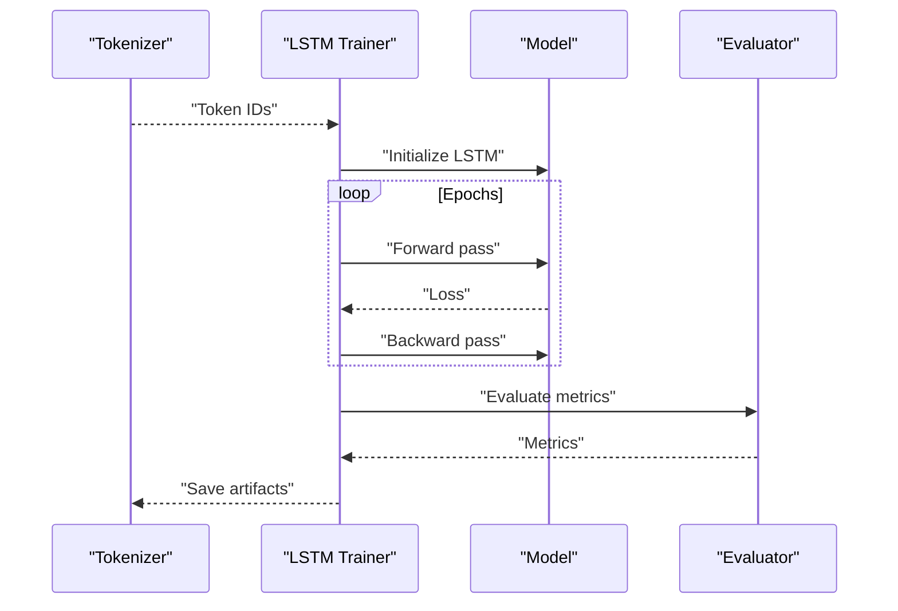

**Diagram sources**
- [train_lstm.py:1-200](file://aip/train_lstm.py#L1-L200)
- [tokenizer.py:1-200](file://aip/tokenizer.py#L1-L200)

**Section sources**
- [train_lstm.py:1-200](file://aip/train_lstm.py#L1-L200)

### Transformer Training Workflow
- Inputs:
  - Tokenized sequences and vocabulary.
- Model:
  - Attention-based encoder/decoder or decoder-only architecture.
- Training loop:
  - Uses masked language modeling objectives.
- Evaluation:
  - Computes perplexity and other metrics.
- Artifacts:
  - Saves model weights and training logs.

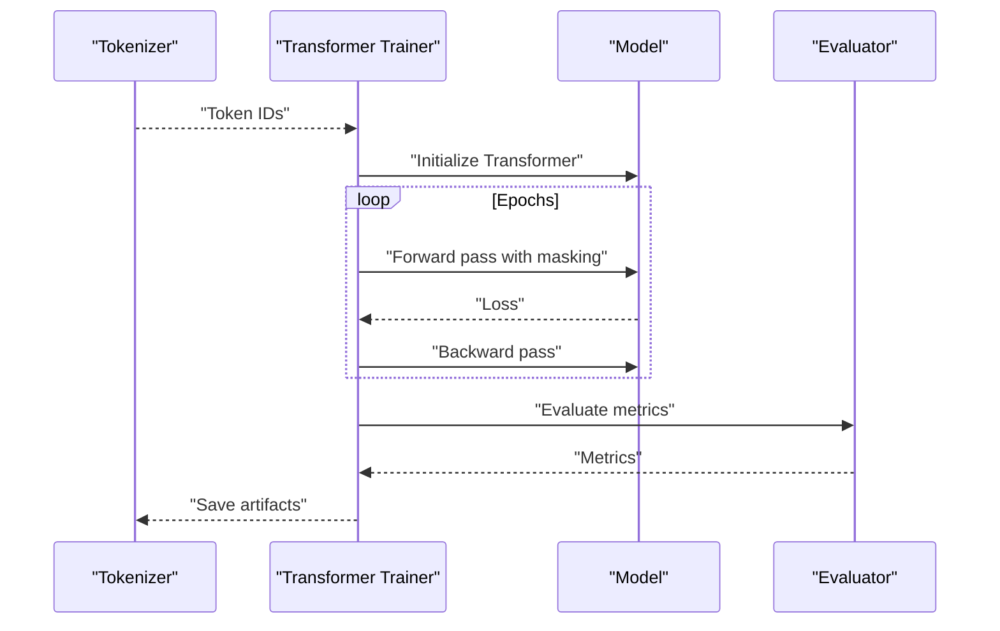

**Diagram sources**
- [train_transformer.py:1-200](file://aip/train_transformer.py#L1-L200)
- [tokenizer.py:1-200](file://aip/tokenizer.py#L1-L200)

**Section sources**
- [train_transformer.py:1-200](file://aip/train_transformer.py#L1-L200)

### Unified Training Orchestration
- Provides common setup, argument parsing, logging, and checkpointing.
- Coordinates data loading, tokenization, and model instantiation.
- Supports both LSTM and Transformer backends.

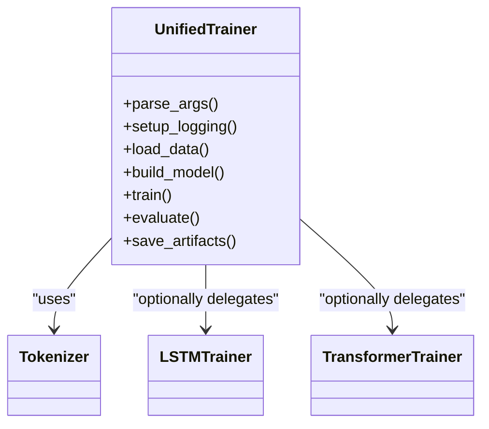

**Diagram sources**
- [train.py:1-200](file://aip/train.py#L1-L200)
- [train_lstm.py:1-200](file://aip/train_lstm.py#L1-L200)
- [train_transformer.py:1-200](file://aip/train_transformer.py#L1-L200)
- [tokenizer.py:1-200](file://aip/tokenizer.py#L1-L200)

**Section sources**
- [train.py:1-200](file://aip/train.py#L1-L200)

### Inference and Suggestions
- Loads trained model and vocabulary.
- Accepts partial input and generates next-token predictions.
- Integrates with application logic to provide suggestions.

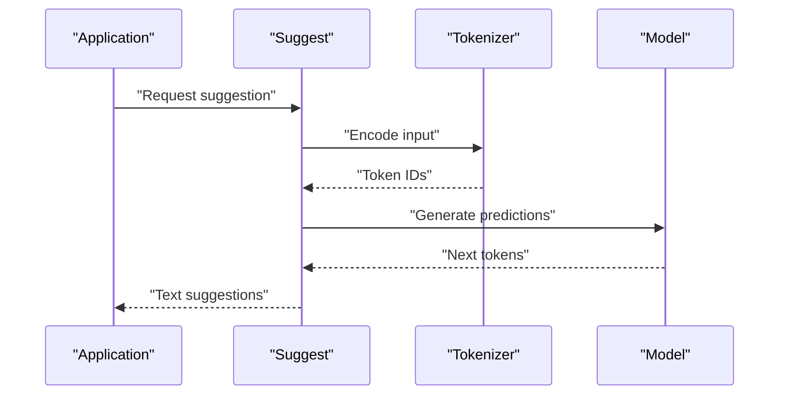

**Diagram sources**
- [suggest.py:1-200](file://aip/suggest.py#L1-L200)
- [tokenizer.py:1-200](file://aip/tokenizer.py#L1-L200)

**Section sources**
- [suggest.py:1-200](file://aip/suggest.py#L1-L200)

### Model Versioning and Metadata Management
- Metadata file records:
  - Model version, architecture, training date, dataset hash, and artifact paths.
- Ensures traceability and reproducibility.
- Used by deployment scripts to package correct artifacts.

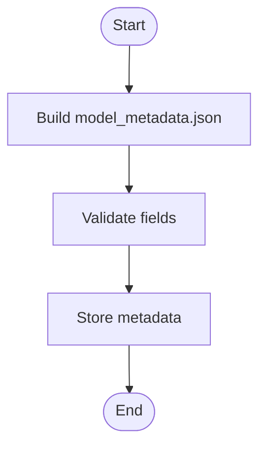

**Diagram sources**
- [model_metadata.json:1-200](file://aip/model/model_metadata.json#L1-L200)

**Section sources**
- [model_metadata.json:1-200](file://aip/model/model_metadata.json#L1-L200)

### Deployment Preparation
- Packaging:
  - Bundles model weights, vocabulary, and metadata.
- Distribution:
  - Creates deployable artifacts for integration.
- Automation:
  - Batch script orchestrates packaging steps.

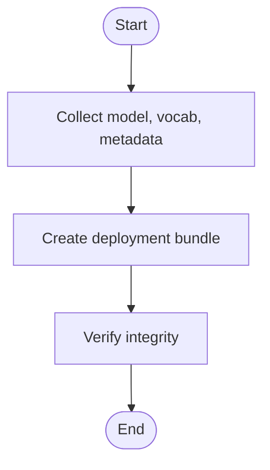

**Diagram sources**
- [deploy.bat:1-200](file://aip/deploy.bat#L1-L200)
- [model_metadata.json:1-200](file://aip/model/model_metadata.json#L1-L200)
- [vocab.json:1-200](file://aip/vocab.json#L1-L200)

**Section sources**
- [deploy.bat:1-200](file://aip/deploy.bat#L1-L200)

## Dependency Analysis
Key dependencies include Python libraries specified in requirements.txt and internal modules for preprocessing, tokenization, and training.

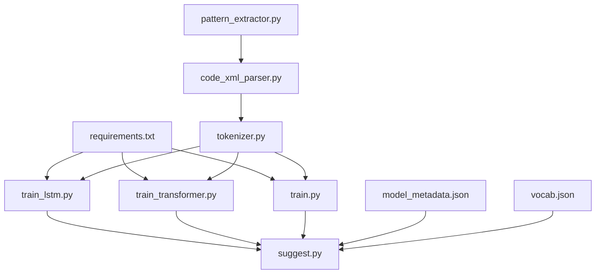

**Diagram sources**
- [requirements.txt:1-200](file://aip/requirements.txt#L1-L200)
- [pattern_extractor.py:1-200](file://aip/pattern_extractor.py#L1-L200)
- [code_xml_parser.py:1-200](file://aip/code_xml_parser.py#L1-L200)
- [tokenizer.py:1-200](file://aip/tokenizer.py#L1-L200)
- [train_lstm.py:1-200](file://aip/train_lstm.py#L1-L200)
- [train_transformer.py:1-200](file://aip/train_transformer.py#L1-L200)
- [train.py:1-200](file://aip/train.py#L1-L200)
- [suggest.py:1-200](file://aip/suggest.py#L1-L200)
- [model_metadata.json:1-200](file://aip/model/model_metadata.json#L1-L200)
- [vocab.json:1-200](file://aip/vocab.json#L1-L200)

**Section sources**
- [requirements.txt:1-200](file://aip/requirements.txt#L1-L200)

## Performance Considerations
- Batch size and sequence length:
  - Larger batches improve throughput but increase memory usage; tune based on hardware.
  - Sequence length affects context capture and computational cost.
- Learning rate scheduling:
  - Use warmup and decay strategies for stability and convergence.
- Mixed precision:
  - Enable FP16/BF16 where supported to accelerate training.
- Gradient accumulation:
  - Simulate larger effective batch sizes when GPU memory is limited.
- Data pipeline optimization:
  - Precompute tokenized datasets to reduce IO overhead.
- Early stopping and checkpointing:
  - Monitor validation metrics to prevent overfitting and save best checkpoints.

[No sources needed since this section provides general guidance]

## Troubleshooting Guide
- Missing dependencies:
  - Ensure all packages listed in requirements.txt are installed.
- Vocabulary mismatch:
  - Confirm that training and inference use the same vocab.json.
- Out-of-memory errors:
  - Reduce batch size or sequence length; enable gradient accumulation.
- Slow training:
  - Check data loading bottlenecks; consider caching tokenized data.
- Deployment issues:
  - Validate model_metadata.json fields and artifact paths before packaging.

**Section sources**
- [requirements.txt:1-200](file://aip/requirements.txt#L1-L200)
- [model_metadata.json:1-200](file://aip/model/model_metadata.json#L1-L200)
- [vocab.json:1-200](file://aip/vocab.json#L1-L200)

## Conclusion
The NewCatroid training pipeline provides a robust foundation for developing both LSTM and Transformer models tailored to code completion tasks. With clear separation of concerns, comprehensive preprocessing, and strong versioning and deployment support, teams can efficiently iterate on model performance and integrate new models into the application.

[No sources needed since this section summarizes without analyzing specific files]

## Appendices

### Step-by-Step Guides

#### Google Colab Training
- Prepare environment:
  - Install dependencies from requirements.txt.
- Run notebook:
  - Open train_colab.ipynb for LSTM training.
  - Open train_colab_transformer.ipynb for Transformer training.
- Follow notebook instructions:
  - Upload or mount dataset.
  - Configure hyperparameters.
  - Execute cells to preprocess, train, evaluate, and save artifacts.

**Section sources**
- [README_COLAB.txt:1-200](file://aip/README_COLAB.txt#L1-L200)
- [train_colab.ipynb:1-200](file://aip/train_colab.ipynb#L1-L200)
- [train_colab_transformer.ipynb:1-200](file://aip/train_colab_transformer.ipynb#L1-L200)

#### Local Training Environment
- Setup:
  - Install dependencies from requirements.txt.
- Run training:
  - Use run_training.bat to execute training workflows.
- Monitor outputs:
  - Check logs and saved artifacts in output directories.

**Section sources**
- [requirements.txt:1-200](file://aip/requirements.txt#L1-L200)
- [run_training.bat:1-200](file://aip/run_training.bat#L1-L200)

#### Distributed Training Setups
- Multi-GPU:
  - Configure distributed launch options in training scripts.
  - Adjust batch size per device and total effective batch size.
- Multi-node:
  - Set up node discovery and communication backend.
  - Distribute data shards across nodes.
- Monitoring:
  - Track per-device metrics and aggregate results.

[No sources needed since this section provides general guidance]

### Retraining on Domain-Specific Datasets
- Prepare dataset:
  - Format data as XML or compatible structure.
  - Place files in the expected input directory.
- Update preprocessing:
  - Adjust pattern extraction and XML parsing rules if necessary.
- Rebuild vocabulary:
  - Generate a new vocab.json reflecting domain terms.
- Retrain:
  - Run training scripts with updated data and vocabulary.
- Evaluate:
  - Compare metrics against baseline models.

**Section sources**
- [pattern_extractor.py:1-200](file://aip/pattern_extractor.py#L1-L200)
- [code_xml_parser.py:1-200](file://aip/code_xml_parser.py#L1-L200)
- [tokenizer.py:1-200](file://aip/tokenizer.py#L1-L200)
- [train_lstm.py:1-200](file://aip/train_lstm.py#L1-L200)
- [train_transformer.py:1-200](file://aip/train_transformer.py#L1-L200)

### Fine-Tuning Pre-Trained Models
- Load pre-trained weights:
  - Specify checkpoint path in training configuration.
- Freeze/unfreeze layers:
  - Optionally freeze early layers and fine-tune later layers.
- Lower learning rate:
  - Use smaller LR to avoid catastrophic forgetting.
- Shorter training:
  - Fewer epochs to adapt to new domain while retaining prior knowledge.
- Validate improvements:
  - Measure task-specific metrics to confirm gains.

**Section sources**
- [train.py:1-200](file://aip/train.py#L1-L200)
- [train_lstm.py:1-200](file://aip/train_lstm.py#L1-L200)
- [train_transformer.py:1-200](file://aip/train_transformer.py#L1-L200)