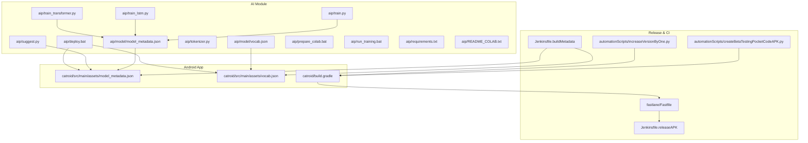
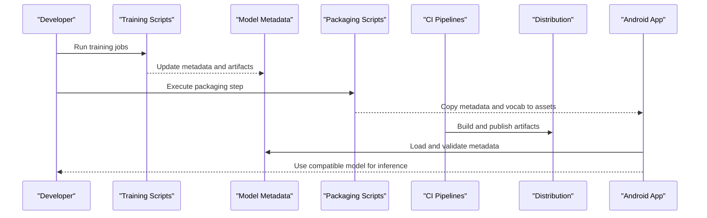
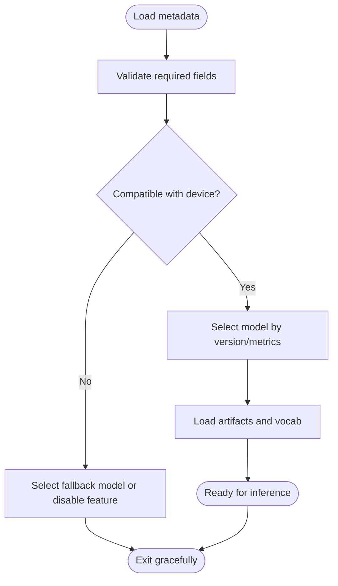
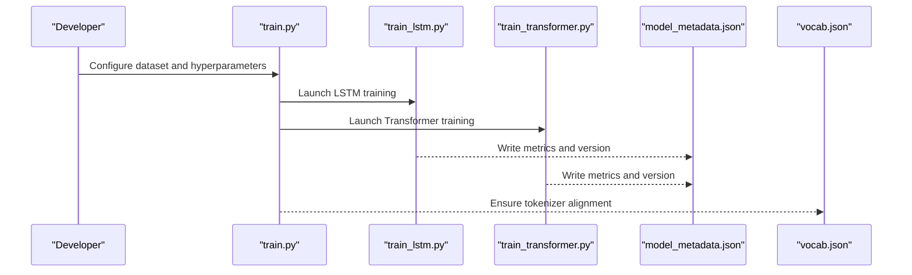
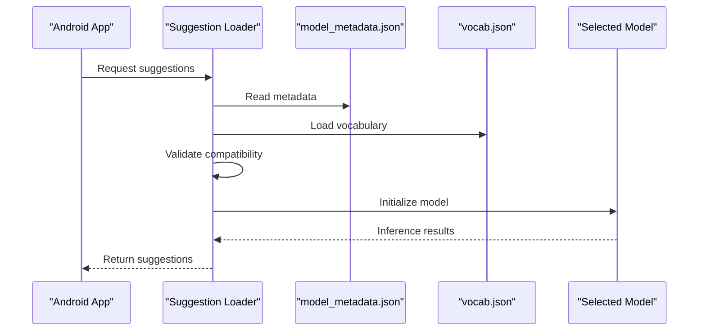
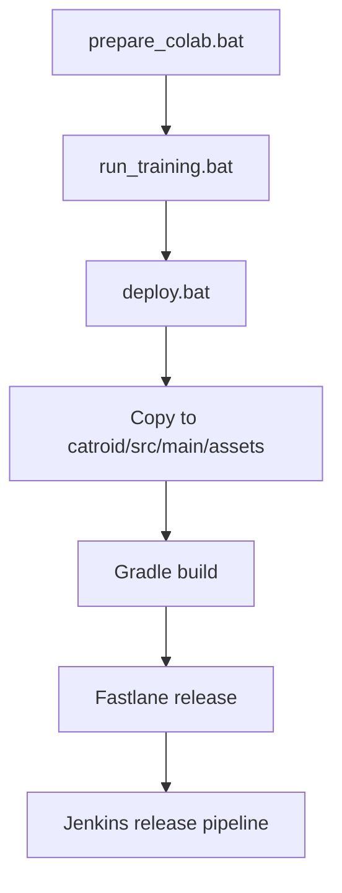
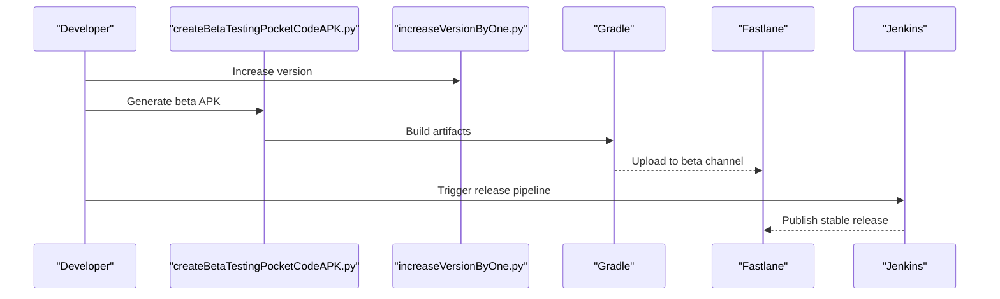
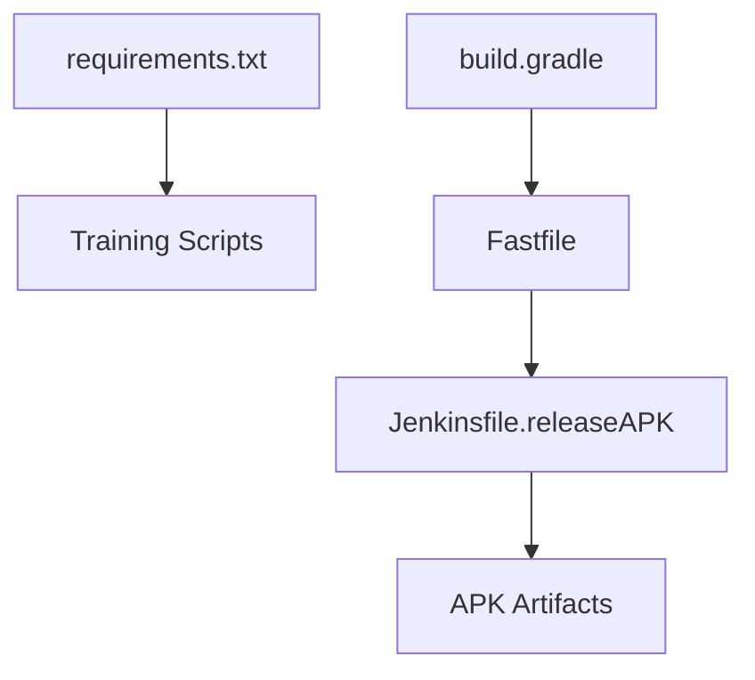

# Model Versioning and Deployment

<cite>
**Referenced Files in This Document**
- [model_metadata.json](file://aip/model/model_metadata.json)
- [vocab.json](file://aip/model/vocab.json)
- [suggest.py](file://aip/suggest.py)
- [train.py](file://aip/train.py)
- [train_lstm.py](file://aip/train_lstm.py)
- [train_transformer.py](file://aip/train_transformer.py)
- [tokenizer.py](file://aip/tokenizer.py)
- [deploy.bat](file://aip/deploy.bat)
- [prepare_colab.bat](file://aip/prepare_colab.bat)
- [run_training.bat](file://aip/run_training.bat)
- [requirements.txt](file://aip/requirements.txt)
- [README_COLAB.txt](file://aip/README_COLAB.txt)
- [build.gradle](file://catroid/build.gradle)
- [Fastfile](file://fastlane/Fastfile)
- [createBetaTestingPocketCodeAPK.py](file://automationScripts/createBetaTestingPocketCodeAPK.py)
- [increaseVersionByOne.py](file://automationScripts/increaseVersionByOne.py)
- [Jenkinsfile.releaseAPK](file://Jenkinsfile.releaseAPK)
- [Jenkinsfile.buildMetadata](file://Jenkinsfile.buildMetadata)
- [model_metadata.json](file://catroid/src/main/assets/model_metadata.json)
- [vocab.json](file://catroid/src/main/assets/vocab.json)
</cite>

## Table of Contents
1. [Introduction](#introduction)
2. [Project Structure](#project-structure)
3. [Core Components](#core-components)
4. [Architecture Overview](#architecture-overview)
5. [Detailed Component Analysis](#detailed-component-analysis)
6. [Dependency Analysis](#dependency-analysis)
7. [Performance Considerations](#performance-considerations)
8. [Troubleshooting Guide](#troubleshooting-guide)
9. [Conclusion](#conclusion)
10. [Appendices](#appendices)

## Introduction
This document explains how NewCatroid manages model versions, metadata, and deployment across training, packaging, and Android distribution. It covers the model metadata schema (including version tracking, performance metrics, and compatibility), the suggestion system integration and inference pipeline, automation scripts for deployment, model packaging procedures, and distribution mechanisms. It also provides guidelines for evaluation, A/B testing frameworks, rollback procedures, security considerations, size optimization, and mobile deployment strategies for Android integration.

## Project Structure
The repository organizes AI-related assets and scripts under a dedicated directory and integrates them into the Android app via build and release tooling:
- AI training and utilities are located under the AI module with Python scripts and configuration files.
- Android assets include model metadata and vocabulary used at runtime.
- Build and release tooling uses Gradle, Fastlane, and Jenkins to package and distribute artifacts.

**Diagram sources**
- [model_metadata.json](file://aip/model/model_metadata.json)
- [vocab.json](file://aip/model/vocab.json)
- [suggest.py](file://aip/suggest.py)
- [train.py](file://aip/train.py)
- [train_lstm.py](file://aip/train_lstm.py)
- [train_transformer.py](file://aip/train_transformer.py)
- [tokenizer.py](file://aip/tokenizer.py)
- [deploy.bat](file://aip/deploy.bat)
- [prepare_colab.bat](file://aip/prepare_colab.bat)
- [run_training.bat](file://aip/run_training.bat)
- [requirements.txt](file://aip/requirements.txt)
- [README_COLAB.txt](file://aip/README_COLAB.txt)
- [model_metadata.json](file://catroid/src/main/assets/model_metadata.json)
- [vocab.json](file://catroid/src/main/assets/vocab.json)
- [build.gradle](file://catroid/build.gradle)
- [Fastfile](file://fastlane/Fastfile)
- [Jenkinsfile.releaseAPK](file://Jenkinsfile.releaseAPK)
- [Jenkinsfile.buildMetadata](file://Jenkinsfile.buildMetadata)
- [createBetaTestingPocketCodeAPK.py](file://automationScripts/createBetaTestingPocketCodeAPK.py)
- [increaseVersionByOne.py](file://automationScripts/increaseVersionByOne.py)

**Section sources**
- [model_metadata.json](file://aip/model/model_metadata.json)
- [vocab.json](file://aip/model/vocab.json)
- [model_metadata.json](file://catroid/src/main/assets/model_metadata.json)
- [vocab.json](file://catroid/src/main/assets/vocab.json)
- [build.gradle](file://catroid/build.gradle)
- [Fastfile](file://fastlane/Fastfile)
- [Jenkinsfile.releaseAPK](file://Jenkinsfile.releaseAPK)
- [Jenkinsfile.buildMetadata](file://Jenkinsfile.buildMetadata)

## Core Components
- Model Metadata Schema: Centralized JSON describing model identity, versioning, compatibility, and performance metrics. Used both during training and packaged into Android assets for runtime validation.
- Vocabulary Asset: Tokenization mapping consumed by both training and inference.
- Training Scripts: Entry points for LSTM and Transformer models, producing artifacts referenced by metadata.
- Suggestion System Integration: Runtime component that loads metadata and vocabulary to perform suggestions using the selected model.
- Deployment Automation: Batch scripts and CI pipelines to prepare environments, run training, package assets, and distribute builds.

Key responsibilities:
- Maintain consistent versioning between training outputs and Android assets.
- Provide clear compatibility constraints for device capabilities and app versions.
- Expose performance metrics to guide selection and fallback behavior.

**Section sources**
- [model_metadata.json](file://aip/model/model_metadata.json)
- [vocab.json](file://aip/model/vocab.json)
- [train.py](file://aip/train.py)
- [train_lstm.py](file://aip/train_lstm.py)
- [train_transformer.py](file://aip/train_transformer.py)
- [suggest.py](file://aip/suggest.py)
- [deploy.bat](file://aip/deploy.bat)
- [model_metadata.json](file://catroid/src/main/assets/model_metadata.json)
- [vocab.json](file://catroid/src/main/assets/vocab.json)

## Architecture Overview
The end-to-end flow spans training, packaging, and distribution:
- Training produces model artifacts and updates metadata.
- Packaging copies metadata and vocabulary into Android assets.
- Release pipelines build APKs and publish beta or stable releases.
- The Android app validates metadata at startup and selects compatible models.

**Diagram sources**
- [train.py](file://aip/train.py)
- [train_lstm.py](file://aip/train_lstm.py)
- [train_transformer.py](file://aip/train_transformer.py)
- [model_metadata.json](file://aip/model/model_metadata.json)
- [deploy.bat](file://aip/deploy.bat)
- [Fastfile](file://fastlane/Fastfile)
- [Jenkinsfile.releaseAPK](file://Jenkinsfile.releaseAPK)
- [Jenkinsfile.buildMetadata](file://Jenkinsfile.buildMetadata)
- [model_metadata.json](file://catroid/src/main/assets/model_metadata.json)
- [vocab.json](file://catroid/src/main/assets/vocab.json)

## Detailed Component Analysis

### Model Metadata Schema
The metadata file defines the contract between training outputs and the Android runtime. It includes:
- Identity and version fields for deterministic selection and rollback.
- Compatibility constraints such as minimum app version and supported architectures.
- Performance metrics like latency, memory footprint, and accuracy indicators.
- Artifact references pointing to trained model files and tokenizer assets.

Guidelines:
- Increment version on any change affecting compatibility or behavior.
- Record metrics consistently to enable automated selection and A/B comparisons.
- Keep artifact paths relative and immutable per version.

**Diagram sources**
- [model_metadata.json](file://aip/model/model_metadata.json)
- [model_metadata.json](file://catroid/src/main/assets/model_metadata.json)
- [vocab.json](file://catroid/src/main/assets/vocab.json)

**Section sources**
- [model_metadata.json](file://aip/model/model_metadata.json)
- [model_metadata.json](file://catroid/src/main/assets/model_metadata.json)
- [vocab.json](file://catroid/src/main/assets/vocab.json)

### Vocabulary Management
Vocabulary is shared between training and inference:
- Training scripts consume the vocabulary for tokenization.
- Android assets include the same vocabulary to ensure consistency.
- Changes to vocabulary must be accompanied by metadata version increments.

Best practices:
- Pin vocabulary version in metadata.
- Avoid in-place edits; generate new files and update references atomically.

**Section sources**
- [vocab.json](file://aip/model/vocab.json)
- [vocab.json](file://catroid/src/main/assets/vocab.json)
- [tokenizer.py](file://aip/tokenizer.py)

### Training Pipeline
Entry points support multiple model types:
- LSTM-based training script.
- Transformer-based training script.
- Unified training orchestrator.

Outputs:
- Trained artifacts referenced by metadata.
- Updated metadata with performance metrics and versioning.

**Diagram sources**
- [train.py](file://aip/train.py)
- [train_lstm.py](file://aip/train_lstm.py)
- [train_transformer.py](file://aip/train_transformer.py)
- [model_metadata.json](file://aip/model/model_metadata.json)
- [vocab.json](file://aip/model/vocab.json)

**Section sources**
- [train.py](file://aip/train.py)
- [train_lstm.py](file://aip/train_lstm.py)
- [train_transformer.py](file://aip/train_transformer.py)
- [model_metadata.json](file://aip/model/model_metadata.json)
- [vocab.json](file://aip/model/vocab.json)

### Suggestion System Integration and Inference
At runtime, the suggestion system:
- Loads metadata and vocabulary from assets.
- Validates compatibility and selects an appropriate model.
- Performs inference using the chosen model and tokenizer.

**Diagram sources**
- [suggest.py](file://aip/suggest.py)
- [model_metadata.json](file://catroid/src/main/assets/model_metadata.json)
- [vocab.json](file://catroid/src/main/assets/vocab.json)

**Section sources**
- [suggest.py](file://aip/suggest.py)
- [model_metadata.json](file://catroid/src/main/assets/model_metadata.json)
- [vocab.json](file://catroid/src/main/assets/vocab.json)

### Deployment Automation and Packaging
Deployment involves preparing environments, running training, and packaging assets:
- Batch scripts automate environment setup and training runs.
- Packaging steps copy metadata and vocabulary into Android assets.
- CI pipelines orchestrate builds and releases.

**Diagram sources**
- [prepare_colab.bat](file://aip/prepare_colab.bat)
- [run_training.bat](file://aip/run_training.bat)
- [deploy.bat](file://aip/deploy.bat)
- [build.gradle](file://catroid/build.gradle)
- [Fastfile](file://fastlane/Fastfile)
- [Jenkinsfile.releaseAPK](file://Jenkinsfile.releaseAPK)

**Section sources**
- [prepare_colab.bat](file://aip/prepare_colab.bat)
- [run_training.bat](file://aip/run_training.bat)
- [deploy.bat](file://aip/deploy.bat)
- [build.gradle](file://catroid/build.gradle)
- [Fastfile](file://fastlane/Fastfile)
- [Jenkinsfile.releaseAPK](file://Jenkinsfile.releaseAPK)

### Distribution Mechanisms
- Beta distribution is supported through automation scripts that generate test APKs.
- Stable releases are published via CI pipelines integrated with Fastlane.
- Version increment automation ensures consistent versioning across modules.

**Diagram sources**
- [createBetaTestingPocketCodeAPK.py](file://automationScripts/createBetaTestingPocketCodeAPK.py)
- [increaseVersionByOne.py](file://automationScripts/increaseVersionByOne.py)
- [build.gradle](file://catroid/build.gradle)
- [Fastfile](file://fastlane/Fastfile)
- [Jenkinsfile.releaseAPK](file://Jenkinsfile.releaseAPK)

**Section sources**
- [createBetaTestingPocketCodeAPK.py](file://automationScripts/createBetaTestingPocketCodeAPK.py)
- [increaseVersionByOne.py](file://automationScripts/increaseVersionByOne.py)
- [build.gradle](file://catroid/build.gradle)
- [Fastfile](file://fastlane/Fastfile)
- [Jenkinsfile.releaseAPK](file://Jenkinsfile.releaseAPK)

## Dependency Analysis
External dependencies for training and packaging are declared in the requirements file. The Android build depends on Gradle and Fastlane configurations. CI pipelines coordinate these tools.

**Diagram sources**
- [requirements.txt](file://aip/requirements.txt)
- [build.gradle](file://catroid/build.gradle)
- [Fastfile](file://fastlane/Fastfile)
- [Jenkinsfile.releaseAPK](file://Jenkinsfile.releaseAPK)

**Section sources**
- [requirements.txt](file://aip/requirements.txt)
- [build.gradle](file://catroid/build.gradle)
- [Fastfile](file://fastlane/Fastfile)
- [Jenkinsfile.releaseAPK](file://Jenkinsfile.releaseAPK)

## Performance Considerations
- Prefer smaller models for devices with limited resources; use metadata metrics to select appropriately.
- Cache model artifacts and vocabulary to reduce load time.
- Profile inference latency and memory usage on target devices before promoting versions.
- Use quantization or pruning where possible to reduce model size without significant accuracy loss.

[No sources needed since this section provides general guidance]

## Troubleshooting Guide
Common issues and resolutions:
- Metadata mismatch: Ensure metadata version aligns with deployed artifacts and vocabulary.
- Compatibility errors: Verify device architecture and minimum app version constraints in metadata.
- Training failures: Check environment setup and dependency versions listed in requirements.
- Packaging errors: Confirm asset copying steps complete successfully and paths are correct.

Operational tips:
- Roll back to previous metadata and artifacts if a new version degrades performance or breaks compatibility.
- Use beta channels to validate changes before stable release.
- Monitor logs around metadata loading and model initialization for early detection of issues.

**Section sources**
- [model_metadata.json](file://aip/model/model_metadata.json)
- [model_metadata.json](file://catroid/src/main/assets/model_metadata.json)
- [requirements.txt](file://aip/requirements.txt)
- [deploy.bat](file://aip/deploy.bat)

## Conclusion
NewCatroid’s model versioning and deployment rely on a clear metadata contract, consistent vocabulary management, and robust automation across training, packaging, and distribution. By adhering to the schema, maintaining compatibility constraints, and leveraging CI-driven releases, teams can safely iterate on models while ensuring reliable runtime behavior on Android devices.

[No sources needed since this section summarizes without analyzing specific files]

## Appendices

### Evaluation Guidelines
- Define baseline metrics (accuracy, latency, memory) and record them in metadata.
- Use controlled datasets representative of production scenarios.
- Compare candidate versions against baselines before promotion.

[No sources needed since this section provides general guidance]

### A/B Testing Framework
- Split users into cohorts based on metadata version identifiers.
- Track key metrics per cohort to assess impact.
- Automate rollout decisions based on predefined thresholds.

[No sources needed since this section provides general guidance]

### Rollback Procedures
- Maintain immutable artifacts per metadata version.
- Revert metadata and assets to the last known good state.
- Trigger re-release via CI to propagate rollback quickly.

[No sources needed since this section provides general guidance]

### Security Considerations
- Validate metadata integrity and signatures before loading.
- Restrict trusted domains and verify artifact sources.
- Apply least privilege to training and packaging environments.

[No sources needed since this section provides general guidance]

### Size Optimization and Mobile Strategies
- Quantize models and prune unnecessary parameters.
- Separate heavy models into optional downloads when feasible.
- Optimize vocabulary size and encoding schemes.

[No sources needed since this section provides general guidance]