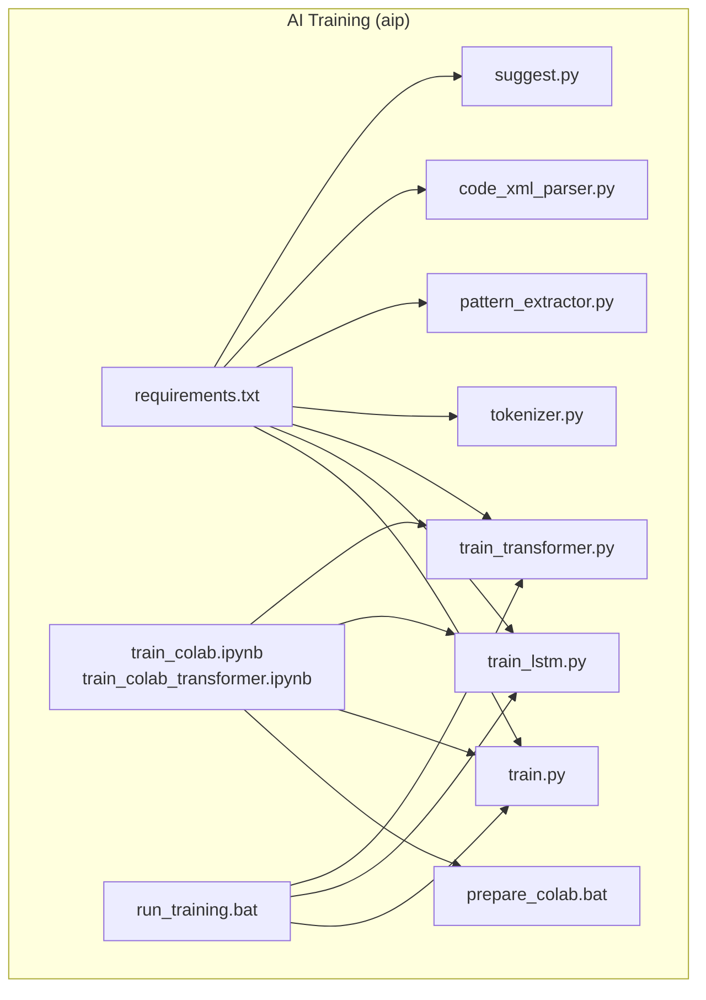
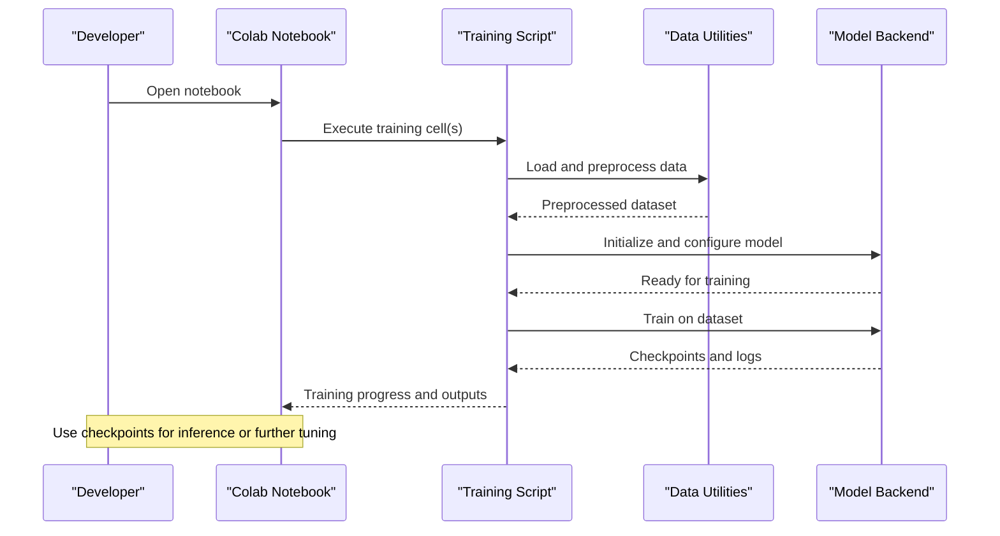
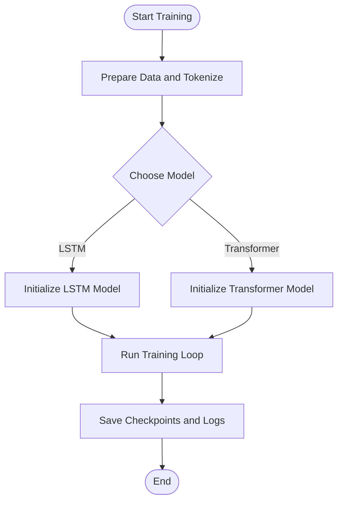
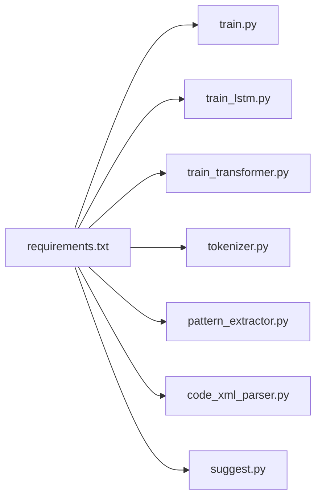

# Environment Setup and Configuration

<cite>
**Referenced Files in This Document**
- [requirements.txt](file://aip/requirements.txt)
- [README_COLAB.txt](file://aip/README_COLAB.txt)
- [train_colab.ipynb](file://aip/train_colab.ipynb)
- [train_colab_transformer.ipynb](file://aip/train_colab_transformer.ipynb)
- [prepare_colab.bat](file://aip/prepare_colab.bat)
- [run_training.bat](file://aip/run_training.bat)
- [train.py](file://aip/train.py)
- [train_lstm.py](file://aip/train_lstm.py)
- [train_transformer.py](file://aip/train_transformer.py)
- [tokenizer.py](file://aip/tokenizer.py)
- [pattern_extractor.py](file://aip/pattern_extractor.py)
- [code_xml_parser.py](file://aip/code_xml_parser.py)
- [suggest.py](file://aip/suggest.py)
</cite>

## Table of Contents
1. [Introduction](#introduction)
2. [Project Structure](#project-structure)
3. [Core Components](#core-components)
4. [Architecture Overview](#architecture-overview)
5. [Detailed Component Analysis](#detailed-component-analysis)
6. [Dependency Analysis](#dependency-analysis)
7. [Performance Considerations](#performance-considerations)
8. [Troubleshooting Guide](#troubleshooting-guide)
9. [Conclusion](#conclusion)
10. [Appendices](#appendices)

## Introduction
This document explains how to set up the training environment for NewCatroid’s AI components. It covers Python dependencies, CUDA requirements, hardware specifications, and step-by-step setup instructions for both local development environments and Google Colab notebooks. It also includes configuration of virtual environments, dependency installation procedures, environment variable settings, troubleshooting guidance, and performance optimization tips tailored to different hardware configurations.

## Project Structure
The training-related code is primarily located under the aip directory. Key artifacts include:
- Python scripts for training (LSTM and Transformer variants)
- Data processing utilities (tokenization, pattern extraction, XML parsing)
- A suggestion service script
- Requirements file for Python dependencies
- Google Colab notebooks and helper scripts for cloud-based training
- Windows batch helpers for local execution

**Diagram sources**
- [requirements.txt](file://aip/requirements.txt)
- [train_colab.ipynb](file://aip/train_colab.ipynb)
- [train_colab_transformer.ipynb](file://aip/train_colab_transformer.ipynb)
- [prepare_colab.bat](file://aip/prepare_colab.bat)
- [run_training.bat](file://aip/run_training.bat)
- [train.py](file://aip/train.py)
- [train_lstm.py](file://aip/train_lstm.py)
- [train_transformer.py](file://aip/train_transformer.py)
- [tokenizer.py](file://aip/tokenizer.py)
- [pattern_extractor.py](file://aip/pattern_extractor.py)
- [code_xml_parser.py](file://aip/code_xml_parser.py)
- [suggest.py](file://aip/suggest.py)

**Section sources**
- [requirements.txt](file://aip/requirements.txt)
- [README_COLAB.txt](file://aip/README_COLAB.txt)
- [train_colab.ipynb](file://aip/train_colab.ipynb)
- [train_colab_transformer.ipynb](file://aip/train_colab_transformer.ipynb)
- [prepare_colab.bat](file://aip/prepare_colab.bat)
- [run_training.bat](file://aip/run_training.bat)
- [train.py](file://aip/train.py)
- [train_lstm.py](file://aip/train_lstm.py)
- [train_transformer.py](file://aip/train_transformer.py)
- [tokenizer.py](file://aip/tokenizer.py)
- [pattern_extractor.py](file://aip/pattern_extractor.py)
- [code_xml_parser.py](file://aip/code_xml_parser.py)
- [suggest.py](file://aip/suggest.py)

## Core Components
- Training entry points:
  - train.py: General training orchestration
  - train_lstm.py: LSTM-specific training logic
  - train_transformer.py: Transformer-specific training logic
- Data pipeline utilities:
  - tokenizer.py: Tokenization routines used by models
  - pattern_extractor.py: Extracts patterns from source data
  - code_xml_parser.py: Parses XML-based code structures
- Inference/suggestion:
  - suggest.py: Provides suggestions using trained models
- Execution helpers:
  - run_training.bat: Local Windows launcher for training scripts
  - prepare_colab.bat: Prepares Colab environment
  - README_COLAB.txt: Colab usage notes
  - train_colab.ipynb / train_colab_transformer.ipynb: Cloud notebook workflows

These components collectively define the training workflow, data preparation, and inference capabilities.

**Section sources**
- [train.py](file://aip/train.py)
- [train_lstm.py](file://aip/train_lstm.py)
- [train_transformer.py](file://aip/train_transformer.py)
- [tokenizer.py](file://aip/tokenizer.py)
- [pattern_extractor.py](file://aip/pattern_extractor.py)
- [code_xml_parser.py](file://aip/code_xml_parser.py)
- [suggest.py](file://aip/suggest.py)
- [run_training.bat](file://aip/run_training.bat)
- [prepare_colab.bat](file://aip/prepare_colab.bat)
- [README_COLAB.txt](file://aip/README_COLAB.txt)
- [train_colab.ipynb](file://aip/train_colab.ipynb)
- [train_colab_transformer.ipynb](file://aip/train_colab_transformer.ipynb)

## Architecture Overview
The training architecture consists of:
- Data ingestion and preprocessing via XML parsing and pattern extraction
- Tokenization to convert raw inputs into model-ready sequences
- Model training with either LSTM or Transformer backends
- Optional suggestion/inference using trained models
- Execution through local batch scripts or Colab notebooks

**Diagram sources**
- [train_colab.ipynb](file://aip/train_colab.ipynb)
- [train_colab_transformer.ipynb](file://aip/train_colab_transformer.ipynb)
- [train.py](file://aip/train.py)
- [train_lstm.py](file://aip/train_lstm.py)
- [train_transformer.py](file://aip/train_transformer.py)
- [tokenizer.py](file://aip/tokenizer.py)
- [pattern_extractor.py](file://aip/pattern_extractor.py)
- [code_xml_parser.py](file://aip/code_xml_parser.py)

## Detailed Component Analysis

### Python Dependencies and Virtual Environments
- The Python dependencies are declared in the requirements file. Install them within an isolated Python environment to avoid conflicts.
- Recommended approach:
  - Create a virtual environment using your preferred tool (e.g., venv or conda).
  - Activate the environment.
  - Install dependencies from the requirements file.
- Ensure your Python version matches the project’s expectations as indicated by the requirements file.

**Section sources**
- [requirements.txt](file://aip/requirements.txt)

### CUDA and Hardware Requirements
- GPU acceleration is supported when available. If you intend to use CUDA-enabled builds of deep learning libraries, ensure:
  - Your NVIDIA driver supports the required CUDA toolkit version.
  - The installed deep learning packages are built for the same CUDA version.
- For CPU-only setups, disable GPU features in the relevant scripts or rely on default fallback behavior.

[No sources needed since this section provides general guidance]

### Local Development Setup (Windows)
- Use the provided batch helper to run training locally:
  - run_training.bat serves as a convenient entry point for executing training scripts.
- Steps:
  - Set up a Python virtual environment and install dependencies from the requirements file.
  - Launch the training helper script from the aip directory.
  - Follow any prompts or adjust parameters as needed.

**Section sources**
- [run_training.bat](file://aip/run_training.bat)
- [requirements.txt](file://aip/requirements.txt)

### Google Colab Setup
- The repository includes Colab notebooks for both LSTM and Transformer training workflows.
- Use the included Colab helper and documentation:
  - prepare_colab.bat can assist with preparing the environment.
  - README_COLAB.txt contains usage notes for Colab.
- Typical steps:
  - Open the appropriate notebook in Colab.
  - Run the setup cells to install dependencies and configure runtime.
  - Execute training cells and monitor progress.

**Section sources**
- [README_COLAB.txt](file://aip/README_COLAB.txt)
- [prepare_colab.bat](file://aip/prepare_colab.bat)
- [train_colab.ipynb](file://aip/train_colab.ipynb)
- [train_colab_transformer.ipynb](file://aip/train_colab_transformer.ipynb)

### Data Pipeline and Tokenization
- Data ingestion and preprocessing:
  - code_xml_parser.py parses XML-based code structures.
  - pattern_extractor.py extracts patterns from parsed data.
- Tokenization:
  - tokenizer.py converts raw inputs into token sequences suitable for model training.
- These utilities are consumed by the training scripts during data loading and preprocessing phases.

**Section sources**
- [code_xml_parser.py](file://aip/code_xml_parser.py)
- [pattern_extractor.py](file://aip/pattern_extractor.py)
- [tokenizer.py](file://aip/tokenizer.py)

### Training Scripts and Workflows
- Entry points:
  - train.py orchestrates general training tasks.
  - train_lstm.py focuses on LSTM model training.
  - train_transformer.py focuses on Transformer model training.
- Workflow:
  - Load and preprocess data using utilities.
  - Initialize model backend (LSTM or Transformer).
  - Configure hyperparameters and training options.
  - Execute training loop and save checkpoints/logs.

**Diagram sources**
- [train.py](file://aip/train.py)
- [train_lstm.py](file://aip/train_lstm.py)
- [train_transformer.py](file://aip/train_transformer.py)
- [tokenizer.py](file://aip/tokenizer.py)
- [pattern_extractor.py](file://aip/pattern_extractor.py)
- [code_xml_parser.py](file://aip/code_xml_parser.py)

**Section sources**
- [train.py](file://aip/train.py)
- [train_lstm.py](file://aip/train_lstm.py)
- [train_transformer.py](file://aip/train_transformer.py)

### Inference/Suggestion Service
- suggest.py provides functionality to generate suggestions using trained models.
- Integration:
  - Load the appropriate checkpoint.
  - Configure input tokens via tokenizer utilities.
  - Generate predictions and format outputs.

**Section sources**
- [suggest.py](file://aip/suggest.py)
- [tokenizer.py](file://aip/tokenizer.py)

## Dependency Analysis
The following diagram shows how the requirements file ties into the main training and utility modules.

**Diagram sources**
- [requirements.txt](file://aip/requirements.txt)
- [train.py](file://aip/train.py)
- [train_lstm.py](file://aip/train_lstm.py)
- [train_transformer.py](file://aip/train_transformer.py)
- [tokenizer.py](file://aip/tokenizer.py)
- [pattern_extractor.py](file://aip/pattern_extractor.py)
- [code_xml_parser.py](file://aip/code_xml_parser.py)
- [suggest.py](file://aip/suggest.py)

**Section sources**
- [requirements.txt](file://aip/requirements.txt)

## Performance Considerations
- GPU vs CPU:
  - Prefer GPU when available for faster training, especially for Transformer models.
  - Ensure CUDA-compatible package versions if using GPU acceleration.
- Batch size and sequence length:
  - Adjust based on memory constraints; larger values improve throughput but require more VRAM/RAM.
- Mixed precision:
  - If supported by your environment, enabling mixed precision can reduce memory usage and speed up training.
- Data pipeline efficiency:
  - Optimize tokenization and preprocessing to minimize I/O bottlenecks.
- Checkpointing and logging:
  - Regularly save checkpoints to resume training after interruptions and to evaluate intermediate results.

[No sources needed since this section provides general guidance]

## Troubleshooting Guide
Common issues and resolutions:
- Missing dependencies:
  - Reinstall dependencies from the requirements file inside the active virtual environment.
- CUDA mismatch:
  - Verify that the installed deep learning packages match your CUDA toolkit version and NVIDIA driver.
- Colab runtime errors:
  - Re-run setup cells in the notebook; consult README_COLAB.txt for additional notes.
- Permission or path issues (Windows):
  - Ensure the working directory is set correctly before running batch helpers.
- Out-of-memory errors:
  - Reduce batch size or sequence length; consider CPU-only mode if GPU memory is insufficient.

**Section sources**
- [requirements.txt](file://aip/requirements.txt)
- [README_COLAB.txt](file://aip/README_COLAB.txt)
- [run_training.bat](file://aip/run_training.bat)

## Conclusion
You now have a complete guide to setting up the training environment for NewCatroid’s AI components. Use the virtual environment and requirements file to manage dependencies, choose between local or Colab workflows, and optimize performance based on your hardware. Refer to the troubleshooting section for common pitfalls and best practices.

## Appendices

### Quick Start Checklist
- Create and activate a Python virtual environment.
- Install dependencies from the requirements file.
- Choose a training backend (LSTM or Transformer).
- For local runs, use the batch helper script.
- For cloud runs, open the appropriate Colab notebook and follow setup instructions.

**Section sources**
- [requirements.txt](file://aip/requirements.txt)
- [run_training.bat](file://aip/run_training.bat)
- [train_colab.ipynb](file://aip/train_colab.ipynb)
- [train_colab_transformer.ipynb](file://aip/train_colab_transformer.ipynb)
- [README_COLAB.txt](file://aip/README_COLAB.txt)