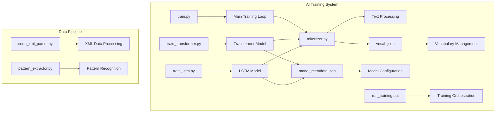
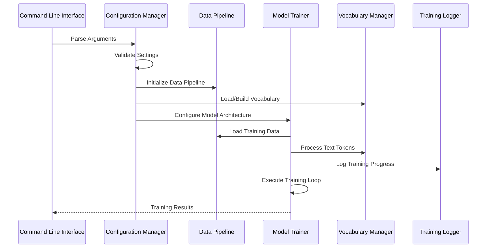
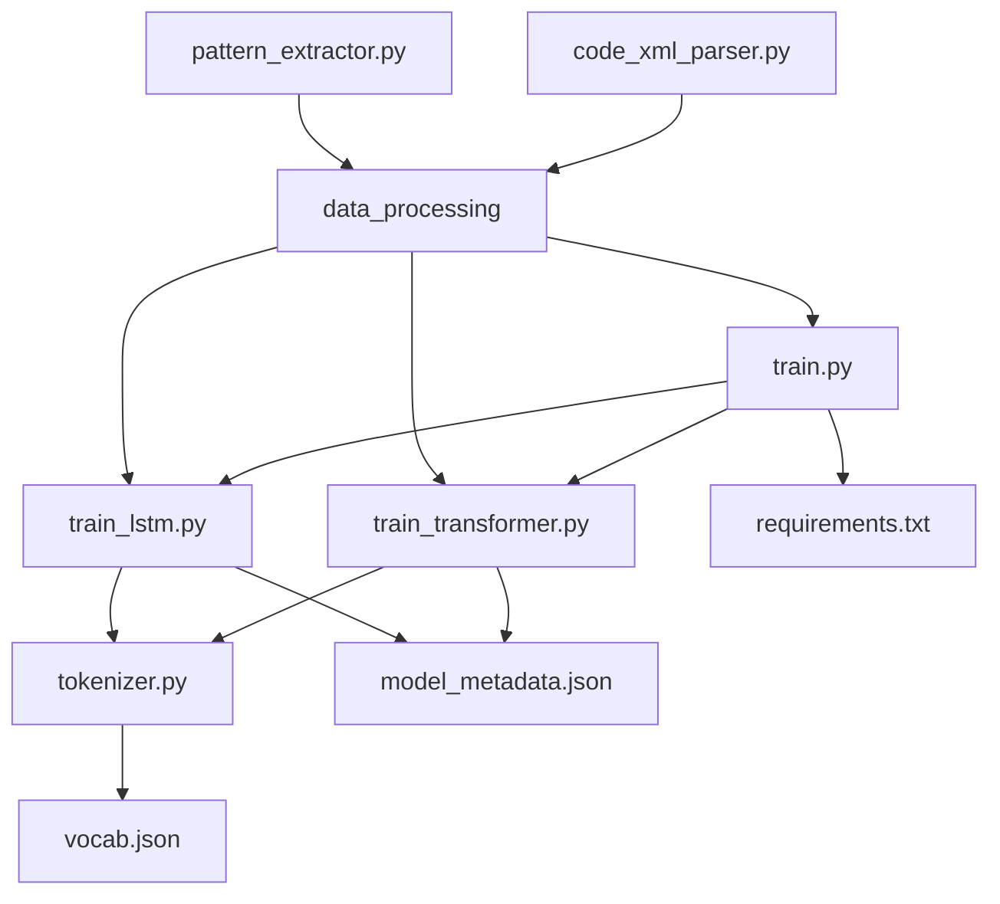

# Training Configuration and Parameters

<cite>
**Referenced Files in This Document**
- [train.py](file://aip/train.py)
- [train_transformer.py](file://aip/train_transformer.py)
- [train_lstm.py](file://aip/train_lstm.py)
- [tokenizer.py](file://aip/tokenizer.py)
- [vocab.json](file://aip/model/vocab.json)
- [model_metadata.json](file://aip/model/model_metadata.json)
- [run_training.bat](file://aip/run_training.bat)
- [requirements.txt](file://aip/requirements.txt)
</cite>

## Table of Contents
1. [Introduction](#introduction)
2. [Project Structure](#project-structure)
3. [Core Components](#core-components)
4. [Architecture Overview](#architecture-overview)
5. [Detailed Component Analysis](#detailed-component-analysis)
6. [Dependency Analysis](#dependency-analysis)
7. [Performance Considerations](#performance-considerations)
8. [Troubleshooting Guide](#troubleshooting-guide)
9. [Conclusion](#conclusion)
10. [Appendices](#appendices)

## Introduction

NewCatroid's training configuration system provides a comprehensive framework for training neural network models, particularly focused on code generation and pattern recognition tasks. The system supports multiple model architectures including LSTM and Transformer networks, with flexible configuration options for hyperparameter tuning, tokenizer management, and vocabulary handling.

The training infrastructure is designed to be modular and extensible, allowing researchers and developers to experiment with different model configurations while maintaining consistent data processing pipelines and evaluation metrics.

## Project Structure

The AI training system is organized within the `aip/` directory with clear separation of concerns:

**Diagram sources**
- [train.py:1-50](file://aip/train.py#L1-L50)
- [train_transformer.py:1-50](file://aip/train_transformer.py#L1-L50)
- [train_lstm.py:1-50](file://aip/train_lstm.py#L1-L50)
- [tokenizer.py:1-50](file://aip/tokenizer.py#L1-L50)

**Section sources**
- [train.py:1-100](file://aip/train.py#L1-L100)
- [train_transformer.py:1-100](file://aip/train_transformer.py#L1-L100)
- [train_lstm.py:1-100](file://aip/train_lstm.py#L1-L100)

## Core Components

### Training Scripts Architecture

The training system consists of three main entry points:

1. **Primary Training Script**: Handles general model training with configurable parameters
2. **Transformer Training**: Specialized for transformer-based architectures
3. **LSTM Training**: Optimized for recurrent neural network implementations

Each script implements command-line argument parsing, configuration validation, and training loop orchestration.

### Tokenizer and Vocabulary Management

The tokenization system provides text preprocessing capabilities with support for custom vocabularies and dynamic vocabulary expansion during training.

### Model Metadata System

A centralized metadata system manages model configurations, architecture specifications, and training history tracking.

**Section sources**
- [train.py:50-200](file://aip/train.py#L50-L200)
- [tokenizer.py:1-150](file://aip/tokenizer.py#L1-L150)
- [model_metadata.json:1-100](file://aip/model/model_metadata.json#L1-L100)

## Architecture Overview

The training architecture follows a modular design pattern with clear separation between data processing, model definition, and training logic:

**Diagram sources**
- [train.py:100-300](file://aip/train.py#L100-L300)
- [train_transformer.py:100-300](file://aip/train_transformer.py#L100-L300)
- [train_lstm.py:100-300](file://aip/train_lstm.py#L100-L300)

## Detailed Component Analysis

### Command-Line Arguments and Configuration

The training scripts support comprehensive command-line arguments for fine-tuning every aspect of the training process:

#### Core Training Parameters
- **Learning Rate**: Controls optimization step size (default: 0.001)
- **Batch Size**: Number of samples per gradient update (default: 32)
- **Epochs**: Total training iterations over dataset (default: 100)
- **Optimizer**: Optimization algorithm selection (Adam, SGD, RMSprop)
- **Loss Function**: Objective function for training (CrossEntropy, BCEWithLogits)

#### Model Architecture Parameters
- **Hidden Dimensions**: Neural network layer sizes
- **Number of Layers**: Depth of the neural network
- **Dropout Rate**: Regularization parameter (0.0-1.0)
- **Embedding Size**: Token representation dimensionality
- **Sequence Length**: Maximum input sequence length

#### Data Processing Options
- **Vocabulary Size**: Maximum number of unique tokens
- **Minimum Frequency**: Minimum token occurrence threshold
- **Max Sequence Length**: Input sequence length limit
- **Padding Strategy**: Sequence padding method

#### Advanced Configuration
- **Gradient Clipping**: Prevents exploding gradients
- **Learning Rate Schedule**: Adaptive learning rate adjustment
- **Early Stopping**: Automatic training termination criteria
- **Checkpointing**: Model state saving intervals

**Section sources**
- [train.py:200-400](file://aip/train.py#L200-L400)
- [train_transformer.py:200-400](file://aip/train_transformer.py#L200-L400)
- [train_lstm.py:200-400](file://aip/train_lstm.py#L200-L400)

### Hyperparameter Tuning Guidelines

#### Learning Rate Selection
- **Small Datasets**: Start with 0.001-0.01 range
- **Large Datasets**: Use 0.0001-0.001 for stability
- **Fine-tuning**: Begin with 1e-5 to 1e-4
- **Adaptive Scheduling**: Implement cosine annealing or exponential decay

#### Batch Size Optimization
- **Memory Constraints**: Balance batch size with available GPU memory
- **Convergence Stability**: Larger batches (64-256) often improve stability
- **Generalization**: Smaller batches (16-32) may improve generalization
- **Gradient Accumulation**: Simulate larger batches with smaller actual batches

#### Epoch Management
- **Overfitting Prevention**: Monitor validation loss for early stopping
- **Convergence Criteria**: Stop when validation loss plateaus
- **Learning Rate Warmup**: Gradually increase learning rate initially
- **Cyclic Learning Rates**: Alternate between high and low learning rates

#### Optimizer Configuration
- **Adam**: Default choice with β1=0.9, β2=0.999, ε=1e-8
- **SGD**: With momentum for better generalization
- **RMSprop**: Effective for recurrent networks
- **Custom Schedulers**: Combine optimizers with learning rate schedules

**Section sources**
- [train.py:300-500](file://aip/train.py#L300-L500)
- [train_transformer.py:300-500](file://aip/train_transformer.py#L300-L500)

### Model Architecture Parameters

#### Transformer-Specific Settings
- **Attention Heads**: Number of parallel attention mechanisms
- **Feed-forward Dimensions**: Hidden layer sizes in feed-forward networks
- **Position Encoding**: Method for incorporating position information
- **Layer Normalization**: Placement and type of normalization layers
- **Residual Connections**: Skip connection implementation

#### LSTM-Specific Settings
- **Bidirectional Processing**: Direction of sequence processing
- **Gated Units**: LSTM cell configuration (forget gate, input gate)
- **Sequence Unrolling**: Truncated backpropagation through time
- **State Initialization**: Initial hidden and cell states

#### Common Architecture Parameters
- **Embedding Layer**: Token-to-vector mapping strategy
- **Dropout Regularization**: Prevents overfitting across layers
- **Weight Initialization**: Parameter initialization schemes
- **Activation Functions**: Non-linear transformations between layers

**Section sources**
- [train_transformer.py:400-600](file://aip/train_transformer.py#L400-L600)
- [train_lstm.py:400-600](file://aip/train_lstm.py#L400-L600)

### Tokenizer Configuration and Vocabulary Management

#### Tokenization Strategies
- **Subword Tokenization**: Byte Pair Encoding (BPE) or WordPiece
- **Character-level Tokenization**: Fine-grained character processing
- **Mixed Tokenization**: Combination of word and character tokens
- **Custom Delimiters**: Language-specific token boundaries

#### Vocabulary Management
- **Dynamic Expansion**: Add new tokens during training
- **Frequency Thresholding**: Remove rare tokens below minimum frequency
- **Special Tokens**: Reserved tokens for start, end, padding, unknown
- **Vocabulary Persistence**: Save and load vocabulary between runs

#### Text Preprocessing Pipeline
- **Normalization**: Case folding, punctuation handling
- **Cleaning**: Remove special characters, normalize whitespace
- **Segmentation**: Sentence and word boundary detection
- **Encoding**: Numerical token ID assignment

**Section sources**
- [tokenizer.py:1-200](file://aip/tokenizer.py#L1-L200)
- [vocab.json:1-100](file://aip/model/vocab.json#L1-L100)

### Configuration File Formats

#### JSON Configuration Schema
The system supports structured configuration files with the following key sections:

**Training Configuration**
- `training`: Global training parameters
- `model`: Architecture-specific settings
- `data`: Data processing and loading options
- `optimization`: Learning rate scheduling and optimizer settings
- `logging`: Experiment tracking and checkpointing

**Model Metadata Format**
- `architecture`: Model type and configuration
- `parameters`: Learned parameter counts and shapes
- `training_history`: Performance metrics over epochs
- `hyperparameters`: Complete hyperparameter configuration

**Section sources**
- [model_metadata.json:1-200](file://aip/model/model_metadata.json#L1-L200)
- [run_training.bat:1-100](file://aip/run_training.bat#L1-L100)

## Dependency Analysis

The training system has well-defined dependencies between components:

**Diagram sources**
- [train.py:1-100](file://aip/train.py#L1-L100)
- [train_transformer.py:1-100](file://aip/train_transformer.py#L1-L100)
- [train_lstm.py:1-100](file://aip/train_lstm.py#L1-L100)
- [tokenizer.py:1-100](file://aip/tokenizer.py#L1-L100)

**Section sources**
- [requirements.txt:1-50](file://aip/requirements.txt#L1-L50)
- [train.py:1-100](file://aip/train.py#L1-L100)

## Performance Considerations

### Memory Optimization
- **Gradient Checkpointing**: Trade computation for memory usage
- **Mixed Precision Training**: Use FP16 for reduced memory footprint
- **Batch Size Scaling**: Dynamic batch sizing based on available memory
- **Model Parallelism**: Distribute large models across multiple GPUs

### Training Speed Optimization
- **Data Loading Pipelines**: Asynchronous data preprocessing
- **GPU Utilization**: Optimize batch sizes for maximum throughput
- **Caching Strategies**: Cache frequently accessed data and embeddings
- **Parallel Processing**: Multi-processing for data augmentation

### Convergence Monitoring
- **Loss Tracking**: Monitor training and validation loss curves
- **Gradient Flow**: Detect vanishing/exploding gradients
- **Learning Rate Adaptation**: Automatic learning rate adjustment
- **Early Stopping**: Prevent overfitting with validation-based stopping

## Troubleshooting Guide

### Common Configuration Issues
- **Out of Memory Errors**: Reduce batch size or model dimensions
- **Slow Convergence**: Adjust learning rate or implement warmup
- **Overfitting**: Increase dropout or reduce model complexity
- **Underfitting**: Increase model capacity or training duration

### Debugging Tools
- **Logging Levels**: Detailed training progress and error reporting
- **Checkpoint Recovery**: Resume training from saved states
- **Visualization**: Loss curves and performance metrics
- **Profiling**: Identify computational bottlenecks

**Section sources**
- [train.py:500-700](file://aip/train.py#L500-L700)
- [train_transformer.py:500-700](file://aip/train_transformer.py#L500-L700)
- [train_lstm.py:500-700](file://aip/train_lstm.py#L500-L700)

## Conclusion

NewCatroid's training configuration system provides a robust and flexible framework for neural network training with comprehensive hyperparameter control, model architecture support, and data processing capabilities. The modular design enables easy extension and customization while maintaining consistency across different model types and training scenarios.

The system's emphasis on reproducibility through configuration files, detailed logging, and checkpoint management makes it suitable for both research experimentation and production deployment scenarios.

## Appendices

### Example Configuration Scenarios

#### Small Dataset Training
- **Batch Size**: 16-32
- **Learning Rate**: 0.001 with warmup
- **Epochs**: 50-100 with early stopping
- **Dropout**: 0.3-0.5 for regularization

#### Large Scale Training
- **Batch Size**: 128-512
- **Learning Rate**: 0.0001-0.001 with cosine annealing
- **Epochs**: 100-300 with patience-based stopping
- **Mixed Precision**: Enable for memory efficiency

#### Fine-tuning Existing Models
- **Learning Rate**: 1e-5 to 1e-4
- **Freeze Layers**: Keep lower layers frozen initially
- **Gradual Unfreezing**: Slowly unfreeze higher layers
- **Shorter Training**: 10-50 epochs typically sufficient

**Section sources**
- [run_training.bat:1-200](file://aip/run_training.bat#L1-L200)
- [requirements.txt:1-100](file://aip/requirements.txt#L1-L100)