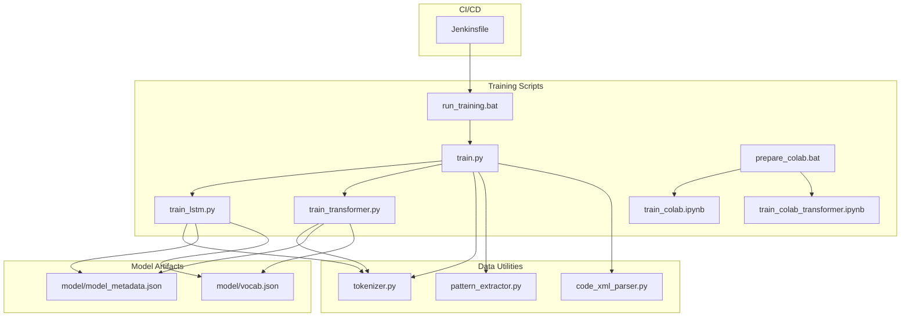
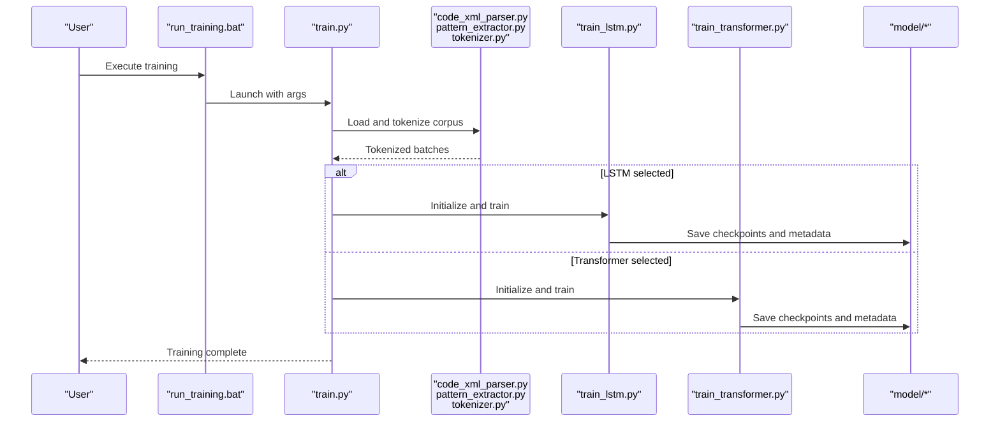
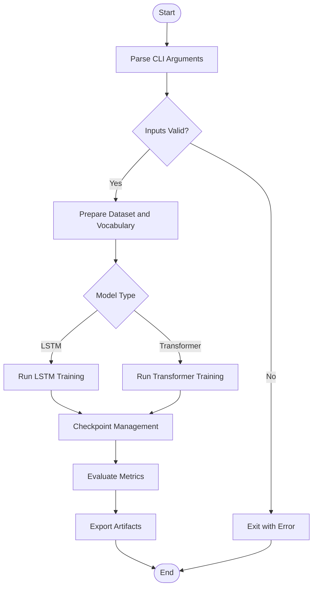
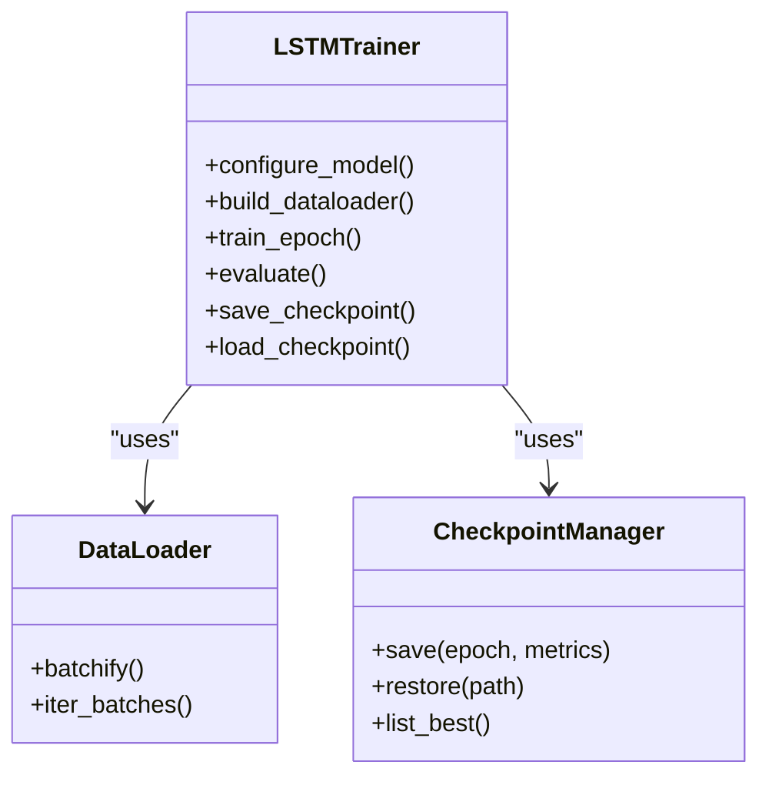
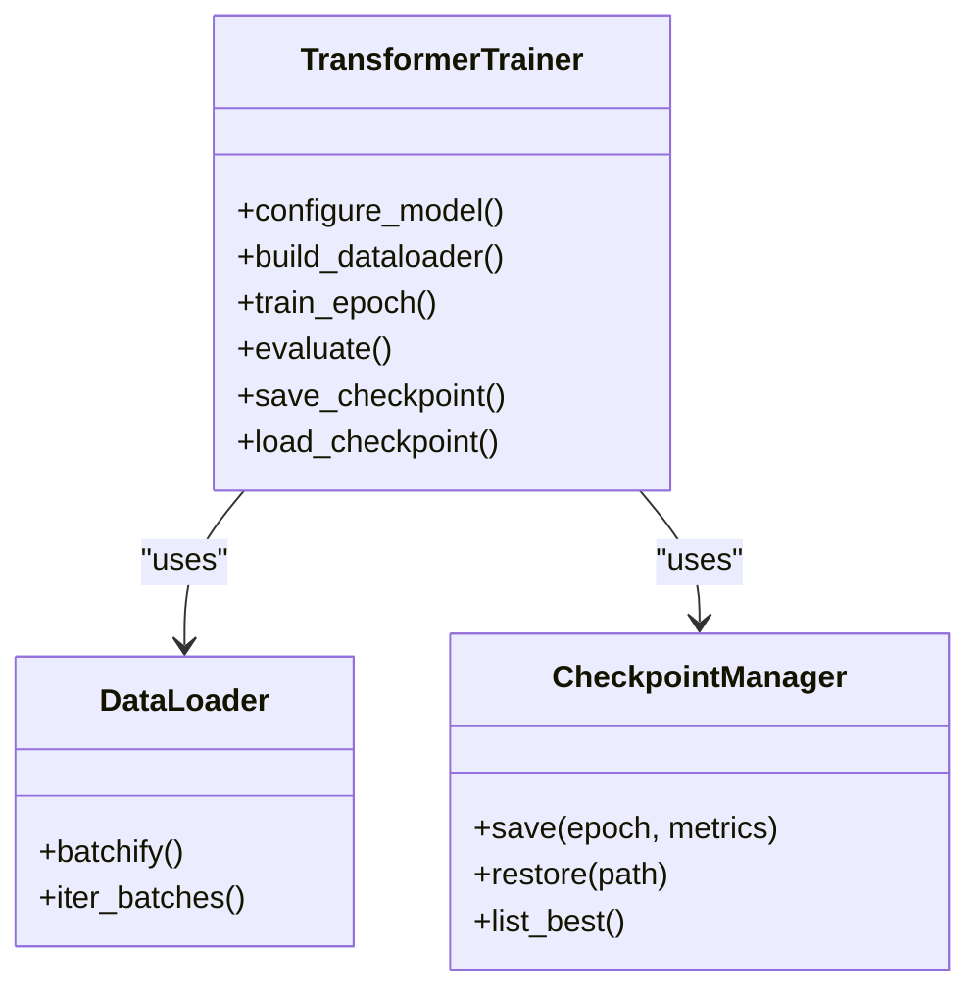
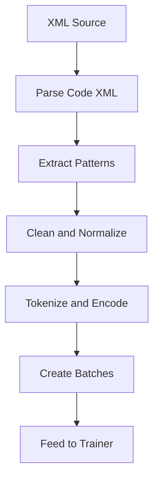
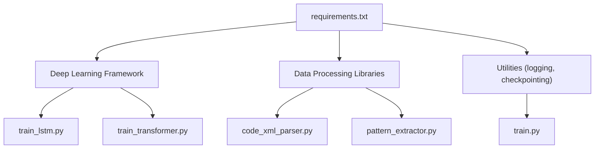

# Training Execution Workflows

<cite>
**Referenced Files in This Document**
- [train.py](file://aip/train.py)
- [train_lstm.py](file://aip/train_lstm.py)
- [train_transformer.py](file://aip/train_transformer.py)
- [run_training.bat](file://aip/run_training.bat)
- [prepare_colab.bat](file://aip/prepare_colab.bat)
- [train_colab.ipynb](file://aip/train_colab.ipynb)
- [train_colab_transformer.ipynb](file://aip/train_colab_transformer.ipynb)
- [tokenizer.py](file://aip/tokenizer.py)
- [pattern_extractor.py](file://aip/pattern_extractor.py)
- [code_xml_parser.py](file://aip/code_xml_parser.py)
- [model_metadata.json](file://aip/model/model_metadata.json)
- [vocab.json](file://aip/model/vocab.json)
- [requirements.txt](file://aip/requirements.txt)
- [README_COLAB.txt](file://aip/README_COLAB.txt)
- [Jenkinsfile](file://Jenkinsfile)
</cite>

## Table of Contents
1. [Introduction](#introduction)
2. [Project Structure](#project-structure)
3. [Core Components](#core-components)
4. [Architecture Overview](#architecture-overview)
5. [Detailed Component Analysis](#detailed-component-analysis)
6. [Dependency Analysis](#dependency-analysis)
7. [Performance Considerations](#performance-considerations)
8. [Troubleshooting Guide](#troubleshooting-guide)
9. [Conclusion](#conclusion)
10. [Appendices](#appendices)

## Introduction
This document explains training execution workflows in NewCatroid, focusing on how models are trained, batched, and automated. It covers the main training script, LSTM and Transformer implementations, checkpointing, monitoring, progress tracking, and automation via scripts and notebooks. It also outlines examples for distributed training and CI/CD integration to support continuous model improvement.

## Project Structure
The training-related code is primarily located under aip/. The key artifacts include:
- Python training entry points for LSTM and Transformer models
- A unified training script that orchestrates data preparation and training
- Batch and Colab automation scripts
- Tokenization and pattern extraction utilities
- Model metadata and vocabulary files consumed at runtime by the app

**Diagram sources**
- [train.py](file://aip/train.py)
- [train_lstm.py](file://aip/train_lstm.py)
- [train_transformer.py](file://aip/train_transformer.py)
- [run_training.bat](file://aip/run_training.bat)
- [prepare_colab.bat](file://aip/prepare_colab.bat)
- [train_colab.ipynb](file://aip/train_colab.ipynb)
- [train_colab_transformer.ipynb](file://aip/train_colab_transformer.ipynb)
- [tokenizer.py](file://aip/tokenizer.py)
- [pattern_extractor.py](file://aip/pattern_extractor.py)
- [code_xml_parser.py](file://aip/code_xml_parser.py)
- [model_metadata.json](file://aip/model/model_metadata.json)
- [vocab.json](file://aip/model/vocab.json)
- [Jenkinsfile](file://Jenkinsfile)

**Section sources**
- [train.py](file://aip/train.py)
- [train_lstm.py](file://aip/train_lstm.py)
- [train_transformer.py](file://aip/train_transformer.py)
- [run_training.bat](file://aip/run_training.bat)
- [prepare_colab.bat](file://aip/prepare_colab.bat)
- [train_colab.ipynb](file://aip/train_colab.ipynb)
- [train_colab_transformer.ipynb](file://aip/train_colab_transformer.ipynb)
- [tokenizer.py](file://aip/tokenizer.py)
- [pattern_extractor.py](file://aip/pattern_extractor.py)
- [code_xml_parser.py](file://aip/code_xml_parser.py)
- [model_metadata.json](file://aip/model/model_metadata.json)
- [vocab.json](file://aip/model/vocab.json)
- [Jenkinsfile](file://Jenkinsfile)

## Core Components
- Unified training entry point: Orchestrates dataset loading, tokenization, model selection (LSTM or Transformer), training loop, checkpointing, and artifact export.
- LSTM trainer: Implements sequence modeling with recurrent layers, typically optimized for smaller datasets and lower compute budgets.
- Transformer trainer: Implements attention-based modeling, suitable for larger corpora and parallelizable training.
- Data pipeline: Parses source XML, extracts patterns, and tokenizes sequences into indices using a shared vocabulary.
- Automation: Windows batch scripts and Colab notebooks streamline local and cloud training runs.
- Artifacts: Vocabulary and metadata files are produced and consumed by the application runtime.

Key responsibilities and interactions:
- train.py coordinates arguments, data paths, and invokes either LSTM or Transformer training modules.
- tokenizer.py provides vocabulary building and encoding/decoding utilities used by both trainers.
- pattern_extractor.py and code_xml_parser.py prepare structured training samples from project XML.
- run_training.bat and prepare_colab.bat encapsulate environment setup and command invocation.
- train_colab.ipynb and train_colab_transformer.ipynb provide notebook-based workflows for interactive experimentation and reproducible runs.

**Section sources**
- [train.py](file://aip/train.py)
- [train_lstm.py](file://aip/train_lstm.py)
- [train_transformer.py](file://aip/train_transformer.py)
- [tokenizer.py](file://aip/tokenizer.py)
- [pattern_extractor.py](file://aip/pattern_extractor.py)
- [code_xml_parser.py](file://aip/code_xml_parser.py)
- [run_training.bat](file://aip/run_training.bat)
- [prepare_colab.bat](file://aip/prepare_colab.bat)
- [train_colab.ipynb](file://aip/train_colab.ipynb)
- [train_colab_transformer.ipynb](file://aip/train_colab_transformer.ipynb)
- [model_metadata.json](file://aip/model/model_metadata.json)
- [vocab.json](file://aip/model/vocab.json)

## Architecture Overview
The training architecture separates concerns across data preparation, model training, and automation. The unified entry point selects a backend (LSTM or Transformer) based on configuration and executes a consistent training lifecycle.

**Diagram sources**
- [run_training.bat](file://aip/run_training.bat)
- [train.py](file://aip/train.py)
- [code_xml_parser.py](file://aip/code_xml_parser.py)
- [pattern_extractor.py](file://aip/pattern_extractor.py)
- [tokenizer.py](file://aip/tokenizer.py)
- [train_lstm.py](file://aip/train_lstm.py)
- [train_transformer.py](file://aip/train_transformer.py)
- [model_metadata.json](file://aip/model/model_metadata.json)
- [vocab.json](file://aip/model/vocab.json)

## Detailed Component Analysis

### Main Training Script (train.py)
Responsibilities:
- Parse command-line arguments for dataset paths, model type, hyperparameters, and output directories.
- Build or load vocabulary and initialize tokenizers.
- Construct data loaders and validation pipelines.
- Dispatch to LSTM or Transformer training routines.
- Manage checkpoints, logging, and final artifact packaging.

Typical flow:
- Validate inputs and environment.
- Prepare dataset and vocabulary.
- Configure device placement and precision settings.
- Run training loop with periodic evaluation and checkpointing.
- Export final model artifacts and metadata.

**Diagram sources**
- [train.py](file://aip/train.py)

**Section sources**
- [train.py](file://aip/train.py)

### LSTM Training Implementation (train_lstm.py)
Highlights:
- Recurrent network configuration and sequence handling.
- Optimizer and loss function tailored for language modeling tasks.
- Gradient clipping and early stopping strategies.
- Checkpointing with incremental epoch and validation metrics.

Integration points:
- Consumes tokenized sequences from the data pipeline.
- Writes checkpoints and logs to configured directories.
- Produces model artifacts compatible with the app’s runtime.

**Diagram sources**
- [train_lstm.py](file://aip/train_lstm.py)

**Section sources**
- [train_lstm.py](file://aip/train_lstm.py)

### Transformer Training Implementation (train_transformer.py)
Highlights:
- Attention-based architecture with positional encodings.
- Parallelizable training loops leveraging modern frameworks.
- Learning rate scheduling and mixed precision support.
- Robust checkpointing and resume capabilities.

Integration points:
- Shares tokenizer and vocabulary with LSTM path.
- Outputs artifacts following the same schema for consistency.

**Diagram sources**
- [train_transformer.py](file://aip/train_transformer.py)

**Section sources**
- [train_transformer.py](file://aip/train_transformer.py)

### Data Pipeline (code_xml_parser.py, pattern_extractor.py, tokenizer.py)
Responsibilities:
- Parse Catroid project XML to extract code snippets and patterns.
- Extract reusable structures and normalize tokens.
- Build vocabulary and encode sequences into integer indices.

Processing logic:
- XML parsing yields raw text segments.
- Pattern extraction filters and transforms segments into training samples.
- Tokenizer maps tokens to IDs and handles unknowns and padding.

**Diagram sources**
- [code_xml_parser.py](file://aip/code_xml_parser.py)
- [pattern_extractor.py](file://aip/pattern_extractor.py)
- [tokenizer.py](file://aip/tokenizer.py)

**Section sources**
- [code_xml_parser.py](file://aip/code_xml_parser.py)
- [pattern_extractor.py](file://aip/pattern_extractor.py)
- [tokenizer.py](file://aip/tokenizer.py)

### Automation Scripts and Notebooks (run_training.bat, prepare_colab.bat, train_colab.ipynb, train_colab_transformer.ipynb)
- run_training.bat: Encapsulates environment setup and invokes the main training script with default or provided parameters.
- prepare_colab.bat: Prepares Colab environments and launches notebooks for interactive training.
- train_colab.ipynb: Notebook workflow for LSTM training with step-by-step execution and visualization.
- train_colab_transformer.ipynb: Notebook workflow for Transformer training with similar interactivity.

Usage patterns:
- Local Windows training via batch scripts.
- Cloud-based experimentation via Colab notebooks.
- Reproducible runs by pinning versions and seeds.

**Section sources**
- [run_training.bat](file://aip/run_training.bat)
- [prepare_colab.bat](file://aip/prepare_colab.bat)
- [train_colab.ipynb](file://aip/train_colab.ipynb)
- [train_colab_transformer.ipynb](file://aip/train_colab_transformer.ipynb)

### Model Artifacts and Metadata (model_metadata.json, vocab.json)
- model_metadata.json: Stores model configuration, versioning, and runtime compatibility details.
- vocab.json: Contains the learned vocabulary mapping used by both LSTM and Transformer models.

These artifacts are consumed by the application runtime to perform inference consistently with the training-time tokenization scheme.

**Section sources**
- [model_metadata.json](file://aip/model/model_metadata.json)
- [vocab.json](file://aip/model/vocab.json)

## Dependency Analysis
External dependencies are declared in requirements.txt and should be installed before running training scripts. The training pipeline depends on:
- Data processing libraries for XML parsing and text normalization.
- Deep learning framework for model definitions and training loops.
- Utilities for checkpointing, logging, and artifact management.

**Diagram sources**
- [requirements.txt](file://aip/requirements.txt)
- [train.py](file://aip/train.py)
- [train_lstm.py](file://aip/train_lstm.py)
- [train_transformer.py](file://aip/train_transformer.py)
- [code_xml_parser.py](file://aip/code_xml_parser.py)
- [pattern_extractor.py](file://aip/pattern_extractor.py)

**Section sources**
- [requirements.txt](file://aip/requirements.txt)

## Performance Considerations
- Batch size tuning: Larger batches improve throughput but increase memory usage; balance according to hardware constraints.
- Sequence length: Longer sequences increase computational cost; consider truncation or chunking strategies.
- Mixed precision: Enable where supported to reduce memory footprint and accelerate training.
- Checkpoint frequency: Adjust to balance storage overhead and recovery granularity.
- Early stopping: Use validation metrics to prevent overfitting and save compute resources.
- Distributed training: For large datasets, leverage multi-GPU or multi-node setups through the underlying framework’s distributed APIs.

[No sources needed since this section provides general guidance]

## Troubleshooting Guide
Common issues and resolutions:
- Missing dependencies: Ensure all packages listed in requirements.txt are installed.
- Vocabulary mismatch: Verify that vocab.json matches the model configuration and training-time tokenization.
- Out-of-memory errors: Reduce batch size, sequence length, or enable mixed precision.
- Corrupted checkpoints: Restore from the last known-good checkpoint and re-run evaluation.
- Slow training: Monitor GPU utilization and adjust data loader workers; consider caching preprocessed data.

Operational tips:
- Log directory inspection: Review logs for warnings about data quality or numerical instability.
- Artifact validation: Confirm that model_metadata.json aligns with the deployed model version.
- Reproducibility: Pin random seeds and framework versions to ensure consistent results.

**Section sources**
- [requirements.txt](file://aip/requirements.txt)
- [model_metadata.json](file://aip/model/model_metadata.json)
- [vocab.json](file://aip/model/vocab.json)

## Conclusion
NewCatroid’s training workflows provide a cohesive path from raw project XML to deployable language models. The unified entry point standardizes execution across LSTM and Transformer backends, while automation scripts and notebooks streamline local and cloud training. With robust checkpointing, clear artifact schemas, and CI/CD hooks, teams can continuously improve models efficiently and reliably.

[No sources needed since this section summarizes without analyzing specific files]

## Appendices

### Automated Training Pipelines
- Local execution: Use run_training.bat to launch training with predefined configurations.
- Interactive experimentation: Use prepare_colab.bat to set up Colab and run train_colab.ipynb or train_colab_transformer.ipynb.
- Continuous improvement: Integrate Jenkinsfile jobs to trigger training on schedule or upon code changes.

**Section sources**
- [run_training.bat](file://aip/run_training.bat)
- [prepare_colab.bat](file://aip/prepare_colab.bat)
- [train_colab.ipynb](file://aip/train_colab.ipynb)
- [train_colab_transformer.ipynb](file://aip/train_colab_transformer.ipynb)
- [Jenkinsfile](file://Jenkinsfile)

### Distributed Training Setups
- Multi-GPU: Configure distributed data parallelism within the chosen deep learning framework.
- Multi-node: Scale out across machines using cluster managers supported by the framework.
- Checkpoint synchronization: Ensure consistent checkpoint paths and naming conventions across nodes.

[No sources needed since this section provides general guidance]

### CI/CD Integration Examples
- Trigger training on commit: Add a Jenkins job that installs dependencies, prepares data, and runs training.
- Artifact promotion: After successful training, validate artifacts and publish them for deployment.
- Notifications: Emit status updates and links to logs and artifacts for team visibility.

**Section sources**
- [Jenkinsfile](file://Jenkinsfile)

### Quick Start References
- Environment setup and notes: See README_COLAB.txt for Colab-specific instructions.
- Dependencies: Install packages from requirements.txt prior to training.

**Section sources**
- [README_COLAB.txt](file://aip/README_COLAB.txt)
- [requirements.txt](file://aip/requirements.txt)