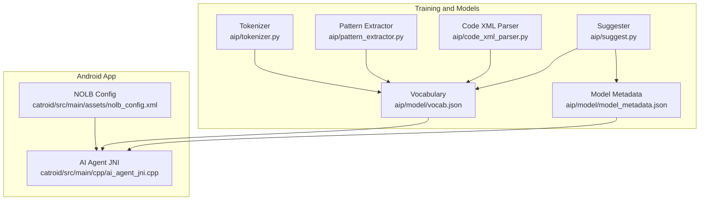
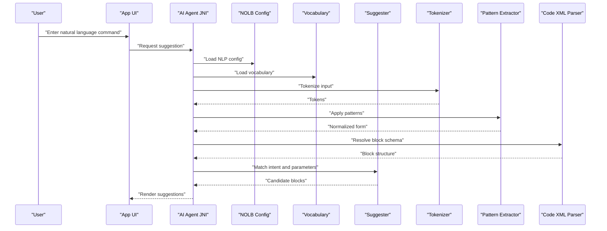
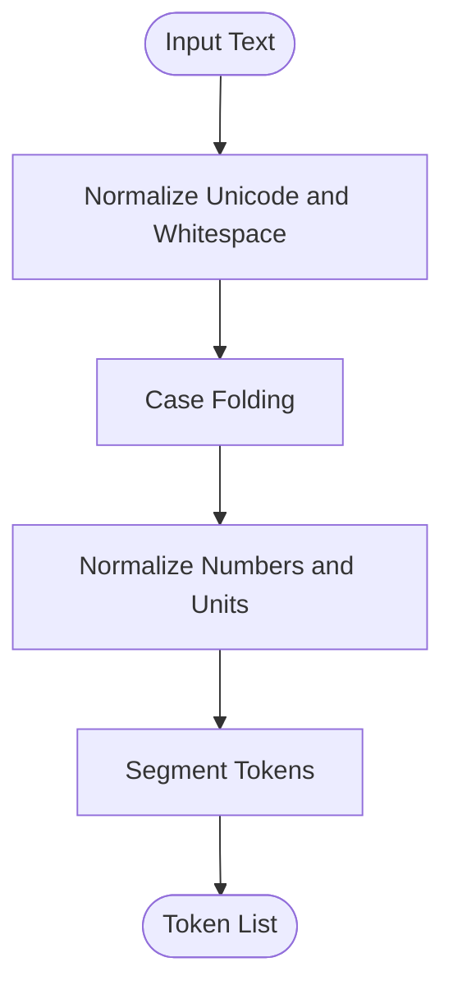
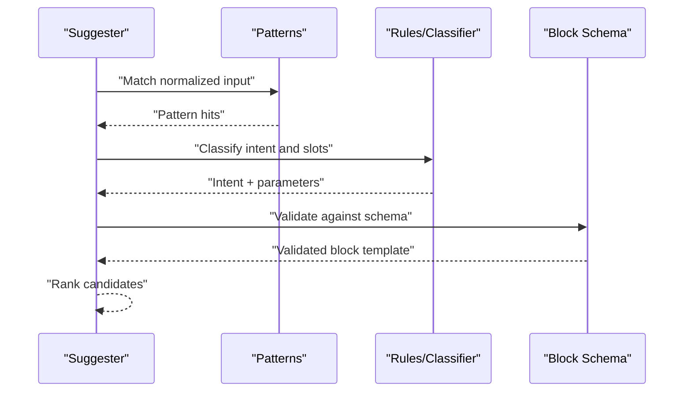
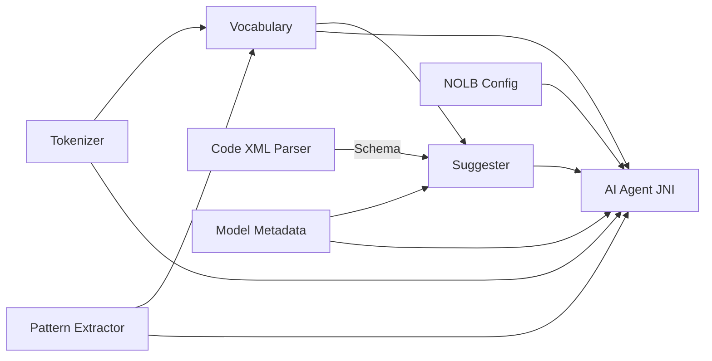

# Natural Language Processing

<cite>
**Referenced Files in This Document**
- [tokenizer.py](file://aip/tokenizer.py)
- [train.py](file://aip/train.py)
- [train_lstm.py](file://aip/train_lstm.py)
- [train_transformer.py](file://aip/train_transformer.py)
- [pattern_extractor.py](file://aip/pattern_extractor.py)
- [code_xml_parser.py](file://aip/code_xml_parser.py)
- [suggest.py](file://aip/suggest.py)
- [vocab.json](file://aip/model/vocab.json)
- [model_metadata.json](file://aip/model/model_metadata.json)
- [nolb_config.xml](file://catroid/src/main/assets/nolb_config.xml)
- [ai_agent_jni.cpp](file://catroid/src/main/cpp/ai_agent_jni.cpp)
</cite>

## Table of Contents
1. [Introduction](#introduction)
2. [Project Structure](#project-structure)
3. [Core Components](#core-components)
4. [Architecture Overview](#architecture-overview)
5. [Detailed Component Analysis](#detailed-component-analysis)
6. [Dependency Analysis](#dependency-analysis)
7. [Performance Considerations](#performance-considerations)
8. [Troubleshooting Guide](#troubleshooting-guide)
9. [Conclusion](#conclusion)
10. [Appendices](#appendices)

## Introduction
This document explains the natural language processing (NLP) capabilities in NewCatroid that transform user commands into visual programming blocks. It covers the text-to-block conversion pipeline, tokenizer implementation, vocabulary management, semantic parsing, and intent recognition. Practical guidance is provided for adding new languages, customizing command recognition, and improving accuracy. Multilingual support, cultural adaptations, and accessibility considerations are also addressed.

## Project Structure
The NLP subsystem spans Python-based training and inference assets under aip/, Android app resources under catroid/src/main/assets/, and native integration via JNI. Key areas:
- Training and model artifacts: aip/
- Vocabulary and metadata: aip/model/
- App-side configuration and assets: catroid/src/main/assets/
- Native bridge to AI features: catroid/src/main/cpp/

**Diagram sources**
- [tokenizer.py](file://aip/tokenizer.py)
- [pattern_extractor.py](file://aip/pattern_extractor.py)
- [code_xml_parser.py](file://aip/code_xml_parser.py)
- [suggest.py](file://aip/suggest.py)
- [vocab.json](file://aip/model/vocab.json)
- [model_metadata.json](file://aip/model/model_metadata.json)
- [nolb_config.xml](file://catroid/src/main/assets/nolb_config.xml)
- [ai_agent_jni.cpp](file://catroid/src/main/cpp/ai_agent_jni.cpp)

**Section sources**
- [tokenizer.py](file://aip/tokenizer.py)
- [pattern_extractor.py](file://aip/pattern_extractor.py)
- [code_xml_parser.py](file://aip/code_xml_parser.py)
- [suggest.py](file://aip/suggest.py)
- [vocab.json](file://aip/model/vocab.json)
- [model_metadata.json](file://aip/model/model_metadata.json)
- [nolb_config.xml](file://catroid/src/main/assets/nolb_config.xml)
- [ai_agent_jni.cpp](file://catroid/src/main/cpp/ai_agent_jni.cpp)

## Core Components
- Tokenizer: Normalizes and segments input text into tokens used by downstream models and parsers.
- Pattern Extractor: Derives reusable patterns from example commands and block definitions to improve matching.
- Code XML Parser: Converts Catroid block definitions into structured representations for mapping.
- Suggester: Implements intent recognition and maps parsed inputs to candidate blocks or completions.
- Vocabulary Manager: Loads and manages vocab.json for token lookup and normalization.
- Model Metadata: Tracks model versions, supported languages, and capability flags consumed at runtime.
- App Configuration: nolb_config.xml provides feature toggles and localization hints for NLP behavior.
- Native Bridge: ai_agent_jni.cpp integrates AI/NLP services with the Android app.

**Section sources**
- [tokenizer.py](file://aip/tokenizer.py)
- [pattern_extractor.py](file://aip/pattern_extractor.py)
- [code_xml_parser.py](file://aip/code_xml_parser.py)
- [suggest.py](file://aip/suggest.py)
- [vocab.json](file://aip/model/vocab.json)
- [model_metadata.json](file://aip/model/model_metadata.json)
- [nolb_config.xml](file://catroid/src/main/assets/nolb_config.xml)
- [ai_agent_jni.cpp](file://catroid/src/main/cpp/ai_agent_jni.cpp)

## Architecture Overview
End-to-end flow from user voice/text to generated blocks:

**Diagram sources**
- [ai_agent_jni.cpp](file://catroid/src/main/cpp/ai_agent_jni.cpp)
- [nolb_config.xml](file://catroid/src/main/assets/nolb_config.xml)
- [vocab.json](file://aip/model/vocab.json)
- [tokenizer.py](file://aip/tokenizer.py)
- [pattern_extractor.py](file://aip/pattern_extractor.py)
- [code_xml_parser.py](file://aip/code_xml_parser.py)
- [suggest.py](file://aip/suggest.py)

## Detailed Component Analysis

### Tokenizer
Responsibilities:
- Normalize Unicode, punctuation, and whitespace.
- Handle language-specific rules (e.g., compound words).
- Produce stable tokens for vocabulary lookup and pattern matching.

Key behaviors:
- Case folding and diacritic handling.
- Numeric and unit normalization.
- Optional language-aware segmentation.

Complexity:
- Linear in input length; dominated by string operations.

Optimization opportunities:
- Precompiled regexes for common normalizations.
- Batched processing for multiple inputs.

Error handling:
- Graceful fallbacks for unknown characters.
- Logging of normalization anomalies.

**Section sources**
- [tokenizer.py](file://aip/tokenizer.py)

#### Tokenization Flow

**Diagram sources**
- [tokenizer.py](file://aip/tokenizer.py)

### Vocabulary Management
Responsibilities:
- Load vocab.json for token mappings and aliases.
- Provide fast lookup for synonyms, plurals, and abbreviations.
- Support per-language overrides when available.

Data model highlights:
- Token-to-canonical mapping.
- Synonym sets and aliases.
- Versioning tied to model metadata.

Integration points:
- Consumed by tokenizer and suggester.
- Updated during training pipelines.

**Section sources**
- [vocab.json](file://aip/model/vocab.json)
- [model_metadata.json](file://aip/model/model_metadata.json)

### Semantic Parsing and Intent Recognition
Responsibilities:
- Map normalized tokens to intents and slot values.
- Resolve parameters (numbers, variables, objects).
- Generate structured representations compatible with block schemas.

Algorithms:
- Rule-based pattern matching using extracted patterns.
- Statistical or neural classifiers trained via train.py, train_lstm.py, or train_transformer.py.
- Fallback strategies when confidence is low.

Outputs:
- Candidate block proposals with parameter bindings.
- Confidence scores and explanations for UI feedback.

**Section sources**
- [suggest.py](file://aip/suggest.py)
- [pattern_extractor.py](file://aip/pattern_extractor.py)
- [train.py](file://aip/train.py)
- [train_lstm.py](file://aip/train_lstm.py)
- [train_transformer.py](file://aip/train_transformer.py)

#### Intent Recognition Sequence

**Diagram sources**
- [suggest.py](file://aip/suggest.py)
- [pattern_extractor.py](file://aip/pattern_extractor.py)

### Code XML Parser
Responsibilities:
- Parse Catroid block definitions into a machine-readable schema.
- Expose field types, constraints, and default values.
- Enable dynamic validation of suggested blocks.

Usage:
- Loaded by the suggester to ensure generated blocks conform to runtime expectations.

**Section sources**
- [code_xml_parser.py](file://aip/code_xml_parser.py)

### Training Pipelines
Components:
- train.py: Orchestrates dataset preparation, training loops, and evaluation.
- train_lstm.py: LSTM-based classifier for intent recognition.
- train_transformer.py: Transformer-based classifier for improved accuracy.

Outputs:
- Model weights and artifacts consumed by the suggester.
- Metrics for accuracy, precision, recall, and latency.

Best practices:
- Use balanced datasets across languages and domains.
- Regularize to avoid overfitting on narrow phrasing.
- Track experiments with model metadata.

**Section sources**
- [train.py](file://aip/train.py)
- [train_lstm.py](file://aip/train_lstm.py)
- [train_transformer.py](file://aip/train_transformer.py)

### App Integration and Configuration
- NOLB Config (nolb_config.xml): Controls feature flags, locale hints, and thresholds for suggestions.
- AI Agent JNI (ai_agent_jni.cpp): Bridges Android UI to NLP components, loads vocabulary and metadata, and invokes suggestion logic.

Operational notes:
- Ensure config matches deployed model capabilities.
- Validate vocabulary version compatibility with metadata.

**Section sources**
- [nolb_config.xml](file://catroid/src/main/assets/nolb_config.xml)
- [ai_agent_jni.cpp](file://catroid/src/main/cpp/ai_agent_jni.cpp)

## Dependency Analysis
High-level dependencies among NLP modules:

**Diagram sources**
- [tokenizer.py](file://aip/tokenizer.py)
- [pattern_extractor.py](file://aip/pattern_extractor.py)
- [code_xml_parser.py](file://aip/code_xml_parser.py)
- [suggest.py](file://aip/suggest.py)
- [vocab.json](file://aip/model/vocab.json)
- [model_metadata.json](file://aip/model/model_metadata.json)
- [nolb_config.xml](file://catroid/src/main/assets/nolb_config.xml)
- [ai_agent_jni.cpp](file://catroid/src/main/cpp/ai_agent_jni.cpp)

**Section sources**
- [tokenizer.py](file://aip/tokenizer.py)
- [pattern_extractor.py](file://aip/pattern_extractor.py)
- [code_xml_parser.py](file://aip/code_xml_parser.py)
- [suggest.py](file://aip/suggest.py)
- [vocab.json](file://aip/model/vocab.json)
- [model_metadata.json](file://aip/model/model_metadata.json)
- [nolb_config.xml](file://catroid/src/main/assets/nolb_config.xml)
- [ai_agent_jni.cpp](file://catroid/src/main/cpp/ai_agent_jni.cpp)

## Performance Considerations
- Tokenization: Keep normalization lightweight; cache frequent transformations.
- Vocabulary: Use hash maps for O(1) lookups; compress large synonym lists if needed.
- Pattern Matching: Index patterns by head tokens to reduce search space.
- Classification: Prefer transformer models for accuracy where device resources allow; fall back to LSTM or rule-based for constrained devices.
- I/O: Load vocab and metadata once at startup; reuse instances across requests.
- Concurrency: Parallelize independent tasks (tokenization, pattern matching) where safe.

[No sources needed since this section provides general guidance]

## Troubleshooting Guide
Common issues and resolutions:
- Vocabulary mismatch: Ensure vocab.json version aligns with model_metadata.json.
- Low confidence suggestions: Expand training data, add synonyms, refine patterns.
- Localization errors: Verify nolb_config.xml locale settings and language-specific tokenization rules.
- JNI failures: Check native library availability and permissions; validate asset paths.

Validation steps:
- Run training metrics to confirm improvements.
- Unit-test tokenization and pattern matching with edge cases.
- Instrument suggestion latency and error rates in-app.

**Section sources**
- [vocab.json](file://aip/model/vocab.json)
- [model_metadata.json](file://aip/model/model_metadata.json)
- [nolb_config.xml](file://catroid/src/main/assets/nolb_config.xml)
- [ai_agent_jni.cpp](file://catroid/src/main/cpp/ai_agent_jni.cpp)

## Conclusion
NewCatroid’s NLP stack combines robust tokenization, vocabulary management, pattern extraction, and flexible classification to convert natural language into executable blocks. By maintaining clear separation between training, inference, and app integration, the system supports multilingual expansion, cultural adaptation, and accessibility enhancements. Continuous improvement through better data, refined patterns, and appropriate model selection ensures high accuracy and responsiveness.

[No sources needed since this section summarizes without analyzing specific files]

## Appendices

### Adding New Language Support
Steps:
- Extend tokenizer rules for language-specific normalization.
- Add language entries to vocab.json (synonyms, aliases).
- Update model_metadata.json with supported languages and model versions.
- If applicable, retrain classifiers with localized datasets.
- Configure nolb_config.xml for locale-specific thresholds.

**Section sources**
- [tokenizer.py](file://aip/tokenizer.py)
- [vocab.json](file://aip/model/vocab.json)
- [model_metadata.json](file://aip/model/model_metadata.json)
- [train.py](file://aip/train.py)
- [train_lstm.py](file://aip/train_lstm.py)
- [train_transformer.py](file://aip/train_transformer.py)
- [nolb_config.xml](file://catroid/src/main/assets/nolb_config.xml)

### Customizing Command Recognition
Approaches:
- Add domain-specific patterns in pattern extractor.
- Introduce alias mappings in vocabulary.
- Fine-tune classifiers with targeted examples.
- Adjust confidence thresholds in app configuration.

**Section sources**
- [pattern_extractor.py](file://aip/pattern_extractor.py)
- [vocab.json](file://aip/model/vocab.json)
- [train.py](file://aip/train.py)
- [nolb_config.xml](file://catroid/src/main/assets/nolb_config.xml)

### Improving NLP Accuracy
Recommendations:
- Curate diverse, representative training corpora.
- Balance classes and include negative examples.
- Employ cross-validation and track performance drift.
- Incorporate user feedback loops to collect real-world corrections.

**Section sources**
- [train.py](file://aip/train.py)
- [train_lstm.py](file://aip/train_lstm.py)
- [train_transformer.py](file://aip/train_transformer.py)

### Accessibility Considerations
Guidelines:
- Provide clear, concise confirmation messages for suggestions.
- Offer alternative input methods (voice, keyboard, gestures).
- Ensure color contrast and readable fonts for block previews.
- Support screen readers and assistive technologies throughout the workflow.

[No sources needed since this section provides general guidance]