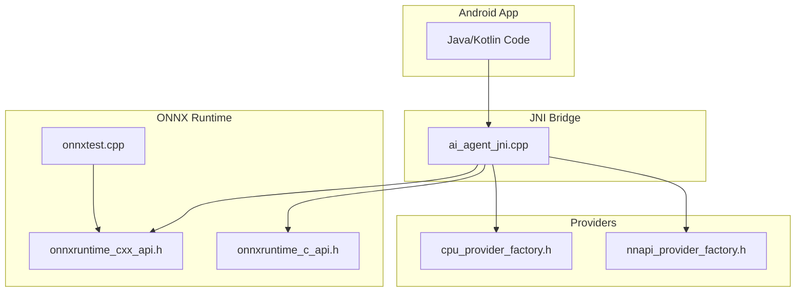
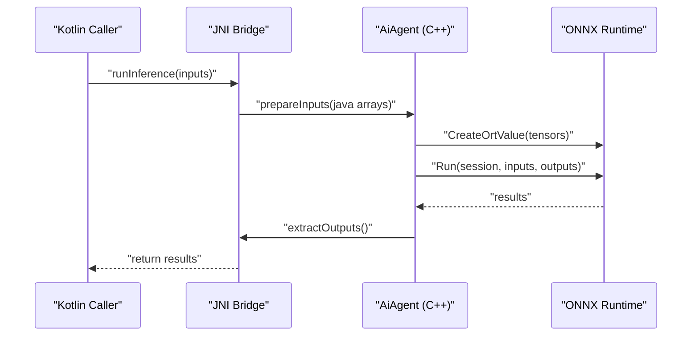
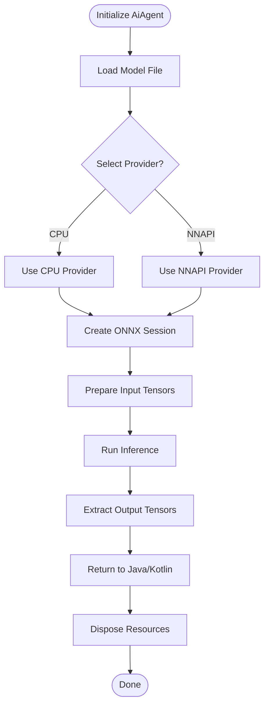
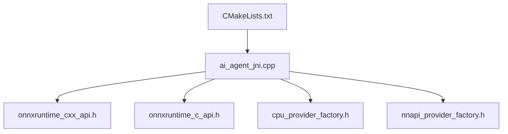

# JNI Bridge Layer

<cite>
**Referenced Files in This Document**
- [ai_agent_jni.cpp](file://catroid/src/main/cpp/ai_agent_jni.cpp)
- [onnxruntime_c_api.h](file://catroid/src/main/cpp/onnxruntime_c_api.h)
- [onnxruntime_cxx_api.h](file://catroid/src/main/cpp/onnxruntime_cxx_api.h)
- [cpu_provider_factory.h](file://catroid/src/main/cpp/cpu_provider_factory.h)
- [nnapi_provider_factory.h](file://catroid/src/main/cpp/nnapi_provider_factory.h)
- [onnxtest.cpp](file://catroid/src/main/cpp/onnxtest.cpp)
- [CMakeLists.txt](file://catroid/src/main/cpp/CMakeLists.txt)
</cite>

## Table of Contents
1. [Introduction](#introduction)
2. [Project Structure](#project-structure)
3. [Core Components](#core-components)
4. [Architecture Overview](#architecture-overview)
5. [Detailed Component Analysis](#detailed-component-analysis)
6. [Dependency Analysis](#dependency-analysis)
7. [Performance Considerations](#performance-considerations)
8. [Troubleshooting Guide](#troubleshooting-guide)
9. [Conclusion](#conclusion)

## Introduction
This document explains the JNI bridge layer that connects Java/Kotlin code to the native ONNX Runtime. It covers JNI function signatures, parameter marshaling between Java and C++, error handling mechanisms, and the AiAgent class interface for model inference. It also provides practical guidance on calling ONNX models from Kotlin, handling different data types (float arrays, integers, strings), managing asynchronous operations, thread safety considerations, exception propagation, and debugging techniques for JNI communication issues.

## Project Structure
The JNI bridge is implemented under the Android module’s native sources. Key locations:
- Native JNI entry points and AI agent implementation: catroid/src/main/cpp/ai_agent_jni.cpp
- ONNX Runtime headers and examples: catroid/src/main/cpp/onnxruntime_cxx_api.h, onnxruntime_c_api.h, onnxtest.cpp
- Provider factories for CPU and NNAPI: cpu_provider_factory.h, nnapi_provider_factory.h
- Build configuration for native components: catroid/src/main/cpp/CMakeLists.txt

**Diagram sources**
- [ai_agent_jni.cpp](file://catroid/src/main/cpp/ai_agent_jni.cpp)
- [onnxruntime_cxx_api.h](file://catroid/src/main/cpp/onnxruntime_cxx_api.h)
- [onnxruntime_c_api.h](file://catroid/src/main/cpp/onnxruntime_c_api.h)
- [cpu_provider_factory.h](file://catroid/src/main/cpp/cpu_provider_factory.h)
- [nnapi_provider_factory.h](file://catroid/src/main/cpp/nnapi_provider_factory.h)
- [onnxtest.cpp](file://catroid/src/main/cpp/onnxtest.cpp)

**Section sources**
- [ai_agent_jni.cpp](file://catroid/src/main/cpp/ai_agent_jni.cpp)
- [onnxruntime_cxx_api.h](file://catroid/src/main/cpp/onnxruntime_cxx_api.h)
- [onnxruntime_c_api.h](file://catroid/src/main/cpp/onnxruntime_c_api.h)
- [cpu_provider_factory.h](file://catroid/src/main/cpp/cpu_provider_factory.h)
- [nnapi_provider_factory.h](file://catroid/src/main/cpp/nnapi_provider_factory.h)
- [onnxtest.cpp](file://catroid/src/main/cpp/onnxtest.cpp)
- [CMakeLists.txt](file://catroid/src/main/cpp/CMakeLists.txt)

## Core Components
- JNI Entry Points: Functions declared with extern "C" and exported via JNI_OnLoad or per-method registration. These functions receive JNIEnv*, jclass/jobject, and primitive/array parameters from Java/Kotlin.
- AiAgent Class: A C++ class encapsulating ONNX Runtime session management, input/output tensor preparation, execution, and result extraction. Methods typically include initialization, run inference, and cleanup.
- Data Marshaling: Conversion between Java/Kotlin primitives and arrays and their C++ equivalents (e.g., float[], int[], String). For large tensors, direct access to Java arrays via GetFloatArrayElements/ReleaseFloatArrayElements avoids unnecessary copies.
- Error Handling: Errors are propagated back to Java/Kotlin by throwing exceptions through the JNI environment or returning status codes and error messages as strings.

Key responsibilities:
- Session lifecycle: load model, configure providers (CPU/NNAPI), create session
- Input preparation: build Ort::Value tensors from Java arrays
- Execution: run inference synchronously or schedule asynchronously
- Output processing: extract results into Java arrays or objects
- Resource management: release memory and sessions

**Section sources**
- [ai_agent_jni.cpp](file://catroid/src/main/cpp/ai_agent_jni.cpp)
- [onnxruntime_cxx_api.h](file://catroid/src/main/cpp/onnxruntime_cxx_api.h)
- [onnxruntime_c_api.h](file://catroid/src/main/cpp/onnxruntime_c_api.h)

## Architecture Overview
The architecture layers are:
- Java/Kotlin API: High-level methods to call inference, passing inputs and receiving outputs.
- JNI Bridge: Translates Java calls into C++ method invocations and marshals data.
- ONNX Runtime: Executes the model using selected providers (CPU/NNAPI).

**Diagram sources**
- [ai_agent_jni.cpp](file://catroid/src/main/cpp/ai_agent_jni.cpp)
- [onnxruntime_cxx_api.h](file://catroid/src/main/cpp/onnxruntime_cxx_api.h)
- [onnxruntime_c_api.h](file://catroid/src/main/cpp/onnxruntime_c_api.h)

## Detailed Component Analysis

### JNI Function Signatures and Parameter Marshaling
- Primitive types: jint, jfloat, jlong map directly to C++ int, float, pointers/handles.
- Arrays:
  - Float arrays: Use GetFloatArrayElements to obtain a pointer to Java array data; ReleaseFloatArrayElements to commit changes.
  - Integer arrays: Use GetIntArrayElements similarly.
  - Strings: Convert jstring to std::string via GetStringUTFChars and release after use.
- Return values:
  - Status codes: Return an integer indicating success/failure.
  - Error messages: Return a jstring containing details when errors occur.
  - Results: Populate pre-allocated Java arrays or return new arrays.

Marshaling best practices:
- Avoid copying large buffers; pass direct pointers where possible.
- Always check for null pointers and array lengths before accessing elements.
- Ensure consistent element ordering and shape metadata across JNI boundaries.

**Section sources**
- [ai_agent_jni.cpp](file://catroid/src/main/cpp/ai_agent_jni.cpp)
- [onnxruntime_cxx_api.h](file://catroid/src/main/cpp/onnxruntime_cxx_api.h)
- [onnxruntime_c_api.h](file://catroid/src/main/cpp/onnxruntime_c_api.h)

### AiAgent Class Interface and Inference Flow
Typical methods:
- initialize(modelPath, provider): Load model and configure runtime provider (CPU/NNAPI).
- setInput(name, data, shape): Prepare input tensor(s) with specified names and shapes.
- run(): Execute inference and collect outputs.
- getOutput(name): Retrieve output tensor(s) by name.
- dispose(): Clean up resources and release session.

Data flow:
- Inputs: Java arrays -> JNI -> Ort::Value tensors
- Execution: ONNX Runtime session run
- Outputs: Ort::Value tensors -> JNI -> Java arrays

**Diagram sources**
- [ai_agent_jni.cpp](file://catroid/src/main/cpp/ai_agent_jni.cpp)
- [cpu_provider_factory.h](file://catroid/src/main/cpp/cpu_provider_factory.h)
- [nnapi_provider_factory.h](file://catroid/src/main/cpp/nnapi_provider_factory.h)
- [onnxruntime_cxx_api.h](file://catroid/src/main/cpp/onnxruntime_cxx_api.h)

**Section sources**
- [ai_agent_jni.cpp](file://catroid/src/main/cpp/ai_agent_jni.cpp)
- [cpu_provider_factory.h](file://catroid/src/main/cpp/cpu_provider_factory.h)
- [nnapi_provider_factory.h](file://catroid/src/main/cpp/nnapi_provider_factory.h)
- [onnxruntime_cxx_api.h](file://catroid/src/main/cpp/onnxruntime_cxx_api.h)

### Practical Examples: Calling ONNX Models from Kotlin
- Loading the native library: Ensure the shared library is loaded once at app startup.
- Initializing AiAgent: Provide model path and desired provider.
- Preparing inputs:
  - Float arrays: Pass float[] with correct shape metadata.
  - Integer arrays: Pass int[] for tokenized inputs or indices.
  - Strings: Pass String for text-based inputs; ensure encoding compatibility.
- Running inference: Call the inference method and handle returned results.
- Processing outputs: Map returned arrays to application-specific structures.

Asynchronous operations:
- Offload inference to background threads to avoid blocking UI.
- Use callbacks or coroutines to deliver results back to the main thread.

Thread safety:
- Each AiAgent instance should be bound to a single thread unless explicitly designed for concurrency.
- Avoid sharing mutable state across threads without synchronization.

Exception propagation:
- Catch native errors in JNI and throw corresponding Java exceptions.
- Log detailed error context (model path, input shapes, provider) for diagnostics.

Debugging techniques:
- Enable verbose logging in ONNX Runtime via session options.
- Validate input shapes and dtypes before running inference.
- Use adb logcat to capture JNI logs and stack traces.

**Section sources**
- [ai_agent_jni.cpp](file://catroid/src/main/cpp/ai_agent_jni.cpp)
- [onnxtest.cpp](file://catroid/src/main/cpp/onnxtest.cpp)
- [onnxruntime_cxx_api.h](file://catroid/src/main/cpp/onnxruntime_cxx_api.h)

## Dependency Analysis
The JNI bridge depends on:
- ONNX Runtime C++ API for high-level session and tensor operations.
- ONNX Runtime C API for low-level control and provider configuration.
- Provider factories for CPU and NNAPI acceleration.
- Build system (CMake) to compile native code and link dependencies.

**Diagram sources**
- [ai_agent_jni.cpp](file://catroid/src/main/cpp/ai_agent_jni.cpp)
- [onnxruntime_cxx_api.h](file://catroid/src/main/cpp/onnxruntime_cxx_api.h)
- [onnxruntime_c_api.h](file://catroid/src/main/cpp/onnxruntime_c_api.h)
- [cpu_provider_factory.h](file://catroid/src/main/cpp/cpu_provider_factory.h)
- [nnapi_provider_factory.h](file://catroid/src/main/cpp/nnapi_provider_factory.h)
- [CMakeLists.txt](file://catroid/src/main/cpp/CMakeLists.txt)

**Section sources**
- [ai_agent_jni.cpp](file://catroid/src/main/cpp/ai_agent_jni.cpp)
- [CMakeLists.txt](file://catroid/src/main/cpp/CMakeLists.txt)

## Performance Considerations
- Minimize data copies: Use direct array access to avoid redundant allocations.
- Reuse sessions: Initialize once and reuse across multiple inference calls.
- Batch inputs: Combine multiple samples when supported by the model to improve throughput.
- Choose appropriate providers: NNAPI may offer better performance on supported devices; fallback to CPU otherwise.
- Monitor memory usage: Ensure timely disposal of tensors and sessions to prevent leaks.

[No sources needed since this section provides general guidance]

## Troubleshooting Guide
Common issues and resolutions:
- Model loading failures: Verify file paths and permissions; check model format compatibility.
- Shape mismatches: Ensure input shapes match model expectations; print shapes during debugging.
- Provider initialization errors: Confirm device capabilities for NNAPI; fall back to CPU if unsupported.
- JNI crashes: Check for null pointers, invalid array indices, and mismatched data types.
- Threading problems: Avoid concurrent access to the same AiAgent instance; isolate instances per thread.

Diagnostic steps:
- Enable ONNX Runtime logging and inspect logs for errors.
- Add assertions in JNI to validate parameters early.
- Use adb logcat filters to isolate JNI-related messages.
- Reproduce with minimal inputs to isolate issues.

**Section sources**
- [ai_agent_jni.cpp](file://catroid/src/main/cpp/ai_agent_jni.cpp)
- [onnxtest.cpp](file://catroid/src/main/cpp/onnxtest.cpp)

## Conclusion
The JNI bridge layer provides a robust interface for invoking ONNX Runtime models from Java/Kotlin. By carefully managing data marshaling, resource lifecycles, and threading, applications can achieve efficient and reliable inference. Following the guidelines in this document will help developers integrate ONNX models effectively while maintaining performance and stability.