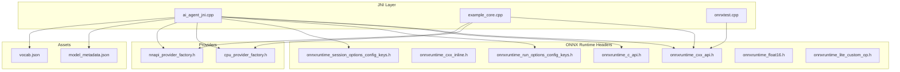
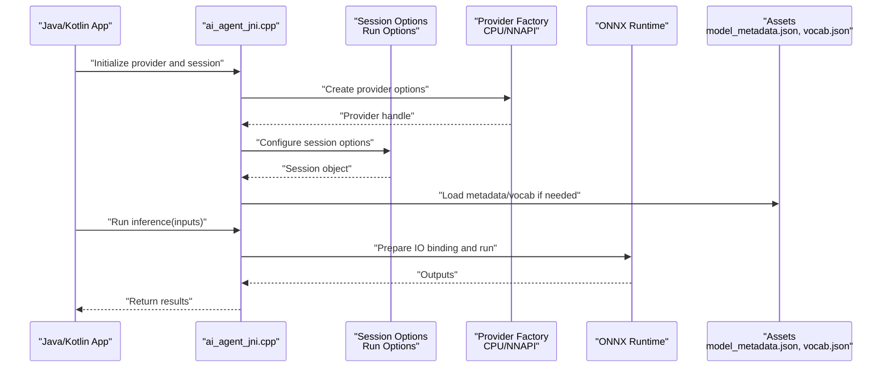
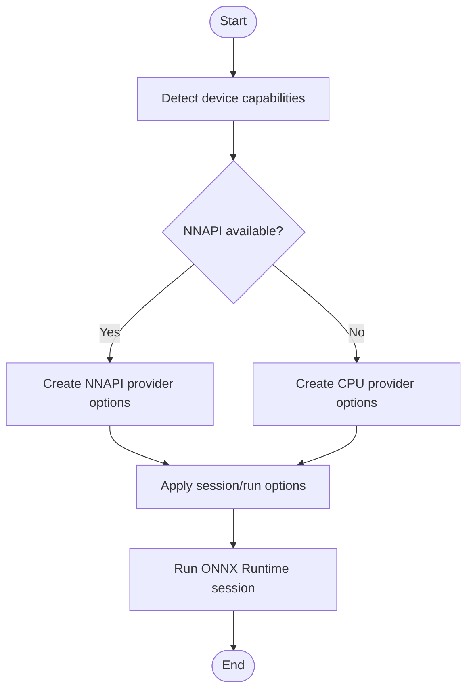
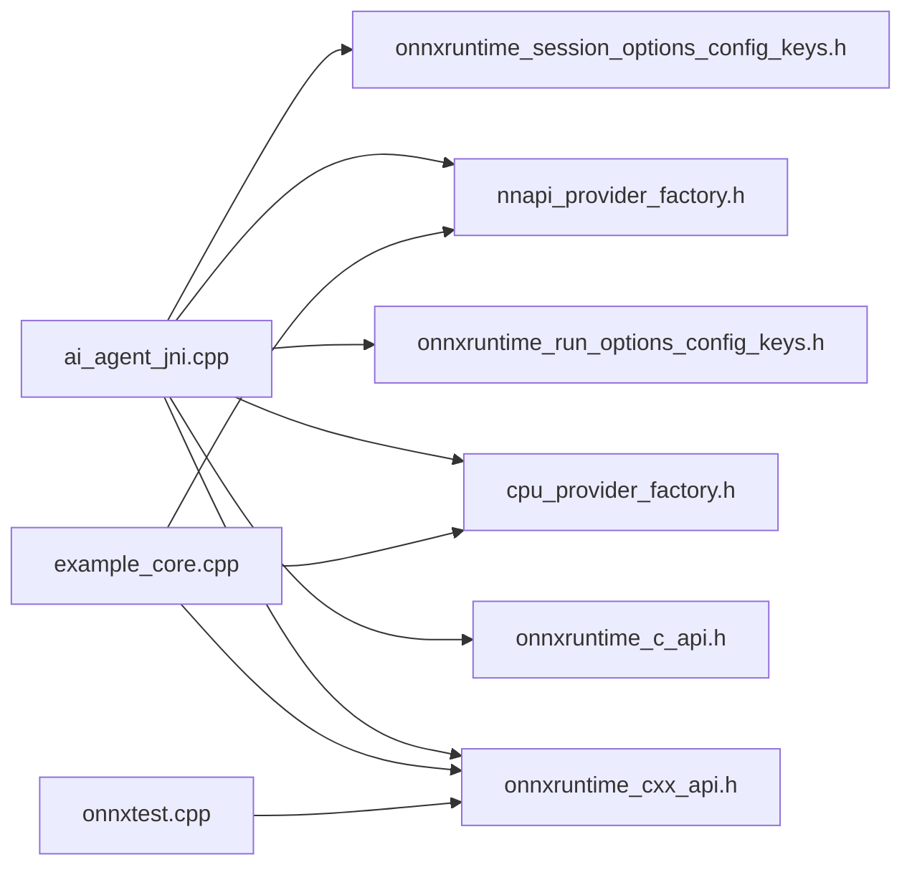

# Model Optimization Strategies

<cite>
**Referenced Files in This Document**
- [ai_agent_jni.cpp](file://catroid/src/main/cpp/ai_agent_jni.cpp)
- [cpu_provider_factory.h](file://catroid/src/main/cpp/cpu_provider_factory.h)
- [nnapi_provider_factory.h](file://catroid/src/main/cpp/nnapi_provider_factory.h)
- [onnxruntime_c_api.h](file://catroid/src/main/cpp/onnxruntime_c_api.h)
- [onnxruntime_cxx_api.h](file://catroid/src/main/cpp/onnxruntime_cxx_api.h)
- [onnxruntime_cxx_inline.h](file://catroid/src/main/cpp/onnxruntime_cxx_inline.h)
- [onnxruntime_float16.h](file://catroid/src/main/cpp/onnxruntime_float16.h)
- [onnxruntime_lite_custom_op.h](file://catroid/src/main/cpp/onnxruntime_lite_custom_op.h)
- [onnxruntime_run_options_config_keys.h](file://catroid/src/main/cpp/onnxruntime_run_options_config_keys.h)
- [onnxruntime_session_options_config_keys.h](file://catroid/src/main/cpp/onnxruntime_session_options_config_keys.h)
- [onnxtest.cpp](file://catroid/src/main/cpp/onnxtest.cpp)
- [example_core.cpp](file://catroid/src/main/cpp/example_core.cpp)
- [model_metadata.json](file://catroid/src/main/assets/model_metadata.json)
- [vocab.json](file://catroid/src/main/assets/vocab.json)
</cite>

## Table of Contents
1. [Introduction](#introduction)
2. [Project Structure](#project-structure)
3. [Core Components](#core-components)
4. [Architecture Overview](#architecture-overview)
5. [Detailed Component Analysis](#detailed-component-analysis)
6. [Dependency Analysis](#dependency-analysis)
7. [Performance Considerations](#performance-considerations)
8. [Troubleshooting Guide](#troubleshooting-guide)
9. [Conclusion](#conclusion)
10. [Appendices](#appendices)

## Introduction
This document explains ONNX model optimization strategies for NewCatroid with a focus on hardware acceleration (CPU and NNAPI), quantization, memory optimization, and practical guidance for Android devices. It synthesizes the existing C++ integration layer around ONNX Runtime, provider factories, session/run options, and assets used by AI features. The goal is to help developers configure providers, tune performance, reduce model size via quantization, manage memory efficiently, and evaluate trade-offs between accuracy and speed.

## Project Structure
NewCatroid integrates ONNX Runtime through a small C++ layer exposed to Java/Kotlin via JNI. Key areas:
- ONNX Runtime headers and inline utilities under catroid/src/main/cpp
- Provider factory headers for CPU and NNAPI
- JNI entry points and example/test code
- Assets containing model metadata and vocabulary files

**Diagram sources**
- [ai_agent_jni.cpp](file://catroid/src/main/cpp/ai_agent_jni.cpp)
- [example_core.cpp](file://catroid/src/main/cpp/example_core.cpp)
- [onnxtest.cpp](file://catroid/src/main/cpp/onnxtest.cpp)
- [onnxruntime_cxx_api.h](file://catroid/src/main/cpp/onnxruntime_cxx_api.h)
- [onnxruntime_cxx_inline.h](file://catroid/src/main/cpp/onnxruntime_cxx_inline.h)
- [onnxruntime_c_api.h](file://catroid/src/main/cpp/onnxruntime_c_api.h)
- [onnxruntime_run_options_config_keys.h](file://catroid/src/main/cpp/onnxruntime_run_options_config_keys.h)
- [onnxruntime_session_options_config_keys.h](file://catroid/src/main/cpp/onnxruntime_session_options_config_keys.h)
- [onnxruntime_float16.h](file://catroid/src/main/cpp/onnxruntime_float16.h)
- [onnxruntime_lite_custom_op.h](file://catroid/src/main/cpp/onnxruntime_lite_custom_op.h)
- [cpu_provider_factory.h](file://catroid/src/main/cpp/cpu_provider_factory.h)
- [nnapi_provider_factory.h](file://catroid/src/main/cpp/nnapi_provider_factory.h)
- [model_metadata.json](file://catroid/src/main/assets/model_metadata.json)
- [vocab.json](file://catroid/src/main/assets/vocab.json)

**Section sources**
- [ai_agent_jni.cpp](file://catroid/src/main/cpp/ai_agent_jni.cpp)
- [example_core.cpp](file://catroid/src/main/cpp/example_core.cpp)
- [onnxtest.cpp](file://catroid/src/main/cpp/onnxtest.cpp)
- [onnxruntime_cxx_api.h](file://catroid/src/main/cpp/onnxruntime_cxx_api.h)
- [onnxruntime_c_api.h](file://catroid/src/main/cpp/onnxruntime_c_api.h)
- [onnxruntime_run_options_config_keys.h](file://catroid/src/main/cpp/onnxruntime_run_options_config_keys.h)
- [onnxruntime_session_options_config_keys.h](file://catroid/src/main/cpp/onnxruntime_session_options_config_keys.h)
- [onnxruntime_float16.h](file://catroid/src/main/cpp/onnxruntime_float16.h)
- [onnxruntime_lite_custom_op.h](file://catroid/src/main/cpp/onnxruntime_lite_custom_op.h)
- [cpu_provider_factory.h](file://catroid/src/main/cpp/cpu_provider_factory.h)
- [nnapi_provider_factory.h](file://catroid/src/main/cpp/nnapi_provider_factory.h)
- [model_metadata.json](file://catroid/src/main/assets/model_metadata.json)
- [vocab.json](file://catroid/src/main/assets/vocab.json)

## Core Components
- JNI bridge: Provides native entry points for ONNX Runtime usage from Java/Kotlin.
- Provider factories: Encapsulate configuration for CPU and NNAPI execution providers.
- Session and run options: Control graph optimization, execution mode, and runtime behavior.
- Data types and helpers: Float16 support and custom op registration utilities.
- Example/test harnesses: Demonstrate session creation, input/output handling, and inference calls.
- Assets: Model metadata and vocabularies consumed at runtime.

Key responsibilities:
- Initialize providers based on device capabilities.
- Build and optimize ONNX Runtime sessions.
- Manage inputs/outputs and memory buffers.
- Provide hooks for profiling and diagnostics.

**Section sources**
- [ai_agent_jni.cpp](file://catroid/src/main/cpp/ai_agent_jni.cpp)
- [cpu_provider_factory.h](file://catroid/src/main/cpp/cpu_provider_factory.h)
- [nnapi_provider_factory.h](file://catroid/src/main/cpp/nnapi_provider_factory.h)
- [onnxruntime_session_options_config_keys.h](file://catroid/src/main/cpp/onnxruntime_session_options_config_keys.h)
- [onnxruntime_run_options_config_keys.h](file://catroid/src/main/cpp/onnxruntime_run_options_config_keys.h)
- [onnxruntime_float16.h](file://catroid/src/main/cpp/onnxruntime_float16.h)
- [onnxruntime_lite_custom_op.h](file://catroid/src/main/cpp/onnxruntime_lite_custom_op.h)
- [example_core.cpp](file://catroid/src/main/cpp/example_core.cpp)
- [onnxtest.cpp](file://catroid/src/main/cpp/onnxtest.cpp)
- [model_metadata.json](file://catroid/src/main/assets/model_metadata.json)
- [vocab.json](file://catroid/src/main/assets/vocab.json)

## Architecture Overview
The runtime architecture centers on a thin JNI layer that configures ONNX Runtime sessions using provider-specific factories and options. Inference flows from Java/Kotlin into native code, which prepares tensors, runs the model, and returns results.

**Diagram sources**
- [ai_agent_jni.cpp](file://catroid/src/main/cpp/ai_agent_jni.cpp)
- [onnxruntime_session_options_config_keys.h](file://catroid/src/main/cpp/onnxruntime_session_options_config_keys.h)
- [onnxruntime_run_options_config_keys.h](file://catroid/src/main/cpp/onnxruntime_run_options_config_keys.h)
- [cpu_provider_factory.h](file://catroid/src/main/cpp/cpu_provider_factory.h)
- [nnapi_provider_factory.h](file://catroid/src/main/cpp/nnapi_provider_factory.h)
- [model_metadata.json](file://catroid/src/main/assets/model_metadata.json)
- [vocab.json](file://catroid/src/main/assets/vocab.json)

## Detailed Component Analysis

### Hardware Acceleration Setup (CPU and NNAPI)
- Provider selection: Use provider factories to create execution provider configurations. Prefer NNAPI when available; fall back to CPU otherwise.
- Configuration keys: Leverage session and run option keys to control graph optimizations, inter/intra thread parallelism, and execution modes.
- Device capability detection: At runtime, probe device features (e.g., NNAPI availability) and choose the best provider.

Practical steps:
- Create provider options via the CPU and NNAPI factory headers.
- Apply session options to enable graph-level optimizations and threading.
- Apply run options to control execution behavior per inference call.

**Diagram sources**
- [cpu_provider_factory.h](file://catroid/src/main/cpp/cpu_provider_factory.h)
- [nnapi_provider_factory.h](file://catroid/src/main/cpp/nnapi_provider_factory.h)
- [onnxruntime_session_options_config_keys.h](file://catroid/src/main/cpp/onnxruntime_session_options_config_keys.h)
- [onnxruntime_run_options_config_keys.h](file://catroid/src/main/cpp/onnxruntime_run_options_config_keys.h)

**Section sources**
- [cpu_provider_factory.h](file://catroid/src/main/cpp/cpu_provider_factory.h)
- [nnapi_provider_factory.h](file://catroid/src/main/cpp/nnapi_provider_factory.h)
- [onnxruntime_session_options_config_keys.h](file://catroid/src/main/cpp/onnxruntime_session_options_config_keys.h)
- [onnxruntime_run_options_config_keys.h](file://catroid/src/main/cpp/onnxruntime_run_options_config_keys.h)

### Quantization Techniques
- Mixed precision: Utilize float16 support where available to reduce memory bandwidth and improve throughput on supported accelerators.
- Post-training quantization: Convert models to integer formats before deployment to reduce size and accelerate inference on NNAPI/CPU backends.
- Calibration: Ensure representative calibration datasets to preserve accuracy after quantization.

Implementation pointers:
- Use float16 utilities for data type conversions and tensor preparation.
- Validate quantized models with the same test harness used for FP32 models.

**Section sources**
- [onnxruntime_float16.h](file://catroid/src/main/cpp/onnxruntime_float16.h)

### Memory Optimization Strategies
- Model partitioning: Split large graphs into smaller subgraphs or multiple models to reduce peak memory and enable selective loading.
- Lazy loading: Defer loading heavy assets (models, vocabularies) until first use to reduce startup memory footprint.
- Cache management: Reuse IO bindings and pre-allocated buffers across inferences to avoid repeated allocations.

Operational guidance:
- Pre-allocate input/output buffers and reuse them across calls.
- Clear caches when switching models or contexts.
- Monitor memory pressure and unload unused resources.

**Section sources**
- [ai_agent_jni.cpp](file://catroid/src/main/cpp/ai_agent_jni.cpp)
- [example_core.cpp](file://catroid/src/main/cpp/example_core.cpp)
- [model_metadata.json](file://catroid/src/main/assets/model_metadata.json)
- [vocab.json](file://catroid/src/main/assets/vocab.json)

### Practical Examples for Android Devices
- High-end devices: Prefer NNAPI with dynamic shapes and mixed precision; enable aggressive graph optimizations.
- Mid-range devices: Use NNAPI with static shapes and reduced parallelism; consider int8 quantization.
- Low-end devices: Fall back to CPU with minimal threading; prefer quantized models and smaller input sizes.

Validation approach:
- Benchmark latency and memory across device tiers.
- Compare accuracy metrics between FP32 and quantized variants.

[No sources needed since this section provides general guidance]

### Monitoring Inference Performance
- Profiling hooks: Use run options and session options to enable profiling and gather timing information.
- Metrics collection: Record per-inference latency, memory usage, and provider utilization.
- Regression checks: Integrate automated benchmarks into CI to detect regressions.

**Section sources**
- [onnxruntime_run_options_config_keys.h](file://catroid/src/main/cpp/onnxruntime_run_options_config_keys.h)
- [onnxruntime_session_options_config_keys.h](file://catroid/src/main/cpp/onnxruntime_session_options_config_keys.h)

### Profiling Memory Usage
- Buffer reuse: Avoid frequent allocations by reusing IO bindings and tensors.
- Allocation tracking: Log allocation sizes and lifetimes during development builds.
- Leak prevention: Ensure proper cleanup of session objects and buffers.

**Section sources**
- [example_core.cpp](file://catroid/src/main/cpp/example_core.cpp)
- [onnxtest.cpp](file://catroid/src/main/cpp/onnxtest.cpp)

### Trade-offs Between Accuracy and Performance
- Quantization vs accuracy: Evaluate accuracy drop after quantization; adjust calibration or model structure if necessary.
- Graph optimizations vs compatibility: Some optimizations may not be supported on all devices; provide fallbacks.
- Precision vs speed: Float16 can improve speed but may reduce numerical stability; validate thoroughly.

[No sources needed since this section provides general guidance]

### Model Versioning Strategies
- Metadata-driven versioning: Store model versions and hashes in metadata to ensure consistent deployments.
- Rollback plan: Keep previous model artifacts accessible for quick rollback.
- Compatibility matrix: Track provider and runtime versions against model artifacts.

**Section sources**
- [model_metadata.json](file://catroid/src/main/assets/model_metadata.json)

### A/B Testing Frameworks for Optimized vs Original Models
- Feature flags: Toggle between original and optimized models at runtime.
- Experiment routing: Direct users to different model variants and collect metrics.
- Evaluation pipeline: Measure latency, memory, and accuracy for each variant.

[No sources needed since this section provides general guidance]

## Dependency Analysis
The JNI layer depends on ONNX Runtime headers and provider factories. Example/test code demonstrates typical usage patterns.

**Diagram sources**
- [ai_agent_jni.cpp](file://catroid/src/main/cpp/ai_agent_jni.cpp)
- [example_core.cpp](file://catroid/src/main/cpp/example_core.cpp)
- [onnxtest.cpp](file://catroid/src/main/cpp/onnxtest.cpp)
- [onnxruntime_cxx_api.h](file://catroid/src/main/cpp/onnxruntime_cxx_api.h)
- [onnxruntime_c_api.h](file://catroid/src/main/cpp/onnxruntime_c_api.h)
- [onnxruntime_run_options_config_keys.h](file://catroid/src/main/cpp/onnxruntime_run_options_config_keys.h)
- [onnxruntime_session_options_config_keys.h](file://catroid/src/main/cpp/onnxruntime_session_options_config_keys.h)
- [cpu_provider_factory.h](file://catroid/src/main/cpp/cpu_provider_factory.h)
- [nnapi_provider_factory.h](file://catroid/src/main/cpp/nnapi_provider_factory.h)

**Section sources**
- [ai_agent_jni.cpp](file://catroid/src/main/cpp/ai_agent_jni.cpp)
- [example_core.cpp](file://catroid/src/main/cpp/example_core.cpp)
- [onnxtest.cpp](file://catroid/src/main/cpp/onnxtest.cpp)
- [onnxruntime_cxx_api.h](file://catroid/src/main/cpp/onnxruntime_cxx_api.h)
- [onnxruntime_c_api.h](file://catroid/src/main/cpp/onnxruntime_c_api.h)
- [onnxruntime_run_options_config_keys.h](file://catroid/src/main/cpp/onnxruntime_run_options_config_keys.h)
- [onnxruntime_session_options_config_keys.h](file://catroid/src/main/cpp/onnxruntime_session_options_config_keys.h)
- [cpu_provider_factory.h](file://catroid/src/main/cpp/cpu_provider_factory.h)
- [nnapi_provider_factory.h](file://catroid/src/main/cpp/nnapi_provider_factory.h)

## Performance Considerations
- Choose the right provider: NNAPI for supported accelerators; CPU fallback for broad compatibility.
- Optimize graph and threads: Enable appropriate session and run options for your target devices.
- Reduce memory pressure: Reuse buffers, avoid unnecessary copies, and manage cache lifecycle.
- Quantize strategically: Balance model size and speed with acceptable accuracy loss.
- Profile continuously: Automate benchmarking to catch regressions early.

[No sources needed since this section provides general guidance]

## Troubleshooting Guide
Common issues and remedies:
- Provider initialization failures: Verify device capabilities and provider availability; log detailed errors.
- Out-of-memory errors: Reduce batch size, switch to quantized models, and reuse buffers.
- Incorrect outputs: Validate input shapes and data types; ensure correct normalization and preprocessing.
- Slow inference: Check provider selection, disable incompatible optimizations, and tune threading.

Diagnostic aids:
- Use example/test harnesses to reproduce issues with minimal dependencies.
- Collect logs around session creation, provider setup, and inference calls.

**Section sources**
- [example_core.cpp](file://catroid/src/main/cpp/example_core.cpp)
- [onnxtest.cpp](file://catroid/src/main/cpp/onnxtest.cpp)

## Conclusion
By leveraging ONNX Runtime’s provider ecosystem, session/run options, and quantization tools, NewCatroid can deliver efficient and accurate AI inference across diverse Android devices. Adopting robust memory practices, continuous profiling, and structured versioning ensures reliable performance and maintainability over time.

[No sources needed since this section summarizes without analyzing specific files]

## Appendices

### Appendix A: Key Headers and Their Roles
- onnxruntime_cxx_api.h: C++ API for session, IO binding, and execution.
- onnxruntime_c_api.h: C API surface for low-level operations.
- onnxruntime_session_options_config_keys.h: Keys for configuring session behavior.
- onnxruntime_run_options_config_keys.h: Keys for controlling per-run behavior.
- cpu_provider_factory.h / nnapi_provider_factory.h: Provider configuration interfaces.
- onnxruntime_float16.h: Utilities for float16 data handling.
- onnxruntime_lite_custom_op.h: Custom operator registration utilities.

**Section sources**
- [onnxruntime_cxx_api.h](file://catroid/src/main/cpp/onnxruntime_cxx_api.h)
- [onnxruntime_c_api.h](file://catroid/src/main/cpp/onnxruntime_c_api.h)
- [onnxruntime_session_options_config_keys.h](file://catroid/src/main/cpp/onnxruntime_session_options_config_keys.h)
- [onnxruntime_run_options_config_keys.h](file://catroid/src/main/cpp/onnxruntime_run_options_config_keys.h)
- [cpu_provider_factory.h](file://catroid/src/main/cpp/cpu_provider_factory.h)
- [nnapi_provider_factory.h](file://catroid/src/main/cpp/nnapi_provider_factory.h)
- [onnxruntime_float16.h](file://catroid/src/main/cpp/onnxruntime_float16.h)
- [onnxruntime_lite_custom_op.h](file://catroid/src/main/cpp/onnxruntime_lite_custom_op.h)