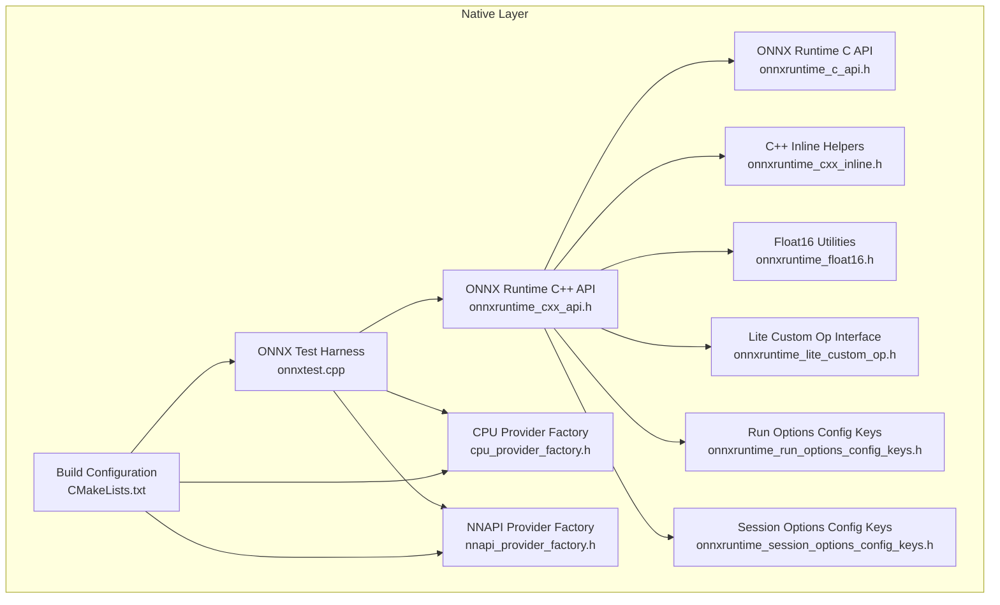
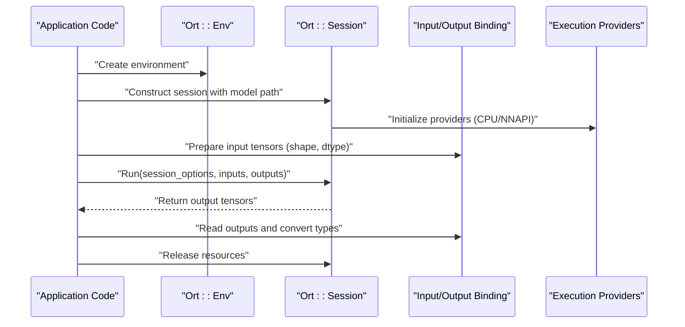
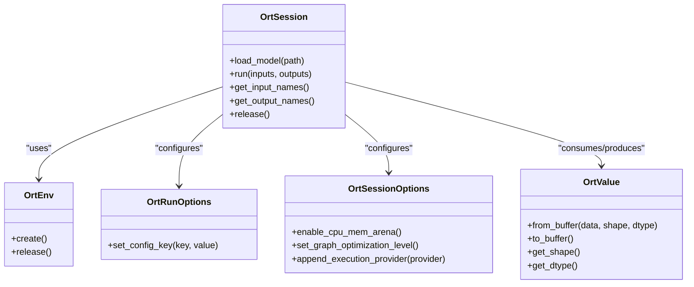
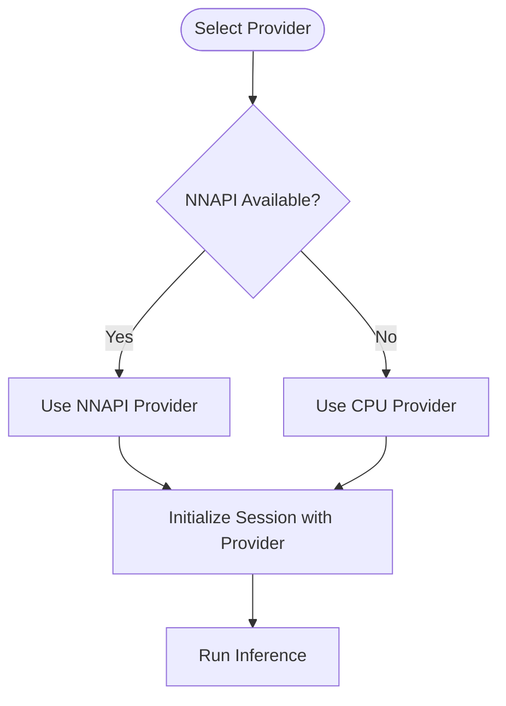
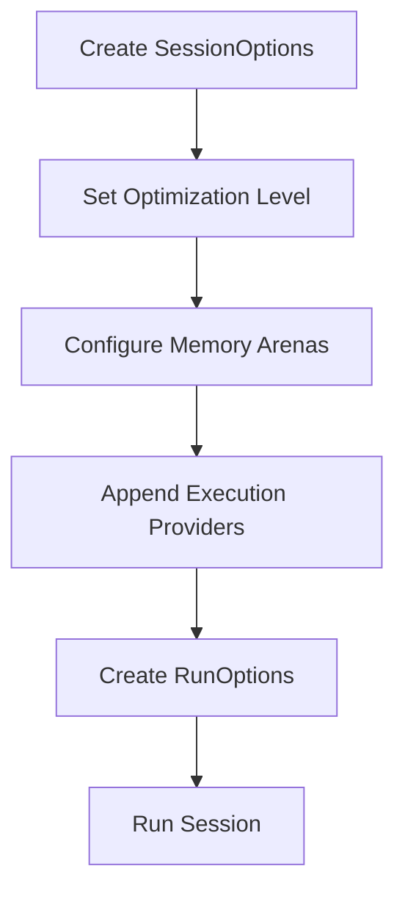
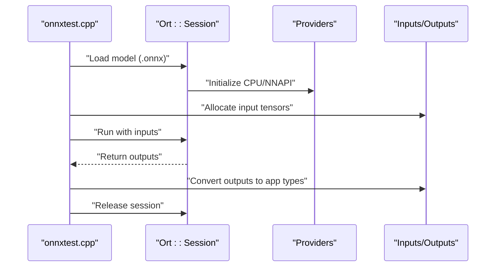
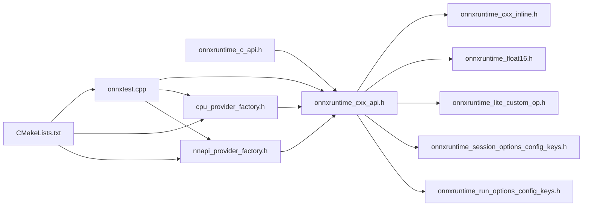

# Native ONNX Integration

<cite>
**Referenced Files in This Document**
- [catroid/src/main/cpp/onnxruntime_c_api.h](file://catroid/src/main/cpp/onnxruntime_c_api.h)
- [catroid/src/main/cpp/onnxruntime_cxx_api.h](file://catroid/src/main/cpp/onnxruntime_cxx_api.h)
- [catroid/src/main/cpp/onnxruntime_cxx_inline.h](file://catroid/src/main/cpp/onnxruntime_cxx_inline.h)
- [catroid/src/main/cpp/onnxruntime_float16.h](file://catroid/src/main/cpp/onnxruntime_float16.h)
- [catroid/src/main/cpp/onnxruntime_lite_custom_op.h](file://catroid/src/main/cpp/onnxruntime_lite_custom_op.h)
- [catroid/src/main/cpp/onnxruntime_run_options_config_keys.h](file://catroid/src/main/cpp/onnxruntime_run_options_config_keys.h)
- [catroid/src/main/cpp/onnxruntime_session_options_config_keys.h](file://catroid/src/main/cpp/onnxruntime_session_options_config_keys.h)
- [catroid/src/main/cpp/cpu_provider_factory.h](file://catroid/src/main/cpp/cpu_provider_factory.h)
- [catroid/src/main/cpp/nnapi_provider_factory.h](file://catroid/src/main/cpp/nnapi_provider_factory.h)
- [catroid/src/main/cpp/onnxtest.cpp](file://catroid/src/main/cpp/onnxtest.cpp)
- [catroid/src/main/cpp/CMakeLists.txt](file://catroid/src/main/cpp/CMakeLists.txt)
</cite>

## Table of Contents
1. [Introduction](#introduction)
2. [Project Structure](#project-structure)
3. [Core Components](#core-components)
4. [Architecture Overview](#architecture-overview)
5. [Detailed Component Analysis](#detailed-component-analysis)
6. [Dependency Analysis](#dependency-analysis)
7. [Performance Considerations](#performance-considerations)
8. [Troubleshooting Guide](#troubleshooting-guide)
9. [Conclusion](#conclusion)
10. [Appendices](#appendices)

## Introduction
This document explains the native ONNX Runtime integration in NewCatroid, focusing on how models are loaded, sessions are created and executed, and how custom operators and execution providers (CPU and NNAPI) are wired into the runtime. It also covers memory management strategies for large models, tensor allocation patterns, resource cleanup procedures, practical usage examples for loading .onnx files, configuring execution providers, handling inputs/outputs with proper data type conversions, and performance optimization techniques such as quantization, operator fusion, and hardware-specific optimizations.

## Project Structure
The ONNX integration is implemented under the Android module’s native layer:
- C++ headers and wrappers for ONNX Runtime APIs
- Provider factory headers for CPU and NNAPI acceleration
- A sample test harness to exercise model loading and inference
- Build configuration that ties everything together

**Diagram sources**
- [catroid/src/main/cpp/onnxruntime_c_api.h](file://catroid/src/main/cpp/onnxruntime_c_api.h)
- [catroid/src/main/cpp/onnxruntime_cxx_api.h](file://catroid/src/main/cpp/onnxruntime_cxx_api.h)
- [catroid/src/main/cpp/onnxruntime_cxx_inline.h](file://catroid/src/main/cpp/onnxruntime_cxx_inline.h)
- [catroid/src/main/cpp/onnxruntime_float16.h](file://catroid/src/main/cpp/onnxruntime_float16.h)
- [catroid/src/main/cpp/onnxruntime_lite_custom_op.h](file://catroid/src/main/cpp/onnxruntime_lite_custom_op.h)
- [catroid/src/main/cpp/onnxruntime_run_options_config_keys.h](file://catroid/src/main/cpp/onnxruntime_run_options_config_keys.h)
- [catroid/src/main/cpp/onnxruntime_session_options_config_keys.h](file://catroid/src/main/cpp/onnxruntime_session_options_config_keys.h)
- [catroid/src/main/cpp/cpu_provider_factory.h](file://catroid/src/main/cpp/cpu_provider_factory.h)
- [catroid/src/main/cpp/nnapi_provider_factory.h](file://catroid/src/main/cpp/nnapi_provider_factory.h)
- [catroid/src/main/cpp/onnxtest.cpp](file://catroid/src/main/cpp/onnxtest.cpp)
- [catroid/src/main/cpp/CMakeLists.txt](file://catroid/src/main/cpp/CMakeLists.txt)

**Section sources**
- [catroid/src/main/cpp/CMakeLists.txt](file://catroid/src/main/cpp/CMakeLists.txt)

## Core Components
- ONNX Runtime C/C++ API bindings: Provide the core interfaces for session creation, input/output binding, and execution.
- Float16 utilities: Support half-precision types used by many modern models.
- Lite custom operator interface: Enables registering custom ops required by some models.
- Execution provider factories: Configure CPU and NNAPI backends for accelerated inference.
- Session/run options keys: Control graph optimization, memory arena sizing, and runtime behavior.
- Test harness: Demonstrates end-to-end usage including model loading, session setup, and inference.

Key responsibilities:
- Model loading from .onnx files
- Session initialization with selected providers
- Input tensor preparation with correct shapes and data types
- Inference execution and output retrieval
- Resource cleanup and error propagation

**Section sources**
- [catroid/src/main/cpp/onnxruntime_cxx_api.h](file://catroid/src/main/cpp/onnxruntime_cxx_api.h)
- [catroid/src/main/cpp/onnxruntime_cxx_inline.h](file://catroid/src/main/cpp/onnxruntime_cxx_inline.h)
- [catroid/src/main/cpp/onnxruntime_float16.h](file://catroid/src/main/cpp/onnxruntime_float16.h)
- [catroid/src/main/cpp/onnxruntime_lite_custom_op.h](file://catroid/src/main/cpp/onnxruntime_lite_custom_op.h)
- [catroid/src/main/cpp/onnxruntime_run_options_config_keys.h](file://catroid/src/main/cpp/onnxruntime_run_options_config_keys.h)
- [catroid/src/main/cpp/onnxruntime_session_options_config_keys.h](file://catroid/src/main/cpp/onnxruntime_session_options_config_keys.h)
- [catroid/src/main/cpp/cpu_provider_factory.h](file://catroid/src/main/cpp/cpu_provider_factory.h)
- [catroid/src/main/cpp/nnapi_provider_factory.h](file://catroid/src/main/cpp/nnapi_provider_factory.h)
- [catroid/src/main/cpp/onnxtest.cpp](file://catroid/src/main/cpp/onnxtest.cpp)

## Architecture Overview
The runtime architecture centers around a single inference pipeline:
- Application code loads an .onnx file into an Ort::Session
- Inputs are prepared as Ort::Value tensors with matching shapes and dtypes
- The session runs with configured providers (CPU, NNAPI)
- Outputs are read back and converted to application types

**Diagram sources**
- [catroid/src/main/cpp/onnxtest.cpp](file://catroid/src/main/cpp/onnxtest.cpp)
- [catroid/src/main/cpp/onnxruntime_cxx_api.h](file://catroid/src/main/cpp/onnxruntime_cxx_api.h)
- [catroid/src/main/cpp/cpu_provider_factory.h](file://catroid/src/main/cpp/cpu_provider_factory.h)
- [catroid/src/main/cpp/nnapi_provider_factory.h](file://catroid/src/main/cpp/nnapi_provider_factory.h)

## Detailed Component Analysis

### ONNX Runtime C/C++ API Bindings
- Purpose: Encapsulate low-level C API calls into RAII-style C++ classes for safer resource management.
- Key capabilities:
  - Environment and session lifecycle
  - Tensor creation and binding
  - Run options and session options
  - Error handling via exceptions or status codes

**Diagram sources**
- [catroid/src/main/cpp/onnxruntime_cxx_api.h](file://catroid/src/main/cpp/onnxruntime_cxx_api.h)
- [catroid/src/main/cpp/onnxruntime_cxx_inline.h](file://catroid/src/main/cpp/onnxruntime_cxx_inline.h)

**Section sources**
- [catroid/src/main/cpp/onnxruntime_cxx_api.h](file://catroid/src/main/cpp/onnxruntime_cxx_api.h)
- [catroid/src/main/cpp/onnxruntime_cxx_inline.h](file://catroid/src/main/cpp/onnxruntime_cxx_inline.h)

### Float16 Utilities
- Purpose: Provide helpers for half-precision data conversion and storage, commonly used in quantized or mixed-precision models.
- Typical usage: Convert between float32 buffers and float16 buffers before feeding inputs or after reading outputs.

**Section sources**
- [catroid/src/main/cpp/onnxruntime_float16.h](file://catroid/src/main/cpp/onnxruntime_float16.h)

### Lite Custom Operator Interface
- Purpose: Allow registration of custom operators required by certain models not covered by built-in ops.
- Responsibilities:
  - Define op schema and kernel implementations
  - Register kernels with the runtime during session initialization

**Section sources**
- [catroid/src/main/cpp/onnxruntime_lite_custom_op.h](file://catroid/src/main/cpp/onnxruntime_lite_custom_op.h)

### Execution Provider Factories (CPU and NNAPI)
- Purpose: Enable hardware-accelerated execution paths.
- CPU provider: General-purpose fallback optimized for ARM/x86 CPUs.
- NNAPI provider: Leverages Android Neural Networks API for GPU/NPU acceleration when available.

**Diagram sources**
- [catroid/src/main/cpp/cpu_provider_factory.h](file://catroid/src/main/cpp/cpu_provider_factory.h)
- [catroid/src/main/cpp/nnapi_provider_factory.h](file://catroid/src/main/cpp/nnapi_provider_factory.h)

**Section sources**
- [catroid/src/main/cpp/cpu_provider_factory.h](file://catroid/src/main/cpp/cpu_provider_factory.h)
- [catroid/src/main/cpp/nnapi_provider_factory.h](file://catroid/src/main/cpp/nnapi_provider_factory.h)

### Session and Run Options
- Purpose: Tune runtime behavior for performance and memory usage.
- Common keys:
  - Graph optimization level
  - Memory arena sizing
  - Execution provider settings
  - Logging verbosity

**Diagram sources**
- [catroid/src/main/cpp/onnxruntime_session_options_config_keys.h](file://catroid/src/main/cpp/onnxruntime_session_options_config_keys.h)
- [catroid/src/main/cpp/onnxruntime_run_options_config_keys.h](file://catroid/src/main/cpp/onnxruntime_run_options_config_keys.h)

**Section sources**
- [catroid/src/main/cpp/onnxruntime_session_options_config_keys.h](file://catroid/src/main/cpp/onnxruntime_session_options_config_keys.h)
- [catroid/src/main/cpp/onnxruntime_run_options_config_keys.h](file://catroid/src/main/cpp/onnxruntime_run_options_config_keys.h)

### End-to-End Inference Flow (Test Harness)
- Demonstrates:
  - Loading an .onnx model
  - Creating a session with providers
  - Preparing inputs with correct shapes and dtypes
  - Running inference and retrieving outputs
  - Cleaning up resources

**Diagram sources**
- [catroid/src/main/cpp/onnxtest.cpp](file://catroid/src/main/cpp/onnxtest.cpp)
- [catroid/src/main/cpp/onnxruntime_cxx_api.h](file://catroid/src/main/cpp/onnxruntime_cxx_api.h)

**Section sources**
- [catroid/src/main/cpp/onnxtest.cpp](file://catroid/src/main/cpp/onnxtest.cpp)

## Dependency Analysis
The native build wires the ONNX Runtime components together:
- Headers define interfaces and configuration keys
- Provider factories enable hardware acceleration
- The test harness exercises the full stack
- CMake config ensures all pieces are compiled and linked

**Diagram sources**
- [catroid/src/main/cpp/onnxruntime_c_api.h](file://catroid/src/main/cpp/onnxruntime_c_api.h)
- [catroid/src/main/cpp/onnxruntime_cxx_api.h](file://catroid/src/main/cpp/onnxruntime_cxx_api.h)
- [catroid/src/main/cpp/onnxruntime_cxx_inline.h](file://catroid/src/main/cpp/onnxruntime_cxx_inline.h)
- [catroid/src/main/cpp/onnxruntime_float16.h](file://catroid/src/main/cpp/onnxruntime_float16.h)
- [catroid/src/main/cpp/onnxruntime_lite_custom_op.h](file://catroid/src/main/cpp/onnxruntime_lite_custom_op.h)
- [catroid/src/main/cpp/onnxruntime_session_options_config_keys.h](file://catroid/src/main/cpp/onnxruntime_session_options_config_keys.h)
- [catroid/src/main/cpp/onnxruntime_run_options_config_keys.h](file://catroid/src/main/cpp/onnxruntime_run_options_config_keys.h)
- [catroid/src/main/cpp/cpu_provider_factory.h](file://catroid/src/main/cpp/cpu_provider_factory.h)
- [catroid/src/main/cpp/nnapi_provider_factory.h](file://catroid/src/main/cpp/nnapi_provider_factory.h)
- [catroid/src/main/cpp/onnxtest.cpp](file://catroid/src/main/cpp/onnxtest.cpp)
- [catroid/src/main/cpp/CMakeLists.txt](file://catroid/src/main/cpp/CMakeLists.txt)

**Section sources**
- [catroid/src/main/cpp/CMakeLists.txt](file://catroid/src/main/cpp/CMakeLists.txt)

## Performance Considerations
- Quantization: Prefer INT8 or FP16 models where supported to reduce memory bandwidth and improve throughput.
- Operator fusion: Ensure graph optimizations are enabled so compatible ops are fused at load time.
- Hardware-specific tuning:
  - NNAPI: Enable NNAPI provider for devices with capable accelerators; fall back to CPU otherwise.
  - CPU: Adjust memory arenas and thread pools if needed via session options.
- Memory management:
  - Reuse input/output buffers across frames to avoid allocations.
  - Use arena-based memory for large intermediate tensors.
- Data layout:
  - Match expected NHWC/NCHW layouts to minimize copies.
  - Avoid unnecessary type conversions; use FP16 directly when possible.

[No sources needed since this section provides general guidance]

## Troubleshooting Guide
Common issues and resolutions:
- Model loading failures:
  - Verify .onnx file integrity and compatibility with the runtime version.
  - Check for unsupported ops; consider adding custom op registrations.
- Provider initialization errors:
  - Confirm NNAPI availability; ensure CPU fallback is configured.
  - Validate provider-specific options and device capabilities.
- Shape/dtype mismatches:
  - Inspect input/output names and metadata from the session.
  - Ensure buffer strides and element types match the model expectations.
- Out-of-memory conditions:
  - Reduce batch sizes or model complexity.
  - Tune arena sizes and disable unnecessary optimizations.
- Cleanup problems:
  - Ensure sessions and environments are released in reverse order of creation.
  - Validate no dangling references to allocated buffers.

**Section sources**
- [catroid/src/main/cpp/onnxtest.cpp](file://catroid/src/main/cpp/onnxtest.cpp)
- [catroid/src/main/cpp/onnxruntime_cxx_api.h](file://catroid/src/main/cpp/onnxruntime_cxx_api.h)

## Conclusion
NewCatroid’s native ONNX integration leverages the ONNX Runtime C++ API to provide a robust inference pipeline with flexible provider selection (CPU and NNAPI). By carefully managing memory, aligning data types and layouts, and enabling appropriate optimizations, developers can achieve efficient and scalable AI inference on Android devices. The provided headers and test harness serve as a foundation for integrating diverse ONNX models while maintaining performance and reliability.

[No sources needed since this section summarizes without analyzing specific files]

## Appendices

### Practical Examples

- Loading a .onnx file and creating a session
  - Steps:
    - Initialize environment
    - Construct session with model path
    - Optionally configure session options (optimization level, providers)
  - References:
    - [catroid/src/main/cpp/onnxtest.cpp](file://catroid/src/main/cpp/onnxtest.cpp)
    - [catroid/src/main/cpp/onnxruntime_cxx_api.h](file://catroid/src/main/cpp/onnxruntime_cxx_api.h)

- Configuring execution providers
  - Steps:
    - Create session options
    - Append CPU provider
    - Conditionally append NNAPI provider if available
  - References:
    - [catroid/src/main/cpp/cpu_provider_factory.h](file://catroid/src/main/cpp/cpu_provider_factory.h)
    - [catroid/src/main/cpp/nnapi_provider_factory.h](file://catroid/src/main/cpp/nnapi_provider_factory.h)
    - [catroid/src/main/cpp/onnxruntime_session_options_config_keys.h](file://catroid/src/main/cpp/onnxruntime_session_options_config_keys.h)

- Handling inputs/outputs with proper data type conversions
  - Steps:
    - Query input/output names and shapes
    - Allocate buffers with correct dtypes (FP32/FP16/INT8)
    - Populate inputs and run session
    - Read outputs and convert to application types
  - References:
    - [catroid/src/main/cpp/onnxruntime_cxx_api.h](file://catroid/src/main/cpp/onnxruntime_cxx_api.h)
    - [catroid/src/main/cpp/onnxruntime_float16.h](file://catroid/src/main/cpp/onnxruntime_float16.h)

- Resource cleanup procedures
  - Steps:
    - Release outputs and inputs
    - Destroy session
    - Release environment
  - References:
    - [catroid/src/main/cpp/onnxtest.cpp](file://catroid/src/main/cpp/onnxtest.cpp)
    - [catroid/src/main/cpp/onnxruntime_cxx_api.h](file://catroid/src/main/cpp/onnxruntime_cxx_api.h)