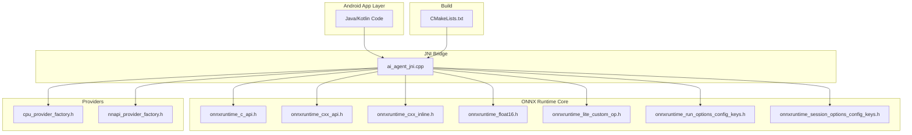
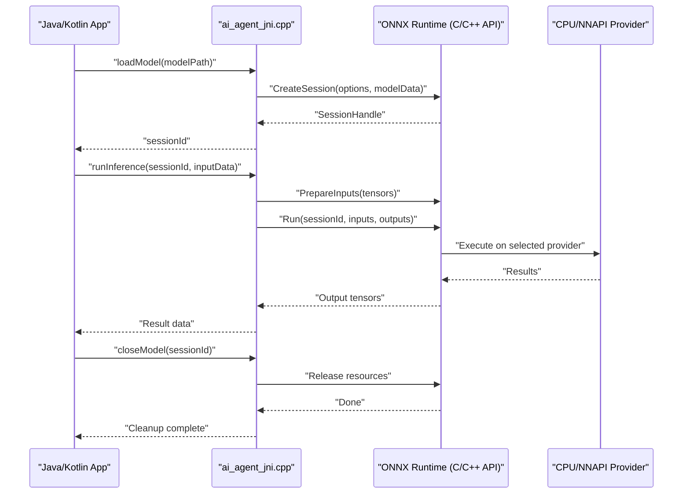
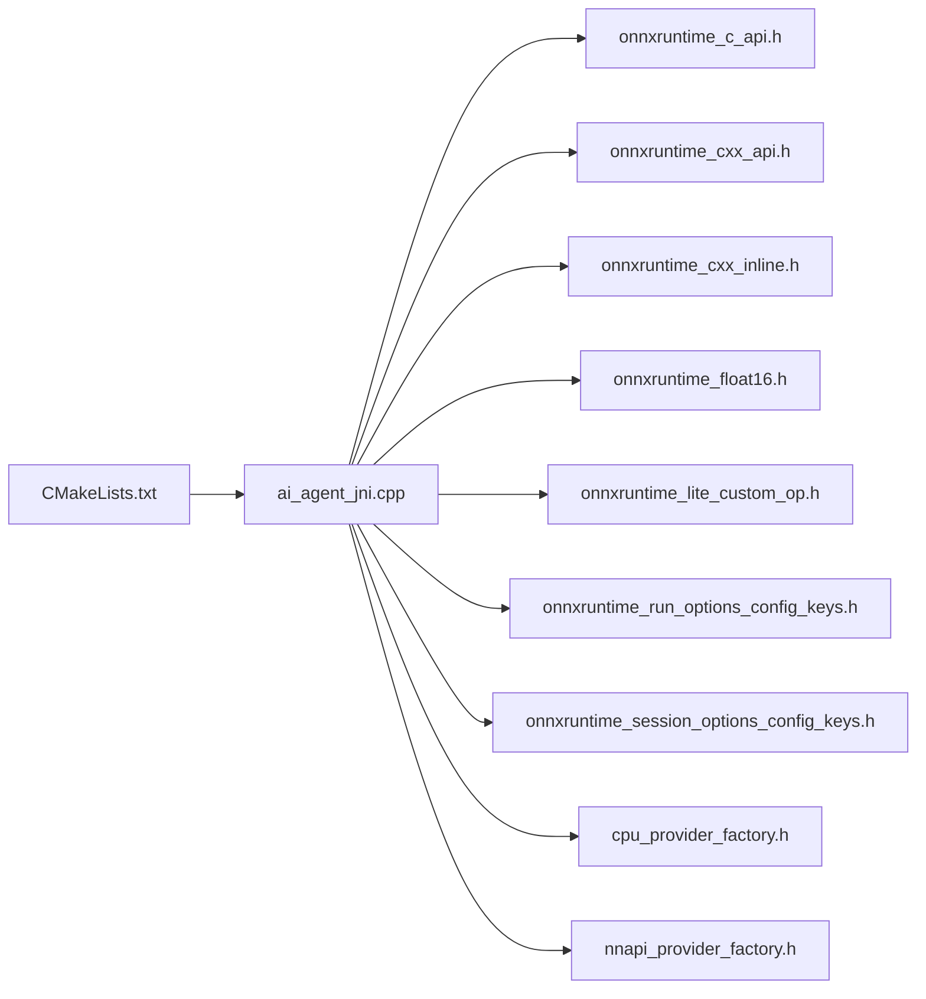

# ONNX Runtime Integration

<cite>
**Referenced Files in This Document**
- [catroid/src/main/cpp/onnxruntime_c_api.h](file://catroid/src/main/cpp/onnxruntime_c_api.h)
- [catroid/src/main/cpp/onnxruntime_cxx_api.h](file://catroid/src/main/cpp/onnxruntime_cxx_api.h)
- [catroid/src/main/cpp/onnxruntime_cxx_inline.h](file://catroid/src/main/cpp/onnxruntime_cxx_inline.h)
- [catroid/src/main/cpp/onnxruntime_float16.h](file://catroid/src/main/cpp/onnxruntime_float16.h)
- [catroid/src/main/cpp/onnxruntime_lite_custom_op.h](file://catroid/src/main/cpp/onnxruntime_lite_custom_op.h)
- [catroid/src/main/cpp/onnxruntime_run_options_config_keys.h](file://catroid/src/main/cpp/onnxruntime_run_options_config_keys.h)
- [catroid/src/main/cpp/onnxruntime_session_options_config_keys.h](file://catroid/src/main/cpp/onnxruntime_session_options_config_keys.h)
- [catroid/src/main/cpp/ai_agent_jni.cpp](file://catroid/src/main/cpp/ai_agent_jni.cpp)
- [catroid/src/main/cpp/onnxtest.cpp](file://catroid/src/main/cpp/onnxtest.cpp)
- [catroid/src/main/cpp/CMakeLists.txt](file://catroid/src/main/cpp/CMakeLists.txt)
- [catroid/src/main/cpp/cpu_provider_factory.h](file://catroid/src/main/cpp/cpu_provider_factory.h)
- [catroid/src/main/cpp/nnapi_provider_factory.h](file://catroid/src/main/cpp/nnapi_provider_factory.h)
</cite>

## Table of Contents
1. [Introduction](#introduction)
2. [Project Structure](#project-structure)
3. [Core Components](#core-components)
4. [Architecture Overview](#architecture-overview)
5. [Detailed Component Analysis](#detailed-component-analysis)
6. [Dependency Analysis](#dependency-analysis)
7. [Performance Considerations](#performance-considerations)
8. [Troubleshooting Guide](#troubleshooting-guide)
9. [Conclusion](#conclusion)
10. [Appendices](#appendices)

## Introduction
This document explains how NewCatroid integrates the ONNX Runtime for Android to load, execute, and optimize pre-trained machine learning models. It covers the JNI bridge between Java/Kotlin and C++, model lifecycle management, input/output handling, optimization techniques (quantization, pruning, hardware acceleration), performance monitoring, error handling, debugging, memory management, and resource cleanup. The goal is to provide both a high-level understanding and actionable guidance for integrating custom ONNX models into NewCatroid’s Android runtime.

## Project Structure
NewCatroid includes ONNX Runtime integration primarily under the native C++ layer with a JNI bridge:
- Native headers and wrappers for ONNX Runtime are located in catroid/src/main/cpp/.
- A JNI entry point exposes ONNX capabilities to Java/Kotlin via ai_agent_jni.cpp.
- Provider factories for CPU and NNAPI are provided to enable hardware acceleration.
- Example/test code demonstrates usage patterns.

**Diagram sources**
- [catroid/src/main/cpp/ai_agent_jni.cpp](file://catroid/src/main/cpp/ai_agent_jni.cpp)
- [catroid/src/main/cpp/onnxruntime_c_api.h](file://catroid/src/main/cpp/onnxruntime_c_api.h)
- [catroid/src/main/cpp/onnxruntime_cxx_api.h](file://catroid/src/main/cpp/onnxruntime_cxx_api.h)
- [catroid/src/main/cpp/onnxruntime_cxx_inline.h](file://catroid/src/main/cpp/onnxruntime_cxx_inline.h)
- [catroid/src/main/cpp/onnxruntime_float16.h](file://catroid/src/main/cpp/onnxruntime_float16.h)
- [catroid/src/main/cpp/onnxruntime_lite_custom_op.h](file://catroid/src/main/cpp/onnxruntime_lite_custom_op.h)
- [catroid/src/main/cpp/onnxruntime_run_options_config_keys.h](file://catroid/src/main/cpp/onnxruntime_run_options_config_keys.h)
- [catroid/src/main/cpp/onnxruntime_session_options_config_keys.h](file://catroid/src/main/cpp/onnxruntime_session_options_config_keys.h)
- [catroid/src/main/cpp/cpu_provider_factory.h](file://catroid/src/main/cpp/cpu_provider_factory.h)
- [catroid/src/main/cpp/nnapi_provider_factory.h](file://catroid/src/main/cpp/nnapi_provider_factory.h)
- [catroid/src/main/cpp/CMakeLists.txt](file://catroid/src/main/cpp/CMakeLists.txt)

**Section sources**
- [catroid/src/main/cpp/ai_agent_jni.cpp](file://catroid/src/main/cpp/ai_agent_jni.cpp)
- [catroid/src/main/cpp/CMakeLists.txt](file://catroid/src/main/cpp/CMakeLists.txt)

## Core Components
- JNI Bridge: Exposes ONNX Runtime functions to Java/Kotlin through native methods defined in ai_agent_jni.cpp.
- ONNX Runtime Headers: Provide C and C++ APIs for session creation, execution, tensor management, and options configuration.
- Providers: Factory headers for CPU and NNAPI providers to leverage device-specific accelerators.
- Build Configuration: CMakeLists.txt ties together native sources and dependencies.

Key responsibilities:
- Model loading from assets or files.
- Session initialization with provider selection and optimization flags.
- Input/output tensor preparation and data marshaling across JNI.
- Execution scheduling and result retrieval.
- Resource cleanup and error propagation back to Java/Kotlin.

**Section sources**
- [catroid/src/main/cpp/ai_agent_jni.cpp](file://catroid/src/main/cpp/ai_agent_jni.cpp)
- [catroid/src/main/cpp/onnxruntime_c_api.h](file://catroid/src/main/cpp/onnxruntime_c_api.h)
- [catroid/src/main/cpp/onnxruntime_cxx_api.h](file://catroid/src/main/cpp/onnxruntime_cxx_api.h)
- [catroid/src/main/cpp/cpu_provider_factory.h](file://catroid/src/main/cpp/cpu_provider_factory.h)
- [catroid/src/main/cpp/nnapi_provider_factory.h](file://catroid/src/main/cpp/nnapi_provider_factory.h)
- [catroid/src/main/cpp/CMakeLists.txt](file://catroid/src/main/cpp/CMakeLists.txt)

## Architecture Overview
The integration follows a layered architecture:
- Java/Kotlin calls JNI methods to request model operations.
- The JNI layer constructs ONNX Runtime sessions, prepares inputs, runs inference, and returns outputs.
- Providers (CPU/NNAPI) handle execution on appropriate hardware.
- Options control optimization behaviors such as graph optimizations and memory settings.

**Diagram sources**
- [catroid/src/main/cpp/ai_agent_jni.cpp](file://catroid/src/main/cpp/ai_agent_jni.cpp)
- [catroid/src/main/cpp/onnxruntime_c_api.h](file://catroid/src/main/cpp/onnxruntime_c_api.h)
- [catroid/src/main/cpp/onnxruntime_cxx_api.h](file://catroid/src/main/cpp/onnxruntime_cxx_api.h)
- [catroid/src/main/cpp/cpu_provider_factory.h](file://catroid/src/main/cpp/cpu_provider_factory.h)
- [catroid/src/main/cpp/nnapi_provider_factory.h](file://catroid/src/main/cpp/nnapi_provider_factory.h)

## Detailed Component Analysis

### JNI Bridge Implementation
The JNI bridge encapsulates ONNX Runtime operations behind stable Java/Kotlin-facing methods. Typical responsibilities include:
- Loading models from file paths or asset streams.
- Creating and managing sessions with provider selection.
- Marshaling primitive arrays and buffers to/from ONNX tensors.
- Running inference and returning results efficiently.
- Handling errors and exceptions by translating ORT status codes into Java/Kotlin exceptions.

Best practices:
- Use long handles for sessions to avoid object lifetime issues.
- Validate inputs and shapes before calling ORT.
- Minimize allocations by reusing buffers where possible.
- Log detailed diagnostics for failures.

**Section sources**
- [catroid/src/main/cpp/ai_agent_jni.cpp](file://catroid/src/main/cpp/ai_agent_jni.cpp)

### ONNX Runtime C/C++ API Usage
The integration leverages the ONNX Runtime C and C++ APIs for:
- Session creation and configuration.
- Tensor creation and population.
- Execution orchestration.
- Option keys for run-time and session-level tuning.

Important aspects:
- Use C++ wrappers for safer memory management when available.
- Configure providers explicitly to target CPU or NNAPI.
- Apply optimization flags via session/run option keys.

**Section sources**
- [catroid/src/main/cpp/onnxruntime_c_api.h](file://catroid/src/main/cpp/onnxruntime_c_api.h)
- [catroid/src/main/cpp/onnxruntime_cxx_api.h](file://catroid/src/main/cpp/onnxruntime_cxx_api.h)
- [catroid/src/main/cpp/onnxruntime_cxx_inline.h](file://catroid/src/main/cpp/onnxruntime_cxx_inline.h)
- [catroid/src/main/cpp/onnxruntime_run_options_config_keys.h](file://catroid/src/main/cpp/onnxruntime_run_options_config_keys.h)
- [catroid/src/main/cpp/onnxruntime_session_options_config_keys.h](file://catroid/src/main/cpp/onnxruntime_session_options_config_keys.h)

### Provider Factories (CPU and NNAPI)
Hardware acceleration is enabled via provider factories:
- CPU provider for general-purpose execution.
- NNAPI provider for Android Neural Networks API acceleration.

Selection strategy:
- Prefer NNAPI when available and supported by the model.
- Fall back to CPU if NNAPI is unavailable or unsupported.

Configuration tips:
- Tune provider-specific options for latency vs. throughput.
- Monitor device temperature and battery impact when using NNAPI.

**Section sources**
- [catroid/src/main/cpp/cpu_provider_factory.h](file://catroid/src/main/cpp/cpu_provider_factory.h)
- [catroid/src/main/cpp/nnapi_provider_factory.h](file://catroid/src/main/cpp/nnapi_provider_factory.h)

### Example/Test Code
The repository includes example/test code that demonstrates ONNX usage patterns:
- Loading models.
- Preparing inputs.
- Running inference.
- Retrieving outputs.

Use these examples as references for structuring your own integration.

**Section sources**
- [catroid/src/main/cpp/onnxtest.cpp](file://catroid/src/main/cpp/onnxtest.cpp)

### Build Configuration
CMakeLists.txt defines how native sources are compiled and linked:
- Includes ONNX Runtime headers.
- Adds JNI source files.
- Configures provider libraries.

Ensure ABI targets match device architectures (arm64-v8a, armeabi-v7a, x86, x86_64).

**Section sources**
- [catroid/src/main/cpp/CMakeLists.txt](file://catroid/src/main/cpp/CMakeLists.txt)

## Dependency Analysis
The JNI layer depends on ONNX Runtime headers and provider factories. The build system wires these components together.

**Diagram sources**
- [catroid/src/main/cpp/ai_agent_jni.cpp](file://catroid/src/main/cpp/ai_agent_jni.cpp)
- [catroid/src/main/cpp/onnxruntime_c_api.h](file://catroid/src/main/cpp/onnxruntime_c_api.h)
- [catroid/src/main/cpp/onnxruntime_cxx_api.h](file://catroid/src/main/cpp/onnxruntime_cxx_api.h)
- [catroid/src/main/cpp/onnxruntime_cxx_inline.h](file://catroid/src/main/cpp/onnxruntime_cxx_inline.h)
- [catroid/src/main/cpp/onnxruntime_float16.h](file://catroid/src/main/cpp/onnxruntime_float16.h)
- [catroid/src/main/cpp/onnxruntime_lite_custom_op.h](file://catroid/src/main/cpp/onnxruntime_lite_custom_op.h)
- [catroid/src/main/cpp/onnxruntime_run_options_config_keys.h](file://catroid/src/main/cpp/onnxruntime_run_options_config_keys.h)
- [catroid/src/main/cpp/onnxruntime_session_options_config_keys.h](file://catroid/src/main/cpp/onnxruntime_session_options_config_keys.h)
- [catroid/src/main/cpp/cpu_provider_factory.h](file://catroid/src/main/cpp/cpu_provider_factory.h)
- [catroid/src/main/cpp/nnapi_provider_factory.h](file://catroid/src/main/cpp/nnapi_provider_factory.h)
- [catroid/src/main/cpp/CMakeLists.txt](file://catroid/src/main/cpp/CMakeLists.txt)

**Section sources**
- [catroid/src/main/cpp/CMakeLists.txt](file://catroid/src/main/cpp/CMakeLists.txt)

## Performance Considerations
Optimization techniques:
- Quantization: Convert models to lower precision (e.g., int8) to reduce size and improve speed; ensure compatibility with chosen providers.
- Pruning: Remove redundant weights to decrease model size and computation; validate accuracy trade-offs.
- Hardware Acceleration: Prefer NNAPI when available; configure provider options for optimal throughput.
- Graph Optimizations: Enable session and run options to fuse ops and reduce overhead.
- Memory Management: Reuse buffers, minimize allocations, and avoid unnecessary copies across JNI boundaries.
- Profiling: Measure latency and memory usage per inference; track provider utilization.

[No sources needed since this section provides general guidance]

## Troubleshooting Guide
Common issues and strategies:
- Model loading failures: Verify file paths, permissions, and asset extraction; log detailed error messages from ORT.
- Shape mismatches: Validate input dimensions and types before running inference.
- Provider unavailability: Detect NNAPI support at runtime and fallback to CPU gracefully.
- Memory pressure: Monitor heap/native memory; release sessions promptly; avoid large temporary buffers.
- Debugging: Use logging around JNI calls and ORT status checks; capture stack traces in Java/Kotlin and native logs.

Error handling best practices:
- Translate ORT status codes into descriptive exceptions.
- Ensure cleanup in finally blocks to prevent leaks.
- Record diagnostic context (model name, input shape, provider used).

**Section sources**
- [catroid/src/main/cpp/ai_agent_jni.cpp](file://catroid/src/main/cpp/ai_agent_jni.cpp)

## Conclusion
NewCatroid’s ONNX Runtime integration provides a robust foundation for deploying pre-trained models on Android. By leveraging the JNI bridge, provider factories, and ONNX Runtime APIs, developers can load, execute, and optimize models efficiently. Following the recommended practices for memory management, error handling, and performance tuning will help achieve reliable and fast inference in production apps.

[No sources needed since this section summarizes without analyzing specific files]

## Appendices

### Practical Integration Steps
- Prepare an ONNX model optimized for mobile (quantized/pruned if applicable).
- Place the model in app assets or external storage accessible to the app.
- Implement Java/Kotlin wrappers that call JNI methods for model lifecycle and inference.
- Configure providers and options based on device capabilities.
- Test thoroughly across devices and architectures.

[No sources needed since this section doesn't analyze specific files]