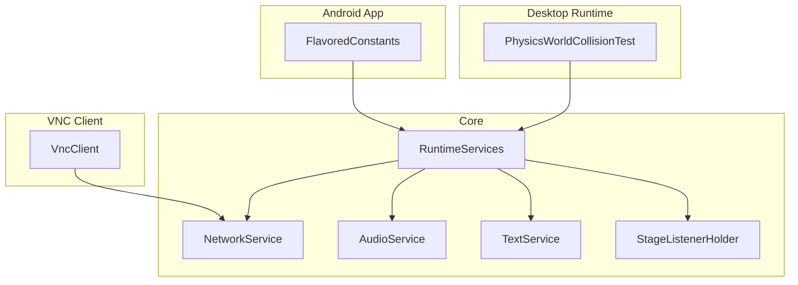
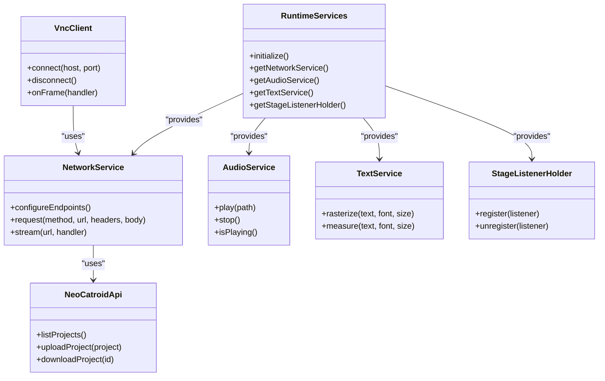
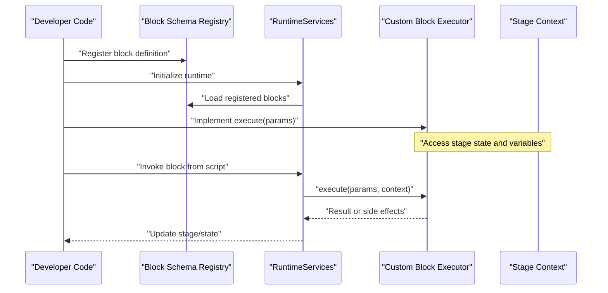
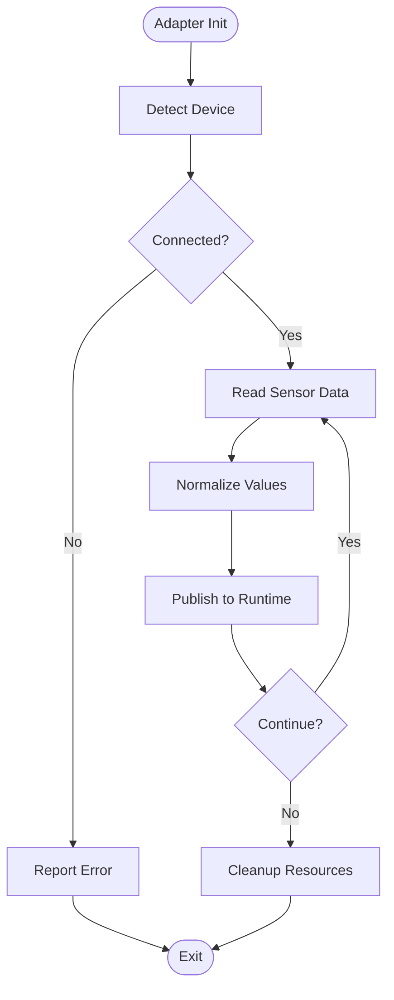
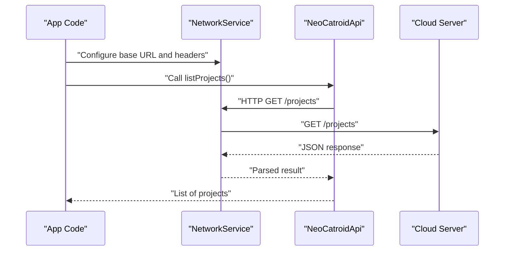
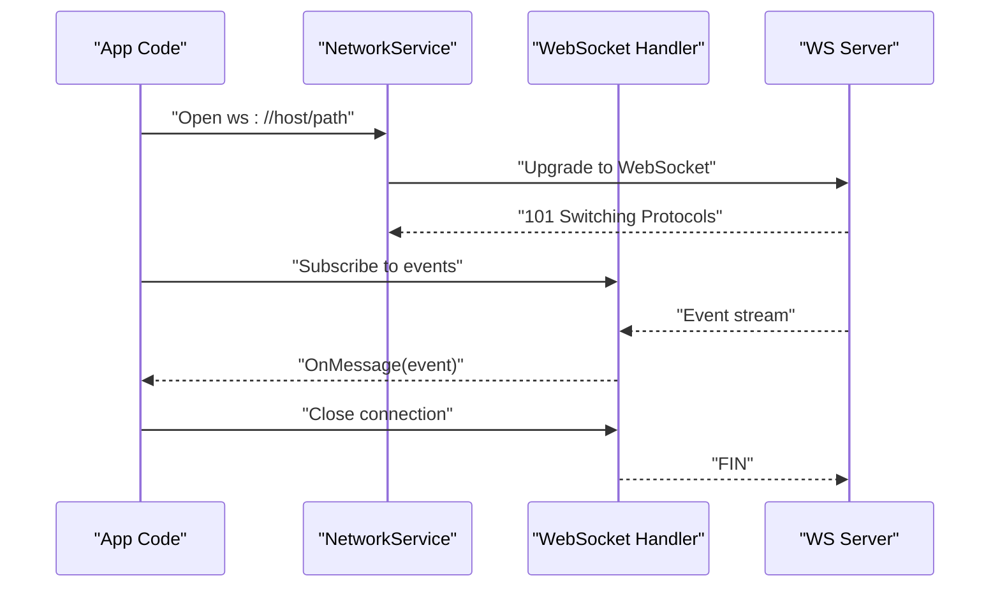
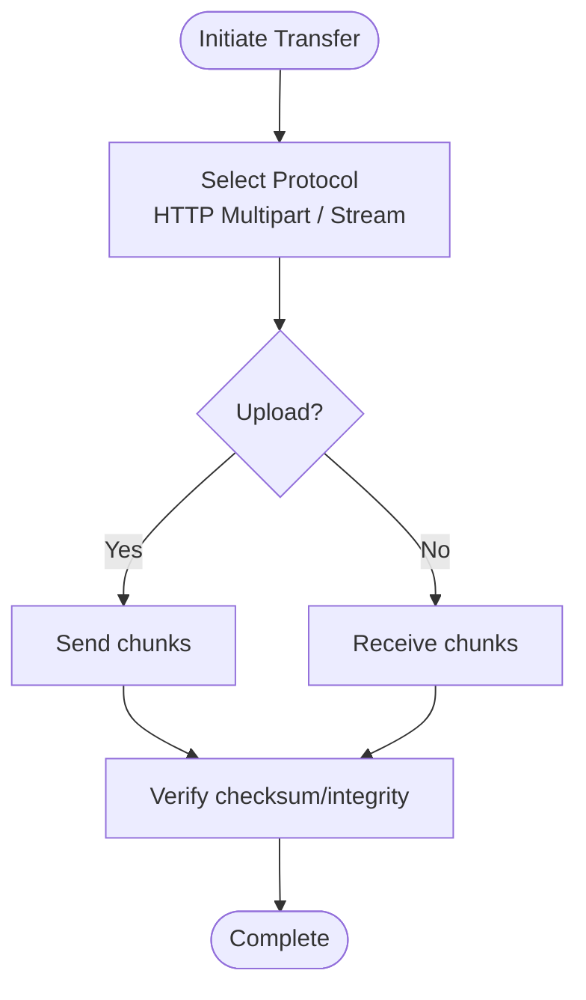
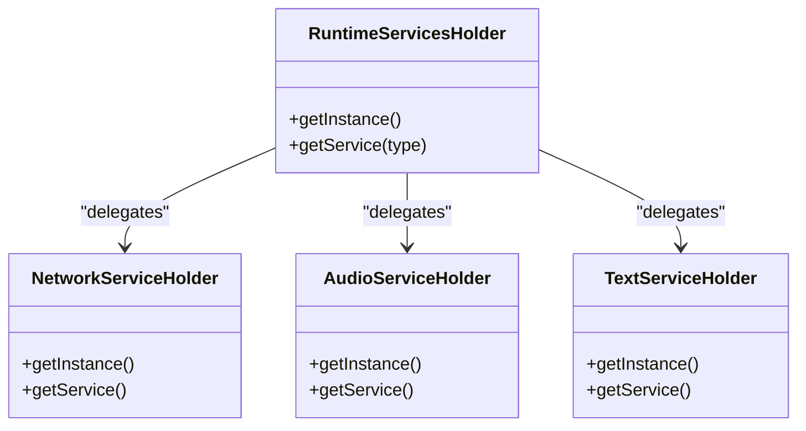
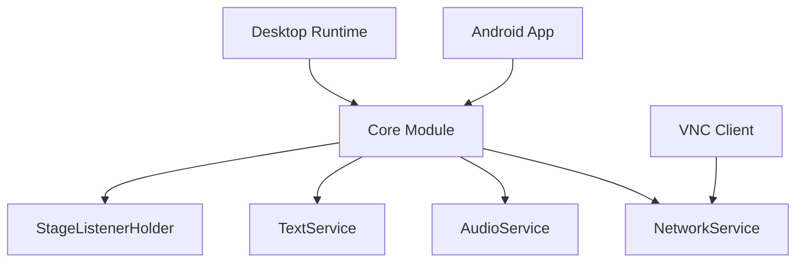

# API Reference

<cite>
**Referenced Files in This Document**
- [README.md](file://README.md)
- [build.gradle](file://build.gradle)
- [settings.gradle](file://settings.gradle)
- [gradle.properties](file://gradle.properties)
- [catroid/src/main/java/org/catrobat/catroid/common/FlavoredConstants.java](file://catroid/src/main/java/org/catrobat/catroid/common/FlavoredConstants.java)
- [core/src/main/java/org/catrobat/catroid/network/NeoCatroidApi.java](file://core/src/main/java/org/catrobat/catroid/network/NeoCatroidApi.java)
- [core/src/main/java/org/catrobat/catroid/network/NetworkService.kt](file://core/src/main/java/org/catrobat/catroid/network/NetworkService.kt)
- [core/src/main/java/org/catrobat/catroid/network/NetworkServiceHolder.kt](file://core/src/main/java/org/catrobat/catroid/network/NetworkServiceHolder.kt)
- [core/src/main/java/org/catrobat/catroid/runtime/RuntimeServices.kt](file://core/src/main/java/org/catrobat/catroid/runtime/RuntimeServices.kt)
- [core/src/main/java/org/catrobat/catroid/runtime/RuntimeServicesHolder.kt](file://core/src/main/java/org/catrobat/catroid/runtime/RuntimeServicesHolder.kt)
- [core/src/main/java/org/catrobat/catroid/audio/AudioService.kt](file://core/src/main/java/org/catrobat/catroid/audio/AudioService.kt)
- [core/src/main/java/org/catrobat/catroid/audio/AudioServiceHolder.kt](file://core/src/main/java/org/catrobat/catroid/audio/AudioServiceHolder.kt)
- [core/src/main/java/org/catrobat/catroid/text/TextService.kt](file://core/src/main/java/org/catrobat/catroid/text/TextService.kt)
- [core/src/main/java/org/catrobat/catroid/text/TextServiceHolder.kt](file://core/src/main/java/org/catrobat/catroid/text/TextServiceHolder.kt)
- [core/src/main/java/org/catrobat/catroid/stage/StageListenerHolder.kt](file://core/src/main/java/org/catrobat/catroid/stage/StageListenerHolder.kt)
- [desktop-runtime/src/main/java/org/catrobat/catroid/stage/PhysicsWorldCollisionTest.kt](file://desktop-runtime/src/main/java/org/catrobat/catroid/stage/PhysicsWorldCollisionTest.kt)
- [vncclient/src/main/java/com/gaurav/avnc/vnc/VncClient.java](file://vncclient/src/main/java/com/gaurav/avnc/vnc/VncClient.java)
- [catroid/src/main/assets/trustedDomains.json](file://catroid/src/main/assets/trustedDomains.json)
- [catroid/src/main/assets/nolb_config.xml](file://catroid/src/main/assets/nolb_config.xml)
</cite>

## Table of Contents
1. Introduction
2. Project Structure
3. Core Components
4. Architecture Overview
5. Detailed Component Analysis
6. Dependency Analysis
7. Performance Considerations
8. Troubleshooting Guide
9. Conclusion

## Introduction
This document provides a comprehensive API reference for NewCatroid’s extension and integration points. It focuses on:
- Custom block creation API (block definition schemas, parameter handling, execution context access)
- Hardware adapter API for new devices and sensors
- Theme customization API for UI appearance modifications
- REST API endpoints for cloud services
- WebSocket connections for real-time features
- File transfer protocols
- SDK documentation for Java/Kotlin extensions, Python integration, and web API clients

Where applicable, this guide includes method signatures, parameters, return values, and usage examples. For implementation details, see the referenced source files.

## Project Structure
NewCatroid is a multi-module Android project with shared core logic, platform-specific modules, and tooling. Key areas relevant to APIs and integrations include:
- Core runtime services (network, audio, text, stage listeners)
- Desktop runtime components
- VNC client module for remote display
- Build configuration and flavor constants that influence available APIs at compile time

**Diagram sources**
- [core/src/main/java/org/catrobat/catroid/runtime/RuntimeServices.kt](file://core/src/main/java/org/catrobat/catroid/runtime/RuntimeServices.kt)
- [core/src/main/java/org/catrobat/catroid/network/NetworkService.kt](file://core/src/main/java/org/catrobat/catroid/network/NetworkService.kt)
- [core/src/main/java/org/catrobat/catroid/audio/AudioService.kt](file://core/src/main/java/org/catrobat/catroid/audio/AudioService.kt)
- [core/src/main/java/org/catrobat/catroid/text/TextService.kt](file://core/src/main/java/org/catrobat/catroid/text/TextService.kt)
- [core/src/main/java/org/catrobat/catroid/stage/StageListenerHolder.kt](file://core/src/main/java/org/catrobat/catroid/stage/StageListenerHolder.kt)
- [catroid/src/main/java/org/catrobat/catroid/common/FlavoredConstants.java](file://catroid/src/main/java/org/catrobat/catroid/common/FlavoredConstants.java)
- [desktop-runtime/src/main/java/org/catrobat/catroid/stage/PhysicsWorldCollisionTest.kt](file://desktop-runtime/src/main/java/org/catrobat/catroid/stage/PhysicsWorldCollisionTest.kt)
- [vncclient/src/main/java/com/gaurav/avnc/vnc/VncClient.java](file://vncclient/src/main/java/com/gaurav/avnc/vnc/VncClient.java)

**Section sources**
- [build.gradle](file://build.gradle)
- [settings.gradle](file://settings.gradle)
- [gradle.properties](file://gradle.properties)
- [catroid/src/main/java/org/catrobat/catroid/common/FlavoredConstants.java](file://catroid/src/main/java/org/catrobat/catroid/common/FlavoredConstants.java)

## Core Components
This section summarizes the primary extension points exposed by the core runtime and network layers.

- Runtime Services
  - Provides centralized access to subsystems such as networking, audio, text rendering, and stage events.
  - Typical responsibilities: initialization, lifecycle management, and exposing stable interfaces to apps and plugins.

- Network Service
  - Encapsulates HTTP and potentially WebSocket connectivity used by cloud features.
  - Integrates with domain allowlists and configuration assets for secure communication.

- Audio Service
  - Exposes audio playback and capture capabilities for blocks and scripts.

- Text Service
  - Provides text rasterization and measurement utilities used by UI and stage rendering.

- Stage Listener Holder
  - Manages event hooks into the stage lifecycle and rendering pipeline.

- Desktop Runtime
  - Bridges desktop-specific behaviors and tests into the same runtime model.

- VNC Client
  - Implements remote display protocol support for streaming screen content.

**Section sources**
- [core/src/main/java/org/catrobat/catroid/runtime/RuntimeServices.kt](file://core/src/main/java/org/catrobat/catroid/runtime/RuntimeServices.kt)
- [core/src/main/java/org/catrobat/catroid/runtime/RuntimeServicesHolder.kt](file://core/src/main/java/org/catrobat/catroid/runtime/RuntimeServicesHolder.kt)
- [core/src/main/java/org/catrobat/catroid/network/NetworkService.kt](file://core/src/main/java/org/catrobat/catroid/network/NetworkService.kt)
- [core/src/main/java/org/catrobat/catroid/network/NetworkServiceHolder.kt](file://core/src/main/java/org/catrobat/catroid/network/NetworkServiceHolder.kt)
- [core/src/main/java/org/catrobat/catroid/audio/AudioService.kt](file://core/src/main/java/org/catrobat/catroid/audio/AudioService.kt)
- [core/src/main/java/org/catrobat/catroid/audio/AudioServiceHolder.kt](file://core/src/main/java/org/catrobat/catroid/audio/AudioServiceHolder.kt)
- [core/src/main/java/org/catrobat/catroid/text/TextService.kt](file://core/src/main/java/org/catrobat/catroid/text/TextService.kt)
- [core/src/main/java/org/catrobat/catroid/text/TextServiceHolder.kt](file://core/src/main/java/org/catrobat/catroid/text/TextServiceHolder.kt)
- [core/src/main/java/org/catrobat/catroid/stage/StageListenerHolder.kt](file://core/src/main/java/org/catrobat/catroid/stage/StageListenerHolder.kt)
- [desktop-runtime/src/main/java/org/catrobat/catroid/stage/PhysicsWorldCollisionTest.kt](file://desktop-runtime/src/main/java/org/catrobat/catroid/stage/PhysicsWorldCollisionTest.kt)
- [vncclient/src/main/java/com/gaurav/avnc/vnc/VncClient.java](file://vncclient/src/main/java/com/gaurav/avnc/vnc/VncClient.java)

## Architecture Overview
The following diagram maps key runtime and network components and their relationships.

**Diagram sources**
- [core/src/main/java/org/catrobat/catroid/runtime/RuntimeServices.kt](file://core/src/main/java/org/catrobat/catroid/runtime/RuntimeServices.kt)
- [core/src/main/java/org/catrobat/catroid/network/NetworkService.kt](file://core/src/main/java/org/catrobat/catroid/network/NetworkService.kt)
- [core/src/main/java/org/catrobat/catroid/network/NeoCatroidApi.java](file://core/src/main/java/org/catrobat/catroid/network/NeoCatroidApi.java)
- [core/src/main/java/org/catrobat/catroid/audio/AudioService.kt](file://core/src/main/java/org/catrobat/catroid/audio/AudioService.kt)
- [core/src/main/java/org/catrobat/catroid/text/TextService.kt](file://core/src/main/java/org/catrobat/catroid/text/TextService.kt)
- [core/src/main/java/org/catrobat/catroid/stage/StageListenerHolder.kt](file://core/src/main/java/org/catrobat/catroid/stage/StageListenerHolder.kt)
- [vncclient/src/main/java/com/gaurav/avnc/vnc/VncClient.java](file://vncclient/src/main/java/com/gaurav/avnc/vnc/VncClient.java)

## Detailed Component Analysis

### Custom Block Creation API
NewCatroid exposes extension points for defining custom blocks, including schema definitions, parameter binding, and execution context access. The typical flow involves:
- Declaring a block schema (name, category, inputs, outputs)
- Registering the block with the runtime
- Implementing an executor that receives typed parameters and returns results
- Accessing execution context (stage state, variables, sprites) via provided APIs

Implementation references:
- Block registration and runtime integration are typically wired through the core runtime and service holders.
- Execution context access is mediated by stage and runtime services.

**Diagram sources**
- [core/src/main/java/org/catrobat/catroid/runtime/RuntimeServices.kt](file://core/src/main/java/org/catrobat/catroid/runtime/RuntimeServices.kt)
- [core/src/main/java/org/catrobat/catroid/runtime/RuntimeServicesHolder.kt](file://core/src/main/java/org/catrobat/catroid/runtime/RuntimeServicesHolder.kt)
- [core/src/main/java/org/catrobat/catroid/stage/StageListenerHolder.kt](file://core/src/main/java/org/catrobat/catroid/stage/StageListenerHolder.kt)

**Section sources**
- [core/src/main/java/org/catrobat/catroid/runtime/RuntimeServices.kt](file://core/src/main/java/org/catrobat/catroid/runtime/RuntimeServices.kt)
- [core/src/main/java/org/catrobat/catroid/runtime/RuntimeServicesHolder.kt](file://core/src/main/java/org/catrobat/catroid/runtime/RuntimeServicesHolder.kt)
- [core/src/main/java/org/catrobat/catroid/stage/StageListenerHolder.kt](file://core/src/main/java/org/catrobat/catroid/stage/StageListenerHolder.kt)

### Hardware Adapter API
To support new devices and sensors, implement a hardware adapter that integrates with the runtime’s input and sensor subsystems. Key responsibilities:
- Initialize device-specific drivers
- Publish sensor readings to the runtime
- Handle connection lifecycle and error states
- Provide calibration and data normalization

Integration points:
- Use runtime services to publish sensor updates.
- Leverage stage listeners for event-driven updates when needed.

**Diagram sources**
- [core/src/main/java/org/catrobat/catroid/runtime/RuntimeServices.kt](file://core/src/main/java/org/catrobat/catroid/runtime/RuntimeServices.kt)
- [core/src/main/java/org/catrobat/catroid/stage/StageListenerHolder.kt](file://core/src/main/java/org/catrobat/catroid/stage/StageListenerHolder.kt)

**Section sources**
- [core/src/main/java/org/catrobat/catroid/runtime/RuntimeServices.kt](file://core/src/main/java/org/catrobat/catroid/runtime/RuntimeServices.kt)
- [core/src/main/java/org/catrobat/catroid/stage/StageListenerHolder.kt](file://core/src/main/java/org/catrobat/catroid/stage/StageListenerHolder.kt)

### Theme Customization API
Theme customization allows modifying UI appearance across the app. Typical steps:
- Define theme resources (colors, drawables, styles)
- Apply theme at runtime via service or holder abstractions
- Ensure consistent styling across screens and components

References:
- Flavor constants may influence available theme variants.
- Runtime services can be used to apply theme changes dynamically.

**Section sources**
- [catroid/src/main/java/org/catrobat/catroid/common/FlavoredConstants.java](file://catroid/src/main/java/org/catrobat/catroid/common/FlavoredConstants.java)
- [core/src/main/java/org/catrobat/catroid/runtime/RuntimeServices.kt](file://core/src/main/java/org/catrobat/catroid/runtime/RuntimeServices.kt)

### REST API Endpoints for Cloud Services
Cloud interactions are implemented via the network layer and dedicated API classes. Common operations include listing projects, uploading/downloading projects, and managing user sessions.

Security and configuration:
- Domain allowlists and trusted domains are enforced via asset configurations.

**Diagram sources**
- [core/src/main/java/org/catrobat/catroid/network/NetworkService.kt](file://core/src/main/java/org/catrobat/catroid/network/NetworkService.kt)
- [core/src/main/java/org/catrobat/catroid/network/NeoCatroidApi.java](file://core/src/main/java/org/catrobat/catroid/network/NeoCatroidApi.java)
- [catroid/src/main/assets/trustedDomains.json](file://catroid/src/main/assets/trustedDomains.json)

**Section sources**
- [core/src/main/java/org/catrobat/catroid/network/NetworkService.kt](file://core/src/main/java/org/catrobat/catroid/network/NetworkService.kt)
- [core/src/main/java/org/catrobat/catroid/network/NeoCatroidApi.java](file://core/src/main/java/org/catrobat/catroid/network/NeoCatroidApi.java)
- [catroid/src/main/assets/trustedDomains.json](file://catroid/src/main/assets/trustedDomains.json)

### WebSocket Connections for Real-Time Features
Real-time features use the network layer to establish persistent connections. Typical workflow:
- Connect to a WebSocket endpoint
- Subscribe to channels/events
- Handle incoming messages and errors
- Gracefully reconnect on failures

**Diagram sources**
- [core/src/main/java/org/catrobat/catroid/network/NetworkService.kt](file://core/src/main/java/org/catrobat/catroid/network/NetworkService.kt)

**Section sources**
- [core/src/main/java/org/catrobat/catroid/network/NetworkService.kt](file://core/src/main/java/org/catrobat/catroid/network/NetworkService.kt)

### File Transfer Protocols
File transfers are handled through the network layer and may use HTTP multipart uploads/downloads or specialized protocols. The VNC client demonstrates streaming binary data over network connections.

**Diagram sources**
- [vncclient/src/main/java/com/gaurav/avnc/vnc/VncClient.java](file://vncclient/src/main/java/com/gaurav/avnc/vnc/VncClient.java)
- [core/src/main/java/org/catrobat/catroid/network/NetworkService.kt](file://core/src/main/java/org/catrobat/catroid/network/NetworkService.kt)

**Section sources**
- [vncclient/src/main/java/com/gaurav/avnc/vnc/VncClient.java](file://vncclient/src/main/java/com/gaurav/avnc/vnc/VncClient.java)
- [core/src/main/java/org/catrobat/catroid/network/NetworkService.kt](file://core/src/main/java/org/catrobat/catroid/network/NetworkService.kt)

### SDK Documentation: Java/Kotlin Extensions
Extensions integrate with the runtime via service holders and public interfaces. Steps:
- Obtain runtime services via holders
- Register custom blocks or adapters
- Use audio and text services for media and rendering
- Hook into stage events via listener holders

**Diagram sources**
- [core/src/main/java/org/catrobat/catroid/runtime/RuntimeServicesHolder.kt](file://core/src/main/java/org/catrobat/catroid/runtime/RuntimeServicesHolder.kt)
- [core/src/main/java/org/catrobat/catroid/network/NetworkServiceHolder.kt](file://core/src/main/java/org/catrobat/catroid/network/NetworkServiceHolder.kt)
- [core/src/main/java/org/catrobat/catroid/audio/AudioServiceHolder.kt](file://core/src/main/java/org/catrobat/catroid/audio/AudioServiceHolder.kt)
- [core/src/main/java/org/catrobat/catroid/text/TextServiceHolder.kt](file://core/src/main/java/org/catrobat/catroid/text/TextServiceHolder.kt)

**Section sources**
- [core/src/main/java/org/catrobat/catroid/runtime/RuntimeServicesHolder.kt](file://core/src/main/java/org/catrobat/catroid/runtime/RuntimeServicesHolder.kt)
- [core/src/main/java/org/catrobat/catroid/network/NetworkServiceHolder.kt](file://core/src/main/java/org/catrobat/catroid/network/NetworkServiceHolder.kt)
- [core/src/main/java/org/catrobat/catroid/audio/AudioServiceHolder.kt](file://core/src/main/java/org/catrobat/catroid/audio/AudioServiceHolder.kt)
- [core/src/main/java/org/catrobat/catroid/text/TextServiceHolder.kt](file://core/src/main/java/org/catrobat/catroid/text/TextServiceHolder.kt)

### Python Integration
Python integration is facilitated by embedded interpreter assets and helper scripts. Typical usage:
- Load Python environment from assets
- Execute scripts within the runtime sandbox
- Exchange data between Python and Java/Kotlin via defined interfaces

References:
- Embedded Python runtime assets and configuration files indicate integration points.

**Section sources**
- [catroid/src/main/assets/nolb_config.xml](file://catroid/src/main/assets/nolb_config.xml)

### Web API Clients
Web API clients interact with cloud services using the network layer. They should:
- Respect trusted domain policies
- Handle authentication and session management
- Manage retries and backoff strategies

**Section sources**
- [core/src/main/java/org/catrobat/catroid/network/NetworkService.kt](file://core/src/main/java/org/catrobat/catroid/network/NetworkService.kt)
- [catroid/src/main/assets/trustedDomains.json](file://catroid/src/main/assets/trustedDomains.json)

## Dependency Analysis
The following diagram shows high-level dependencies among core modules and external components.

**Diagram sources**
- [core/src/main/java/org/catrobat/catroid/runtime/RuntimeServices.kt](file://core/src/main/java/org/catrobat/catroid/runtime/RuntimeServices.kt)
- [core/src/main/java/org/catrobat/catroid/network/NetworkService.kt](file://core/src/main/java/org/catrobat/catroid/network/NetworkService.kt)
- [core/src/main/java/org/catrobat/catroid/audio/AudioService.kt](file://core/src/main/java/org/catrobat/catroid/audio/AudioService.kt)
- [core/src/main/java/org/catrobat/catroid/text/TextService.kt](file://core/src/main/java/org/catrobat/catroid/text/TextService.kt)
- [core/src/main/java/org/catrobat/catroid/stage/StageListenerHolder.kt](file://core/src/main/java/org/catrobat/catroid/stage/StageListenerHolder.kt)
- [vncclient/src/main/java/com/gaurav/avnc/vnc/VncClient.java](file://vncclient/src/main/java/com/gaurav/avnc/vnc/VncClient.java)

**Section sources**
- [build.gradle](file://build.gradle)
- [settings.gradle](file://settings.gradle)
- [gradle.properties](file://gradle.properties)

## Performance Considerations
- Prefer asynchronous I/O for network operations to avoid blocking the UI thread.
- Batch sensor updates to reduce overhead when publishing frequent readings.
- Reuse network clients and connection pools where possible.
- Minimize object allocations in hot paths (e.g., frame processing).
- Use efficient serialization formats for large payloads.

[No sources needed since this section provides general guidance]

## Troubleshooting Guide
Common issues and resolutions:
- Network errors: Validate trusted domains and server endpoints; check certificate and proxy settings.
- WebSocket disconnects: Implement reconnection logic with exponential backoff.
- Audio playback failures: Ensure permissions and resource availability; verify file paths.
- Text rendering anomalies: Check font availability and rasterization parameters.
- VNC streaming stalls: Monitor bandwidth and adjust frame rate; handle partial frames gracefully.

**Section sources**
- [catroid/src/main/assets/trustedDomains.json](file://catroid/src/main/assets/trustedDomains.json)
- [core/src/main/java/org/catrobat/catroid/network/NetworkService.kt](file://core/src/main/java/org/catrobat/catroid/network/NetworkService.kt)
- [core/src/main/java/org/catrobat/catroid/audio/AudioService.kt](file://core/src/main/java/org/catrobat/catroid/audio/AudioService.kt)
- [core/src/main/java/org/catrobat/catroid/text/TextService.kt](file://core/src/main/java/org/catrobat/catroid/text/TextService.kt)
- [vncclient/src/main/java/com/gaurav/avnc/vnc/VncClient.java](file://vncclient/src/main/java/com/gaurav/avnc/vnc/VncClient.java)

## Conclusion
NewCatroid provides robust extension points for custom blocks, hardware adapters, themes, and cloud integrations. By leveraging the core runtime services and adhering to security and performance best practices, developers can build powerful, extensible applications. Refer to the detailed sections above for API specifics and integration patterns.

[No sources needed since this section summarizes without analyzing specific files]