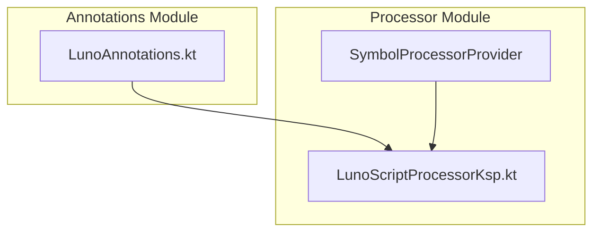
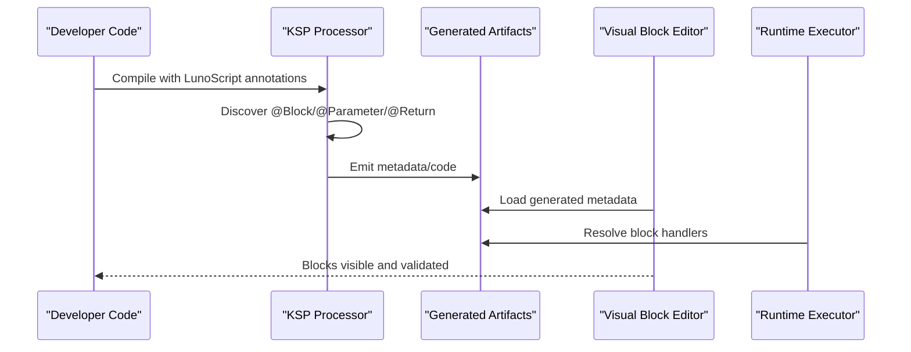
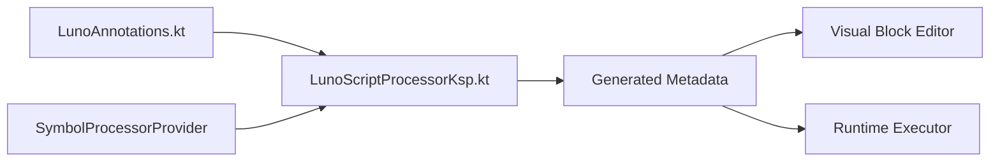

# Custom Block API

<cite>
**Referenced Files in This Document**
- [LunoAnnotations.kt](file://lunoscript-annotations/src/main/java/com/danvexteam/lunoscript_annotations/LunoAnnotations.kt)
- [LunoScriptProcessorKsp.kt](file://lunoscript-processor/src/main/java/com/danvexteam/lunoscript_processor/LunoScriptProcessorKsp.kt)
- [SymbolProcessorProvider](file://lunoscript-processor/src/main/resources/META-INF/services/com.google.devtools.ksp.processing.SymbolProcessorProvider)
</cite>

## Table of Contents
1. [Introduction](#introduction)
2. [Project Structure](#project-structure)
3. [Core Components](#core-components)
4. [Architecture Overview](#architecture-overview)
5. [Detailed Component Analysis](#detailed-component-analysis)
6. [Dependency Analysis](#dependency-analysis)
7. [Performance Considerations](#performance-considerations)
8. [Troubleshooting Guide](#troubleshooting-guide)
9. [Conclusion](#conclusion)

## Introduction
This document explains NewCatroid’s custom block creation API built on the LunoScript annotation system. It covers how to define blocks using annotations, how parameters and return types are declared, how execution context is provided at runtime, and how the KSP-based processor integrates with the visual block editor. The goal is to enable developers to author type-safe, well-validated blocks that integrate seamlessly into the editor and runtime.

## Project Structure
The custom block API spans two primary modules:
- Annotations module: Declares the LunoScript annotations used to describe blocks, parameters, and return values.
- Processor module: A KSP symbol processor that reads annotated symbols and generates code or metadata consumed by the runtime and editor.

**Diagram sources**
- [LunoAnnotations.kt](file://lunoscript-annotations/src/main/java/com/danvexteam/lunoscript_annotations/LunoAnnotations.kt)
- [LunoScriptProcessorKsp.kt](file://lunoscript-processor/src/main/java/com/danvexteam/lunoscript_processor/LunoScriptProcessorKsp.kt)
- [SymbolProcessorProvider](file://lunoscript-processor/src/main/resources/META-INF/services/com.google.devtools.ksp.processing.SymbolProcessorProvider)

**Section sources**
- [LunoAnnotations.kt](file://lunoscript-annotations/src/main/java/com/danvexteam/lunoscript_annotations/LunoAnnotations.kt)
- [LunoScriptProcessorKsp.kt](file://lunoscript-processor/src/main/java/com/danvexteam/lunoscript_processor/LunoScriptProcessorKsp.kt)
- [SymbolProcessorProvider](file://lunoscript-processor/src/main/resources/META-INF/services/com.google.devtools.ksp.processing.SymbolProcessorProvider)

## Core Components
- Annotation definitions for blocks, parameters, and return types.
- KSP processor that discovers annotated symbols and produces artifacts for the runtime/editor.
- Service provider registration enabling KSP to load the processor automatically.

Key responsibilities:
- Annotations: Declare intent (block type), parameter constraints, and return value semantics.
- Processor: Validate annotations, generate code/metadata, and wire blocks into the editor/runtime.

**Section sources**
- [LunoAnnotations.kt](file://lunoscript-annotations/src/main/java/com/danvexteam/lunoscript_annotations/LunoAnnotations.kt)
- [LunoScriptProcessorKsp.kt](file://lunoscript-processor/src/main/java/com/danvexteam/lunoscript_processor/LunoScriptProcessorKsp.kt)
- [SymbolProcessorProvider](file://lunoscript-processor/src/main/resources/META-INF/services/com.google.devtools.ksp.processing.SymbolProcessorProvider)

## Architecture Overview
At build time, the KSP processor scans source files for LunoScript annotations. It validates declarations, resolves types, and emits generated code or metadata. At runtime, the visual block editor consumes this metadata to render blocks, validate inputs, and invoke implementations.

**Diagram sources**
- [LunoScriptProcessorKsp.kt](file://lunoscript-processor/src/main/java/com/danvexteam/lunoscript_processor/LunoScriptProcessorKsp.kt)
- [SymbolProcessorProvider](file://lunoscript-processor/src/main/resources/META-INF/services/com.google.devtools.ksp.processing.SymbolProcessorProvider)

## Detailed Component Analysis

### LunoScript Annotation System
The annotation layer defines the contract between developer code and the generated artifacts. Typical elements include:
- Block-level annotation: Declares a new block, its category, visibility, and metadata.
- Parameter annotation: Describes input slots, default values, validation rules, and UI hints.
- Return annotation: Specifies output type and behavior for reporter/boolean blocks.
- Execution context annotations: Provide access to runtime services, stage state, and environment during invocation.

Design considerations:
- Use stable identifiers for block names and categories to ensure compatibility across versions.
- Keep parameter descriptions concise and localized-friendly if needed.
- Prefer primitive or immutable types for parameters where possible to simplify serialization and validation.

Best practices:
- Group related blocks under consistent categories.
- Avoid heavy computation inside block methods; delegate to background tasks when necessary.
- Document side effects explicitly via annotations or comments to aid editor tooltips.

**Section sources**
- [LunoAnnotations.kt](file://lunoscript-annotations/src/main/java/com/danvexteam/lunoscript_annotations/LunoAnnotations.kt)

### KSP-Based Processor
The processor implements a SymbolProcessorProvider and a KSP processor to:
- Parse annotated symbols.
- Validate annotation usage and parameter constraints.
- Generate code or metadata consumed by the editor and runtime.

Processing flow:
- Registration via META-INF service file enables automatic discovery.
- On compilation, the processor iterates over annotated declarations.
- It performs type resolution and constraint checks, then writes outputs.

Error handling:
- Emit compile-time errors for invalid annotations or incompatible types.
- Provide clear messages indicating which annotation and symbol caused the failure.

Integration points:
- Generated artifacts are consumed by the visual block editor for rendering and validation.
- Runtime executor uses generated metadata to locate and invoke block handlers.

**Section sources**
- [LunoScriptProcessorKsp.kt](file://lunoscript-processor/src/main/java/com/danvexteam/lunoscript_processor/LunoScriptProcessorKsp.kt)
- [SymbolProcessorProvider](file://lunoscript-processor/src/main/resources/META-INF/services/com.google.devtools.ksp.processing.SymbolProcessorProvider)

### Block Definition Schema
A block definition typically includes:
- Identifier/name for the block.
- Category grouping for editor organization.
- Parameter list with types, defaults, and validation rules.
- Return type specification for reporter/boolean blocks.
- Optional flags for async execution, threading model, and editor hints.

Validation rules:
- Parameter types must be resolvable and compatible with editor representations.
- Defaults must be serializable and within allowed ranges.
- Return types must match expected editor slots (e.g., number, string, boolean).

Type-safe implementation patterns:
- Use strongly-typed parameters and returns to avoid runtime casting.
- Encapsulate complex logic in helper functions outside the block method body.
- Separate I/O-bound operations from CPU-bound work to keep the editor responsive.

Practical examples:
- Action blocks: Perform side effects without returning values.
- Reporter blocks: Compute and return a single value.
- Boolean blocks: Evaluate conditions and return true/false.

Note: Refer to the annotation files for exact parameter names and supported options.

**Section sources**
- [LunoAnnotations.kt](file://lunoscript-annotations/src/main/java/com/danvexteam/lunoscript_annotations/LunoAnnotations.kt)

### Execution Context and Lifecycle
Execution context provides access to runtime services such as stage state, audio, network, and text utilities. The processor-generated metadata exposes these services to block implementations.

Lifecycle overview:
- Build time: Annotations are processed and metadata is generated.
- Editor load time: Metadata is parsed to render blocks and validate inputs.
- Runtime invocation: The executor resolves the handler, injects context, and calls the block method.

Context access:
- Use provided context objects to read/write stage properties, trigger events, or interact with services.
- Avoid holding long-lived references to context objects beyond the block execution scope.

Error handling patterns:
- Throw typed exceptions for recoverable errors; let the runtime surface user-friendly messages.
- For non-recoverable errors, log details and fail fast to prevent inconsistent state.

Debugging techniques:
- Enable verbose logging in development builds.
- Use structured error messages including block name and parameter values.
- Add unit tests around block logic to catch regressions early.

**Section sources**
- [LunoScriptProcessorKsp.kt](file://lunoscript-processor/src/main/java/com/danvexteam/lunoscript_processor/LunoScriptProcessorKsp.kt)

### Integration with the Visual Block Editor
The editor consumes generated metadata to:
- Display blocks in appropriate categories.
- Render parameter slots with correct types and validation.
- Enforce constraints (e.g., numeric ranges, required fields).
- Provide tooltips and help text derived from annotation metadata.

Editor workflow:
- Load metadata at startup.
- Populate block palette based on categories and visibility flags.
- Validate user inputs before invoking runtime handlers.

**Section sources**
- [LunoScriptProcessorKsp.kt](file://lunoscript-processor/src/main/java/com/danvexteam/lunoscript_processor/LunoScriptProcessorKsp.kt)

## Dependency Analysis
The processor depends on the annotations module and KSP APIs. The service provider registration ensures the processor is discovered by the Kotlin compiler plugin pipeline.

**Diagram sources**
- [LunoAnnotations.kt](file://lunoscript-annotations/src/main/java/com/danvexteam/lunoscript_annotations/LunoAnnotations.kt)
- [LunoScriptProcessorKsp.kt](file://lunoscript-processor/src/main/java/com/danvexteam/lunoscript_processor/LunoScriptProcessorKsp.kt)
- [SymbolProcessorProvider](file://lunoscript-processor/src/main/resources/META-INF/services/com.google.devtools.ksp.processing.SymbolProcessorProvider)

**Section sources**
- [LunoAnnotations.kt](file://lunoscript-annotations/src/main/java/com/danvexteam/lunoscript_annotations/LunoAnnotations.kt)
- [LunoScriptProcessorKsp.kt](file://lunoscript-processor/src/main/java/com/danvexteam/lunoscript_processor/LunoScriptProcessorKsp.kt)
- [SymbolProcessorProvider](file://lunoscript-processor/src/main/resources/META-INF/services/com.google.devtools.ksp.processing.SymbolProcessorProvider)

## Performance Considerations
- Minimize allocations inside block methods; reuse objects when safe.
- Avoid blocking the main thread; offload heavy work to background executors.
- Cache expensive computations and invalidate caches appropriately.
- Keep metadata small and focused to reduce editor startup time.
- Prefer immutable data structures for parameters and return values.

[No sources needed since this section provides general guidance]

## Troubleshooting Guide
Common issues and resolutions:
- Missing processor registration: Ensure the service provider file exists and is correctly packaged.
- Annotation mismatches: Verify parameter types and return types align with editor expectations.
- Runtime errors: Log detailed context information and validate inputs early.
- Build failures: Review KSP error logs for specific annotation violations.

Diagnostic steps:
- Check generated artifacts for correctness.
- Run minimal test projects isolating problematic blocks.
- Enable debug logging in both processor and runtime.

**Section sources**
- [LunoScriptProcessorKsp.kt](file://lunoscript-processor/src/main/java/com/danvexteam/lunoscript_processor/LunoScriptProcessorKsp.kt)

## Conclusion
NewCatroid’s LunoScript annotation system provides a robust, type-safe way to define custom blocks that integrate with the visual editor and runtime. By leveraging annotations for declaration, a KSP processor for validation and generation, and clear execution context patterns, developers can create reliable, high-performance blocks. Follow best practices for parameter validation, error handling, and performance to deliver a smooth user experience.

[No sources needed since this section summarizes without analyzing specific files]