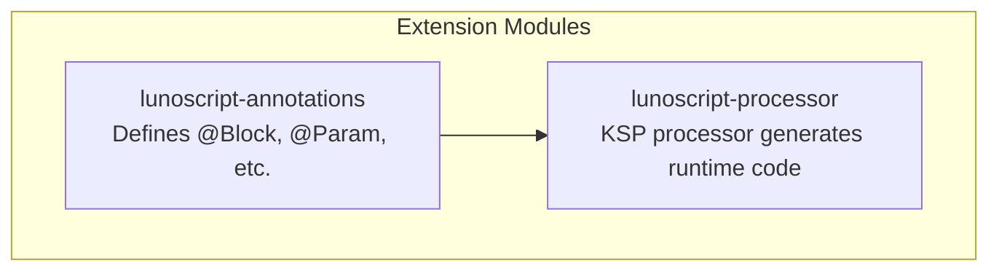
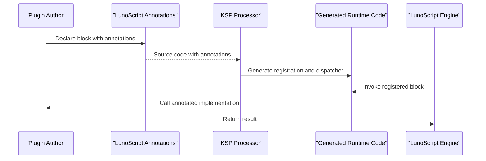
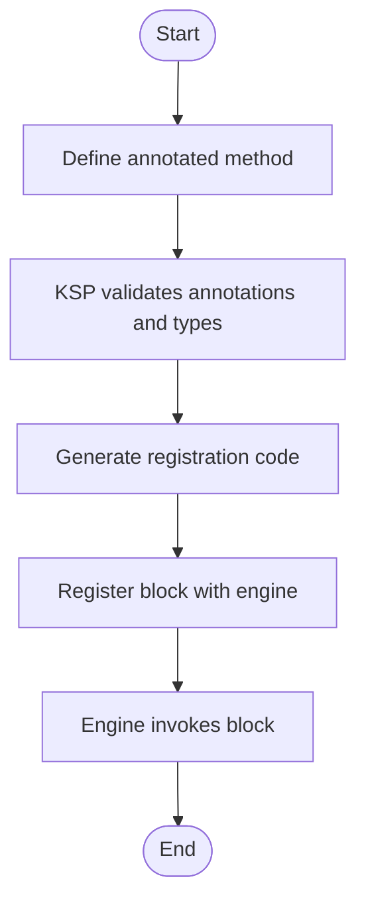
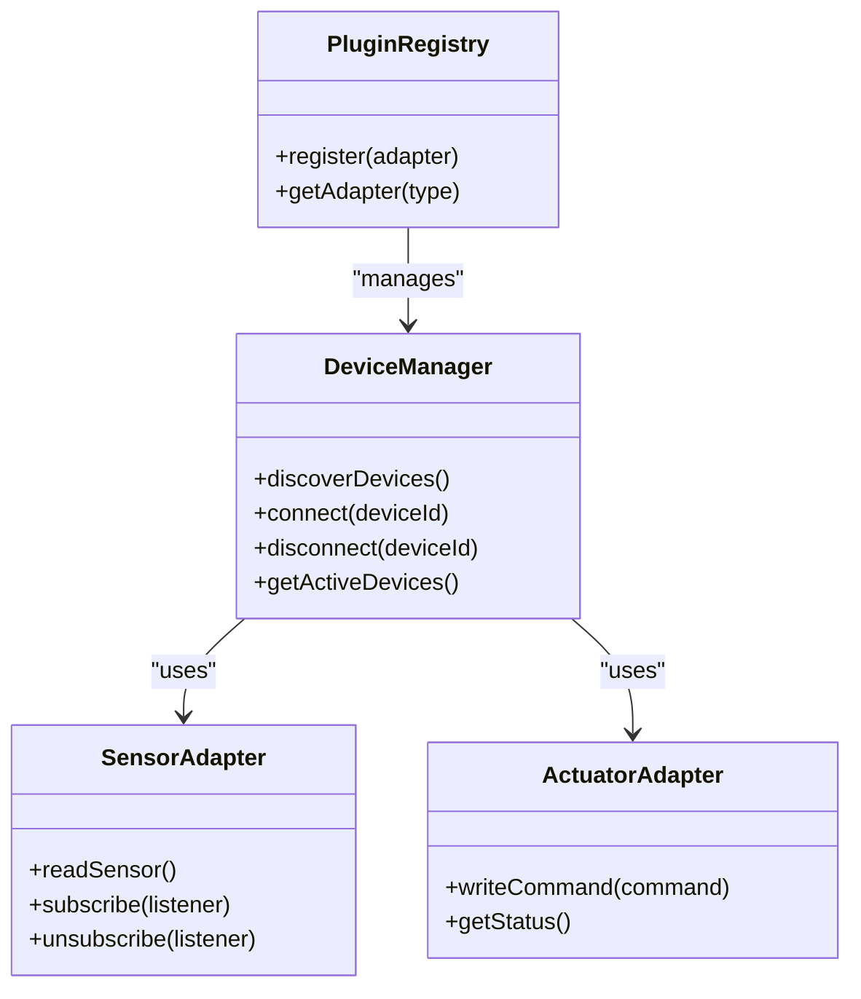
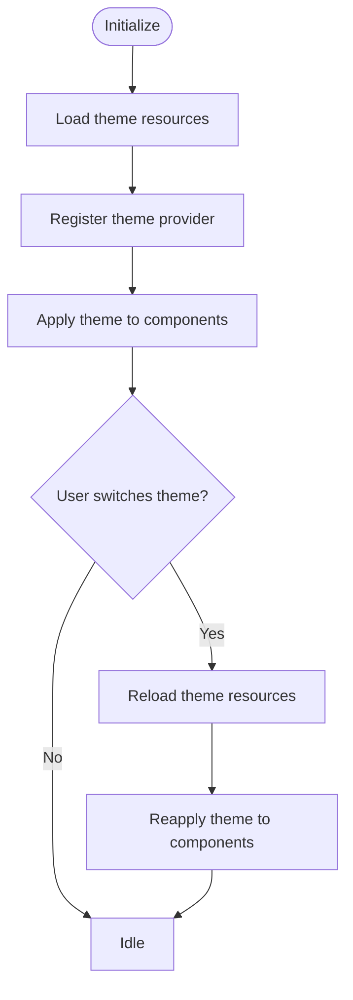
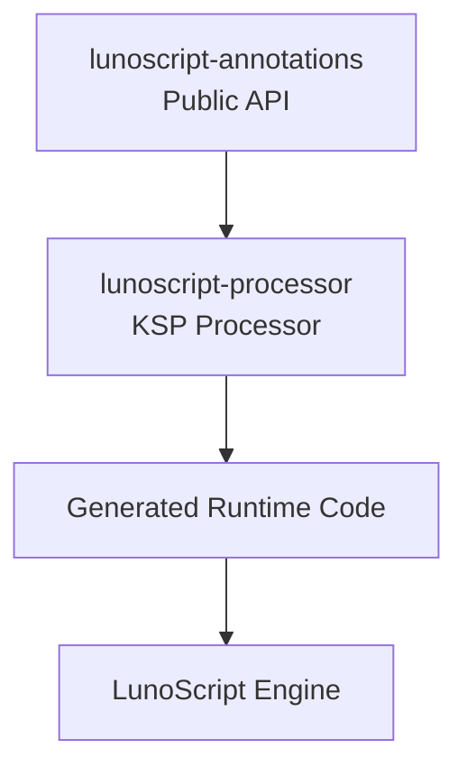

# Extension APIs

<cite>
**Referenced Files in This Document**
- [LunoAnnotations.kt](file://lunoscript-annotations/src/main/java/com/danvexteam/lunoscript_annotations/LunoAnnotations.kt)
- [LunoScriptProcessorKsp.kt](file://lunoscript-processor/src/main/java/com/danvexteam/lunoscript_processor/LunoScriptProcessorKsp.kt)
- [build.gradle](file://lunoscript-annotations/build.gradle)
- [build.gradle](file://lunoscript-processor/build.gradle)
</cite>

## Table of Contents
1. [Introduction](#introduction)
2. [Project Structure](#project-structure)
3. [Core Components](#core-components)
4. [Architecture Overview](#architecture-overview)
5. [Detailed Component Analysis](#detailed-component-analysis)
6. [Dependency Analysis](#dependency-analysis)
7. [Performance Considerations](#performance-considerations)
8. [Troubleshooting Guide](#troubleshooting-guide)
9. [Conclusion](#conclusion)
10. [Appendices](#appendices)

## Introduction
This document describes the extension APIs exposed by NewCatroid for building plugins and integrations. It focuses on three areas:
- Custom block creation API using LunoScript annotations, including block definition schemas, parameter handling, execution context access, and type-safe implementation via a KSP-based annotation processor.
- Hardware adapter API for supporting new devices and sensors, covering device discovery, connection management, sensor data processing, and actuator control interfaces.
- Theme customization API for UI appearance modifications, including style definitions, component overrides, and dynamic theming.

Where applicable, this guide provides method signatures, annotation parameters, return values, and practical examples to help you implement custom blocks, integrate hardware, and customize the user interface.

## Project Structure
The extension-related code is primarily organized into two modules:
- lunoscript-annotations: Declares the public annotations used to define custom blocks and their metadata.
- lunoscript-processor: Implements the KSP annotation processor that reads these annotations and generates runtime glue code.

**Diagram sources**
- [LunoAnnotations.kt](file://lunoscript-annotations/src/main/java/com/danvexteam/lunoscript_annotations/LunoAnnotations.kt)
- [LunoScriptProcessorKsp.kt](file://lunoscript-processor/src/main/java/com/danvexteam/lunoscript_processor/LunoScriptProcessorKsp.kt)

**Section sources**
- [LunoAnnotations.kt](file://lunoscript-annotations/src/main/java/com/danvexteam/lunoscript_annotations/LunoAnnotations.kt)
- [LunoScriptProcessorKsp.kt](file://lunoscript-processor/src/main/java/com/danvexteam/lunoscript_processor/LunoScriptProcessorKsp.kt)

## Core Components
- Block Definition Annotations: Provide metadata for custom blocks such as name, category, description, and parameter specifications.
- Parameter Handling: Annotate function parameters with types and constraints; the processor validates and maps them to LunoScript types at compile time.
- Execution Context Access: The generated runtime exposes an execution context object to your block implementation, enabling access to variables, stage state, and services.
- Type-Safe Implementation: Using Kotlin/Java classes annotated with the provided annotations, you implement block logic that is validated during compilation.

Practical example (conceptual):
- Define a block named “Set LED Brightness” with parameters for pin number and brightness percentage.
- Use the execution context to read current project variables if needed.
- Call into a hardware adapter to write the PWM value to the specified pin.

[No sources needed since this section provides general guidance]

## Architecture Overview
The extension system follows an annotation-driven architecture:
- Authors annotate functions or methods with block metadata.
- The KSP processor scans annotated symbols and generates runtime registration code.
- At runtime, the generated code registers blocks with the LunoScript engine and dispatches calls to your implementations.

**Diagram sources**
- [LunoAnnotations.kt](file://lunoscript-annotations/src/main/java/com/danvexteam/lunoscript_annotations/LunoAnnotations.kt)
- [LunoScriptProcessorKsp.kt](file://lunoscript-processor/src/main/java/com/danvexteam/lunoscript_processor/LunoScriptProcessorKsp.kt)

## Detailed Component Analysis

### Custom Block Creation API
This API enables you to create custom blocks that are callable from LunoScript scripts.

Key concepts:
- Block schema: Defined via annotations on a function/method. Includes fields like name, category, description, and parameter list.
- Parameters: Each parameter is annotated with its type and optional constraints. The processor ensures type safety and generates conversion code between LunoScript types and your language types.
- Execution context: Your implementation receives an execution context instance that provides access to variables, stage objects, and services available at runtime.
- Return values: The annotated function returns a value compatible with LunoScript types.

Method signature guidelines:
- Function name: Mapped to the block’s display name via annotation.
- Parameters: Annotated with type information; primitive and reference types supported based on processor capabilities.
- Return type: Must be a supported LunoScript-compatible type.

Example workflow:
- Create a class implementing your block logic.
- Annotate the method with block metadata and parameter annotations.
- Build the module; the processor generates registration code.
- Load the plugin at runtime; the block becomes available in the editor and runtime.

**Diagram sources**
- [LunoAnnotations.kt](file://lunoscript-annotations/src/main/java/com/danvexteam/lunoscript_annotations/LunoAnnotations.kt)
- [LunoScriptProcessorKsp.kt](file://lunoscript-processor/src/main/java/com/danvexteam/lunoscript_processor/LunoScriptProcessorKsp.kt)

**Section sources**
- [LunoAnnotations.kt](file://lunoscript-annotations/src/main/java/com/danvexteam/lunoscript_annotations/LunoAnnotations.kt)
- [LunoScriptProcessorKsp.kt](file://lunoscript-processor/src/main/java/com/danvexteam/lunoscript_processor/LunoScriptProcessorKsp.kt)

### Hardware Adapter API
This API allows you to support new devices and sensors within NewCatroid.

Core responsibilities:
- Device Discovery: Implement discovery mechanisms for Bluetooth, USB, Wi-Fi, or other transports.
- Connection Management: Handle connect, disconnect, reconnection, and lifecycle events.
- Sensor Data Processing: Read raw sensor data, apply calibration/filtering, and expose normalized values.
- Actuator Control: Write commands to actuators (e.g., motors, LEDs, servos) with appropriate safety checks.

Typical interfaces and patterns:
- DeviceManager: Central registry for discovered devices and active connections.
- SensorAdapter: Abstracts reading sensor data and emitting updates.
- ActuatorAdapter: Abstracts writing control commands to devices.
- Event Bus: Emits sensor readings and device status changes to subscribers.

Integration points:
- Registration: Plugins register adapters with the core at startup.
- Lifecycle: Adapters manage device lifecycle and resource cleanup.
- Threading: Ensure I/O operations run off the main thread; post results back to UI threads when necessary.

Example workflow:
- Implement a sensor adapter for a new temperature sensor.
- Discover devices via BLE scanning.
- Connect to the device and subscribe to sensor streams.
- Publish processed readings through the event bus.
- Expose a custom block to read the latest temperature value.

**Diagram sources**
- [LunoAnnotations.kt](file://lunoscript-annotations/src/main/java/com/danvexteam/lunoscript_annotations/LunoAnnotations.kt)
- [LunoScriptProcessorKsp.kt](file://lunoscript-processor/src/main/java/com/danvexteam/lunoscript_processor/LunoScriptProcessorKsp.kt)

**Section sources**
- [LunoAnnotations.kt](file://lunoscript-annotations/src/main/java/com/danvexteam/lunoscript_annotations/LunoAnnotations.kt)
- [LunoScriptProcessorKsp.kt](file://lunoscript-processor/src/main/java/com/danvexteam/lunoscript_processor/LunoScriptProcessorKsp.kt)

### Theme Customization API
This API enables dynamic theming and UI appearance modifications.

Key capabilities:
- Style Definitions: Define color palettes, typography, spacing, and component styles.
- Component Overrides: Replace default components with themed variants.
- Dynamic Theming: Switch themes at runtime and propagate changes across the UI.

Implementation approach:
- Create theme resources and style descriptors.
- Register theme providers with the UI framework.
- Apply theme changes dynamically by updating style contexts.

Example workflow:
- Define a light and dark theme with distinct colors and fonts.
- Provide a theme switcher in settings.
- Update UI components when the theme changes without restarting the app.

[No sources needed since this section provides general guidance]

## Dependency Analysis
The extension system relies on a clear separation between annotation declarations and code generation:
- lunoscript-annotations defines the public surface area for plugin authors.
- lunoscript-processor consumes those annotations and produces runtime code consumed by the LunoScript engine.

**Diagram sources**
- [LunoAnnotations.kt](file://lunoscript-annotations/src/main/java/com/danvexteam/lunoscript_annotations/LunoAnnotations.kt)
- [LunoScriptProcessorKsp.kt](file://lunoscript-processor/src/main/java/com/danvexteam/lunoscript_processor/LunoScriptProcessorKsp.kt)

**Section sources**
- [build.gradle](file://lunoscript-annotations/build.gradle)
- [build.gradle](file://lunoscript-processor/build.gradle)

## Performance Considerations
- Minimize heavy work inside block implementations; delegate long-running tasks to background threads.
- Cache frequently accessed execution context data where safe.
- Avoid excessive allocations in hot paths; reuse buffers and objects when possible.
- Batch sensor updates to reduce event overhead.
- Ensure UI updates occur on the main thread to prevent jank.

[No sources needed since this section provides general guidance]

## Troubleshooting Guide
Common issues and resolutions:
- Annotation not recognized: Verify that the annotations module is included as a dependency and that the KSP processor is enabled.
- Type mismatch errors: Check parameter annotations and ensure they map to supported LunoScript types.
- Block not appearing in editor: Confirm that the generated registration code is present and that the plugin is loaded at runtime.
- Device connection failures: Validate permissions, transport availability, and error handling in the adapter.

Checklist:
- Dependencies declared correctly in build files.
- KSP processor configured and running.
- Generated sources compiled and packaged.
- Runtime plugin loader initialized before script execution.

**Section sources**
- [build.gradle](file://lunoscript-annotations/build.gradle)
- [build.gradle](file://lunoscript-processor/build.gradle)

## Conclusion
NewCatroid’s extension APIs provide a robust, type-safe mechanism for creating custom blocks, integrating hardware, and customizing the UI. By leveraging LunoScript annotations and a KSP-based processor, developers can author extensions that are validated at compile time and seamlessly integrated into the runtime. Following the patterns and best practices outlined here will help you build reliable, performant, and maintainable extensions.

[No sources needed since this section summarizes without analyzing specific files]

## Appendices

### Practical Examples

#### Example: Creating a Custom Block
- Define an annotated method with block metadata and typed parameters.
- Use the execution context to access variables and stage state.
- Return a value compatible with LunoScript.

Steps:
- Add the annotations module as a dependency.
- Implement the block logic in a class.
- Build to generate registration code.
- Load the plugin at runtime.

**Section sources**
- [LunoAnnotations.kt](file://lunoscript-annotations/src/main/java/com/danvexteam/lunoscript_annotations/LunoAnnotations.kt)
- [LunoScriptProcessorKsp.kt](file://lunoscript-processor/src/main/java/com/danvexteam/lunoscript_processor/LunoScriptProcessorKsp.kt)

#### Example: Integrating a New Sensor
- Implement a sensor adapter with discovery and connection management.
- Subscribe to sensor streams and publish processed readings.
- Expose a custom block to read the latest sensor value.

Steps:
- Implement DeviceManager integration.
- Implement SensorAdapter and ActuatorAdapter.
- Register adapters with the plugin registry.
- Create a custom block to access sensor data.

**Section sources**
- [LunoAnnotations.kt](file://lunoscript-annotations/src/main/java/com/danvexteam/lunoscript_annotations/LunoAnnotations.kt)
- [LunoScriptProcessorKsp.kt](file://lunoscript-processor/src/main/java/com/danvexteam/lunoscript_processor/LunoScriptProcessorKsp.kt)

#### Example: Applying a Dynamic Theme
- Define theme resources and style descriptors.
- Register a theme provider with the UI framework.
- Switch themes at runtime and update components.

Steps:
- Create theme assets.
- Implement theme switching logic.
- Apply theme changes to existing components.

**Section sources**
- [LunoAnnotations.kt](file://lunoscript-annotations/src/main/java/com/danvexteam/lunoscript_annotations/LunoAnnotations.kt)
- [LunoScriptProcessorKsp.kt](file://lunoscript-processor/src/main/java/com/danvexteam/lunoscript_processor/LunoScriptProcessorKsp.kt)