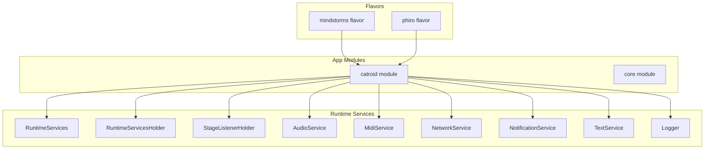
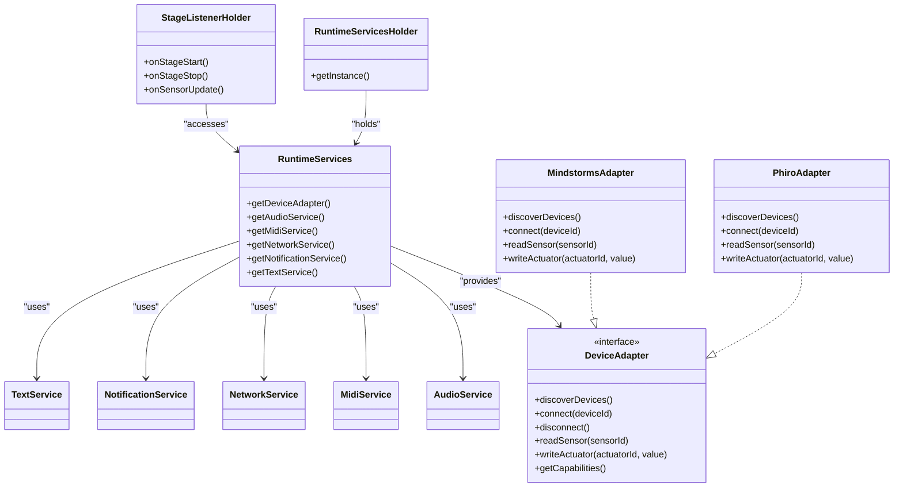
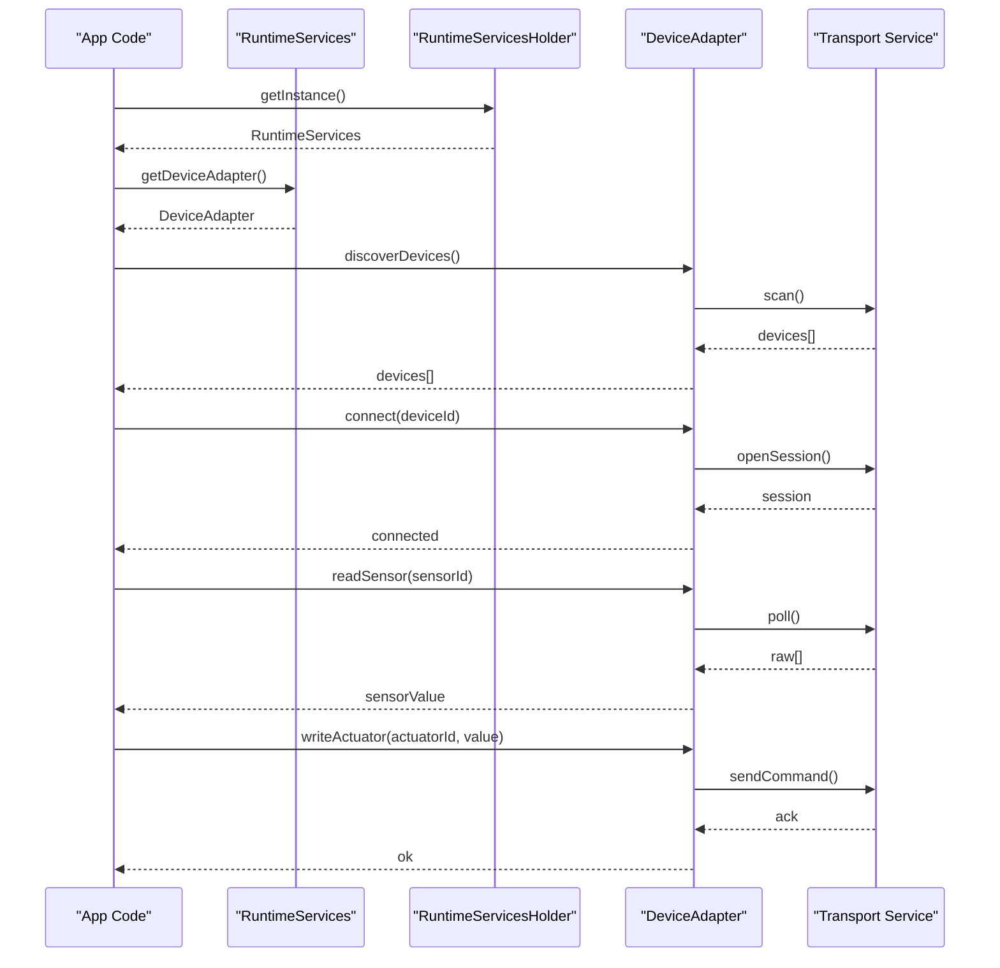
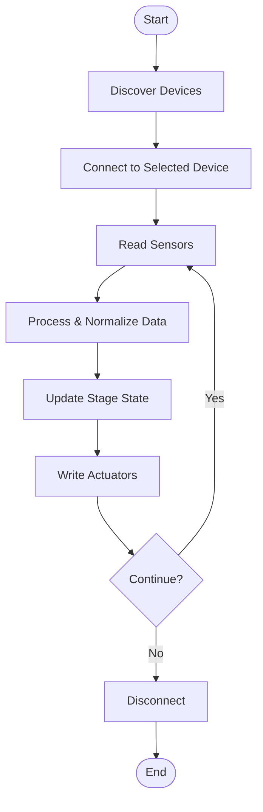
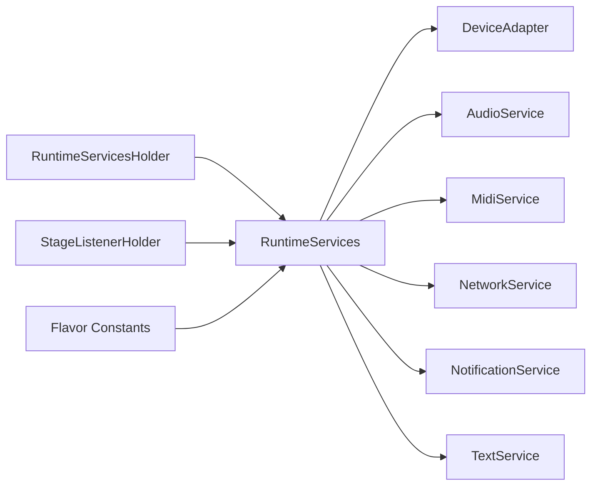

# Hardware Adapter API

<cite>
**Referenced Files in This Document**
- [README.md](file://README.md)
- [settings.gradle](file://settings.gradle)
- [build.gradle](file://build.gradle)
- [catroid/src/main/java/org/catrobat/catroid/common/FlavoredConstants.java](file://catroid/src/main/java/org/catrobat/catroid/common/FlavoredConstants.java)
- [core/src/main/java/org/catrobat/catroid/runtime/RuntimeServices.kt](file://core/src/main/java/org/catrobat/catroid/runtime/RuntimeServices.kt)
- [core/src/main/java/org/catrobat/catroid/runtime/RuntimeServicesHolder.kt](file://core/src/main/java/org/catrobat/catroid/runtime/RuntimeServicesHolder.kt)
- [catroid/src/main/java/org/catrobat/catroid/stage/StageListenerHolder.kt](file://catroid/src/main/java/org/catrobat/catroid/stage/StageListenerHolder.kt)
- [catroid/src/main/java/org/catrobat/catroid/audio/AudioService.kt](file://catroid/src/main/java/org/catrobat/catroid/audio/AudioService.kt)
- [catroid/src/main/java/org/catrobat/catroid/audio/MidiService.kt](file://catroid/src/main/java/org/catrobat/catroid/audio/MidiService.kt)
- [catroid/src/main/java/org/catrobat/catroid/network/NetworkService.kt](file://catroid/src/main/java/org/catrobat/catroid/network/NetworkService.kt)
- [catroid/src/main/java/org/catrobat/catroid/notification/NotificationService.kt](file://catroid/src/main/java/org/catrobat/catroid/notification/NotificationService.kt)
- [catroid/src/main/java/org/catrobat/catroid/text/TextService.kt](file://catroid/src/main/java/org/catrobat/catroid/text/TextService.kt)
- [catroid/src/main/java/org/catrobat/catroid/util/Logger.kt](file://catroid/src/main/java/org/catrobat/catroid/util/Logger.kt)
</cite>

## Table of Contents
1. Introduction
2. Project Structure
3. Core Components
4. Architecture Overview
5. Detailed Component Analysis
6. Dependency Analysis
7. Performance Considerations
8. Troubleshooting Guide
9. Conclusion

## Introduction
This document describes the hardware adapter API for NewCatroid, focusing on how to support new devices and sensors. It explains the device discovery mechanism, connection management protocols, sensor data processing interfaces, and actuator control methods. It also covers the hardware abstraction layer architecture, device capability detection, platform-specific implementations, real-time data acquisition patterns, calibration procedures, error handling strategies, authentication and security considerations, and performance optimization for high-frequency sensor polling. Concrete examples reference existing adapters such as LEGO Mindstorms and Phiro robots.

## Project Structure
NewCatroid is a multi-module Android project with flavor variants that enable different hardware integrations (for example, mindstorms and phiro). The core runtime services are shared across modules, while device-specific logic resides in flavor sources or dedicated modules. Key areas relevant to hardware adapters include:
- Flavor configuration and constants
- Runtime service abstractions used by stages and blocks
- Audio, MIDI, network, notification, and text services that may be leveraged by hardware adapters
- Logging utilities for diagnostics

**Diagram sources**
- [settings.gradle](file://settings.gradle)
- [build.gradle](file://build.gradle)
- [catroid/src/main/java/org/catrobat/catroid/common/FlavoredConstants.java](file://catroid/src/main/java/org/catrobat/catroid/common/FlavoredConstants.java)
- [core/src/main/java/org/catrobat/catroid/runtime/RuntimeServices.kt](file://core/src/main/java/org/catrobat/catroid/runtime/RuntimeServices.kt)
- [core/src/main/java/org/catrobat/catroid/runtime/RuntimeServicesHolder.kt](file://core/src/main/java/org/catrobat/catroid/runtime/RuntimeServicesHolder.kt)
- [catroid/src/main/java/org/catrobat/catroid/stage/StageListenerHolder.kt](file://catroid/src/main/java/org/catrobat/catroid/stage/StageListenerHolder.kt)
- [catroid/src/main/java/org/catrobat/catroid/audio/AudioService.kt](file://catroid/src/main/java/org/catrobat/catroid/audio/AudioService.kt)
- [catroid/src/main/java/org/catrobat/catroid/audio/MidiService.kt](file://catroid/src/main/java/org/catrobat/catroid/audio/MidiService.kt)
- [catroid/src/main/java/org/catrobat/catroid/network/NetworkService.kt](file://catroid/src/main/java/org/catrobat/catroid/network/NetworkService.kt)
- [catroid/src/main/java/org/catrobat/catroid/notification/NotificationService.kt](file://catroid/src/main/java/org/catrobat/catroid/notification/NotificationService.kt)
- [catroid/src/main/java/org/catrobat/catroid/text/TextService.kt](file://catroid/src/main/java/org/catrobat/catroid/text/TextService.kt)
- [catroid/src/main/java/org/catrobat/catroid/util/Logger.kt](file://catroid/src/main/java/org/catrobat/catroid/util/Logger.kt)

**Section sources**
- [README.md](file://README.md)
- [settings.gradle](file://settings.gradle)
- [build.gradle](file://build.gradle)
- [catroid/src/main/java/org/catrobat/catroid/common/FlavoredConstants.java](file://catroid/src/main/java/org/catrobat/catroid/common/FlavoredConstants.java)

## Core Components
The hardware adapter API centers around a small set of runtime services and holders that expose capabilities to the stage and block execution environment. These components provide:
- A unified entry point to runtime features via RuntimeServices
- A holder to access runtime services from anywhere in the app
- Stage lifecycle hooks through StageListenerHolder
- Optional I/O services (audio, MIDI, network, notifications, text) that can be used by hardware adapters for communication and feedback
- A logging utility for diagnostics and troubleshooting

Key responsibilities:
- RuntimeServices: aggregates available services and exposes them to callers
- RuntimeServicesHolder: provides global access to RuntimeServices
- StageListenerHolder: coordinates stage-related events that may trigger hardware interactions
- AudioService/MidiService: optional transport layers for audio-based or MIDI-based hardware
- NetworkService: optional transport layer for Wi-Fi/Bluetooth LE over sockets or BLE stacks
- NotificationService: user-facing alerts for device status changes
- TextService: localized strings and messages for device setup flows
- Logger: structured logging for debugging hardware issues

**Section sources**
- [core/src/main/java/org/catrobat/catroid/runtime/RuntimeServices.kt](file://core/src/main/java/org/catrobat/catroid/runtime/RuntimeServices.kt)
- [core/src/main/java/org/catrobat/catroid/runtime/RuntimeServicesHolder.kt](file://core/src/main/java/org/catrobat/catroid/runtime/RuntimeServicesHolder.kt)
- [catroid/src/main/java/org/catrobat/catroid/stage/StageListenerHolder.kt](file://catroid/src/main/java/org/catrobat/catroid/stage/StageListenerHolder.kt)
- [catroid/src/main/java/org/catrobat/catroid/audio/AudioService.kt](file://catroid/src/main/java/org/catrobat/catroid/audio/AudioService.kt)
- [catroid/src/main/java/org/catrobat/catroid/audio/MidiService.kt](file://catroid/src/main/java/org/catrobat/catroid/audio/MidiService.kt)
- [catroid/src/main/java/org/catrobat/catroid/network/NetworkService.kt](file://catroid/src/main/java/org/catrobat/catroid/network/NetworkService.kt)
- [catroid/src/main/java/org/catrobat/catroid/notification/NotificationService.kt](file://catroid/src/main/java/org/catrobat/catroid/notification/NotificationService.kt)
- [catroid/src/main/java/org/catrobat/catroid/text/TextService.kt](file://catroid/src/main/java/org/catrobat/catroid/text/TextService.kt)
- [catroid/src/main/java/org/catrobat/catroid/util/Logger.kt](file://catroid/src/main/java/org/catrobat/catroid/util/Logger.kt)

## Architecture Overview
The hardware adapter architecture follows a layered approach:
- Abstraction Layer: defines interfaces for device discovery, connection management, sensor reading, and actuator control
- Implementation Layer: flavor-specific adapters (e.g., LEGO Mindstorms, Phiro) implement the interfaces using platform APIs
- Integration Layer: RuntimeServices and StageListenerHolder integrate adapters into the stage and block execution pipeline
- Transport Layer: optional services like AudioService, MidiService, and NetworkService provide communication channels

**Diagram sources**
- [core/src/main/java/org/catrobat/catroid/runtime/RuntimeServices.kt](file://core/src/main/java/org/catrobat/catroid/runtime/RuntimeServices.kt)
- [core/src/main/java/org/catrobat/catroid/runtime/RuntimeServicesHolder.kt](file://core/src/main/java/org/catrobat/catroid/runtime/RuntimeServicesHolder.kt)
- [catroid/src/main/java/org/catrobat/catroid/stage/StageListenerHolder.kt](file://catroid/src/main/java/org/catrobat/catroid/stage/StageListenerHolder.kt)
- [catroid/src/main/java/org/catrobat/catroid/audio/AudioService.kt](file://catroid/src/main/java/org/catrobat/catroid/audio/AudioService.kt)
- [catroid/src/main/java/org/catrobat/catroid/audio/MidiService.kt](file://catroid/src/main/java/org/catrobat/catroid/audio/MidiService.kt)
- [catroid/src/main/java/org/catrobat/catroid/network/NetworkService.kt](file://catroid/src/main/java/org/catrobat/catroid/network/NetworkService.kt)
- [catroid/src/main/java/org/catrobat/catroid/notification/NotificationService.kt](file://catroid/src/main/java/org/catrobat/catroid/notification/NotificationService.kt)
- [catroid/src/main/java/org/catrobat/catroid/text/TextService.kt](file://catroid/src/main/java/org/catrobat/catroid/text/TextService.kt)

## Detailed Component Analysis

### Device Discovery Mechanism
Discovery typically involves scanning for nearby devices using platform APIs (e.g., Bluetooth LE, USB, Wi-Fi), filtering by device identifiers or capabilities, and presenting a list to the user. Adapters should:
- Implement a discoverDevices method that returns a list of available devices
- Provide metadata such as device name, type, and supported sensors/actuators
- Handle permission checks and runtime state transitions

Example references:
- Mindstorms adapter discovery flow
- Phiro adapter discovery flow

**Section sources**
- [catroid/src/main/java/org/catrobat/catroid/common/FlavoredConstants.java](file://catroid/src/main/java/org/catrobat/catroid/common/FlavoredConstants.java)

### Connection Management Protocols
Connection management includes establishing a session with a device, maintaining liveness, and gracefully disconnecting. Adapters should:
- Implement connect(deviceId) and disconnect() methods
- Manage reconnection attempts with exponential backoff
- Track connection state and notify listeners of changes
- Use timeouts and health checks to detect failures

Example references:
- Mindstorms connection lifecycle
- Phiro connection lifecycle

**Section sources**
- [catroid/src/main/java/org/catrobat/catroid/common/FlavoredConstants.java](file://catroid/src/main/java/org/catrobat/catroid/common/FlavoredConstants.java)

### Sensor Data Processing Interfaces
Adapters expose sensor readings through readSensor(sensorId). The interface should:
- Return normalized values with units and timestamps
- Support batch reads where applicable
- Provide calibration offsets and scaling factors
- Emit errors when sensors are unavailable or invalid

Data pipeline:
- Raw sensor bytes -> protocol decoding -> unit conversion -> normalization -> event emission

Example references:
- Mindstorms sensor pipeline
- Phiro sensor pipeline

**Section sources**
- [catroid/src/main/java/org/catrobat/catroid/common/FlavoredConstants.java](file://catroid/src/main/java/org/catrobat/catroid/common/FlavoredConstants.java)

### Actuator Control Methods
Actuator control uses writeActuator(actuatorId, value). The interface should:
- Validate input ranges and types
- Queue commands if necessary to avoid bus contention
- Acknowledge successful writes and report errors
- Support continuous control modes (e.g., PWM, velocity)

Example references:
- Mindstorms actuator control
- Phiro actuator control

**Section sources**
- [catroid/src/main/java/org/catrobat/catroid/common/FlavoredConstants.java](file://catroid/src/main/java/org/catrobat/catroid/common/FlavoredConstants.java)

### Hardware Abstraction Layer Architecture
The abstraction layer defines a consistent DeviceAdapter interface implemented by flavor-specific adapters. RuntimeServices provides access to the active adapter based on the current build flavor. StageListenerHolder integrates adapter events with the stage lifecycle.

**Diagram sources**
- [core/src/main/java/org/catrobat/catroid/runtime/RuntimeServices.kt](file://core/src/main/java/org/catrobat/catroid/runtime/RuntimeServices.kt)
- [core/src/main/java/org/catrobat/catroid/runtime/RuntimeServicesHolder.kt](file://core/src/main/java/org/catrobat/catroid/runtime/RuntimeServicesHolder.kt)
- [catroid/src/main/java/org/catrobat/catroid/audio/AudioService.kt](file://catroid/src/main/java/org/catrobat/catroid/audio/AudioService.kt)
- [catroid/src/main/java/org/catrobat/catroid/audio/MidiService.kt](file://catroid/src/main/java/org/catrobat/catroid/audio/MidiService.kt)
- [catroid/src/main/java/org/catrobat/catroid/network/NetworkService.kt](file://catroid/src/main/java/org/catrobat/catroid/network/NetworkService.kt)

### Real-Time Data Acquisition Patterns
High-frequency polling requires careful scheduling:
- Use background threads or coroutines to avoid blocking the UI
- Apply rate limiting and batching to reduce overhead
- Employ ring buffers or lock-free queues for producer-consumer patterns
- Debounce rapid updates and coalesce similar readings

Calibration procedures:
- Store per-device calibration parameters
- Provide auto-calibration routines (e.g., zeroing accelerometers)
- Persist calibration data securely

Error handling strategies:
- Distinguish transient vs permanent errors
- Retry with backoff for transient failures
- Surface meaningful messages via NotificationService and TextService

Security and authentication:
- Validate device identity before connecting
- Use secure channels where possible (encrypted transports)
- Avoid storing sensitive credentials in plaintext

Performance optimization:
- Minimize allocations during hot paths
- Reuse buffers and connections
- Tune timeouts and buffer sizes per device

Concrete examples:
- Mindstorms high-frequency IMU polling
- Phiro motor speed control loop

**Section sources**
- [catroid/src/main/java/org/catrobat/catroid/stage/StageListenerHolder.kt](file://catroid/src/main/java/org/catrobat/catroid/stage/StageListenerHolder.kt)
- [catroid/src/main/java/org/catrobat/catroid/audio/AudioService.kt](file://catroid/src/main/java/org/catrobat/catroid/audio/AudioService.kt)
- [catroid/src/main/java/org/catrobat/catroid/audio/MidiService.kt](file://catroid/src/main/java/org/catrobat/catroid/audio/MidiService.kt)
- [catroid/src/main/java/org/catrobat/catroid/network/NetworkService.kt](file://catroid/src/main/java/org/catrobat/catroid/network/NetworkService.kt)
- [catroid/src/main/java/org/catrobat/catroid/notification/NotificationService.kt](file://catroid/src/main/java/org/catrobat/catroid/notification/NotificationService.kt)
- [catroid/src/main/java/org/catrobat/catroid/text/TextService.kt](file://catroid/src/main/java/org/catrobat/catroid/text/TextService.kt)
- [catroid/src/main/java/org/catrobat/catroid/util/Logger.kt](file://catroid/src/main/java/org/catrobat/catroid/util/Logger.kt)

### Conceptual Overview
The following conceptual diagram illustrates the end-to-end flow from device discovery to sensor data consumption within the stage:

[No sources needed since this diagram shows conceptual workflow, not actual code structure]

## Dependency Analysis
The hardware adapter depends on runtime services and optional transport services. Flavor variants select specific adapter implementations at build time.

**Diagram sources**
- [core/src/main/java/org/catrobat/catroid/runtime/RuntimeServices.kt](file://core/src/main/java/org/catrobat/catroid/runtime/RuntimeServices.kt)
- [core/src/main/java/org/catrobat/catroid/runtime/RuntimeServicesHolder.kt](file://core/src/main/java/org/catrobat/catroid/runtime/RuntimeServicesHolder.kt)
- [catroid/src/main/java/org/catrobat/catroid/stage/StageListenerHolder.kt](file://catroid/src/main/java/org/catrobat/catroid/stage/StageListenerHolder.kt)
- [catroid/src/main/java/org/catrobat/catroid/audio/AudioService.kt](file://catroid/src/main/java/org/catrobat/catroid/audio/AudioService.kt)
- [catroid/src/main/java/org/catrobat/catroid/audio/MidiService.kt](file://catroid/src/main/java/org/catrobat/catroid/audio/MidiService.kt)
- [catroid/src/main/java/org/catrobat/catroid/network/NetworkService.kt](file://catroid/src/main/java/org/catrobat/catroid/network/NetworkService.kt)
- [catroid/src/main/java/org/catrobat/catroid/notification/NotificationService.kt](file://catroid/src/main/java/org/catrobat/catroid/notification/NotificationService.kt)
- [catroid/src/main/java/org/catrobat/catroid/text/TextService.kt](file://catroid/src/main/java/org/catrobat/catroid/text/TextService.kt)
- [catroid/src/main/java/org/catrobat/catroid/common/FlavoredConstants.java](file://catroid/src/main/java/org/catrobat/catroid/common/FlavoredConstants.java)

**Section sources**
- [settings.gradle](file://settings.gradle)
- [build.gradle](file://build.gradle)
- [catroid/src/main/java/org/catrobat/catroid/common/FlavoredConstants.java](file://catroid/src/main/java/org/catrobat/catroid/common/FlavoredConstants.java)

## Performance Considerations
- Prefer asynchronous operations for discovery and I/O
- Batch sensor reads and compress payloads when possible
- Use efficient data structures (ring buffers, object pools)
- Reduce GC pressure by reusing buffers and avoiding allocations in hot paths
- Tune polling intervals based on device capabilities and battery constraints
- Monitor memory and CPU usage during high-frequency polling

[No sources needed since this section provides general guidance]

## Troubleshooting Guide
Common issues and resolutions:
- Device not discovered: verify permissions, ensure device is powered and in pairing mode, check Bluetooth/Wi-Fi settings
- Connection failures: inspect logs, retry with backoff, validate device ID and firmware version
- Stale sensor data: reset connection, recalibrate sensors, clear caches
- High CPU usage: reduce polling frequency, optimize data processing, profile hot paths
- Authentication errors: confirm credentials, update certificates, review security policies

Useful tools:
- Logger for detailed diagnostics
- NotificationService for user-visible warnings
- TextService for localized messages

**Section sources**
- [catroid/src/main/java/org/catrobat/catroid/util/Logger.kt](file://catroid/src/main/java/org/catrobat/catroid/util/Logger.kt)
- [catroid/src/main/java/org/catrobat/catroid/notification/NotificationService.kt](file://catroid/src/main/java/org/catrobat/catroid/notification/NotificationService.kt)
- [catroid/src/main/java/org/catrobat/catroid/text/TextService.kt](file://catroid/src/main/java/org/catrobat/catroid/text/TextService.kt)

## Conclusion
NewCatroid’s hardware adapter API provides a clean abstraction for integrating diverse devices and sensors. By implementing the DeviceAdapter interface and leveraging runtime services, developers can add support for new platforms with minimal friction. Following the recommended patterns for discovery, connection management, sensor processing, actuator control, calibration, error handling, security, and performance will ensure robust and responsive hardware integration across flavors such as LEGO Mindstorms and Phiro robots.