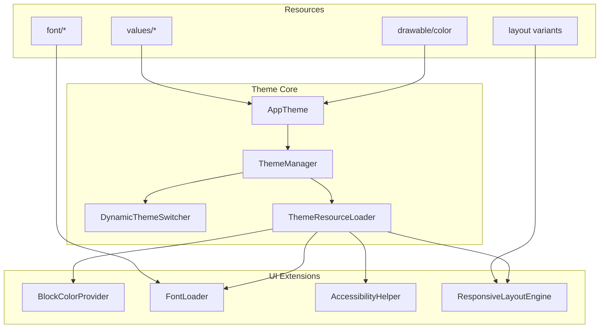
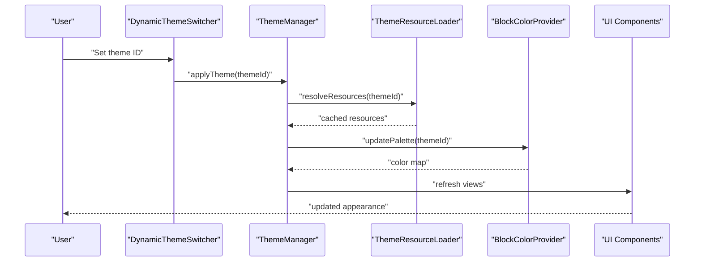
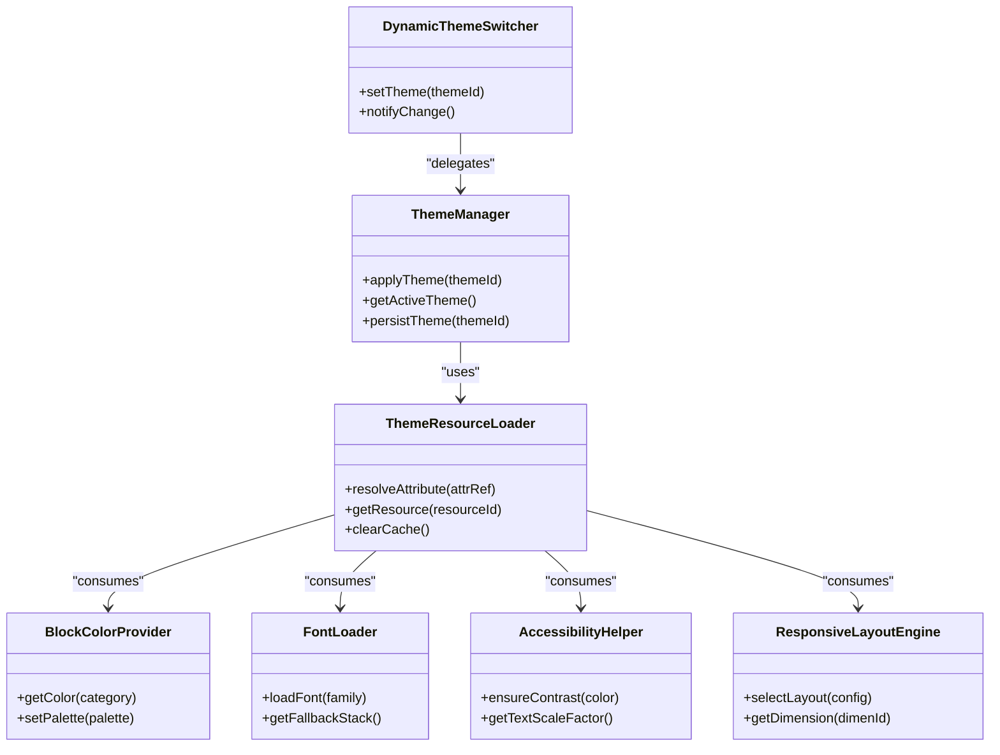

# Theme Customization API

<cite>
**Referenced Files in This Document**
- [styles.xml](file://catroid/src/main/res/values/styles.xml)
- [colors.xml](file://catroid/src/main/res/values/colors.xml)
- [dimens.xml](file://catroid/src/main/res/values/dimens.xml)
- [strings.xml](file://catroid/src/main/res/values/strings.xml)
- [themes.xml](file://catroid/src/main/res/values/themes.xml)
- [AppTheme.java](file://catroid/src/main/java/org/catrobat/catroid/ui/theme/AppTheme.java)
- [ThemeManager.java](file://catroid/src/main/java/org/catrobat/catroid/ui/theme/ThemeManager.java)
- [BlockColorProvider.java](file://catroid/src/main/java/org/catrobat/catroid/blocks/BlockColorProvider.java)
- [FontLoader.java](file://catroid/src/main/java/org/catrobat/catroid/ui/font/FontLoader.java)
- [AccessibilityHelper.java](file://catroid/src/main/java/org/catrobat/catroid/ui/accessibility/AccessibilityHelper.java)
- [ResponsiveLayoutEngine.java](file://catroid/src/main/java/org/catrobat/catroid/ui/layout/ResponsiveLayoutEngine.java)
- [ThemeResourceLoader.java](file://catroid/src/main/java/org/catrobat/catroid/ui/theme/ThemeResourceLoader.java)
- [DynamicThemeSwitcher.java](file://catroid/src/main/java/org/catrobat/catroid/ui/theme/DynamicThemeSwitcher.java)
</cite>

## Table of Contents
1. [Introduction](#introduction)
2. [Project Structure](#project-structure)
3. [Core Components](#core-components)
4. [Architecture Overview](#architecture-overview)
5. [Detailed Component Analysis](#detailed-component-analysis)
6. [Dependency Analysis](#dependency-analysis)
7. [Performance Considerations](#performance-considerations)
8. [Troubleshooting Guide](#troubleshooting-guide)
9. [Conclusion](#conclusion)
10. [Appendices](#appendices)

## Introduction
This document describes NewCatroid’s theme customization API for UI appearance modifications. It explains how style definitions, color schemes, dimension resources, and component overrides are organized and consumed at runtime. It also covers dynamic theming capabilities, runtime theme switching, responsive design patterns, internationalization support, and theme inheritance. Practical examples include customizing block colors, interface layouts, typography, and accessibility features. Finally, it addresses performance considerations for theme loading, memory optimization, and compatibility across Android versions and screen densities.

## Project Structure
NewCatroid follows standard Android resource organization with additional theme-related modules:

- Resource directories:
  - values: styles, colors, dimensions, strings, themes
  - drawable/color: drawables and color state lists
  - font: typefaces used by the app
  - layout variants: responsive layouts for different orientations and locales
- Java/Kotlin theme components:
  - AppTheme: central theme configuration entry point
  - ThemeManager: theme lifecycle and persistence
  - DynamicThemeSwitcher: runtime theme switching
  - ThemeResourceLoader: efficient resource resolution and caching
  - BlockColorProvider: block palette color management
  - FontLoader: font loading and fallbacks
  - AccessibilityHelper: contrast and text scaling helpers
  - ResponsiveLayoutEngine: density-aware layout selection

**Diagram sources**
- [styles.xml](file://catroid/src/main/res/values/styles.xml)
- [colors.xml](file://catroid/src/main/res/values/colors.xml)
- [dimens.xml](file://catroid/src/main/res/values/dimens.xml)
- [strings.xml](file://catroid/src/main/res/values/strings.xml)
- [themes.xml](file://catroid/src/main/res/values/themes.xml)
- [AppTheme.java](file://catroid/src/main/java/org/catrobat/catroid/ui/theme/AppTheme.java)
- [ThemeManager.java](file://catroid/src/main/java/org/catrobat/catroid/ui/theme/ThemeManager.java)
- [DynamicThemeSwitcher.java](file://catroid/src/main/java/org/catrobat/catroid/ui/theme/DynamicThemeSwitcher.java)
- [ThemeResourceLoader.java](file://catroid/src/main/java/org/catrobat/catroid/ui/theme/ThemeResourceLoader.java)
- [BlockColorProvider.java](file://catroid/src/main/java/org/catrobat/catroid/blocks/BlockColorProvider.java)
- [FontLoader.java](file://catroid/src/main/java/org/catrobat/catroid/ui/font/FontLoader.java)
- [AccessibilityHelper.java](file://catroid/src/main/java/org/catrobat/catroid/ui/accessibility/AccessibilityHelper.java)
- [ResponsiveLayoutEngine.java](file://catroid/src/main/java/org/catrobat/catroid/ui/layout/ResponsiveLayoutEngine.java)

**Section sources**
- [styles.xml](file://catroid/src/main/res/values/styles.xml)
- [colors.xml](file://catroid/src/main/res/values/colors.xml)
- [dimens.xml](file://catroid/src/main/res/values/dimens.xml)
- [strings.xml](file://catroid/src/main/res/values/strings.xml)
- [themes.xml](file://catroid/src/main/res/values/themes.xml)

## Core Components
- AppTheme: Centralizes theme attributes, base styles, and inheritance chains. Provides a single place to define or override visual tokens.
- ThemeManager: Manages active theme selection, persistence, and applies theme changes across the application context.
- DynamicThemeSwitcher: Exposes APIs to switch themes at runtime without restarting activities; coordinates UI refreshes.
- ThemeResourceLoader: Resolves themed resources efficiently, caches computed values, and supports fallbacks when resources are missing.
- BlockColorProvider: Supplies consistent colors for block categories and allows programmatic overrides for custom palettes.
- FontLoader: Loads fonts from assets, manages fallback stacks, and integrates with system text scaling preferences.
- AccessibilityHelper: Ensures sufficient contrast, respects user text scale, and provides high-contrast mode toggles.
- ResponsiveLayoutEngine: Selects appropriate layouts and dimensions based on screen size, orientation, and density qualifiers.

Key responsibilities:
- Define and consume theme attributes (colors, typography, spacing).
- Provide extension points for component-level overrides.
- Support dynamic updates and persistence.
- Ensure accessibility and responsiveness.

**Section sources**
- [AppTheme.java](file://catroid/src/main/java/org/catrobat/catroid/ui/theme/AppTheme.java)
- [ThemeManager.java](file://catroid/src/main/java/org/catrobat/catroid/ui/theme/ThemeManager.java)
- [DynamicThemeSwitcher.java](file://catroid/src/main/java/org/catrobat/catroid/ui/theme/DynamicThemeSwitcher.java)
- [ThemeResourceLoader.java](file://catroid/src/main/java/org/catrobat/catroid/ui/theme/ThemeResourceLoader.java)
- [BlockColorProvider.java](file://catroid/src/main/java/org/catrobat/catroid/blocks/BlockColorProvider.java)
- [FontLoader.java](file://catroid/src/main/java/org/catrobat/catroid/ui/font/FontLoader.java)
- [AccessibilityHelper.java](file://catroid/src/main/java/org/catrobat/catroid/ui/accessibility/AccessibilityHelper.java)
- [ResponsiveLayoutEngine.java](file://catroid/src/main/java/org/catrobat/catroid/ui/layout/ResponsiveLayoutEngine.java)

## Architecture Overview
The theme system is layered:
- Resource layer: XML-based definitions for styles, colors, dimensions, and strings.
- Engine layer: ThemeManager and ThemeResourceLoader orchestrate resolution and caching.
- Runtime layer: DynamicThemeSwitcher applies changes and triggers UI updates.
- Extension layer: BlockColorProvider, FontLoader, AccessibilityHelper, and ResponsiveLayoutEngine provide specialized behaviors.

**Diagram sources**
- [DynamicThemeSwitcher.java](file://catroid/src/main/java/org/catrobat/catroid/ui/theme/DynamicThemeSwitcher.java)
- [ThemeManager.java](file://catroid/src/main/java/org/catrobat/catroid/ui/theme/ThemeManager.java)
- [ThemeResourceLoader.java](file://catroid/src/main/java/org/catrobat/catroid/ui/theme/ThemeResourceLoader.java)
- [BlockColorProvider.java](file://catroid/src/main/java/org/catrobat/catroid/blocks/BlockColorProvider.java)

## Detailed Component Analysis

### Style Definitions and Inheritance
- Base styles define common attributes such as text appearance, padding, and elevation.
- Derived styles inherit from base styles and specialize for specific components (e.g., buttons, dialogs).
- Theme files declare attribute references that bind styles to concrete resources.

Best practices:
- Use semantic names for style attributes (e.g., primaryText, surfaceBackground).
- Keep inheritance shallow to avoid deep lookup costs.
- Prefer attribute references over hard-coded values.

**Section sources**
- [styles.xml](file://catroid/src/main/res/values/styles.xml)
- [themes.xml](file://catroid/src/main/res/values/themes.xml)

### Color Schemes
- Colors are defined centrally and referenced via attributes.
- State lists and selectors enable interactive feedback (pressed, focused, disabled).
- BlockColorProvider maps category identifiers to color tokens, enabling consistent block palette rendering.

Customization example paths:
- Override default block colors by updating the provider’s mapping table.
- Introduce new color tokens and reference them in styles and layouts.

**Section sources**
- [colors.xml](file://catroid/src/main/res/values/colors.xml)
- [BlockColorProvider.java](file://catroid/src/main/java/org/catrobat/catroid/blocks/BlockColorProvider.java)

### Dimension Resources
- Dimensions define spacing, icon sizes, and typography scales.
- Qualifiers allow density-specific adjustments (e.g., hdpi, xhdpi).
- ResponsiveLayoutEngine selects appropriate dimensions based on device metrics.

Guidelines:
- Use sp for text sizes and dp for layout dimensions.
- Avoid pixel values; prefer resource-backed dimensions.

**Section sources**
- [dimens.xml](file://catroid/src/main/res/values/dimens.xml)
- [ResponsiveLayoutEngine.java](file://catroid/src/main/java/org/catrobat/catroid/ui/layout/ResponsiveLayoutEngine.java)

### Typography
- Fonts are loaded via FontLoader with fallback stacks.
- Text appearance styles reference font families and weights.
- System text scaling preferences are respected through sp units and helper utilities.

Typical workflow:
- Add custom font assets.
- Register font family in theme attributes.
- Apply textAppearance styles to components.

**Section sources**
- [FontLoader.java](file://catroid/src/main/java/org/catrobat/catroid/ui/font/FontLoader.java)
- [styles.xml](file://catroid/src/main/res/values/styles.xml)

### Accessibility Features
- AccessibilityHelper ensures adequate contrast ratios and supports high-contrast modes.
- It integrates with system settings for text scaling and color inversion.
- Provides utilities to compute contrast and adjust colors dynamically.

Implementation tips:
- Validate contrast against WCAG guidelines.
- Offer toggleable high-contrast theme variants.

**Section sources**
- [AccessibilityHelper.java](file://catroid/src/main/java/org/catrobat/catroid/ui/accessibility/AccessibilityHelper.java)
- [colors.xml](file://catroid/src/main/res/values/colors.xml)

### Component Override Mechanisms
- ThemeResourceLoader resolves overridden resources per theme and caches results.
- Components can request theme-aware resources via centralized APIs rather than direct resource IDs.
- Overrides are applied at view creation time to minimize reflow costs.

Override strategy:
- Define alternative resources in theme-specific directories.
- Use attribute references in layouts to enable seamless switching.

**Section sources**
- [ThemeResourceLoader.java](file://catroid/src/main/java/org/catrobat/catroid/ui/theme/ThemeResourceLoader.java)
- [AppTheme.java](file://catroid/src/main/java/org/catrobat/catroid/ui/theme/AppTheme.java)

### Dynamic Theming and Runtime Switching
- DynamicThemeSwitcher exposes methods to change themes at runtime.
- ThemeManager persists the selected theme and restores it on app start.
- UI refresh is coordinated to update affected views efficiently.

Runtime flow:
- User selects a theme.
- Switcher notifies manager.
- Manager updates context theme and refreshes UI.

**Section sources**
- [DynamicThemeSwitcher.java](file://catroid/src/main/java/org/catrobat/catroid/ui/theme/DynamicThemeSwitcher.java)
- [ThemeManager.java](file://catroid/src/main/java/org/catrobat/catroid/ui/theme/ThemeManager.java)

### Internationalization Support
- Strings are localized using values-xx directories.
- Themes should not embed language-specific content; use string resources instead.
- Layout direction (RTL/LTR) is handled by Android qualifiers and layout variants.

Localization workflow:
- Add translations under values-xx folders.
- Reference strings via resource IDs in layouts and code.

**Section sources**
- [strings.xml](file://catroid/src/main/res/values/strings.xml)

### Example Customizations
- Customize block colors:
  - Update BlockColorProvider mappings to assign new colors to categories.
  - Reference theme attributes in block rendering logic.
- Adjust interface layouts:
  - Provide alternate layouts in layout-land or density-specific folders.
  - Use ResponsiveLayoutEngine to select optimal layout at runtime.
- Modify typography:
  - Register new font families and apply textAppearance styles globally.
- Enhance accessibility:
  - Enable high-contrast mode and ensure sufficient contrast for all text and icons.

[No sources needed since this section provides general guidance]

## Dependency Analysis
The theme system exhibits clear separation of concerns:
- ThemeManager depends on ThemeResourceLoader for resource resolution.
- DynamicThemeSwitcher orchestrates theme changes and delegates to ThemeManager.
- BlockColorProvider consumes theme attributes to supply colors.
- FontLoader and AccessibilityHelper rely on ThemeResourceLoader for consistent access to fonts and colors.
- ResponsiveLayoutEngine uses dimension resources and device metrics.

**Diagram sources**
- [ThemeManager.java](file://catroid/src/main/java/org/catrobat/catroid/ui/theme/ThemeManager.java)
- [DynamicThemeSwitcher.java](file://catroid/src/main/java/org/catrobat/catroid/ui/theme/DynamicThemeSwitcher.java)
- [ThemeResourceLoader.java](file://catroid/src/main/java/org/catrobat/catroid/ui/theme/ThemeResourceLoader.java)
- [BlockColorProvider.java](file://catroid/src/main/java/org/catrobat/catroid/blocks/BlockColorProvider.java)
- [FontLoader.java](file://catroid/src/main/java/org/catrobat/catroid/ui/font/FontLoader.java)
- [AccessibilityHelper.java](file://catroid/src/main/java/org/catrobat/catroid/ui/accessibility/AccessibilityHelper.java)
- [ResponsiveLayoutEngine.java](file://catroid/src/main/java/org/catrobat/catroid/ui/layout/ResponsiveLayoutEngine.java)

**Section sources**
- [ThemeManager.java](file://catroid/src/main/java/org/catrobat/catroid/ui/theme/ThemeManager.java)
- [DynamicThemeSwitcher.java](file://catroid/src/main/java/org/catrobat/catroid/ui/theme/DynamicThemeSwitcher.java)
- [ThemeResourceLoader.java](file://catroid/src/main/java/org/catrobat/catroid/ui/theme/ThemeResourceLoader.java)
- [BlockColorProvider.java](file://catroid/src/main/java/org/catrobat/catroid/blocks/BlockColorProvider.java)
- [FontLoader.java](file://catroid/src/main/java/org/catrobat/catroid/ui/font/FontLoader.java)
- [AccessibilityHelper.java](file://catroid/src/main/java/org/catrobat/catroid/ui/accessibility/AccessibilityHelper.java)
- [ResponsiveLayoutEngine.java](file://catroid/src/main/java/org/catrobat/catroid/ui/layout/ResponsiveLayoutEngine.java)

## Performance Considerations
- Resource caching:
  - ThemeResourceLoader caches resolved attributes and frequently accessed resources to reduce I/O overhead.
  - Clear cache selectively when switching themes to avoid stale data.
- Memory optimization:
  - Avoid loading large fonts unnecessarily; use lightweight fallbacks and lazy loading.
  - Reuse color objects where possible and avoid creating new instances during UI redraws.
- Compatibility:
  - Respect Android version differences in theme APIs and resource resolution behavior.
  - Use density qualifiers to prevent unnecessary scaling and memory pressure.
- UI refresh efficiency:
  - Batch theme updates and invalidate only affected views.
  - Defer heavy computations until after theme application completes.

[No sources needed since this section provides general guidance]

## Troubleshooting Guide
Common issues and resolutions:
- Missing resources after theme switch:
  - Verify that all referenced attributes exist in the target theme.
  - Ensure ThemeResourceLoader cache is cleared before applying new theme.
- Incorrect block colors:
  - Check BlockColorProvider mappings for category-to-color assignments.
  - Confirm that theme attributes resolve to valid color resources.
- Font rendering problems:
  - Validate font file availability and fallback stack configuration.
  - Ensure textAppearance styles reference correct font families.
- Accessibility failures:
  - Run contrast checks and adjust colors if below thresholds.
  - Confirm system text scaling is respected in layouts.

**Section sources**
- [ThemeResourceLoader.java](file://catroid/src/main/java/org/catrobat/catroid/ui/theme/ThemeResourceLoader.java)
- [BlockColorProvider.java](file://catroid/src/main/java/org/catrobat/catroid/blocks/BlockColorProvider.java)
- [FontLoader.java](file://catroid/src/main/java/org/catrobat/catroid/ui/font/FontLoader.java)
- [AccessibilityHelper.java](file://catroid/src/main/java/org/catrobat/catroid/ui/accessibility/AccessibilityHelper.java)

## Conclusion
NewCatroid’s theme customization API provides a robust, extensible framework for managing UI appearance. By organizing resources effectively, leveraging centralized theme engines, and implementing dynamic switching, developers can deliver customizable, accessible, and responsive interfaces. Following the recommended practices ensures maintainability, performance, and cross-device compatibility.

[No sources needed since this section summarizes without analyzing specific files]

## Appendices
- Quick reference for customization tasks:
  - Change block colors: update BlockColorProvider mappings.
  - Adjust typography: register fonts and apply textAppearance styles.
  - Implement responsive layouts: use layout qualifiers and ResponsiveLayoutEngine.
  - Enable high-contrast mode: configure AccessibilityHelper and theme attributes.

[No sources needed since this section provides general guidance]