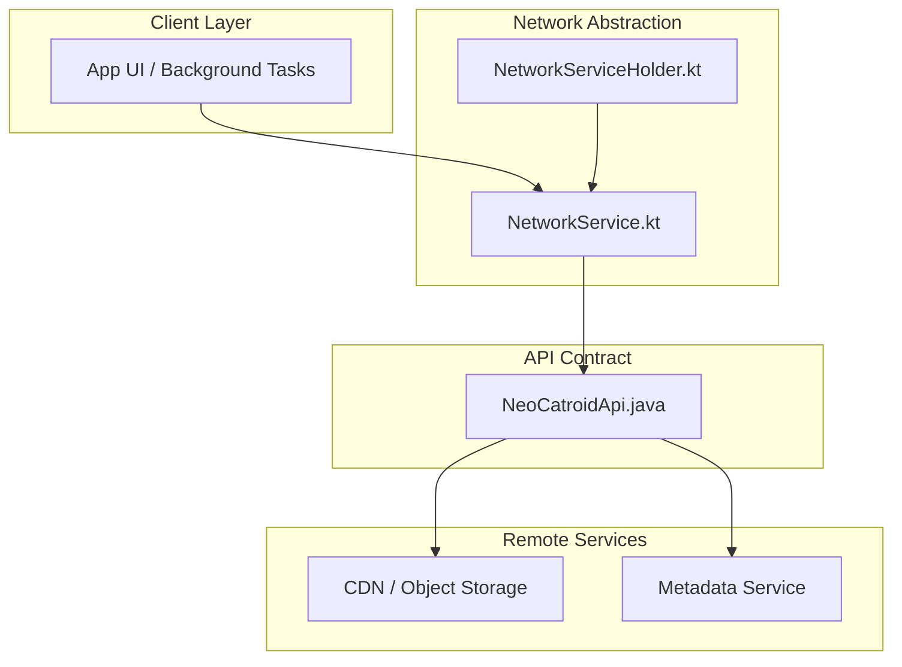
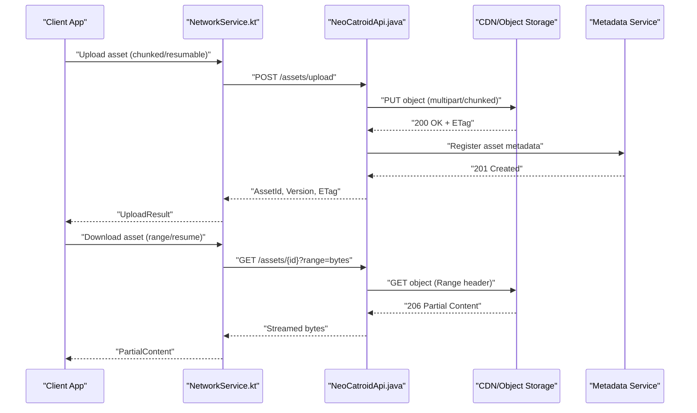
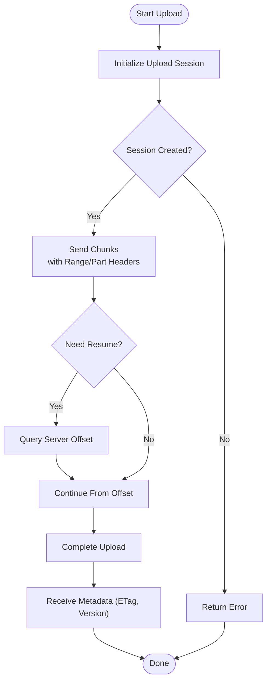
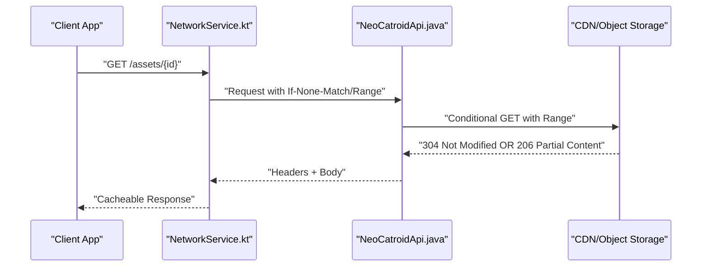
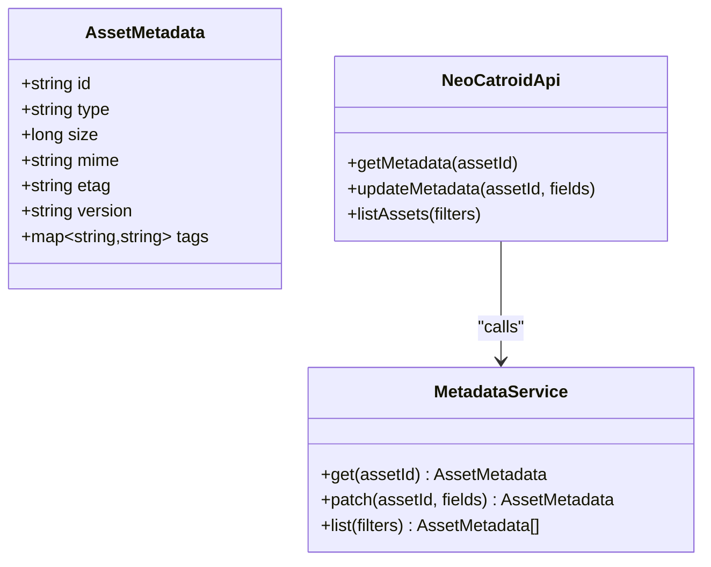
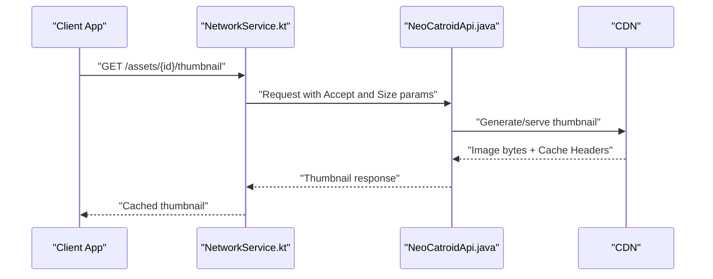
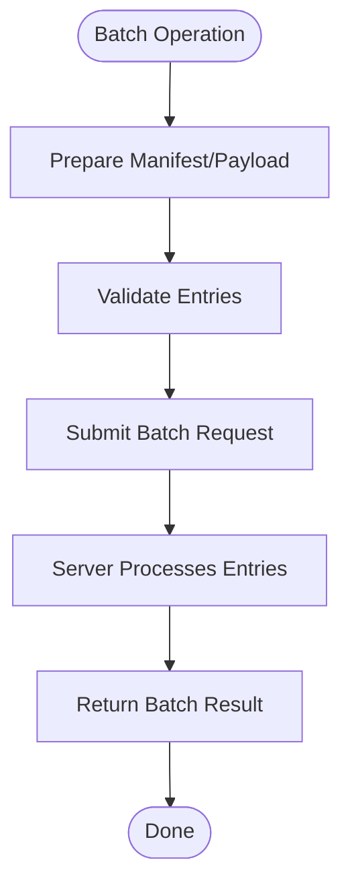
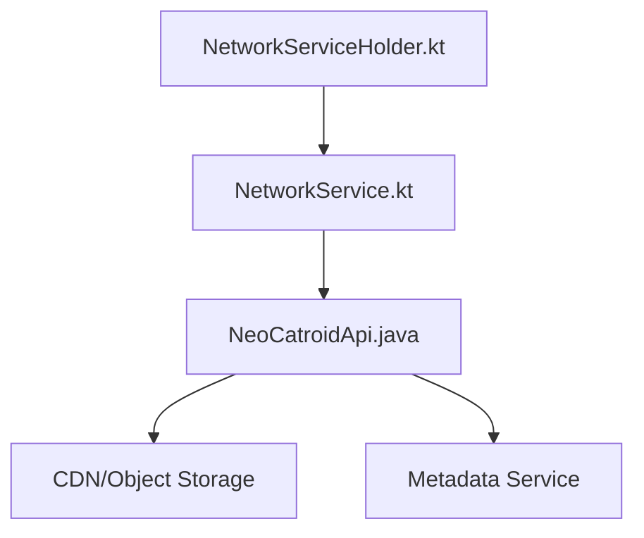

# Asset Synchronization API

<cite>
**Referenced Files in This Document**
- [NeoCatroidApi.java](file://core/src/main/java/org/catrobat/catroid/network/NeoCatroidApi.java)
- [NetworkService.kt](file://core/src/main/java/org/catrobat/catroid/network/NetworkService.kt)
- [NetworkServiceHolder.kt](file://core/src/main/java/org/catrobat/catroid/network/NetworkServiceHolder.kt)
</cite>

## Table of Contents
1. [Introduction](#introduction)
2. [Project Structure](#project-structure)
3. [Core Components](#core-components)
4. [Architecture Overview](#architecture-overview)
5. [Detailed Component Analysis](#detailed-component-analysis)
6. [Dependency Analysis](#dependency-analysis)
7. [Performance Considerations](#performance-considerations)
8. [Troubleshooting Guide](#troubleshooting-guide)
9. [Conclusion](#conclusion)

## Introduction
This document specifies the Asset Synchronization API for NewCatroid’s media management system. It covers endpoints and client behaviors for uploading and downloading images, audio, video, and custom assets with support for chunked transfers and resume capabilities. It also documents asset metadata, format validation, compression options, CDN integration patterns, batch operations, thumbnail generation, optimization strategies, caching, bandwidth optimization, and offline sync patterns for mobile applications.

The documentation is grounded in the repository’s network layer components that expose the API surface used by clients to synchronize assets.

## Project Structure
At a high level, the asset synchronization functionality is exposed through a dedicated API interface and a network service abstraction:
- The API interface defines the contract for asset-related HTTP operations (upload, download, metadata, thumbnails).
- The network service encapsulates HTTP client configuration, request/response handling, and transport-level features such as retries and timeouts.
- A holder component provides access to the configured network service instance across the application.

**Diagram sources**
- [NeoCatroidApi.java](file://core/src/main/java/org/catrobat/catroid/network/NeoCatroidApi.java)
- [NetworkService.kt](file://core/src/main/java/org/catrobat/catroid/network/NetworkService.kt)
- [NetworkServiceHolder.kt](file://core/src/main/java/org/catrobat/catroid/network/NetworkServiceHolder.kt)

**Section sources**
- [NeoCatroidApi.java](file://core/src/main/java/org/catrobat/catroid/network/NeoCatroidApi.java)
- [NetworkService.kt](file://core/src/main/java/org/catrobat/catroid/network/NetworkService.kt)
- [NetworkServiceHolder.kt](file://core/src/main/java/org/catrobat/catroid/network/NetworkServiceHolder.kt)

## Core Components
- NeoCatroidApi.java: Defines the RESTful contract for asset operations including upload, download, metadata retrieval, thumbnail generation, and batch operations. It serves as the single source of truth for endpoint paths, HTTP methods, headers, and payload structures.
- NetworkService.kt: Configures and manages the HTTP client lifecycle, interceptors, retry policies, timeouts, and optional chunked transfer helpers. It may also provide utilities for resumable uploads and range-based downloads.
- NetworkServiceHolder.kt: Provides a centralized accessor to the configured NetworkService instance, ensuring consistent configuration across modules.

Key responsibilities:
- Endpoint mapping and serialization/deserialization contracts.
- Transport-level concerns: retries, timeouts, connection pooling, and chunking.
- Cross-cutting concerns: logging, metrics, error normalization, and cache headers handling.

**Section sources**
- [NeoCatroidApi.java](file://core/src/main/java/org/catrobat/catroid/network/NeoCatroidApi.java)
- [NetworkService.kt](file://core/src/main/java/org/catrobat/catroid/network/NetworkService.kt)
- [NetworkServiceHolder.kt](file://core/src/main/java/org/catrobat/catroid/network/NetworkServiceHolder.kt)

## Architecture Overview
The asset synchronization architecture separates concerns between the API contract and the transport implementation:
- Clients call into NetworkService, which delegates to NeoCatroidApi-defined endpoints.
- Requests are routed to remote services (CDN/object storage and metadata service).
- Responses include standard HTTP caching headers and ETags to enable efficient caching and conditional requests.

**Diagram sources**
- [NeoCatroidApi.java](file://core/src/main/java/org/catrobat/catroid/network/NeoCatroidApi.java)
- [NetworkService.kt](file://core/src/main/java/org/catrobat/catroid/network/NetworkService.kt)

## Detailed Component Analysis

### Asset Upload API
- Purpose: Upload images, audio, video, and custom assets with support for chunked transfers and resume.
- Typical flow:
  - Initialize an upload session to obtain an upload ID.
  - Send chunks with Range or part-number headers.
  - Complete the upload and receive asset metadata (ETag, version, size).
- Key considerations:
  - Idempotency via upload IDs.
  - Resume from last successful chunk using server-reported offsets.
  - Compression hints for large assets (e.g., image/video).

**Diagram sources**
- [NeoCatroidApi.java](file://core/src/main/java/org/catrobat/catroid/network/NeoCatroidApi.java)
- [NetworkService.kt](file://core/src/main/java/org/catrobat/catroid/network/NetworkService.kt)

**Section sources**
- [NeoCatroidApi.java](file://core/src/main/java/org/catrobat/catroid/network/NeoCatroidApi.java)
- [NetworkService.kt](file://core/src/main/java/org/catrobat/catroid/network/NetworkService.kt)

### Asset Download API
- Purpose: Download assets with support for range requests and resume.
- Typical flow:
  - Request full or partial content using Range headers.
  - Handle 206 Partial Content responses.
  - Use ETag and Last-Modified for conditional requests (If-None-Match/If-Modified-Since).
- Key considerations:
  - Streaming responses to minimize memory usage.
  - Caching with appropriate cache-control directives.

**Diagram sources**
- [NeoCatroidApi.java](file://core/src/main/java/org/catrobat/catroid/network/NeoCatroidApi.java)
- [NetworkService.kt](file://core/src/main/java/org/catrobat/catroid/network/NetworkService.kt)

**Section sources**
- [NeoCatroidApi.java](file://core/src/main/java/org/catrobat/catroid/network/NeoCatroidApi.java)
- [NetworkService.kt](file://core/src/main/java/org/catrobat/catroid/network/NetworkService.kt)

### Asset Metadata API
- Purpose: Retrieve and update asset metadata (type, size, MIME, checksums, tags, versions).
- Typical operations:
  - GET metadata by asset ID.
  - PATCH metadata fields (e.g., tags, visibility).
  - List assets by filters (owner, project, tags).
- Integration points:
  - Metadata service behind the API layer.
  - Consistency guarantees via versioning and ETags.

**Diagram sources**
- [NeoCatroidApi.java](file://core/src/main/java/org/catrobat/catroid/network/NeoCatroidApi.java)

**Section sources**
- [NeoCatroidApi.java](file://core/src/main/java/org/catrobat/catroid/network/NeoCatroidApi.java)

### Thumbnail Generation API
- Purpose: Generate and retrieve optimized thumbnails for images and videos.
- Typical operations:
  - GET /assets/{id}/thumbnail?width=&height=&format=
  - Conditional requests using ETag to avoid re-downloading unchanged thumbnails.
- Optimization:
  - Server-side resizing and transcoding.
  - Adaptive formats based on client preferences.

**Diagram sources**
- [NeoCatroidApi.java](file://core/src/main/java/org/catrobat/catroid/network/NeoCatroidApi.java)
- [NetworkService.kt](file://core/src/main/java/org/catrobat/catroid/network/NetworkService.kt)

**Section sources**
- [NeoCatroidApi.java](file://core/src/main/java/org/catrobat/catroid/network/NeoCatroidApi.java)
- [NetworkService.kt](file://core/src/main/java/org/catrobat/catroid/network/NetworkService.kt)

### Batch Operations API
- Purpose: Perform multiple asset operations efficiently (batch upload, batch delete, batch metadata updates).
- Typical operations:
  - POST /assets/batch/upload with multipart or JSON manifest.
  - POST /assets/batch/metadata with array of patch operations.
- Benefits:
  - Reduced round trips.
  - Transactional semantics where supported.

**Diagram sources**
- [NeoCatroidApi.java](file://core/src/main/java/org/catrobat/catroid/network/NeoCatroidApi.java)

**Section sources**
- [NeoCatroidApi.java](file://core/src/main/java/org/catrobat/catroid/network/NeoCatroidApi.java)

### Format Validation and Compression Options
- Supported formats:
  - Images: JPEG, PNG, WebP, AVIF (server-dependent).
  - Audio: MP3, AAC, OGG, WAV.
  - Video: MP4, WebM.
  - Custom: Any binary with explicit MIME and size constraints.
- Validation rules:
  - Max file sizes per type.
  - Allowed MIME types and extensions.
  - Optional checksum verification (SHA-256).
- Compression options:
  - Image quality presets.
  - Video bitrate and resolution limits.
  - Lossless vs lossy toggles.

**Section sources**
- [NeoCatroidApi.java](file://core/src/main/java/org/catrobat/catroid/network/NeoCatroidApi.java)

### CDN Integration
- Patterns:
  - Direct CDN URLs returned by the API for downloads.
  - Signed URLs for secure access.
  - Cache-Control and ETag propagation for efficient caching.
- Best practices:
  - Use conditional requests to leverage CDN caches.
  - Prefer streaming for large assets.
  - Respect TTL and stale-while-revalidate directives.

**Section sources**
- [NeoCatroidApi.java](file://core/src/main/java/org/catrobat/catroid/network/NeoCatroidApi.java)
- [NetworkService.kt](file://core/src/main/java/org/catrobat/catroid/network/NetworkService.kt)

## Dependency Analysis
The following diagram shows how the core components depend on each other and external services.

**Diagram sources**
- [NeoCatroidApi.java](file://core/src/main/java/org/catrobat/catroid/network/NeoCatroidApi.java)
- [NetworkService.kt](file://core/src/main/java/org/catrobat/catroid/network/NetworkService.kt)
- [NetworkServiceHolder.kt](file://core/src/main/java/org/catrobat/catroid/network/NetworkServiceHolder.kt)

**Section sources**
- [NeoCatroidApi.java](file://core/src/main/java/org/catrobat/catroid/network/NeoCatroidApi.java)
- [NetworkService.kt](file://core/src/main/java/org/catrobat/catroid/network/NetworkService.kt)
- [NetworkServiceHolder.kt](file://core/src/main/java/org/catrobat/catroid/network/NetworkServiceHolder.kt)

## Performance Considerations
- Chunked uploads:
  - Use appropriate chunk sizes (e.g., 1–10 MB) balancing throughput and resume granularity.
  - Implement exponential backoff and jitter for retries.
- Resumable transfers:
  - Persist upload state locally; query server offset before resuming.
  - Deduplicate chunks using content hashing when possible.
- Downloads:
  - Stream responses; avoid loading entire files into memory.
  - Use Range requests for partial downloads and resume.
- Caching:
  - Honor Cache-Control, ETag, and Last-Modified.
  - Implement local cache with invalidation on metadata changes.
- Bandwidth optimization:
  - Prefer thumbnails for previews.
  - Apply adaptive quality settings based on network conditions.
  - Compress payloads where applicable.

[No sources needed since this section provides general guidance]

## Troubleshooting Guide
Common issues and resolutions:
- Upload failures:
  - Verify chunk boundaries and server-reported offsets.
  - Check authentication tokens and permissions.
  - Inspect server error codes and retry policies.
- Download errors:
  - Ensure Range headers are supported by the CDN.
  - Validate ETag consistency and handle 304 responses.
- Metadata inconsistencies:
  - Use version fields and conditional updates to prevent conflicts.
  - Re-fetch metadata after mutations.

Operational tips:
- Enable detailed logging for request/response cycles.
- Monitor latency and throughput metrics at chunk boundaries.
- Use health checks for CDN availability and fallback strategies.

**Section sources**
- [NetworkService.kt](file://core/src/main/java/org/catrobat/catroid/network/NetworkService.kt)
- [NeoCatroidApi.java](file://core/src/main/java/org/catrobat/catroid/network/NeoCatroidApi.java)

## Conclusion
The Asset Synchronization API provides a robust foundation for managing media assets in NewCatroid. By leveraging chunked uploads, resumable downloads, strong caching semantics, and CDN integration, clients can achieve reliable and efficient synchronization even under challenging network conditions. Adhering to the recommended patterns for validation, compression, and batching ensures optimal performance and scalability.

[No sources needed since this section summarizes without analyzing specific files]