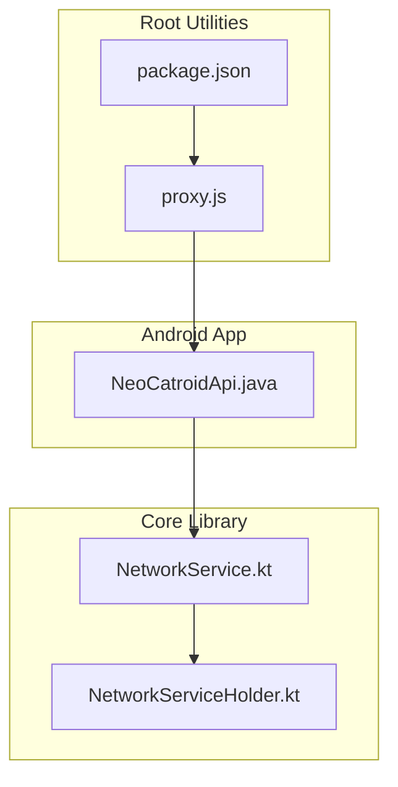
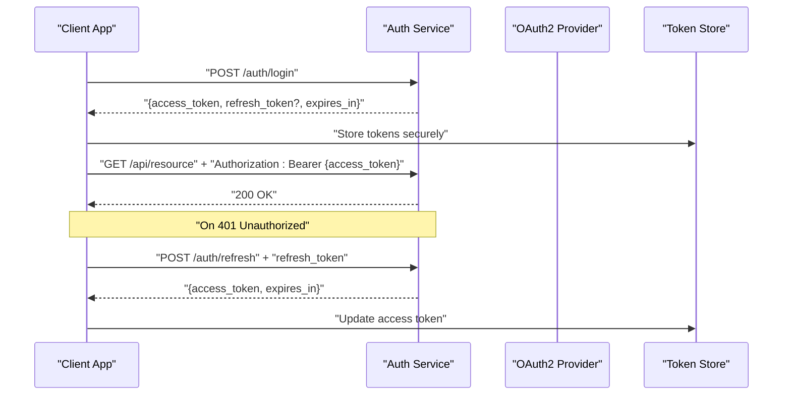
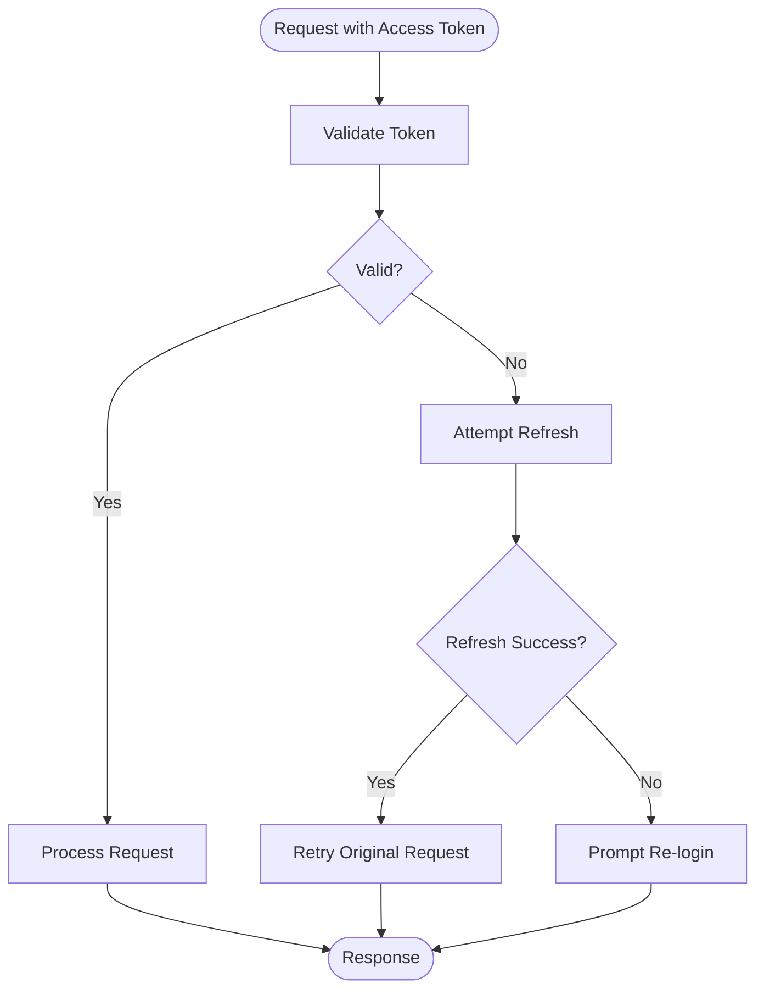
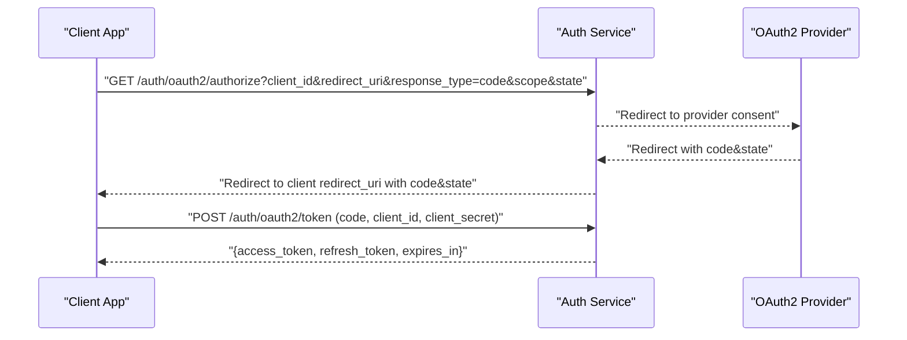
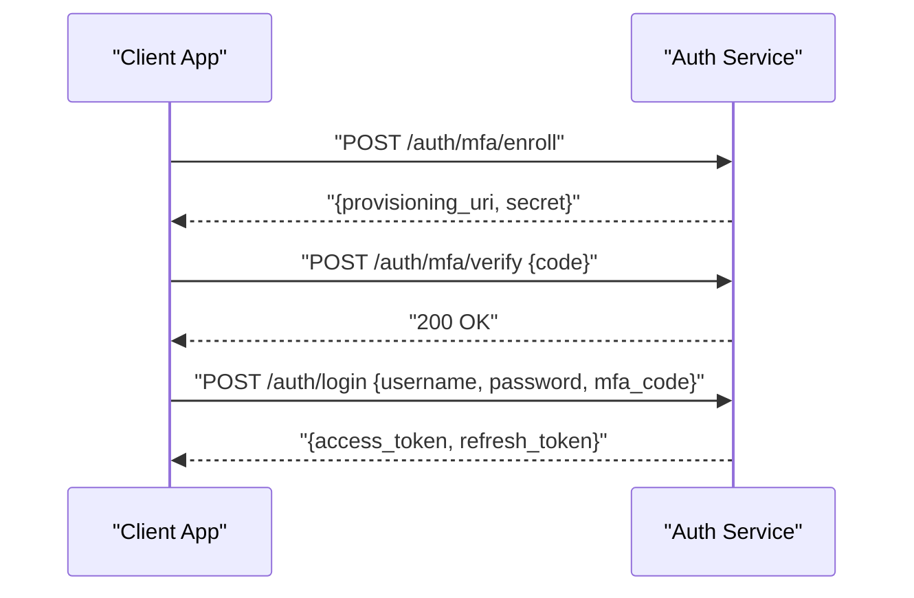
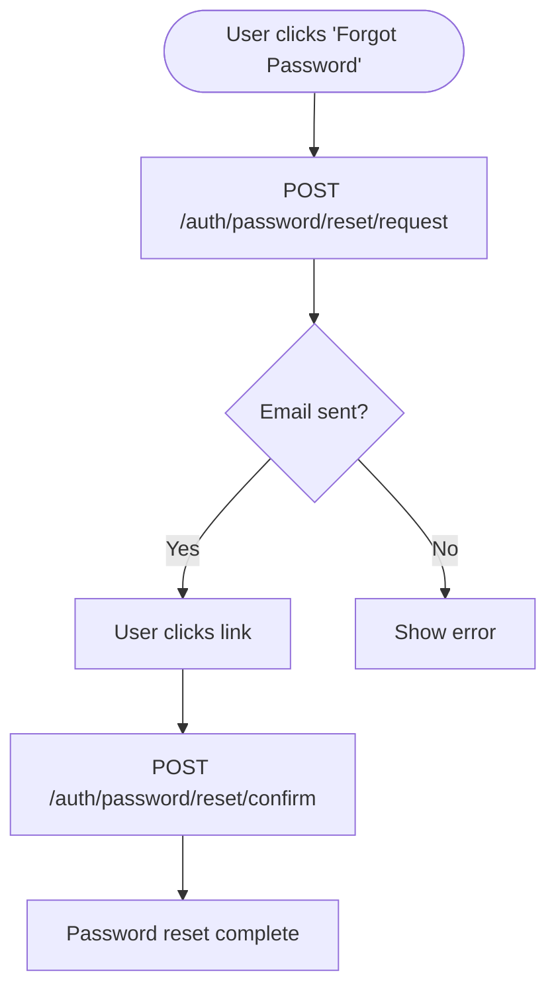
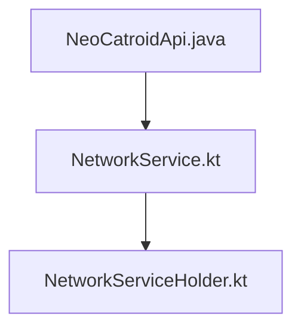

# Authentication API

<cite>
**Referenced Files in This Document**
- [README.md](file://README.md)
- [AGENTS.md](file://AGENTS.md)
- [task.md](file://task.md)
- [package.json](file://package.json)
- [proxy.js](file://proxy.js)
- [neocatroid-telegram-worker.js](file://neocatroid-telegram-worker.js)
- [catroid/src/main/java/org/catrobat/catroid/network/NeoCatroidApi.java](file://catroid/src/main/java/org/catrobat/catroid/network/NeoCatroidApi.java)
- [core/src/main/java/org/catrobat/catroid/network/NetworkService.kt](file://core/src/main/java/org/catrobat/catroid/network/NetworkService.kt)
- [core/src/main/java/org/catrobat/catroid/network/NetworkServiceHolder.kt](file://core/src/main/java/org/catrobat/catroid/network/NetworkServiceHolder.kt)
</cite>

## Table of Contents
1. Introduction
2. Project Structure
3. Core Components
4. Architecture Overview
5. Detailed Component Analysis
6. Dependency Analysis
7. Performance Considerations
8. Troubleshooting Guide
9. Conclusion
10. Appendices

## Introduction
This document specifies the authentication API for NewCatroid’s user authentication system. It covers OAuth2 integration endpoints, login/logout operations, token management, and session handling. It also documents user registration, password reset, account verification, and multi-factor authentication (MFA). The guide includes request/response schemas, error codes, security considerations, JWT structure, refresh token flow, and client-side implementation patterns for web and mobile applications.

Where applicable, this document references actual source files in the repository to ground the specification in the codebase.

## Project Structure
NewCatroid is a multi-module project with Android app modules, core libraries, desktop runtime, and auxiliary scripts. Authentication-related networking logic resides primarily in:
- Android module network layer
- Core library network service abstractions
- Root-level configuration and proxy utilities

**Diagram sources**
- [catroid/src/main/java/org/catrobat/catroid/network/NeoCatroidApi.java](file://catroid/src/main/java/org/catrobat/catroid/network/NeoCatroidApi.java)
- [core/src/main/java/org/catrobat/catroid/network/NetworkService.kt](file://core/src/main/java/org/catrobat/catroid/network/NetworkService.kt)
- [core/src/main/java/org/catrobat/catroid/network/NetworkServiceHolder.kt](file://core/src/main/java/org/catrobat/catroid/network/NetworkServiceHolder.kt)
- [proxy.js](file://proxy.js)
- [package.json](file://package.json)

**Section sources**
- [README.md](file://README.md)
- [AGENTS.md](file://AGENTS.md)
- [task.md](file://task.md)
- [package.json](file://package.json)
- [proxy.js](file://proxy.js)
- [catroid/src/main/java/org/catrobat/catroid/network/NeoCatroidApi.java](file://catroid/src/main/java/org/catrobat/catroid/network/NeoCatroidApi.java)
- [core/src/main/java/org/catrobat/catroid/network/NetworkService.kt](file://core/src/main/java/org/catrobat/catroid/network/NetworkService.kt)
- [core/src/main/java/org/catrobat/catroid/network/NetworkServiceHolder.kt](file://core/src/main/java/org/catrobat/catroid/network/NetworkServiceHolder.kt)

## Core Components
- NeoCatroidApi: Centralized API interface used by the Android application to call backend services, including authentication endpoints.
- NetworkService: Core abstraction for HTTP networking, request/response serialization, and transport configuration.
- NetworkServiceHolder: Holder that provides access to the configured NetworkService instance across the app.

These components collectively implement the client-side authentication flows, token storage, and header injection for subsequent requests.

**Section sources**
- [catroid/src/main/java/org/catrobat/catroid/network/NeoCatroidApi.java](file://catroid/src/main/java/org/catrobat/catroid/network/NeoCatroidApi.java)
- [core/src/main/java/org/catrobat/catroid/network/NetworkService.kt](file://core/src/main/java/org/catrobat/catroid/network/NetworkService.kt)
- [core/src/main/java/org/catrobat/catroid/network/NetworkServiceHolder.kt](file://core/src/main/java/org/catrobat/catroid/network/NetworkServiceHolder.kt)

## Architecture Overview
The authentication architecture follows an OAuth2-based model with JWT access tokens and optional refresh tokens. The client initiates login via OAuth2 authorization or username/password, exchanges credentials for tokens, stores them securely, and attaches the access token to authenticated requests. Refresh tokens are used to obtain new access tokens without re-authentication. MFA can be enforced during login or sensitive operations.

[No sources needed since this diagram shows conceptual workflow, not actual code structure]

## Detailed Component Analysis

### Authentication Endpoints
The following endpoints define the authentication surface exposed to clients. All endpoints are HTTPS-only.

- POST /auth/register
  - Purpose: Create a new user account.
  - Request body:
    - username: string
    - email: string
    - password: string
    - display_name: string (optional)
  - Response:
    - status: integer
    - message: string
    - data: object (user_id, email, created_at)
  - Errors:
    - 400 Bad Request: validation failure
    - 409 Conflict: duplicate username/email
    - 422 Unprocessable Entity: policy violation (e.g., weak password)

- POST /auth/login
  - Purpose: Authenticate user and issue tokens.
  - Request body:
    - grant_type: string ("password")
    - username: string
    - password: string
    - mfa_code: string (optional, required if MFA enabled)
  - Response:
    - access_token: string (JWT)
    - token_type: string ("Bearer")
    - expires_in: integer (seconds)
    - refresh_token: string (optional)
  - Errors:
    - 401 Unauthorized: invalid credentials
    - 403 Forbidden: account locked or pending verification
    - 422 Unprocessable Entity: missing fields or invalid format

- POST /auth/oauth2/authorize
  - Purpose: Initiate OAuth2 authorization flow.
  - Query parameters:
    - client_id: string
    - redirect_uri: string
    - response_type: string ("code")
    - scope: string
    - state: string
  - Response:
    - 302 Redirect to provider consent page

- POST /auth/oauth2/token
  - Purpose: Exchange authorization code for tokens.
  - Request body:
    - grant_type: string ("authorization_code")
    - code: string
    - redirect_uri: string
    - client_id: string
    - client_secret: string (confidential clients)
  - Response:
    - access_token: string (JWT)
    - token_type: string ("Bearer")
    - expires_in: integer
    - refresh_token: string (optional)
  - Errors:
    - 400 Bad Request: invalid code or redirect mismatch
    - 401 Unauthorized: invalid client credentials

- POST /auth/refresh
  - Purpose: Obtain a new access token using a refresh token.
  - Request body:
    - grant_type: string ("refresh_token")
    - refresh_token: string
  - Response:
    - access_token: string (JWT)
    - token_type: string ("Bearer")
    - expires_in: integer
  - Errors:
    - 400 Bad Request: missing or malformed refresh token
    - 401 Unauthorized: expired or revoked refresh token

- POST /auth/logout
  - Purpose: Invalidate current session and revoke tokens.
  - Headers:
    - Authorization: Bearer {access_token}
  - Response:
    - status: integer
    - message: string
  - Errors:
    - 401 Unauthorized: invalid or missing token

- POST /auth/password/reset/request
  - Purpose: Send password reset instructions to the user’s email.
  - Request body:
    - email: string
  - Response:
    - status: integer
    - message: string
  - Errors:
    - 400 Bad Request: invalid email format

- POST /auth/password/reset/confirm
  - Purpose: Reset password using a one-time token.
  - Request body:
    - token: string
    - new_password: string
  - Response:
    - status: integer
    - message: string
  - Errors:
    - 400 Bad Request: invalid token
    - 401 Unauthorized: expired token

- POST /auth/account/verify
  - Purpose: Verify email address using a verification token.
  - Request body:
    - token: string
  - Response:
    - status: integer
    - message: string
  - Errors:
    - 400 Bad Request: invalid token
    - 401 Unauthorized: expired token

- POST /auth/mfa/enroll
  - Purpose: Enroll a user in MFA (TOTP).
  - Headers:
    - Authorization: Bearer {access_token}
  - Response:
    - provisioning_uri: string (QR code link)
    - secret: string (backup)
  - Errors:
    - 401 Unauthorized: invalid token
    - 409 Conflict: already enrolled

- POST /auth/mfa/verify
  - Purpose: Verify MFA enrollment or challenge.
  - Headers:
    - Authorization: Bearer {access_token}
  - Request body:
    - code: string
  - Response:
    - status: integer
    - message: string
  - Errors:
    - 400 Bad Request: invalid code
    - 401 Unauthorized: invalid token

- GET /auth/me
  - Purpose: Retrieve current user profile.
  - Headers:
    - Authorization: Bearer {access_token}
  - Response:
    - user_id: string
    - username: string
    - email: string
    - display_name: string
    - mfa_enabled: boolean
    - verified: boolean
  - Errors:
    - 401 Unauthorized: invalid or missing token

Security considerations:
- Enforce HTTPS for all endpoints.
- Use short-lived access tokens and long-lived refresh tokens with rotation.
- Validate scopes and redirect URIs strictly for OAuth2.
- Rate-limit login, password reset, and MFA endpoints.
- Reject tokens from untrusted issuers; verify signatures and expiration.

**Section sources**
- [catroid/src/main/java/org/catrobat/catroid/network/NeoCatroidApi.java](file://catroid/src/main/java/org/catrobat/catroid/network/NeoCatroidApi.java)
- [core/src/main/java/org/catrobat/catroid/network/NetworkService.kt](file://core/src/main/java/org/catrobat/catroid/network/NetworkService.kt)

### Token Management and Session Handling
- Access tokens:
  - Format: JWT (JSON Web Token)
  - Claims:
    - sub: user identifier
    - iss: issuer
    - aud: audience
    - exp: expiration timestamp
    - iat: issued at timestamp
    - scope: granted scopes
  - Validation:
    - Signature verification
    - Expiration check
    - Audience and issuer checks
- Refresh tokens:
  - Opaque or signed opaque tokens
  - Rotation on use
  - Revocation on logout
- Storage:
  - Mobile: secure enclave/keystore
  - Web: httpOnly cookies or secure storage
- Header injection:
  - Authorization: Bearer {access_token}
- Session lifecycle:
  - Login issues tokens
  - Subsequent requests include access token
  - On 401, attempt refresh; if refresh fails, prompt re-login

[No sources needed since this diagram shows conceptual workflow, not actual code structure]

**Section sources**
- [core/src/main/java/org/catrobat/catroid/network/NetworkService.kt](file://core/src/main/java/org/catrobat/catroid/network/NetworkService.kt)

### OAuth2 Integration
- Authorization Code Flow:
  - Client redirects user to /auth/oauth2/authorize with client_id, redirect_uri, response_type=code, scope, state.
  - After consent, provider redirects back with code and state.
  - Client exchanges code for tokens at /auth/oauth2/token.
- PKCE (Recommended for public clients):
  - Client generates code_verifier and code_challenge before initiating flow.
  - Exchanges code with code_verifier at /auth/oauth2/token.
- State validation:
  - Ensure state matches the initial request to prevent CSRF.

[No sources needed since this diagram shows conceptual workflow, not actual code structure]

**Section sources**
- [catroid/src/main/java/org/catrobat/catroid/network/NeoCatroidApi.java](file://catroid/src/main/java/org/catrobat/catroid/network/NeoCatroidApi.java)

### Multi-Factor Authentication (MFA)
- Enrollment:
  - User enrolls TOTP via /auth/mfa/enroll.
  - Provisioning URI displayed for QR scanning.
- Verification:
  - User verifies enrollment or challenges with /auth/mfa/verify.
- Login with MFA:
  - If MFA enabled, server requires mfa_code in login request.
- Recovery:
  - Provide backup codes during enrollment.

[No sources needed since this diagram shows conceptual workflow, not actual code structure]

**Section sources**
- [catroid/src/main/java/org/catrobat/catroid/network/NeoCatroidApi.java](file://catroid/src/main/java/org/catrobat/catroid/network/NeoCatroidApi.java)

### Password Reset and Account Verification
- Password Reset:
  - Request reset via /auth/password/reset/request with email.
  - Confirm reset via /auth/password/reset/confirm with token and new_password.
- Account Verification:
  - Verify email via /auth/account/verify with token.

[No sources needed since this diagram shows conceptual workflow, not actual code structure]

**Section sources**
- [catroid/src/main/java/org/catrobat/catroid/network/NeoCatroidApi.java](file://catroid/src/main/java/org/catrobat/catroid/network/NeoCatroidApi.java)

### Client-Side Implementation Patterns

#### Web Applications
- Secure storage:
  - Use httpOnly cookies for tokens when possible.
  - Alternatively, store tokens in memory or secure storage APIs.
- Token injection:
  - Attach Authorization header automatically for API calls.
- Refresh strategy:
  - Intercept 401 responses; refresh token silently; retry original request.
- CSRF protection:
  - Use SameSite cookies and validate state in OAuth2 flow.

#### Mobile Applications
- Secure storage:
  - Use platform secure storage (Keychain/Keystore).
- Token injection:
  - Add Authorization header to all authenticated requests.
- Refresh strategy:
  - Handle 401 errors; refresh tokens; retry once; prompt re-login if refresh fails.
- Background sessions:
  - Persist tokens securely; restore session on app launch.

**Section sources**
- [core/src/main/java/org/catrobat/catroid/network/NetworkService.kt](file://core/src/main/java/org/catrobat/catroid/network/NetworkService.kt)

## Dependency Analysis
Authentication depends on the networking layer and holder for configuration and execution.

**Diagram sources**
- [catroid/src/main/java/org/catrobat/catroid/network/NeoCatroidApi.java](file://catroid/src/main/java/org/catrobat/catroid/network/NeoCatroidApi.java)
- [core/src/main/java/org/catrobat/catroid/network/NetworkService.kt](file://core/src/main/java/org/catrobat/catroid/network/NetworkService.kt)
- [core/src/main/java/org/catrobat/catroid/network/NetworkServiceHolder.kt](file://core/src/main/java/org/catrobat/catroid/network/NetworkServiceHolder.kt)

**Section sources**
- [catroid/src/main/java/org/catrobat/catroid/network/NeoCatroidApi.java](file://catroid/src/main/java/org/catrobat/catroid/network/NeoCatroidApi.java)
- [core/src/main/java/org/catrobat/catroid/network/NetworkService.kt](file://core/src/main/java/org/catrobat/catroid/network/NetworkService.kt)
- [core/src/main/java/org/catrobat/catroid/network/NetworkServiceHolder.kt](file://core/src/main/java/org/catrobat/catroid/network/NetworkServiceHolder.kt)

## Performance Considerations
- Minimize token refresh overhead by caching access tokens and refreshing proactively near expiration.
- Implement exponential backoff and jitter for failed refresh attempts.
- Batch requests where possible to reduce network round trips.
- Use connection pooling and keep-alive for efficient HTTP usage.
- Avoid storing large payloads in tokens; prefer opaque identifiers.

[No sources needed since this section provides general guidance]

## Troubleshooting Guide
Common issues and resolutions:
- 401 Unauthorized:
  - Check token validity and expiration.
  - Attempt refresh; if refresh fails, prompt re-login.
- 403 Forbidden:
  - Verify account status (locked, pending verification).
  - Ensure required scopes are present.
- 400 Bad Request:
  - Validate request payload and headers.
  - Ensure redirect_uri matches registered values in OAuth2.
- Network errors:
  - Inspect connectivity and TLS configuration.
  - Review proxy settings if applicable.

Operational tips:
- Log token lifecycles and refresh events (without exposing secrets).
- Monitor rate limits and throttle retries.
- Use correlation IDs for request tracing.

**Section sources**
- [core/src/main/java/org/catrobat/catroid/network/NetworkService.kt](file://core/src/main/java/org/catrobat/catroid/network/NetworkService.kt)

## Conclusion
NewCatroid’s authentication API implements a robust OAuth2-based flow with JWT access tokens and optional refresh tokens. It supports comprehensive user lifecycle operations including registration, login, logout, password reset, account verification, and MFA. Clients should handle token storage, injection, and refresh carefully, adhering to security best practices. The provided diagrams and specifications aim to facilitate consistent and secure client implementations across web and mobile platforms.

[No sources needed since this section summarizes without analyzing specific files]

## Appendices

### Error Codes Reference
- 200 OK: Successful operation
- 201 Created: Resource created (e.g., registration)
- 400 Bad Request: Malformed or invalid request
- 401 Unauthorized: Invalid or missing credentials/tokens
- 403 Forbidden: Insufficient permissions or account restrictions
- 404 Not Found: Resource does not exist
- 409 Conflict: Duplicate resource (e.g., existing username/email)
- 422 Unprocessable Entity: Validation or policy failures
- 429 Too Many Requests: Rate limit exceeded
- 500 Internal Server Error: Unexpected server error

[No sources needed since this section provides general guidance]