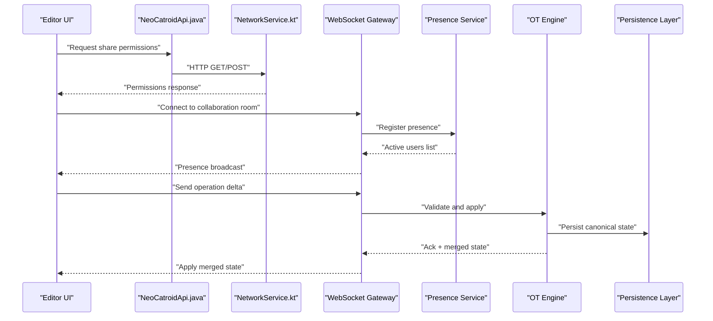
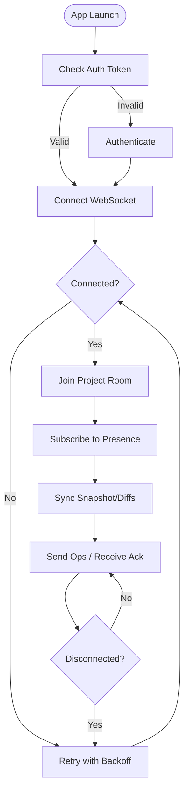
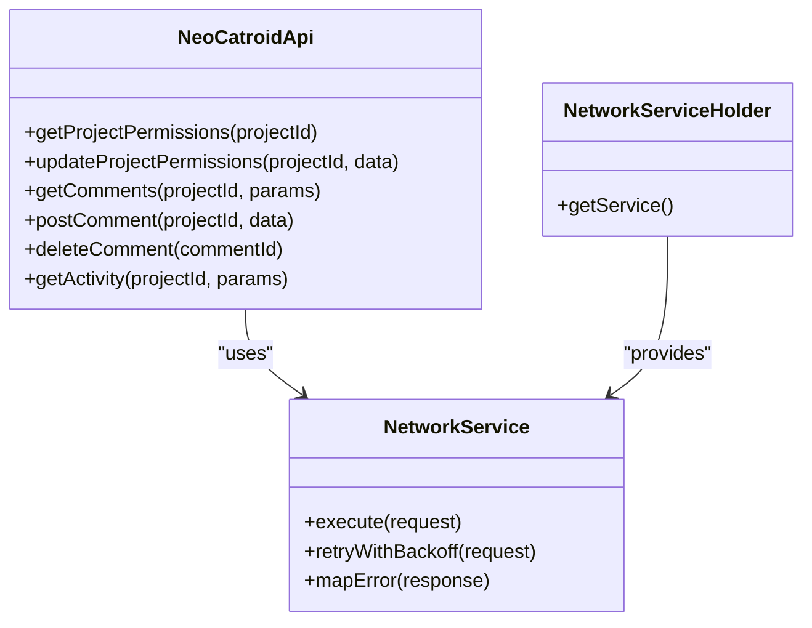

# Collaboration API

<cite>
**Referenced Files in This Document**
- [README.md](file://README.md)
- [task.md](file://task.md)
- [NeoCatroidApi.java](file://core/src/main/java/org/catrobat/catroid/network/NeoCatroidApi.java)
- [NetworkService.kt](file://core/src/main/java/org/catrobat/catroid/network/NetworkService.kt)
- [NetworkServiceHolder.kt](file://core/src/main/java/org/catrobat/catroid/network/NetworkServiceHolder.kt)
</cite>

## Table of Contents
1. [Introduction](#introduction)
2. [Project Structure](#project-structure)
3. [Core Components](#core-components)
4. [Architecture Overview](#architecture-overview)
5. [Detailed Component Analysis](#detailed-component-analysis)
6. [Dependency Analysis](#dependency-analysis)
7. [Performance Considerations](#performance-considerations)
8. [Troubleshooting Guide](#troubleshooting-guide)
9. [Conclusion](#conclusion)
10. [Appendices](#appendices)

## Introduction
This document specifies the collaboration API for NewCatroid’s real-time editing and sharing features. It covers:
- WebSocket-based live collaboration, presence indicators, and conflict resolution
- REST endpoints for project sharing permissions, comments, and activity feeds
- Real-time synchronization protocols, operational transformation (OT), and merge strategies
- Rate limiting, connection management, and fallback mechanisms for unreliable networks

The repository contains client-side networking components that integrate with a backend service. The backend implementation is not included in this workspace; therefore, this document defines the intended API surface and behavior to guide both client and server development.

## Project Structure
NewCatroid organizes networking concerns under core network modules. The primary integration points are:
- A Retrofit-style API interface for REST calls
- A Kotlin service layer for HTTP operations
- A holder utility for dependency injection or lifecycle management

```mermaid
graph TB
subgraph "Client"
A["NeoCatroidApi.java"]
B["NetworkService.kt"]
C["NetworkServiceHolder.kt"]
end
subgraph "Backend"
D["REST API Server"]
E["WebSocket Gateway"]
F["Presence Service"]
G["Conflict Resolver / OT Engine"]
H["Persistence Layer"]
end
A --> D
B --> D
C --> B
E < --> D
E --> F
E --> G
G --> H
```

[No sources needed since this diagram shows conceptual workflow, not actual code structure]

## Core Components
- NeoCatroidApi.java: Declares REST endpoints used by the client for project sharing, comments, and activity feed retrieval.
- NetworkService.kt: Implements HTTP request/response handling, error mapping, and retry/backoff policies.
- NetworkServiceHolder.kt: Provides access to the network service instance across application components.

These components form the foundation for collaboration features. The WebSocket gateway and OT engine are backend responsibilities but must be integrated via well-defined contracts from the client side.

**Section sources**
- [NeoCatroidApi.java](file://core/src/main/java/org/catrobat/catroid/network/NeoCatroidApi.java)
- [NetworkService.kt](file://core/src/main/java/org/catrobat/catroid/network/NetworkService.kt)
- [NetworkServiceHolder.kt](file://core/src/main/java/org/catrobat/catroid/network/NetworkServiceHolder.kt)

## Architecture Overview
The collaboration architecture combines REST for metadata and state synchronization with WebSocket for low-latency updates.



**Diagram sources**
- [NeoCatroidApi.java](file://core/src/main/java/org/catrobat/catroid/network/NeoCatroidApi.java)
- [NetworkService.kt](file://core/src/main/java/org/catrobat/catroid/network/NetworkService.kt)

## Detailed Component Analysis

### REST Endpoints
The following endpoints support collaboration metadata and social features. All paths are relative to the base URL configured in the client.

- Project Sharing Permissions
  - GET /api/projects/{projectId}/permissions
    - Purpose: Retrieve current sharing settings and user roles.
    - Auth: Required (Bearer token).
    - Response: { owner, collaborators: [{ userId, role }], publicAccess }.
  - PUT /api/projects/{projectId}/permissions
    - Purpose: Update sharing settings and collaborator roles.
    - Body: { collaborators: [{ userId, role }], publicAccess }.
    - Auth: Owner or admin required.
    - Response: Updated permissions object.

- Comments
  - GET /api/projects/{projectId}/comments
    - Purpose: List comments ordered by creation time.
    - Query: page, pageSize, sortBy.
    - Response: { items: [{ id, authorId, text, createdAt }], total }.
  - POST /api/projects/{projectId}/comments
    - Purpose: Add a comment.
    - Body: { text }.
    - Response: Created comment object.
  - DELETE /api/comments/{commentId}
    - Purpose: Remove a comment (author or owner only).
    - Response: 204 No Content.

- Activity Feed
  - GET /api/projects/{projectId}/activity
    - Purpose: Stream recent collaborative events (edits, permission changes, comments).
    - Query: since (timestamp), limit.
    - Response: { events: [{ id, type, actorId, timestamp, payload }] }.

Notes:
- Pagination uses cursor or offset semantics consistent with existing API patterns.
- Error responses follow standard HTTP codes with JSON bodies including message and code fields.

**Section sources**
- [NeoCatroidApi.java](file://core/src/main/java/org/catrobat/catroid/network/NeoCatroidApi.java)

### WebSocket Protocol
The WebSocket gateway provides real-time collaboration channels per project.

- Connection
  - Endpoint: wss://host/ws/collab?token=...&projectId=...
  - Handshake: Authenticate using JWT in query or first message.
  - Room model: Each projectId maps to a logical room.

- Presence
  - Subscribe to presence channel to receive active users and cursors.
  - Events:
    - presence.join: { userId, displayName, cursor: { x, y }, role }
    - presence.leave: { userId }
    - presence.update: { userId, cursor, role }

- Operations and Synchronization
  - Client sends op deltas: { opId, version, ops: [...] }
  - Server validates against canonical version and applies via OT engine.
  - Server responds:
    - ack: { opId, acceptedVersion }
    - conflict: { opId, rejectedVersion, suggestedOps }
  - State sync:
    - snapshot: { version, state }
    - diff: { version, patches }

- Conflict Resolution and OT
  - Transform incoming ops against concurrent ops before applying.
  - Maintain a global version counter per project.
  - On conflicts, return suggested transformations or require client rebase.

- Heartbeats and Keepalive
  - Ping/Pong every N seconds to detect dead connections.
  - Reconnect with exponential backoff on disconnects.

- Rate Limiting and Backpressure
  - Per-client throttle on op frequency.
  - Queue overflow returns temporary rejection until capacity frees.

**Section sources**
- [NetworkService.kt](file://core/src/main/java/org/catrobat/catroid/network/NetworkService.kt)

### Operational Transformation and Merge Strategies
- Canonical State Model
  - Versioned immutable snapshots with incremental diffs.
  - Deterministic ordering of ops based on timestamps and client IDs.

- Transformation Rules
  - Insert/Delete/Move operations are pairwise transformed.
  - Idempotency enforced via opId deduplication.

- Merge Strategy
  - Last-writer-wins for non-overlapping regions.
  - Region-aware merging for overlapping edits.
  - User-visible merge hints when semantic conflicts occur.

- Recovery
  - On reconnect, fetch snapshot at last known version and replay pending ops.
  - If too old, request full snapshot and reset local queue.

**Section sources**
- [NetworkService.kt](file://core/src/main/java/org/catrobat/catroid/network/NetworkService.kt)

### Connection Management and Fallbacks
- Initial handshake over HTTPS to obtain WebSocket endpoint and room config.
- Automatic reconnection with jittered exponential backoff.
- Fallback to polling for critical metadata if WebSocket unavailable.
- Graceful degradation: disable real-time features while preserving offline edits.



[No sources needed since this diagram shows conceptual workflow, not actual code structure]

## Dependency Analysis
The client networking stack composes an API interface with a service implementation and a holder for access.



**Diagram sources**
- [NeoCatroidApi.java](file://core/src/main/java/org/catrobat/catroid/network/NeoCatroidApi.java)
- [NetworkService.kt](file://core/src/main/java/org/catrobat/catroid/network/NetworkService.kt)
- [NetworkServiceHolder.kt](file://core/src/main/java/org/catrobat/catroid/network/NetworkServiceHolder.kt)

**Section sources**
- [NeoCatroidApi.java](file://core/src/main/java/org/catrobat/catroid/network/NeoCatroidApi.java)
- [NetworkService.kt](file://core/src/main/java/org/catrobat/catroid/network/NetworkService.kt)
- [NetworkServiceHolder.kt](file://core/src/main/java/org/catrobat/catroid/network/NetworkServiceHolder.kt)

## Performance Considerations
- Batch small ops into micro-bursts to reduce overhead.
- Use compression for large diffs where supported.
- Prefer diffs over full snapshots after initial sync.
- Debounce presence updates and cursor broadcasts.
- Implement client-side caching for read-heavy endpoints (permissions, comments).
- Monitor latency and adjust backoff parameters dynamically.

[No sources needed since this section provides general guidance]

## Troubleshooting Guide
Common issues and resolutions:
- Authentication failures: Ensure token validity and refresh flow.
- WebSocket connect timeouts: Verify firewall rules and WSS availability; fall back to polling.
- Op rejection due to version mismatch: Rebase local ops against latest snapshot.
- Rate limit errors: Throttle client-side op emission and implement queueing.
- Presence drift: Resync presence list on reconnect and reconcile stale entries.

**Section sources**
- [NetworkService.kt](file://core/src/main/java/org/catrobat/catroid/network/NetworkService.kt)

## Conclusion
This specification defines a robust collaboration API combining REST and WebSocket layers with OT-based conflict resolution. It enables real-time editing, presence awareness, and reliable synchronization even under unstable network conditions. The client components provide clear integration points for implementing these behaviors.

[No sources needed since this section summarizes without analyzing specific files]

## Appendices

### Quickstart Checklist
- Configure base URL and auth headers in the API client.
- Initialize WebSocket connection with project ID and token.
- Subscribe to presence and activity streams.
- Implement op batching, version tracking, and rebase logic.
- Add fallback polling for critical metadata.

[No sources needed since this section provides general guidance]