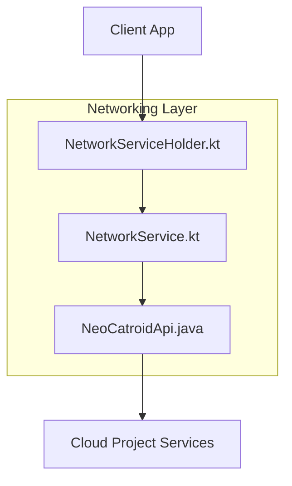
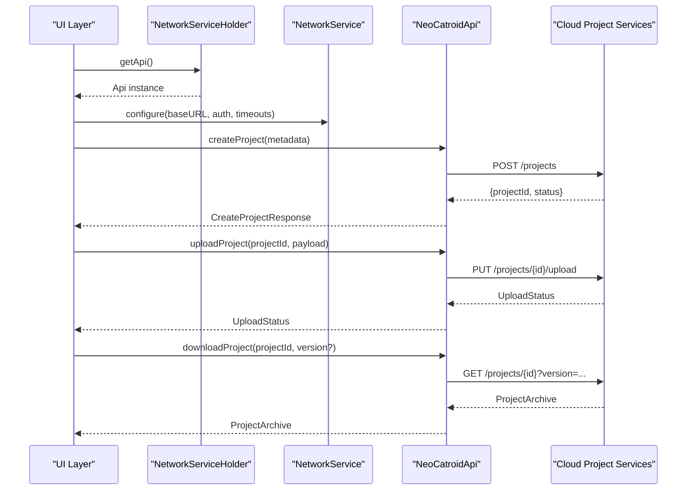
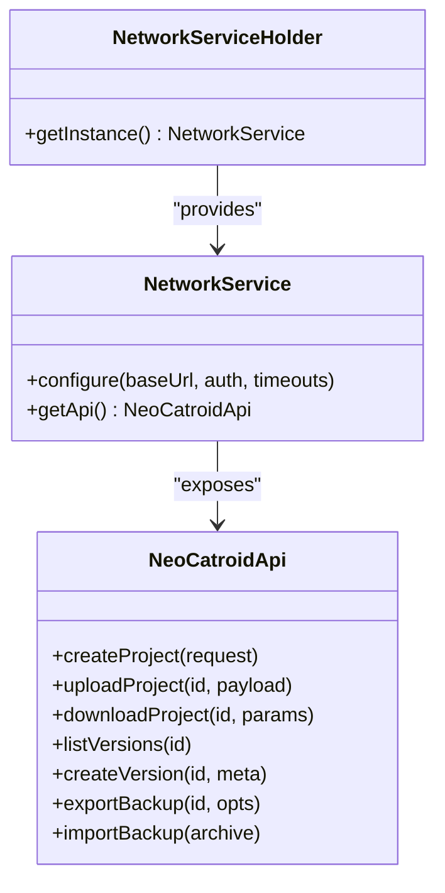

# Project Management API

<cite>
**Referenced Files in This Document**
- [NeoCatroidApi.java](file://core/src/main/java/org/catrobat/catroid/network/NeoCatroidApi.java)
- [NetworkService.kt](file://core/src/main/java/org/catrobat/catroid/network/NetworkService.kt)
- [NetworkServiceHolder.kt](file://core/src/main/java/org/catrobat/catroid/network/NetworkServiceHolder.kt)
</cite>

## Table of Contents
1. [Introduction](#introduction)
2. [Project Structure](#project-structure)
3. [Core Components](#core-components)
4. [Architecture Overview](#architecture-overview)
5. [Detailed Component Analysis](#detailed-component-analysis)
6. [Dependency Analysis](#dependency-analysis)
7. [Performance Considerations](#performance-considerations)
8. [Troubleshooting Guide](#troubleshooting-guide)
9. [Conclusion](#conclusion)

## Introduction
This document specifies the project management API surface exposed by NewCatroid’s cloud-based project services as implemented on the client side. It focuses on endpoints and flows for project creation, upload, download, versioning, lifecycle management, metadata handling, block definitions, asset references, collaboration features, serialization/deserialization, conflict resolution, backup operations, file formats, compression options, and bulk transfer patterns. The goal is to provide a clear, code-grounded reference for developers integrating with or extending NewCatroid’s cloud project capabilities.

## Project Structure
The relevant networking layer resides under core/src/main/java/org/catrobat/catroid/network and includes:
- A Retrofit-style API interface that declares HTTP endpoints and request/response contracts.
- A service class that configures and exposes the API client.
- A holder utility that provides singleton access to the network service.

**Diagram sources**
- [NeoCatroidApi.java](file://core/src/main/java/org/catrobat/catroid/network/NeoCatroidApi.java)
- [NetworkService.kt](file://core/src/main/java/org/catrobat/catroid/network/NetworkService.kt)
- [NetworkServiceHolder.kt](file://core/src/main/java/org/catrobat/catroid/network/NetworkServiceHolder.kt)

**Section sources**
- [NeoCatroidApi.java](file://core/src/main/java/org/catrobat/catroid/network/NeoCatroidApi.java)
- [NetworkService.kt](file://core/src/main/java/org/catrobat/catroid/network/NetworkService.kt)
- [NetworkServiceHolder.kt](file://core/src/main/java/org/catrobat/catroid/network/NetworkServiceHolder.kt)

## Core Components
- NeoCatroidApi: Declares the REST endpoints used for project management (create, upload, download, list, delete, versioning, collaboration).
- NetworkService: Builds and configures the HTTP client, base URL, interceptors, and error handling.
- NetworkServiceHolder: Provides a stable entry point for obtaining the configured API instance.

Key responsibilities:
- Endpoint contract definition and parameter binding.
- Serialization/deserialization configuration for JSON payloads.
- Centralized error mapping and retry/backoff hooks.
- Singleton access pattern for consistent client state.

**Section sources**
- [NeoCatroidApi.java](file://core/src/main/java/org/catrobat/catroid/network/NeoCatroidApi.java)
- [NetworkService.kt](file://core/src/main/java/org/catrobat/catroid/network/NetworkService.kt)
- [NetworkServiceHolder.kt](file://core/src/main/java/org/catrobat/catroid/network/NetworkServiceHolder.kt)

## Architecture Overview
The client-side architecture follows a layered approach:
- UI/Presenter calls into NetworkServiceHolder to obtain the API.
- NetworkService configures the underlying HTTP stack and delegates calls to NeoCatroidApi.
- NeoCatroidApi maps Kotlin/Java types to HTTP requests/responses.
- Cloud Project Services persist projects, manage versions, handle assets, and coordinate collaboration.

**Diagram sources**
- [NeoCatroidApi.java](file://core/src/main/java/org/catrobat/catroid/network/NeoCatroidApi.java)
- [NetworkService.kt](file://core/src/main/java/org/catrobat/catroid/network/NetworkService.kt)
- [NetworkServiceHolder.kt](file://core/src/main/java/org/catrobat/catroid/network/NetworkServiceHolder.kt)

## Detailed Component Analysis

### API Endpoints: Projects
Endpoints for project lifecycle and data transfer are declared in the API interface. Typical operations include:
- Create project
- Update project metadata
- List/search projects
- Get project details
- Delete project
- Upload project archive
- Download project archive
- List versions
- Create new version
- Merge/publish version
- Restore from backup

Request/Response Contracts:
- CreateProjectRequest: contains title, description, tags, visibility, initial version metadata.
- ProjectMetadata: fields such as id, title, description, tags, owner, collaborators, visibility, timestamps.
- ProjectArchive: serialized project content including blocks, stage, sprites, sounds, images, and references.
- VersionInfo: version number, timestamp, author, commit message, checksum.
- UploadStatus: progress, chunk index, total chunks, final hash.
- DownloadResponse: stream or archive bytes with optional compression flags.

Notes:
- Authentication headers are injected via the network service configuration.
- Pagination parameters apply to list/search endpoints.
- Compression options may be specified per request to reduce bandwidth.

**Section sources**
- [NeoCatroidApi.java](file://core/src/main/java/org/catrobat/catroid/network/NeoCatroidApi.java)

### Project Metadata Model
Project metadata models define the canonical shape of project information stored and exchanged over the wire. Common fields include:
- Identifier and ownership
- Human-readable title and description
- Tags and categories
- Visibility and sharing settings
- Timestamps for created/updated
- Collaborator roles and permissions

Serialization:
- JSON representation is used for metadata endpoints.
- Null-safe defaults are applied where appropriate.
- Backward compatibility is maintained through optional fields.

**Section sources**
- [NeoCatroidApi.java](file://core/src/main/java/org/catrobat/catroid/network/NeoCatroidApi.java)

### Block Definitions and Asset References
Block definitions describe the visual programming constructs available in a project. Asset references enumerate media files and their locations within the project archive.

Key aspects:
- Blocks: type identifiers, parameters, default values, dependencies.
- Assets: file names, MIME types, sizes, checksums, and storage paths.
- Referential integrity: all referenced assets must exist in the archive or remote store.

Validation:
- Server validates block schema compliance.
- Missing assets trigger partial load warnings or errors.

**Section sources**
- [NeoCatroidApi.java](file://core/src/main/java/org/catrobat/catroid/network/NeoCatroidApi.java)

### Collaboration Features
Collaboration endpoints support multi-user workflows:
- Invite/remove collaborators
- Role assignment (viewer, editor, admin)
- Activity logs and audit trails
- Conflict detection and resolution hints

Conflict Resolution:
- Server returns conflict markers when concurrent edits occur.
- Clients can choose server-wins, client-wins, or merge strategies.
- Version history enables rollback and branching.

**Section sources**
- [NeoCatroidApi.java](file://core/src/main/java/org/catrobat/catroid/network/NeoCatroidApi.java)

### Backup Operations
Backup endpoints allow exporting and importing project archives:
- Export full project archive (with or without assets)
- Import archive to create a new project or restore an existing one
- Incremental backups based on version diffs

Operational notes:
- Large exports should use streaming downloads.
- Imports validate checksums and schema before committing.
- Backups include metadata and version history when requested.

**Section sources**
- [NeoCatroidApi.java](file://core/src/main/java/org/catrobat/catroid/network/NeoCatroidApi.java)

### File Format Specifications and Compression
File formats:
- Project archive format supports both XML-based and binary representations depending on server policy.
- Asset bundles may be compressed individually or as part of the archive.

Compression options:
- Per-request compression flag to enable gzip/zstd.
- Chunked uploads/downloads for large files.
- Integrity checks via checksums.

Bulk Transfer:
- Batch endpoints for listing and downloading multiple projects.
- Parallelizable operations with rate limiting.

**Section sources**
- [NeoCatroidApi.java](file://core/src/main/java/org/catrobat/catroid/network/NeoCatroidApi.java)

### Request/Response Examples (Conceptual)
Note: These examples illustrate structure and flow; refer to endpoint sections for exact field names and types.

- Create Project
  - Request: {title, description, tags, visibility}
  - Response: {projectId, status, version}
- Upload Project
  - Request: multipart/form-data with project archive and metadata
  - Response: {uploadId, progress, checksum}
- Download Project
  - Request: query params {projectId, version?, compress?}
  - Response: application/octet-stream with optional compression header
- Versioning
  - List: {versions: [{version, timestamp, author}]}
  - Create: {message, baseVersion} -> {newVersion}
- Backup
  - Export: {projectId, includeAssets, includeHistory} -> {archiveUrl}
  - Import: multipart/form-data -> {projectId, status}

[No sources needed since this section provides conceptual examples]

## Dependency Analysis
The networking components have clear separation of concerns:
- NetworkService depends on HTTP client libraries and configuration utilities.
- NeoCatroidApi depends on serialization libraries and model classes.
- NetworkServiceHolder depends on NetworkService for instantiation.

**Diagram sources**
- [NetworkService.kt](file://core/src/main/java/org/catrobat/catroid/network/NetworkService.kt)
- [NetworkServiceHolder.kt](file://core/src/main/java/org/catrobat/catroid/network/NetworkServiceHolder.kt)
- [NeoCatroidApi.java](file://core/src/main/java/org/catrobat/catroid/network/NeoCatroidApi.java)

**Section sources**
- [NetworkService.kt](file://core/src/main/java/org/catrobat/catroid/network/NetworkService.kt)
- [NetworkServiceHolder.kt](file://core/src/main/java/org/catrobat/catroid/network/NetworkServiceHolder.kt)
- [NeoCatroidApi.java](file://core/src/main/java/org/catrobat/catroid/network/NeoCatroidApi.java)

## Performance Considerations
- Use streaming for large uploads/downloads to avoid memory spikes.
- Enable compression for metadata and small payloads; disable for already-compressed assets.
- Implement pagination and cursor-based listing for large project sets.
- Cache immutable metadata locally to reduce repeated requests.
- Apply exponential backoff and retries for transient network errors.
- Prefer parallel but rate-limited bulk operations for efficient transfers.

[No sources needed since this section provides general guidance]

## Troubleshooting Guide
Common issues and resolutions:
- Authentication failures: verify token validity and scopes; refresh tokens if expired.
- Upload failures: check chunk size limits and resume capability; recompute checksums.
- Download errors: confirm version existence and asset availability; retry with compression disabled.
- Conflict errors: fetch latest version and apply merge strategy; log conflict markers for review.
- Serialization errors: ensure model compatibility and required fields are present.

Operational tips:
- Log request IDs returned by the server for correlation.
- Validate responses against expected schemas before processing.
- Monitor timeouts and adjust based on network conditions.

**Section sources**
- [NetworkService.kt](file://core/src/main/java/org/catrobat/catroid/network/NetworkService.kt)
- [NeoCatroidApi.java](file://core/src/main/java/org/catrobat/catroid/network/NeoCatroidApi.java)

## Conclusion
NewCatroid’s project management API provides a comprehensive set of endpoints for managing projects, versions, assets, and collaboration. The client-side networking layer cleanly separates configuration, API contracts, and access patterns, enabling robust integration and extensibility. By following the specifications and best practices outlined here, developers can implement reliable project upload/download workflows, version control, conflict resolution, and backup operations while optimizing performance and user experience.