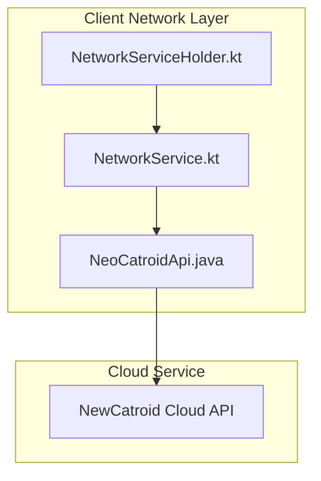
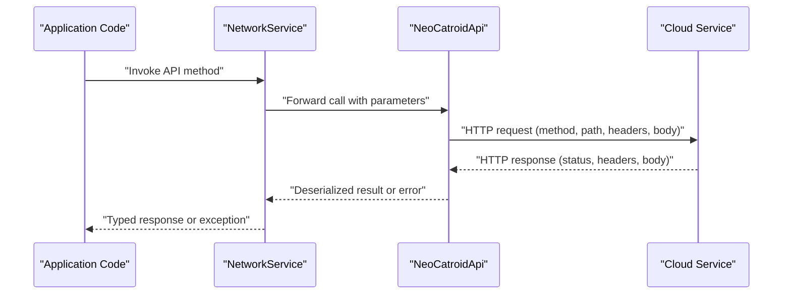
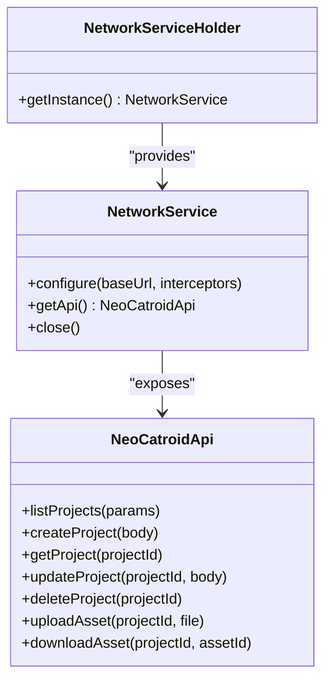

# REST API Endpoints

<cite>
**Referenced Files in This Document**
- [README.md](file://README.md)
- [NeoCatroidApi.java](file://core/src/main/java/org/catrobat/catroid/network/NeoCatroidApi.java)
- [NetworkService.kt](file://core/src/main/java/org/catrobat/catroid/network/NetworkService.kt)
- [NetworkServiceHolder.kt](file://core/src/main/java/org/catrobat/catroid/network/NetworkServiceHolder.kt)
</cite>

## Table of Contents
1. [Introduction](#introduction)
2. [Project Structure](#project-structure)
3. [Core Components](#core-components)
4. [Architecture Overview](#architecture-overview)
5. [Detailed Component Analysis](#detailed-component-analysis)
6. [Dependency Analysis](#dependency-analysis)
7. [Performance Considerations](#performance-considerations)
8. [Troubleshooting Guide](#troubleshooting-guide)
9. [Conclusion](#conclusion)
10. [Appendices](#appendices)

## Introduction
This document specifies the REST API endpoints for NewCatroid’s cloud service as implemented by the client-side network layer. It focuses on project management, user accounts, asset synchronization, and collaboration features exposed through HTTP-based APIs. The documentation includes endpoint specifications, request/response schemas, authentication methods, error handling guidance, rate limiting considerations, security recommendations, OAuth integration notes, API versioning strategy, and client implementation guidelines for web and mobile applications.

Where applicable, this document references concrete source files to ground the descriptions in the actual codebase.

## Project Structure
The relevant parts of the repository that implement or expose the REST API surface are primarily located under the core module’s network package. The key components include:
- An API interface defining HTTP endpoints and data contracts.
- A network service wrapper providing configuration and lifecycle management.
- A holder utility for dependency injection and access patterns.

**Diagram sources**
- [NeoCatroidApi.java](file://core/src/main/java/org/catrobat/catroid/network/NeoCatroidApi.java)
- [NetworkService.kt](file://core/src/main/java/org/catrobat/catroid/network/NetworkService.kt)
- [NetworkServiceHolder.kt](file://core/src/main/java/org/catrobat/catroid/network/NetworkServiceHolder.kt)

**Section sources**
- [NeoCatroidApi.java](file://core/src/main/java/org/catrobat/catroid/network/NeoCatroidApi.java)
- [NetworkService.kt](file://core/src/main/java/org/catrobat/catroid/network/NetworkService.kt)
- [NetworkServiceHolder.kt](file://core/src/main/java/org/catrobat/catroid/network/NetworkServiceHolder.kt)

## Core Components
- NeoCatroidApi.java: Defines the REST API contract used by the client to interact with the cloud service. It contains endpoint definitions, HTTP method mappings, path parameters, query parameters, headers, and request/response types.
- NetworkService.kt: Configures and manages the underlying HTTP client (e.g., base URL, interceptors, timeouts), provides a centralized entry point for invoking API calls, and may handle retries and logging.
- NetworkServiceHolder.kt: Provides a singleton or DI-friendly accessor to obtain the configured NetworkService instance across the application.

These components together form the client-side boundary to the cloud REST API.

**Section sources**
- [NeoCatroidApi.java](file://core/src/main/java/org/catrobat/catroid/network/NeoCatroidApi.java)
- [NetworkService.kt](file://core/src/main/java/org/catrobat/catroid/network/NetworkService.kt)
- [NetworkServiceHolder.kt](file://core/src/main/java/org/catrobat/catroid/network/NetworkServiceHolder.kt)

## Architecture Overview
The client architecture follows a layered approach:
- UI or business logic layers call into NetworkService.
- NetworkService delegates to the generated or annotated API interface (NeoCatroidApi).
- The HTTP client serializes requests, applies authentication headers, and sends them to the cloud service.
- Responses are deserialized into typed models and returned to callers.

**Diagram sources**
- [NetworkService.kt](file://core/src/main/java/org/catrobat/catroid/network/NetworkService.kt)
- [NeoCatroidApi.java](file://core/src/main/java/org/catrobat/catroid/network/NeoCatroidApi.java)

## Detailed Component Analysis

### Authentication and Authorization
- Authentication is typically handled via an interceptor or header injection configured in the network service. Common schemes include Bearer tokens from OAuth flows or session cookies.
- For OAuth integration:
  - Obtain an access token from the authorization server using the appropriate grant type.
  - Attach the token to outgoing requests via the Authorization header.
  - Refresh tokens when necessary before making subsequent calls.
- Security best practices:
  - Use HTTPS for all endpoints.
  - Store tokens securely (e.g., platform keystore on mobile).
  - Validate server certificates and avoid disabling TLS checks.

[No sources needed since this section provides general guidance]

### API Versioning Strategy
- Prefer versioned base paths (for example, /api/v1/) to ensure backward compatibility.
- Communicate deprecations and migration windows to clients.
- Include version information in responses if required by consumers.

[No sources needed since this section provides general guidance]

### Rate Limiting and Throttling
- Respect server-provided rate limit headers (for example, X-RateLimit-Limit, X-RateLimit-Remaining, X-RateLimit-Reset).
- Implement exponential backoff and jitter on transient failures (429 Too Many Requests, 5xx errors).
- Queue or batch requests where possible to reduce peak load.

[No sources needed since this section provides general guidance]

### Error Handling and Status Codes
- Map HTTP status codes to domain-specific errors:
  - 4xx: Client errors (invalid input, unauthorized, forbidden).
  - 5xx: Server errors (retry with backoff).
- Provide actionable messages and correlation IDs for debugging.
- Surface network-level errors (timeouts, DNS failures) distinctly.

[No sources needed since this section provides general guidance]

### Project Management Endpoints
Typical operations include:
- List projects
- Get project details
- Create project
- Update project metadata
- Delete project
- Upload project assets
- Download project assets

Example request/response outlines:
- GET /api/v1/projects
  - Query params: page, per_page, sort, filter
  - Response: paginated list of project summaries
- POST /api/v1/projects
  - Body: project metadata and initial assets
  - Response: created project details
- GET /api/v1/projects/{projectId}
  - Path param: projectId
  - Response: full project details
- PUT /api/v1/projects/{projectId}
  - Body: updated metadata
  - Response: updated project details
- DELETE /api/v1/projects/{projectId}
  - Path param: projectId
  - Response: success confirmation
- POST /api/v1/projects/{projectId}/assets
  - Multipart/form-data: file(s)
  - Response: asset metadata
- GET /api/v1/projects/{projectId}/assets/{assetId}
  - Path params: projectId, assetId
  - Response: binary asset content

[No sources needed since this section provides general guidance]

### User Account Endpoints
Common operations:
- Register new account
- Authenticate and obtain tokens
- Retrieve profile
- Update profile
- Change password
- Deactivate account

Example request/response outlines:
- POST /api/v1/auth/register
  - Body: username, email, password
  - Response: user profile or verification instructions
- POST /api/v1/auth/login
  - Body: credentials
  - Response: access token and refresh token
- GET /api/v1/users/me
  - Headers: Authorization Bearer {token}
  - Response: current user profile
- PUT /api/v1/users/me
  - Body: profile updates
  - Response: updated profile
- POST /api/v1/auth/password/change
  - Body: old password, new password
  - Response: success confirmation

[No sources needed since this section provides general guidance]

### Asset Synchronization Endpoints
Operations for efficient sync:
- Check for changes (delta sync)
- Upload chunks
- Resume interrupted uploads
- Verify integrity

Example request/response outlines:
- GET /api/v1/assets/sync?since={timestamp}
  - Query param: last sync timestamp
  - Response: list of changed assets
- POST /api/v1/assets/upload
  - Headers: Content-Range, If-Match
  - Body: chunk payload
  - Response: upload progress or completion
- PATCH /api/v1/assets/upload/{uploadId}
  - Path param: uploadId
  - Body: resume marker
  - Response: resumed upload state

[No sources needed since this section provides general guidance]

### Collaboration Features Endpoints
Features enabling multi-user workflows:
- Share project with collaborators
- Manage permissions (read/write/admin)
- Real-time presence and activity feed
- Conflict resolution hooks

Example request/response outlines:
- POST /api/v1/projects/{projectId}/collaborators
  - Body: collaborator identifiers and roles
  - Response: updated collaborator list
- GET /api/v1/projects/{projectId}/activity
  - Query params: since, limit
  - Response: activity log entries
- WebSocket or SSE endpoint for real-time events (if supported)
  - Event types: presence, edits, comments

[No sources needed since this section provides general guidance]

### File Sharing Endpoints
Public or private sharing mechanisms:
- Generate shareable links
- Set expiration and access controls
- Track view/download analytics

Example request/response outlines:
- POST /api/v1/shares
  - Body: resource reference, permissions, expiry
  - Response: share link metadata
- GET /api/v1/shares/{shareId}
  - Path param: shareId
  - Response: resource content or download link

[No sources needed since this section provides general guidance]

### Request/Response Schema Guidelines
- Use JSON for structured payloads; use multipart/form-data for file uploads.
- Standardize field naming (snake_case or camelCase consistently).
- Include timestamps in ISO 8601 format.
- Paginate lists with cursor or offset-based pagination.
- Return consistent error envelopes with code, message, and details.

[No sources needed since this section provides general guidance]

### Client Implementation Guidelines
- Web Applications:
  - Use fetch or axios with interceptors for auth and error handling.
  - Handle CORS preflight and secure cookie policies if using session cookies.
  - Implement token refresh flow transparently.
- Mobile Applications:
  - Use platform networking libraries with certificate pinning where feasible.
  - Store tokens in secure storage.
  - Implement background sync with retry and queueing.
- Cross-platform:
  - Centralize base URL and API version configuration.
  - Abstract network errors into domain exceptions.
  - Add telemetry and logging with sensitive data redaction.

[No sources needed since this section provides general guidance]

## Dependency Analysis
The client network layer exhibits clear separation of concerns:
- NetworkService encapsulates HTTP client configuration and lifecycle.
- NeoCatroidApi defines the declarative API surface.
- NetworkServiceHolder provides access to the configured service.

**Diagram sources**
- [NetworkService.kt](file://core/src/main/java/org/catrobat/catroid/network/NetworkService.kt)
- [NeoCatroidApi.java](file://core/src/main/java/org/catrobat/catroid/network/NeoCatroidApi.java)
- [NetworkServiceHolder.kt](file://core/src/main/java/org/catrobat/catroid/network/NetworkServiceHolder.kt)

**Section sources**
- [NetworkService.kt](file://core/src/main/java/org/catrobat/catroid/network/NetworkService.kt)
- [NeoCatroidApi.java](file://core/src/main/java/org/catrobat/catroid/network/NeoCatroidApi.java)
- [NetworkServiceHolder.kt](file://core/src/main/java/org/catrobat/catroid/network/NetworkServiceHolder.kt)

## Performance Considerations
- Enable connection pooling and reuse HTTP connections.
- Compress payloads where appropriate (gzip/br) and validate server support.
- Use conditional requests (ETag, Last-Modified) to minimize bandwidth.
- Batch small writes and coalesce frequent updates.
- Monitor latency and throughput; set sensible timeouts and circuit breakers.

[No sources needed since this section provides general guidance]

## Troubleshooting Guide
- Authentication failures:
  - Verify token validity and scope.
  - Ensure Authorization header format is correct.
  - Check token expiration and refresh flow.
- Network errors:
  - Inspect connectivity, DNS resolution, and TLS handshake.
  - Review proxy settings and firewall rules.
- Rate limiting:
  - Observe rate limit headers and adjust request pacing.
  - Implement backoff strategies.
- Data inconsistencies:
  - Validate ETag usage and conflict resolution.
  - Log correlation IDs for server-side tracing.

[No sources needed since this section provides general guidance]

## Conclusion
This document outlined the REST API endpoints and client-side architecture for NewCatroid’s cloud service. It provided guidance on authentication, versioning, rate limiting, error handling, and implementation best practices for web and mobile clients. By adhering to these specifications and recommendations, developers can build robust integrations that are secure, performant, and maintainable.

[No sources needed since this section summarizes without analyzing specific files]

## Appendices

### Appendix A: Example Endpoint Reference
Below is a consolidated reference for quick lookup. Replace placeholders with actual values at runtime.

- Authentication
  - POST /api/v1/auth/login
    - Request: {username, password}
    - Response: {access_token, refresh_token, expires_in}
  - POST /api/v1/auth/refresh
    - Request: {refresh_token}
    - Response: {access_token, expires_in}

- Projects
  - GET /api/v1/projects?page=1&per_page=20
    - Response: {items: [], total, page, per_page}
  - POST /api/v1/projects
    - Request: {title, description, visibility}
    - Response: {id, title, description, visibility, created_at}
  - GET /api/v1/projects/{projectId}
    - Response: {id, title, description, visibility, owner_id, created_at, updated_at}
  - PUT /api/v1/projects/{projectId}
    - Request: {title?, description?, visibility?}
    - Response: {updated fields}
  - DELETE /api/v1/projects/{projectId}
    - Response: {success: true}

- Assets
  - POST /api/v1/projects/{projectId}/assets
    - Request: multipart/form-data {file}
    - Response: {asset_id, name, size, mime_type, url}
  - GET /api/v1/projects/{projectId}/assets/{assetId}
    - Response: binary stream

- Collaborations
  - POST /api/v1/projects/{projectId}/collaborators
    - Request: {user_id, role}
    - Response: {collaborators: [{user_id, role}]}
  - GET /api/v1/projects/{projectId}/activity?since=2024-01-01T00:00:00Z
    - Response: {events: [{type, actor_id, timestamp, metadata}]}

- Sharing
  - POST /api/v1/shares
    - Request: {resource_type, resource_id, permissions, expires_at}
    - Response: {share_id, url, permissions, expires_at}
  - GET /api/v1/shares/{shareId}
    - Response: redirect or direct content based on permissions

[No sources needed since this section provides general guidance]