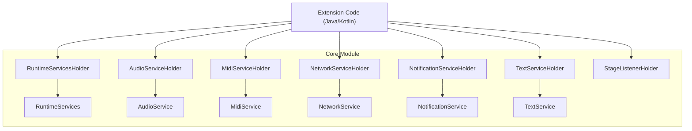
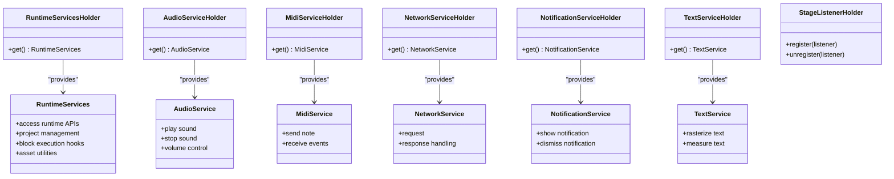
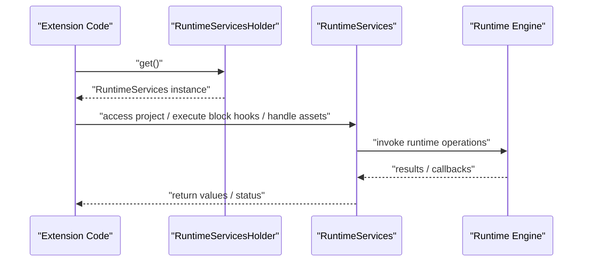
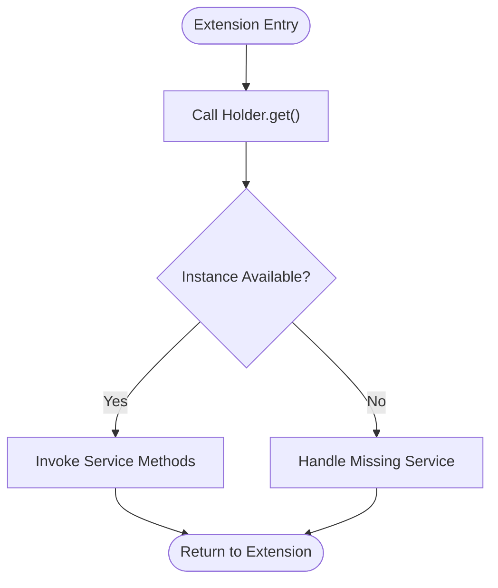
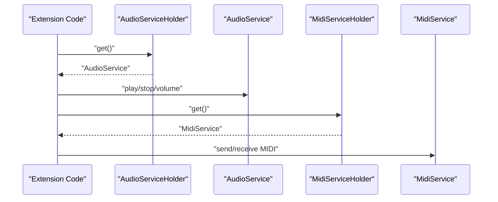
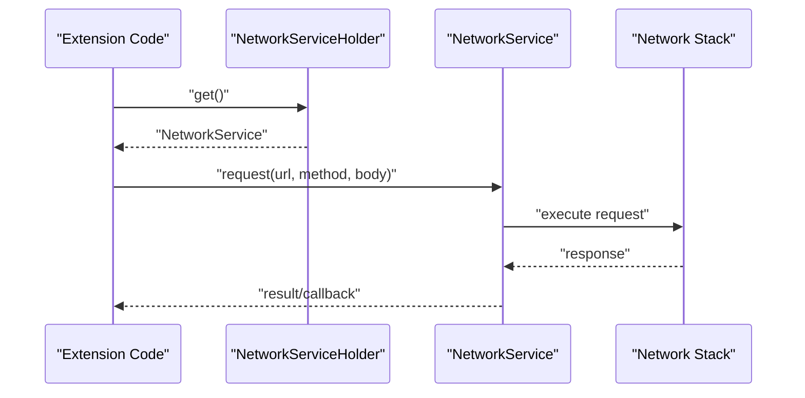
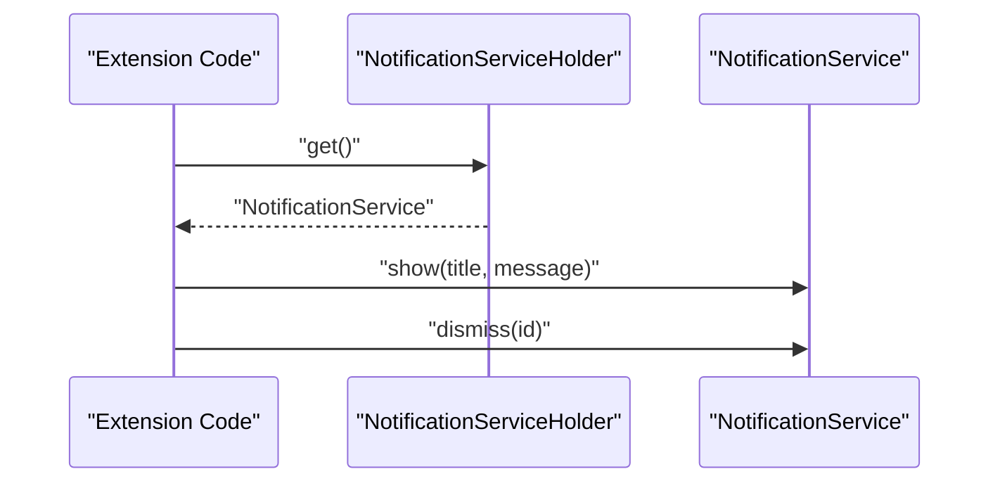
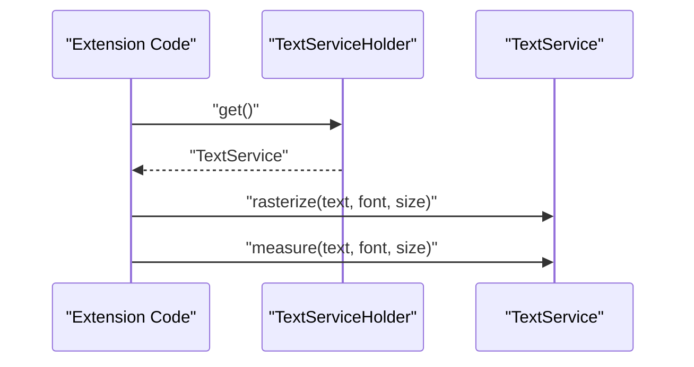
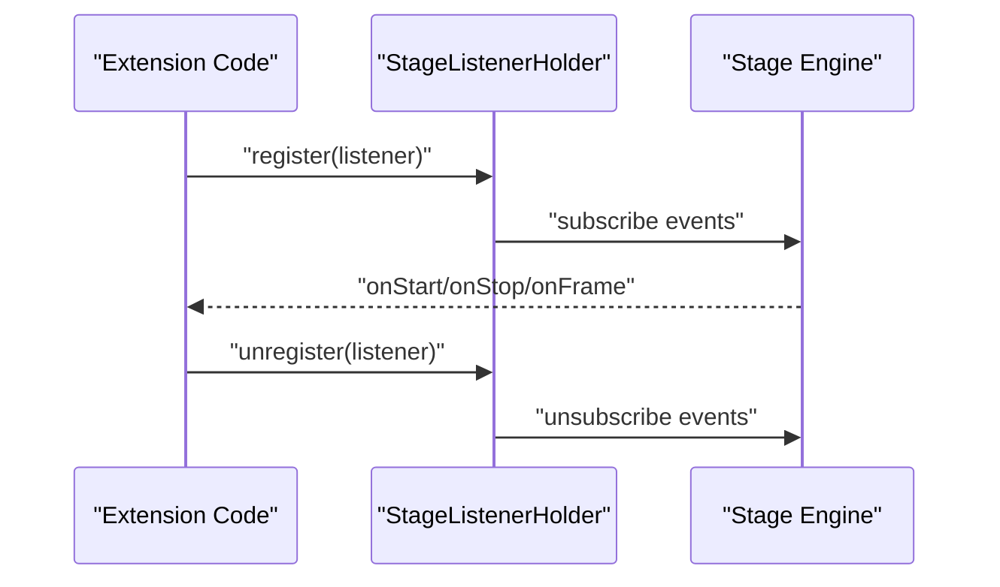
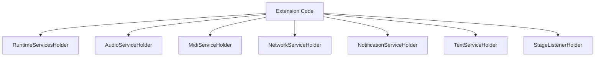

# Java/Kotlin Android SDK

<cite>
**Referenced Files in This Document**
- [RuntimeServices.kt](file://core/src/main/java/org/catrobat/catroid/runtime/RuntimeServices.kt)
- [RuntimeServicesHolder.kt](file://core/src/main/java/org/catrobat/catroid/runtime/RuntimeServicesHolder.kt)
- [AudioService.kt](file://core/src/main/java/org/catrobat/catroid/audio/AudioService.kt)
- [AudioServiceHolder.kt](file://core/src/main/java/org/catrobat/catroid/audio/AudioServiceHolder.kt)
- [MidiService.kt](file://core/src/main/java/org/catrobat/catroid/audio/MidiService.kt)
- [MidiServiceHolder.kt](file://core/src/main/java/org/catrobat/catroid/audio/MidiServiceHolder.kt)
- [NetworkService.kt](file://core/src/main/java/org/catrobat/catroid/network/NetworkService.kt)
- [NetworkServiceHolder.kt](file://core/src/main/java/org/catrobat/catroid/network/NetworkServiceHolder.kt)
- [NotificationService.kt](file://core/src/main/java/org/catrobat/catroid/notification/NotificationService.kt)
- [NotificationServiceHolder.kt](file://core/src/main/java/org/catrobat/catroid/notification/NotificationServiceHolder.kt)
- [TextService.kt](file://core/src/main/java/org/catrobat/catroid/text/TextService.kt)
- [TextServiceHolder.kt](file://core/src/main/java/org/catrobat/catroid/text/TextServiceHolder.kt)
- [StageListenerHolder.kt](file://core/src/main/java/org/catrobat/catroid/stage/StageListenerHolder.kt)
- [build.gradle](file://core/build.gradle)
</cite>

## Table of Contents
1. [Introduction](#introduction)
2. [Project Structure](#project-structure)
3. [Core Components](#core-components)
4. [Architecture Overview](#architecture-overview)
5. [Detailed Component Analysis](#detailed-component-analysis)
6. [Dependency Analysis](#dependency-analysis)
7. [Performance Considerations](#performance-considerations)
8. [Troubleshooting Guide](#troubleshooting-guide)
9. [Conclusion](#conclusion)
10. [Appendices](#appendices)

## Introduction
This document provides comprehensive Java/Kotlin SDK documentation for extending the NewCatroid Android app. It focuses on:
- RuntimeServices API for accessing core runtime functionality such as project management, block execution hooks, and asset handling
- The service locator pattern implemented via *Holder classes for dependency injection
- Creating custom blocks using the Block API and integrating with the visual programming system
- Implementing hardware adapters to expose device capabilities to blocks
- Installation via Gradle dependencies, configuration setup, and permission requirements
- Threading considerations, memory management best practices, and debugging techniques for Android development

The goal is to enable developers to build robust extensions that integrate seamlessly with Catroid’s runtime and visual programming environment.

## Project Structure
At a high level, the extension SDK surface resides under the core module and exposes services through Holder classes. Key areas include:
- Runtime services and holders for dependency access
- Audio, MIDI, network, notification, text, and stage listener services
- Build configuration for integration into consumer apps or libraries

**Diagram sources**
- [RuntimeServices.kt](file://core/src/main/java/org/catrobat/catroid/runtime/RuntimeServices.kt)
- [RuntimeServicesHolder.kt](file://core/src/main/java/org/catrobat/catroid/runtime/RuntimeServicesHolder.kt)
- [AudioService.kt](file://core/src/main/java/org/catrobat/catroid/audio/AudioService.kt)
- [AudioServiceHolder.kt](file://core/src/main/java/org/catrobat/catroid/audio/AudioServiceHolder.kt)
- [MidiService.kt](file://core/src/main/java/org/catrobat/catroid/audio/MidiService.kt)
- [MidiServiceHolder.kt](file://core/src/main/java/org/catrobat/catroid/audio/MidiServiceHolder.kt)
- [NetworkService.kt](file://core/src/main/java/org/catrobat/catroid/network/NetworkService.kt)
- [NetworkServiceHolder.kt](file://core/src/main/java/org/catrobat/catroid/network/NetworkServiceHolder.kt)
- [NotificationService.kt](file://core/src/main/java/org/catrobat/catroid/notification/NotificationService.kt)
- [NotificationServiceHolder.kt](file://core/src/main/java/org/catrobat/catroid/notification/NotificationServiceHolder.kt)
- [TextService.kt](file://core/src/main/java/org/catrobat/catroid/text/TextService.kt)
- [TextServiceHolder.kt](file://core/src/main/java/org/catrobat/catroid/text/TextServiceHolder.kt)
- [StageListenerHolder.kt](file://core/src/main/java/org/catrobat/catroid/stage/StageListenerHolder.kt)

**Section sources**
- [build.gradle](file://core/build.gradle)

## Core Components
This section outlines the primary extension points exposed by the SDK:
- RuntimeServices: Central API for interacting with the runtime, including project lifecycle, block execution context, and asset utilities
- Service Holders: Static accessors providing dependency-injected instances of services (audio, MIDI, network, notifications, text, stage listeners)
- Stage Listener Holder: Mechanism to register/unregister stage event listeners from extensions

These components are designed to be accessed from extension code without coupling to the host application internals.

**Section sources**
- [RuntimeServices.kt](file://core/src/main/java/org/catrobat/catroid/runtime/RuntimeServices.kt)
- [RuntimeServicesHolder.kt](file://core/src/main/java/org/catrobat/catroid/runtime/RuntimeServicesHolder.kt)
- [AudioService.kt](file://core/src/main/java/org/catrobat/catroid/audio/AudioService.kt)
- [AudioServiceHolder.kt](file://core/src/main/java/org/catrobat/catroid/audio/AudioServiceHolder.kt)
- [MidiService.kt](file://core/src/main/java/org/catrobat/catroid/audio/MidiService.kt)
- [MidiServiceHolder.kt](file://core/src/main/java/org/catrobat/catroid/audio/MidiServiceHolder.kt)
- [NetworkService.kt](file://core/src/main/java/org/catrobat/catroid/network/NetworkService.kt)
- [NetworkServiceHolder.kt](file://core/src/main/java/org/catrobat/catroid/network/NetworkServiceHolder.kt)
- [NotificationService.kt](file://core/src/main/java/org/catrobat/catroid/notification/NotificationService.kt)
- [NotificationServiceHolder.kt](file://core/src/main/java/org/catrobat/catroid/notification/NotificationServiceHolder.kt)
- [TextService.kt](file://core/src/main/java/org/catrobat/catroid/text/TextService.kt)
- [TextServiceHolder.kt](file://core/src/main/java/org/catrobat/catroid/text/TextServiceHolder.kt)
- [StageListenerHolder.kt](file://core/src/main/java/org/catrobat/catroid/stage/StageListenerHolder.kt)

## Architecture Overview
The extension architecture follows a service locator pattern:
- Extensions obtain services via Holder classes
- Services encapsulate domain-specific functionality (audio, MIDI, network, notifications, text, stage events)
- RuntimeServices acts as a central facade for runtime features

**Diagram sources**
- [RuntimeServices.kt](file://core/src/main/java/org/catrobat/catroid/runtime/RuntimeServices.kt)
- [RuntimeServicesHolder.kt](file://core/src/main/java/org/catrobat/catroid/runtime/RuntimeServicesHolder.kt)
- [AudioService.kt](file://core/src/main/java/org/catrobat/catroid/audio/AudioService.kt)
- [AudioServiceHolder.kt](file://core/src/main/java/org/catrobat/catroid/audio/AudioServiceHolder.kt)
- [MidiService.kt](file://core/src/main/java/org/catrobat/catroid/audio/MidiService.kt)
- [MidiServiceHolder.kt](file://core/src/main/java/org/catrobat/catroid/audio/MidiServiceHolder.kt)
- [NetworkService.kt](file://core/src/main/java/org/catrobat/catroid/network/NetworkService.kt)
- [NetworkServiceHolder.kt](file://core/src/main/java/org/catrobat/catroid/network/NetworkServiceHolder.kt)
- [NotificationService.kt](file://core/src/main/java/org/catrobat/catroid/notification/NotificationService.kt)
- [NotificationServiceHolder.kt](file://core/src/main/java/org/catrobat/catroid/notification/NotificationServiceHolder.kt)
- [TextService.kt](file://core/src/main/java/org/catrobat/catroid/text/TextService.kt)
- [TextServiceHolder.kt](file://core/src/main/java/org/catrobat/catroid/text/TextServiceHolder.kt)
- [StageListenerHolder.kt](file://core/src/main/java/org/catrobat/catroid/stage/StageListenerHolder.kt)

## Detailed Component Analysis

### RuntimeServices API
RuntimeServices exposes core runtime capabilities for extensions:
- Project management: load, save, and query project state
- Block execution hooks: interact with running scripts and variables
- Asset handling: read/write assets used by blocks and stages

Typical usage patterns:
- Obtain RuntimeServices via RuntimeServicesHolder
- Use provided methods to manipulate project data and coordinate with the runtime

**Diagram sources**
- [RuntimeServices.kt](file://core/src/main/java/org/catrobat/catroid/runtime/RuntimeServices.kt)
- [RuntimeServicesHolder.kt](file://core/src/main/java/org/catrobat/catroid/runtime/RuntimeServicesHolder.kt)

**Section sources**
- [RuntimeServices.kt](file://core/src/main/java/org/catrobat/catroid/runtime/RuntimeServices.kt)
- [RuntimeServicesHolder.kt](file://core/src/main/java/org/catrobat/catroid/runtime/RuntimeServicesHolder.kt)

### Service Locator Pattern via *Holder Classes
Each service has a corresponding Holder class that provides static access to its singleton instance. This pattern decouples extensions from concrete implementations and simplifies dependency resolution.

Key holders:
- AudioServiceHolder
- MidiServiceHolder
- NetworkServiceHolder
- NotificationServiceHolder
- TextServiceHolder
- StageListenerHolder

Usage pattern:
- Call holder.get() to retrieve the service instance
- Invoke service methods appropriate to your extension’s needs

**Diagram sources**
- [AudioServiceHolder.kt](file://core/src/main/java/org/catrobat/catroid/audio/AudioServiceHolder.kt)
- [MidiServiceHolder.kt](file://core/src/main/java/org/catrobat/catroid/audio/MidiServiceHolder.kt)
- [NetworkServiceHolder.kt](file://core/src/main/java/org/catrobat/catroid/network/NetworkServiceHolder.kt)
- [NotificationServiceHolder.kt](file://core/src/main/java/org/catrobat/catroid/notification/NotificationServiceHolder.kt)
- [TextServiceHolder.kt](file://core/src/main/java/org/catrobat/catroid/text/TextServiceHolder.kt)
- [StageListenerHolder.kt](file://core/src/main/java/org/catrobat/catroid/stage/StageListenerHolder.kt)

**Section sources**
- [AudioServiceHolder.kt](file://core/src/main/java/org/catrobat/catroid/audio/AudioServiceHolder.kt)
- [MidiServiceHolder.kt](file://core/src/main/java/org/catrobat/catroid/audio/MidiServiceHolder.kt)
- [NetworkServiceHolder.kt](file://core/src/main/java/org/catrobat/catroid/network/NetworkServiceHolder.kt)
- [NotificationServiceHolder.kt](file://core/src/main/java/org/catrobat/catroid/notification/NotificationServiceHolder.kt)
- [TextServiceHolder.kt](file://core/src/main/java/org/catrobat/catroid/text/TextServiceHolder.kt)
- [StageListenerHolder.kt](file://core/src/main/java/org/catrobat/catroid/stage/StageListenerHolder.kt)

### Audio and MIDI Services
AudioService and MidiService provide audio playback and MIDI I/O capabilities. Extensions can use these services to:
- Play sounds triggered by blocks
- Send MIDI messages to external devices or synthesizers
- Manage volume and playback state

**Diagram sources**
- [AudioService.kt](file://core/src/main/java/org/catrobat/catroid/audio/AudioService.kt)
- [AudioServiceHolder.kt](file://core/src/main/java/org/catrobat/catroid/audio/AudioServiceHolder.kt)
- [MidiService.kt](file://core/src/main/java/org/catrobat/catroid/audio/MidiService.kt)
- [MidiServiceHolder.kt](file://core/src/main/java/org/catrobat/catroid/audio/MidiServiceHolder.kt)

**Section sources**
- [AudioService.kt](file://core/src/main/java/org/catrobat/catroid/audio/AudioService.kt)
- [AudioServiceHolder.kt](file://core/src/main/java/org/catrobat/catroid/audio/AudioServiceHolder.kt)
- [MidiService.kt](file://core/src/main/java/org/catrobat/catroid/audio/MidiService.kt)
- [MidiServiceHolder.kt](file://core/src/main/java/org/catrobat/catroid/audio/MidiServiceHolder.kt)

### Network Service
NetworkService abstracts HTTP requests and response handling. Extensions can:
- Perform GET/POST requests
- Handle JSON payloads
- Manage timeouts and errors

**Diagram sources**
- [NetworkService.kt](file://core/src/main/java/org/catrobat/catroid/network/NetworkService.kt)
- [NetworkServiceHolder.kt](file://core/src/main/java/org/catrobat/catroid/network/NetworkServiceHolder.kt)

**Section sources**
- [NetworkService.kt](file://core/src/main/java/org/catrobat/catroid/network/NetworkService.kt)
- [NetworkServiceHolder.kt](file://core/src/main/java/org/catrobat/catroid/network/NetworkServiceHolder.kt)

### Notification Service
NotificationService allows extensions to show and dismiss notifications. Typical uses:
- Alert users about background tasks completion
- Display status updates from hardware adapters

**Diagram sources**
- [NotificationService.kt](file://core/src/main/java/org/catrobat/catroid/notification/NotificationService.kt)
- [NotificationServiceHolder.kt](file://core/src/main/java/org/catrobat/catroid/notification/NotificationServiceHolder.kt)

**Section sources**
- [NotificationService.kt](file://core/src/main/java/org/catrobat/catroid/notification/NotificationService.kt)
- [NotificationServiceHolder.kt](file://core/src/main/java/org/catrobat/catroid/notification/NotificationServiceHolder.kt)

### Text Service
TextService provides text rasterization and measurement utilities. Extensions can:
- Generate bitmap text for custom blocks
- Measure text dimensions for layout calculations

**Diagram sources**
- [TextService.kt](file://core/src/main/java/org/catrobat/catroid/text/TextService.kt)
- [TextServiceHolder.kt](file://core/src/main/java/org/catrobat/catroid/text/TextServiceHolder.kt)

**Section sources**
- [TextService.kt](file://core/src/main/java/org/catrobat/catroid/text/TextService.kt)
- [TextServiceHolder.kt](file://core/src/main/java/org/catrobat/catroid/text/TextServiceHolder.kt)

### Stage Listener Integration
Extensions can register stage listeners to respond to runtime events (e.g., start, stop, frame updates). Use StageListenerHolder to manage registration and unregistration.

**Diagram sources**
- [StageListenerHolder.kt](file://core/src/main/java/org/catrobat/catroid/stage/StageListenerHolder.kt)

**Section sources**
- [StageListenerHolder.kt](file://core/src/main/java/org/catrobat/catroid/stage/StageListenerHolder.kt)

### Creating Custom Blocks and Hardware Adapters
To create custom blocks:
- Define block metadata and parameters
- Implement block logic using RuntimeServices and relevant services
- Register blocks with the visual programming system via provided APIs
- For hardware adapters, wrap device capabilities behind service interfaces and expose them through blocks

Best practices:
- Keep block logic lightweight; offload heavy work to background threads
- Use services for I/O-bound operations (network, audio, MIDI)
- Ensure thread safety when updating shared state

[No sources needed since this section doesn't analyze specific files]

## Dependency Analysis
The extension SDK relies on Holder classes to resolve services at runtime. Dependencies are minimal and focused on decoupling extension code from host implementation details.

**Diagram sources**
- [RuntimeServicesHolder.kt](file://core/src/main/java/org/catrobat/catroid/runtime/RuntimeServicesHolder.kt)
- [AudioServiceHolder.kt](file://core/src/main/java/org/catrobat/catroid/audio/AudioServiceHolder.kt)
- [MidiServiceHolder.kt](file://core/src/main/java/org/catrobat/catroid/audio/MidiServiceHolder.kt)
- [NetworkServiceHolder.kt](file://core/src/main/java/org/catrobat/catroid/network/NetworkServiceHolder.kt)
- [NotificationServiceHolder.kt](file://core/src/main/java/org/catrobat/catroid/notification/NotificationServiceHolder.kt)
- [TextServiceHolder.kt](file://core/src/main/java/org/catrobat/catroid/text/TextServiceHolder.kt)
- [StageListenerHolder.kt](file://core/src/main/java/org/catrobat/catroid/stage/StageListenerHolder.kt)

**Section sources**
- [build.gradle](file://core/build.gradle)

## Performance Considerations
- Avoid blocking the UI thread: perform long-running operations on background threads and post results back to the main thread
- Reuse resources: cache frequently used objects like bitmaps and connections where appropriate
- Minimize allocations inside hot paths: prefer object pooling for transient objects
- Limit network calls: batch requests and implement caching strategies
- Be mindful of memory leaks: unregister stage listeners and release resources when no longer needed

[No sources needed since this section provides general guidance]

## Troubleshooting Guide
Common issues and resolutions:
- Service not available: ensure the host app initializes services before calling Holder.get()
- Permission denied: verify required permissions are declared and granted at runtime for network and storage access
- Threading violations: confirm UI updates occur on the main thread; use handlers or coroutines appropriately
- Memory pressure: monitor large bitmap creation and reduce texture sizes; clear references when done

**Section sources**
- [RuntimeServicesHolder.kt](file://core/src/main/java/org/catrobat/catroid/runtime/RuntimeServicesHolder.kt)
- [NetworkServiceHolder.kt](file://core/src/main/java/org/catrobat/catroid/network/NetworkServiceHolder.kt)
- [StageListenerHolder.kt](file://core/src/main/java/org/catrobat/catroid/stage/StageListenerHolder.kt)

## Conclusion
The NewCatroid extension SDK provides a clean, service-oriented interface for building powerful extensions. By leveraging RuntimeServices and Holder-based dependency injection, you can integrate custom blocks, hardware adapters, and runtime interactions while maintaining separation of concerns and performance. Follow threading and memory guidelines to ensure stable operation within the Android environment.

[No sources needed since this section summarizes without analyzing specific files]

## Appendices

### Installation via Gradle
Add the core module as a dependency in your extension project’s Gradle configuration. Reference the core build file to determine the correct artifact coordinates and versioning strategy.

**Section sources**
- [build.gradle](file://core/build.gradle)

### Configuration Setup
- Initialize services early in your app lifecycle if required by your extension
- Declare necessary permissions in your manifest (e.g., internet, storage)
- Configure logging levels for debugging during development

**Section sources**
- [NetworkServiceHolder.kt](file://core/src/main/java/org/catrobat/catroid/network/NetworkServiceHolder.kt)
- [NotificationServiceHolder.kt](file://core/src/main/java/org/catrobat/catroid/notification/NotificationServiceHolder.kt)

### Complete Code Examples
For practical examples demonstrating common extension patterns:
- Accessing RuntimeServices and performing project operations
- Using AudioService and MidiService for sound and MIDI
- Performing network requests with NetworkService
- Showing notifications via NotificationService
- Rasterizing text with TextService
- Registering stage listeners with StageListenerHolder

Refer to the following files for implementation details and usage patterns:
- [RuntimeServices.kt](file://core/src/main/java/org/catrobat/catroid/runtime/RuntimeServices.kt)
- [RuntimeServicesHolder.kt](file://core/src/main/java/org/catrobat/catroid/runtime/RuntimeServicesHolder.kt)
- [AudioService.kt](file://core/src/main/java/org/catrobat/catroid/audio/AudioService.kt)
- [AudioServiceHolder.kt](file://core/src/main/java/org/catrobat/catroid/audio/AudioServiceHolder.kt)
- [MidiService.kt](file://core/src/main/java/org/catrobat/catroid/audio/MidiService.kt)
- [MidiServiceHolder.kt](file://core/src/main/java/org/catrobat/catroid/audio/MidiServiceHolder.kt)
- [NetworkService.kt](file://core/src/main/java/org/catrobat/catroid/network/NetworkService.kt)
- [NetworkServiceHolder.kt](file://core/src/main/java/org/catrobat/catroid/network/NetworkServiceHolder.kt)
- [NotificationService.kt](file://core/src/main/java/org/catrobat/catroid/notification/NotificationService.kt)
- [NotificationServiceHolder.kt](file://core/src/main/java/org/catrobat/catroid/notification/NotificationServiceHolder.kt)
- [TextService.kt](file://core/src/main/java/org/catrobat/catroid/text/TextService.kt)
- [TextServiceHolder.kt](file://core/src/main/java/org/catrobat/catroid/text/TextServiceHolder.kt)
- [StageListenerHolder.kt](file://core/src/main/java/org/catrobat/catroid/stage/StageListenerHolder.kt)