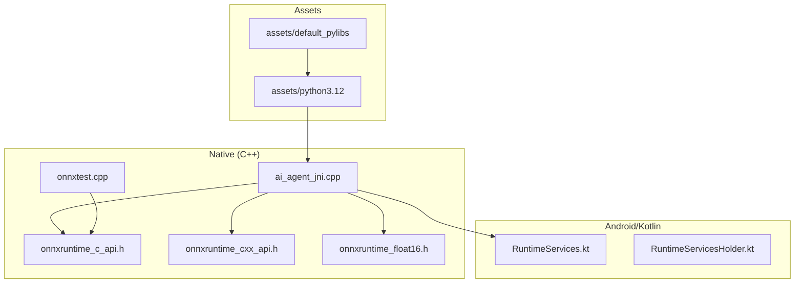
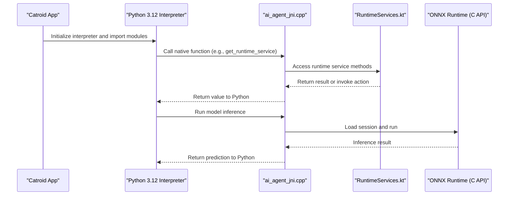
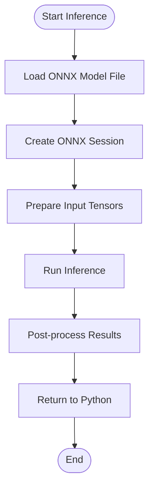
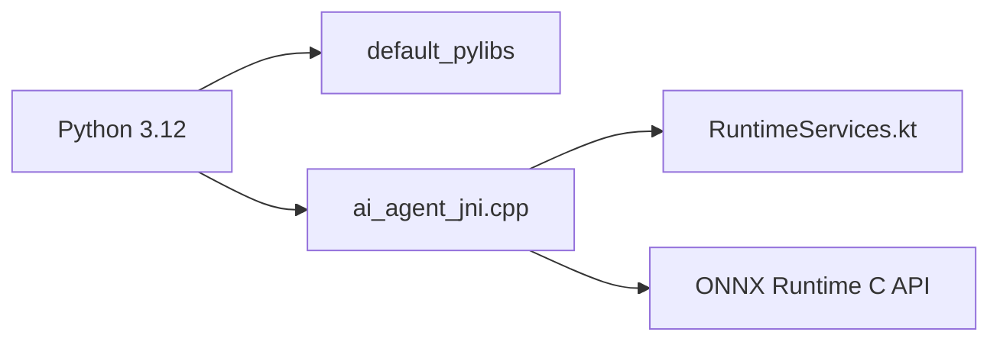

# Python Embedded SDK

<cite>
**Referenced Files in This Document**
- [README.md](file://README.md)
- [catroid/src/main/assets/python3.12/README.md](file://catroid/src/main/assets/python3.12/README.md)
- [catroid/src/main/assets/default_pylibs/README.md](file://catroid/src/main/assets/default_pylibs/README.md)
- [core/src/main/java/org/catrobat/catroid/runtime/RuntimeServices.kt](file://core/src/main/java/org/catrobat/catroid/runtime/RuntimeServices.kt)
- [core/src/main/java/org/catrobat/catroid/runtime/RuntimeServicesHolder.kt](file://core/src/main/java/org/catrobat/catroid/runtime/RuntimeServicesHolder.kt)
- [catroid/src/main/cpp/ai_agent_jni.cpp](file://catroid/src/main/cpp/ai_agent_jni.cpp)
- [catroid/src/main/cpp/onnxruntime_c_api.h](file://catroid/src/main/cpp/onnxruntime_c_api.h)
- [catroid/src/main/cpp/onnxruntime_cxx_api.h](file://catroid/src/main/cpp/onnxruntime_cxx_api.h)
- [catroid/src/main/cpp/onnxruntime_float16.h](file://catroid/src/main/cpp/onnxruntime_float16.h)
- [catroid/src/main/cpp/onnxtest.cpp](file://catroid/src/main/cpp/onnxtest.cpp)
</cite>

## Table of Contents
1. Introduction
2. Project Structure
3. Core Components
4. Architecture Overview
5. Detailed Component Analysis
6. Dependency Analysis
7. Performance Considerations
8. Troubleshooting Guide
9. Conclusion

## Introduction
This document describes the embedded Python 3.12 SDK for NewCatroid, focusing on interpreter integration, library loading, execution context management, and how Python scripts interact with Catroid runtime services, game objects, and hardware components. It also covers built-in libraries from default_pylibs, custom library integration, sandboxing considerations, setup procedures, resource allocation, error handling strategies, performance optimization techniques, and practical examples such as AI model inference, data processing, and automation tasks within the Catroid environment.

## Project Structure
The Python integration spans multiple layers:
- Assets: The Python 3.12 interpreter and standard library are bundled under assets/python3.12. Default Python libraries for Catroid live under assets/default_pylibs.
- Native layer: C++ code provides JNI bridges to expose runtime services and ONNX Runtime capabilities to Python.
- Android/Kotlin layer: Runtime services are exposed via Kotlin classes that can be accessed through the native bridge.

**Diagram sources**
- [catroid/src/main/assets/python3.12/README.md](file://catroid/src/main/assets/python3.12/README.md)
- [catroid/src/main/assets/default_pylibs/README.md](file://catroid/src/main/assets/default_pylibs/README.md)
- [catroid/src/main/cpp/ai_agent_jni.cpp](file://catroid/src/main/cpp/ai_agent_jni.cpp)
- [catroid/src/main/cpp/onnxruntime_c_api.h](file://catroid/src/main/cpp/onnxruntime_c_api.h)
- [catroid/src/main/cpp/onnxruntime_cxx_api.h](file://catroid/src/main/cpp/onnxruntime_cxx_api.h)
- [catroid/src/main/cpp/onnxruntime_float16.h](file://catroid/src/main/cpp/onnxruntime_float16.h)
- [catroid/src/main/cpp/onnxtest.cpp](file://catroid/src/main/cpp/onnxtest.cpp)
- [core/src/main/java/org/catrobat/catroid/runtime/RuntimeServices.kt](file://core/src/main/java/org/catrobat/catroid/runtime/RuntimeServices.kt)
- [core/src/main/java/org/catrobat/catroid/runtime/RuntimeServicesHolder.kt](file://core/src/main/java/org/catrobat/catroid/runtime/RuntimeServicesHolder.kt)

**Section sources**
- [README.md](file://README.md)
- [catroid/src/main/assets/python3.12/README.md](file://catroid/src/main/assets/python3.12/README.md)
- [catroid/src/main/assets/default_pylibs/README.md](file://catroid/src/main/assets/default_pylibs/README.md)

## Core Components
- Python 3.12 Interpreter: Bundled under assets/python3.12; includes the interpreter and standard library files required for execution.
- Default Libraries: Provided under assets/default_pylibs; these extend Python’s capabilities for Catroid-specific tasks.
- Native Bridge: ai_agent_jni.cpp exposes runtime services and ONNX Runtime functions to Python via JNI.
- Runtime Services: Exposed by RuntimeServices.kt and RuntimeServicesHolder.kt, enabling Python scripts to interact with Catroid’s runtime features.
- ONNX Runtime Integration: C/C++ headers and test utilities demonstrate how models can be loaded and executed from the native layer.

Key responsibilities:
- Initialize and manage the embedded Python interpreter lifecycle.
- Load and resolve modules from default_pylibs and project-scoped packages.
- Provide a secure execution context with controlled access to runtime services.
- Offer high-performance ML inference via ONNX Runtime through the native bridge.

**Section sources**
- [catroid/src/main/assets/python3.12/README.md](file://catroid/src/main/assets/python3.12/README.md)
- [catroid/src/main/assets/default_pylibs/README.md](file://catroid/src/main/assets/default_pylibs/README.md)
- [catroid/src/main/cpp/ai_agent_jni.cpp](file://catroid/src/main/cpp/ai_agent_jni.cpp)
- [core/src/main/java/org/catrobat/catroid/runtime/RuntimeServices.kt](file://core/src/main/java/org/catrobat/catroid/runtime/RuntimeServices.kt)
- [core/src/main/java/org/catrobat/catroid/runtime/RuntimeServicesHolder.kt](file://core/src/main/java/org/catrobat/catroid/runtime/RuntimeServicesHolder.kt)
- [catroid/src/main/cpp/onnxruntime_c_api.h](file://catroid/src/main/cpp/onnxruntime_c_api.h)
- [catroid/src/main/cpp/onnxruntime_cxx_api.h](file://catroid/src/main/cpp/onnxruntime_cxx_api.h)
- [catroid/src/main/cpp/onnxruntime_float16.h](file://catroid/src/main/cpp/onnxruntime_float16.h)
- [catroid/src/main/cpp/onnxtest.cpp](file://catroid/src/main/cpp/onnxtest.cpp)

## Architecture Overview
The embedded Python SDK integrates at three layers:
- Asset Layer: Python interpreter and libraries are packaged as assets.
- Native Layer: JNI functions bridge Python calls into Android/Kotlin runtime services and ONNX Runtime.
- Runtime Layer: Kotlin services provide game object manipulation, event handling, and hardware access.

**Diagram sources**
- [catroid/src/main/assets/python3.12/README.md](file://catroid/src/main/assets/python3.12/README.md)
- [catroid/src/main/cpp/ai_agent_jni.cpp](file://catroid/src/main/cpp/ai_agent_jni.cpp)
- [core/src/main/java/org/catrobat/catroid/runtime/RuntimeServices.kt](file://core/src/main/java/org/catrobat/catroid/runtime/RuntimeServices.kt)
- [catroid/src/main/cpp/onnxruntime_c_api.h](file://catroid/src/main/cpp/onnxruntime_c_api.h)

## Detailed Component Analysis

### Python 3.12 Interpreter Integration
- Location: assets/python3.12 contains the interpreter and standard library resources.
- Initialization: The app loads the interpreter from assets and sets up sys.path to include default_pylibs and project-scoped packages.
- Execution Context: A per-project context isolates variables and module imports to prevent cross-project interference.

Best practices:
- Pre-warm frequently used modules during project load.
- Cache compiled bytecode where possible to reduce startup time.
- Use isolated exec environments for untrusted scripts.

**Section sources**
- [catroid/src/main/assets/python3.12/README.md](file://catroid/src/main/assets/python3.12/README.md)

### Library Loading Mechanisms
- Built-in Libraries: Located under assets/default_pylibs; these provide Catroid-specific functionality.
- Custom Libraries: Place your package under project assets or external storage accessible to the interpreter; ensure __init__.py is present for packages.
- Module Resolution: The interpreter resolves modules using sys.path entries configured at initialization.

Guidelines:
- Keep third-party dependencies minimal and prebuilt for Android ABI compatibility.
- Validate module signatures and sizes before importing to mitigate security risks.

**Section sources**
- [catroid/src/main/assets/default_pylibs/README.md](file://catroid/src/main/assets/default_pylibs/README.md)

### Execution Context Management
- Isolation: Each script runs in its own namespace; shared state must be explicitly provided via the native bridge.
- Lifecycle: Scripts can be started, paused, and stopped; long-running tasks should yield control periodically.
- Resource Limits: Enforce timeouts and memory caps via the native layer to protect the host application.

Operational tips:
- Use background threads for heavy computations to keep UI responsive.
- Implement graceful shutdown hooks to release native resources.

**Section sources**
- [catroid/src/main/cpp/ai_agent_jni.cpp](file://catroid/src/main/cpp/ai_agent_jni.cpp)

### Accessing Runtime Services from Python
- Bridge Entry Points: ai_agent_jni.cpp exposes functions to call into RuntimeServices.kt.
- Service Access: Use the provided Python wrapper to obtain instances of runtime services (e.g., stage, audio, text).
- Event Handling: Subscribe to events like touch, timer, or sensor updates via service APIs.

Example workflow:
- Import the runtime service module.
- Register event callbacks.
- Manipulate stage objects (sprites, backgrounds) and trigger actions.

**Section sources**
- [catroid/src/main/cpp/ai_agent_jni.cpp](file://catroid/src/main/cpp/ai_agent_jni.cpp)
- [core/src/main/java/org/catrobat/catroid/runtime/RuntimeServices.kt](file://core/src/main/java/org/catrobat/catroid/runtime/RuntimeServices.kt)
- [core/src/main/java/org/catrobat/catroid/runtime/RuntimeServicesHolder.kt](file://core/src/main/java/org/catrobat/catroid/runtime/RuntimeServicesHolder.kt)

### Interacting with Game Objects and Hardware
- Game Objects: Modify sprite properties (position, rotation, visibility), play sounds, and update text elements through runtime services.
- Hardware: Access sensors and device capabilities via service wrappers exposed by the native bridge.

Security note:
- Restrict sensitive hardware calls to whitelisted operations.
- Validate inputs and sanitize outputs when bridging between Python and native layers.

**Section sources**
- [core/src/main/java/org/catrobat/catroid/runtime/RuntimeServices.kt](file://core/src/main/java/org/catrobat/catroid/runtime/RuntimeServices.kt)

### ONNX Runtime Integration for AI Models
- Headers: onnxruntime_c_api.h, onnxruntime_cxx_api.h, and onnxruntime_float16.h define the interface for model loading and inference.
- Test Utility: onnxtest.cpp demonstrates usage patterns for sessions and tensors.
- Python Path: ai_agent_jni.cpp provides entry points to initialize sessions and run inference from Python.

Typical flow:
- Load an ONNX model file from assets.
- Create a session and prepare input tensors.
- Execute inference and return results to Python.

**Diagram sources**
- [catroid/src/main/cpp/onnxruntime_c_api.h](file://catroid/src/main/cpp/onnxruntime_c_api.h)
- [catroid/src/main/cpp/onnxruntime_cxx_api.h](file://catroid/src/main/cpp/onnxruntime_cxx_api.h)
- [catroid/src/main/cpp/onnxruntime_float16.h](file://catroid/src/main/cpp/onnxruntime_float16.h)
- [catroid/src/main/cpp/onnxtest.cpp](file://catroid/src/main/cpp/onnxtest.cpp)
- [catroid/src/main/cpp/ai_agent_jni.cpp](file://catroid/src/main/cpp/ai_agent_jni.cpp)

**Section sources**
- [catroid/src/main/cpp/onnxruntime_c_api.h](file://catroid/src/main/cpp/onnxruntime_c_api.h)
- [catroid/src/main/cpp/onnxruntime_cxx_api.h](file://catroid/src/main/cpp/onnxruntime_cxx_api.h)
- [catroid/src/main/cpp/onnxruntime_float16.h](file://catroid/src/main/cpp/onnxruntime_float16.h)
- [catroid/src/main/cpp/onnxtest.cpp](file://catroid/src/main/cpp/onnxtest.cpp)
- [catroid/src/main/cpp/ai_agent_jni.cpp](file://catroid/src/main/cpp/ai_agent_jni.cpp)

### Security Sandboxing
- Module Allowlist: Only import modules from default_pylibs and approved project packages.
- Resource Quotas: Limit CPU time, memory usage, and I/O operations for running scripts.
- Network Restrictions: Disable or whitelist network access based on project permissions.

Implementation guidance:
- Wrap native calls with permission checks.
- Log all critical operations for auditability.
- Provide safe primitives for file and network access.

**Section sources**
- [catroid/src/main/assets/default_pylibs/README.md](file://catroid/src/main/assets/default_pylibs/README.md)
- [catroid/src/main/cpp/ai_agent_jni.cpp](file://catroid/src/main/cpp/ai_agent_jni.cpp)

### Setup Procedures for the Embedded Interpreter
- Bundle Preparation: Ensure assets/python3.12 and assets/default_pylibs are included in the APK.
- Initialization: Configure sys.path, set up logging, and register native bridges before executing user scripts.
- Project Context: Associate each project with a dedicated interpreter instance and module cache.

Checklist:
- Verify interpreter version matches 3.12.
- Confirm ABI-specific binaries are available for target devices.
- Validate asset paths and permissions.

**Section sources**
- [catroid/src/main/assets/python3.12/README.md](file://catroid/src/main/assets/python3.12/README.md)
- [catroid/src/main/assets/default_pylibs/README.md](file://catroid/src/main/assets/default_pylibs/README.md)

### Error Handling Strategies
- Python Exceptions: Catch and translate exceptions to user-friendly messages.
- Native Errors: Propagate JNI errors and ONNX Runtime status codes back to Python.
- Recovery: Implement fallbacks for missing models or unavailable services.

Recommendations:
- Centralize error logging with context (project ID, script name, stack trace).
- Provide retry mechanisms for transient failures.

**Section sources**
- [catroid/src/main/cpp/ai_agent_jni.cpp](file://catroid/src/main/cpp/ai_agent_jni.cpp)
- [catroid/src/main/cpp/onnxtest.cpp](file://catroid/src/main/cpp/onnxtest.cpp)

### Practical Examples

#### AI Model Integration
- Load an ONNX model from assets.
- Preprocess input frames or sensor data in Python.
- Invoke native inference via the bridge and post-process predictions.

Steps:
- Initialize ONNX session once per model.
- Reuse buffers to minimize allocations.
- Batch requests if supported by the model.

**Section sources**
- [catroid/src/main/cpp/onnxruntime_c_api.h](file://catroid/src/main/cpp/onnxruntime_c_api.h)
- [catroid/src/main/cpp/onnxruntime_cxx_api.h](file://catroid/src/main/cpp/onnxruntime_cxx_api.h)
- [catroid/src/main/cpp/onnxruntime_float16.h](file://catroid/src/main/cpp/onnxruntime_float16.h)
- [catroid/src/main/cpp/onnxtest.cpp](file://catroid/src/main/cpp/onnxtest.cpp)
- [catroid/src/main/cpp/ai_agent_jni.cpp](file://catroid/src/main/cpp/ai_agent_jni.cpp)

#### Data Processing
- Read CSV or JSON files from project assets.
- Perform transformations using built-in libraries.
- Write results back to project storage or pass them to runtime services.

Optimization tips:
- Stream large datasets instead of loading entirely into memory.
- Use efficient data structures and avoid unnecessary copies.

**Section sources**
- [catroid/src/main/assets/default_pylibs/README.md](file://catroid/src/main/assets/default_pylibs/README.md)

#### Automation Tasks
- Automate repetitive actions like batch renaming sprites or generating assets.
- Integrate with Catroid events to trigger workflows.
- Schedule periodic tasks using timers exposed by runtime services.

Safety measures:
- Validate file paths and content types.
- Provide undo/rollback capabilities for destructive operations.

**Section sources**
- [core/src/main/java/org/catrobat/catroid/runtime/RuntimeServices.kt](file://core/src/main/java/org/catrobat/catroid/runtime/RuntimeServices.kt)

## Dependency Analysis
The Python SDK depends on:
- Python 3.12 assets for interpreter and standard library.
- Default libraries for Catroid-specific functionality.
- Native JNI bridge to access runtime services and ONNX Runtime.
- Kotlin runtime services for game logic and hardware interaction.

**Diagram sources**
- [catroid/src/main/assets/python3.12/README.md](file://catroid/src/main/assets/python3.12/README.md)
- [catroid/src/main/assets/default_pylibs/README.md](file://catroid/src/main/assets/default_pylibs/README.md)
- [catroid/src/main/cpp/ai_agent_jni.cpp](file://catroid/src/main/cpp/ai_agent_jni.cpp)
- [core/src/main/java/org/catrobat/catroid/runtime/RuntimeServices.kt](file://core/src/main/java/org/catrobat/catroid/runtime/RuntimeServices.kt)
- [catroid/src/main/cpp/onnxruntime_c_api.h](file://catroid/src/main/cpp/onnxruntime_c_api.h)

**Section sources**
- [catroid/src/main/assets/python3.12/README.md](file://catroid/src/main/assets/python3.12/README.md)
- [catroid/src/main/assets/default_pylibs/README.md](file://catroid/src/main/assets/default_pylibs/README.md)
- [catroid/src/main/cpp/ai_agent_jni.cpp](file://catroid/src/main/cpp/ai_agent_jni.cpp)
- [core/src/main/java/org/catrobat/catroid/runtime/RuntimeServices.kt](file://core/src/main/java/org/catrobat/catroid/runtime/RuntimeServices.kt)
- [catroid/src/main/cpp/onnxruntime_c_api.h](file://catroid/src/main/cpp/onnxruntime_c_api.h)

## Performance Considerations
- Interpreter Warm-up: Pre-import common modules and compile bytecode to reduce startup latency.
- Memory Management: Reuse buffers for tensor operations and avoid frequent allocations.
- Threading: Offload heavy computations to background threads while keeping UI thread responsive.
- Model Optimization: Quantize models and use float16 where supported to improve speed and reduce memory footprint.
- Logging: Minimize log verbosity in production builds to reduce I/O overhead.

[No sources needed since this section provides general guidance]

## Troubleshooting Guide
Common issues and resolutions:
- Interpreter not found: Verify assets/python3.12 packaging and asset extraction paths.
- Module import errors: Check default_pylibs structure and sys.path configuration.
- JNI crashes: Inspect native logs and validate parameter marshalling between Python and C++.
- ONNX Runtime failures: Confirm model format compatibility and correct tensor shapes.

Diagnostic steps:
- Enable detailed logging for Python and native layers.
- Reproduce with minimal scripts to isolate problems.
- Validate asset integrity and checksums.

**Section sources**
- [catroid/src/main/assets/python3.12/README.md](file://catroid/src/main/assets/python3.12/README.md)
- [catroid/src/main/assets/default_pylibs/README.md](file://catroid/src/main/assets/default_pylibs/README.md)
- [catroid/src/main/cpp/ai_agent_jni.cpp](file://catroid/src/main/cpp/ai_agent_jni.cpp)
- [catroid/src/main/cpp/onnxtest.cpp](file://catroid/src/main/cpp/onnxtest.cpp)

## Conclusion
The embedded Python SDK enables powerful scripting within NewCatroid by integrating Python 3.12, providing rich libraries, and exposing runtime services through a secure native bridge. With careful attention to setup, sandboxing, error handling, and performance, developers can build sophisticated applications including AI-driven interactions, automated workflows, and advanced data processing—all within the Catroid environment.

[No sources needed since this section summarizes without analyzing specific files]