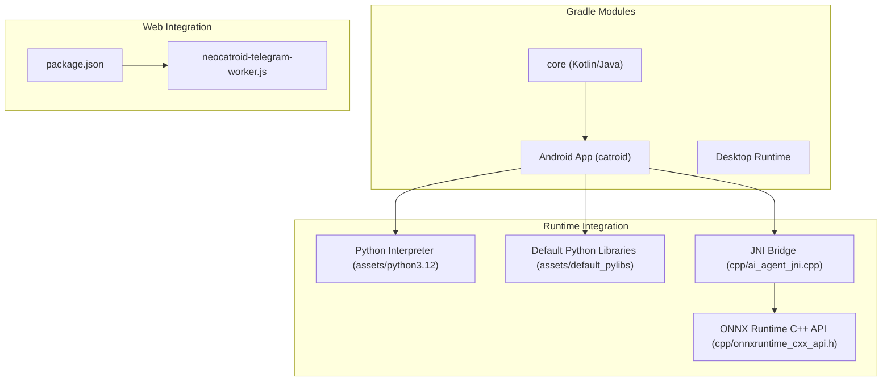
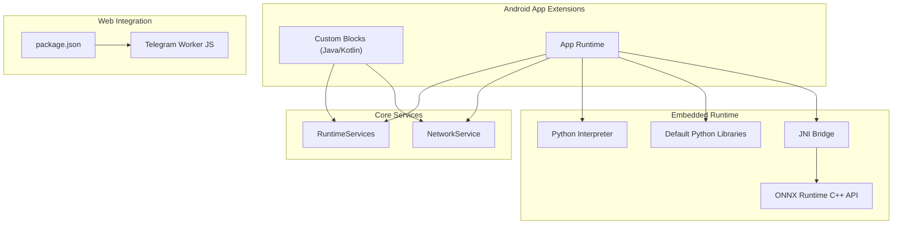
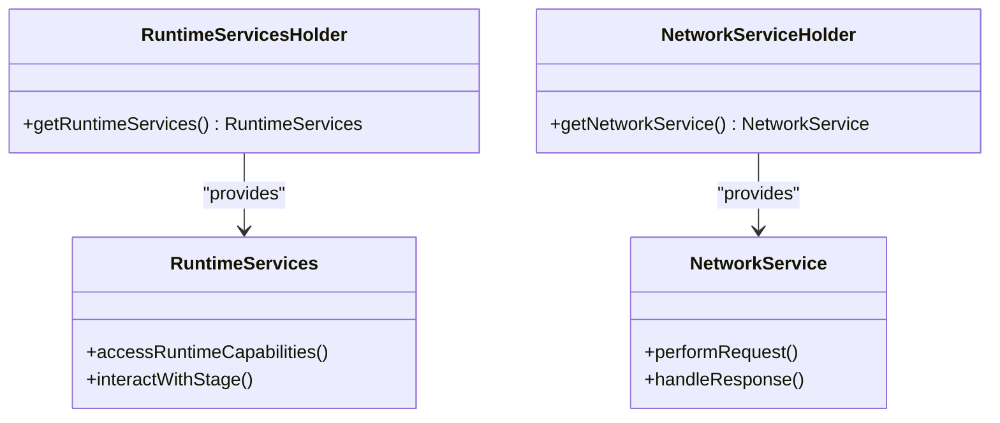
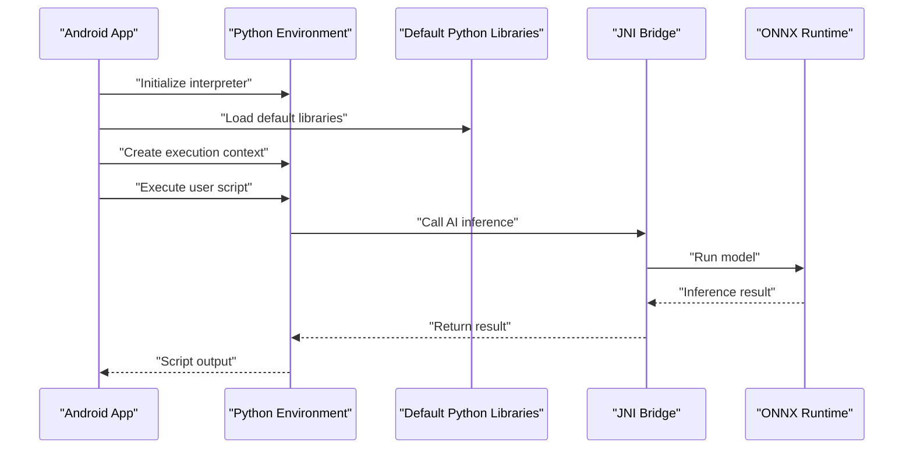
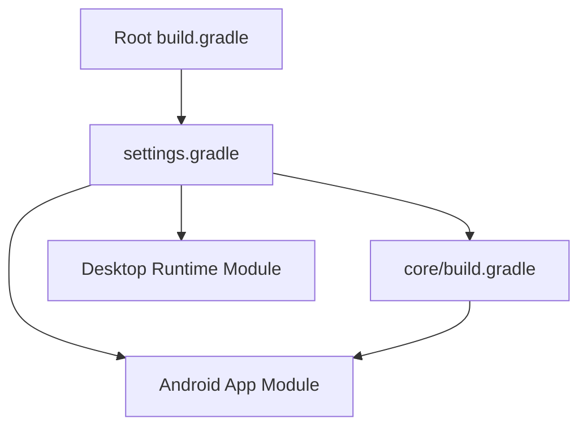

# SDK Documentation

<cite>
**Referenced Files in This Document**
- [README.md](file://README.md)
- [build.gradle](file://build.gradle)
- [settings.gradle](file://settings.gradle)
- [gradle.properties](file://gradle.properties)
- [core/build.gradle](file://core/build.gradle)
- [core/src/main/java/org/catrobat/catroid/runtime/RuntimeServices.kt](file://core/src/main/java/org/catrobat/catroid/runtime/RuntimeServices.kt)
- [core/src/main/java/org/catrobat/catroid/runtime/RuntimeServicesHolder.kt](file://core/src/main/java/org/catrobat/catroid/runtime/RuntimeServicesHolder.kt)
- [core/src/main/java/org/catrobat/catroid/network/NetworkService.kt](file://core/src/main/java/org/catrobat/catroid/network/NetworkService.kt)
- [core/src/main/java/org/catrobat/catroid/network/NetworkServiceHolder.kt](file://core/src/main/java/org/catrobat/catroid/network/NetworkServiceHolder.kt)
- [catroid/src/main/assets/default_pylibs/README.md](file://catroid/src/main/assets/default_pylibs/README.md)
- [catroid/src/main/assets/python3.12/README.md](file://catroid/src/main/assets/python3.12/README.md)
- [catroid/src/main/cpp/ai_agent_jni.cpp](file://catroid/src/main/cpp/ai_agent_jni.cpp)
- [catroid/src/main/cpp/onnxruntime_cxx_api.h](file://catroid/src/main/cpp/onnxruntime_cxx_api.h)
- [package.json](file://package.json)
- [neocatroid-telegram-worker.js](file://neocatroid-telegram-worker.js)
</cite>

## Table of Contents
1. [Introduction](#introduction)
2. [Project Structure](#project-structure)
3. [Core Components](#core-components)
4. [Architecture Overview](#architecture-overview)
5. [Detailed Component Analysis](#detailed-component-analysis)
6. [Dependency Analysis](#dependency-analysis)
7. [Performance Considerations](#performance-considerations)
8. [Troubleshooting Guide](#troubleshooting-guide)
9. [Conclusion](#conclusion)
10. [Appendices](#appendices)

## Introduction
This document provides SDK documentation for NewCatroid’s development kits and integration libraries across three primary targets:
- Android Java/Kotlin SDK for app extensions, runtime services, block creation utilities, and hardware abstraction layer access
- Python SDK for embedded code execution and AI model integration with interpreter setup, library loading, and execution context management
- Web API client for browser-based integrations, JavaScript bindings, and cross-platform compatibility

It includes installation instructions, dependency management, configuration options, and complete usage examples for each SDK variant.

## Project Structure
NewCatroid is a multi-module Gradle project that exposes SDKs through shared core modules, Android-specific runtime components, and web-facing assets. The key areas relevant to SDKs are:
- Core module providing runtime services and network abstractions
- Android runtime integrating Python interpreter and ONNX Runtime via JNI
- Web assets and worker scripts for browser-side integrations

**Diagram sources**
- [build.gradle](file://build.gradle)
- [settings.gradle](file://settings.gradle)
- [core/build.gradle](file://core/build.gradle)
- [catroid/src/main/assets/python3.12/README.md](file://catroid/src/main/assets/python3.12/README.md)
- [catroid/src/main/assets/default_pylibs/README.md](file://catroid/src/main/assets/default_pylibs/README.md)
- [catroid/src/main/cpp/ai_agent_jni.cpp](file://catroid/src/main/cpp/ai_agent_jni.cpp)
- [catroid/src/main/cpp/onnxruntime_cxx_api.h](file://catroid/src/main/cpp/onnxruntime_cxx_api.h)
- [package.json](file://package.json)
- [neocatroid-telegram-worker.js](file://neocatroid-telegram-worker.js)

**Section sources**
- [build.gradle](file://build.gradle)
- [settings.gradle](file://settings.gradle)
- [gradle.properties](file://gradle.properties)

## Core Components
The Android SDK surface centers on runtime services and network abstractions exposed from the core module. These provide:
- Runtime service accessors for application lifecycle and stage interactions
- Network service holders for HTTP requests and remote data access
- Text and audio services used by blocks and stages

Key classes and responsibilities:
- RuntimeServices: central runtime capabilities accessed by blocks and stages
- RuntimeServicesHolder: holder pattern for accessing runtime services
- NetworkService: network operations abstraction
- NetworkServiceHolder: holder pattern for network service access

These components are designed to be consumed by Android app extensions and custom blocks.

**Section sources**
- [core/src/main/java/org/catrobat/catroid/runtime/RuntimeServices.kt](file://core/src/main/java/org/catrobat/catroid/runtime/RuntimeServices.kt)
- [core/src/main/java/org/catrobat/catroid/runtime/RuntimeServicesHolder.kt](file://core/src/main/java/org/catrobat/catroid/runtime/RuntimeServicesHolder.kt)
- [core/src/main/java/org/catrobat/catroid/network/NetworkService.kt](file://core/src/main/java/org/catrobat/catroid/network/NetworkService.kt)
- [core/src/main/java/org/catrobat/catroid/network/NetworkServiceHolder.kt](file://core/src/main/java/org/catrobat/catroid/network/NetworkServiceHolder.kt)

## Architecture Overview
The architecture integrates multiple layers:
- Core services (Kotlin/Java) expose APIs for Android apps and blocks
- Android runtime embeds Python interpreter and default libraries
- JNI bridge connects Android to native AI inference via ONNX Runtime
- Web assets and workers enable browser-based integrations

**Diagram sources**
- [core/src/main/java/org/catrobat/catroid/runtime/RuntimeServices.kt](file://core/src/main/java/org/catrobat/catroid/runtime/RuntimeServices.kt)
- [core/src/main/java/org/catrobat/catroid/network/NetworkService.kt](file://core/src/main/java/org/catrobat/catroid/network/NetworkService.kt)
- [catroid/src/main/assets/python3.12/README.md](file://catroid/src/main/assets/python3.12/README.md)
- [catroid/src/main/assets/default_pylibs/README.md](file://catroid/src/main/assets/default_pylibs/README.md)
- [catroid/src/main/cpp/ai_agent_jni.cpp](file://catroid/src/main/cpp/ai_agent_jni.cpp)
- [catroid/src/main/cpp/onnxruntime_cxx_api.h](file://catroid/src/main/cpp/onnxruntime_cxx_api.h)
- [package.json](file://package.json)
- [neocatroid-telegram-worker.js](file://neocatroid-telegram-worker.js)

## Detailed Component Analysis

### Android Java/Kotlin SDK
Purpose: Provide extension points for Android apps and custom blocks to interact with runtime services, perform network operations, and leverage hardware abstractions.

Key elements:
- RuntimeServices: centralized runtime capabilities
- RuntimeServicesHolder: accessor for runtime services
- NetworkService: network operations abstraction
- NetworkServiceHolder: accessor for network service

Usage patterns:
- Access runtime services via holder to interact with stage and lifecycle
- Use network service holder to perform HTTP requests and handle responses
- Integrate custom blocks by referencing runtime and network services

**Diagram sources**
- [core/src/main/java/org/catrobat/catroid/runtime/RuntimeServices.kt](file://core/src/main/java/org/catrobat/catroid/runtime/RuntimeServices.kt)
- [core/src/main/java/org/catrobat/catroid/runtime/RuntimeServicesHolder.kt](file://core/src/main/java/org/catrobat/catroid/runtime/RuntimeServicesHolder.kt)
- [core/src/main/java/org/catrobat/catroid/network/NetworkService.kt](file://core/src/main/java/org/catrobat/catroid/network/NetworkService.kt)
- [core/src/main/java/org/catrobat/catroid/network/NetworkServiceHolder.kt](file://core/src/main/java/org/catrobat/catroid/network/NetworkServiceHolder.kt)

Installation and dependencies:
- Add the core module as a dependency in your Android app or extension module
- Ensure Gradle settings include the core module
- Configure build properties as needed

Configuration options:
- Review gradle.properties for global build flags
- Adjust module-level build.gradle for feature toggles

Usage example outline:
- Initialize holder instances at app startup
- Retrieve services from holders
- Call runtime and network methods from custom blocks

**Section sources**
- [core/build.gradle](file://core/build.gradle)
- [core/src/main/java/org/catrobat/catroid/runtime/RuntimeServices.kt](file://core/src/main/java/org/catrobat/catroid/runtime/RuntimeServices.kt)
- [core/src/main/java/org/catrobat/catroid/runtime/RuntimeServicesHolder.kt](file://core/src/main/java/org/catrobat/catroid/runtime/RuntimeServicesHolder.kt)
- [core/src/main/java/org/catrobat/catroid/network/NetworkService.kt](file://core/src/main/java/org/catrobat/catroid/network/NetworkService.kt)
- [core/src/main/java/org/catrobat/catroid/network/NetworkServiceHolder.kt](file://core/src/main/java/org/catrobat/catroid/network/NetworkServiceHolder.kt)
- [gradle.properties](file://gradle.properties)

### Python SDK for Embedded Execution and AI Integration
Purpose: Enable embedded Python execution within Android runtime and integrate AI models using ONNX Runtime via JNI.

Interpreter setup:
- Python interpreter assets are included under python3.12
- Default Python libraries are provided under default_pylibs

Library loading:
- Load standard and custom Python libraries from assets
- Configure sys.path to include default libraries

Execution context management:
- Create isolated execution contexts per script
- Manage imports and built-ins safely

AI model integration:
- Use JNI bridge to call ONNX Runtime from Python
- Load model metadata and run inference

**Diagram sources**
- [catroid/src/main/assets/python3.12/README.md](file://catroid/src/main/assets/python3.12/README.md)
- [catroid/src/main/assets/default_pylibs/README.md](file://catroid/src/main/assets/default_pylibs/README.md)
- [catroid/src/main/cpp/ai_agent_jni.cpp](file://catroid/src/main/cpp/ai_agent_jni.cpp)
- [catroid/src/main/cpp/onnxruntime_cxx_api.h](file://catroid/src/main/cpp/onnxruntime_cxx_api.h)

Installation and dependencies:
- Include Python interpreter assets in your APK
- Bundle default Python libraries into assets
- Ensure native libraries for ONNX Runtime are packaged

Configuration options:
- Set interpreter initialization parameters
- Configure library paths and import hooks

Usage example outline:
- Initialize interpreter and load libraries
- Prepare execution context
- Execute Python scripts and handle outputs
- Invoke AI inference via JNI when needed

**Section sources**
- [catroid/src/main/assets/python3.12/README.md](file://catroid/src/main/assets/python3.12/README.md)
- [catroid/src/main/assets/default_pylibs/README.md](file://catroid/src/main/assets/default_pylibs/README.md)
- [catroid/src/main/cpp/ai_agent_jni.cpp](file://catroid/src/main/cpp/ai_agent_jni.cpp)
- [catroid/src/main/cpp/onnxruntime_cxx_api.h](file://catroid/src/main/cpp/onnxruntime_cxx_api.h)

### Web API Client and JavaScript Bindings
Purpose: Provide browser-based integrations using JavaScript bindings and worker scripts for cross-platform compatibility.

Client setup:
- Use package.json to manage dependencies
- Integrate worker script for background tasks

Cross-platform considerations:
- Ensure compatibility across browsers and environments
- Handle asynchronous operations via workers

Usage example outline:
- Install dependencies via package manager
- Import client bindings in your web app
- Initialize worker and make API calls

**Section sources**
- [package.json](file://package.json)
- [neocatroid-telegram-worker.js](file://neocatroid-telegram-worker.js)

## Dependency Analysis
The project uses Gradle to manage modules and dependencies. Key files:
- Root build.gradle defines common configurations
- settings.gradle lists included modules
- Module-level build.gradle files define specific dependencies

**Diagram sources**
- [build.gradle](file://build.gradle)
- [settings.gradle](file://settings.gradle)
- [core/build.gradle](file://core/build.gradle)

**Section sources**
- [build.gradle](file://build.gradle)
- [settings.gradle](file://settings.gradle)
- [core/build.gradle](file://core/build.gradle)

## Performance Considerations
- Minimize interpreter initialization overhead by reusing contexts where possible
- Cache frequently used Python libraries and model artifacts
- Batch network requests and use connection pooling
- Profile JNI calls to reduce overhead during AI inference
- Optimize asset loading for Python interpreter and libraries

## Troubleshooting Guide
Common issues and resolutions:
- Interpreter not found: verify Python assets are bundled correctly
- Library import errors: ensure default libraries are accessible via sys.path
- JNI failures: check native library packaging and ABI compatibility
- Network timeouts: review network service configuration and retry policies
- Web worker errors: validate worker script availability and CORS settings

**Section sources**
- [catroid/src/main/assets/python3.12/README.md](file://catroid/src/main/assets/python3.12/README.md)
- [catroid/src/main/assets/default_pylibs/README.md](file://catroid/src/main/assets/default_pylibs/README.md)
- [catroid/src/main/cpp/ai_agent_jni.cpp](file://catroid/src/main/cpp/ai_agent_jni.cpp)
- [package.json](file://package.json)
- [neocatroid-telegram-worker.js](file://neocatroid-telegram-worker.js)

## Conclusion
NewCatroid’s SDKs provide robust integration points for Android app extensions, embedded Python execution, and web-based clients. By leveraging core runtime services, embedded interpreter capabilities, and web bindings, developers can create rich, interactive experiences across platforms. Follow the installation and configuration guidance to integrate these SDKs effectively.

## Appendices

### Installation Instructions Summary
- Android Java/Kotlin SDK: add core module dependency, configure Gradle, initialize holders
- Python SDK: bundle interpreter and libraries, set up execution contexts, integrate JNI for AI
- Web API client: install dependencies, import bindings, initialize worker

### Configuration Options Summary
- Gradle properties for build flags
- Runtime service configuration for network and stage interactions
- Python interpreter initialization parameters
- Web worker and client settings

[No sources needed since this section summarizes without analyzing specific files]