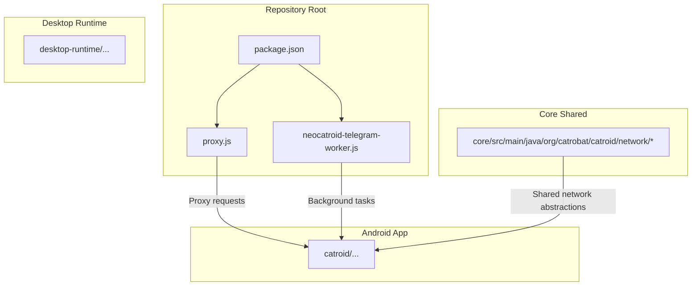
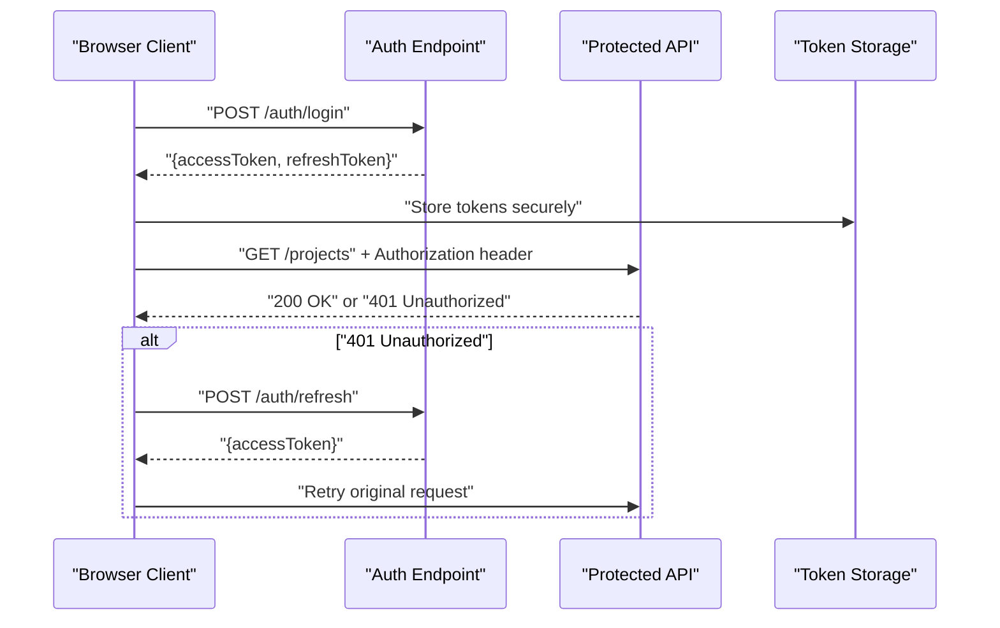
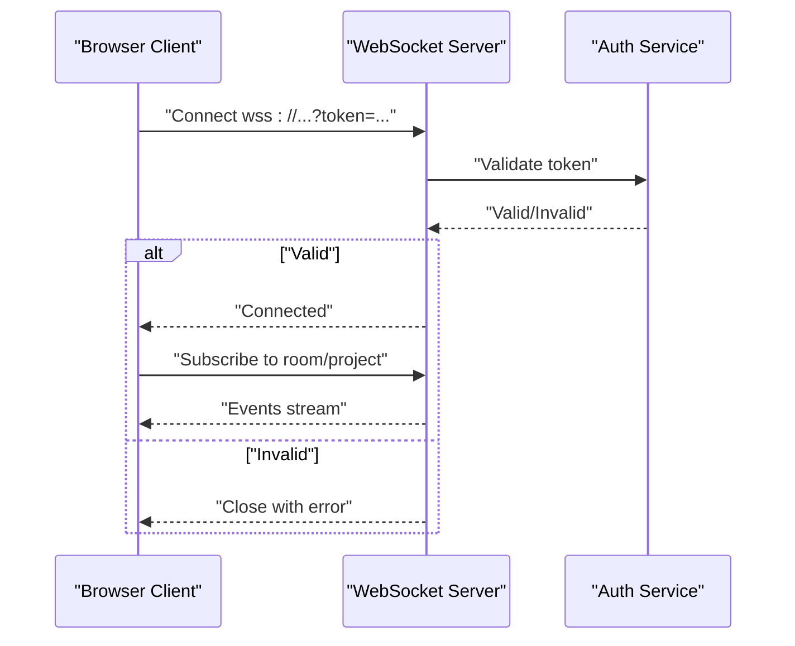
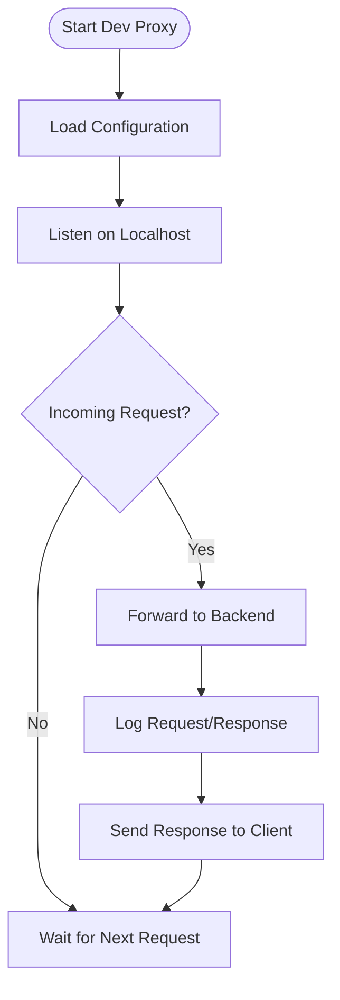
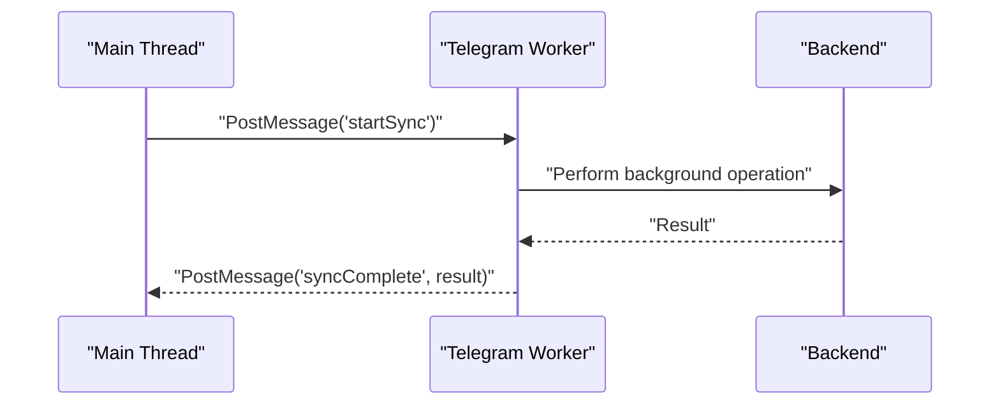
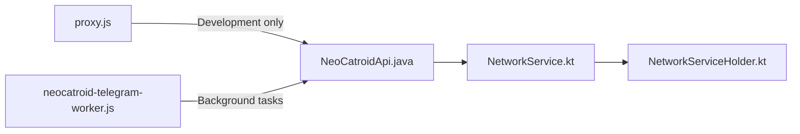

# Web API Client

<cite>
**Referenced Files in This Document**
- [README.md](file://README.md)
- [package.json](file://package.json)
- [proxy.js](file://proxy.js)
- [neocatroid-telegram-worker.js](file://neocatroid-telegram-worker.js)
- [catroid/src/main/java/org/catrobat/catroid/network/NeoCatroidApi.java](file://catroid/src/main/java/org/catrobat/catroid/network/NeoCatroidApi.java)
- [core/src/main/java/org/catrobat/catroid/network/NetworkService.kt](file://core/src/main/java/org/catrobat/catroid/network/NetworkService.kt)
- [core/src/main/java/org/catrobat/catroid/network/NetworkServiceHolder.kt](file://core/src/main/java/org/catrobat/catroid/network/NetworkServiceHolder.kt)
</cite>

## Table of Contents
1. [Introduction](#introduction)
2. [Project Structure](#project-structure)
3. [Core Components](#core-components)
4. [Architecture Overview](#architecture-overview)
5. [Detailed Component Analysis](#detailed-component-analysis)
6. [Dependency Analysis](#dependency-analysis)
7. [Performance Considerations](#performance-considerations)
8. [Troubleshooting Guide](#troubleshooting-guide)
9. [Conclusion](#conclusion)
10. [Appendices](#appendices)

## Introduction
This document provides a comprehensive guide for building browser-based integrations with NewCatroid using its web-facing components and client-side helpers. It focuses on:
- RESTful API usage patterns for project management, user authentication, cloud synchronization, and collaboration features
- WebSocket connections for real-time collaboration, event streaming, and live editing
- JavaScript client library usage, authentication flows, request/response schemas, and error handling
- Cross-platform compatibility, CORS configuration, and security best practices
- Integration examples, custom UI components, asynchronous operations, rate limiting, caching strategies, and offline support

The repository includes Android and desktop runtime code as well as Node-based utilities that are relevant to web integration (for example, a proxy helper and a Telegram worker). The documentation maps these artifacts to practical web client workflows.

## Project Structure
At a high level, the repository contains:
- Android app sources under catroid
- Core shared logic under core
- Desktop runtime under desktop-runtime
- Node-based utilities at the repository root (proxy and worker scripts)
- Package metadata and build configuration files



**Diagram sources**
- [package.json](file://package.json)
- [proxy.js](file://proxy.js)
- [neocatroid-telegram-worker.js](file://neocatroid-telegram-worker.js)
- [catroid/src/main/java/org/catrobat/catroid/network/NeoCatroidApi.java](file://catroid/src/main/java/org/catrobat/catroid/network/NeoCatroidApi.java)
- [core/src/main/java/org/catrobat/catroid/network/NetworkService.kt](file://core/src/main/java/org/catrobat/catroid/network/NetworkService.kt)
- [core/src/main/java/org/catrobat/catroid/network/NetworkServiceHolder.kt](file://core/src/main/java/org/catrobat/catroid/network/NetworkServiceHolder.kt)

**Section sources**
- [README.md](file://README.md)
- [package.json](file://package.json)

## Core Components
This section outlines the key components used by web clients to interact with NewCatroid services.

- NeoCatroidApi (Java): Defines the primary API surface for interacting with backend endpoints from the Android app. For web clients, this serves as a reference for endpoint contracts and data models.
- NetworkService (Kotlin): Provides reusable networking utilities and request orchestration used across the app.
- NetworkServiceHolder (Kotlin): Manages lifecycle and access to the networking service instance.
- proxy.js (Node): A local development proxy that can forward requests to backend services, enabling CORS-friendly development and centralized logging.
- neocatroid-telegram-worker.js (JS): A background worker script that can be used to offload long-running or periodic tasks in the browser environment.

These components collectively define how requests are structured, authenticated, and processed, which informs the design of a browser-based client.

**Section sources**
- [catroid/src/main/java/org/catrobat/catroid/network/NeoCatroidApi.java](file://catroid/src/main/java/org/catrobat/catroid/network/NeoCatroidApi.java)
- [core/src/main/java/org/catrobat/catroid/network/NetworkService.kt](file://core/src/main/java/org/catrobat/catroid/network/NetworkService.kt)
- [core/src/main/java/org/catrobat/catroid/network/NetworkServiceHolder.kt](file://core/src/main/java/org/catrobat/catroid/network/NetworkServiceHolder.kt)
- [proxy.js](file://proxy.js)
- [neocatroid-telegram-worker.js](file://neocatroid-telegram-worker.js)

## Architecture Overview
The following diagram shows how a browser-based client integrates with NewCatroid via HTTP and WebSocket channels, optionally using a local proxy during development.

```mermaid
graph TB
Browser["Browser Client<br/>JavaScript Library"]
Proxy["Local Dev Proxy<br/>proxy.js"]
Backend["NewCatroid Backend Services"]
WS["WebSocket Server"]
Worker["Telegram Worker<br/>neocatroid-telegram-worker.js"]
Browser --> |HTTP REST| Proxy
Proxy --> |Forwarded Requests| Backend
Browser --> |WebSocket| WS
Worker --> |Background Tasks| Backend
Browser --> |Direct Calls (prod)| Backend
```

**Diagram sources**
- [proxy.js](file://proxy.js)
- [neocatroid-telegram-worker.js](file://neocatroid-telegram-worker.js)

## Detailed Component Analysis

### REST API Endpoints Reference
Use the Java API class as the authoritative source for endpoint paths, methods, and payload shapes when implementing a browser client. Typical categories include:
- Authentication: login, logout, token refresh
- Projects: create, update, delete, list, share
- Cloud Sync: upload, download, versioning
- Collaboration: presence, permissions, invites

When building your client, mirror the endpoint structure defined in the Java API to ensure compatibility.

**Section sources**
- [catroid/src/main/java/org/catrobat/catroid/network/NeoCatroidApi.java](file://catroid/src/main/java/org/catrobat/catroid/network/NeoCatroidApi.java)

### Request/Response Schemas
Schemas should align with the data models referenced by the Java API and Kotlin networking layer. Common fields include identifiers, timestamps, status codes, and pagination metadata. Validate payloads on the client side before sending them to reduce server errors.

**Section sources**
- [catroid/src/main/java/org/catrobat/catroid/network/NeoCatroidApi.java](file://catroid/src/main/java/org/catrobat/catroid/network/NeoCatroidApi.java)
- [core/src/main/java/org/catrobat/catroid/network/NetworkService.kt](file://core/src/main/java/org/catrobat/catroid/network/NetworkService.kt)

### Authentication Flows
Recommended flow for browser clients:
- Obtain an access token via the authentication endpoint
- Store tokens securely (prefer HttpOnly cookies when possible; otherwise use secure storage)
- Attach tokens to subsequent requests using standard headers
- Implement token refresh logic on 401 responses



[No sources needed since this diagram shows conceptual workflow, not actual code structure]

### WebSocket Connections for Real-Time Features
For live editing, presence, and event streaming:
- Establish a secure WebSocket connection over wss://
- Authenticate the connection using a short-lived token or session cookie
- Subscribe to channels or rooms scoped to projects or users
- Handle reconnection with exponential backoff and jitter



[No sources needed since this diagram shows conceptual workflow, not actual code structure]

### JavaScript Client Library Usage
A minimal client should encapsulate:
- Base URL configuration
- Header injection (Authorization, Content-Type)
- Error normalization and retry policies
- WebSocket manager for real-time events
- Optional background task runner using the provided worker

Example responsibilities:
- Initialize client with base URL and auth provider
- Call REST endpoints through typed methods
- Manage WebSocket lifecycle and message handlers
- Persist tokens and handle refresh flows

[No sources needed since this section doesn't analyze specific files]

### Local Development Proxy
Use the Node proxy to simplify CORS and centralize logs during development:
- Configure your browser client to call localhost instead of the production domain
- Forward requests to the backend while adding necessary headers
- Log requests/responses for debugging



**Diagram sources**
- [proxy.js](file://proxy.js)

**Section sources**
- [proxy.js](file://proxy.js)

### Background Worker for Long-Running Tasks
The Telegram worker demonstrates how to run background tasks in the browser:
- Use a dedicated worker file to avoid blocking the main thread
- Post messages between the main thread and worker
- Schedule periodic syncs or batch uploads



**Diagram sources**
- [neocatroid-telegram-worker.js](file://neocatroid-telegram-worker.js)

**Section sources**
- [neocatroid-telegram-worker.js](file://neocatroid-telegram-worker.js)

### Error Handling Patterns
Implement consistent error handling:
- Normalize HTTP errors into typed exceptions
- Retry transient failures with exponential backoff
- Surface user-friendly messages for authentication and permission errors
- Capture and report network timeouts and WebSocket disconnects

[No sources needed since this section provides general guidance]

## Dependency Analysis
The following diagram highlights dependencies among the core networking components and their role in web integration.



**Diagram sources**
- [catroid/src/main/java/org/catrobat/catroid/network/NeoCatroidApi.java](file://catroid/src/main/java/org/catrobat/catroid/network/NeoCatroidApi.java)
- [core/src/main/java/org/catrobat/catroid/network/NetworkService.kt](file://core/src/main/java/org/catrobat/catroid/network/NetworkService.kt)
- [core/src/main/java/org/catrobat/catroid/network/NetworkServiceHolder.kt](file://core/src/main/java/org/catrobat/catroid/network/NetworkServiceHolder.kt)
- [proxy.js](file://proxy.js)
- [neocatroid-telegram-worker.js](file://neocatroid-telegram-worker.js)

**Section sources**
- [catroid/src/main/java/org/catrobat/catroid/network/NeoCatroidApi.java](file://catroid/src/main/java/org/catrobat/catroid/network/NeoCatroidApi.java)
- [core/src/main/java/org/catrobat/catroid/network/NetworkService.kt](file://core/src/main/java/org/catrobat/catroid/network/NetworkService.kt)
- [core/src/main/java/org/catrobat/catroid/network/NetworkServiceHolder.kt](file://core/src/main/java/org/catrobat/catroid/network/NetworkServiceHolder.kt)
- [proxy.js](file://proxy.js)
- [neocatroid-telegram-worker.js](file://neocatroid-telegram-worker.js)

## Performance Considerations
- Caching: Cache GET responses where appropriate; invalidate on mutations
- Batching: Batch small updates to reduce request volume
- Compression: Enable gzip/br if supported by the backend
- Connection reuse: Keep WebSocket connections alive and implement heartbeat/ping-pong
- Debounce/throttle: Avoid excessive writes in collaborative editing scenarios
- Rate limiting: Respect server limits and implement client-side backoff

[No sources needed since this section provides general guidance]

## Troubleshooting Guide
Common issues and resolutions:
- CORS errors: Ensure the backend allows your origin or use the local proxy during development
- Authentication failures: Verify token validity and refresh flow; check expiration times
- WebSocket disconnects: Implement reconnection with backoff and verify token-based auth
- Large uploads: Use chunked uploads and resume capability
- Offline mode: Queue mutations locally and sync when connectivity is restored

**Section sources**
- [proxy.js](file://proxy.js)
- [neocatroid-telegram-worker.js](file://neocatroid-telegram-worker.js)

## Conclusion
By aligning your browser client with the endpoint contracts and networking patterns defined in the repository’s Java and Kotlin layers, you can build robust integrations for project management, authentication, cloud sync, and collaboration. Use the local proxy for development, leverage the worker for background tasks, and follow the recommended security and performance practices outlined above.

[No sources needed since this section summarizes without analyzing specific files]

## Appendices

### Security Best Practices
- Prefer HTTPS and WSS for all communications
- Store tokens securely and rotate frequently
- Validate and sanitize all inputs on both client and server
- Implement CSRF protections when using cookies
- Apply least-privilege scopes for API access

[No sources needed since this section provides general guidance]

### CORS Configuration Checklist
- Allow your frontend origins explicitly
- Permit required headers (Authorization, Content-Type)
- Allow credentials if using cookies
- Test preflight OPTIONS requests

[No sources needed since this section provides general guidance]

### Offline Support Options
- Use IndexedDB or localStorage for local state
- Queue write operations and reconcile on reconnect
- Resolve conflicts deterministically (last-write-wins or merge strategies)
- Provide clear UI feedback about sync status

[No sources needed since this section provides general guidance]