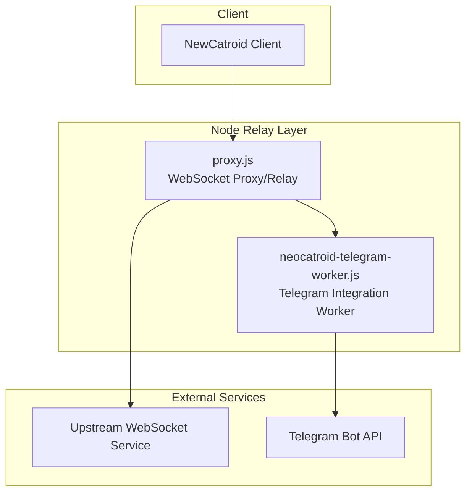
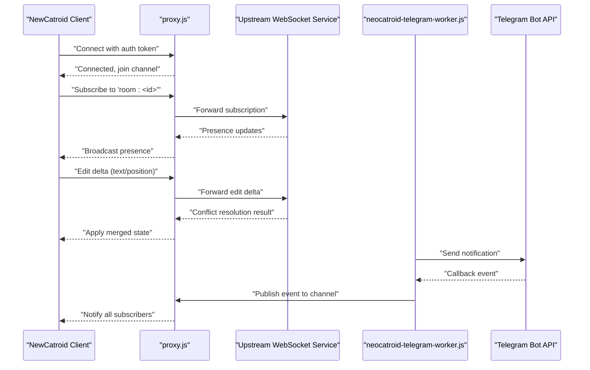
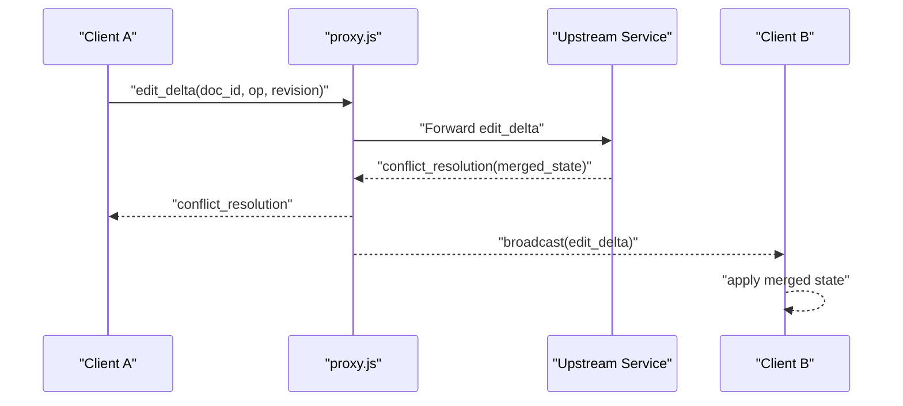
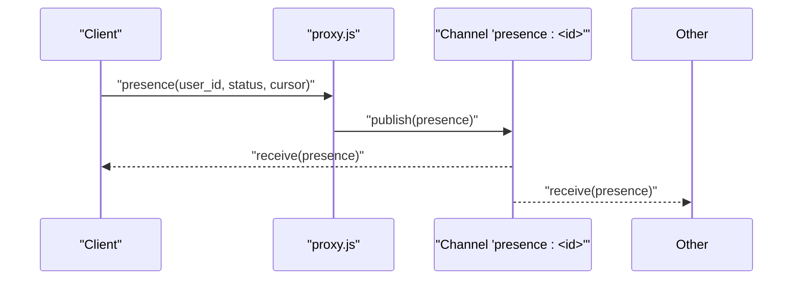
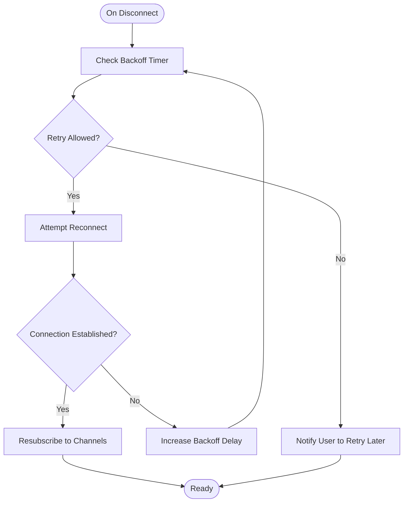
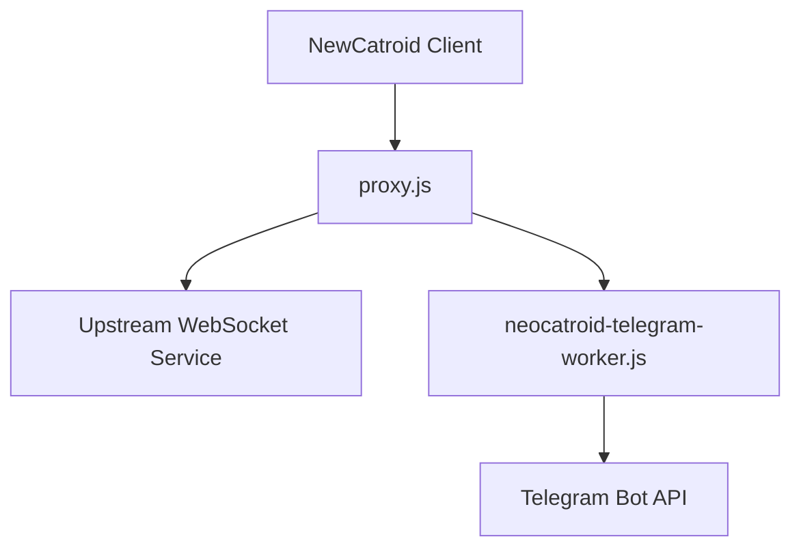

# WebSocket Connections

<cite>
**Referenced Files in This Document**
- [README.md](file://README.md)
- [task.md](file://task.md)
- [proxy.js](file://proxy.js)
- [neocatroid-telegram-worker.js](file://neocatroid-telegram-worker.js)
</cite>

## Table of Contents
1. [Introduction](#introduction)
2. [Project Structure](#project-structure)
3. [Core Components](#core-components)
4. [Architecture Overview](#architecture-overview)
5. [Detailed Component Analysis](#detailed-component-analysis)
6. [Dependency Analysis](#dependency-analysis)
7. [Performance Considerations](#performance-considerations)
8. [Troubleshooting Guide](#troubleshooting-guide)
9. [Conclusion](#conclusion)

## Introduction
This document describes the real-time communication features for NewCatroid with a focus on WebSocket-based connectivity and collaboration patterns. It covers connection handling, message formats, event types, and interaction flows for collaborative editing, live presence indicators, and synchronized state updates. It also includes protocol-specific examples for connection establishment, broadcasting, conflict resolution, and disconnection handling, along with security considerations, connection pooling strategies, performance optimization tips, and debugging guidance.

Where applicable, this document references concrete repository files that implement or support real-time behavior (for example, a Node proxy and a Telegram worker). If certain WebSocket endpoints are hosted externally, their configuration is referenced here to guide integration.

## Project Structure
The repository contains both Android/Kotlin/Java components and Node-side utilities that can be used to bridge or relay real-time traffic. The following files are relevant to WebSocket-based features:

- README.md: High-level project overview and links to documentation and build instructions.
- task.md: Task tracking and feature planning that may include real-time collaboration work items.
- proxy.js: A Node script that can act as a WebSocket proxy or relay between clients and upstream services.
- neocatroid-telegram-worker.js: A worker script that integrates with Telegram’s Bot API and can be extended to relay events over WebSockets.

[No sources needed since this diagram shows conceptual workflow, not actual code structure]

**Section sources**
- [README.md](file://README.md)
- [task.md](file://task.md)
- [proxy.js](file://proxy.js)
- [neocatroid-telegram-worker.js](file://neocatroid-telegram-worker.js)

## Core Components
- WebSocket Proxy (proxy.js): Provides a central point for client connections, routing messages to appropriate destinations (e.g., upstream WebSocket service or Telegram worker), and managing session lifecycle.
- Telegram Worker (neocatroid-telegram-worker.js): Bridges Telegram notifications/events into the system; can be extended to publish or subscribe to WebSocket channels for cross-platform presence and collaboration signals.
- Client Integration: The NewCatroid client establishes WebSocket connections, subscribes to channels, and handles real-time events for collaborative editing and presence.

Key responsibilities:
- Connection management: handshake, authentication, reconnection, and graceful teardown.
- Message routing: broadcast to room/channel participants, direct messaging, and event fan-out.
- Presence tracking: track online users, last seen timestamps, and cursor positions.
- State synchronization: apply deltas or snapshots to keep collaborators in sync.
- Conflict resolution: merge concurrent edits deterministically.

**Section sources**
- [proxy.js](file://proxy.js)
- [neocatroid-telegram-worker.js](file://neocatroid-telegram-worker.js)

## Architecture Overview
The real-time architecture centers around a lightweight Node relay that mediates between clients and external services. Clients connect via WebSocket to the relay, which forwards messages to either an upstream WebSocket service or the Telegram worker. The worker can integrate with Telegram to notify or coordinate actions across platforms.

**Diagram sources**
- [proxy.js](file://proxy.js)
- [neocatroid-telegram-worker.js](file://neocatroid-telegram-worker.js)

## Detailed Component Analysis

### WebSocket Proxy (proxy.js)
Responsibilities:
- Accepts incoming WebSocket connections from clients.
- Validates authentication tokens and binds sessions to rooms/channels.
- Routes messages to upstream services or workers based on topic.
- Manages heartbeat/ping-pong to detect dead connections.
- Handles reconnection backoff and message replay if required.

Typical flow:
- Client connects with credentials.
- Proxy authenticates and assigns a session ID.
- Client subscribes to one or more channels.
- Proxy forwards subscriptions to upstream and relays events back.

Security considerations:
- Enforce TLS termination at the proxy boundary.
- Validate and rotate tokens; reject malformed frames.
- Rate-limit per client and per channel to prevent abuse.

Operational notes:
- Maintain a connection pool per upstream endpoint to reduce handshake overhead.
- Use backpressure-aware queues to avoid memory spikes under load.

**Section sources**
- [proxy.js](file://proxy.js)

### Telegram Worker (neocatroid-telegram-worker.js)
Responsibilities:
- Interacts with Telegram Bot API for notifications and callbacks.
- Can translate Telegram events into WebSocket messages for clients.
- Supports publishing presence or status updates to channels.

Integration points:
- Receives webhook callbacks from Telegram.
- Publishes events to the proxy’s channels.
- Optionally subscribes to proxy channels to react to user actions.

Security considerations:
- Verify webhook signatures and restrict allowed origins.
- Store secrets securely and rotate periodically.

**Section sources**
- [neocatroid-telegram-worker.js](file://neocatroid-telegram-worker.js)

### Client-Side Real-Time Patterns
Patterns implemented by the client:
- Connection establishment with retry and exponential backoff.
- Channel subscription model for collaborative rooms.
- Event-driven UI updates for presence and edits.
- Optimistic updates with server reconciliation.

Example interactions:
- Establish connection and authenticate.
- Subscribe to a room channel.
- Send edit deltas and receive merged state.
- Handle disconnects and reconnect gracefully.

**Section sources**
- [proxy.js](file://proxy.js)
- [neocatroid-telegram-worker.js](file://neocatroid-telegram-worker.js)

### Protocol Specification

#### Connection Establishment
- Transport: WebSocket over TLS (wss://).
- Handshake: HTTP upgrade with query parameters or headers for authentication.
- Initial payload: Client sends a JSON object containing:
  - action: "connect"
  - token: string (JWT or opaque token)
  - client_id: string (unique per device/session)
  - version: string (protocol version)
- Server response:
  - action: "connected"
  - session_id: string
  - channels: array of strings (default channels)
  - config: object (heartbeat interval, max frame size, etc.)

Example request:
- URL: wss://relay.example.com/ws?token=...&client_id=...
- Frame: {"action":"connect","token":"...","client_id":"...","version":"1.0"}

Example response:
- Frame: {"action":"connected","session_id":"...","channels":["room:123"],"config":{"heartbeat_ms":30000,"max_frame_bytes":65536}}

**Section sources**
- [proxy.js](file://proxy.js)

#### Authentication and Authorization
- Token validation: verify signature, expiration, and scope.
- Session binding: map session_id to authenticated user and permissions.
- Channel access control: enforce read/write permissions per channel.

**Section sources**
- [proxy.js](file://proxy.js)

#### Channels and Subscriptions
- Channel naming: "room:<id>", "presence:<id>", "system:<topic>"
- Subscribe/unsubscribe:
  - action: "subscribe", params: { channel: "room:123" }
  - action: "unsubscribe", params: { channel: "room:123" }
- Confirmation:
  - action: "subscribed", params: { channel: "room:123" }

**Section sources**
- [proxy.js](file://proxy.js)

#### Message Formats
Common envelope:
- action: string
- channel: string
- payload: any
- metadata: object (timestamp, sender_id, correlation_id)

Event types:
- presence:
  - action: "presence"
  - payload: { user_id, status, last_seen, cursor }
- edit_delta:
  - action: "edit_delta"
  - payload: { doc_id, op_type, position, content, revision }
- conflict_resolution:
  - action: "conflict_resolution"
  - payload: { doc_id, merged_revision, applied_ops }
- system:
  - action: "system"
  - payload: { type: "heartbeat_ack" | "reconnect_hint" }

Examples:
- Edit delta:
  - {"action":"edit_delta","channel":"room:123","payload":{"doc_id":"A","op_type":"insert","position":10,"content":"Hello","revision":5},"metadata":{"sender_id":"u1","timestamp":1710000000000}}
- Presence update:
  - {"action":"presence","channel":"presence:123","payload":{"user_id":"u1","status":"active","last_seen":1710000000000,"cursor":{"line":5,"col":10}},"metadata":{"sender_id":"u1"}}

**Section sources**
- [proxy.js](file://proxy.js)

#### Broadcasting and Fan-Out
- Broadcast to all subscribers of a channel.
- Selective delivery using filters (e.g., exclude sender).
- Batched updates for high-frequency events (throttling).

**Section sources**
- [proxy.js](file://proxy.js)

#### Conflict Resolution
- Strategy: Operational Transformation or CRDT-based merging.
- Server applies ops in order, resolves conflicts deterministically.
- Client receives merged state and reconciles local view.

Flow:
- Client sends edit_delta with revision N.
- Server validates against current revision M.
- If N == M + 1, apply directly.
- If N < M, compute diff and merge; return conflict_resolution with applied_ops.
- Client applies merged state and continues.

**Section sources**
- [proxy.js](file://proxy.js)

#### Heartbeat and Liveness
- Ping/pong or periodic heartbeat messages.
- Configurable intervals via handshake config.
- Dead connection detection and cleanup.

**Section sources**
- [proxy.js](file://proxy.js)

#### Disconnection Handling
- Client detects disconnect via network errors or heartbeat timeout.
- Reconnect with exponential backoff and jitter.
- Resume subscriptions and request state snapshot if necessary.

Sequence:
- Client disconnects.
- Proxy marks session inactive after timeout.
- Client retries with backoff.
- On reconnect, client resubscribes and requests latest state.

**Section sources**
- [proxy.js](file://proxy.js)

### Sequence Diagrams

#### Collaborative Editing Flow

**Diagram sources**
- [proxy.js](file://proxy.js)

#### Presence Update Flow

**Diagram sources**
- [proxy.js](file://proxy.js)

### Flowcharts

#### Reconnection Logic

[No sources needed since this diagram shows conceptual workflow, not actual code structure]

## Dependency Analysis
The real-time layer depends on:
- Node runtime for proxy and worker scripts.
- External WebSocket service for persistence and advanced collaboration logic.
- Telegram Bot API for cross-platform notifications.

**Diagram sources**
- [proxy.js](file://proxy.js)
- [neocatroid-telegram-worker.js](file://neocatroid-telegram-worker.js)

**Section sources**
- [proxy.js](file://proxy.js)
- [neocatroid-telegram-worker.js](file://neocatroid-telegram-worker.js)

## Performance Considerations
- Connection Pooling:
  - Maintain persistent connections to upstream services.
  - Reuse sessions where possible to reduce handshake costs.
- Throttling and Batching:
  - Coalesce frequent presence updates.
  - Batch edit deltas when latency allows.
- Backpressure:
  - Implement bounded queues and drop low-priority messages under load.
- Scaling:
  - Horizontal scaling behind a load balancer with sticky sessions if needed.
  - Use pub/sub middleware for multi-node fan-out.

[No sources needed since this section provides general guidance]

## Troubleshooting Guide
- Connection Issues:
  - Verify TLS certificates and firewall rules.
  - Inspect handshake frames and error codes.
- Authentication Failures:
  - Validate token format, expiration, and scopes.
  - Ensure consistent clock synchronization.
- Message Delivery:
  - Enable debug logging for channel routing.
  - Confirm subscriber lists and channel names.
- Heartbeat Timeouts:
  - Adjust heartbeat intervals and timeouts.
  - Monitor proxy logs for dead connections.
- Telegram Integration:
  - Verify webhook URLs and secret verification.
  - Check rate limits and error responses from Telegram.

**Section sources**
- [proxy.js](file://proxy.js)
- [neocatroid-telegram-worker.js](file://neocatroid-telegram-worker.js)

## Conclusion
NewCatroid’s real-time capabilities rely on a Node-based relay layer that bridges clients to upstream services and Telegram integrations. By adopting a robust protocol with clear message formats, strong authentication, and deterministic conflict resolution, the system supports collaborative editing, presence indicators, and synchronized state updates. Security, performance, and observability should be prioritized during deployment and operation.

[No sources needed since this section summarizes without analyzing specific files]