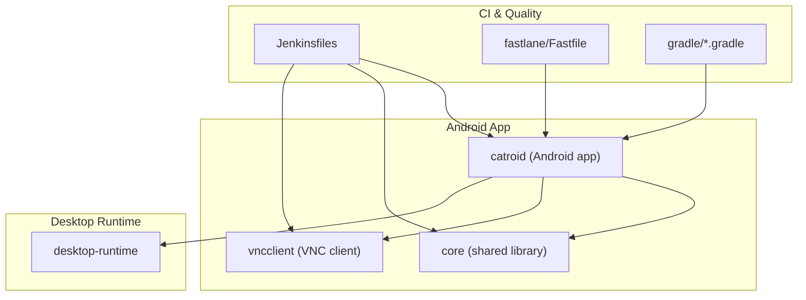
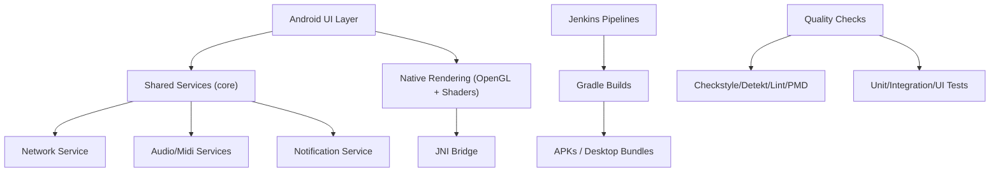
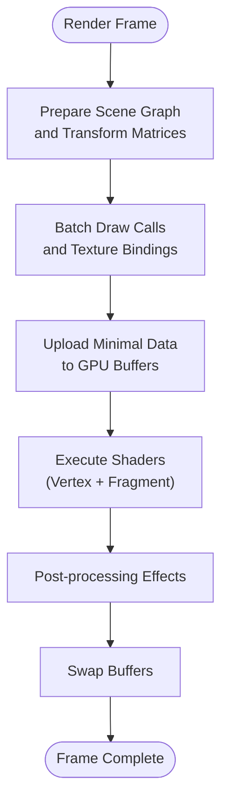
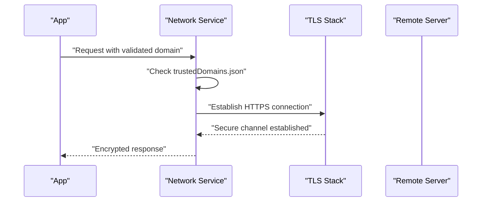
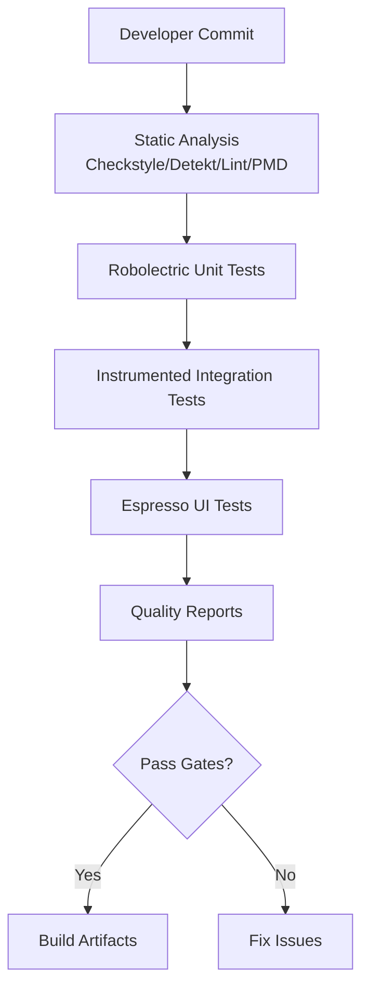
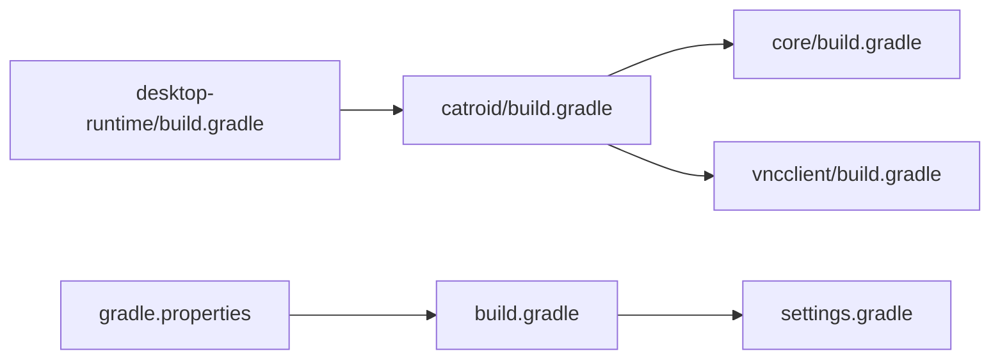
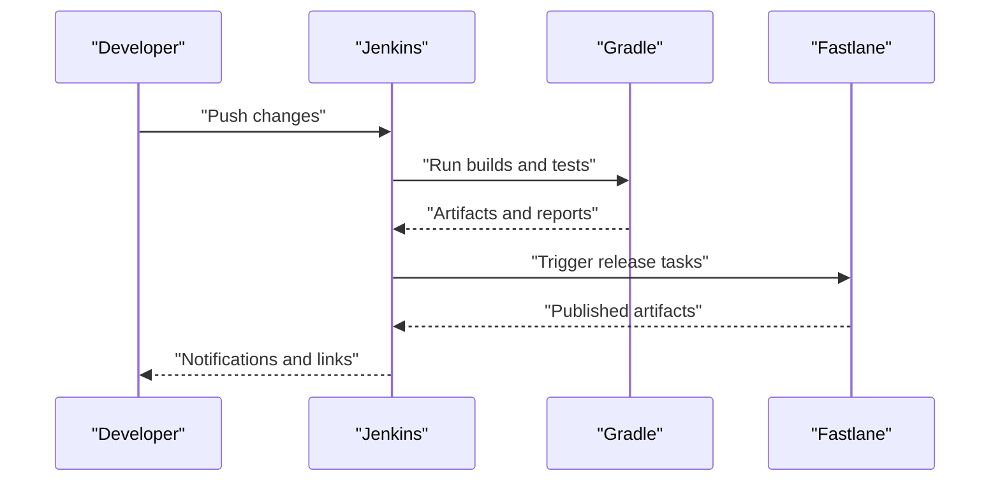

# Advanced Topics

<cite>
**Referenced Files in This Document**
- [README.md](file://README.md)
- [build.gradle](file://build.gradle)
- [gradle.properties](file://gradle.properties)
- [settings.gradle](file://settings.gradle)
- [Jenkinsfile](file://Jenkinsfile)
- [Jenkinsfile.releaseAPK](file://Jenkinsfile.releaseAPK)
- [fastlane/Fastfile](file://fastlane/Fastfile)
- [catroid/build.gradle](file://catroid/build.gradle)
- [core/build.gradle](file://core/build.gradle)
- [desktop-runtime/build.gradle](file://desktop-runtime/build.gradle)
- [vncclient/build.gradle](file://vncclient/build.gradle)
- [catroid/config/checkstyle.xml](file://catroid/config/checkstyle.xml)
- [catroid/config/detekt.yml](file://catroid/config/detekt.yml)
- [catroid/config/lint.xml](file://catroid/config/lint.xml)
- [catroid/config/pmd.xml](file://catroid/config/pmd.xml)
- [catroid/config/suppressions.xml](file://catroid/config/suppressions.xml)
- [catroid/proguard-project.txt](file://catroid/proguard-project.txt)
- [catroid/proguard-runtime.pro](file://catroid/proguard-runtime.pro)
- [catroid/src/main/AndroidManifest.xml](file://catroid/src/main/AndroidManifest.xml)
- [catroid/src/androidTest/java/org/catrobat/catroid/UiTestCatroidApplication.kt](file://catroid/src/androidTest/java/org/catrobat/catroid/UiTestCatroidApplication.kt)
- [catroid/src/test/resources/robolectric.properties](file://catroid/src/test/resources/robolectric.properties)
- [catroid/src/main/assets/trustedDomains.json](file://catroid/src/main/assets/trustedDomains.json)
- [catroid/src/main/cpp/CMakeLists.txt](file://catroid/src/main/cpp/CMakeLists.txt)
- [catroid/src/main/cpp/newcatroid_gl_api.h](file://catroid/src/main/cpp/newcatroid_gl_api.h)
- [catroid/src/main/assets/shaders/vnc_shader.vert](file://catroid/src/main/assets/shaders/vnc_shader.vert)
- [catroid/src/main/assets/shaders/vnc_shader.frag](file://catroid/src/main/assets/shaders/vnc_shader.frag)
- [automationScripts/createBetaTestingPocketCodeAPK.py](file://automationScripts/createBetaTestingPocketCodeAPK.py)
- [automationScripts/increaseVersionByOne.py](file://automationScripts/increaseVersionByOne.py)
- [crowdin.yml](file://crowdin.yml)
</cite>

## Table of Contents
1. [Introduction](#introduction)
2. [Project Structure](#project-structure)
3. [Core Components](#core-components)
4. [Architecture Overview](#architecture-overview)
5. [Detailed Component Analysis](#detailed-component-analysis)
6. [Dependency Analysis](#dependency-analysis)
7. [Performance Considerations](#performance-considerations)
8. [Security Considerations](#security-considerations)
9. [Testing Strategies](#testing-strategies)
10. [Build System Customization and Release Engineering](#build-system-customization-and-release-engineering)
11. [Deployment Automation](#deployment-automation)
12. [Debugging, Crash Reporting, and Monitoring](#debugging-crash-reporting-and-monitoring)
13. [Conclusion](#conclusion)

## Introduction
This document provides advanced guidance for NewCatroid focusing on performance optimization, security considerations, and comprehensive testing strategies. It also covers build system customization, release engineering practices, deployment automation, and production debugging and monitoring techniques. The content is grounded in the repository’s configuration, CI pipelines, and Android/desktop runtime structure to ensure practical applicability.

## Project Structure
NewCatroid is a multi-module Android project with additional desktop runtime and utility modules:
- catroid: Main Android application module including Java/Kotlin sources, resources, native C++ components, and test suites.
- core: Shared Kotlin library providing services (audio, network, notifications, text).
- desktop-runtime: Desktop runtime packaging and integration layer.
- vncclient: VNC client component used for remote control features.
- fastlane: Android release automation scripts.
- gradle: Build quality tasks and setup scripts.
- automationScripts: Utility scripts for versioning and beta APK creation.
- Jenkinsfiles: CI pipeline definitions for builds, tests, and releases.

[No sources needed since this diagram shows conceptual workflow, not actual code structure]

## Core Components
Key areas relevant to advanced topics:
- Performance: Native rendering via OpenGL, shader assets, JNI bridge, and Gradle/JNI build configuration.
- Security: Android manifest permissions, trusted domains list, ProGuard/R8 rules, and secure networking patterns.
- Testing: Android instrumentation tests, Robolectric unit tests, Espresso UI tests, and CI-driven quality checks.
- Build and Release: Gradle modules, Fastlane automation, and Jenkins pipelines.

**Section sources**
- [catroid/build.gradle](file://catroid/build.gradle)
- [core/build.gradle](file://core/build.gradle)
- [desktop-runtime/build.gradle](file://desktop-runtime/build.gradle)
- [vncclient/build.gradle](file://vncclient/build.gradle)
- [catroid/src/main/AndroidManifest.xml](file://catroid/src/main/AndroidManifest.xml)
- [catroid/src/main/assets/trustedDomains.json](file://catroid/src/main/assets/trustedDomains.json)
- [catroid/proguard-project.txt](file://catroid/proguard-project.txt)
- [catroid/proguard-runtime.pro](file://catroid/proguard-runtime.pro)
- [catroid/src/main/cpp/CMakeLists.txt](file://catroid/src/main/cpp/CMakeLists.txt)
- [catroid/src/main/cpp/newcatroid_gl_api.h](file://catroid/src/main/cpp/newcatroid_gl_api.h)
- [catroid/src/main/assets/shaders/vnc_shader.vert](file://catroid/src/main/assets/shaders/vnc_shader.vert)
- [catroid/src/main/assets/shaders/vnc_shader.frag](file://catroid/src/main/assets/shaders/vnc_shader.frag)

## Architecture Overview
The architecture integrates Android UI, shared services, native rendering, and CI/CD automation:
- Android app orchestrates UI and runtime logic, delegating heavy work to native layers where applicable.
- Shared services provide cross-cutting capabilities (audio, network, notifications).
- Desktop runtime enables non-Android execution paths.
- CI pipelines enforce quality gates and automate artifact generation.

[No sources needed since this diagram shows conceptual workflow, not actual code structure]

## Detailed Component Analysis

### Performance Optimization
Focus areas:
- Profiling and bottleneck identification: Use Android Studio Profiler, systrace/perfetto, and GPU profiling to identify CPU/GPU hotspots during stage rendering and physics updates.
- Memory leak detection: Employ LeakCanary or MAT analysis; validate lifecycle-aware resource management in Activities/Fragments and custom views.
- Rendering optimization: Minimize draw calls, reuse textures, batch operations, and optimize shaders. Ensure proper GL state management and avoid unnecessary allocations in render loops.

Implementation anchors:
- Native rendering entry points and GL API bindings are exposed through JNI headers and CMake configuration.
- Shader programs reside under assets and are loaded at runtime.

**Diagram sources**
- [catroid/src/main/cpp/CMakeLists.txt](file://catroid/src/main/cpp/CMakeLists.txt)
- [catroid/src/main/cpp/newcatroid_gl_api.h](file://catroid/src/main/cpp/newcatroid_gl_api.h)
- [catroid/src/main/assets/shaders/vnc_shader.vert](file://catroid/src/main/assets/shaders/vnc_shader.vert)
- [catroid/src/main/assets/shaders/vnc_shader.frag](file://catroid/src/main/assets/shaders/vnc_shader.frag)

**Section sources**
- [catroid/src/main/cpp/CMakeLists.txt](file://catroid/src/main/cpp/CMakeLists.txt)
- [catroid/src/main/cpp/newcatroid_gl_api.h](file://catroid/src/main/cpp/newcatroid_gl_api.h)
- [catroid/src/main/assets/shaders/vnc_shader.vert](file://catroid/src/main/assets/shaders/vnc_shader.vert)
- [catroid/src/main/assets/shaders/vnc_shader.frag](file://catroid/src/main/assets/shaders/vnc_shader.frag)

### Security Considerations
Key aspects:
- Permissions: Review and minimize declared permissions in the Android manifest.
- Trusted domains: Enforce allowlists for network endpoints using the trusted domains configuration.
- Secure communication: Prefer HTTPS with certificate pinning where feasible; validate server certificates.
- Data encryption: Encrypt sensitive local data using Android Keystore-backed algorithms.
- Code signing and obfuscation: Sign artifacts securely; apply ProGuard/R8 rules to reduce attack surface.

**Diagram sources**
- [catroid/src/main/AndroidManifest.xml](file://catroid/src/main/AndroidManifest.xml)
- [catroid/src/main/assets/trustedDomains.json](file://catroid/src/main/assets/trustedDomains.json)
- [catroid/proguard-project.txt](file://catroid/proguard-project.txt)
- [catroid/proguard-runtime.pro](file://catroid/proguard-runtime.pro)

**Section sources**
- [catroid/src/main/AndroidManifest.xml](file://catroid/src/main/AndroidManifest.xml)
- [catroid/src/main/assets/trustedDomains.json](file://catroid/src/main/assets/trustedDomains.json)
- [catroid/proguard-project.txt](file://catroid/proguard-project.txt)
- [catroid/proguard-runtime.pro](file://catroid/proguard-runtime.pro)

### Testing Strategies
Comprehensive testing approach:
- Unit tests: Robolectric-based tests for business logic without device dependencies.
- Integration tests: Instrumented tests validating interactions between components and external services.
- UI tests: Espresso-based flows for critical user journeys.
- Automated quality assurance: Static analysis and linting enforced in CI.

**Diagram sources**
- [catroid/config/checkstyle.xml](file://catroid/config/checkstyle.xml)
- [catroid/config/detekt.yml](file://catroid/config/detekt.yml)
- [catroid/config/lint.xml](file://catroid/config/lint.xml)
- [catroid/config/pmd.xml](file://catroid/config/pmd.xml)
- [catroid/src/test/resources/robolectric.properties](file://catroid/src/test/resources/robolectric.properties)
- [catroid/src/androidTest/java/org/catrobat/catroid/UiTestCatroidApplication.kt](file://catroid/src/androidTest/java/org/catrobat/catroid/UiTestCatroidApplication.kt)

**Section sources**
- [catroid/config/checkstyle.xml](file://catroid/config/checkstyle.xml)
- [catroid/config/detekt.yml](file://catroid/config/detekt.yml)
- [catroid/config/lint.xml](file://catroid/config/lint.xml)
- [catroid/config/pmd.xml](file://catroid/config/pmd.xml)
- [catroid/src/test/resources/robolectric.properties](file://catroid/src/test/resources/robolectric.properties)
- [catroid/src/androidTest/java/org/catrobat/catroid/UiTestCatroidApplication.kt](file://catroid/src/androidTest/java/org/catrobat/catroid/UiTestCatroidApplication.kt)

## Dependency Analysis
Module-level dependencies and build configurations:
- catroid depends on core and vncclient.
- desktop-runtime provides desktop-specific packaging and runtime glue.
- Gradle properties centralize versioning and flags.

**Diagram sources**
- [catroid/build.gradle](file://catroid/build.gradle)
- [core/build.gradle](file://core/build.gradle)
- [desktop-runtime/build.gradle](file://desktop-runtime/build.gradle)
- [vncclient/build.gradle](file://vncclient/build.gradle)
- [build.gradle](file://build.gradle)
- [settings.gradle](file://settings.gradle)
- [gradle.properties](file://gradle.properties)

**Section sources**
- [catroid/build.gradle](file://catroid/build.gradle)
- [core/build.gradle](file://core/build.gradle)
- [desktop-runtime/build.gradle](file://desktop-runtime/build.gradle)
- [vncclient/build.gradle](file://vncclient/build.gradle)
- [build.gradle](file://build.gradle)
- [settings.gradle](file://settings.gradle)
- [gradle.properties](file://gradle.properties)

## Performance Considerations
Guidance:
- Profile early and often: Integrate profiling into development workflows; capture traces during representative usage scenarios.
- Optimize memory: Avoid object churn in tight loops; use object pools for frequently allocated objects; monitor heap growth.
- Reduce I/O overhead: Batch file operations; compress large assets; stream media when possible.
- GPU efficiency: Reuse shader programs; minimize texture switches; leverage instancing where supported.
- Background processing: Offload heavy computations to background threads; respect main thread constraints.

[No sources needed since this section provides general guidance]

## Security Considerations
Recommendations:
- Least privilege: Declare only necessary permissions; audit third-party libraries for excessive privileges.
- Domain validation: Maintain an up-to-date trusted domains list; reject unknown hosts.
- Transport security: Enforce TLS; consider certificate pinning for critical endpoints.
- Storage security: Encrypt sensitive files; use Android Keystore for key material.
- Obfuscation and hardening: Apply ProGuard/R8 rules; strip debug symbols from release builds.

**Section sources**
- [catroid/src/main/AndroidManifest.xml](file://catroid/src/main/AndroidManifest.xml)
- [catroid/src/main/assets/trustedDomains.json](file://catroid/src/main/assets/trustedDomains.json)
- [catroid/proguard-project.txt](file://catroid/proguard-project.txt)
- [catroid/proguard-runtime.pro](file://catroid/proguard-runtime.pro)

## Testing Strategies
Practical steps:
- Unit tests: Isolate logic using Robolectric; mock external dependencies; assert deterministic outcomes.
- Integration tests: Validate service contracts and data persistence; use test fixtures and seed data.
- UI tests: Automate critical user flows; stabilize waits and assertions; run on multiple emulators/devices.
- Quality gates: Enforce static analysis thresholds; fail builds on violations.

**Section sources**
- [catroid/src/test/resources/robolectric.properties](file://catroid/src/test/resources/robolectric.properties)
- [catroid/src/androidTest/java/org/catrobat/catroid/UiTestCatroidApplication.kt](file://catroid/src/androidTest/java/org/catrobat/catroid/UiTestCatroidApplication.kt)
- [catroid/config/checkstyle.xml](file://catroid/config/checkstyle.xml)
- [catroid/config/detekt.yml](file://catroid/config/detekt.yml)
- [catroid/config/lint.xml](file://catroid/config/lint.xml)
- [catroid/config/pmd.xml](file://catroid/config/pmd.xml)

## Build System Customization and Release Engineering
Customization points:
- Gradle modules: Configure per-module dependencies, variants, and signing.
- Versioning: Centralize versions in gradle.properties; automate increments via scripts.
- Signing: Manage keystore secrets securely; sign both Android and desktop artifacts.
- ProGuard/R8: Tailor rules per module; preserve essential APIs while minimizing size.

Release engineering practices:
- Changelog management: Keep structured changelogs aligned with tags.
- Artifact promotion: Promote stable builds through CI stages; archive artifacts with metadata.
- Distribution: Use Fastlane for automated publishing workflows.

**Section sources**
- [gradle.properties](file://gradle.properties)
- [automationScripts/increaseVersionByOne.py](file://automationScripts/increaseVersionByOne.py)
- [automationScripts/createBetaTestingPocketCodeAPK.py](file://automationScripts/createBetaTestingPocketCodeAPK.py)
- [catroid/proguard-project.txt](file://catroid/proguard-project.txt)
- [catroid/proguard-runtime.pro](file://catroid/proguard-runtime.pro)

## Deployment Automation
Automation overview:
- CI pipelines: Jenkinsfiles orchestrate builds, tests, and artifact generation.
- Fastlane: Streamlines Android release tasks such as building, signing, and publishing.
- Internationalization: Crowdin integration coordinates translations and asset updates.

**Diagram sources**
- [Jenkinsfile](file://Jenkinsfile)
- [Jenkinsfile.releaseAPK](file://Jenkinsfile.releaseAPK)
- [fastlane/Fastfile](file://fastlane/Fastfile)
- [crowdin.yml](file://crowdin.yml)

**Section sources**
- [Jenkinsfile](file://Jenkinsfile)
- [Jenkinsfile.releaseAPK](file://Jenkinsfile.releaseAPK)
- [fastlane/Fastfile](file://fastlane/Fastfile)
- [crowdin.yml](file://crowdin.yml)

## Debugging, Crash Reporting, and Monitoring
Techniques:
- Local debugging: Use Android Studio debugger; attach to running processes; inspect logs and traces.
- Crash reporting: Integrate crash analytics to collect stack traces and contextual data from production devices.
- Performance monitoring: Track frame times, memory usage, and network latency in production environments.
- Logging strategy: Implement structured logging with severity levels; avoid sensitive data in logs.

[No sources needed since this section provides general guidance]

## Conclusion
NewCatroid’s architecture supports robust performance tuning, strong security postures, and comprehensive testing across unit, integration, and UI layers. By leveraging CI/CD automation, Gradle customization, and targeted optimization strategies, teams can deliver high-quality releases efficiently. Adopting disciplined debugging and monitoring practices ensures rapid issue resolution and sustained reliability in production.