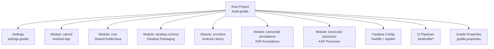
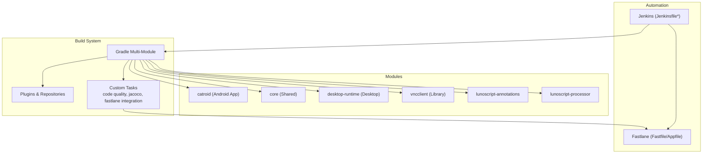
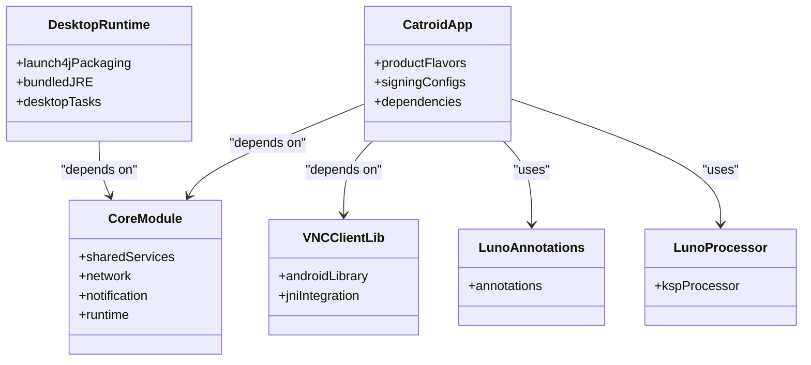
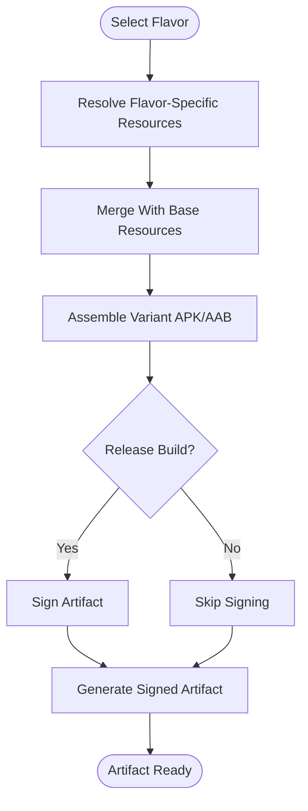
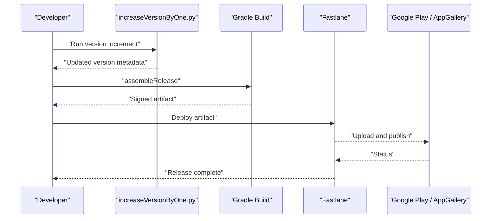
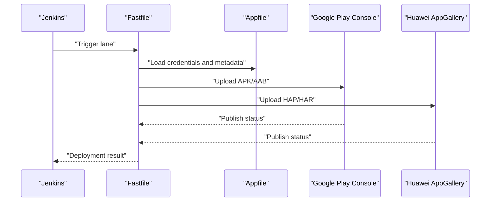
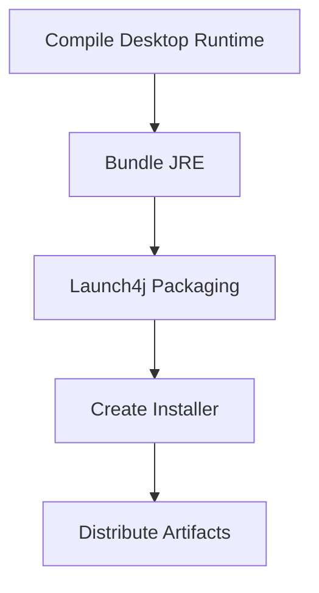
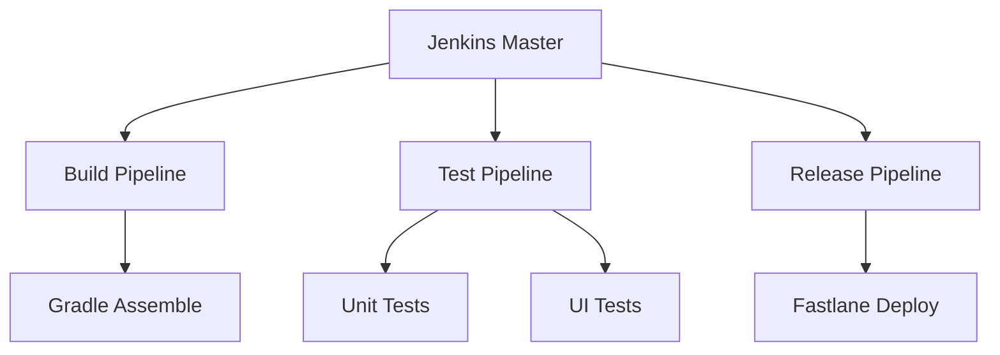
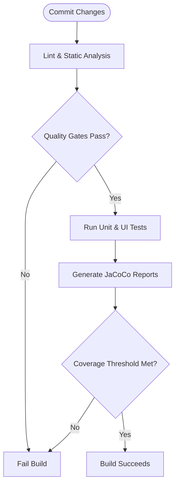
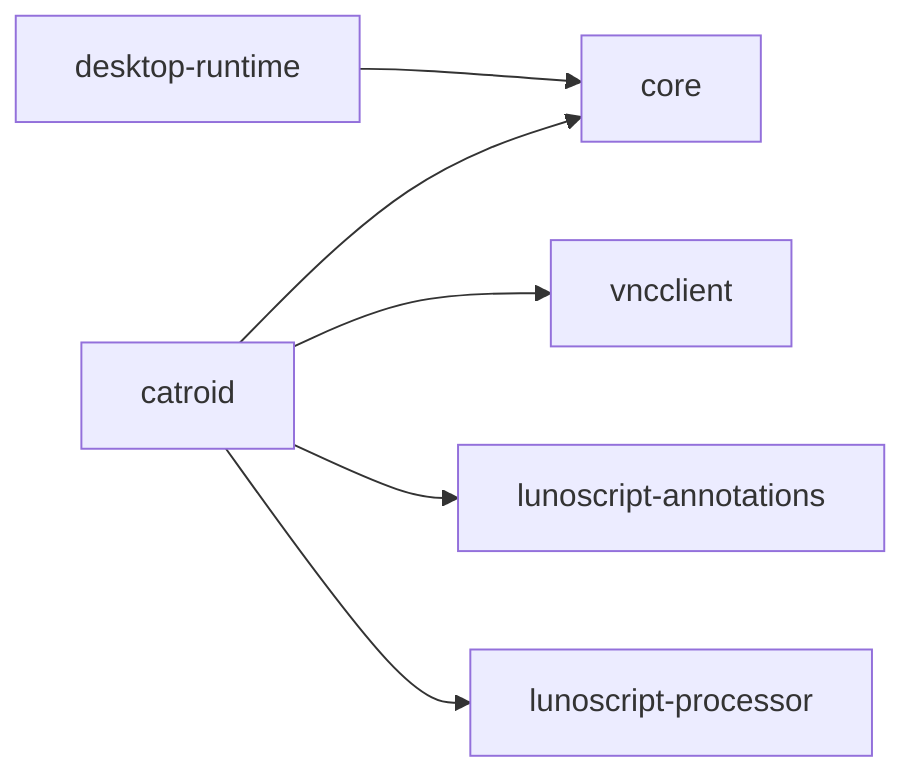

# Build and Deployment

<cite>
**Referenced Files in This Document**
- [build.gradle](file://build.gradle)
- [settings.gradle](file://settings.gradle)
- [gradle.properties](file://gradle.properties)
- [catroid/build.gradle](file://catroid/build.gradle)
- [core/build.gradle](file://core/build.gradle)
- [desktop-runtime/build.gradle](file://desktop-runtime/build.gradle)
- [vncclient/build.gradle](file://vncclient/build.gradle)
- [lunoscript-annotations/build.gradle](file://lunoscript-annotations/build.gradle)
- [lunoscript-processor/build.gradle](file://lunoscript-processor/build.gradle)
- [fastlane/Fastfile](file://fastlane/Fastfile)
- [fastlane/Appfile](file://fastlane/Appfile)
- [Jenkinsfile](file://Jenkinsfile)
- [Jenkinsfile.releaseAPK](file://Jenkinsfile.releaseAPK)
- [automationScripts/increaseVersionByOne.py](file://automationScripts/increaseVersionByOne.py)
- [crowdin.yml](file://crowdin.yml)
- [gradle/code_quality_tasks.gradle](file://gradle/code_quality_tasks.gradle)
- [gradle/setup_jacoco.gradle](file://gradle/setup_jacoco.gradle)
- [gradle/release_fastlane_tasks.gradle](file://gradle/release_fastlane_tasks.gradle)
- [gradle/standalone_apk_tasks.gradle](file://gradle/standalone_apk_tasks.gradle)
- [gradle/emulator.gradle](file://gradle/emulator.gradle)
- [gradle/release_crowdin_tasks.gradle](file://gradle/release_crowdin_tasks.gradle)
</cite>

## Table of Contents
1. Introduction
2. Project Structure
3. Core Components
4. Architecture Overview
5. Detailed Component Analysis
6. Dependency Analysis
7. Performance Considerations
8. Troubleshooting Guide
9. Conclusion
10. Appendices

## Introduction
This document explains the build and deployment system for NewCatroid. It covers the Gradle multi-module configuration, build flavors for different app variants, dependency management, release engineering processes (versioning, signing, changelog), mobile distribution via Fastlane to Google Play Store and Huawei AppGallery, desktop packaging and update mechanisms, CI/CD automation with Jenkins, testing and quality gates, and production strategies including rollback and hotfix procedures.

## Project Structure
NewCatroid is a multi-module Android project with additional modules for shared core logic, a desktop runtime, and third-party integrations. The root Gradle file orchestrates common settings and tasks, while each module defines its own build behavior.

**Diagram sources**
- [build.gradle:1-200](file://build.gradle#L1-L200)
- [settings.gradle:1-200](file://settings.gradle#L1-L200)
- [catroid/build.gradle:1-200](file://catroid/build.gradle#L1-L200)
- [core/build.gradle:1-200](file://core/build.gradle#L1-L200)
- [desktop-runtime/build.gradle:1-200](file://desktop-runtime/build.gradle#L1-L200)
- [vncclient/build.gradle:1-200](file://vncclient/build.gradle#L1-L200)
- [lunoscript-annotations/build.gradle:1-200](file://lunoscript-annotations/build.gradle#L1-L200)
- [lunoscript-processor/build.gradle:1-200](file://lunoscript-processor/build.gradle#L1-L200)
- [fastlane/Fastfile:1-200](file://fastlane/Fastfile#L1-L200)
- [fastlane/Appfile:1-200](file://fastlane/Appfile#L1-L200)
- [gradle.properties:1-200](file://gradle.properties#L1-L200)

**Section sources**
- [build.gradle:1-200](file://build.gradle#L1-L200)
- [settings.gradle:1-200](file://settings.gradle#L1-L200)
- [gradle.properties:1-200](file://gradle.properties#L1-L200)

## Core Components
- Root Gradle configuration: centralizes plugin versions, repositories, and shared tasks.
- Module-level builds: define application/library specifics, product flavors, dependencies, and signing.
- Shared modules: core provides cross-platform services; desktop-runtime packages the desktop variant; vncclient integrates remote control features.
- KSP annotations and processor: generate code at compile time for scripting features.
- Fastlane: automates store publishing and metadata updates.
- Jenkins pipelines: orchestrate builds, tests, and releases.

Key responsibilities:
- Versioning and flavor composition across modules.
- Signing artifacts for release channels.
- Code quality checks and test execution.
- Artifact generation for mobile and desktop.

**Section sources**
- [catroid/build.gradle:1-200](file://catroid/build.gradle#L1-L200)
- [core/build.gradle:1-200](file://core/build.gradle#L1-L200)
- [desktop-runtime/build.gradle:1-200](file://desktop-runtime/build.gradle#L1-L200)
- [vncclient/build.gradle:1-200](file://vncclient/build.gradle#L1-L200)
- [lunoscript-annotations/build.gradle:1-200](file://lunoscript-annotations/build.gradle#L1-L200)
- [lunoscript-processor/build.gradle:1-200](file://lunoscript-processor/build.gradle#L1-L200)

## Architecture Overview
The build architecture combines Gradle’s multi-module setup with Fastlane for store automation and Jenkins for CI/CD. Flavors enable multiple app variants (e.g., pocketCodeBeta, createAtSchool, danvex, embroideryDesigner, lunaAndCat, mindstorms, phiro, standalone, runtime).

**Diagram sources**
- [build.gradle:1-200](file://build.gradle#L1-L200)
- [catroid/build.gradle:1-200](file://catroid/build.gradle#L1-L200)
- [core/build.gradle:1-200](file://core/build.gradle#L1-L200)
- [desktop-runtime/build.gradle:1-200](file://desktop-runtime/build.gradle#L1-L200)
- [vncclient/build.gradle:1-200](file://vncclient/build.gradle#L1-L200)
- [lunoscript-annotations/build.gradle:1-200](file://lunoscript-annotations/build.gradle#L1-L200)
- [lunoscript-processor/build.gradle:1-200](file://lunoscript-processor/build.gradle#L1-L200)
- [fastlane/Fastfile:1-200](file://fastlane/Fastfile#L1-L200)
- [fastlane/Appfile:1-200](file://fastlane/Appfile#L1-L200)
- [Jenkinsfile:1-200](file://Jenkinsfile#L1-L200)

## Detailed Component Analysis

### Gradle Build System Configuration
- Root build script configures plugins, repositories, and shared properties used by all modules.
- Module scripts define application or library configurations, including compile options, resource processing, and packaging.
- Custom Gradle tasks are included from gradle/*.gradle files to standardize code quality, testing, and release steps.

Highlights:
- Centralized dependency versions and repository declarations.
- Task inclusion for code quality, JaCoCo coverage, Fastlane integration, emulator usage, and standalone APK generation.
- Flavor-specific resources and constants per app variant.

**Section sources**
- [build.gradle:1-200](file://build.gradle#L1-L200)
- [catroid/build.gradle:1-200](file://catroid/build.gradle#L1-L200)
- [core/build.gradle:1-200](file://core/build.gradle#L1-L200)
- [desktop-runtime/build.gradle:1-200](file://desktop-runtime/build.gradle#L1-L200)
- [vncclient/build.gradle:1-200](file://vncclient/build.gradle#L1-L200)
- [lunoscript-annotations/build.gradle:1-200](file://lunoscript-annotations/build.gradle#L1-L200)
- [lunoscript-processor/build.gradle:1-200](file://lunoscript-processor/build.gradle#L1-L200)
- [gradle/code_quality_tasks.gradle:1-200](file://gradle/code_quality_tasks.gradle#L1-L200)
- [gradle/setup_jacoco.gradle:1-200](file://gradle/setup_jacoco.gradle#L1-L200)
- [gradle/release_fastlane_tasks.gradle:1-200](file://gradle/release_fastlane_tasks.gradle#L1-L200)
- [gradle/standalone_apk_tasks.gradle:1-200](file://gradle/standalone_apk_tasks.gradle#L1-L200)
- [gradle/emulator.gradle:1-200](file://gradle/emulator.gradle#L1-L200)
- [gradle/release_crowdin_tasks.gradle:1-200](file://gradle/release_crowdin_tasks.gradle#L1-L200)

### Multi-Module Project Structure
- catroid: main Android application with multiple product flavors for different app variants.
- core: shared Kotlin/Java services and utilities consumed by both Android and desktop modules.
- desktop-runtime: desktop packaging layer using Launch4j and bundling a JRE.
- vncclient: Android library providing VNC client functionality.
- lunoscript-annotations and lunoscript-processor: KSP-based annotation processing pipeline.

**Diagram sources**
- [catroid/build.gradle:1-200](file://catroid/build.gradle#L1-L200)
- [core/build.gradle:1-200](file://core/build.gradle#L1-L200)
- [desktop-runtime/build.gradle:1-200](file://desktop-runtime/build.gradle#L1-L200)
- [vncclient/build.gradle:1-200](file://vncclient/build.gradle#L1-L200)
- [lunoscript-annotations/build.gradle:1-200](file://lunoscript-annotations/build.gradle#L1-L200)
- [lunoscript-processor/build.gradle:1-200](file://lunoscript-processor/build.gradle#L1-L200)

**Section sources**
- [settings.gradle:1-200](file://settings.gradle#L1-L200)
- [catroid/build.gradle:1-200](file://catroid/build.gradle#L1-L200)
- [core/build.gradle:1-200](file://core/build.gradle#L1-L200)
- [desktop-runtime/build.gradle:1-200](file://desktop-runtime/build.gradle#L1-L200)
- [vncclient/build.gradle:1-200](file://vncclient/build.gradle#L1-L200)
- [lunoscript-annotations/build.gradle:1-200](file://lunoscript-annotations/build.gradle#L1-L200)
- [lunoscript-processor/build.gradle:1-200](file://lunoscript-processor/build.gradle#L1-L200)

### Build Flavors and App Variants
Product flavors define distinct app variants such as pocketCodeBeta, createAtSchool, danvex, embroideryDesigner, lunaAndCat, mindstorms, phiro, standalone, and runtime. Each flavor can override resources, icons, strings, and constants.

**Diagram sources**
- [catroid/build.gradle:1-200](file://catroid/build.gradle#L1-L200)

**Section sources**
- [catroid/build.gradle:1-200](file://catroid/build.gradle#L1-L200)

### Dependency Management
- Centralized dependency versions and repositories in the root build script ensure consistency across modules.
- Modules declare their specific dependencies, including AndroidX, third-party libraries, and internal modules.
- KSP annotations and processors are configured within relevant modules to support code generation.

Best practices:
- Use version catalogs or centralized variables for dependency versions.
- Pin transitive dependency versions where necessary to avoid conflicts.
- Keep third-party libraries updated and audit for security vulnerabilities.

**Section sources**
- [build.gradle:1-200](file://build.gradle#L1-L200)
- [catroid/build.gradle:1-200](file://catroid/build.gradle#L1-L200)
- [core/build.gradle:1-200](file://core/build.gradle#L1-L200)
- [desktop-runtime/build.gradle:1-200](file://desktop-runtime/build.gradle#L1-L200)
- [vncclient/build.gradle:1-200](file://vncclient/build.gradle#L1-L200)
- [lunoscript-annotations/build.gradle:1-200](file://lunoscript-annotations/build.gradle#L1-L200)
- [lunoscript-processor/build.gradle:1-200](file://lunoscript-processor/build.gradle#L1-L200)

### Release Engineering Processes
- Version management: automated scripts increment version numbers consistently across modules.
- Changelog generation: maintain a structured changelog aligned with release tags.
- Artifact signing: configure signing configs for release builds to produce signed APKs/AABs.
- Crowdin integration: synchronize translations during release preparation.

**Diagram sources**
- [automationScripts/increaseVersionByOne.py:1-200](file://automationScripts/increaseVersionByOne.py#L1-L200)
- [fastlane/Fastfile:1-200](file://fastlane/Fastfile#L1-L200)
- [fastlane/Appfile:1-200](file://fastlane/Appfile#L1-L200)
- [gradle/release_crowdin_tasks.gradle:1-200](file://gradle/release_crowdin_tasks.gradle#L1-L200)

**Section sources**
- [automationScripts/increaseVersionByOne.py:1-200](file://automationScripts/increaseVersionByOne.py#L1-L200)
- [crowdin.yml:1-200](file://crowdin.yml#L1-L200)
- [gradle/release_crowdin_tasks.gradle:1-200](file://gradle/release_crowdin_tasks.gradle#L1-L200)
- [fastlane/Fastfile:1-200](file://fastlane/Fastfile#L1-L200)
- [fastlane/Appfile:1-200](file://fastlane/Appfile#L1-L200)

### Mobile App Deployment with Fastlane
Fastlane automates store uploads, metadata updates, and screenshots for multiple flavors.

**Diagram sources**
- [fastlane/Fastfile:1-200](file://fastlane/Fastfile#L1-L200)
- [fastlane/Appfile:1-200](file://fastlane/Appfile#L1-L200)

**Section sources**
- [fastlane/Fastfile:1-200](file://fastlane/Fastfile#L1-L200)
- [fastlane/Appfile:1-200](file://fastlane/Appfile#L1-L200)

### Desktop Application Packaging and Distribution
The desktop-runtime module packages the application for Windows using Launch4j and bundles a JRE. Scripts handle assembly, embedding payloads, and generating installers.

**Diagram sources**
- [desktop-runtime/build.gradle:1-200](file://desktop-runtime/build.gradle#L1-L200)

**Section sources**
- [desktop-runtime/build.gradle:1-200](file://desktop-runtime/build.gradle#L1-L200)

### CI/CD Pipeline Configuration
Jenkins pipelines automate building, testing, and releasing across platforms. Separate Jenkinsfiles target different tasks like release APK creation, manual tests, outgoing network calls, sensorbox tests, and base Docker image builds.

**Diagram sources**
- [Jenkinsfile:1-200](file://Jenkinsfile#L1-L200)
- [Jenkinsfile.releaseAPK:1-200](file://Jenkinsfile.releaseAPK#L1-200)

**Section sources**
- [Jenkinsfile:1-200](file://Jenkinsfile#L1-200)
- [Jenkinsfile.releaseAPK:1-200](file://Jenkinsfile.releaseAPK#L1-200)

### Automated Testing and Code Quality Gates
- JaCoCo integration generates coverage reports for unit tests.
- Code quality tasks enforce linting, PMD, Checkstyle, and Detekt rules.
- Emulator-based UI tests run against predefined device configurations.

**Diagram sources**
- [gradle/setup_jacoco.gradle:1-200](file://gradle/setup_jacoco.gradle#L1-200)
- [gradle/code_quality_tasks.gradle:1-200](file://gradle/code_quality_tasks.gradle#L1-200)
- [gradle/emulator.gradle:1-200](file://gradle/emulator.gradle#L1-200)

**Section sources**
- [gradle/setup_jacoco.gradle:1-200](file://gradle/setup_jacoco.gradle#L1-200)
- [gradle/code_quality_tasks.gradle:1-200](file://gradle/code_quality_tasks.gradle#L1-200)
- [gradle/emulator.gradle:1-200](file://gradle/emulator.gradle#L1-200)

### Rollback Procedures and Hotfix Processes
- Maintain immutable release artifacts and tags for traceability.
- For critical issues, prepare a hotfix branch, apply minimal changes, and rebuild with incremented patch version.
- Use Fastlane lanes to publish hotfixes to appropriate tracks or channels.
- Monitor post-release metrics and be prepared to roll back by republishing the previous stable artifact if needed.

[No sources needed since this section provides general guidance]

## Dependency Analysis
The project exhibits clear separation between modules with well-defined interfaces. The catroid module depends on core and vncclient, while desktop-runtime also consumes core. Annotation processing is isolated into dedicated modules.

**Diagram sources**
- [catroid/build.gradle:1-200](file://catroid/build.gradle#L1-200)
- [core/build.gradle:1-200](file://core/build.gradle#L1-200)
- [desktop-runtime/build.gradle:1-200](file://desktop-runtime/build.gradle#L1-200)
- [vncclient/build.gradle:1-200](file://vncclient/build.gradle#L1-200)
- [lunoscript-annotations/build.gradle:1-200](file://lunoscript-annotations/build.gradle#L1-200)
- [lunoscript-processor/build.gradle:1-200](file://lunoscript-processor/build.gradle#L1-200)

**Section sources**
- [catroid/build.gradle:1-200](file://catroid/build.gradle#L1-200)
- [core/build.gradle:1-200](file://core/build.gradle#L1-200)
- [desktop-runtime/build.gradle:1-200](file://desktop-runtime/build.gradle#L1-200)
- [vncclient/build.gradle:1-200](file://vncclient/build.gradle#L1-200)
- [lunoscript-annotations/build.gradle:1-200](file://lunoscript-annotations/build.gradle#L1-200)
- [lunoscript-processor/build.gradle:1-200](file://lunoscript-processor/build.gradle#L1-200)

## Performance Considerations
- Enable incremental builds by leveraging Gradle’s parallel execution and task caching.
- Configure JVM arguments and daemon settings in gradle.properties to optimize build speed.
- Use modularization effectively to reduce compilation scope and improve cache hits.
- Avoid unnecessary resource merging by keeping flavor-specific assets minimal.

[No sources needed since this section provides general guidance]

## Troubleshooting Guide
Common issues and resolutions:
- Build failures due to missing credentials: verify Fastlane and Gradle signing configurations.
- Test timeouts on emulators: adjust emulator configurations and increase timeout thresholds.
- Code quality gate failures: review lint/PMD/Detekt reports and fix violations.
- Dependency conflicts: align versions centrally and exclude conflicting transitive dependencies.

**Section sources**
- [gradle/code_quality_tasks.gradle:1-200](file://gradle/code_quality_tasks.gradle#L1-200)
- [gradle/setup_jacoco.gradle:1-200](file://gradle/setup_jacoco.gradle#L1-200)
- [gradle/emulator.gradle:1-200](file://gradle/emulator.gradle#L1-200)
- [fastlane/Fastfile:1-200](file://fastlane/Fastfile#L1-200)

## Conclusion
NewCatroid’s build and deployment system leverages Gradle’s multi-module capabilities, Fastlane automation, and Jenkins CI/CD to deliver consistent, high-quality artifacts across mobile and desktop platforms. By adhering to the documented processes for versioning, signing, testing, and deployment, teams can streamline releases and maintain robust production operations.

[No sources needed since this section summarizes without analyzing specific files]

## Appendices
- Additional Gradle tasks for standalone APK generation and release workflows are available under gradle/*.gradle.
- Crowdin synchronization tasks integrate translation updates into the release process.

**Section sources**
- [gradle/standalone_apk_tasks.gradle:1-200](file://gradle/standalone_apk_tasks.gradle#L1-200)
- [gradle/release_fastlane_tasks.gradle:1-200](file://gradle/release_fastlane_tasks.gradle#L1-200)
- [gradle/release_crowdin_tasks.gradle:1-200](file://gradle/release_crowdin_tasks.gradle#L1-200)
- [crowdin.yml:1-200](file://crowdin.yml#L1-200)