# Debugging and Monitoring

<cite>
**Referenced Files in This Document**
- [Logger.kt](file://core/src/main/java/org/catrobat/catroid/util/Logger.kt)
- [AndroidManifest.xml](file://catroid/src/main/AndroidManifest.xml)
- [build.gradle](file://catroid/build.gradle)
- [gradle.properties](file://gradle.properties)
- [google-services-template.json](file://catroid/google-services-template.json)
- [runtime_assets_google_services_template.json](file://catroid/src/main/runtime/assets/google-services-template.json)
- [Jenkinsfile](file://Jenkinsfile)
- [Jenkinsfile.baseDocker](file://Jenkinsfile.baseDocker)
- [proxy.js](file://proxy.js)
- [neocatroid-telegram-worker.js](file://neocatroid-telegram-worker.js)
- [desktop_cmds.txt](file://desktop_cmds.txt)
- [build_exe.bat](file://desktop-runtime/build_exe.bat)
- [write_launch4j_xml.ps1](file://desktop-runtime/write_launch4j_xml.ps1)
- [CMakeLists.txt](file://catroid/src/main/cpp/CMakeLists.txt)
- [ai_agent_jni.cpp](file://catroid/src/main/cpp/ai_agent_jni.cpp)
- [cpu_provider_factory.h](file://catroid/src/main/cpp/cpu_provider_factory.h)
- [nnapi_provider_factory.h](file://catroid/src/main/cpp/nnapi_provider_factory.h)
- [onnxruntime_cxx_api.h](file://catroid/src/main/cpp/onnxruntime_cxx_api.h)
</cite>

## Table of Contents
1. Introduction
2. Project Structure
3. Core Components
4. Architecture Overview
5. Detailed Component Analysis
6. Dependency Analysis
7. Performance Considerations
8. Troubleshooting Guide
9. Conclusion
10. Appendices

## Introduction
This document provides comprehensive debugging and monitoring guidance for NewCatroid across Android, desktop runtime, and native layers. It covers structured logging strategies, log levels, aggregation approaches, remote debugging on Android, desktop runtime debugging, native code debugging with GDB/LLDB, crash reporting and error tracking, user feedback collection, performance monitoring dashboards, real-time analytics, alerting systems, integration of debugging tools, custom debug builds, development environment setup, production monitoring, health checks, incident response procedures, and troubleshooting workflows.

## Project Structure
NewCatroid is a multi-module project with:
- Android app module under catroid/src/main
- Shared core logic under core/src/main/java
- Desktop runtime under desktop-runtime
- Native C++ components under catroid/src/main/cpp
- CI/CD pipelines via Jenkinsfiles
- Build configuration via Gradle and properties files

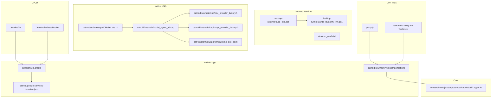

**Diagram sources**
- [AndroidManifest.xml](file://catroid/src/main/AndroidManifest.xml)
- [build.gradle](file://catroid/build.gradle)
- [google-services-template.json](file://catroid/google-services-template.json)
- [Logger.kt](file://core/src/main/java/org/catrobat/catroid/util/Logger.kt)
- [build_exe.bat](file://desktop-runtime/build_exe.bat)
- [write_launch4j_xml.ps1](file://desktop-runtime/write_launch4j_xml.ps1)
- [desktop_cmds.txt](file://desktop_cmds.txt)
- [CMakeLists.txt](file://catroid/src/main/cpp/CMakeLists.txt)
- [ai_agent_jni.cpp](file://catroid/src/main/cpp/ai_agent_jni.cpp)
- [cpu_provider_factory.h](file://catroid/src/main/cpp/cpu_provider_factory.h)
- [nnapi_provider_factory.h](file://catroid/src/main/cpp/nnapi_provider_factory.h)
- [onnxruntime_cxx_api.h](file://catroid/src/main/cpp/onnxruntime_cxx_api.h)
- [Jenkinsfile](file://Jenkinsfile)
- [Jenkinsfile.baseDocker](file://Jenkinsfile.baseDocker)
- [proxy.js](file://proxy.js)
- [neocatroid-telegram-worker.js](file://neocatroid-telegram-worker.js)

**Section sources**
- [AndroidManifest.xml](file://catroid/src/main/AndroidManifest.xml)
- [build.gradle](file://catroid/build.gradle)
- [Logger.kt](file://core/src/main/java/org/catrobat/catroid/util/Logger.kt)
- [Jenkinsfile](file://Jenkinsfile)
- [Jenkinsfile.baseDocker](file://Jenkinsfile.baseDocker)

## Core Components
- Structured logging utility: central logger abstraction used across modules to emit consistent, structured logs.
- Android manifest and build configuration: controls application-level flags, permissions, and service integrations relevant to diagnostics.
- Google Services templates: enable Firebase Crashlytics and Analytics when configured.
- Desktop runtime packaging scripts: support building Windows executables with Launch4j and embedding runtime assets.
- Native JNI layer: bridges Java/Kotlin to C++ for AI/ML features; includes provider factories and ONNX Runtime headers.
- CI/CD pipelines: automate builds, tests, and artifact generation.
- Development utilities: local proxy and Telegram worker for dev/test feedback loops.

**Section sources**
- [Logger.kt](file://core/src/main/java/org/catrobat/catroid/util/Logger.kt)
- [AndroidManifest.xml](file://catroid/src/main/AndroidManifest.xml)
- [build.gradle](file://catroid/build.gradle)
- [google-services-template.json](file://catroid/google-services-template.json)
- [runtime_assets_google_services_template.json](file://catroid/src/main/runtime/assets/google-services-template.json)
- [build_exe.bat](file://desktop-runtime/build_exe.bat)
- [write_launch4j_xml.ps1](file://desktop-runtime/write_launch4j_xml.ps1)
- [CMakeLists.txt](file://catroid/src/main/cpp/CMakeLists.txt)
- [ai_agent_jni.cpp](file://catroid/src/main/cpp/ai_agent_jni.cpp)
- [cpu_provider_factory.h](file://catroid/src/main/cpp/cpu_provider_factory.h)
- [nnapi_provider_factory.h](file://catroid/src/main/cpp/nnapi_provider_factory.h)
- [onnxruntime_cxx_api.h](file://catroid/src/main/cpp/onnxruntime_cxx_api.h)
- [Jenkinsfile](file://Jenkinsfile)
- [proxy.js](file://proxy.js)
- [neocatroid-telegram-worker.js](file://neocatroid-telegram-worker.js)

## Architecture Overview
The debugging and monitoring architecture spans three layers:
- Application layer (Android/Desktop): structured logging, UI telemetry hooks, and integration with external services.
- Native layer (JNI/C++): low-level diagnostics, memory/perf traces, and crash context capture.
- CI/CD and tooling: automated builds, test runs, and developer feedback channels.

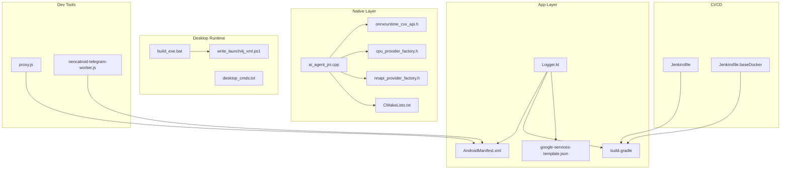

**Diagram sources**
- [Logger.kt](file://core/src/main/java/org/catrobat/catroid/util/Logger.kt)
- [AndroidManifest.xml](file://catroid/src/main/AndroidManifest.xml)
- [build.gradle](file://catroid/build.gradle)
- [google-services-template.json](file://catroid/google-services-template.json)
- [ai_agent_jni.cpp](file://catroid/src/main/cpp/ai_agent_jni.cpp)
- [onnxruntime_cxx_api.h](file://catroid/src/main/cpp/onnxruntime_cxx_api.h)
- [cpu_provider_factory.h](file://catroid/src/main/cpp/cpu_provider_factory.h)
- [nnapi_provider_factory.h](file://catroid/src/main/cpp/nnapi_provider_factory.h)
- [CMakeLists.txt](file://catroid/src/main/cpp/CMakeLists.txt)
- [build_exe.bat](file://desktop-runtime/build_exe.bat)
- [write_launch4j_xml.ps1](file://desktop-runtime/write_launch4j_xml.ps1)
- [desktop_cmds.txt](file://desktop_cmds.txt)
- [Jenkinsfile](file://Jenkinsfile)
- [Jenkinsfile.baseDocker](file://Jenkinsfile.baseDocker)
- [proxy.js](file://proxy.js)
- [neocatroid-telegram-worker.js](file://neocatroid-telegram-worker.js)

## Detailed Component Analysis

### Logging Strategy and Levels
- Centralized Logger: Use the shared logger to emit structured logs with consistent keys and levels across modules.
- Log Levels: Adopt standard levels (DEBUG, INFO, WARN, ERROR) and restrict DEBUG in release builds.
- Structured Fields: Include contextual fields such as component name, action, device info, session IDs, and error codes.
- Aggregation: Forward logs to platform services (e.g., Firebase Analytics events) or centralized log collectors where applicable.

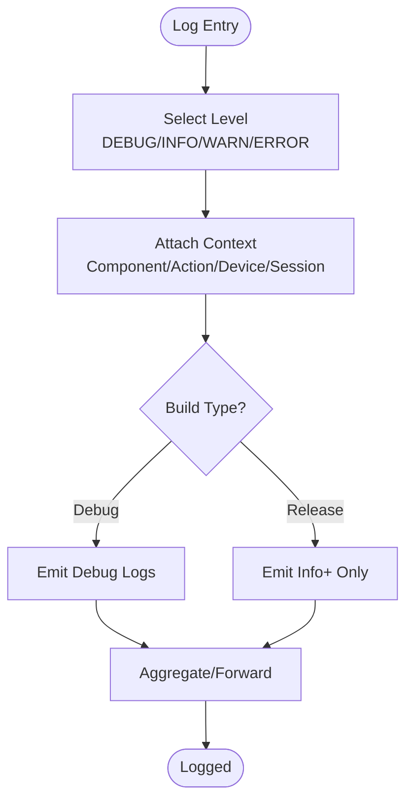

**Section sources**
- [Logger.kt](file://core/src/main/java/org/catrobat/catroid/util/Logger.kt)
- [build.gradle](file://catroid/build.gradle)
- [gradle.properties](file://gradle.properties)

### Remote Debugging on Android Devices
- Enable USB debugging on device and connect via adb.
- Use Android Studio’s debugger to attach to running processes.
- For network issues, configure a local proxy to intercept traffic.
- Capture logs using logcat filters by tag/package.

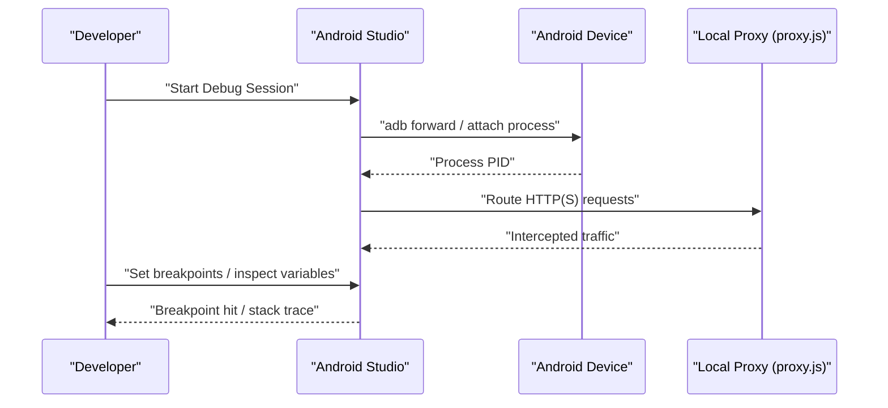

**Diagram sources**
- [proxy.js](file://proxy.js)
- [AndroidManifest.xml](file://catroid/src/main/AndroidManifest.xml)

**Section sources**
- [proxy.js](file://proxy.js)
- [AndroidManifest.xml](file://catroid/src/main/AndroidManifest.xml)

### Desktop Runtime Debugging
- Build desktop executable using provided scripts.
- Run with integrated console output and attach a Java debugger if needed.
- Use desktop commands file for quick launch options.

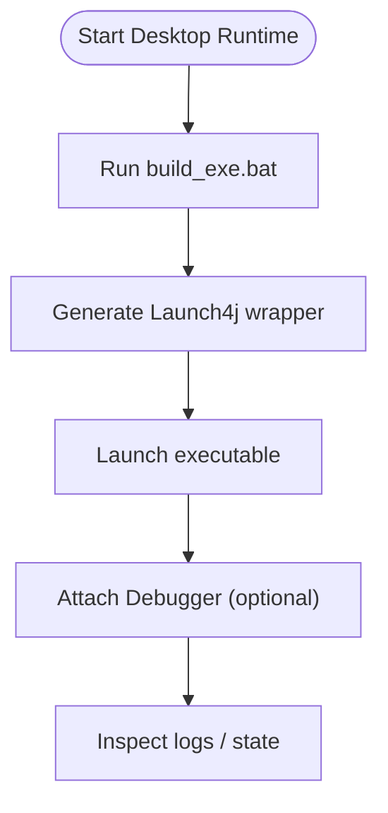

**Diagram sources**
- [build_exe.bat](file://desktop-runtime/build_exe.bat)
- [write_launch4j_xml.ps1](file://desktop-runtime/write_launch4j_xml.ps1)
- [desktop_cmds.txt](file://desktop_cmds.txt)

**Section sources**
- [build_exe.bat](file://desktop-runtime/build_exe.bat)
- [write_launch4j_xml.ps1](file://desktop-runtime/write_launch4j_xml.ps1)
- [desktop_cmds.txt](file://desktop_cmds.txt)

### Native Code Debugging (GDB/LLDB)
- Native components are built via CMake and exposed through JNI.
- Use LLDB/GDB to debug native crashes, memory issues, and performance hotspots.
- Inspect provider factories and ONNX Runtime interactions.

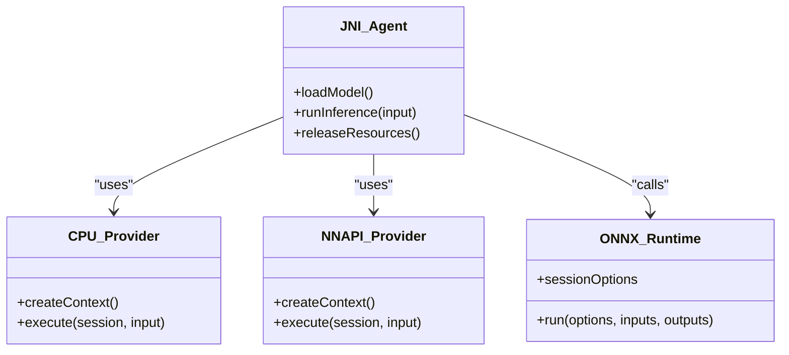

**Diagram sources**
- [ai_agent_jni.cpp](file://catroid/src/main/cpp/ai_agent_jni.cpp)
- [cpu_provider_factory.h](file://catroid/src/main/cpp/cpu_provider_factory.h)
- [nnapi_provider_factory.h](file://catroid/src/main/cpp/nnapi_provider_factory.h)
- [onnxruntime_cxx_api.h](file://catroid/src/main/cpp/onnxruntime_cxx_api.h)
- [CMakeLists.txt](file://catroid/src/main/cpp/CMakeLists.txt)

**Section sources**
- [CMakeLists.txt](file://catroid/src/main/cpp/CMakeLists.txt)
- [ai_agent_jni.cpp](file://catroid/src/main/cpp/ai_agent_jni.cpp)
- [cpu_provider_factory.h](file://catroid/src/main/cpp/cpu_provider_factory.h)
- [nnapi_provider_factory.h](file://catroid/src/main/cpp/nnapi_provider_factory.h)
- [onnxruntime_cxx_api.h](file://catroid/src/main/cpp/onnxruntime_cxx_api.h)

### Crash Reporting and Error Tracking
- Integrate Firebase Crashlytics via Google Services template to collect non-fatal and fatal crashes.
- Ensure proper initialization in the app lifecycle and include meaningful custom keys.
- Use structured logs to correlate crash context.

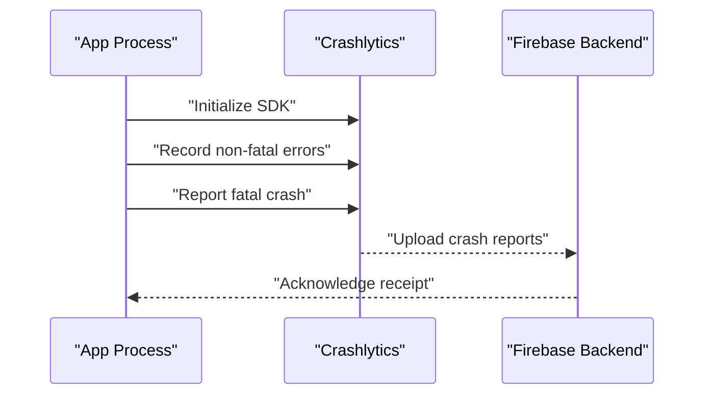

**Diagram sources**
- [google-services-template.json](file://catroid/google-services-template.json)
- [runtime_assets_google_services_template.json](file://catroid/src/main/runtime/assets/google-services-template.json)

**Section sources**
- [google-services-template.json](file://catroid/google-services-template.json)
- [runtime_assets_google_services_template.json](file://catroid/src/main/runtime/assets/google-services-template.json)

### User Feedback Collection
- Provide in-app feedback forms that send structured reports including logs and device metadata.
- Optionally integrate with Telegram worker for rapid dev feedback during testing.

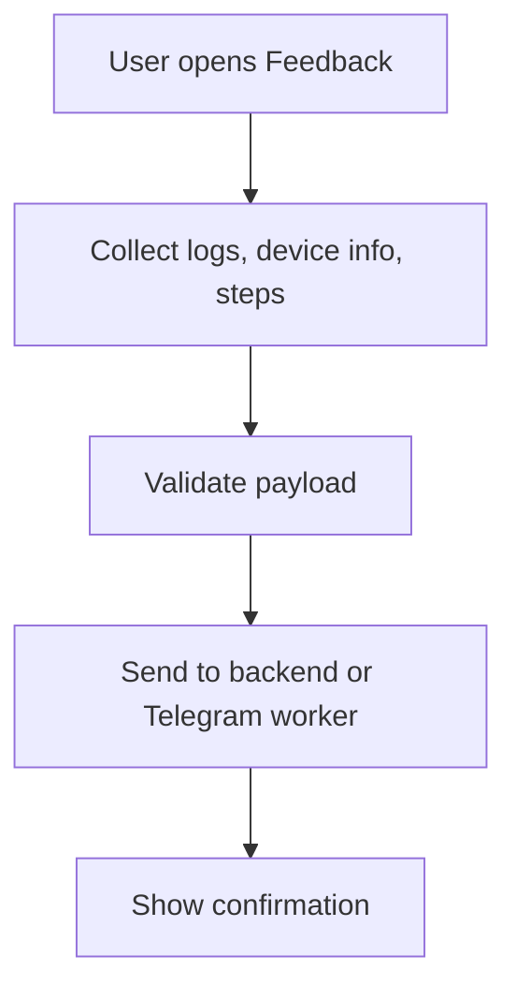

**Diagram sources**
- [neocatroid-telegram-worker.js](file://neocatroid-telegram-worker.js)
- [AndroidManifest.xml](file://catroid/src/main/AndroidManifest.xml)

**Section sources**
- [neocatroid-telegram-worker.js](file://neocatroid-telegram-worker.js)
- [AndroidManifest.xml](file://catroid/src/main/AndroidManifest.xml)

### Performance Monitoring Dashboards and Real-Time Analytics
- Instrument key flows with analytics events (e.g., project load time, rendering frames).
- Visualize metrics in dashboards and set thresholds for alerts.
- Correlate performance regressions with commits via CI artifacts.

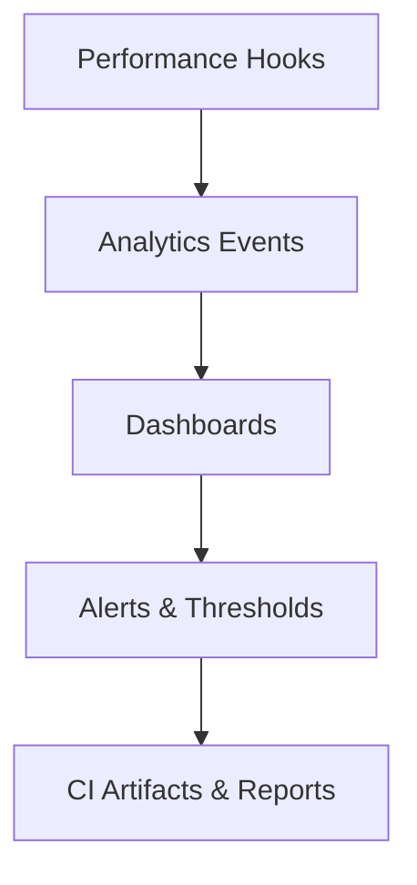

[No sources needed since this diagram shows conceptual workflow, not actual code structure]

### Alerting Systems
- Configure alert rules based on crash rates, ANR frequency, and performance KPIs.
- Route alerts to team channels (e.g., Slack, email) and link to crash reports.

[No sources needed since this section provides general guidance]

### Integration of Debugging Tools
- Local proxy for network inspection.
- Android Studio debugger for Java/Kotlin.
- LLDB/GDB for native debugging.
- Desktop runtime launcher scripts for quick iteration.

**Section sources**
- [proxy.js](file://proxy.js)
- [build_exe.bat](file://desktop-runtime/build_exe.bat)
- [write_launch4j_xml.ps1](file://desktop-runtime/write_launch4j_xml.ps1)
- [CMakeLists.txt](file://catroid/src/main/cpp/CMakeLists.txt)

### Custom Debug Builds and Development Environment Setup
- Use Gradle properties to toggle debug flags and logging verbosity.
- Generate debug APKs with verbose logging enabled.
- Set up CI jobs to produce debug artifacts for testers.

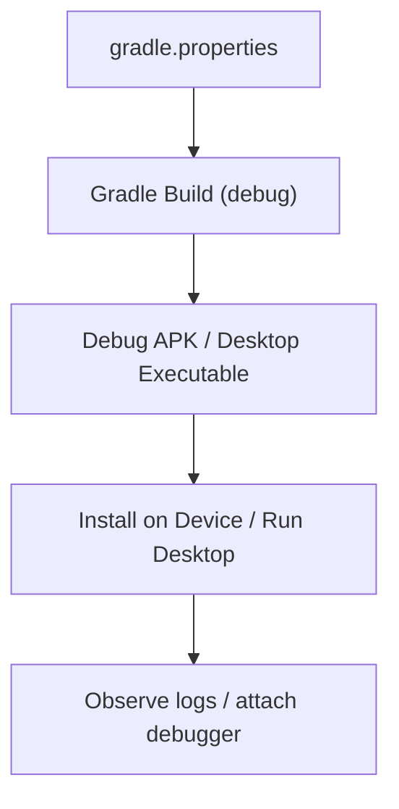

**Diagram sources**
- [gradle.properties](file://gradle.properties)
- [build.gradle](file://catroid/build.gradle)
- [build_exe.bat](file://desktop-runtime/build_exe.bat)

**Section sources**
- [gradle.properties](file://gradle.properties)
- [build.gradle](file://catroid/build.gradle)
- [build_exe.bat](file://desktop-runtime/build_exe.bat)

### Production Monitoring, Health Checks, and Incident Response
- Implement health check endpoints or status pings for server-side components.
- Monitor crash-free sessions and performance SLAs.
- Define runbooks for common incidents (crash spikes, ANRs, slow loads).

[No sources needed since this section provides general guidance]

## Dependency Analysis
Key dependencies for debugging and monitoring:
- Android manifest declares permissions and components required for diagnostics.
- Gradle configures build variants and dependencies for logging/analytics.
- Google Services templates enable crash reporting and analytics.
- Native CMake lists define JNI interfaces and ONNX Runtime usage.
- CI pipelines orchestrate builds and tests.

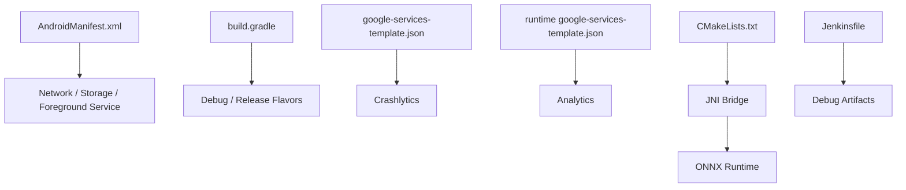

**Diagram sources**
- [AndroidManifest.xml](file://catroid/src/main/AndroidManifest.xml)
- [build.gradle](file://catroid/build.gradle)
- [google-services-template.json](file://catroid/google-services-template.json)
- [runtime_assets_google_services_template.json](file://catroid/src/main/runtime/assets/google-services-template.json)
- [CMakeLists.txt](file://catroid/src/main/cpp/CMakeLists.txt)
- [Jenkinsfile](file://Jenkinsfile)

**Section sources**
- [AndroidManifest.xml](file://catroid/src/main/AndroidManifest.xml)
- [build.gradle](file://catroid/build.gradle)
- [google-services-template.json](file://catroid/google-services-template.json)
- [runtime_assets_google_services_template.json](file://catroid/src/main/runtime/assets/google-services-template.json)
- [CMakeLists.txt](file://catroid/src/main/cpp/CMakeLists.txt)
- [Jenkinsfile](file://Jenkinsfile)

## Performance Considerations
- Avoid excessive logging in hot paths; use sampling for high-frequency events.
- Prefer structured logs with minimal payloads to reduce overhead.
- Profile native code with perfetto/traceview and monitor frame times.
- Cache expensive computations and reuse resources to minimize GC pressure.

[No sources needed since this section provides general guidance]

## Troubleshooting Guide
Common issues and resolutions:
- No logs captured: Verify logger initialization and build type filtering.
- Network interception fails: Check proxy configuration and certificate trust settings.
- Native crashes: Use LLDB/GDB to inspect stack traces and memory states.
- Desktop runtime fails to start: Re-run packaging scripts and validate embedded assets.
- Crash reports missing: Ensure Google Services template is correctly configured and initialized.

**Section sources**
- [Logger.kt](file://core/src/main/java/org/catrobat/catroid/util/Logger.kt)
- [proxy.js](file://proxy.js)
- [CMakeLists.txt](file://catroid/src/main/cpp/CMakeLists.txt)
- [build_exe.bat](file://desktop-runtime/build_exe.bat)
- [google-services-template.json](file://catroid/google-services-template.json)

## Conclusion
Effective debugging and monitoring in NewCatroid require a layered approach: structured logging at the app level, robust crash reporting and analytics, targeted native debugging, and streamlined desktop runtime workflows. Integrating CI/CD and developer tools accelerates issue resolution and improves overall reliability.

## Appendices
- Quick links to key files for reference:
  - [Logger.kt](file://core/src/main/java/org/catrobat/catroid/util/Logger.kt)
  - [AndroidManifest.xml](file://catroid/src/main/AndroidManifest.xml)
  - [build.gradle](file://catroid/build.gradle)
  - [gradle.properties](file://gradle.properties)
  - [google-services-template.json](file://catroid/google-services-template.json)
  - [runtime_assets_google_services_template.json](file://catroid/src/main/runtime/assets/google-services-template.json)
  - [Jenkinsfile](file://Jenkinsfile)
  - [proxy.js](file://proxy.js)
  - [neocatroid-telegram-worker.js](file://neocatroid-telegram-worker.js)
  - [desktop_cmds.txt](file://desktop_cmds.txt)
  - [build_exe.bat](file://desktop-runtime/build_exe.bat)
  - [write_launch4j_xml.ps1](file://desktop-runtime/write_launch4j_xml.ps1)
  - [CMakeLists.txt](file://catroid/src/main/cpp/CMakeLists.txt)
  - [ai_agent_jni.cpp](file://catroid/src/main/cpp/ai_agent_jni.cpp)
  - [cpu_provider_factory.h](file://catroid/src/main/cpp/cpu_provider_factory.h)
  - [nnapi_provider_factory.h](file://catroid/src/main/cpp/nnapi_provider_factory.h)
  - [onnxruntime_cxx_api.h](file://catroid/src/main/cpp/onnxruntime_cxx_api.h)