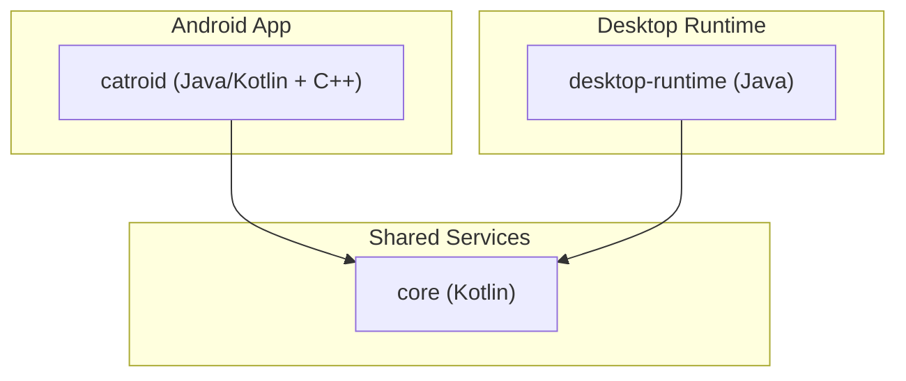
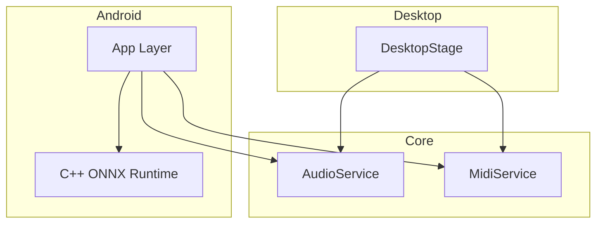
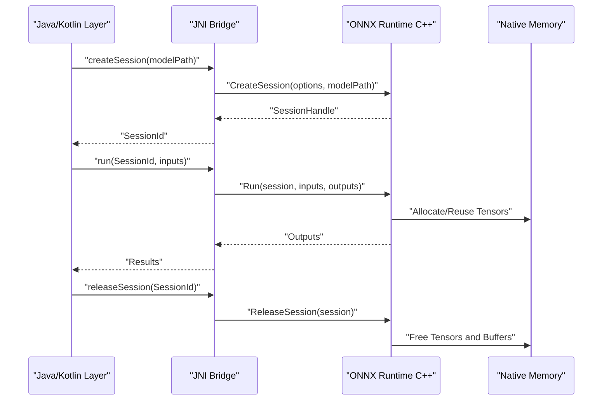
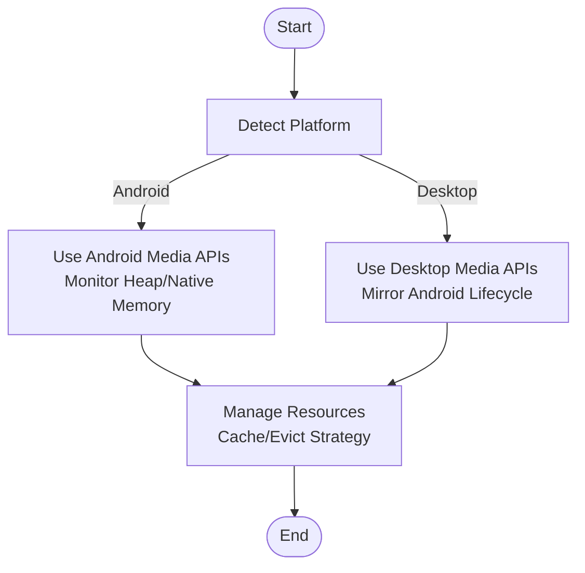
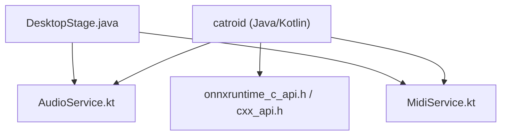

# Memory Management

<cite>
**Referenced Files in This Document**
- [README.md](file://README.md)
- [catroid/src/main/cpp/onnxruntime_c_api.h](file://catroid/src/main/cpp/onnxruntime_c_api.h)
- [catroid/src/main/cpp/onnxruntime_cxx_api.h](file://catroid/src/main/cpp/onnxruntime_cxx_api.h)
- [catroid/src/main/cpp/onnxruntime_cxx_inline.h](file://catroid/src/main/cpp/onnxruntime_cxx_inline.h)
- [catroid/src/main/cpp/onnxtest.cpp](file://catroid/src/main/cpp/onnxtest.cpp)
- [catroid/src/main/cpp/ai_agent_jni.cpp](file://catroid/src/main/cpp/ai_agent_jni.cpp)
- [core/src/main/java/org/catrobat/catroid/audio/AudioService.kt](file://core/src/main/java/org/catrobat/catroid/audio/AudioService.kt)
- [core/src/main/java/org/catrobat/catroid/audio/MidiService.kt](file://core/src/main/java/org/catrobat/catroid/audio/MidiService.kt)
- [desktop-runtime/src/main/java/org/catrobat/catroid/stage/DesktopStage.java](file://desktop-runtime/src/main/java/org/catrobat/catroid/stage/DesktopStage.java)
</cite>

## Table of Contents
1. [Introduction](#introduction)
2. [Project Structure](#project-structure)
3. [Core Components](#core-components)
4. [Architecture Overview](#architecture-overview)
5. [Detailed Component Analysis](#detailed-component-analysis)
6. [Dependency Analysis](#dependency-analysis)
7. [Performance Considerations](#performance-considerations)
8. [Troubleshooting Guide](#troubleshooting-guide)
9. [Conclusion](#conclusion)
10. [Appendices](#appendices)

## Introduction
This document provides comprehensive memory management guidance for NewCatroid, focusing on asset loading strategies, texture atlasing, efficient sprite rendering, garbage collection tuning, object pooling patterns, and resource lifecycle management across images, audio, and video assets. It also covers native memory management for C++ components, ONNX model memory optimization, and cross-platform considerations between Android and desktop runtimes. Concrete examples are referenced from the codebase to illustrate memory-efficient patterns.

## Project Structure
NewCatroid is a multi-module project with:
- Android app module (catroid) containing Java/Kotlin UI and runtime logic, plus native C++ components including ONNX Runtime integration.
- Core shared library (core) providing platform-agnostic services such as audio and text handling.
- Desktop runtime (desktop-runtime) that reuses core services and adapts stage rendering for desktop platforms.

[No sources needed since this diagram shows conceptual structure]

## Core Components
Key areas impacting memory usage:
- Asset loading and caching for images, audio, and video.
- Texture atlas creation and sprite batching to minimize GPU memory and draw calls.
- Native ONNX Runtime session and tensor memory management.
- Platform-specific resource lifecycle (Android vs Desktop).

**Section sources**
- [README.md](file://README.md)

## Architecture Overview
High-level architecture relevant to memory management:
- The Android app loads assets into managed memory and uploads textures to GPU.
- Shared services manage audio resources and text rasterization.
- Desktop runtime mirrors these responsibilities with platform-appropriate APIs.
- Native C++ layer integrates ONNX Runtime for AI features, requiring explicit memory control.

[No sources needed since this diagram shows conceptual relationships]

## Detailed Component Analysis

### Asset Loading Strategies
- Images: Prefer pre-scaled assets and reuse decoded bitmaps via a cache keyed by resolution and format. Avoid decoding large images repeatedly; decode once and store references safely.
- Audio: Use streaming for long clips and pooled decoders for short sounds. Release decoder instances when no longer needed.
- Video: Stream frames and release frame buffers promptly. Reuse decoders where possible.

Patterns to follow:
- Centralized loader with LRU cache and size limits.
- Decode-on-demand with background threads to avoid blocking.
- Explicit disposal paths tied to scene or screen transitions.

[No sources needed since this section provides general guidance]

### Texture Atlasing Implementation
- Group frequently co-rendered sprites into atlases to reduce texture switches and VRAM fragmentation.
- Batch update atlases during off-peak times; avoid resizing at runtime if possible.
- Track atlas occupancy and evict least-used atlases under memory pressure.

Implementation tips:
- Maintain an atlas registry mapping logical groups to GPU textures.
- Provide API to add/remove sprites and rebuild atlases incrementally.
- Monitor GPU memory usage and trigger atlas compaction when thresholds are exceeded.

[No sources needed since this section provides general guidance]

### Efficient Sprite Rendering
- Use batched drawing with atlases to minimize state changes.
- Avoid per-frame allocation in hot paths; reuse vertex buffers and indices.
- Clamp texture sizes to device capabilities; downscale oversized assets.

[No sources needed since this section provides general guidance]

### Garbage Collection Tuning
- Reduce short-lived allocations in render loops and event handlers.
- Preallocate reusable objects (e.g., vectors, buffers) and clear them instead of reallocating.
- On Android, prefer primitive collections and avoid autoboxing in tight loops.

[No sources needed since this section provides general guidance]

### Object Pooling Patterns
- Implement pools for transient objects like temporary matrices, color structs, and small buffers.
- Provide acquire/release methods and enforce non-null checks before use.
- Size pools based on peak observed usage; grow lazily if necessary.

[No sources needed since this section provides general guidance]

### Resource Lifecycle Management
- Images: Load -> Cache -> Use -> Evict/Release. Ensure caches respect global memory budgets.
- Audio: Open stream -> Play -> Close. For looping sounds, pause rather than stop to avoid re-open overhead.
- Video: Initialize decoder -> Render frames -> Stop and release decoder when done.

[No sources needed since this section provides general guidance]

### Native Memory Management for C++ Components
- Follow RAII principles: wrap native handles in classes with deterministic destruction.
- Validate all pointers and handle null returns from native APIs.
- Keep JNI boundaries minimal; pass only essential data across layers.

**Section sources**
- [catroid/src/main/cpp/onnxruntime_c_api.h](file://catroid/src/main/cpp/onnxruntime_c_api.h)
- [catroid/src/main/cpp/onnxruntime_cxx_api.h](file://catroid/src/main/cpp/onnxruntime_cxx_api.h)
- [catroid/src/main/cpp/onnxruntime_cxx_inline.h](file://catroid/src/main/cpp/onnxruntime_cxx_inline.h)
- [catroid/src/main/cpp/ai_agent_jni.cpp](file://catroid/src/main/cpp/ai_agent_jni.cpp)

### ONNX Model Memory Optimization
- Create one Session per model and reuse it across runs.
- Allocate input/output tensors once and reuse buffers; avoid repeated allocations inside inference loops.
- Use minimal precision types supported by the target device (e.g., float16) to reduce memory footprint.
- Release sessions and models explicitly when no longer needed.

Concrete example references:
- ONNX Runtime C/C++ headers define session and tensor lifetimes.
- Example test demonstrates session creation and execution flow.
- JNI bridge exposes ONNX operations to Kotlin/Java while managing native resources.

**Diagram sources**
- [catroid/src/main/cpp/onnxruntime_c_api.h](file://catroid/src/main/cpp/onnxruntime_c_api.h)
- [catroid/src/main/cpp/onnxruntime_cxx_api.h](file://catroid/src/main/cpp/onnxruntime_cxx_api.h)
- [catroid/src/main/cpp/onnxruntime_cxx_inline.h](file://catroid/src/main/cpp/onnxruntime_cxx_inline.h)
- [catroid/src/main/cpp/onnxtest.cpp](file://catroid/src/main/cpp/onnxtest.cpp)
- [catroid/src/main/cpp/ai_agent_jni.cpp](file://catroid/src/main/cpp/ai_agent_jni.cpp)

**Section sources**
- [catroid/src/main/cpp/onnxruntime_c_api.h](file://catroid/src/main/cpp/onnxruntime_c_api.h)
- [catroid/src/main/cpp/onnxruntime_cxx_api.h](file://catroid/src/main/cpp/onnxruntime_cxx_api.h)
- [catroid/src/main/cpp/onnxruntime_cxx_inline.h](file://catroid/src/main/cpp/onnxruntime_cxx_inline.h)
- [catroid/src/main/cpp/onnxtest.cpp](file://catroid/src/main/cpp/onnxtest.cpp)
- [catroid/src/main/cpp/ai_agent_jni.cpp](file://catroid/src/main/cpp/ai_agent_jni.cpp)

### Cross-Platform Memory Considerations (Android vs Desktop)
- Android:
  - Respect system memory limits; monitor heap and native memory.
  - Use Android-specific media APIs for audio/video with proper lifecycle callbacks.
- Desktop:
  - Larger memory budgets but still require disciplined resource management.
  - DesktopStage should mirror Android’s resource lifecycle to ensure consistent behavior.

[No sources needed since this diagram shows conceptual workflow]

**Section sources**
- [desktop-runtime/src/main/java/org/catrobat/catroid/stage/DesktopStage.java](file://desktop-runtime/src/main/java/org/catrobat/catroid/stage/DesktopStage.java)

## Dependency Analysis
Memory-related dependencies:
- Core audio services depend on platform media backends.
- ONNX Runtime depends on native libraries and OS allocators.
- Desktop runtime depends on core services and platform graphics stack.

**Diagram sources**
- [core/src/main/java/org/catrobat/catroid/audio/AudioService.kt](file://core/src/main/java/org/catrobat/catroid/audio/AudioService.kt)
- [core/src/main/java/org/catrobat/catroid/audio/MidiService.kt](file://core/src/main/java/org/catrobat/catroid/audio/MidiService.kt)
- [catroid/src/main/cpp/onnxruntime_c_api.h](file://catroid/src/main/cpp/onnxruntime_c_api.h)
- [catroid/src/main/cpp/onnxruntime_cxx_api.h](file://catroid/src/main/cpp/onnxruntime_cxx_api.h)
- [desktop-runtime/src/main/java/org/catrobat/catroid/stage/DesktopStage.java](file://desktop-runtime/src/main/java/org/catrobat/catroid/stage/DesktopStage.java)

**Section sources**
- [core/src/main/java/org/catrobat/catroid/audio/AudioService.kt](file://core/src/main/java/org/catrobat/catroid/audio/AudioService.kt)
- [core/src/main/java/org/catrobat/catroid/audio/MidiService.kt](file://core/src/main/java/org/catrobat/catroid/audio/MidiService.kt)
- [catroid/src/main/cpp/onnxruntime_c_api.h](file://catroid/src/main/cpp/onnxruntime_c_api.h)
- [catroid/src/main/cpp/onnxruntime_cxx_api.h](file://catroid/src/main/cpp/onnxruntime_cxx_api.h)
- [desktop-runtime/src/main/java/org/catrobat/catroid/stage/DesktopStage.java](file://desktop-runtime/src/main/java/org/catrobat/catroid/stage/DesktopStage.java)

## Performance Considerations
- Profile both managed and native memory to identify leaks and spikes.
- Prefer immutable data structures for shared read-only assets.
- Batch updates to atlases and avoid frequent rebuilds.
- Tune GC pauses by reducing allocation churn in hot paths.

[No sources needed since this section provides general guidance]

## Troubleshooting Guide
Common issues and remedies:
- Out-of-memory errors during image loading:
  - Verify cache eviction policies and maximum cache sizes.
  - Downscale oversized images before upload.
- Audio playback failures after rapid start/stop:
  - Ensure decoders are closed and streams released.
- ONNX inference crashes:
  - Confirm session reuse and buffer reuse; check tensor shapes and types.
- Desktop vs Android discrepancies:
  - Align resource lifecycle and error handling between platforms.

**Section sources**
- [core/src/main/java/org/catrobat/catroid/audio/AudioService.kt](file://core/src/main/java/org/catrobat/catroid/audio/AudioService.kt)
- [core/src/main/java/org/catrobat/catroid/audio/MidiService.kt](file://core/src/main/java/org/catrobat/catroid/audio/MidiService.kt)
- [catroid/src/main/cpp/onnxtest.cpp](file://catroid/src/main/cpp/onnxtest.cpp)
- [catroid/src/main/cpp/ai_agent_jni.cpp](file://catroid/src/main/cpp/ai_agent_jni.cpp)

## Conclusion
Effective memory management in NewCatroid requires coordinated strategies across asset loading, texture atlasing, sprite rendering, GC tuning, object pooling, and careful native resource control—especially for ONNX Runtime. By centralizing resource lifecycles, reusing buffers, and aligning behaviors across Android and desktop, you can significantly reduce memory footprint and improve stability.

[No sources needed since this section summarizes without analyzing specific files]

## Appendices

### Before/After Comparison Examples
- Before: Frequent per-frame allocations in render loop causing GC spikes.
  - After: Preallocated buffers reused each frame; GC pauses reduced.
- Before: Large images decoded multiple times.
  - After: Decoded once and cached; subsequent uses hit cache.
- Before: ONNX session created per inference call.
  - After: Single session reused; input/output buffers reused.

[No sources needed since this section provides general guidance]

### Memory Profiling Results
- Use platform profilers (Android Studio Profiler, Visual Studio Profiler) to track heap and native memory.
- Focus on allocation hotspots in render loops and asset loading paths.
- Validate improvements by comparing profiles before and after optimizations.

[No sources needed since this section provides general guidance]