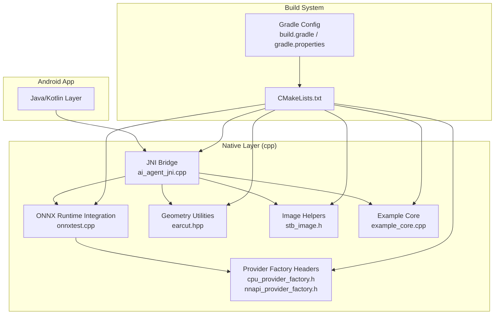
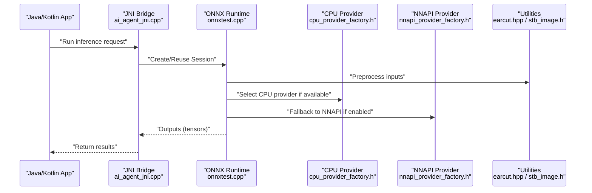
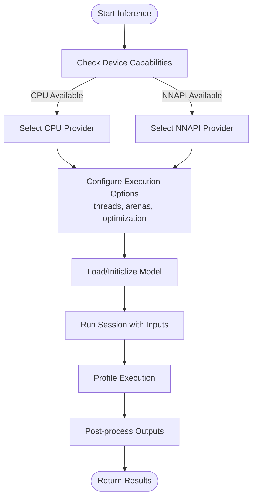
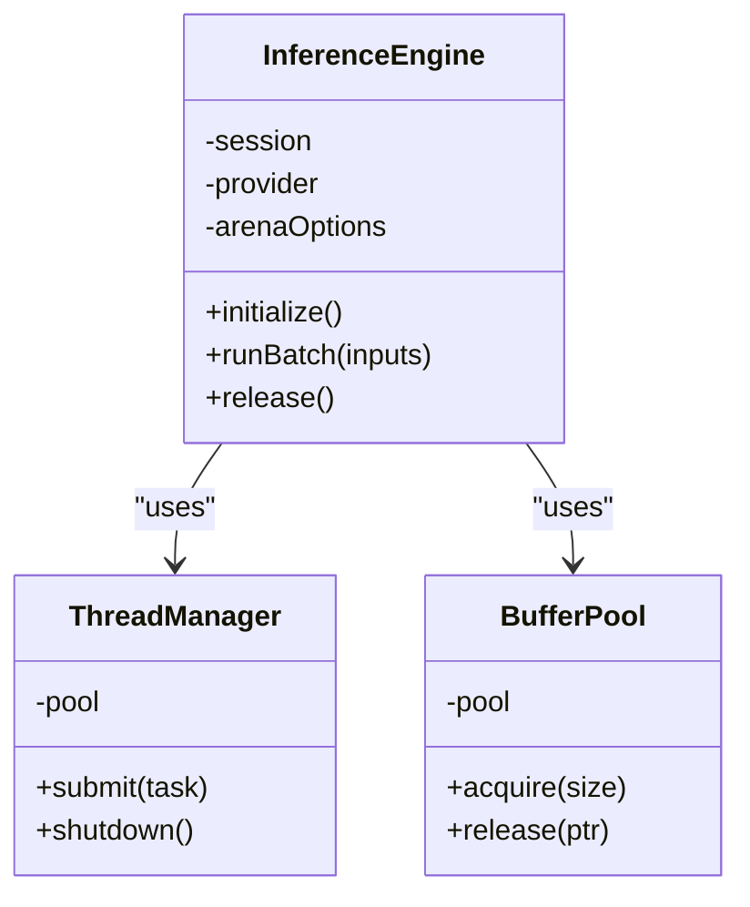
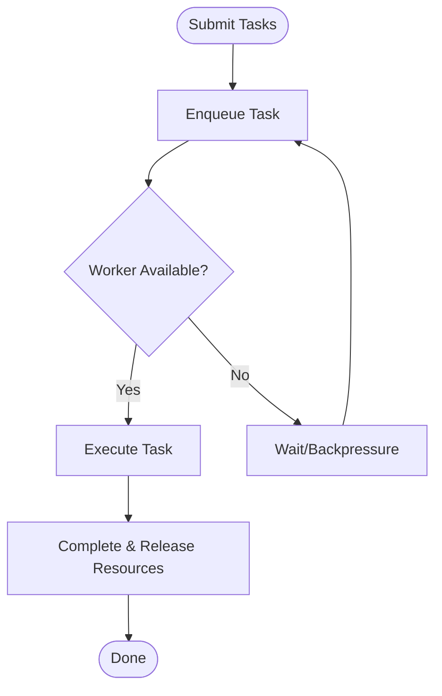
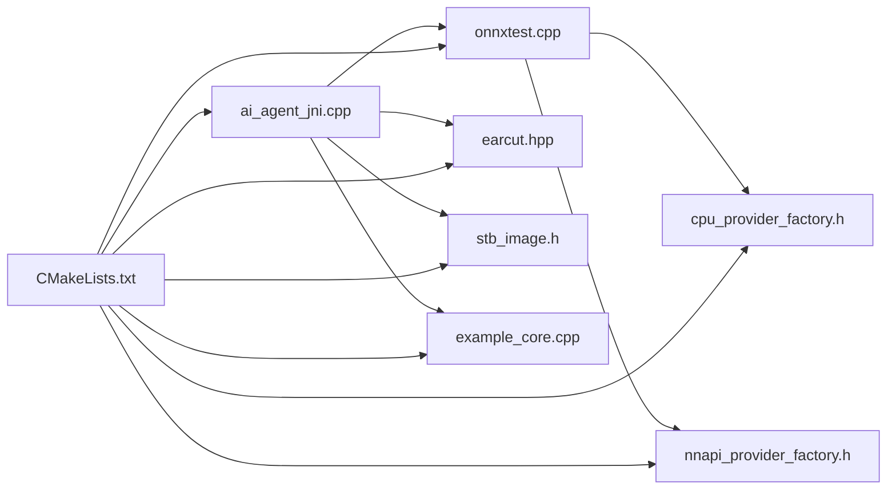

# Native Code Optimization

<cite>
**Referenced Files in This Document**
- [CMakeLists.txt](file://catroid/src/main/cpp/CMakeLists.txt)
- [ai_agent_jni.cpp](file://catroid/src/main/cpp/ai_agent_jni.cpp)
- [onnxtest.cpp](file://catroid/src/main/cpp/onnxtest.cpp)
- [cpu_provider_factory.h](file://catroid/src/main/cpp/cpu_provider_factory.h)
- [nnapi_provider_factory.h](file://catroid/src/main/cpp/nnapi_provider_factory.h)
- [example_core.cpp](file://catroid/src/main/cpp/example_core.cpp)
- [earcut.hpp](file://catroid/src/main/cpp/earcut.hpp)
- [stb_image.h](file://catroid/src/main/cpp/stb_image.h)
- [build.gradle](file://catroid/build.gradle)
- [gradle.properties](file://gradle.properties)
</cite>

## Table of Contents
1. [Introduction](#introduction)
2. [Project Structure](#project-structure)
3. [Core Components](#core-components)
4. [Architecture Overview](#architecture-overview)
5. [Detailed Component Analysis](#detailed-component-analysis)
6. [Dependency Analysis](#dependency-analysis)
7. [Performance Considerations](#performance-considerations)
8. [Troubleshooting Guide](#troubleshooting-guide)
9. [Conclusion](#conclusion)
10. [Appendices](#appendices)

## Introduction
This document provides a comprehensive guide to native code optimization for NewCatroid’s C++ components, focusing on ONNX Runtime performance tuning, model quantization strategies, inference acceleration (CPU/GPU), SIMD and NEON optimizations, multi-threading with std::thread, memory allocation patterns, cache-friendly data structures, profiler-guided optimization, build system configuration, compiler flags for ARM64/x86, and debugging techniques. It includes concrete examples from AI components, physics-related geometry processing, and media processing modules.

## Project Structure
NewCatroid integrates native code under the Android module’s cpp directory, with CMake as the build system and JNI bridging to Java/Kotlin. Key areas include:
- AI inference via ONNX Runtime and optional NNAPI provider
- Geometry triangulation utilities
- Image decoding helpers
- JNI entry points for AI features
- Build configuration for multiple ABIs

**Diagram sources**
- [ai_agent_jni.cpp](file://catroid/src/main/cpp/ai_agent_jni.cpp)
- [onnxtest.cpp](file://catroid/src/main/cpp/onnxtest.cpp)
- [cpu_provider_factory.h](file://catroid/src/main/cpp/cpu_provider_factory.h)
- [nnapi_provider_factory.h](file://catroid/src/main/cpp/nnapi_provider_factory.h)
- [earcut.hpp](file://catroid/src/main/cpp/earcut.hpp)
- [stb_image.h](file://catroid/src/main/cpp/stb_image.h)
- [example_core.cpp](file://catroid/src/main/cpp/example_core.cpp)
- [CMakeLists.txt](file://catroid/src/main/cpp/CMakeLists.txt)
- [build.gradle](file://catroid/build.gradle)
- [gradle.properties](file://gradle.properties)

**Section sources**
- [CMakeLists.txt](file://catroid/src/main/cpp/CMakeLists.txt)
- [build.gradle](file://catroid/build.gradle)
- [gradle.properties](file://gradle.properties)

## Core Components
- ONNX Runtime integration: Session creation, execution options, provider selection (CPU/NNAPI), input/output tensor handling, and profiling hooks.
- Provider factories: CPU and NNAPI provider configuration headers used by ONNX Runtime.
- JNI bridge: Exposes AI capabilities to Java/Kotlin, marshals buffers, and manages lifecycle.
- Geometry utilities: Ear-clipping triangulation for polygon decomposition used in physics and rendering pipelines.
- Media helpers: Lightweight image loading utilities for preprocessing before inference.
- Example core: Demonstrates optimized loops and vectorized operations suitable for adaptation.

Key optimization targets:
- Reduce memory copies between Java and native layers
- Enable SIMD/NEON where available
- Use thread pools for batched inference
- Quantize models to int8 or float16 when supported
- Prefer contiguous memory layouts and avoid fragmentation

**Section sources**
- [ai_agent_jni.cpp](file://catroid/src/main/cpp/ai_agent_jni.cpp)
- [onnxtest.cpp](file://catroid/src/main/cpp/onnxtest.cpp)
- [cpu_provider_factory.h](file://catroid/src/main/cpp/cpu_provider_factory.h)
- [nnapi_provider_factory.h](file://catroid/src/main/cpp/nnapi_provider_factory.h)
- [earcut.hpp](file://catroid/src/main/cpp/earcut.hpp)
- [stb_image.h](file://catroid/src/main/cpp/stb_image.h)
- [example_core.cpp](file://catroid/src/main/cpp/example_core.cpp)

## Architecture Overview
The native stack is layered:
- Java/Kotlin calls JNI functions
- JNI delegates to ONNX Runtime session management
- Providers (CPU/NNAPI) execute kernels optimized per platform
- Pre/post-processing uses geometry and image utilities
- Build system compiles for multiple ABIs with appropriate flags

**Diagram sources**
- [ai_agent_jni.cpp](file://catroid/src/main/cpp/ai_agent_jni.cpp)
- [onnxtest.cpp](file://catroid/src/main/cpp/onnxtest.cpp)
- [cpu_provider_factory.h](file://catroid/src/main/cpp/cpu_provider_factory.h)
- [nnapi_provider_factory.h](file://catroid/src/main/cpp/nnapi_provider_factory.h)
- [earcut.hpp](file://catroid/src/main/cpp/earcut.hpp)
- [stb_image.h](file://catroid/src/main/cpp/stb_image.h)

## Detailed Component Analysis

### ONNX Runtime Performance Tuning
Focus areas:
- Execution providers: Choose CPU vs NNAPI based on device capability; enable dynamic provider selection.
- Inference options: Configure intra-op and inter-op threads, graph optimization level, and memory arena settings.
- Model format: Prefer quantized models (int8/float16) and ensure runtime supports them.
- Profiling: Use built-in profiling to identify bottlenecks and validate improvements.

**Diagram sources**
- [onnxtest.cpp](file://catroid/src/main/cpp/onnxtest.cpp)
- [cpu_provider_factory.h](file://catroid/src/main/cpp/cpu_provider_factory.h)
- [nnapi_provider_factory.h](file://catroid/src/main/cpp/nnapi_provider_factory.h)

**Section sources**
- [onnxtest.cpp](file://catroid/src/main/cpp/onnxtest.cpp)
- [cpu_provider_factory.h](file://catroid/src/main/cpp/cpu_provider_factory.h)
- [nnapi_provider_factory.h](file://catroid/src/main/cpp/nnapi_provider_factory.h)

### Model Quantization Strategies
Recommended approaches:
- Post-training quantization (PTQ): Convert float32 to int8 using representative datasets; validate accuracy drop.
- Mixed precision: Use float16 where supported to reduce memory bandwidth and improve throughput.
- Operator coverage: Ensure target providers support quantized ops; fallback paths may be needed.
- Calibration: Calibrate activation ranges carefully to minimize quantization error.

Practical tips:
- Keep input tensors aligned and contiguous
- Avoid unnecessary conversions back to float32 unless required by downstream logic
- Batch inputs to amortize overheads

[No sources needed since this section provides general guidance]

### Inference Optimization Techniques
- Multi-threading: Use std::thread or a thread pool for parallel batches; respect ONNX Runtime threading limits to avoid oversubscription.
- Memory reuse: Reuse input/output buffers across frames to reduce allocations.
- Data layout: Prefer NHWC/NCHW formats consistent with model expectations; minimize transposes.
- Prefetching: Overlap I/O and compute by preloading next batch while current runs.

**Diagram sources**
- [ai_agent_jni.cpp](file://catroid/src/main/cpp/ai_agent_jni.cpp)
- [onnxtest.cpp](file://catroid/src/main/cpp/onnxtest.cpp)

**Section sources**
- [ai_agent_jni.cpp](file://catroid/src/main/cpp/ai_agent_jni.cpp)
- [onnxtest.cpp](file://catroid/src/main/cpp/onnxtest.cpp)

### CPU/GPU Acceleration Using NEON Intrinsics and SIMD
Guidelines:
- Prefer compiler auto-vectorization with proper flags (-O3, -march=native/-march=armv8-a+simd)
- Use NEON intrinsics selectively for hot loops (dot products, convolutions)
- Align data to 16/32 bytes for optimal load/store
- Validate correctness on both ARM64 and x86_64

Example focus areas:
- Vectorized arithmetic in example_core.cpp
- Loop unrolling and loop tiling for better cache utilization
- Branchless transformations for predictable pipelines

**Section sources**
- [example_core.cpp](file://catroid/src/main/cpp/example_core.cpp)

### Multi-threading with std::thread
Best practices:
- Limit total threads to physical cores to avoid context switching overhead
- Use task queues with bounded capacity to prevent memory spikes
- Employ lock-free structures where possible; otherwise use fine-grained locks
- Profile thread contention and adjust granularity

**Diagram sources**
- [ai_agent_jni.cpp](file://catroid/src/main/cpp/ai_agent_jni.cpp)

**Section sources**
- [ai_agent_jni.cpp](file://catroid/src/main/cpp/ai_agent_jni.cpp)

### Memory Allocation Patterns and Cache-Friendly Structures
Recommendations:
- Use object pools and buffer pools to reduce allocation churn
- Pack arrays of structs into struct of arrays for SIMD traversal
- Prefer contiguous buffers over scattered pointers
- Align critical data to cache line boundaries (64B)

Physics example:
- earcut.hpp triangulation benefits from contiguous vertex arrays and minimal temporary allocations

Media example:
- stb_image.h usage should feed directly into preallocated buffers to avoid copies

**Section sources**
- [earcut.hpp](file://catroid/src/main/cpp/earcut.hpp)
- [stb_image.h](file://catroid/src/main/cpp/stb_image.h)

### Profiler-Guided Optimization
Approach:
- Use Android Studio Profiler, Perfetto, or perf to capture timelines and flame graphs
- Identify hotspots in ONNX Runtime kernels and custom loops
- Validate impact of changes with microbenchmarks and end-to-end traces
- Focus on reducing latency spikes and improving throughput consistency

[No sources needed since this section provides general guidance]

### Build System Optimizations and Compiler Flags
Targets:
- ARM64: Enable NEON/SIMD, optimize for modern CPUs
- x86/x86_64: Enable AVX/SSE where applicable
- Link-time optimization (LTO) and profile-guided optimization (PGO) where feasible
- Strip symbols for release builds

Configuration locations:
- CMakeLists.txt for native targets and flags
- Gradle build.gradle for ABI filtering and NDK toolchain setup
- gradle.properties for global Gradle performance tuning

**Section sources**
- [CMakeLists.txt](file://catroid/src/main/cpp/CMakeLists.txt)
- [build.gradle](file://catroid/build.gradle)
- [gradle.properties](file://gradle.properties)

### Debugging Native Code Issues
Techniques:
- Log with structured messages and timestamps near hot paths
- Use AddressSanitizer and UndefinedBehaviorSanitizer during development
- Inspect JNI boundary issues (buffer ownership, lifetime, alignment)
- Validate ONNX Runtime errors and provider initialization failures

Common pitfalls:
- Mismatched tensor shapes/dtypes
- Incorrect strides or memory layout assumptions
- Race conditions in multi-threaded inference

**Section sources**
- [ai_agent_jni.cpp](file://catroid/src/main/cpp/ai_agent_jni.cpp)
- [onnxtest.cpp](file://catroid/src/main/cpp/onnxtest.cpp)

## Dependency Analysis
Native dependencies and relationships:
- JNI depends on ONNX Runtime APIs and provider factories
- Geometry and image utilities are independent but consumed by inference pipeline
- Build system ties everything together with ABI-specific configurations

**Diagram sources**
- [ai_agent_jni.cpp](file://catroid/src/main/cpp/ai_agent_jni.cpp)
- [onnxtest.cpp](file://catroid/src/main/cpp/onnxtest.cpp)
- [cpu_provider_factory.h](file://catroid/src/main/cpp/cpu_provider_factory.h)
- [nnapi_provider_factory.h](file://catroid/src/main/cpp/nnapi_provider_factory.h)
- [earcut.hpp](file://catroid/src/main/cpp/earcut.hpp)
- [stb_image.h](file://catroid/src/main/cpp/stb_image.h)
- [example_core.cpp](file://catroid/src/main/cpp/example_core.cpp)
- [CMakeLists.txt](file://catroid/src/main/cpp/CMakeLists.txt)

**Section sources**
- [CMakeLists.txt](file://catroid/src/main/cpp/CMakeLists.txt)
- [ai_agent_jni.cpp](file://catroid/src/main/cpp/ai_agent_jni.cpp)
- [onnxtest.cpp](file://catroid/src/main/cpp/onnxtest.cpp)

## Performance Considerations
- Prioritize reducing memory copies at JNI boundaries
- Tune ONNX Runtime threading to match device cores
- Use quantized models to lower memory bandwidth pressure
- Align and pack data for SIMD efficiency
- Profile continuously to catch regressions early

[No sources needed since this section provides general guidance]

## Troubleshooting Guide
- Symptom: High latency spikes
  - Action: Profile to detect GC pauses or thread contention; increase buffer reuse
- Symptom: Out-of-memory errors
  - Action: Reduce batch size; verify arena settings; check for leaks in JNI buffers
- Symptom: Accuracy degradation after quantization
  - Action: Recalibrate; inspect operator support; compare float vs quantized outputs
- Symptom: Provider not selected
  - Action: Verify runtime availability; log provider init status; fallback gracefully

**Section sources**
- [onnxtest.cpp](file://catroid/src/main/cpp/onnxtest.cpp)
- [ai_agent_jni.cpp](file://catroid/src/main/cpp/ai_agent_jni.cpp)

## Conclusion
Optimizing NewCatroid’s native code requires a holistic approach spanning model preparation, runtime configuration, low-level SIMD tuning, careful memory management, and rigorous profiling. By applying the strategies outlined here—especially around ONNX Runtime tuning, quantization, multi-threading, and build flags—you can achieve significant performance gains across AI, physics, and media processing workloads.

[No sources needed since this section summarizes without analyzing specific files]

## Appendices

### Concrete Examples and Where to Look
- AI inference flow and provider selection:
  - [onnxtest.cpp](file://catroid/src/main/cpp/onnxtest.cpp)
  - [cpu_provider_factory.h](file://catroid/src/main/cpp/cpu_provider_factory.h)
  - [nnapi_provider_factory.h](file://catroid/src/main/cpp/nnapi_provider_factory.h)
- JNI integration and buffer handling:
  - [ai_agent_jni.cpp](file://catroid/src/main/cpp/ai_agent_jni.cpp)
- Geometry triangulation for physics/rendering:
  - [earcut.hpp](file://catroid/src/main/cpp/earcut.hpp)
- Image preprocessing helpers:
  - [stb_image.h](file://catroid/src/main/cpp/stb_image.h)
- Vectorized operations reference:
  - [example_core.cpp](file://catroid/src/main/cpp/example_core.cpp)
- Build configuration for ABIs and flags:
  - [CMakeLists.txt](file://catroid/src/main/cpp/CMakeLists.txt)
  - [build.gradle](file://catroid/build.gradle)
  - [gradle.properties](file://gradle.properties)

**Section sources**
- [onnxtest.cpp](file://catroid/src/main/cpp/onnxtest.cpp)
- [cpu_provider_factory.h](file://catroid/src/main/cpp/cpu_provider_factory.h)
- [nnapi_provider_factory.h](file://catroid/src/main/cpp/nnapi_provider_factory.h)
- [ai_agent_jni.cpp](file://catroid/src/main/cpp/ai_agent_jni.cpp)
- [earcut.hpp](file://catroid/src/main/cpp/earcut.hpp)
- [stb_image.h](file://catroid/src/main/cpp/stb_image.h)
- [example_core.cpp](file://catroid/src/main/cpp/example_core.cpp)
- [CMakeLists.txt](file://catroid/src/main/cpp/CMakeLists.txt)
- [build.gradle](file://catroid/build.gradle)
- [gradle.properties](file://gradle.properties)