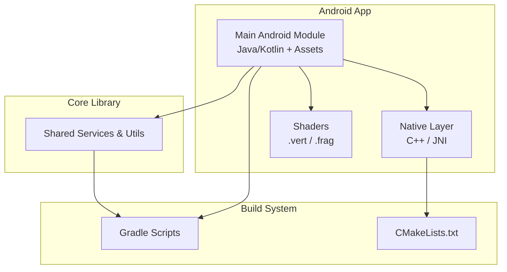
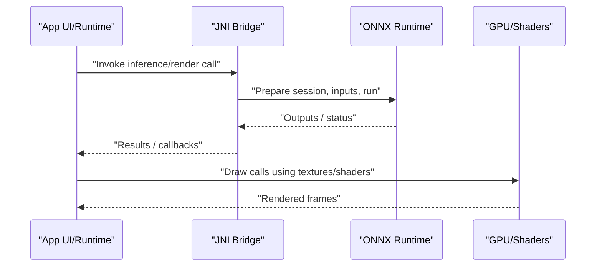
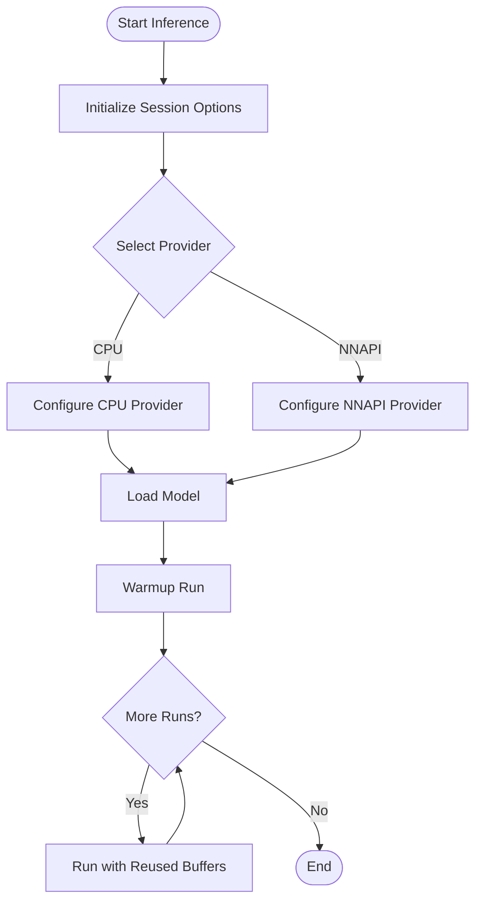
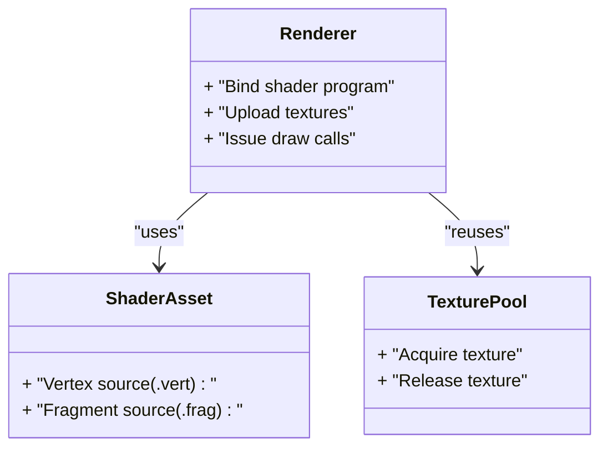
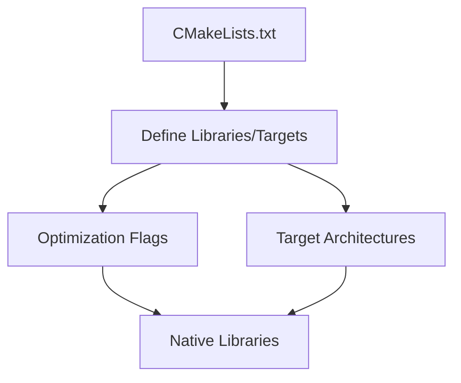
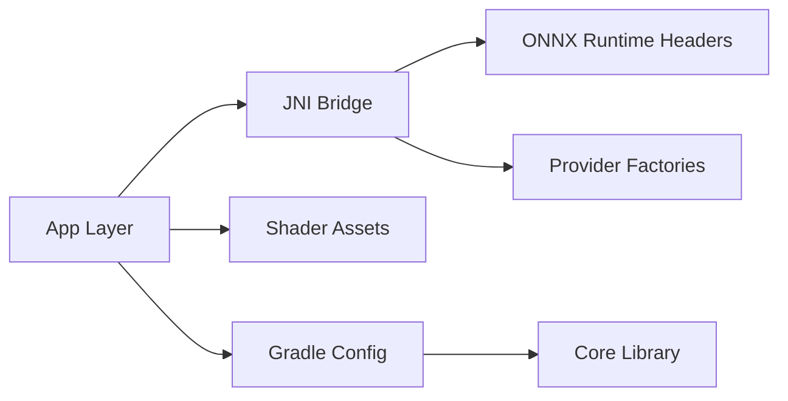

# Performance Optimization

<cite>
**Referenced Files in This Document**
- [README.md](file://README.md)
- [catroid/src/main/cpp/CMakeLists.txt](file://catroid/src/main/cpp/CMakeLists.txt)
- [catroid/src/main/cpp/onnxruntime_c_api.h](file://catroid/src/main/cpp/onnxruntime_c_api.h)
- [catroid/src/main/cpp/onnxruntime_cxx_api.h](file://catroid/src/main/cpp/onnxruntime_cxx_api.h)
- [catroid/src/main/cpp/ai_agent_jni.cpp](file://catroid/src/main/cpp/ai_agent_jni.cpp)
- [catroid/src/main/cpp/cpu_provider_factory.h](file://catroid/src/main/cpp/cpu_provider_factory.h)
- [catroid/src/main/cpp/nnapi_provider_factory.h](file://catroid/src/main/cpp/nnapi_provider_factory.h)
- [catroid/src/main/assets/shaders/vnc_shader.vert](file://catroid/src/main/assets/shaders/vnc_shader.vert)
- [catroid/src/main/assets/shaders/vnc_shader.frag](file://catroid/src/main/assets/shaders/vnc_shader.frag)
- [core/build.gradle](file://core/build.gradle)
- [build.gradle](file://build.gradle)
- [gradle.properties](file://gradle.properties)
</cite>

## Table of Contents
1. Introduction
2. Project Structure
3. Core Components
4. Architecture Overview
5. Detailed Component Analysis
6. Dependency Analysis
7. Performance Considerations
8. Troubleshooting Guide
9. Conclusion
10. Appendices

## Introduction
This document provides a comprehensive performance optimization guide for NewCatroid, focusing on profiling techniques (Android Profiler), memory leak detection (LeakCanary), CPU/GPU bottleneck identification, rendering optimizations (sprite batching, texture atlasing, efficient asset loading), memory management and garbage collection tuning, resource pooling patterns, native code optimization for C++ components, ONNX runtime performance tuning, multi-threading strategies, benchmarking methodologies, and continuous performance monitoring setup. It references concrete parts of the repository to ground recommendations in actual implementation points.

## Project Structure
NewCatroid is an Android application with:
- A main Android module containing Java/Kotlin UI and runtime logic, assets (including shaders), and native C++ code under src/main/cpp.
- A core library module providing shared services and utilities.
- Desktop runtime support for development and testing.
- Build configuration via Gradle and CMake for native components.

**Diagram sources**
- [catroid/src/main/cpp/CMakeLists.txt](file://catroid/src/main/cpp/CMakeLists.txt)
- [catroid/src/main/assets/shaders/vnc_shader.vert](file://catroid/src/main/assets/shaders/vnc_shader.vert)
- [catroid/src/main/assets/shaders/vnc_shader.frag](file://catroid/src/main/assets/shaders/vnc_shader.frag)
- [core/build.gradle](file://core/build.gradle)
- [build.gradle](file://build.gradle)

**Section sources**
- [README.md](file://README.md)
- [build.gradle](file://build.gradle)
- [core/build.gradle](file://core/build.gradle)

## Core Components
Key areas relevant to performance:
- Native AI inference integration via ONNX Runtime through JNI.
- GPU shader usage for rendering effects.
- Build-time configuration for native libraries and dependencies.

Highlights:
- ONNX Runtime headers indicate use of the C/C++ API for model execution.
- JNI entry points bridge Java/Kotlin to native inference code.
- Shaders are included as assets for GPU-accelerated rendering paths.

**Section sources**
- [catroid/src/main/cpp/onnxruntime_c_api.h](file://catroid/src/main/cpp/onnxruntime_c_api.h)
- [catroid/src/main/cpp/onnxruntime_cxx_api.h](file://catroid/src/main/cpp/onnxruntime_cxx_api.h)
- [catroid/src/main/cpp/ai_agent_jni.cpp](file://catroid/src/main/cpp/ai_agent_jni.cpp)
- [catroid/src/main/assets/shaders/vnc_shader.vert](file://catroid/src/main/assets/shaders/vnc_shader.vert)
- [catroid/src/main/assets/shaders/vnc_shader.frag](file://catroid/src/main/assets/shaders/vnc_shader.frag)

## Architecture Overview
The performance-critical path typically flows from UI/runtime into native inference or GPU rendering. The following diagram maps the high-level interactions between app layers, native code, and build artifacts.

**Diagram sources**
- [catroid/src/main/cpp/ai_agent_jni.cpp](file://catroid/src/main/cpp/ai_agent_jni.cpp)
- [catroid/src/main/cpp/onnxruntime_cxx_api.h](file://catroid/src/main/cpp/onnxruntime_cxx_api.h)
- [catroid/src/main/assets/shaders/vnc_shader.vert](file://catroid/src/main/assets/shaders/vnc_shader.vert)
- [catroid/src/main/assets/shaders/vnc_shader.frag](file://catroid/src/main/assets/shaders/vnc_shader.frag)

## Detailed Component Analysis

### ONNX Runtime Integration and Tuning
- Use the C/C++ API to configure providers (CPU, NNAPI) and session options for performance.
- Prefer pre-warming sessions and reusing input/output buffers to reduce allocations.
- Batch operations where possible and avoid frequent session reloads.

**Diagram sources**
- [catroid/src/main/cpp/onnxruntime_c_api.h](file://catroid/src/main/cpp/onnxruntime_c_api.h)
- [catroid/src/main/cpp/onnxruntime_cxx_api.h](file://catroid/src/main/cpp/onnxruntime_cxx_api.h)
- [catroid/src/main/cpp/ai_agent_jni.cpp](file://catroid/src/main/cpp/ai_agent_jni.cpp)
- [catroid/src/main/cpp/cpu_provider_factory.h](file://catroid/src/main/cpp/cpu_provider_factory.h)
- [catroid/src/main/cpp/nnapi_provider_factory.h](file://catroid/src/main/cpp/nnapi_provider_factory.h)

**Section sources**
- [catroid/src/main/cpp/onnxruntime_c_api.h](file://catroid/src/main/cpp/onnxruntime_c_api.h)
- [catroid/src/main/cpp/onnxruntime_cxx_api.h](file://catroid/src/main/cpp/onnxruntime_cxx_api.h)
- [catroid/src/main/cpp/ai_agent_jni.cpp](file://catroid/src/main/cpp/ai_agent_jni.cpp)
- [catroid/src/main/cpp/cpu_provider_factory.h](file://catroid/src/main/cpp/cpu_provider_factory.h)
- [catroid/src/main/cpp/nnapi_provider_factory.h](file://catroid/src/main/cpp/nnapi_provider_factory.h)

### Rendering and Shader Usage
- Shaders are packaged as assets and used by the renderer for GPU-accelerated effects.
- Optimize draw calls by minimizing state changes and combining geometry where possible.
- Ensure textures are appropriately sized and compressed to reduce bandwidth and memory pressure.

**Diagram sources**
- [catroid/src/main/assets/shaders/vnc_shader.vert](file://catroid/src/main/assets/shaders/vnc_shader.vert)
- [catroid/src/main/assets/shaders/vnc_shader.frag](file://catroid/src/main/assets/shaders/vnc_shader.frag)

**Section sources**
- [catroid/src/main/assets/shaders/vnc_shader.vert](file://catroid/src/main/assets/shaders/vnc_shader.vert)
- [catroid/src/main/assets/shaders/vnc_shader.frag](file://catroid/src/main/assets/shaders/vnc_shader.frag)

### Native Build Configuration
- CMake defines how native modules are compiled and linked.
- Ensure appropriate ABIs are built and that flags enable optimizations.

**Diagram sources**
- [catroid/src/main/cpp/CMakeLists.txt](file://catroid/src/main/cpp/CMakeLists.txt)

**Section sources**
- [catroid/src/main/cpp/CMakeLists.txt](file://catroid/src/main/cpp/CMakeLists.txt)

## Dependency Analysis
High-level dependency relationships among key performance-related components:

**Diagram sources**
- [catroid/src/main/cpp/ai_agent_jni.cpp](file://catroid/src/main/cpp/ai_agent_jni.cpp)
- [catroid/src/main/cpp/onnxruntime_cxx_api.h](file://catroid/src/main/cpp/onnxruntime_cxx_api.h)
- [catroid/src/main/cpp/cpu_provider_factory.h](file://catroid/src/main/cpp/cpu_provider_factory.h)
- [catroid/src/main/cpp/nnapi_provider_factory.h](file://catroid/src/main/cpp/nnapi_provider_factory.h)
- [catroid/src/main/assets/shaders/vnc_shader.vert](file://catroid/src/main/assets/shaders/vnc_shader.vert)
- [catroid/src/main/assets/shaders/vnc_shader.frag](file://catroid/src/main/assets/shaders/vnc_shader.frag)
- [core/build.gradle](file://core/build.gradle)
- [build.gradle](file://build.gradle)

**Section sources**
- [build.gradle](file://build.gradle)
- [core/build.gradle](file://core/build.gradle)

## Performance Considerations

### Profiling Techniques with Android Profiler
- Use CPU Profiler to identify hotspots in both Java/Kotlin and native code.
- Inspect Memory Profiler for allocation spikes and GC pressure; correlate with frame drops.
- Use GPU Profiler to analyze draw calls, overdraw, and shader complexity.
- Capture traces during representative workloads (e.g., heavy scenes, AI inference).

[No sources needed since this section provides general guidance]

### Memory Leak Detection with LeakCanary
- Integrate LeakCanary in debug builds to detect retained objects.
- Focus on long-lived contexts, static references, and listeners not unregistered.
- Validate after major refactors and when introducing new global caches.

[No sources needed since this section provides general guidance]

### CPU/GPU Bottleneck Identification
- CPU: Profile native inference loops, data marshaling across JNI, and heavy computations.
- GPU: Monitor draw call count, texture size/format, and shader instruction counts.
- Reduce overdraw and unnecessary state changes; batch similar draw calls.

[No sources needed since this section provides general guidance]

### Rendering Optimization Strategies
- Sprite Batching: Group sprites sharing the same material/textures to minimize state changes.
- Texture Atlasing: Combine small textures into larger atlases to reduce texture binds and improve cache locality.
- Efficient Asset Loading: Preload critical assets off the main thread; use streaming for large assets; compress textures appropriately.

[No sources needed since this section provides general guidance]

### Memory Management Best Practices
- Avoid excessive object creation in tight loops; reuse buffers and objects.
- Prefer primitive arrays and direct buffers for interop with native code.
- Implement resource pools for frequently allocated/deallocated objects (textures, meshes, inference buffers).

[No sources needed since this section provides general guidance]

### Garbage Collection Tuning
- Minimize short-lived allocations in hot paths to reduce GC pauses.
- Use object pools and buffer reuse to lower allocation churn.
- Profile GC frequency and pause times alongside frame pacing.

[No sources needed since this section provides general guidance]

### Resource Pooling Patterns
- Maintain pools for textures, meshes, and inference I/O buffers.
- Provide acquire/release APIs with clear ownership semantics.
- Size pools based on peak observed usage to avoid contention.

[No sources needed since this section provides general guidance]

### Native Code Optimization for C++ Components
- Enable compiler optimizations and link-time optimization where safe.
- Use SIMD/vectorization hints where applicable.
- Profile with perf/Native Stack Traces to find hotspots.
- Keep JNI calls minimal; batch data transfers.

**Section sources**
- [catroid/src/main/cpp/CMakeLists.txt](file://catroid/src/main/cpp/CMakeLists.txt)

### ONNX Runtime Performance Tuning
- Configure provider selection (CPU vs NNAPI) based on device capabilities.
- Pre-warm models and reuse sessions/buffers.
- Tune session options (execution modes, intra-op parallelism) per device profile.
- Validate numerical accuracy after enabling optimizations.

**Section sources**
- [catroid/src/main/cpp/onnxruntime_c_api.h](file://catroid/src/main/cpp/onnxruntime_c_api.h)
- [catroid/src/main/cpp/onnxruntime_cxx_api.h](file://catroid/src/main/cpp/onnxruntime_cxx_api.h)
- [catroid/src/main/cpp/ai_agent_jni.cpp](file://catroid/src/main/cpp/ai_agent_jni.cpp)
- [catroid/src/main/cpp/cpu_provider_factory.h](file://catroid/src/main/cpp/cpu_provider_factory.h)
- [catroid/src/main/cpp/nnapi_provider_factory.h](file://catroid/src/main/cpp/nnapi_provider_factory.h)

### Multi-Threading Strategies
- Offload heavy tasks (asset decoding, preprocessing) to background threads.
- Use thread-safe queues to pass data between producer/consumer stages.
- Avoid blocking the main thread; ensure timely updates to UI and render loop.

[No sources needed since this section provides general guidance]

### Benchmarking Methodologies
- Define stable test scenarios (scene complexity, model sizes).
- Measure FPS, latency, memory footprint, and CPU/GPU utilization.
- Automate runs on representative devices and track regressions.

[No sources needed since this section provides general guidance]

### Continuous Performance Monitoring Setup
- Integrate performance tests into CI pipelines.
- Record metrics (FPS, allocations, inference time) and alert on thresholds.
- Compare against baselines to catch regressions early.

[No sources needed since this section provides general guidance]

## Troubleshooting Guide
Common issues and remedies:
- High GC pauses: Identify allocation hotspots in profiler; introduce pooling and reuse buffers.
- Slow inference: Check provider selection and warm-up; reduce data copies across JNI.
- Frame drops: Analyze GPU profiler for overdraw and expensive shaders; optimize draw batching.
- Memory leaks: Use LeakCanary reports to fix retained references; validate lifecycle handling.

[No sources needed since this section provides general guidance]

## Conclusion
By systematically profiling, optimizing rendering and native paths, managing memory carefully, and integrating continuous performance checks, NewCatroid can achieve smoother gameplay and responsive AI features. Focus on batching, atlasing, buffer reuse, and ONNX Runtime tuning while validating improvements with robust benchmarks.

[No sources needed since this section summarizes without analyzing specific files]

## Appendices

### Build and Gradle Notes
- Review Gradle scripts for module dependencies and optimization flags.
- Ensure native ABIs match target devices and that CMake targets include optimization settings.

**Section sources**
- [build.gradle](file://build.gradle)
- [core/build.gradle](file://core/build.gradle)
- [gradle.properties](file://gradle.properties)