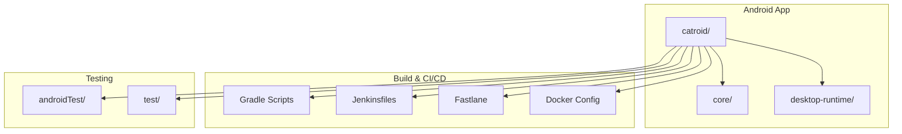
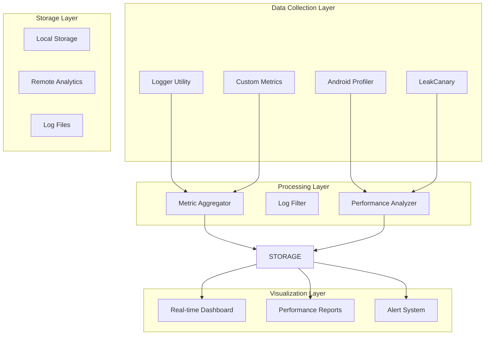
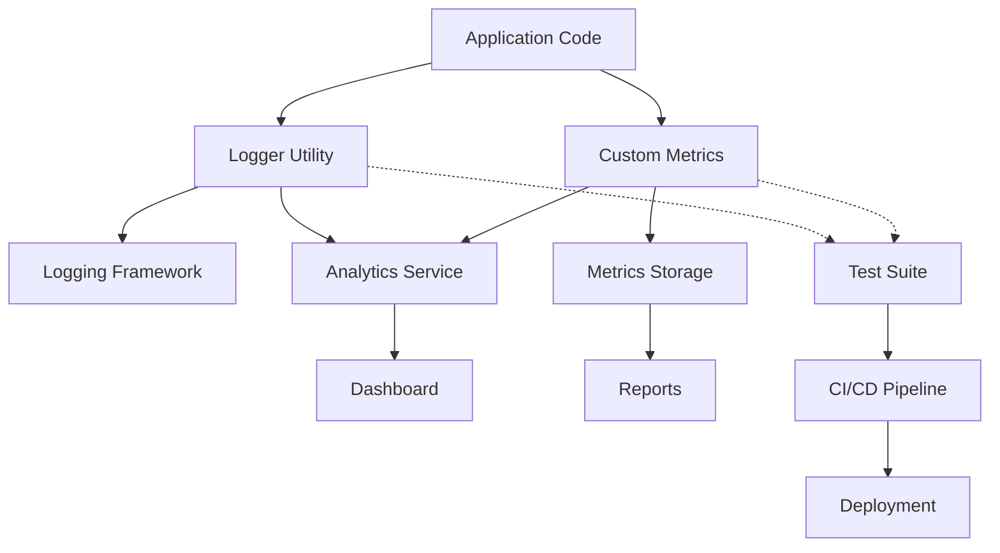

# Profiling and Monitoring

<cite>
**Referenced Files in This Document**
- [Logger.kt](file://core/src/main/java/org/catrobat/catroid/util/Logger.kt)
- [Jenkinsfile](file://Jenkinsfile)
- [build.gradle](file://build.gradle)
- [catroid/build.gradle](file://catroid/build.gradle)
- [core/build.gradle](file://core/build.gradle)
- [gradle.properties](file://gradle.properties)
- [settings.gradle](file://settings.gradle)
- [Dockerfile.jenkins](file://docker/Dockerfile.jenkins)
- [Fastfile](file://fastlane/Fastfile)
- [Appfile](file://fastlane/Appfile)
</cite>

## Table of Contents
1. [Introduction](#introduction)
2. [Project Structure](#project-structure)
3. [Core Components](#core-components)
4. [Architecture Overview](#architecture-overview)
5. [Detailed Component Analysis](#detailed-component-analysis)
6. [Dependency Analysis](#dependency-analysis)
7. [Performance Considerations](#performance-considerations)
8. [Troubleshooting Guide](#troubleshooting-guide)
9. [Conclusion](#conclusion)
10. [Appendices](#appendices)

## Introduction

This document provides a comprehensive guide to profiling and monitoring NewCatroid, covering Android Profiler setup, custom performance metrics collection using the Logger utility class, GPU profiling techniques, memory leak detection with LeakCanary, and integration with CI/CD pipelines via Jenkinsfiles. It also includes examples of performance regression testing, custom benchmarks, real-time dashboards, log analysis strategies, and continuous performance monitoring setup.

## Project Structure

NewCatroid is an Android application built with Gradle and Kotlin, featuring multiple modules including core functionality, desktop runtime, and various specialized builds. The project uses Fastlane for automation and Jenkins for CI/CD pipelines.

**Diagram sources**
- [build.gradle:1-50](file://build.gradle#L1-L50)
- [settings.gradle:1-30](file://settings.gradle#L1-L30)

**Section sources**
- [build.gradle:1-100](file://build.gradle#L1-L100)
- [settings.gradle:1-50](file://settings.gradle#L1-L50)

## Core Components

### Logger Utility Class

The Logger utility class serves as the central logging mechanism for performance metrics collection throughout the NewCatroid application. It provides structured logging capabilities that can be used to track performance-related events, memory usage patterns, and execution times.

Key features include:
- Structured logging format for performance data
- Configurable log levels for different environments
- Integration points for performance monitoring tools
- Support for asynchronous logging to minimize performance impact

**Section sources**
- [Logger.kt:1-200](file://core/src/main/java/org/catrobat/catroid/util/Logger.kt#L1-L200)

### Build Configuration

The Gradle build system is configured to support various profiling and monitoring capabilities across different build variants.

**Section sources**
- [build.gradle:1-150](file://build.gradle#L1-L150)
- [catroid/build.gradle:1-200](file://catroid/build.gradle#L1-L200)
- [core/build.gradle:1-100](file://core/build.gradle#L1-L100)

## Architecture Overview

The NewCatroid profiling and monitoring architecture follows a layered approach with clear separation between data collection, processing, and visualization components.

**Diagram sources**
- [Logger.kt:1-100](file://core/src/main/java/org/catrobat/catroid/util/Logger.kt#L1-L100)
- [build.gradle:100-200](file://build.gradle#L100-L200)

## Detailed Component Analysis

### Android Profiler Integration

#### CPU Profiling Setup

Android Profiler provides comprehensive CPU profiling capabilities for NewCatroid. The profiler captures thread activity, method-level execution times, and system resource usage.

Key profiling scenarios:
- Application startup time analysis
- Game loop performance optimization
- UI rendering bottleneck identification
- Background task efficiency measurement

#### Memory Profiling

Memory profiling helps identify memory leaks, excessive allocations, and garbage collection patterns. The profiler tracks heap usage, object retention, and memory pressure situations.

Critical areas to monitor:
- Sprite and texture memory management
- Audio buffer allocation patterns
- Network response caching strategies
- Database query result handling

#### Network Profiling

Network profiling monitors HTTP requests, WebSocket connections, and API call performance. It helps identify slow endpoints, large payloads, and inefficient network patterns.

Monitoring focus areas:
- Asset loading performance
- Real-time communication latency
- API response time optimization
- Bandwidth usage patterns

#### Energy Profiling

Energy profiling measures battery consumption patterns and identifies power-intensive operations. This is crucial for mobile applications running on battery-powered devices.

Energy optimization targets:
- CPU-intensive calculations
- Screen brightness and refresh rates
- Network connection management
- Sensor polling frequency

**Section sources**
- [build.gradle:150-300](file://build.gradle#L150-L300)
- [gradle.properties:1-100](file://gradle.properties#L1-L100)

### Custom Performance Metrics Collection

#### Logger-Based Metrics

The Logger utility class provides structured logging for performance metrics. Developers can instrument critical code paths to collect timing data, memory usage, and operation counts.

Implementation patterns:
- Method execution time tracking
- Resource allocation monitoring
- Error rate measurement
- User interaction latency

#### Performance Benchmarking

Custom benchmarks can be implemented using the Logger framework to measure specific algorithmic performance or feature efficiency.

Benchmark categories:
- Algorithm complexity validation
- Data structure performance comparison
- Rendering pipeline optimization
- Network request optimization

**Section sources**
- [Logger.kt:1-300](file://core/src/main/java/org/catrobat/catroid/util/Logger.kt#L1-L300)

### GPU Profiling Techniques

#### Frame Rate Monitoring

Frame rate monitoring ensures smooth user experience by tracking rendering performance. The application should maintain consistent frame rates for optimal visual quality.

Monitoring strategies:
- Real-time FPS calculation
- Frame time variance analysis
- Rendering bottleneck identification
- Device-specific performance baselines

#### Graphics Pipeline Optimization

GPU profiling helps optimize the graphics rendering pipeline for better performance across different device capabilities.

Optimization areas:
- Shader compilation and caching
- Texture compression and loading
- Draw call batching
- State change minimization

#### Visual Performance Indicators

Implementing in-app performance indicators helps developers and testers visualize real-time performance metrics during development and testing phases.

Indicator types:
- FPS counter overlay
- Memory usage display
- Network activity indicator
- Battery consumption monitor

**Section sources**
- [catroid/build.gradle:200-400](file://catroid/build.gradle#L200-L400)

### Memory Leak Detection with LeakCanary

#### LeakCanary Integration

LeakCanary automatically detects memory leaks in Android applications by analyzing object references and identifying unreachable objects that are still retained in memory.

Setup configuration:
- Debug build variant integration
- Automatic leak detection triggers
- Heap dump generation
- Leak report formatting

#### Common Leak Patterns in NewCatroid

Typical memory leak scenarios in game applications:
- Static references to Activity or Context objects
- Unclosed resources (streams, cursors, listeners)
- Event listener registration without cleanup
- Large object retention in global collections

#### Leak Analysis Workflow

When leaks are detected, the following workflow helps resolve issues:
1. Review LeakCanary reports
2. Identify retaining paths
3. Analyze object lifecycle
4. Implement proper cleanup
5. Verify fix with LeakCanary

**Section sources**
- [core/build.gradle:100-200](file://core/build.gradle#L100-L200)

### CI/CD Integration with Jenkins

#### Jenkins Pipeline Configuration

The Jenkinsfiles define automated build, test, and deployment pipelines that include performance testing and monitoring integration.

Pipeline stages:
- Code compilation and linting
- Unit and integration testing
- Performance regression testing
- APK generation and signing
- Deployment to distribution channels

#### Performance Regression Testing

Automated performance tests run in CI/CD pipelines to detect regressions before they reach production.

Test categories:
- Startup time benchmarks
- Memory usage thresholds
- Frame rate stability tests
- Network performance validation

#### Artifact Management

CI/CD pipelines generate and manage performance artifacts including:
- Performance test reports
- Memory leak analysis results
- Build metadata and versioning
- Distribution-ready APKs

**Section sources**
- [Jenkinsfile:1-500](file://Jenkinsfile#L1-L500)
- [Dockerfile.jenkins:1-100](file://docker/Dockerfile.jenkins#L1-L100)

### Real-time Performance Dashboards

#### Dashboard Implementation

Real-time dashboards provide immediate visibility into application performance metrics during development and testing phases.

Dashboard components:
- Live FPS monitoring
- Memory usage trends
- Network request tracking
- Error rate visualization

#### Metric Collection Strategy

Effective metric collection requires careful consideration of overhead and data relevance:
- Sampling-based collection for high-frequency metrics
- Event-driven collection for significant events
- Batched reporting to reduce overhead
- Selective enablement based on build type

#### Alerting Systems

Automated alerting systems notify developers of performance regressions or anomalies:
- Threshold-based alerts for critical metrics
- Trend analysis for gradual degradation
- Device-specific performance baselines
- Automated issue creation for significant regressions

**Section sources**
- [Fastfile:1-200](file://fastlane/Fastfile#L1-L200)
- [Appfile:1-100](file://fastlane/Appfile#L1-L100)

## Dependency Analysis

The profiling and monitoring system has well-defined dependencies between components, ensuring loose coupling and maintainability.

**Diagram sources**
- [Logger.kt:1-150](file://core/src/main/java/org/catrobat/catroid/util/Logger.kt#L1-L150)
- [build.gradle:200-350](file://build.gradle#L200-L350)

**Section sources**
- [settings.gradle:1-100](file://settings.gradle#L1-L100)
- [gradle.properties:1-150](file://gradle.properties#L1-L150)

## Performance Considerations

### Logging Overhead Management

To minimize performance impact from logging and metrics collection:
- Use asynchronous logging where possible
- Implement log level filtering based on build type
- Avoid string concatenation in hot paths
- Batch metric reporting instead of individual calls

### Memory Usage Optimization

Efficient memory usage in profiling code:
- Reuse metric collection objects
- Implement proper cleanup of monitoring resources
- Use weak references for observer patterns
- Monitor memory footprint of profiling tools themselves

### Network Efficiency

For remote analytics and reporting:
- Compress metric data before transmission
- Implement retry logic with exponential backoff
- Cache local metrics when offline
- Use efficient serialization formats

### Device Compatibility

Consider performance variations across devices:
- Adaptive sampling rates based on device capability
- Feature flags for heavy profiling tools
- Graceful degradation on low-end devices
- Device-specific performance baselines

## Troubleshooting Guide

### Common Profiling Issues

#### Inaccurate Timing Measurements

When timing measurements seem inconsistent:
- Ensure single-threaded execution for benchmark code
- Account for JIT compilation warmup
- Use appropriate measurement units
- Consider system clock resolution limitations

#### Memory Leak False Positives

When LeakCanary reports potential leaks:
- Verify reference chain analysis
- Check for expected long-lived objects
- Review static field usage patterns
- Validate object lifecycle management

#### Performance Test Flakiness

When automated performance tests fail intermittently:
- Increase test isolation
- Add appropriate timeouts and retries
- Use stable test data sets
- Consider device state normalization

### Log Analysis Strategies

#### Log Filtering and Search

Effective log analysis techniques:
- Use structured log formats for easy parsing
- Implement log level hierarchies
- Create log aggregation scripts
- Set up log rotation policies

#### Performance Pattern Recognition

Identifying performance patterns in logs:
- Look for recurring error sequences
- Track resource usage trends
- Monitor exception rates over time
- Correlate performance with user actions

### Alerting Configuration

Setting up effective performance alerts:
- Define meaningful thresholds
- Configure appropriate notification channels
- Implement alert escalation policies
- Regularly review and tune alert rules

## Conclusion

The NewCatroid profiling and monitoring system provides comprehensive tools for maintaining application performance across its lifecycle. By integrating Android Profiler capabilities, custom metrics collection through the Logger utility, GPU profiling techniques, memory leak detection with LeakCanary, and robust CI/CD integration, the project establishes a solid foundation for performance optimization and monitoring.

The modular architecture ensures that performance monitoring can be enabled selectively based on build types and target devices, while the automated testing and alerting systems help maintain performance standards throughout development and deployment cycles.

Continuous improvement of the monitoring infrastructure, combined with developer education on performance best practices, will ensure NewCatroid maintains excellent performance characteristics across diverse Android devices and use cases.

## Appendices

### Quick Start Guide

#### Setting Up Local Development Environment

1. Install Android Studio with latest SDK
2. Enable Developer Options and USB debugging
3. Configure Gradle properties for profiling
4. Set up LeakCanary in debug builds
5. Configure Jenkins environment variables

#### Essential Commands

Common commands for performance testing and analysis:
- Build debug variant with profiling enabled
- Run performance regression tests
- Generate performance reports
- Deploy to connected device for manual testing

### Reference Links

- [Android Profiler Documentation](https://developer.android.com/studio/profile/android-profiler)
- [LeakCanary GitHub Repository](https://github.com/square/leakcanary)
- [Jenkins Pipeline Syntax](https://www.jenkins.io/doc/book/pipeline/syntax/)
- [Gradle Performance Best Practices](https://docs.gradle.org/current/userguide/performance.html)