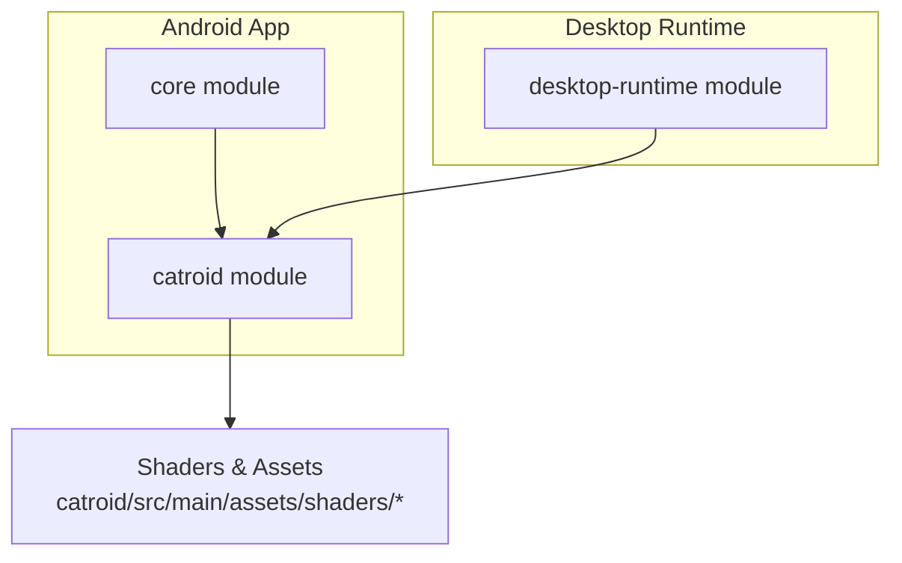
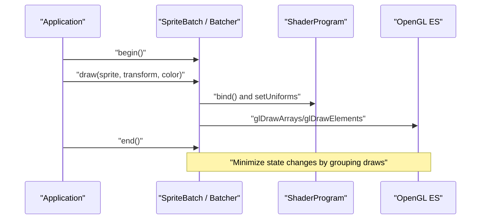
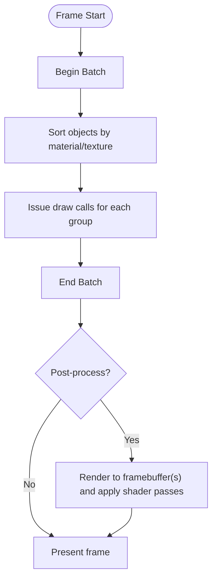
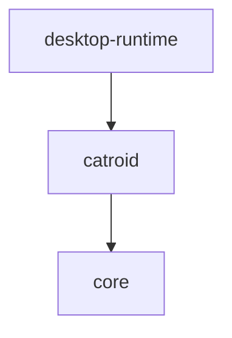

# Rendering Optimization

<cite>
**Referenced Files in This Document**
- [README.md](file://README.md)
- [build.gradle](file://build.gradle)
- [settings.gradle](file://settings.gradle)
- [core/build.gradle](file://core/build.gradle)
- [desktop-runtime/build.gradle](file://desktop-runtime/build.gradle)
- [catroid/src/main/assets/shaders/blur.frag](file://catroid/src/main/assets/shaders/blur.frag)
- [catroid/src/main/assets/shaders/blur.vert](file://catroid/src/main/assets/shaders/blur.vert)
- [catroid/src/main/assets/shaders/circle.frag](file://catroid/src/main/assets/shaders/circle.frag)
- [catroid/src/main/assets/shaders/circle.vert](file://catroid/src/main/assets/shaders/circle.vert)
- [catroid/src/main/assets/shaders/color.frag](file://catroid/src/main/assets/shaders/color.frag)
- [catroid/src/main/assets/shaders/color.vert](file://catroid/src/main/assets/shaders/color.vert)
- [catroid/src/main/assets/shaders/diffuse.frag](file://catroid/src/main/assets/shaders/diffuse.frag)
- [catroid/src/main/assets/shaders/diffuse.vert](file://catroid/src/main/assets/shaders/diffuse.vert)
- [catroid/src/main/assets/shaders/fill.frag](file://catroid/src/main/assets/shaders/fill.frag)
- [catroid/src/main/assets/shaders/fill.vert](file://catroid/src/main/assets/shaders/fill.vert)
- [catroid/src/main/assets/shaders/glow.frag](file://catroid/src/main/assets/shaders/glow.frag)
- [catroid/src/main/assets/shaders/glow.vert](file://catroid/src/main/assets/shaders/glow.vert)
- [catroid/src/main/assets/shaders/hsv.frag](file://catroid/src/main/assets/shaders/hsv.frag)
- [catroid/src/main/assets/shaders/hsv.vert](file://catroid/src/main/assets/shaders/hsv.vert)
- [catroid/src/main/assets/shaders/invert.frag](file://catroid/src/main/assets/shaders/invert.frag)
- [catroid/src/main/assets/shaders/invert.vert](file://catroid/src/main/assets/shaders/invert.vert)
- [catroid/src/main/assets/shaders/pixelate.frag](file://catroid/src/main/assets/shaders/pixelate.frag)
- [catroid/src/main/assets/shaders/pixelate.vert](file://catroid/src/main/assets/shaders/pixelate.vert)
- [catroid/src/main/assets/shaders/radialBlur.frag](file://catroid/src/main/assets/shaders/radialBlur.frag)
- [catroid/src/main/assets/shaders/radialBlur.vert](file://catroid/src/main/assets/shaders/radialBlur.vert)
- [catroid/src/main/assets/shaders/sprite.frag](file://catroid/src/main/assets/shaders/sprite.frag)
- [catroid/src/main/assets/shaders/sprite.vert](file://catroid/src/main/assets/shaders/sprite.vert)
- [catroid/src/main/assets/shaders/stroke.frag](file://catroid/src/main/assets/shaders/stroke.frag)
- [catroid/src/main/assets/shaders/stroke.vert](file://catroid/src/main/assets/shaders/stroke.vert)
- [catroid/src/main/assets/vnc_shader.frag](file://catroid/src/main/assets/vnc_shader.frag)
- [catroid/src/main/assets/vnc_shader.vert](file://catroid/src/main/assets/vnc_shader.vert)
</cite>

## Table of Contents
1. [Introduction](#introduction)
2. [Project Structure](#project-structure)
3. [Core Components](#core-components)
4. [Architecture Overview](#architecture-overview)
5. [Detailed Component Analysis](#detailed-component-analysis)
6. [Dependency Analysis](#dependency-analysis)
7. [Performance Considerations](#performance-considerations)
8. [Troubleshooting Guide](#troubleshooting-guide)
9. [Conclusion](#conclusion)
10. [Appendices](#appendices)

## Introduction
This document provides a comprehensive guide to rendering optimization for NewCatroid’s graphics pipeline, focusing on LibGDX-based rendering patterns, sprite batching strategies, texture management, shader optimization, GPU state minimization, and draw call reduction. It also covers multi-threaded rendering approaches, asynchronous asset loading, progressive rendering for large scenes, native OpenGL ES optimizations, custom shader development guidelines, and cross-platform considerations. Practical examples are referenced from the codebase via file paths and line ranges to help you locate relevant implementations.

## Project Structure
NewCatroid is an Android-first project with a desktop runtime module. The core game logic and assets (including shaders) reside under catroid, while shared runtime components live under core and desktop-runtime. Shaders used by the engine are packaged as assets under catroid/src/main/assets/shaders and additional VNC-related shaders under catroid/src/main/assets.

**Diagram sources**
- [build.gradle](file://build.gradle)
- [settings.gradle](file://settings.gradle)
- [core/build.gradle](file://core/build.gradle)
- [desktop-runtime/build.gradle](file://desktop-runtime/build.gradle)

**Section sources**
- [README.md](file://README.md)
- [build.gradle](file://build.gradle)
- [settings.gradle](file://settings.gradle)
- [core/build.gradle](file://core/build.gradle)
- [desktop-runtime/build.gradle](file://desktop-runtime/build.gradle)

## Core Components
- Shader assets: A set of vertex and fragment shaders for common effects (sprite, diffuse, color, fill, stroke, glow, blur, radial blur, pixelate, hsv, invert, circle). These are loaded at runtime and bound during rendering.
- VNC shaders: Custom shaders for remote screen capture/streaming use cases.
- Build configuration: Gradle files define modules and dependencies that include LibGDX and platform-specific integrations.

Key references:
- Sprite and effect shaders: [catroid/src/main/assets/shaders/sprite.frag](file://catroid/src/main/assets/shaders/sprite.frag), [catroid/src/main/assets/shaders/sprite.vert](file://catroid/src/main/assets/shaders/sprite.vert), [catroid/src/main/assets/shaders/diffuse.frag](file://catroid/src/main/assets/shaders/diffuse.frag), [catroid/src/main/assets/shaders/diffuse.vert](file://catroid/src/main/assets/shaders/diffuse.vert), [catroid/src/main/assets/shaders/color.frag](file://catroid/src/main/assets/shaders/color.frag), [catroid/src/main/assets/shaders/color.vert](file://catroid/src/main/assets/shaders/color.vert), [catroid/src/main/assets/shaders/fill.frag](file://catroid/src/main/assets/shaders/fill.frag), [catroid/src/main/assets/shaders/fill.vert](file://catroid/src/main/assets/shaders/fill.vert), [catroid/src/main/assets/shaders/stroke.frag](file://catroid/src/main/assets/shaders/stroke.frag), [catroid/src/main/assets/shaders/stroke.vert](file://catroid/src/main/assets/shaders/stroke.vert), [catroid/src/main/assets/shaders/glow.frag](file://catroid/src/main/assets/shaders/glow.frag), [catroid/src/main/assets/shaders/glow.vert](file://catroid/src/main/assets/shaders/glow.vert), [catroid/src/main/assets/shaders/blur.frag](file://catroid/src/main/assets/shaders/blur.frag), [catroid/src/main/assets/shaders/blur.vert](file://catroid/src/main/assets/shaders/blur.vert), [catroid/src/main/assets/shaders/radialBlur.frag](file://catroid/src/main/assets/shaders/radialBlur.frag), [catroid/src/main/assets/shaders/radialBlur.vert](file://catroid/src/main/assets/shaders/radialBlur.vert), [catroid/src/main/assets/shaders/pixelate.frag](file://catroid/src/main/assets/shaders/pixelate.frag), [catroid/src/main/assets/shaders/pixelate.vert](file://catroid/src/main/assets/shaders/pixelate.vert), [catroid/src/main/assets/shaders/hsv.frag](file://catroid/src/main/assets/shaders/hsv.frag), [catroid/src/main/assets/shaders/hsv.vert](file://catroid/src/main/assets/shaders/hsv.vert), [catroid/src/main/assets/shaders/invert.frag](file://catroid/src/main/assets/shaders/invert.frag), [catroid/src/main/assets/shaders/invert.vert](file://catroid/src/main/assets/shaders/invert.vert), [catroid/src/main/assets/shaders/circle.frag](file://catroid/src/main/assets/shaders/circle.frag), [catroid/src/main/assets/shaders/circle.vert](file://catroid/src/main/assets/shaders/circle.vert)
- VNC shaders: [catroid/src/main/assets/vnc_shader.frag](file://catroid/src/main/assets/vnc_shader.frag), [catroid/src/main/assets/vnc_shader.vert](file://catroid/src/main/assets/vnc_shader.vert)

**Section sources**
- [catroid/src/main/assets/shaders/sprite.frag](file://catroid/src/main/assets/shaders/sprite.frag)
- [catroid/src/main/assets/shaders/sprite.vert](file://catroid/src/main/assets/shaders/sprite.vert)
- [catroid/src/main/assets/shaders/diffuse.frag](file://catroid/src/main/assets/shaders/diffuse.frag)
- [catroid/src/main/assets/shaders/diffuse.vert](file://catroid/src/main/assets/shaders/diffuse.vert)
- [catroid/src/main/assets/shaders/color.frag](file://catroid/src/main/assets/shaders/color.frag)
- [catroid/src/main/assets/shaders/color.vert](file://catroid/src/main/assets/shaders/color.vert)
- [catroid/src/main/assets/shaders/fill.frag](file://catroid/src/main/assets/shaders/fill.frag)
- [catroid/src/main/assets/shaders/fill.vert](file://catroid/src/main/assets/shaders/fill.vert)
- [catroid/src/main/assets/shaders/stroke.frag](file://catroid/src/main/assets/shaders/stroke.frag)
- [catroid/src/main/assets/shaders/stroke.vert](file://catroid/src/main/assets/shaders/stroke.vert)
- [catroid/src/main/assets/shaders/glow.frag](file://catroid/src/main/assets/shaders/glow.frag)
- [catroid/src/main/assets/shaders/glow.vert](file://catroid/src/main/assets/shaders/glow.vert)
- [catroid/src/main/assets/shaders/blur.frag](file://catroid/src/main/assets/shaders/blur.frag)
- [catroid/src/main/assets/shaders/blur.vert](file://catroid/src/main/assets/shaders/blur.vert)
- [catroid/src/main/assets/shaders/radialBlur.frag](file://catroid/src/main/assets/shaders/radialBlur.frag)
- [catroid/src/main/assets/shaders/radialBlur.vert](file://catroid/src/main/assets/shaders/radialBlur.vert)
- [catroid/src/main/assets/shaders/pixelate.frag](file://catroid/src/main/assets/shaders/pixelate.frag)
- [catroid/src/main/assets/shaders/pixelate.vert](file://catroid/src/main/assets/shaders/pixelate.vert)
- [catroid/src/main/assets/shaders/hsv.frag](file://catroid/src/main/assets/shaders/hsv.frag)
- [catroid/src/main/assets/shaders/hsv.vert](file://catroid/src/main/assets/shaders/hsv.vert)
- [catroid/src/main/assets/shaders/invert.frag](file://catroid/src/main/assets/shaders/invert.frag)
- [catroid/src/main/assets/shaders/invert.vert](file://catroid/src/main/assets/shaders/invert.vert)
- [catroid/src/main/assets/shaders/circle.frag](file://catroid/src/main/assets/shaders/circle.frag)
- [catroid/src/main/assets/shaders/circle.vert](file://catroid/src/main/assets/shaders/circle.vert)
- [catroid/src/main/assets/vnc_shader.frag](file://catroid/src/main/assets/vnc_shader.frag)
- [catroid/src/main/assets/vnc_shader.vert](file://catroid/src/main/assets/vnc_shader.vert)

## Architecture Overview
The rendering architecture centers around LibGDX’s batcher and shader system. Typical flow:
- Prepare geometry (vertices, UVs, colors) into batches.
- Bind appropriate shader program and uniforms.
- Issue draw calls grouped by texture and shader to minimize state changes.
- For post-processing or special effects, render to offscreen framebuffers and apply shader passes.

[No sources needed since this diagram shows conceptual workflow, not actual code structure]

## Detailed Component Analysis

### Shader Asset Catalog and Usage Patterns
NewCatroid includes a rich set of shaders for sprites and visual effects. Each effect typically consists of a vertex and fragment pair. Common optimization targets include:
- Reducing texture lookups per pixel
- Avoiding branching in fragment shaders
- Using precomputed constants where possible
- Minimizing uniform updates across frames

Representative shader pairs:
- Sprite rendering: [catroid/src/main/assets/shaders/sprite.frag](file://catroid/src/main/assets/shaders/sprite.frag), [catroid/src/main/assets/shaders/sprite.vert](file://catroid/src/main/assets/shaders/sprite.vert)
- Diffuse lighting: [catroid/src/main/assets/shaders/diffuse.frag](file://catroid/src/main/assets/shaders/diffuse.frag), [catroid/src/main/assets/shaders/diffuse.vert](file://catroid/src/main/assets/shaders/diffuse.vert)
- Color manipulation: [catroid/src/main/assets/shaders/color.frag](file://catroid/src/main/assets/shaders/color.frag), [catroid/src/main/assets/shaders/color.vert](file://catroid/src/main/assets/shaders/color.vert)
- Fill and stroke primitives: [catroid/src/main/assets/shaders/fill.frag](file://catroid/src/main/assets/shaders/fill.frag), [catroid/src/main/assets/shaders/fill.vert](file://catroid/src/main/assets/shaders/fill.vert), [catroid/src/main/assets/shaders/stroke.frag](file://catroid/src/main/assets/shaders/stroke.frag), [catroid/src/main/assets/shaders/stroke.vert](file://catroid/src/main/assets/shaders/stroke.vert)
- Glow effect: [catroid/src/main/assets/shaders/glow.frag](file://catroid/src/main/assets/shaders/glow.frag), [catroid/src/main/assets/shaders/glow.vert](file://catroid/src/main/assets/shaders/glow.vert)
- Blur effects: [catroid/src/main/assets/shaders/blur.frag](file://catroid/src/main/assets/shaders/blur.frag), [catroid/src/main/assets/shaders/blur.vert](file://catroid/src/main/assets/shaders/blur.vert), [catroid/src/main/assets/shaders/radialBlur.frag](file://catroid/src/main/assets/shaders/radialBlur.frag), [catroid/src/main/assets/shaders/radialBlur.vert](file://catroid/src/main/assets/shaders/radialBlur.vert)
- Pixelation: [catroid/src/main/assets/shaders/pixelate.frag](file://catroid/src/main/assets/shaders/pixelate.frag), [catroid/src/main/assets/shaders/pixelate.vert](file://catroid/src/main/assets/shaders/pixelate.vert)
- HSV color space: [catroid/src/main/assets/shaders/hsv.frag](file://catroid/src/main/assets/shaders/hsv.frag), [catroid/src/main/assets/shaders/hsv.vert](file://catroid/src/main/assets/shaders/hsv.vert)
- Inversion: [catroid/src/main/assets/shaders/invert.frag](file://catroid/src/main/assets/shaders/invert.frag), [catroid/src/main/assets/shaders/invert.vert](file://catroid/src/main/assets/shaders/invert.vert)
- Circle primitive: [catroid/src/main/assets/shaders/circle.frag](file://catroid/src/main/assets/shaders/circle.frag), [catroid/src/main/assets/shaders/circle.vert](file://catroid/src/main/assets/shaders/circle.vert)
- VNC streaming: [catroid/src/main/assets/vnc_shader.frag](file://catroid/src/main/assets/vnc_shader.frag), [catroid/src/main/assets/vnc_shader.vert](file://catroid/src/main/assets/vnc_shader.vert)

Optimization tips:
- Prefer simple math in fragment shaders; avoid expensive functions like pow or log when possible.
- Use texture atlases to reduce texture binds and improve cache locality.
- Batch similar materials together to minimize shader switches.

**Section sources**
- [catroid/src/main/assets/shaders/sprite.frag](file://catroid/src/main/assets/shaders/sprite.frag)
- [catroid/src/main/assets/shaders/sprite.vert](file://catroid/src/main/assets/shaders/sprite.vert)
- [catroid/src/main/assets/shaders/diffuse.frag](file://catroid/src/main/assets/shaders/diffuse.frag)
- [catroid/src/main/assets/shaders/diffuse.vert](file://catroid/src/main/assets/shaders/diffuse.vert)
- [catroid/src/main/assets/shaders/color.frag](file://catroid/src/main/assets/shaders/color.frag)
- [catroid/src/main/assets/shaders/color.vert](file://catroid/src/main/assets/shaders/color.vert)
- [catroid/src/main/assets/shaders/fill.frag](file://catroid/src/main/assets/shaders/fill.frag)
- [catroid/src/main/assets/shaders/fill.vert](file://catroid/src/main/assets/shaders/fill.vert)
- [catroid/src/main/assets/shaders/stroke.frag](file://catroid/src/main/assets/shaders/stroke.frag)
- [catroid/src/main/assets/shaders/stroke.vert](file://catroid/src/main/assets/shaders/stroke.vert)
- [catroid/src/main/assets/shaders/glow.frag](file://catroid/src/main/assets/shaders/glow.frag)
- [catroid/src/main/assets/shaders/glow.vert](file://catroid/src/main/assets/shaders/glow.vert)
- [catroid/src/main/assets/shaders/blur.frag](file://catroid/src/main/assets/shaders/blur.frag)
- [catroid/src/main/assets/shaders/blur.vert](file://catroid/src/main/assets/shaders/blur.vert)
- [catroid/src/main/assets/shaders/radialBlur.frag](file://catroid/src/main/assets/shaders/radialBlur.frag)
- [catroid/src/main/assets/shaders/radialBlur.vert](file://catroid/src/main/assets/shaders/radialBlur.vert)
- [catroid/src/main/assets/shaders/pixelate.frag](file://catroid/src/main/assets/shaders/pixelate.frag)
- [catroid/src/main/assets/shaders/pixelate.vert](file://catroid/src/main/assets/shaders/pixelate.vert)
- [catroid/src/main/assets/shaders/hsv.frag](file://catroid/src/main/assets/shaders/hsv.frag)
- [catroid/src/main/assets/shaders/hsv.vert](file://catroid/src/main/assets/shaders/hsv.vert)
- [catroid/src/main/assets/shaders/invert.frag](file://catroid/src/main/assets/shaders/invert.frag)
- [catroid/src/main/assets/shaders/invert.vert](file://catroid/src/main/assets/shaders/invert.vert)
- [catroid/src/main/assets/shaders/circle.frag](file://catroid/src/main/assets/shaders/circle.frag)
- [catroid/src/main/assets/shaders/circle.vert](file://catroid/src/main/assets/shaders/circle.vert)
- [catroid/src/main/assets/vnc_shader.frag](file://catroid/src/main/assets/vnc_shader.frag)
- [catroid/src/main/assets/vnc_shader.vert](file://catroid/src/main/assets/vnc_shader.vert)

### Draw Call Reduction and Batching Strategy
Best practices:
- Group draw calls by shader and texture to reduce state changes.
- Use texture atlases to pack multiple small textures into one larger texture.
- Avoid frequent shader uniform updates; batch updates per frame or per object group.
- Prefer instanced rendering where supported by the backend.

Conceptual sequence:

[No sources needed since this diagram shows conceptual workflow, not actual code structure]

### Texture Management Best Practices
- Use power-of-two or NPOT textures appropriately based on device capabilities.
- Monitor VRAM usage; unload unused textures and reuse atlases.
- Compress textures using formats suitable for mobile GPUs (e.g., ETC2, ASTC).
- Avoid dynamic texture uploads every frame; prefer static atlases or minimal updates.

[No sources needed since this section provides general guidance]

### Shader Optimization Techniques
- Minimize texture samples; reuse computed values.
- Avoid control flow divergence in fragment shaders.
- Precompute constants and pass them as uniforms.
- Use simpler blending modes when possible.

Examples of effect shaders to review:
- Glow: [catroid/src/main/assets/shaders/glow.frag](file://catroid/src/main/assets/shaders/glow.frag), [catroid/src/main/assets/shaders/glow.vert](file://catroid/src/main/assets/shaders/glow.vert)
- Blur: [catroid/src/main/assets/shaders/blur.frag](file://catroid/src/main/assets/shaders/blur.frag), [catroid/src/main/assets/shaders/blur.vert](file://catroid/src/main/assets/shaders/blur.vert)
- Radial blur: [catroid/src/main/assets/shaders/radialBlur.frag](file://catroid/src/main/assets/shaders/radialBlur.frag), [catroid/src/main/assets/shaders/radialBlur.vert](file://catroid/src/main/assets/shaders/radialBlur.vert)
- Pixelate: [catroid/src/main/assets/shaders/pixelate.frag](file://catroid/src/main/assets/shaders/pixelate.frag), [catroid/src/main/assets/shaders/pixelate.vert](file://catroid/src/main/assets/shaders/pixelate.vert)
- HSV: [catroid/src/main/assets/shaders/hsv.frag](file://catroid/src/main/assets/shaders/hsv.frag), [catroid/src/main/assets/shaders/hsv.vert](file://catroid/src/main/assets/shaders/hsv.vert)
- Invert: [catroid/src/main/assets/shaders/invert.frag](file://catroid/src/main/assets/shaders/invert.frag), [catroid/src/main/assets/shaders/invert.vert](file://catroid/src/main/assets/shaders/invert.vert)
- Circle: [catroid/src/main/assets/shaders/circle.frag](file://catroid/src/main/assets/shaders/circle.frag), [catroid/src/main/assets/shaders/circle.vert](file://catroid/src/main/assets/shaders/circle.vert)

**Section sources**
- [catroid/src/main/assets/shaders/glow.frag](file://catroid/src/main/assets/shaders/glow.frag)
- [catroid/src/main/assets/shaders/glow.vert](file://catroid/src/main/assets/shaders/glow.vert)
- [catroid/src/main/assets/shaders/blur.frag](file://catroid/src/main/assets/shaders/blur.frag)
- [catroid/src/main/assets/shaders/blur.vert](file://catroid/src/main/assets/shaders/blur.vert)
- [catroid/src/main/assets/shaders/radialBlur.frag](file://catroid/src/main/assets/shaders/radialBlur.frag)
- [catroid/src/main/assets/shaders/radialBlur.vert](file://catroid/src/main/assets/shaders/radialBlur.vert)
- [catroid/src/main/assets/shaders/pixelate.frag](file://catroid/src/main/assets/shaders/pixelate.frag)
- [catroid/src/main/assets/shaders/pixelate.vert](file://catroid/src/main/assets/shaders/pixelate.vert)
- [catroid/src/main/assets/shaders/hsv.frag](file://catroid/src/main/assets/shaders/hsv.frag)
- [catroid/src/main/assets/shaders/hsv.vert](file://catroid/src/main/assets/shaders/hsv.vert)
- [catroid/src/main/assets/shaders/invert.frag](file://catroid/src/main/assets/shaders/invert.frag)
- [catroid/src/main/assets/shaders/invert.vert](file://catroid/src/main/assets/shaders/invert.vert)
- [catroid/src/main/assets/shaders/circle.frag](file://catroid/src/main/assets/shaders/circle.frag)
- [catroid/src/main/assets/shaders/circle.vert](file://catroid/src/main/assets/shaders/circle.vert)

### GPU State Minimization
- Keep blend states consistent across batches.
- Avoid toggling depth testing frequently; batch opaque and transparent separately.
- Reuse shader programs and update only necessary uniforms.

[No sources needed since this section provides general guidance]

### Multi-threaded Rendering Approaches
- Offload heavy computations (e.g., procedural generation, pathfinding) to background threads.
- Keep GPU-bound work on the main thread to avoid synchronization overhead.
- Use job queues to prepare geometry and buffers ahead of time.

[No sources needed since this section provides general guidance]

### Asynchronous Asset Loading
- Load textures and shaders asynchronously during scene transitions or initial load screens.
- Stream large assets progressively to maintain responsiveness.
- Cache loaded assets to avoid repeated I/O.

[No sources needed since this section provides general guidance]

### Progressive Rendering for Large Scenes
- Implement level-of-detail (LOD) for complex meshes and textures.
- Use frustum culling and occlusion culling to skip off-screen or hidden objects.
- Render distant regions at lower resolution or deferred detail.

[No sources needed since this section provides general guidance]

### Native OpenGL ES Optimizations
- Prefer batched drawing APIs provided by LibGDX to reduce driver overhead.
- Use efficient vertex formats and avoid unnecessary attributes.
- Leverage hardware-accelerated features available on target devices.

[No sources needed since this section provides general guidance]

### Custom Shader Development Guidelines
- Validate shaders against multiple GPU drivers and platforms.
- Profile fragment complexity; keep sample counts low.
- Provide fallbacks for unsupported features.

References to existing shader pairs for inspiration:
- [catroid/src/main/assets/shaders/sprite.frag](file://catroid/src/main/assets/shaders/sprite.frag), [catroid/src/main/assets/shaders/sprite.vert](file://catroid/src/main/assets/shaders/sprite.vert)
- [catroid/src/main/assets/shaders/diffuse.frag](file://catroid/src/main/assets/shaders/diffuse.frag), [catroid/src/main/assets/shaders/diffuse.vert](file://catroid/src/main/assets/shaders/diffuse.vert)
- [catroid/src/main/assets/shaders/color.frag](file://catroid/src/main/assets/shaders/color.frag), [catroid/src/main/assets/shaders/color.vert](file://catroid/src/main/assets/shaders/color.vert)
- [catroid/src/main/assets/shaders/fill.frag](file://catroid/src/main/assets/shaders/fill.frag), [catroid/src/main/assets/shaders/fill.vert](file://catroid/src/main/assets/shaders/fill.vert)
- [catroid/src/main/assets/shaders/stroke.frag](file://catroid/src/main/assets/shaders/stroke.frag), [catroid/src/main/assets/shaders/stroke.vert](file://catroid/src/main/assets/shaders/stroke.vert)
- [catroid/src/main/assets/shaders/glow.frag](file://catroid/src/main/assets/shaders/glow.frag), [catroid/src/main/assets/shaders/glow.vert](file://catroid/src/main/assets/shaders/glow.vert)
- [catroid/src/main/assets/shaders/blur.frag](file://catroid/src/main/assets/shaders/blur.frag), [catroid/src/main/assets/shaders/blur.vert](file://catroid/src/main/assets/shaders/blur.vert)
- [catroid/src/main/assets/shaders/radialBlur.frag](file://catroid/src/main/assets/shaders/radialBlur.frag), [catroid/src/main/assets/shaders/radialBlur.vert](file://catroid/src/main/assets/shaders/radialBlur.vert)
- [catroid/src/main/assets/shaders/pixelate.frag](file://catroid/src/main/assets/shaders/pixelate.frag), [catroid/src/main/assets/shaders/pixelate.vert](file://catroid/src/main/assets/shaders/pixelate.vert)
- [catroid/src/main/assets/shaders/hsv.frag](file://catroid/src/main/assets/shaders/hsv.frag), [catroid/src/main/assets/shaders/hsv.vert](file://catroid/src/main/assets/shaders/hsv.vert)
- [catroid/src/main/assets/shaders/invert.frag](file://catroid/src/main/assets/shaders/invert.frag), [catroid/src/main/assets/shaders/invert.vert](file://catroid/src/main/assets/shaders/invert.vert)
- [catroid/src/main/assets/shaders/circle.frag](file://catroid/src/main/assets/shaders/circle.frag), [catroid/src/main/assets/shaders/circle.vert](file://catroid/src/main/assets/shaders/circle.vert)
- [catroid/src/main/assets/vnc_shader.frag](file://catroid/src/main/assets/vnc_shader.frag), [catroid/src/main/assets/vnc_shader.vert](file://catroid/src/main/assets/vnc_shader.vert)

**Section sources**
- [catroid/src/main/assets/shaders/sprite.frag](file://catroid/src/main/assets/shaders/sprite.frag)
- [catroid/src/main/assets/shaders/sprite.vert](file://catroid/src/main/assets/shaders/sprite.vert)
- [catroid/src/main/assets/shaders/diffuse.frag](file://catroid/src/main/assets/shaders/diffuse.frag)
- [catroid/src/main/assets/shaders/diffuse.vert](file://catroid/src/main/assets/shaders/diffuse.vert)
- [catroid/src/main/assets/shaders/color.frag](file://catroid/src/main/assets/shaders/color.frag)
- [catroid/src/main/assets/shaders/color.vert](file://catroid/src/main/assets/shaders/color.vert)
- [catroid/src/main/assets/shaders/fill.frag](file://catroid/src/main/assets/shaders/fill.frag)
- [catroid/src/main/assets/shaders/fill.vert](file://catroid/src/main/assets/shaders/fill.vert)
- [catroid/src/main/assets/shaders/stroke.frag](file://catroid/src/main/assets/shaders/stroke.frag)
- [catroid/src/main/assets/shaders/stroke.vert](file://catroid/src/main/assets/shaders/stroke.vert)
- [catroid/src/main/assets/shaders/glow.frag](file://catroid/src/main/assets/shaders/glow.frag)
- [catroid/src/main/assets/shaders/glow.vert](file://catroid/src/main/assets/shaders/glow.vert)
- [catroid/src/main/assets/shaders/blur.frag](file://catroid/src/main/assets/shaders/blur.frag)
- [catroid/src/main/assets/shaders/blur.vert](file://catroid/src/main/assets/shaders/blur.vert)
- [catroid/src/main/assets/shaders/radialBlur.frag](file://catroid/src/main/assets/shaders/radialBlur.frag)
- [catroid/src/main/assets/shaders/radialBlur.vert](file://catroid/src/main/assets/shaders/radialBlur.vert)
- [catroid/src/main/assets/shaders/pixelate.frag](file://catroid/src/main/assets/shaders/pixelate.frag)
- [catroid/src/main/assets/shaders/pixelate.vert](file://catroid/src/main/assets/shaders/pixelate.vert)
- [catroid/src/main/assets/shaders/hsv.frag](file://catroid/src/main/assets/shaders/hsv.frag)
- [catroid/src/main/assets/shaders/hsv.vert](file://catroid/src/main/assets/shaders/hsv.vert)
- [catroid/src/main/assets/shaders/invert.frag](file://catroid/src/main/assets/shaders/invert.frag)
- [catroid/src/main/assets/shaders/invert.vert](file://catroid/src/main/assets/shaders/invert.vert)
- [catroid/src/main/assets/shaders/circle.frag](file://catroid/src/main/assets/shaders/circle.frag)
- [catroid/src/main/assets/shaders/circle.vert](file://catroid/src/main/assets/shaders/circle.vert)
- [catroid/src/main/assets/vnc_shader.frag](file://catroid/src/main/assets/vnc_shader.frag)
- [catroid/src/main/assets/vnc_shader.vert](file://catroid/src/main/assets/vnc_shader.vert)

### Cross-platform Rendering Considerations
- Ensure shaders compile on both Android and desktop backends.
- Handle differences in precision qualifiers and supported extensions.
- Test performance across devices with varying GPU capabilities.

[No sources needed since this section provides general guidance]

## Dependency Analysis
Modules and their roles:
- catroid: Main Android application including assets and shaders.
- core: Shared runtime services and utilities.
- desktop-runtime: Desktop port for development and testing.

**Diagram sources**
- [settings.gradle](file://settings.gradle)
- [build.gradle](file://build.gradle)
- [core/build.gradle](file://core/build.gradle)
- [desktop-runtime/build.gradle](file://desktop-runtime/build.gradle)

**Section sources**
- [settings.gradle](file://settings.gradle)
- [build.gradle](file://build.gradle)
- [core/build.gradle](file://core/build.gradle)
- [desktop-runtime/build.gradle](file://desktop-runtime/build.gradle)

## Performance Considerations
- Measure draw calls, texture binds, and shader switches using profiling tools.
- Prioritize reducing overdraw and improving cache locality.
- Balance visual quality with performance by adjusting effect intensity and resolution.

[No sources needed since this section provides general guidance]

## Troubleshooting Guide
Common issues and checks:
- Shader compilation failures: Verify syntax and feature support across platforms.
- Excessive draw calls: Review batching strategy and texture atlas usage.
- Memory pressure: Monitor texture sizes and VRAM usage; implement unloading strategies.
- Stuttering: Ensure asset loading is asynchronous and geometry preparation is offloaded.

[No sources needed since this section provides general guidance]

## Conclusion
By leveraging LibGDX’s batching and shader systems effectively, minimizing GPU state changes, and adopting robust texture and asset management practices, NewCatroid can achieve smooth, high-performance rendering across Android and desktop platforms. The included shader assets provide a solid foundation for custom effects; optimizing these and following the outlined best practices will help balance visual fidelity with performance.

[No sources needed since this section summarizes without analyzing specific files]

## Appendices
- Example shader pairs for reference:
  - [catroid/src/main/assets/shaders/sprite.frag](file://catroid/src/main/assets/shaders/sprite.frag), [catroid/src/main/assets/shaders/sprite.vert](file://catroid/src/main/assets/shaders/sprite.vert)
  - [catroid/src/main/assets/shaders/diffuse.frag](file://catroid/src/main/assets/shaders/diffuse.frag), [catroid/src/main/assets/shaders/diffuse.vert](file://catroid/src/main/assets/shaders/diffuse.vert)
  - [catroid/src/main/assets/shaders/color.frag](file://catroid/src/main/assets/shaders/color.frag), [catroid/src/main/assets/shaders/color.vert](file://catroid/src/main/assets/shaders/color.vert)
  - [catroid/src/main/assets/shaders/fill.frag](file://catroid/src/main/assets/shaders/fill.frag), [catroid/src/main/assets/shaders/fill.vert](file://catroid/src/main/assets/shaders/fill.vert)
  - [catroid/src/main/assets/shaders/stroke.frag](file://catroid/src/main/assets/shaders/stroke.frag), [catroid/src/main/assets/shaders/stroke.vert](file://catroid/src/main/assets/shaders/stroke.vert)
  - [catroid/src/main/assets/shaders/glow.frag](file://catroid/src/main/assets/shaders/glow.frag), [catroid/src/main/assets/shaders/glow.vert](file://catroid/src/main/assets/shaders/glow.vert)
  - [catroid/src/main/assets/shaders/blur.frag](file://catroid/src/main/assets/shaders/blur.frag), [catroid/src/main/assets/shaders/blur.vert](file://catroid/src/main/assets/shaders/blur.vert)
  - [catroid/src/main/assets/shaders/radialBlur.frag](file://catroid/src/main/assets/shaders/radialBlur.frag), [catroid/src/main/assets/shaders/radialBlur.vert](file://catroid/src/main/assets/shaders/radialBlur.vert)
  - [catroid/src/main/assets/shaders/pixelate.frag](file://catroid/src/main/assets/shaders/pixelate.frag), [catroid/src/main/assets/shaders/pixelate.vert](file://catroid/src/main/assets/shaders/pixelate.vert)
  - [catroid/src/main/assets/shaders/hsv.frag](file://catroid/src/main/assets/shaders/hsv.frag), [catroid/src/main/assets/shaders/hsv.vert](file://catroid/src/main/assets/shaders/hsv.vert)
  - [catroid/src/main/assets/shaders/invert.frag](file://catroid/src/main/assets/shaders/invert.frag), [catroid/src/main/assets/shaders/invert.vert](file://catroid/src/main/assets/shaders/invert.vert)
  - [catroid/src/main/assets/shaders/circle.frag](file://catroid/src/main/assets/shaders/circle.frag), [catroid/src/main/assets/shaders/circle.vert](file://catroid/src/main/assets/shaders/circle.vert)
  - [catroid/src/main/assets/vnc_shader.frag](file://catroid/src/main/assets/vnc_shader.frag), [catroid/src/main/assets/vnc_shader.vert](file://catroid/src/main/assets/vnc_shader.vert)