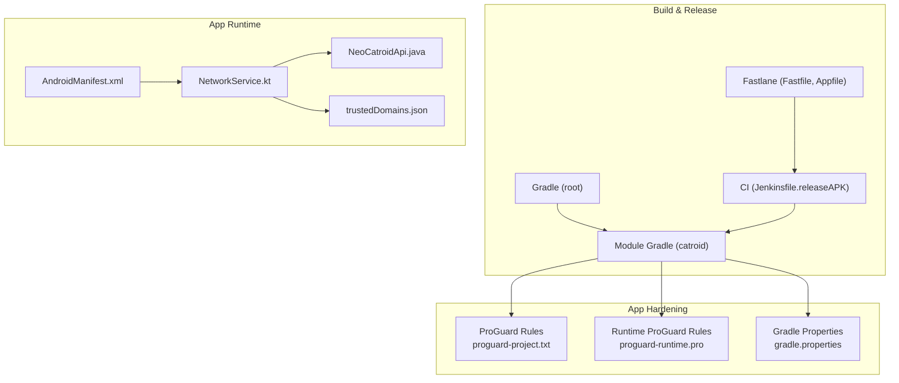
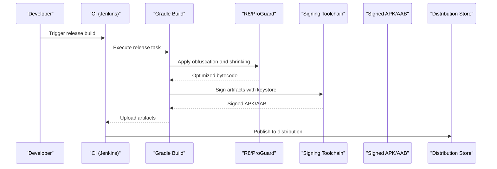
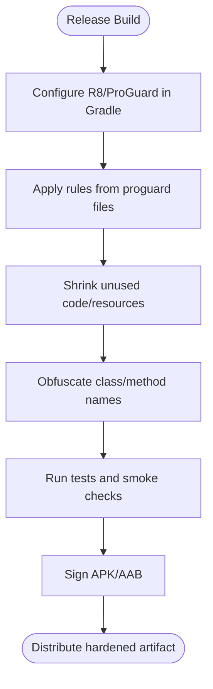
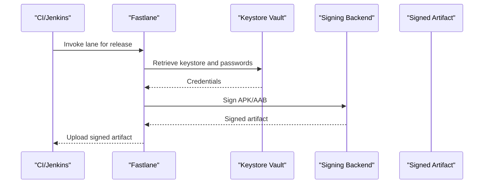
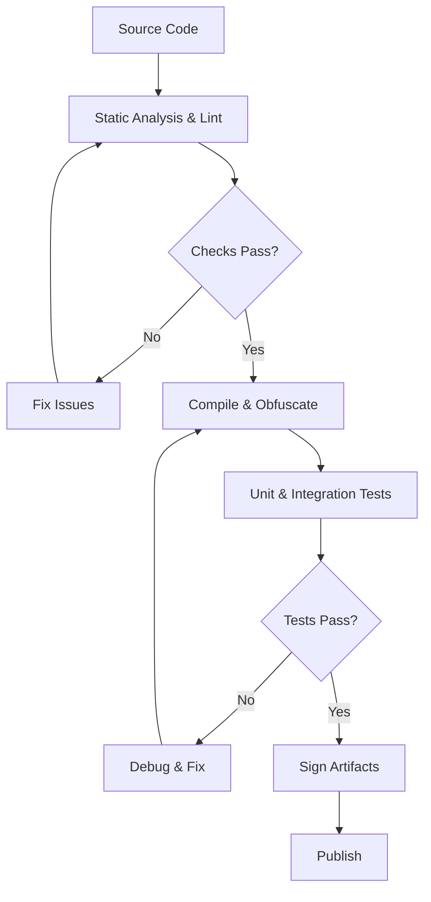
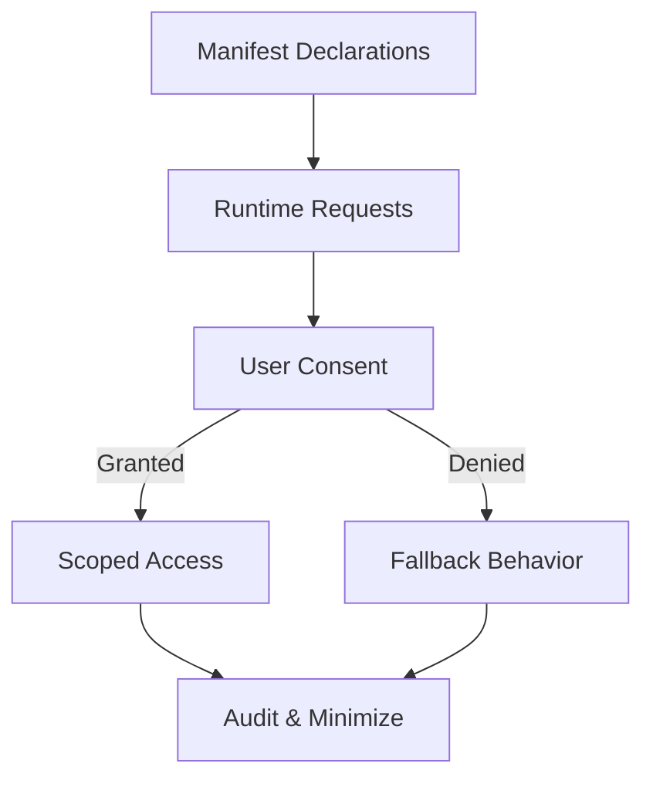
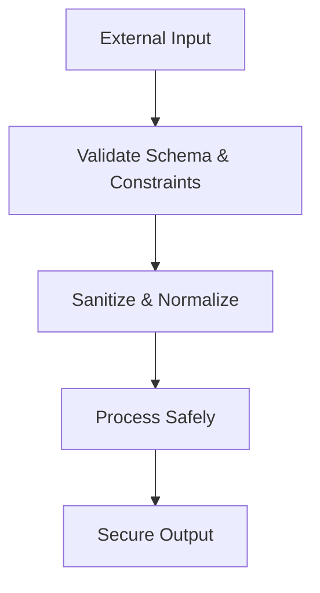
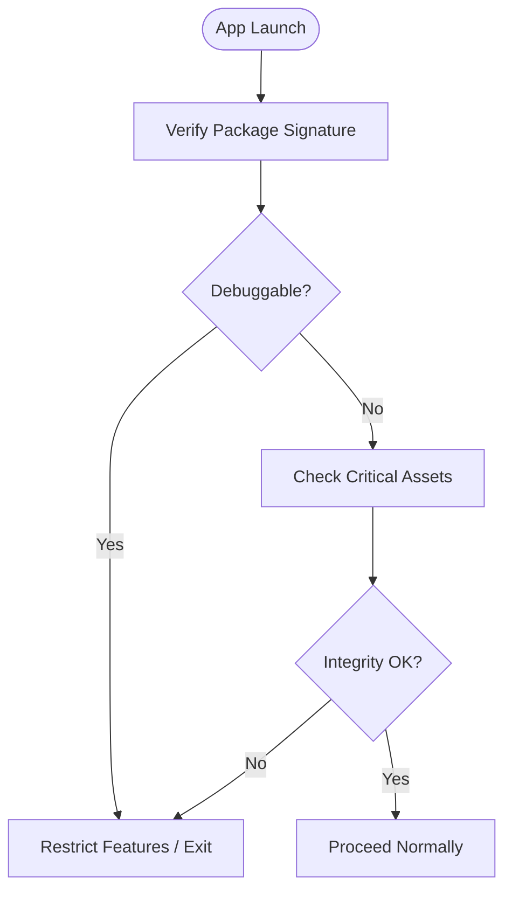
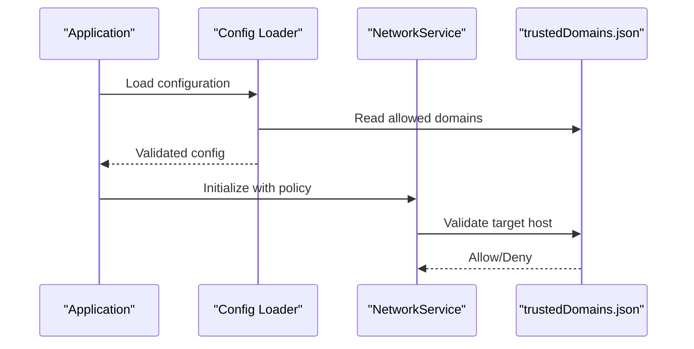
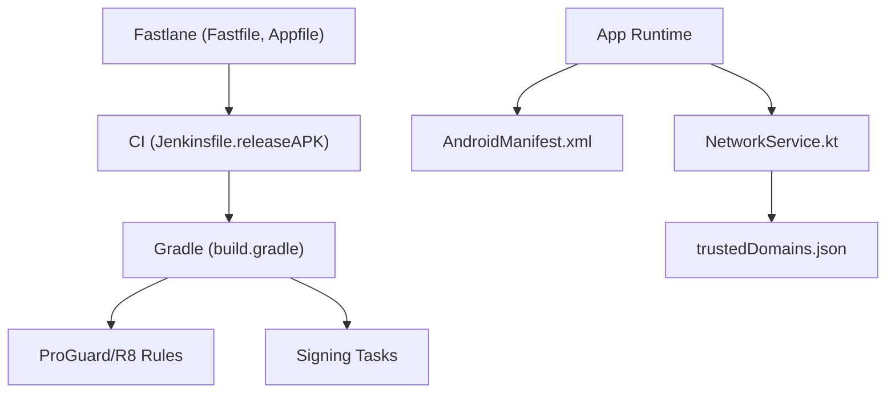

# Application Security

<cite>
**Referenced Files in This Document**
- [proguard-project.txt](file://catroid/proguard-project.txt)
- [proguard-runtime.pro](file://catroid/proguard-runtime.pro)
- [build.gradle](file://catroid/build.gradle)
- [AndroidManifest.xml](file://catroid/src/main/AndroidManifest.xml)
- [Fastfile](file://fastlane/Fastfile)
- [Appfile](file://fastlane/Appfile)
- [gradle.properties](file://gradle.properties)
- [Jenkinsfile.releaseAPK](file://Jenkinsfile.releaseAPK)
- [trustedDomains.json](file://catroid/src/main/assets/trustedDomains.json)
- [networkService.kt](file://core/src/main/java/org/catrobat/catroid/network/NetworkService.kt)
- [neoCatroidApi.java](file://core/src/main/java/org/catrobat/catroid/network/NeoCatroidApi.java)
</cite>

## Table of Contents
1. [Introduction](#introduction)
2. [Project Structure](#project-structure)
3. [Core Components](#core-components)
4. [Architecture Overview](#architecture-overview)
5. [Detailed Component Analysis](#detailed-component-analysis)
6. [Dependency Analysis](#dependency-analysis)
7. [Performance Considerations](#performance-considerations)
8. [Troubleshooting Guide](#troubleshooting-guide)
9. [Conclusion](#conclusion)
10. [Appendices](#appendices)

## Introduction
This document provides comprehensive application security guidance for NewCatroid, focusing on APK hardening with ProGuard/R8, code obfuscation techniques, anti-tampering measures, certificate management and signing, secure build processes, permission management following least privilege, runtime permission handling, input validation strategies, secure coding patterns, vulnerability prevention, app integrity verification, debug mode protection, and secure configuration management. It maps these practices to the repository’s existing build and networking components where applicable.

## Project Structure
NewCatroid is a multi-module Android project with flavor-specific resources and build configurations. Security-relevant artifacts include:
- Obfuscation rules under catroid/
- Gradle build scripts at the root and module level
- Fastlane automation for release packaging
- Network service modules for API calls
- Assets containing trusted domain lists and other configuration files

**Diagram sources**
- [build.gradle](file://catroid/build.gradle)
- [proguard-project.txt](file://catroid/proguard-project.txt)
- [proguard-runtime.pro](file://catroid/proguard-runtime.pro)
- [AndroidManifest.xml](file://catroid/src/main/AndroidManifest.xml)
- [Fastfile](file://fastlane/Fastfile)
- [Appfile](file://fastlane/Appfile)
- [gradle.properties](file://gradle.properties)
- [Jenkinsfile.releaseAPK](file://Jenkinsfile.releaseAPK)
- [networkService.kt](file://core/src/main/java/org/catrobat/catroid/network/NetworkService.kt)
- [neoCatroidApi.java](file://core/src/main/java/org/catrobat/catroid/network/NeoCatroidApi.java)
- [trustedDomains.json](file://catroid/src/main/assets/trustedDomains.json)

**Section sources**
- [build.gradle](file://catroid/build.gradle)
- [AndroidManifest.xml](file://catroid/src/main/AndroidManifest.xml)
- [Fastfile](file://fastlane/Fastfile)
- [Appfile](file://fastlane/Appfile)
- [gradle.properties](file://gradle.properties)
- [Jenkinsfile.releaseAPK](file://Jenkinsfile.releaseAPK)
- [proguard-project.txt](file://catroid/proguard-project.txt)
- [proguard-runtime.pro](file://catroid/proguard-runtime.pro)
- [networkService.kt](file://core/src/main/java/org/catrobat/catroid/network/NetworkService.kt)
- [neoCatroidApi.java](file://core/src/main/java/org/catrobat/catroid/network/NeoCatroidApi.java)
- [trustedDomains.json](file://catroid/src/main/assets/trustedDomains.json)

## Core Components
- APK hardening and obfuscation via ProGuard/R8 rules and Gradle integration
- Secure network stack using Kotlin/Java services and JSON-based trusted domains
- Build and release automation through Fastlane and CI pipelines
- Manifest-driven permissions and application-level security flags

Key responsibilities:
- Minimize attack surface by removing unused code and resources
- Enforce strict TLS policies and validate server identities
- Automate secure builds with proper signing and artifact handling
- Declare only necessary permissions and enforce runtime checks

**Section sources**
- [proguard-project.txt](file://catroid/proguard-project.txt)
- [proguard-runtime.pro](file://catroid/proguard-runtime.pro)
- [build.gradle](file://catroid/build.gradle)
- [AndroidManifest.xml](file://catroid/src/main/AndroidManifest.xml)
- [networkService.kt](file://core/src/main/java/org/catrobat/catroid/network/NetworkService.kt)
- [neoCatroidApi.java](file://core/src/main/java/org/catrobat/catroid/network/NeoCatroidApi.java)
- [trustedDomains.json](file://catroid/src/main/assets/trustedDomains.json)
- [Fastfile](file://fastlane/Fastfile)
- [Appfile](file://fastlane/Appfile)
- [gradle.properties](file://gradle.properties)
- [Jenkinsfile.releaseAPK](file://Jenkinsfile.releaseAPK)

## Architecture Overview
The security architecture integrates build-time hardening, runtime protections, and secure communication:

**Diagram sources**
- [Jenkinsfile.releaseAPK](file://Jenkinsfile.releaseAPK)
- [build.gradle](file://catroid/build.gradle)
- [proguard-project.txt](file://catroid/proguard-project.txt)
- [proguard-runtime.pro](file://catroid/proguard-runtime.pro)
- [Fastfile](file://fastlane/Fastfile)
- [Appfile](file://fastlane/Appfile)

## Detailed Component Analysis

### APK Hardening and Code Obfuscation (ProGuard/R8)
- Purpose: Reduce binary size, remove dead code/resources, and obfuscate identifiers to hinder reverse engineering.
- Configuration locations:
  - Module-level ProGuard rules: [proguard-project.txt](file://catroid/proguard-project.txt), [proguard-runtime.pro](file://catroid/proguard-runtime.pro)
  - Gradle integration: [build.gradle](file://catroid/build.gradle)
- Best practices:
  - Enable minify and shrinker for release builds
  - Keep annotations and reflection-required classes
  - Exclude third-party libraries that require reflection or JNI
  - Validate builds after enabling R8 to catch compatibility issues
  - Use mapping files for post-mortem analysis while keeping them out of distributions

**Diagram sources**
- [build.gradle](file://catroid/build.gradle)
- [proguard-project.txt](file://catroid/proguard-project.txt)
- [proguard-runtime.pro](file://catroid/proguard-runtime.pro)

**Section sources**
- [proguard-project.txt](file://catroid/proguard-project.txt)
- [proguard-runtime.pro](file://catroid/proguard-runtime.pro)
- [build.gradle](file://catroid/build.gradle)

### Certificate Management and Code Signing
- Goals: Ensure artifact authenticity and integrity; prevent tampering during distribution.
- Automation:
  - Fastlane pipeline orchestrates signing and publishing: [Fastfile](file://fastlane/Fastfile), [Appfile](file://fastlane/Appfile)
  - CI integration for consistent signing: [Jenkinsfile.releaseAPK](file://Jenkinsfile.releaseAPK)
- Recommendations:
  - Store keystores securely (e.g., CI secret stores)
  - Rotate keys periodically and maintain backups
  - Separate development and production keystores
  - Validate signatures before installation in-app when possible

**Diagram sources**
- [Fastfile](file://fastlane/Fastfile)
- [Appfile](file://fastlane/Appfile)
- [Jenkinsfile.releaseAPK](file://Jenkinsfile.releaseAPK)

**Section sources**
- [Fastfile](file://fastlane/Fastfile)
- [Appfile](file://fastlane/Appfile)
- [Jenkinsfile.releaseAPK](file://Jenkinsfile.releaseAPK)

### Secure Build Processes
- Centralize secrets in CI environment variables or secret managers
- Pin dependency versions and use checksums
- Run static analysis and linting prior to signing
- Produce reproducible builds where feasible

[No sources needed since this diagram shows conceptual workflow, not actual code structure]

**Section sources**
- [gradle.properties](file://gradle.properties)
- [Jenkinsfile.releaseAPK](file://Jenkinsfile.releaseAPK)

### Permission Management and Least Privilege
- Declare only required permissions in the manifest
- Request sensitive permissions at runtime with clear user rationale
- Scope access to minimal data and time windows
- Audit permissions regularly and remove unused ones

**Section sources**
- [AndroidManifest.xml](file://catroid/src/main/AndroidManifest.xml)

### Input Validation and Secure Coding Patterns
- Validate all external inputs (user, file, network)
- Sanitize data before processing or storage
- Avoid unsafe APIs and deprecated cryptographic primitives
- Use parameterized queries and safe parsing routines
- Implement strict timeouts and error handling for network operations

[No sources needed since this diagram shows conceptual workflow, not actual code structure]

**Section sources**
- [networkService.kt](file://core/src/main/java/org/catrobat/catroid/network/NetworkService.kt)
- [neoCatroidApi.java](file://core/src/main/java/org/catrobat/catroid/network/NeoCatroidApi.java)

### Vulnerability Prevention Techniques
- Dependency scanning and updates
- Code review guidelines focused on security
- Automated checks for hardcoded secrets and weak crypto
- Enforce HTTPS-only communications and certificate pinning where appropriate

[No sources needed since this section provides general guidance]

### App Integrity Verification and Anti-Tampering
- Verify signature at runtime to detect repackaging
- Check for debuggable builds and disable critical features if detected
- Use integrity checks for critical assets and native libraries

[No sources needed since this diagram shows conceptual workflow, not actual code structure]

**Section sources**
- [AndroidManifest.xml](file://catroid/src/main/AndroidManifest.xml)

### Debug Mode Protection
- Disable logging and verbose diagnostics in release builds
- Prevent attaching debuggers to sensitive flows
- Remove development endpoints and test hooks from release variants

**Section sources**
- [AndroidManifest.xml](file://catroid/src/main/AndroidManifest.xml)

### Secure Configuration Management
- Externalize secrets and avoid embedding them in source
- Use trusted domain lists and allowlists for network calls
- Validate configuration files’ integrity and format

**Diagram sources**
- [trustedDomains.json](file://catroid/src/main/assets/trustedDomains.json)
- [networkService.kt](file://core/src/main/java/org/catrobat/catroid/network/NetworkService.kt)

**Section sources**
- [trustedDomains.json](file://catroid/src/main/assets/trustedDomains.json)
- [networkService.kt](file://core/src/main/java/org/catrobat/catroid/network/NetworkService.kt)

## Dependency Analysis
Security-related dependencies and their roles:
- Gradle orchestrates build tasks, including obfuscation and signing
- Fastlane automates release workflows and interacts with signing toolchains
- CI pipelines enforce consistent builds and artifact handling
- Network layer enforces domain allowlists and secure transport

**Diagram sources**
- [build.gradle](file://catroid/build.gradle)
- [proguard-project.txt](file://catroid/proguard-project.txt)
- [proguard-runtime.pro](file://catroid/proguard-runtime.pro)
- [Fastfile](file://fastlane/Fastfile)
- [Appfile](file://fastlane/Appfile)
- [Jenkinsfile.releaseAPK](file://Jenkinsfile.releaseAPK)
- [AndroidManifest.xml](file://catroid/src/main/AndroidManifest.xml)
- [networkService.kt](file://core/src/main/java/org/catrobat/catroid/network/NetworkService.kt)
- [trustedDomains.json](file://catroid/src/main/assets/trustedDomains.json)

**Section sources**
- [build.gradle](file://catroid/build.gradle)
- [Fastfile](file://fastlane/Fastfile)
- [Appfile](file://fastlane/Appfile)
- [Jenkinsfile.releaseAPK](file://Jenkinsfile.releaseAPK)
- [AndroidManifest.xml](file://catroid/src/main/AndroidManifest.xml)
- [networkService.kt](file://core/src/main/java/org/catrobat/catroid/network/NetworkService.kt)
- [trustedDomains.json](file://catroid/src/main/assets/trustedDomains.json)

## Performance Considerations
- Enable R8 shrinking and resource removal to reduce attack surface and improve load times
- Avoid heavy runtime integrity checks on cold start paths; defer to background or lazy initialization
- Cache validated configuration and trust anchors to minimize repeated I/O
- Profile network calls and enforce timeouts to prevent hangs and DoS vectors

[No sources needed since this section provides general guidance]

## Troubleshooting Guide
Common issues and mitigations:
- Obfuscation breaks reflection or serialization: Add keep rules and retest affected modules
- Signing failures in CI: Verify keystore availability and environment variables
- Network errors due to domain restrictions: Update trusted domain list and validate formats
- Runtime permission denials: Provide clear user prompts and fallback behaviors

**Section sources**
- [proguard-project.txt](file://catroid/proguard-project.txt)
- [proguard-runtime.pro](file://catroid/proguard-runtime.pro)
- [Fastfile](file://fastlane/Fastfile)
- [trustedDomains.json](file://catroid/src/main/assets/trustedDomains.json)

## Conclusion
By integrating robust build-time hardening, secure signing, least-privilege permissions, strict input validation, and runtime integrity checks, NewCatroid can significantly reduce its attack surface and resist common threats. Automating secure builds and enforcing consistent policies across environments further strengthens resilience against tampering and misconfiguration.

[No sources needed since this section summarizes without analyzing specific files]

## Appendices

### Quick Reference: Key Security Artifacts
- Obfuscation rules: [proguard-project.txt](file://catroid/proguard-project.txt), [proguard-runtime.pro](file://catroid/proguard-runtime.pro)
- Build orchestration: [build.gradle](file://catroid/build.gradle), [gradle.properties](file://gradle.properties)
- Release automation: [Fastfile](file://fastlane/Fastfile), [Appfile](file://fastlane/Appfile), [Jenkinsfile.releaseAPK](file://Jenkinsfile.releaseAPK)
- Permissions and app flags: [AndroidManifest.xml](file://catroid/src/main/AndroidManifest.xml)
- Secure networking: [networkService.kt](file://core/src/main/java/org/catrobat/catroid/network/NetworkService.kt), [neoCatroidApi.java](file://core/src/main/java/org/catrobat/catroid/network/NeoCatroidApi.java), [trustedDomains.json](file://catroid/src/main/assets/trustedDomains.json)

**Section sources**
- [proguard-project.txt](file://catroid/proguard-project.txt)
- [proguard-runtime.pro](file://catroid/proguard-runtime.pro)
- [build.gradle](file://catroid/build.gradle)
- [gradle.properties](file://gradle.properties)
- [Fastfile](file://fastlane/Fastfile)
- [Appfile](file://fastlane/Appfile)
- [Jenkinsfile.releaseAPK](file://Jenkinsfile.releaseAPK)
- [AndroidManifest.xml](file://catroid/src/main/AndroidManifest.xml)
- [networkService.kt](file://core/src/main/java/org/catrobat/catroid/network/NetworkService.kt)
- [neoCatroidApi.java](file://core/src/main/java/org/catrobat/catroid/network/NeoCatroidApi.java)
- [trustedDomains.json](file://catroid/src/main/assets/trustedDomains.json)