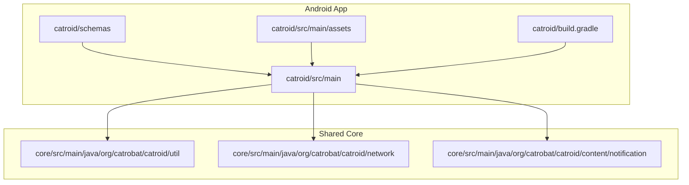
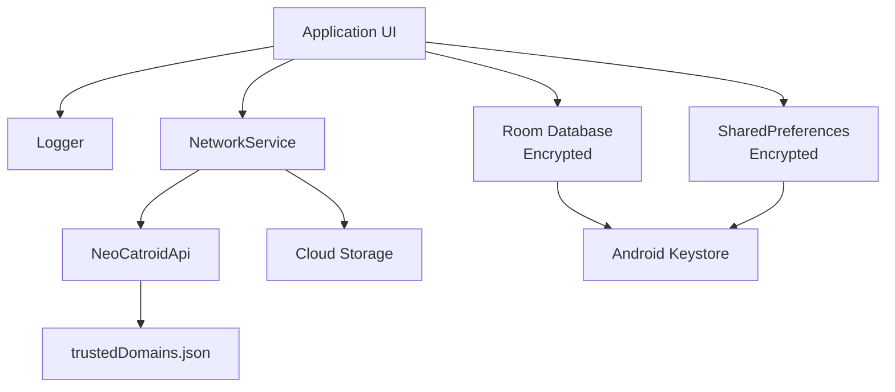
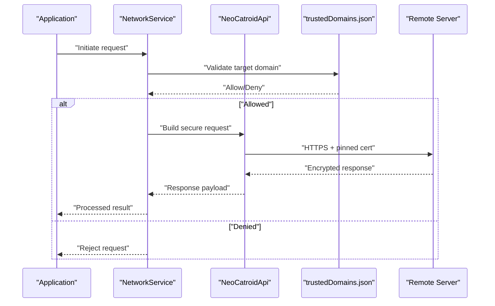
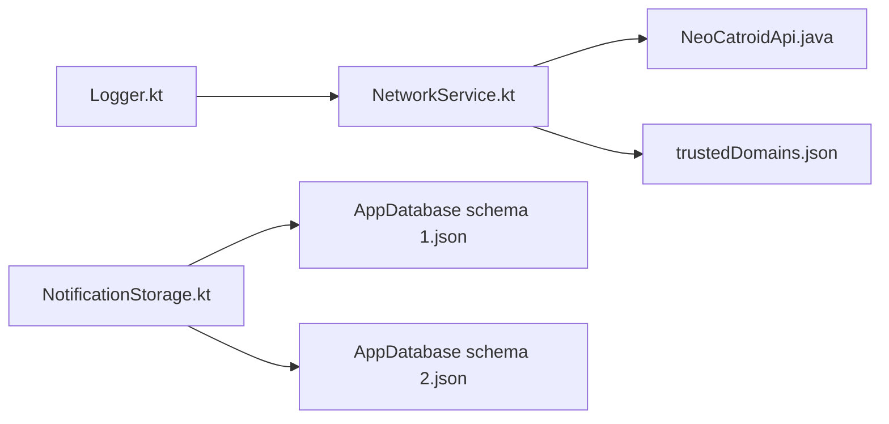

# Data Protection

<cite>
**Referenced Files in This Document**
- [README.md](file://README.md)
- [build.gradle](file://catroid/build.gradle)
- [AndroidManifest.xml](file://catroid/src/main/AndroidManifest.xml)
- [AppDatabase schema 1.json](file://catroid/schemas/org.catrobat.catroid.db.AppDatabase/1.json)
- [AppDatabase schema 2.json](file://catroid/schemas/org.catrobat.catroid.db.AppDatabase/2.json)
- [Logger.kt](file://core/src/main/java/org/catrobat/catroid/util/Logger.kt)
- [NetworkService.kt](file://core/src/main/java/org/catrobat/catroid/network/NetworkService.kt)
- [NeoCatroidApi.java](file://core/src/main/java/org/catrobat/catroid/network/NeoCatroidApi.java)
- [NotificationStorage.kt](file://core/src/main/java/org/catrobat/catroid/content/notification/NotificationStorage.kt)
- [trustedDomains.json](file://catroid/src/main/assets/trustedDomains.json)
</cite>

## Table of Contents
1. [Introduction](#introduction)
2. [Project Structure](#project-structure)
3. [Core Components](#core-components)
4. [Architecture Overview](#architecture-overview)
5. [Detailed Component Analysis](#detailed-component-analysis)
6. [Dependency Analysis](#dependency-analysis)
7. [Performance Considerations](#performance-considerations)
8. [Troubleshooting Guide](#troubleshooting-guide)
9. [Conclusion](#conclusion)
10. [Appendices](#appendices)

## Introduction
This document provides comprehensive data protection guidance for NewCatroid, focusing on secure storage, sensitive data handling, memory management, secure file operations, backup and restore security, cloud storage encryption, synchronization security, retention policies, secure deletion, privacy compliance, validation and sanitization, and protection against data leakage through logs or crash reports. It synthesizes the repository’s structure and available components to outline best practices and implementation targets aligned with Android security standards.

## Project Structure
NewCatroid is an Android application with a multi-module layout:
- catroid: Main Android app module containing source code, resources, schemas, and build configuration.
- core: Shared Kotlin utilities including logging, network services, notifications, and runtime helpers.
- desktop-runtime: Desktop runtime support (not directly relevant to mobile data protection).
- assets: Application assets including trusted domains configuration.

**Diagram sources**
- [AndroidManifest.xml](file://catroid/src/main/AndroidManifest.xml)
- [build.gradle](file://catroid/build.gradle)
- [AppDatabase schema 1.json](file://catroid/schemas/org.catrobat.catroid.db.AppDatabase/1.json)
- [AppDatabase schema 2.json](file://catroid/schemas/org.catrobat.catroid.db.AppDatabase/2.json)
- [Logger.kt](file://core/src/main/java/org/catrobat/catroid/util/Logger.kt)
- [NetworkService.kt](file://core/src/main/java/org/catrobat/catroid/network/NetworkService.kt)
- [NeoCatroidApi.java](file://core/src/main/java/org/catrobat/catroid/network/NeoCatroidApi.java)
- [NotificationStorage.kt](file://core/src/main/java/org/catrobat/catroid/content/notification/NotificationStorage.kt)
- [trustedDomains.json](file://catroid/src/main/assets/trustedDomains.json)

**Section sources**
- [README.md](file://README.md)
- [build.gradle](file://catroid/build.gradle)
- [AndroidManifest.xml](file://catroid/src/main/AndroidManifest.xml)

## Core Components
- Logging utility: Centralized logging component used across modules; must be configured to avoid sensitive data emission.
- Network service: Encapsulates HTTP calls and API definitions; should enforce TLS, certificate pinning, and domain allowlists.
- Notification storage: Manages notification-related content; ensure no secrets are persisted via this path.
- Database schemas: Define Room database versions; guide encryption strategy and migration safeguards.
- Trusted domains: Asset-based allowlist for server endpoints to prevent unintended network destinations.

Key responsibilities:
- Avoid logging sensitive fields.
- Enforce secure transport and endpoint verification.
- Persist only non-sensitive data in notification storage.
- Plan database encryption at rest and secure migrations.
- Restrict outbound connections to approved domains.

**Section sources**
- [Logger.kt](file://core/src/main/java/org/catrobat/catroid/util/Logger.kt)
- [NetworkService.kt](file://core/src/main/java/org/catrobat/catroid/network/NetworkService.kt)
- [NeoCatroidApi.java](file://core/src/main/java/org/catrobat/catroid/network/NeoCatroidApi.java)
- [NotificationStorage.kt](file://core/src/main/java/org/catrobat/catroid/content/notification/NotificationStorage.kt)
- [AppDatabase schema 1.json](file://catroid/schemas/org.catrobat.catroid.db.AppDatabase/1.json)
- [AppDatabase schema 2.json](file://catroid/schemas/org.catrobat.catroid.db.AppDatabase/2.json)
- [trustedDomains.json](file://catroid/src/main/assets/trustedDomains.json)

## Architecture Overview
The data protection architecture centers on secure storage, encrypted persistence, and controlled network access:
- Secure storage: Use Android Keystore for cryptographic keys and secrets; encrypt SharedPreferences where needed.
- Database encryption: Enable SQLCipher-backed Room or equivalent to encrypt data at rest.
- Network security: Enforce HTTPS, certificate pinning, and domain allowlisting via trusted domains asset.
- Logging hygiene: Route all logs through a centralized logger that redacts sensitive information.
- Backup and sync: Ensure backups do not expose plaintext secrets; encrypt cloud payloads and validate integrity.

**Diagram sources**
- [Logger.kt](file://core/src/main/java/org/catrobat/catroid/util/Logger.kt)
- [NetworkService.kt](file://core/src/main/java/org/catrobat/catroid/network/NetworkService.kt)
- [NeoCatroidApi.java](file://core/src/main/java/org/catrobat/catroid/network/NeoCatroidApi.java)
- [trustedDomains.json](file://catroid/src/main/assets/trustedDomains.json)
- [AppDatabase schema 1.json](file://catroid/schemas/org.catrobat.catroid.db.AppDatabase/1.json)
- [AppDatabase schema 2.json](file://catroid/schemas/org.catrobat.catroid.db.AppDatabase/2.json)

## Detailed Component Analysis

### Secure Storage and Key Management
- Android Keystore: Store cryptographic keys and secrets; use hardware-backed keystore when available.
- Encrypted SharedPreferences: Wrap preferences with encryption; avoid storing tokens or PII in plain text.
- Database encryption: Configure Room with an encrypted driver; protect migration scripts from leaking sensitive values.

Implementation targets:
- Derive keys from user credentials or device-bound material via Keystore.
- Encrypt preference entries using per-key algorithms with strong IVs.
- Validate database integrity after decryption and migration.

**Section sources**
- [AppDatabase schema 1.json](file://catroid/schemas/org.catrobat.catroid.db.AppDatabase/1.json)
- [AppDatabase schema 2.json](file://catroid/schemas/org.catrobat.catroid.db.AppDatabase/2.json)

### Sensitive Data Handling and Memory Management
- Minimize in-memory lifetime of secrets; clear buffers promptly.
- Avoid string concatenation for sensitive data; prefer immutable byte arrays and overwrite them.
- Do not cache sensitive objects in global state or static fields.

Operational guidelines:
- Zero out sensitive arrays after use.
- Avoid passing secrets through logs or analytics.
- Use short-lived contexts for cryptographic operations.

[No sources needed since this section provides general guidance]

### Secure File Operations
- Write temporary files to app-private directories; set restrictive permissions.
- Use secure deletion by overwriting before removal.
- Avoid external storage unless necessary; if required, mark files as private and restrict sharing.

Best practices:
- Stream large files instead of loading entirely into memory.
- Verify file integrity using checksums when applicable.
- Sanitize filenames and paths to prevent injection.

[No sources needed since this section provides general guidance]

### Data Backup and Restore Security
- Exclude secrets from automatic backups; configure backup rules to omit sensitive files.
- Encrypt exported backups; require authentication to restore.
- Validate backup integrity and version compatibility before restoring.

Compliance considerations:
- Honor user consent and platform backup settings.
- Provide explicit controls for users to manage backups.

[No sources needed since this section provides general guidance]

### Cloud Storage Encryption and Synchronization Security
- Encrypt payloads before upload; store keys securely in Keystore.
- Enforce HTTPS and certificate pinning for all cloud endpoints.
- Implement idempotent sync operations with conflict resolution.

Security measures:
- Sign payloads with HMAC to detect tampering.
- Rotate encryption keys periodically and handle key rotation gracefully.

**Section sources**
- [NetworkService.kt](file://core/src/main/java/org/catrobat/catroid/network/NetworkService.kt)
- [NeoCatroidApi.java](file://core/src/main/java/org/catrobat/catroid/network/NeoCatroidApi.java)
- [trustedDomains.json](file://catroid/src/main/assets/trustedDomains.json)

### Data Retention Policies and Secure Deletion
- Define retention periods per data category; purge expired records automatically.
- Securely delete files and database rows; ensure indexes and caches are cleared.
- Log deletions without exposing sensitive details.

Policy enforcement:
- Schedule periodic cleanup tasks.
- Respect user-initiated deletion requests immediately.

[No sources needed since this section provides general guidance]

### Privacy Compliance Measures
- Collect minimal data; obtain explicit consent where required.
- Provide privacy notices and user controls.
- Anonymize or pseudonymize data for analytics and diagnostics.

Auditability:
- Maintain audit trails for data access and modifications.
- Support data export and deletion upon request.

[No sources needed since this section provides general guidance]

### Data Validation, Sanitization, and Leakage Prevention
- Validate inputs rigorously; reject malformed or unexpected data.
- Sanitize outputs to prevent injection attacks.
- Prevent leakage via logs, crash reports, and error messages.

Logging hygiene:
- Redact sensitive fields in logs.
- Disable verbose logging in production builds.

**Section sources**
- [Logger.kt](file://core/src/main/java/org/catrobat/catroid/util/Logger.kt)

### Network Security and Endpoint Control
- Enforce TLS with strict hostname verification.
- Pin certificates or public keys to mitigate MITM risks.
- Restrict allowed domains using trusted domains asset.

Sequence of network call flow:

**Diagram sources**
- [NetworkService.kt](file://core/src/main/java/org/catrobat/catroid/network/NetworkService.kt)
- [NeoCatroidApi.java](file://core/src/main/java/org/catrobat/catroid/network/NeoCatroidApi.java)
- [trustedDomains.json](file://catroid/src/main/assets/trustedDomains.json)

**Section sources**
- [NetworkService.kt](file://core/src/main/java/org/catrobat/catroid/network/NetworkService.kt)
- [NeoCatroidApi.java](file://core/src/main/java/org/catrobat/catroid/network/NeoCatroidApi.java)
- [trustedDomains.json](file://catroid/src/main/assets/trustedDomains.json)

## Dependency Analysis
Data protection dependencies span logging, networking, and persistence layers:
- Logger depends on centralized configuration to suppress sensitive output.
- NetworkService depends on NeoCatroidApi and trusted domains to control endpoints.
- NotificationStorage persists non-sensitive content; ensure it does not leak secrets.
- Database schemas inform encryption and migration strategies.

**Diagram sources**
- [Logger.kt](file://core/src/main/java/org/catrobat/catroid/util/Logger.kt)
- [NetworkService.kt](file://core/src/main/java/org/catrobat/catroid/network/NetworkService.kt)
- [NeoCatroidApi.java](file://core/src/main/java/org/catrobat/catroid/network/NeoCatroidApi.java)
- [NotificationStorage.kt](file://core/src/main/java/org/catrobat/catroid/content/notification/NotificationStorage.kt)
- [AppDatabase schema 1.json](file://catroid/schemas/org.catrobat.catroid.db.AppDatabase/1.json)
- [AppDatabase schema 2.json](file://catroid/schemas/org.catrobat.catroid.db.AppDatabase/2.json)
- [trustedDomains.json](file://catroid/src/main/assets/trustedDomains.json)

**Section sources**
- [Logger.kt](file://core/src/main/java/org/catrobat/catroid/util/Logger.kt)
- [NetworkService.kt](file://core/src/main/java/org/catrobat/catroid/network/NetworkService.kt)
- [NeoCatroidApi.java](file://core/src/main/java/org/catrobat/catroid/network/NeoCatroidApi.java)
- [NotificationStorage.kt](file://core/src/main/java/org/catrobat/catroid/content/notification/NotificationStorage.kt)
- [AppDatabase schema 1.json](file://catroid/schemas/org.catrobat.catroid.db.AppDatabase/1.json)
- [AppDatabase schema 2.json](file://catroid/schemas/org.catrobat.catroid.db.AppDatabase/2.json)
- [trustedDomains.json](file://catroid/src/main/assets/trustedDomains.json)

## Performance Considerations
- Prefer streaming over bulk loading for large files to reduce memory pressure.
- Cache only non-sensitive data; keep sensitive items ephemeral.
- Batch database writes and use transactions to minimize I/O overhead.
- Avoid unnecessary encryption/decryption cycles; cache decrypted results briefly within secure scopes.

[No sources needed since this section provides general guidance]

## Troubleshooting Guide
Common issues and mitigations:
- Sensitive data in logs: Review Logger configuration and ensure redaction rules are applied.
- Untrusted network endpoints: Verify trusted domains list and certificate pinning configuration.
- Backup exposure: Confirm backup exclusion rules and encryption settings.
- Database migration failures: Validate schema changes and encryption parameters during upgrades.

Diagnostic steps:
- Inspect log filters and disable verbose modes in production.
- Test network calls against known-good endpoints and invalid domains.
- Perform dry-run backups and restores in sandboxed environments.

**Section sources**
- [Logger.kt](file://core/src/main/java/org/catrobat/catroid/util/Logger.kt)
- [NetworkService.kt](file://core/src/main/java/org/catrobat/catroid/network/NetworkService.kt)
- [NeoCatroidApi.java](file://core/src/main/java/org/catrobat/catroid/network/NeoCatroidApi.java)
- [trustedDomains.json](file://catroid/src/main/assets/trustedDomains.json)
- [AppDatabase schema 1.json](file://catroid/schemas/org.catrobat.catroid.db.AppDatabase/1.json)
- [AppDatabase schema 2.json](file://catroid/schemas/org.catrobat.catroid.db.AppDatabase/2.json)

## Conclusion
NewCatroid’s data protection strategy should center on robust key management via Android Keystore, encrypted persistence for preferences and databases, strict network controls with certificate pinning and domain allowlisting, and disciplined logging to prevent leaks. By enforcing retention policies, secure deletion, and privacy-compliant practices, the application can safeguard user data across storage, transit, and processing lifecycles.

[No sources needed since this section summarizes without analyzing specific files]

## Appendices
- Recommended checks:
  - Audit all logging statements for sensitive fields.
  - Validate network trust anchors and domain allowlists.
  - Confirm database encryption and migration safety.
  - Review backup configurations to exclude secrets.
  - Implement input validation and output sanitization consistently.

[No sources needed since this section provides general guidance]