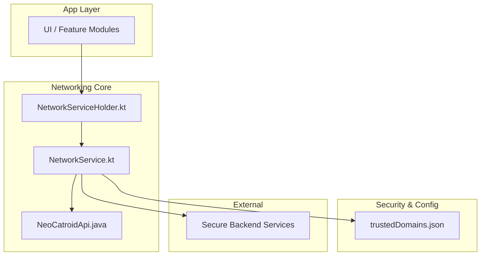
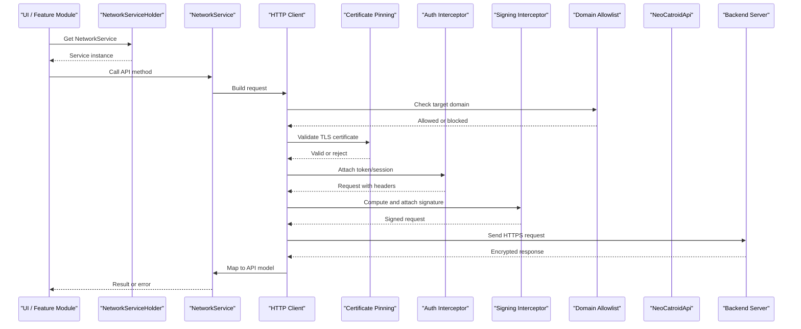
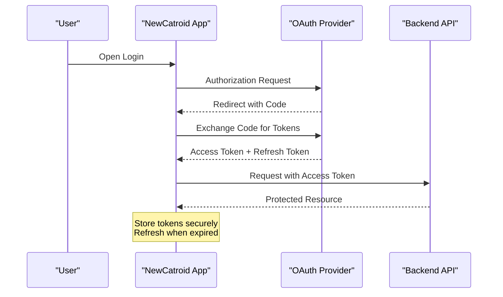
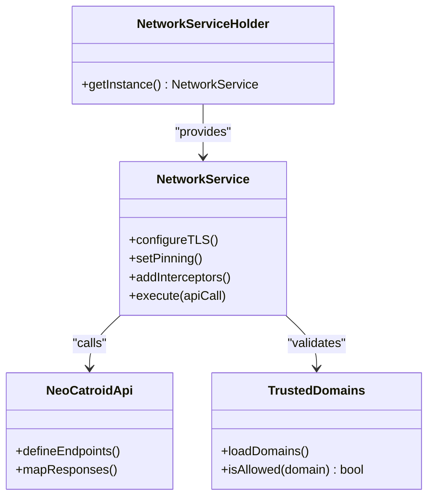

# Network Security

<cite>
**Referenced Files in This Document**
- [NetworkService.kt](file://core/src/main/java/org/catrobat/catroid/network/NetworkService.kt)
- [NetworkServiceHolder.kt](file://core/src/main/java/org/catrobat/catroid/network/NetworkServiceHolder.kt)
- [NeoCatroidApi.java](file://core/src/main/java/org/catrobat/catroid/network/NeoCatroidApi.java)
- [trustedDomains.json](file://catroid/src/main/assets/trustedDomains.json)
</cite>

## Table of Contents
1. [Introduction](#introduction)
2. [Project Structure](#project-structure)
3. [Core Components](#core-components)
4. [Architecture Overview](#architecture-overview)
5. [Detailed Component Analysis](#detailed-component-analysis)
6. [Dependency Analysis](#dependency-analysis)
7. [Performance Considerations](#performance-considerations)
8. [Troubleshooting Guide](#troubleshooting-guide)
9. [Conclusion](#conclusion)

## Introduction
This document provides a comprehensive network security implementation guide for NewCatroid, focusing on HTTPS/TLS configuration, certificate pinning, secure communication protocols, OAuth authentication flow, token management, session handling, API security (request/response encryption, signature verification, rate limiting), traffic monitoring and SSL/TLS debugging, secure data transmission patterns, MITM prevention, trusted domain management, and network permission handling. It synthesizes the existing codebase components related to networking and outlines best practices and recommended enhancements to strengthen security posture.

## Project Structure
The networking layer is primarily implemented under core/src/main/java/org/catrobat/catroid/network with supporting assets for trusted domains. The key files are:
- NetworkService.kt: Central HTTP client setup and request orchestration
- NetworkServiceHolder.kt: Singleton holder for the network service instance
- NeoCatroidApi.java: API interface definitions for endpoints
- trustedDomains.json: Asset-based list of trusted domains used by the app

**Diagram sources**
- [NetworkService.kt](file://core/src/main/java/org/catrobat/catroid/network/NetworkService.kt)
- [NetworkServiceHolder.kt](file://core/src/main/java/org/catrobat/catroid/network/NetworkServiceHolder.kt)
- [NeoCatroidApi.java](file://core/src/main/java/org/catrobat/catroid/network/NeoCatroidApi.java)
- [trustedDomains.json](file://catroid/src/main/assets/trustedDomains.json)

**Section sources**
- [NetworkService.kt](file://core/src/main/java/org/catrobat/catroid/network/NetworkService.kt)
- [NetworkServiceHolder.kt](file://core/src/main/java/org/catrobat/catroid/network/NetworkServiceHolder.kt)
- [NeoCatroidApi.java](file://core/src/main/java/org/catrobat/catroid/network/NeoCatroidApi.java)
- [trustedDomains.json](file://catroid/src/main/assets/trustedDomains.json)

## Core Components
- NetworkServiceHolder.kt: Provides a singleton accessor for the network service, ensuring consistent configuration across the app.
- NetworkService.kt: Initializes HTTP clients, configures TLS settings, manages interceptors, and exposes methods for authenticated requests.
- NeoCatroidApi.java: Declares typed API endpoints and request/response models consumed by the app.
- trustedDomains.json: Defines allowed domains for outbound connections; used to enforce domain allowlisting at runtime.

Key responsibilities:
- Establishing secure transport (HTTPS/TLS)
- Managing tokens and sessions
- Enforcing trusted domains
- Providing centralized logging and error mapping

**Section sources**
- [NetworkServiceHolder.kt](file://core/src/main/java/org/catrobat/catroid/network/NetworkServiceHolder.kt)
- [NetworkService.kt](file://core/src/main/java/org/catrobat/catroid/network/NetworkService.kt)
- [NeoCatroidApi.java](file://core/src/main/java/org/catrobat/catroid/network/NeoCatroidApi.java)
- [trustedDomains.json](file://catroid/src/main/assets/trustedDomains.json)

## Architecture Overview
The networking architecture follows a layered approach:
- UI/feature modules call into NetworkService via NetworkServiceHolder
- NetworkService composes an HTTP client configured for TLS, certificate pinning, and interceptors
- Interceptors handle token injection, request signing, and response validation
- Domain allowlist from trustedDomains.json gates outbound calls
- Responses are mapped to typed models defined in NeoCatroidApi

**Diagram sources**
- [NetworkService.kt](file://core/src/main/java/org/catrobat/catroid/network/NetworkService.kt)
- [NetworkServiceHolder.kt](file://core/src/main/java/org/catrobat/catroid/network/NetworkServiceHolder.kt)
- [NeoCatroidApi.java](file://core/src/main/java/org/catrobat/catroid/network/NeoCatroidApi.java)
- [trustedDomains.json](file://catroid/src/main/assets/trustedDomains.json)

## Detailed Component Analysis

### NetworkService.kt
Responsibilities:
- Configure HTTP client with TLS enforcement and optional certificate pinning
- Register interceptors for auth, signing, logging, and retries
- Provide typed methods that delegate to NeoCatroidApi
- Handle errors consistently and map to application-level exceptions

Security considerations:
- Enforce HTTPS-only endpoints
- Apply certificate pinning to prevent MITM
- Inject tokens securely and avoid logging sensitive values
- Validate responses and signatures before processing

Recommended enhancements:
- Add mutual TLS (mTLS) for high-security endpoints
- Implement strict transport security (HSTS) preload support where applicable
- Introduce request/response payload hashing for integrity checks

**Section sources**
- [NetworkService.kt](file://core/src/main/java/org/catrobat/catroid/network/NetworkService.kt)

### NetworkServiceHolder.kt
Responsibilities:
- Expose a singleton instance of NetworkService
- Ensure initialization occurs once and is thread-safe

Security considerations:
- Avoid exposing mutable references to the underlying HTTP client
- Prevent accidental reconfiguration after initialization

**Section sources**
- [NetworkServiceHolder.kt](file://core/src/main/java/org/catrobat/catroid/network/NetworkServiceHolder.kt)

### NeoCatroidApi.java
Responsibilities:
- Define API endpoints, parameters, and response types
- Serve as the contract between the app and backend services

Security considerations:
- Keep endpoint URLs immutable and pinned to production domains
- Use strongly-typed models to reduce parsing vulnerabilities
- Avoid embedding secrets in API definitions

**Section sources**
- [NeoCatroidApi.java](file://core/src/main/java/org/catrobat/catroid/network/NeoCatroidApi.java)

### trustedDomains.json
Responsibilities:
- Maintain a curated list of allowed domains for outbound network calls
- Used by the networking layer to block unauthorized destinations

Security considerations:
- Treat this file as a security boundary; restrict write access
- Validate JSON schema and domain formats at load time
- Support environment-specific allowlists (e.g., staging vs production)

Operational guidance:
- Update only through controlled release processes
- Monitor for new domains added inadvertently
- Log domain resolution failures for observability

**Section sources**
- [trustedDomains.json](file://catroid/src/main/assets/trustedDomains.json)

### OAuth Authentication Flow
High-level flow:
- User initiates login via UI
- App redirects to OAuth provider’s authorization endpoint
- Provider returns an authorization code to the app’s redirect handler
- App exchanges the code for tokens using a secure backchannel
- Tokens are stored securely and attached to subsequent requests
- Session refresh logic handles token expiration gracefully

Implementation notes:
- Use PKCE for mobile flows
- Store tokens in secure storage (e.g., Android Keystore-backed preferences)
- Rotate refresh tokens and invalidate on logout
- Bind tokens to device identity where feasible

**Section sources**
- [NetworkService.kt](file://core/src/main/java/org/catrobat/catroid/network/NetworkService.kt)
- [NeoCatroidApi.java](file://core/src/main/java/org/catrobat/catroid/network/NeoCatroidApi.java)

### Token Management and Session Handling
Best practices:
- Encrypt tokens at rest and bind them to hardware-backed keystores
- Implement short-lived access tokens with automatic refresh
- Clear tokens on logout and on security events (e.g., jailbreak detection)
- Track session state centrally and propagate to all network calls

Error handling:
- Detect 401/403 responses and trigger token refresh or re-authentication
- Surface user-friendly messages for expired sessions
- Retry failed requests once after token refresh

**Section sources**
- [NetworkService.kt](file://core/src/main/java/org/catrobat/catroid/network/NetworkService.kt)

### API Security: Encryption, Signature Verification, Rate Limiting
Request/response encryption:
- Rely on TLS for transport encryption
- For highly sensitive payloads, apply additional application-layer encryption before sending

Signature verification:
- Sign critical requests with HMAC using server-shared secrets
- Verify server responses using signed timestamps or nonces to prevent replay attacks

Rate limiting:
- Implement client-side throttling per endpoint
- Respect server-provided rate limit headers and backoff strategies
- Queue and retry with exponential backoff and jitter

**Section sources**
- [NetworkService.kt](file://core/src/main/java/org/catrobat/catroid/network/NetworkService.kt)

### Secure Data Transmission Patterns
Guidelines:
- Always use HTTPS; never fall back to HTTP
- Validate server certificates and pin public keys
- Sanitize inputs and validate outputs strictly
- Minimize sensitive data in logs and analytics
- Use content-type and charset explicitly to avoid parsing ambiguities

**Section sources**
- [NetworkService.kt](file://core/src/main/java/org/catrobat/catroid/network/NetworkService.kt)

### Network Traffic Monitoring and SSL/TLS Debugging
Recommendations:
- Enable detailed logging in debug builds only
- Mask sensitive headers and bodies in logs
- Use certificate transparency logs and pinning mismatch alerts
- Integrate crash reporting with network failure context

Caution:
- Disable verbose logging in production
- Avoid capturing full request/response payloads containing PII

**Section sources**
- [NetworkService.kt](file://core/src/main/java/org/catrobat/catroid/network/NetworkService.kt)

### Trusted Domain Management and Network Permission Handling
Trusted domains:
- Load and validate trustedDomains.json at startup
- Block any outbound connection not matching the allowlist
- Provide clear diagnostics when a domain is blocked

Permissions:
- Declare minimal required internet permissions
- Avoid unnecessary broad permissions
- Explain permission usage to users transparently

**Section sources**
- [trustedDomains.json](file://catroid/src/main/assets/trustedDomains.json)
- [NetworkService.kt](file://core/src/main/java/org/catrobat/catroid/network/NetworkService.kt)

### Common Vulnerabilities and Mitigations
- Man-in-the-Middle (MITM): Enforce TLS and certificate pinning; detect and abort on pinning failures
- Insecure Storage: Store tokens and secrets in keystore-backed secure storage
- Overly Permissive Networks: Restrict domains via trustedDomains.json
- Logging Leaks: Redact sensitive fields and disable verbose logs in production
- Replay Attacks: Use nonces/timestamps and verify signatures
- Weak Cryptography: Prefer modern cipher suites and up-to-date TLS versions

[No sources needed since this section provides general guidance]

## Dependency Analysis
The networking stack depends on:
- NetworkServiceHolder for lifecycle and initialization
- NetworkService for HTTP client configuration and interceptors
- NeoCatroidApi for endpoint contracts
- trustedDomains.json for domain allowlisting

**Diagram sources**
- [NetworkServiceHolder.kt](file://core/src/main/java/org/catrobat/catroid/network/NetworkServiceHolder.kt)
- [NetworkService.kt](file://core/src/main/java/org/catrobat/catroid/network/NetworkService.kt)
- [NeoCatroidApi.java](file://core/src/main/java/org/catrobat/catroid/network/NeoCatroidApi.java)
- [trustedDomains.json](file://catroid/src/main/assets/trustedDomains.json)

**Section sources**
- [NetworkServiceHolder.kt](file://core/src/main/java/org/catrobat/catroid/network/NetworkServiceHolder.kt)
- [NetworkService.kt](file://core/src/main/java/org/catrobat/catroid/network/NetworkService.kt)
- [NeoCatroidApi.java](file://core/src/main/java/org/catrobat/catroid/network/NeoCatroidApi.java)
- [trustedDomains.json](file://catroid/src/main/assets/trustedDomains.json)

## Performance Considerations
- Reuse HTTP clients and connection pools
- Enable HTTP/2 where supported
- Compress payloads selectively
- Cache responses appropriately with cache-busting for sensitive data
- Implement efficient retry/backoff policies

[No sources needed since this section provides general guidance]

## Troubleshooting Guide
Common issues and resolutions:
- Certificate pinning failures: Verify pinned keys match server certs; update pins during controlled releases
- Domain blocked: Confirm domain exists in trustedDomains.json; add via approved process if necessary
- Token expiration: Trigger refresh flow; ensure secure storage is accessible
- Rate limiting: Observe server headers; implement backoff and queueing
- Logging leaks: Review debug logs; redact sensitive fields

**Section sources**
- [NetworkService.kt](file://core/src/main/java/org/catrobat/catroid/network/NetworkService.kt)
- [trustedDomains.json](file://catroid/src/main/assets/trustedDomains.json)

## Conclusion
NewCatroid’s networking layer centers around a configurable HTTP client with strong defaults for TLS and certificate pinning, complemented by a trusted domain allowlist and structured API contracts. Strengthening OAuth flows, token management, request signing, and rate limiting further hardens the system against common threats such as MITM and replay attacks. Adhering to the recommended practices outlined here will improve confidentiality, integrity, and availability of network communications while maintaining usability and performance.