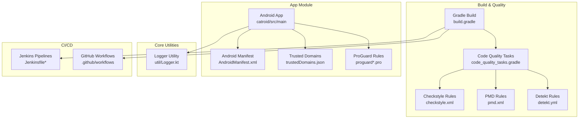
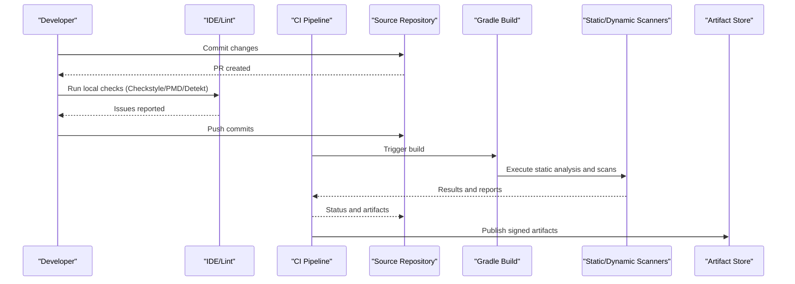
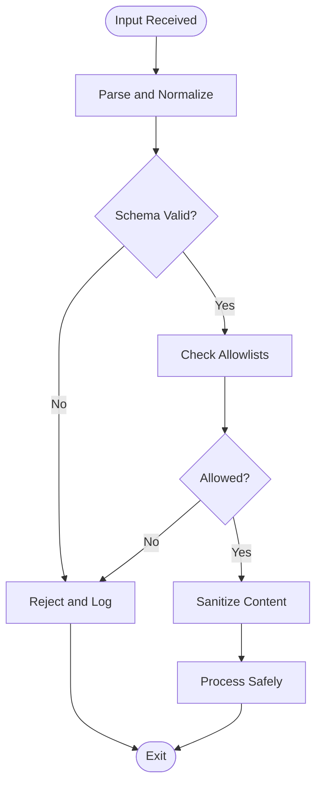
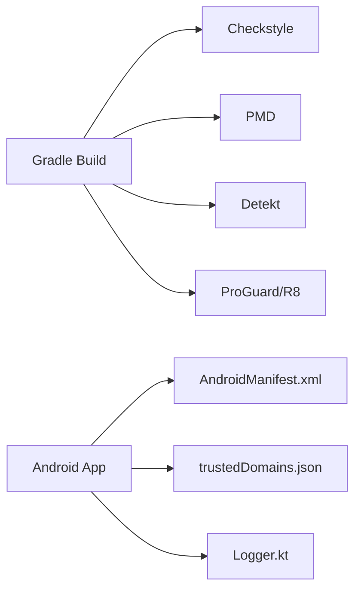

# Secure Coding Practices

<cite>
**Referenced Files in This Document**
- [README.md](file://README.md)
- [build.gradle](file://build.gradle)
- [gradle.properties](file://gradle.properties)
- [settings.gradle](file://settings.gradle)
- [catroid/config/checkstyle.xml](file://catroid/config/checkstyle.xml)
- [catroid/config/pmd.xml](file://catroid/config/pmd.xml)
- [catroid/config/detekt.yml](file://catroid/config/detekt.yml)
- [catroid/gradle/code_quality_tasks.gradle](file://catroid/gradle/code_quality_tasks.gradle)
- [Jenkinsfile](file://Jenkinsfile)
- [.github/workflows](file://.github/workflows)
- [.github/PULL_REQUEST_TEMPLATE.md](file://.github/PULL_REQUEST_TEMPLATE.md)
- [core/src/main/java/org/catrobat/catroid/util/Logger.kt](file://core/src/main/java/org/catrobat/catroid/util/Logger.kt)
- [catroid/src/main/assets/trustedDomains.json](file://catroid/src/main/assets/trustedDomains.json)
- [catroid/src/main/AndroidManifest.xml](file://catroid/src/main/AndroidManifest.xml)
- [catroid/build.gradle](file://catroid/build.gradle)
- [catroid/proguard-project.txt](file://catroid/proguard-project.txt)
- [catroid/proguard-runtime.pro](file://catroid/proguard-runtime.pro)
</cite>

## Table of Contents
1. Introduction
2. Project Structure
3. Core Components
4. Architecture Overview
5. Detailed Component Analysis
6. Dependency Analysis
7. Performance Considerations
8. Troubleshooting Guide
9. Conclusion
10. Appendices

## Introduction
This document defines secure coding practices for the NewCatroid development team. It consolidates OWASP Top 10 mitigation strategies, secure coding standards, code review guidelines, input validation patterns, secure error handling and logging, secure dependency management, third-party library assessment, vulnerability scanning integration, static analysis tool configuration (Checkstyle, PMD, Detekt), security testing methodologies, penetration testing guidelines, secure development lifecycle integration, and security awareness training. The guidance is tailored to an Android/Kotlin/Java project with Gradle-based builds and CI pipelines.

## Project Structure
NewCatroid is a multi-module Android project using Gradle. Security-relevant configurations are centralized under catroid/config and gradle tasks, while CI is orchestrated via Jenkinsfiles and GitHub Actions workflows. Key areas:
- Static analysis and quality rules: Checkstyle, PMD, Detekt
- Build and signing: ProGuard/R8 rules, build variants
- Network trust policy: trusted domains list
- Logging utilities: centralized logger module
- CI/CD: Jenkinsfiles and GitHub Actions

**Diagram sources**
- [build.gradle](file://build.gradle)
- [catroid/gradle/code_quality_tasks.gradle](file://catroid/gradle/code_quality_tasks.gradle)
- [catroid/config/checkstyle.xml](file://catroid/config/checkstyle.xml)
- [catroid/config/pmd.xml](file://catroid/config/pmd.xml)
- [catroid/config/detekt.yml](file://catroid/config/detekt.yml)
- [catroid/src/main/AndroidManifest.xml](file://catroid/src/main/AndroidManifest.xml)
- [catroid/src/main/assets/trustedDomains.json](file://catroid/src/main/assets/trustedDomains.json)
- [catroid/proguard-project.txt](file://catroid/proguard-project.txt)
- [catroid/proguard-runtime.pro](file://catroid/proguard-runtime.pro)
- [core/src/main/java/org/catrobat/catroid/util/Logger.kt](file://core/src/main/java/org/catrobat/catroid/util/Logger.kt)
- [Jenkinsfile](file://Jenkinsfile)
- [.github/workflows](file://.github/workflows)

**Section sources**
- [README.md](file://README.md)
- [build.gradle](file://build.gradle)
- [settings.gradle](file://settings.gradle)
- [gradle.properties](file://gradle.properties)

## Core Components
- Static analysis and linting:
  - Checkstyle for Java style and some security-related checks
  - PMD for rule-based static analysis
  - Detekt for Kotlin-specific analysis
- Code quality orchestration via Gradle tasks
- Centralized logging utility
- Network trust policy via trusted domains JSON
- Android manifest security flags and permissions
- Obfuscation and shrinking via ProGuard/R8 rules
- CI/CD pipelines integrating quality and security gates

**Section sources**
- [catroid/config/checkstyle.xml](file://catroid/config/checkstyle.xml)
- [catroid/config/pmd.xml](file://catroid/config/pmd.xml)
- [catroid/config/detekt.yml](file://catroid/config/detekt.yml)
- [catroid/gradle/code_quality_tasks.gradle](file://catroid/gradle/code_quality_tasks.gradle)
- [core/src/main/java/org/catrobat/catroid/util/Logger.kt](file://core/src/main/java/org/catrobat/catroid/util/Logger.kt)
- [catroid/src/main/assets/trustedDomains.json](file://catroid/src/main/assets/trustedDomains.json)
- [catroid/src/main/AndroidManifest.xml](file://catroid/src/main/AndroidManifest.xml)
- [catroid/proguard-project.txt](file://catroid/proguard-project.txt)
- [catroid/proguard-runtime.pro](file://catroid/proguard-runtime.pro)

## Architecture Overview
The secure development architecture integrates security controls at multiple layers:
- Source layer: secure coding standards enforced by static analysis
- Build layer: dependency scanning and artifact hardening
- Runtime layer: network trust policies, secure logging, and Android security flags
- Delivery layer: CI/CD gates and release packaging

[No sources needed since this diagram shows conceptual workflow, not actual code structure]

## Detailed Component Analysis

### OWASP Top 10 Mitigations for NewCatroid
- A01 Broken Access Control
  - Enforce least privilege on Android components and permissions; validate user roles where applicable.
  - Use Android’s manifest to restrict exported components and enforce intent filters carefully.
- A02 Cryptographic Failures
  - Prefer platform crypto APIs; avoid custom implementations. Validate certificate pinning if used.
  - Ensure secrets are not hardcoded; use secure storage mechanisms.
- A03 Injection
  - Sanitize all inputs from external sources (XML, JSON, files). Avoid eval-like constructs.
  - Use parameterized queries and safe parsers.
- A04 Insecure Design
  - Apply threat modeling for new features; design with fail-safe defaults.
- A05 Security Misconfiguration
  - Harden Android manifest (debuggable=false in release), disable unnecessary exports, and configure strict TLS.
- A06 Vulnerable and Outdated Components
  - Maintain dependency versions; integrate automated scanning in CI.
- A07 Identification and Authentication Failures
  - Implement robust session/token handling; protect against replay attacks.
- A08 Software and Data Integrity Failures
  - Verify signatures of downloaded content; use integrity checks.
- A09 Security Logging and Monitoring Failures
  - Centralize logging; redact sensitive data; ensure log levels are appropriate per environment.
- A10 Server-Side Request Forgery (SSRF)
  - Restrict outbound requests to trusted domains; validate URLs and schemes.

[No sources needed since this section provides general guidance]

### Secure Coding Standards
- Input Validation
  - Validate and sanitize all inputs at boundaries (UI, network, file system).
  - Use allowlists for domain names, file extensions, and content types.
- Error Handling
  - Do not expose stack traces or internal details to users.
  - Log errors centrally with contextual but non-sensitive information.
- Logging Security
  - Redact PII, tokens, and secrets before logging.
  - Avoid verbose logging in production; use structured logs.
- Secrets Management
  - Never commit secrets; use CI secret stores and environment variables.
- Network Security
  - Enforce HTTPS; validate certificates; consider pinning for critical endpoints.
  - Use a trusted domains list to constrain outbound calls.
- Android Security
  - Disable debuggable in release builds; minimize exported components; set strict mode where appropriate.
- Code Hardening
  - Enable R8/ProGuard; remove unused code and resources; obfuscate identifiers.

**Section sources**
- [catroid/src/main/AndroidManifest.xml](file://catroid/src/main/AndroidManifest.xml)
- [catroid/src/main/assets/trustedDomains.json](file://catroid/src/main/assets/trustedDomains.json)
- [core/src/main/java/org/catrobat/catroid/util/Logger.kt](file://core/src/main/java/org/catrobat/catroid/util/Logger.kt)
- [catroid/proguard-project.txt](file://catroid/proguard-project.txt)
- [catroid/proguard-runtime.pro](file://catroid/proguard-runtime.pro)

### Input Validation Patterns
- Schema-based validation for JSON/XML payloads.
- Domain allowlist enforcement for network requests.
- File type and size limits for uploads/downloads.
- Parameterized queries and safe string formatting.

[No sources needed since this diagram shows conceptual workflow, not actual code structure]

### Error Handling Security
- Surface generic messages to users; log detailed errors internally.
- Include correlation IDs for traceability without exposing internals.
- Guard against information leakage in exceptions and stack traces.

**Section sources**
- [core/src/main/java/org/catrobat/catroid/util/Logger.kt](file://core/src/main/java/org/catrobat/catroid/util/Logger.kt)

### Logging Security Practices
- Centralized logging utility usage across modules.
- Redaction rules for sensitive fields.
- Environment-aware log verbosity.

**Section sources**
- [core/src/main/java/org/catrobat/catroid/util/Logger.kt](file://core/src/main/java/org/catrobat/catroid/util/Logger.kt)

### Secure Dependency Management
- Pin dependency versions in Gradle scripts.
- Integrate dependency vulnerability scanning in CI.
- Regularly update libraries and monitor advisories.

**Section sources**
- [build.gradle](file://build.gradle)
- [gradle.properties](file://gradle.properties)
- [catroid/build.gradle](file://catroid/build.gradle)

### Third-Party Library Security Assessment
- Evaluate licenses and provenance.
- Review known vulnerabilities and maintenance status.
- Prefer well-maintained libraries with active security responses.

[No sources needed since this section provides general guidance]

### Vulnerability Scanning Integration
- Integrate SAST (static application security testing) into CI.
- Add dependency scanning and container/image scanning where applicable.
- Gate merges on passing security checks.

**Section sources**
- [Jenkinsfile](file://Jenkinsfile)
- [.github/workflows](file://.github/workflows)

### Static Analysis Tools Configuration
- Checkstyle: enforce coding standards and detect risky patterns.
- PMD: apply security-focused rulesets.
- Detekt: enforce Kotlin best practices and security rules.
- Orchestrate via Gradle tasks to run pre-commit and CI.

**Section sources**
- [catroid/config/checkstyle.xml](file://catroid/config/checkstyle.xml)
- [catroid/config/pmd.xml](file://catroid/config/pmd.xml)
- [catroid/config/detekt.yml](file://catroid/config/detekt.yml)
- [catroid/gradle/code_quality_tasks.gradle](file://catroid/gradle/code_quality_tasks.gradle)

### Security Testing Methodologies
- Unit tests for validation and error handling paths.
- Integration tests for network flows and trust policies.
- Dynamic analysis and fuzzing for parsers and network clients.
- Regression tests for previously identified vulnerabilities.

[No sources needed since this section provides general guidance]

### Penetration Testing Guidelines
- Scope definition and risk prioritization.
- Test cases covering authentication, authorization, injection, SSRF, and insecure data storage.
- Report findings with reproducible steps and remediation advice.

[No sources needed since this section provides general guidance]

### Secure Development Lifecycle Integration
- Threat modeling during design phase.
- Security requirements in user stories.
- Automated security checks in pull requests and merge gates.
- Post-release monitoring and incident response playbooks.

**Section sources**
- [.github/PULL_REQUEST_TEMPLATE.md](file://.github/PULL_REQUEST_TEMPLATE.md)
- [Jenkinsfile](file://Jenkinsfile)

### Security Awareness Training
- Mandatory training on OWASP Top 10 and secure coding.
- Periodic refresher courses and workshops.
- Encourage reporting of security concerns and near misses.

[No sources needed since this section provides general guidance]

## Dependency Analysis
Security-related dependencies and their roles:
- Gradle build orchestrates static analysis and security scans.
- Android manifest governs runtime security posture.
- Trusted domains list constrains network behavior.
- ProGuard rules harden artifacts.

**Diagram sources**
- [build.gradle](file://build.gradle)
- [catroid/config/checkstyle.xml](file://catroid/config/checkstyle.xml)
- [catroid/config/pmd.xml](file://catroid/config/pmd.xml)
- [catroid/config/detekt.yml](file://catroid/config/detekt.yml)
- [catroid/src/main/AndroidManifest.xml](file://catroid/src/main/AndroidManifest.xml)
- [catroid/src/main/assets/trustedDomains.json](file://catroid/src/main/assets/trustedDomains.json)
- [core/src/main/java/org/catrobat/catroid/util/Logger.kt](file://core/src/main/java/org/catrobat/catroid/util/Logger.kt)
- [catroid/proguard-project.txt](file://catroid/proguard-project.txt)
- [catroid/proguard-runtime.pro](file://catroid/proguard-runtime.pro)

**Section sources**
- [build.gradle](file://build.gradle)
- [catroid/build.gradle](file://catroid/build.gradle)
- [gradle.properties](file://gradle.properties)
- [settings.gradle](file://settings.gradle)

## Performance Considerations
- Keep logging minimal in hot paths; use asynchronous logging where possible.
- Avoid heavy validation on every request; cache validated results when safe.
- Tune static analysis thresholds to balance speed and coverage.

[No sources needed since this section provides general guidance]

## Troubleshooting Guide
- If static analysis fails in CI, inspect generated reports and fix issues locally first.
- For network trust failures, verify entries in the trusted domains list and TLS configuration.
- For logging anomalies, check the centralized logger configuration and redaction rules.
- For build-time security warnings, review ProGuard rules and manifest flags.

**Section sources**
- [catroid/config/checkstyle.xml](file://catroid/config/checkstyle.xml)
- [catroid/config/pmd.xml](file://catroid/config/pmd.xml)
- [catroid/config/detekt.yml](file://catroid/config/detekt.yml)
- [catroid/src/main/assets/trustedDomains.json](file://catroid/src/main/assets/trustedDomains.json)
- [core/src/main/java/org/catrobat/catroid/util/Logger.kt](file://core/src/main/java/org/catrobat/catroid/util/Logger.kt)
- [catroid/src/main/AndroidManifest.xml](file://catroid/src/main/AndroidManifest.xml)
- [catroid/proguard-project.txt](file://catroid/proguard-project.txt)
- [catroid/proguard-runtime.pro](file://catroid/proguard-runtime.pro)

## Conclusion
Adopting these secure coding practices strengthens NewCatroid’s resilience against common threats. Integrating static analysis, dependency scanning, and CI gates ensures continuous security improvements. Emphasizing secure input validation, error handling, logging, and network trust policies reduces attack surface. Ongoing training and lifecycle integration sustain a culture of security.

[No sources needed since this section summarizes without analyzing specific files]

## Appendices
- References to key configuration files for quick access:
  - Static analysis rules: [Checkstyle](file://catroid/config/checkstyle.xml), [PMD](file://catroid/config/pmd.xml), [Detekt](file://catroid/config/detekt.yml)
  - Build and quality tasks: [code_quality_tasks.gradle](file://catroid/gradle/code_quality_tasks.gradle)
  - Android security settings: [AndroidManifest.xml](file://catroid/src/main/AndroidManifest.xml)
  - Network trust policy: [trustedDomains.json](file://catroid/src/main/assets/trustedDomains.json)
  - Logging utility: [Logger.kt](file://core/src/main/java/org/catrobat/catroid/util/Logger.kt)
  - Artifact hardening: [ProGuard rules](file://catroid/proguard-project.txt), [Runtime ProGuard](file://catroid/proguard-runtime.pro)
  - CI pipelines: [Jenkinsfile](file://Jenkinsfile), [GitHub Workflows](file://.github/workflows)