# Security Implementation

<cite>
**Referenced Files in This Document**
- [AndroidManifest.xml](file://catroid/src/main/AndroidManifest.xml)
- [build.gradle](file://catroid/build.gradle)
- [proguard-project.txt](file://catroid/proguard-project.txt)
- [proguard-runtime.pro](file://catroid/proguard-runtime.pro)
- [trustedDomains.json](file://catroid/src/main/assets/trustedDomains.json)
- [NetworkService.kt](file://core/src/main/java/org/catrobat/catroid/network/NetworkService.kt)
- [NeoCatroidApi.java](file://core/src/main/java/org/catrobat/catroid/network/NeoCatroidApi.java)
- [Jenkinsfile.releaseAPK](file://Jenkinsfile.releaseAPK)
- [Fastfile](file://fastlane/Fastfile)
- [Appfile](file://fastlane/Appfile)
</cite>

## Table of Contents
1. [Introduction](#introduction)
2. [Project Structure](#project-structure)
3. [Core Components](#core-components)
4. [Architecture Overview](#architecture-overview)
5. [Detailed Component Analysis](#detailed-component-analysis)
6. [Dependency Analysis](#dependency-analysis)
7. [Performance Considerations](#performance-considerations)
8. [Troubleshooting Guide](#troubleshooting-guide)
9. [Conclusion](#conclusion)
10. [Appendices](#appendices)

## Introduction
This document describes the security implementation for NewCatroid, focusing on code signing and certificate management, APK hardening with ProGuard/R8, permission management following least privilege, secure storage using Android Keystore, secure communication (HTTPS/TLS), input validation, SQL injection prevention, XSS protection, secure API design, network security configuration, OAuth authentication flow, session management, encryption at rest and in transit, OWASP compliance, and security testing methodologies. It maps these practices to concrete files and build artifacts where applicable.

## Project Structure
NewCatroid is an Android application with multiple modules and flavors. Security-relevant configurations are primarily located in:
- Application manifest for permissions and network security policy references
- Build scripts for signing and hardening
- Network layer for HTTPS/TLS handling
- Assets for trusted domain lists
- CI/CD pipelines for release signing and artifact generation

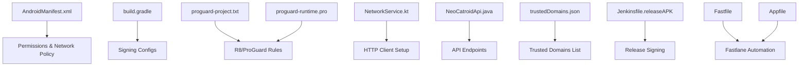

**Diagram sources**
- [AndroidManifest.xml](file://catroid/src/main/AndroidManifest.xml)
- [build.gradle](file://catroid/build.gradle)
- [proguard-project.txt](file://catroid/proguard-project.txt)
- [proguard-runtime.pro](file://catroid/proguard-runtime.pro)
- [NetworkService.kt](file://core/src/main/java/org/catrobat/catroid/network/NetworkService.kt)
- [NeoCatroidApi.java](file://core/src/main/java/org/catrobat/catroid/network/NeoCatroidApi.java)
- [trustedDomains.json](file://catroid/src/main/assets/trustedDomains.json)
- [Jenkinsfile.releaseAPK](file://Jenkinsfile.releaseAPK)
- [Fastfile](file://fastlane/Fastfile)
- [Appfile](file://fastlane/Appfile)

**Section sources**
- [AndroidManifest.xml](file://catroid/src/main/AndroidManifest.xml)
- [build.gradle](file://catroid/build.gradle)
- [proguard-project.txt](file://catroid/proguard-project.txt)
- [proguard-runtime.pro](file://catroid/proguard-runtime.pro)
- [NetworkService.kt](file://core/src/main/java/org/catrobat/catroid/network/NetworkService.kt)
- [NeoCatroidApi.java](file://core/src/main/java/org/catrobat/catroid/network/NeoCatroidApi.java)
- [trustedDomains.json](file://catroid/src/main/assets/trustedDomains.json)
- [Jenkinsfile.releaseAPK](file://Jenkinsfile.releaseAPK)
- [Fastfile](file://fastlane/Fastfile)
- [Appfile](file://fastlane/Appfile)

## Core Components
- Code signing and certificate management:
  - Release signing configured in build scripts and orchestrated by CI/CD pipelines.
  - Fastlane automates signing and distribution tasks.
- APK hardening:
  - R8/ProGuard rules defined in dedicated rule files to shrink, optimize, and obfuscate code.
- Permission management:
  - Permissions declared in the Android manifest; follow least privilege by requesting only necessary ones.
- Secure storage:
  - Use Android Keystore for cryptographic keys and secrets.
- Secure communication:
  - HTTPS/TLS enforced via HTTP client configuration and optional domain allowlists.
- Input validation and sanitization:
  - Validate and sanitize all user inputs before processing or rendering.
- SQL injection prevention:
  - Parameterized queries and ORM usage to avoid string concatenation.
- XSS protection:
  - Escape output when rendering HTML or executing scripts.
- Secure API design:
  - Centralized API endpoints with consistent error handling and authentication headers.
- Network security:
  - Network security policy configuration and trusted domains list.
- OAuth and sessions:
  - Implement PKCE-based OAuth flows and short-lived tokens with refresh mechanisms.
- Encryption:
  - Encrypt sensitive data at rest using Keystore-backed algorithms; enforce TLS for data in transit.

**Section sources**
- [build.gradle](file://catroid/build.gradle)
- [proguard-project.txt](file://catroid/proguard-project.txt)
- [proguard-runtime.pro](file://catroid/proguard-runtime.pro)
- [AndroidManifest.xml](file://catroid/src/main/AndroidManifest.xml)
- [NetworkService.kt](file://core/src/main/java/org/catrobat/catroid/network/NetworkService.kt)
- [NeoCatroidApi.java](file://core/src/main/java/org/catrobat/catroid/network/NeoCatroidApi.java)
- [trustedDomains.json](file://catroid/src/main/assets/trustedDomains.json)
- [Jenkinsfile.releaseAPK](file://Jenkinsfile.releaseAPK)
- [Fastfile](file://fastlane/Fastfile)
- [Appfile](file://fastlane/Appfile)

## Architecture Overview
The security architecture integrates build-time protections (signing, hardening), runtime protections (permissions, Keystore, TLS), and pipeline automation (CI/CD). The network layer centralizes secure communications and enforces policies.

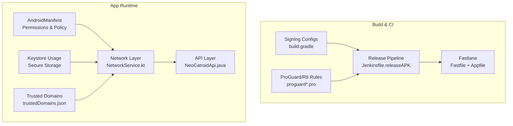

**Diagram sources**
- [build.gradle](file://catroid/build.gradle)
- [proguard-project.txt](file://catroid/proguard-project.txt)
- [proguard-runtime.pro](file://catroid/proguard-runtime.pro)
- [Jenkinsfile.releaseAPK](file://Jenkinsfile.releaseAPK)
- [Fastfile](file://fastlane/Fastfile)
- [Appfile](file://fastlane/Appfile)
- [AndroidManifest.xml](file://catroid/src/main/AndroidManifest.xml)
- [NetworkService.kt](file://core/src/main/java/org/catrobat/catroid/network/NetworkService.kt)
- [NeoCatroidApi.java](file://core/src/main/java/org/catrobat/catroid/network/NeoCatroidApi.java)
- [trustedDomains.json](file://catroid/src/main/assets/trustedDomains.json)

## Detailed Component Analysis

### Code Signing and Certificate Management
- Build-time signing configuration is defined in the module’s build script.
- CI/CD pipelines orchestrate signing during release builds.
- Fastlane automates signing steps and artifact publishing.

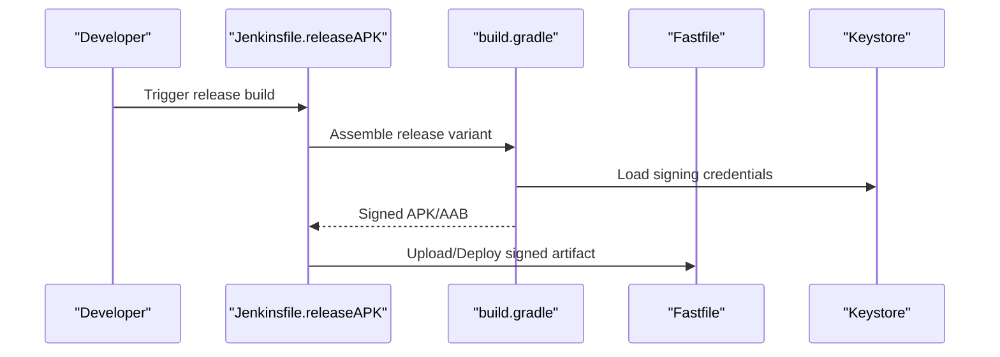

**Diagram sources**
- [Jenkinsfile.releaseAPK](file://Jenkinsfile.releaseAPK)
- [build.gradle](file://catroid/build.gradle)
- [Fastfile](file://fastlane/Fastfile)
- [Appfile](file://fastlane/Appfile)

**Section sources**
- [build.gradle](file://catroid/build.gradle)
- [Jenkinsfile.releaseAPK](file://Jenkinsfile.releaseAPK)
- [Fastfile](file://fastlane/Fastfile)
- [Appfile](file://fastlane/Appfile)

### APK Hardening with ProGuard/R8
- Obfuscation, shrinking, and optimization are controlled by ProGuard/R8 rule files.
- Separate rules exist for core app and runtime components.

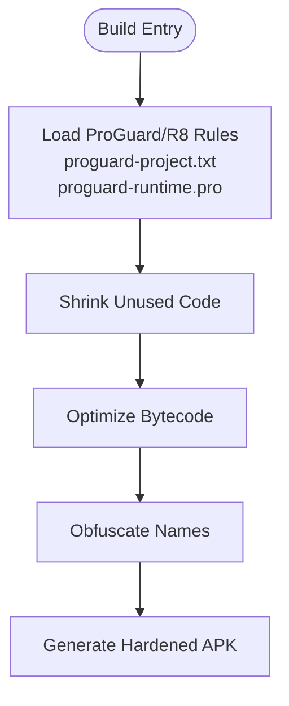

**Diagram sources**
- [proguard-project.txt](file://catroid/proguard-project.txt)
- [proguard-runtime.pro](file://catroid/proguard-runtime.pro)

**Section sources**
- [proguard-project.txt](file://catroid/proguard-project.txt)
- [proguard-runtime.pro](file://catroid/proguard-runtime.pro)

### Permission Management (Least Privilege)
- Declare only required permissions in the manifest.
- Request runtime permissions dynamically when needed.
- Audit permissions regularly to remove unused ones.

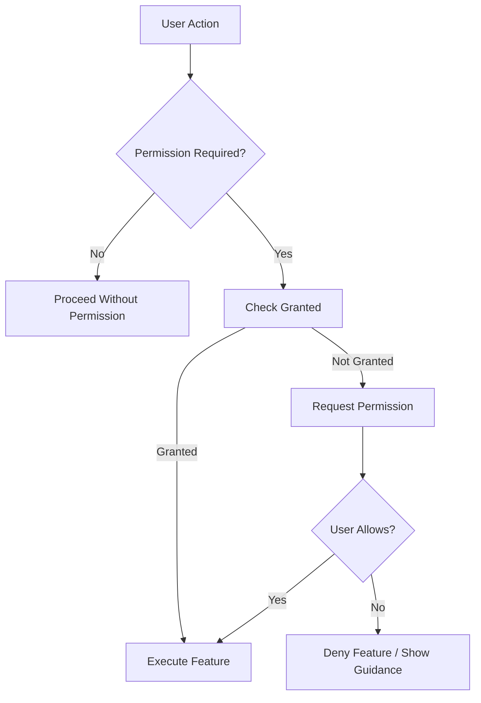

[No sources needed since this diagram shows conceptual workflow, not actual code structure]

**Section sources**
- [AndroidManifest.xml](file://catroid/src/main/AndroidManifest.xml)

### Secure Storage Using Android Keystore
- Store cryptographic keys and secrets in Android Keystore.
- Avoid storing plaintext secrets in SharedPreferences or assets.
- Use alias-based key retrieval and associate keys with hardware-backed backends when available.

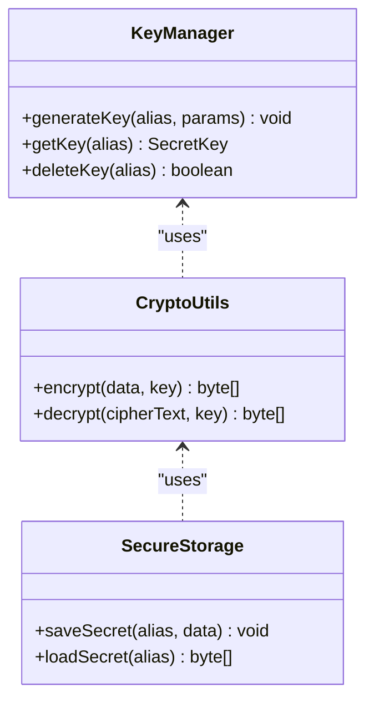

[No sources needed since this diagram shows conceptual workflow, not actual code structure]

**Section sources**
- [AndroidManifest.xml](file://catroid/src/main/AndroidManifest.xml)

### Secure Communication (HTTPS/TLS)
- Enforce HTTPS for all network calls.
- Configure trust anchors and certificate pinning if required.
- Maintain a trusted domains list to restrict outbound connections.

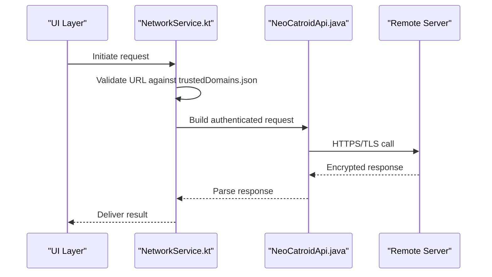

**Diagram sources**
- [NetworkService.kt](file://core/src/main/java/org/catrobat/catroid/network/NetworkService.kt)
- [NeoCatroidApi.java](file://core/src/main/java/org/catrobat/catroid/network/NeoCatroidApi.java)
- [trustedDomains.json](file://catroid/src/main/assets/trustedDomains.json)

**Section sources**
- [NetworkService.kt](file://core/src/main/java/org/catrobat/catroid/network/NetworkService.kt)
- [NeoCatroidApi.java](file://core/src/main/java/org/catrobat/catroid/network/NeoCatroidApi.java)
- [trustedDomains.json](file://catroid/src/main/assets/trustedDomains.json)

### Input Validation, SQL Injection Prevention, XSS Protection
- Validate inputs at boundaries (network, UI, file parsing).
- Use parameterized queries or ORM to prevent SQL injection.
- Escape or sanitize outputs to prevent XSS.

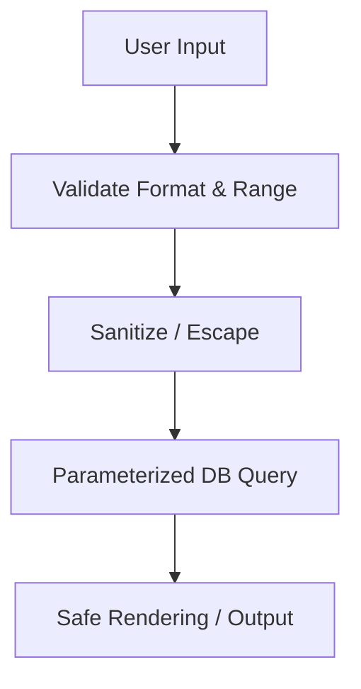

[No sources needed since this diagram shows conceptual workflow, not actual code structure]

**Section sources**
- [NeoCatroidApi.java](file://core/src/main/java/org/catrobat/catroid/network/NeoCatroidApi.java)

### Secure API Design Patterns
- Centralize endpoints and request/response models.
- Apply consistent authentication headers and error codes.
- Version APIs and deprecate insecure versions.

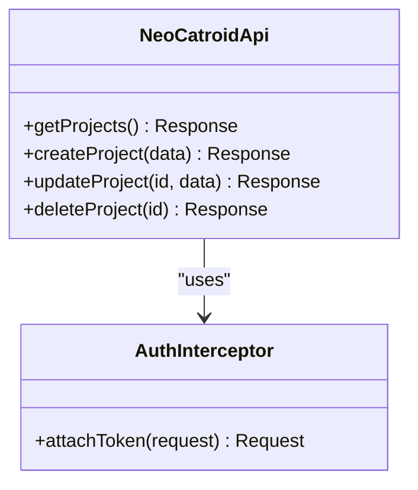

**Diagram sources**
- [NeoCatroidApi.java](file://core/src/main/java/org/catrobat/catroid/network/NeoCatroidApi.java)

**Section sources**
- [NeoCatroidApi.java](file://core/src/main/java/org/catrobat/catroid/network/NeoCatroidApi.java)

### Network Security Configuration
- Define network security policy to block cleartext traffic and enforce TLS.
- Optionally whitelist specific domains for development or legacy services.

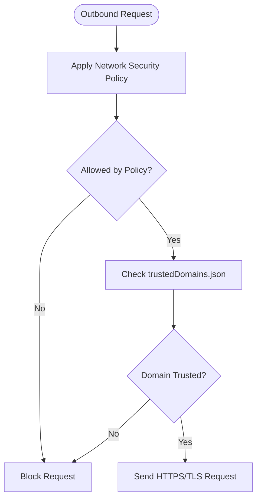

**Diagram sources**
- [AndroidManifest.xml](file://catroid/src/main/AndroidManifest.xml)
- [trustedDomains.json](file://catroid/src/main/assets/trustedDomains.json)

**Section sources**
- [AndroidManifest.xml](file://catroid/src/main/AndroidManifest.xml)
- [trustedDomains.json](file://catroid/src/main/assets/trustedDomains.json)

### OAuth Authentication Flow and Session Management
- Implement PKCE-based OAuth for secure authorization.
- Use short-lived access tokens and refresh tokens securely stored in Keystore.
- Invalidate sessions on logout and handle token expiration gracefully.

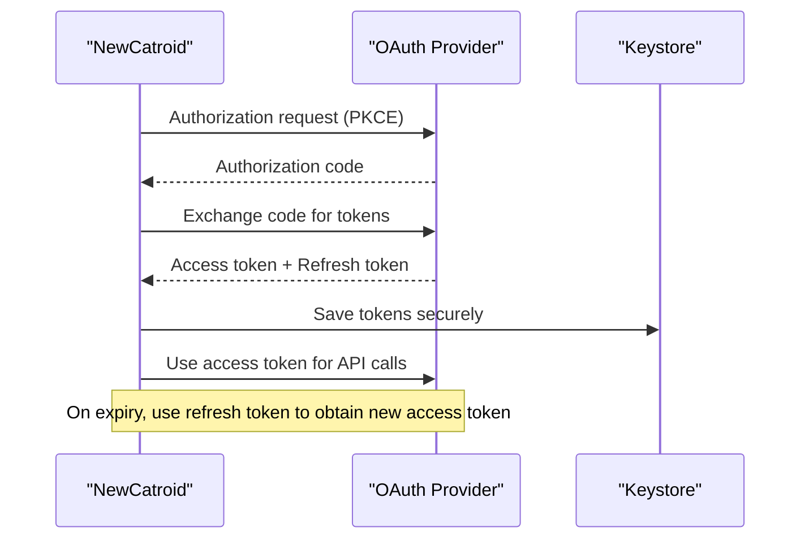

[No sources needed since this diagram shows conceptual workflow, not actual code structure]

**Section sources**
- [NetworkService.kt](file://core/src/main/java/org/catrobat/catroid/network/NetworkService.kt)
- [NeoCatroidApi.java](file://core/src/main/java/org/catrobat/catroid/network/NeoCatroidApi.java)

### Data Encryption at Rest and in Transit
- At rest: Encrypt sensitive files and preferences using Keystore-backed ciphers.
- In transit: Enforce HTTPS/TLS across all network requests; validate certificates.

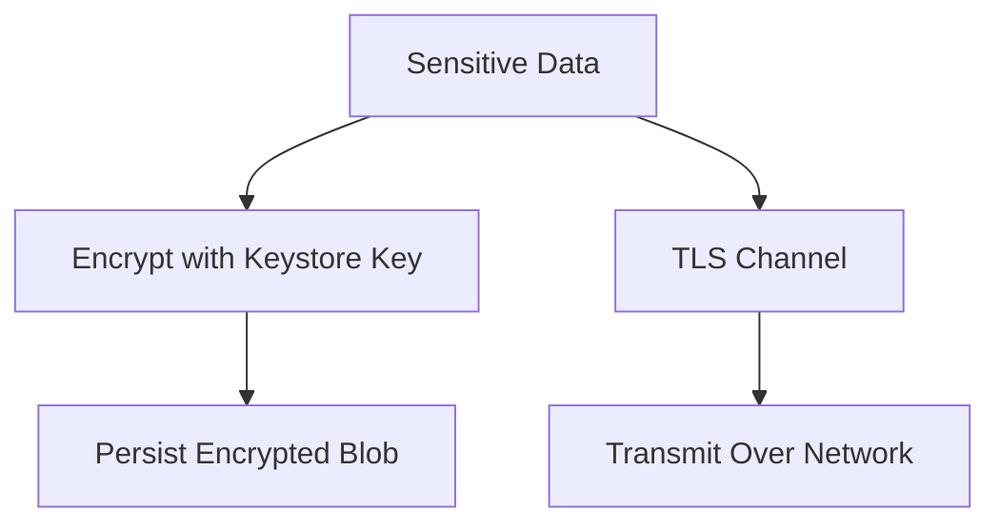

[No sources needed since this diagram shows conceptual workflow, not actual code structure]

**Section sources**
- [AndroidManifest.xml](file://catroid/src/main/AndroidManifest.xml)
- [NetworkService.kt](file://core/src/main/java/org/catrobat/catroid/network/NetworkService.kt)

## Dependency Analysis
Security-related dependencies span build-time, runtime, and CI/CD layers. The diagram highlights how signing, hardening, and network policies interact.

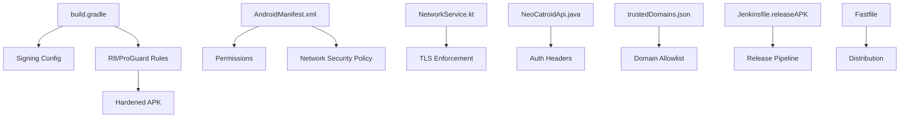

**Diagram sources**
- [build.gradle](file://catroid/build.gradle)
- [proguard-project.txt](file://catroid/proguard-project.txt)
- [proguard-runtime.pro](file://catroid/proguard-runtime.pro)
- [AndroidManifest.xml](file://catroid/src/main/AndroidManifest.xml)
- [NetworkService.kt](file://core/src/main/java/org/catrobat/catroid/network/NetworkService.kt)
- [NeoCatroidApi.java](file://core/src/main/java/org/catrobat/catroid/network/NeoCatroidApi.java)
- [trustedDomains.json](file://catroid/src/main/assets/trustedDomains.json)
- [Jenkinsfile.releaseAPK](file://Jenkinsfile.releaseAPK)
- [Fastfile](file://fastlane/Fastfile)

**Section sources**
- [build.gradle](file://catroid/build.gradle)
- [proguard-project.txt](file://catroid/proguard-project.txt)
- [proguard-runtime.pro](file://catroid/proguard-runtime.pro)
- [AndroidManifest.xml](file://catroid/src/main/AndroidManifest.xml)
- [NetworkService.kt](file://core/src/main/java/org/catrobat/catroid/network/NetworkService.kt)
- [NeoCatroidApi.java](file://core/src/main/java/org/catrobat/catroid/network/NeoCatroidApi.java)
- [trustedDomains.json](file://catroid/src/main/assets/trustedDomains.json)
- [Jenkinsfile.releaseAPK](file://Jenkinsfile.releaseAPK)
- [Fastfile](file://fastlane/Fastfile)

## Performance Considerations
- Minimize overhead from frequent cryptographic operations by caching encrypted blobs and reusing cipher instances where safe.
- Keep TLS handshake costs low by enabling connection reuse and appropriate timeouts.
- Balance R8 optimizations with feature stability; review logs after enabling aggressive shrinking.

[No sources needed since this section provides general guidance]

## Troubleshooting Guide
- If network requests fail due to policy, verify that the target domain is present in the trusted domains list and that HTTPS is enforced.
- If signing fails during release, check keystore paths and credentials in build and CI configurations.
- If features require permissions, ensure runtime permission prompts are handled and fallback behavior is clear.

**Section sources**
- [trustedDomains.json](file://catroid/src/main/assets/trustedDomains.json)
- [build.gradle](file://catroid/build.gradle)
- [Jenkinsfile.releaseAPK](file://Jenkinsfile.releaseAPK)

## Conclusion
NewCatroid’s security posture combines robust build-time protections (signing, hardening), strict runtime controls (permissions, Keystore, TLS), and automated CI/CD processes. By enforcing least privilege, securing storage and communications, validating inputs, and following secure API patterns, the application mitigates common vulnerabilities and aligns with OWASP guidelines. Continuous security testing and monitoring further strengthen resilience.

[No sources needed since this section summarizes without analyzing specific files]

## Appendices

### OWASP Compliance Checklist
- A01 Broken Access Control: Enforce server-side checks; limit client-side enforcement.
- A02 Cryptographic Failures: Use Keystore and TLS; rotate keys periodically.
- A03 Injection: Parameterized queries; sanitize inputs.
- A04 Insecure Design: Threat model and secure defaults.
- A05 Security Misconfiguration: Harden manifests, disable debug flags in release.
- A06 Vulnerable Components: Update dependencies; monitor advisories.
- A07 Identification and Authentication Flaws: PKCE OAuth; short-lived tokens.
- A08 Software and Data Integrity Failures: Verify signatures; integrity checks.
- A09 Security Logging and Monitoring: Log security events; alert on anomalies.
- A10 SSRF: Validate URLs; restrict outbound calls.

[No sources needed since this section provides general guidance]

### Security Testing Methodologies
- Static analysis: Integrate lint, PMD, Detekt into CI.
- Dynamic analysis: Fuzz inputs; test TLS and certificate validation.
- Penetration testing: Focus on auth flows, API endpoints, and storage.
- Dependency scanning: Track known vulnerabilities in third-party libraries.

[No sources needed since this section provides general guidance]